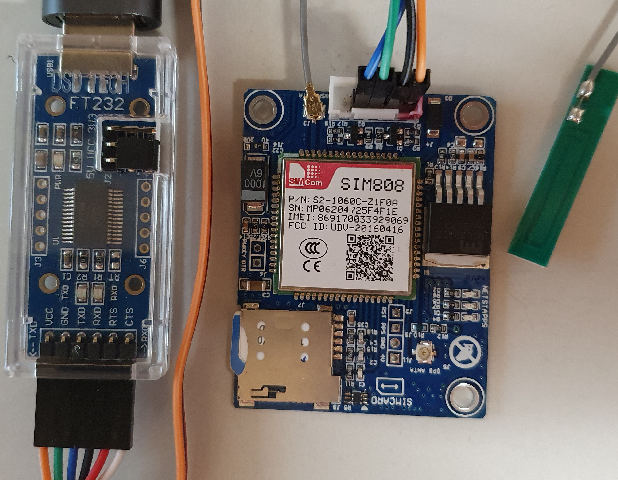

Letzte &Auml;nderung: 25.8.2021   
<table><tr><td></img></td><td>&nbsp;</td><td>
<h1>Raspberry Pi: Senden und Empfangen von SMS über MQTT in C++</h1>
<a href="liesmich.md">==> Startseite</a> &nbsp; &nbsp; &nbsp; 
<a href="m4h10_RasPiCppSms_e.md">==> English version</a> &nbsp; &nbsp; &nbsp; 
</td></tr></table>

  
## Ziel
* Umwandlung von SMS in MQTT-Nachrichten und umgekehrt.   
   

## Erforderliche Hilfsmittel (Stand August 2021)
* Hardware: RasPi   
* Hardware: SIM808 Modul GSM mit GPS Antenne f&uuml;r 3G 4G SIM Karte zB von [AliExpress](https://de.aliexpress.com/item/1005002384541464.html?spm=a2g0s.9042311.0.0.5c824c4dqUu43E) oder [Amazon](https://www.amazon.de/dp/B09CM8TSX9/ref=sspa_dk_detail_0?psc=1&pd_rd_i=B09CM8TSX9&pd_rd_w=yNPjf&pf_rd_p=4f2ceb27-95e9-46ab-8808-db390b56ec01&pd_rd_wg=Muvvr&pf_rd_r=3NTH9ZQRZNE3VBZKD1YV&pd_rd_r=58ca39f9-b9f0-40b5-9b14-7f5d8a37ce1d&spLa=ZW5jcnlwdGVkUXVhbGlmaWVyPUEzN1A5OTA0NUNBTTA2JmVuY3J5cHRlZElkPUEwMzcxNzc3MlkxMFpaUTBTRjhYMSZlbmNyeXB0ZWRBZElkPUEwNzU2MTYzMjRJSlNTREJMTjVHSiZ3aWRnZXROYW1lPXNwX2RldGFpbCZhY3Rpb249Y2xpY2tSZWRpcmVjdCZkb05vdExvZ0NsaWNrPXRydWU=)   
* Hardware: Breadboard Jumper Drähte weiblich auf weiblich 4polig zB von [Amazon](https://www.amazon.de/Female-Female-Male-Female-Male-Male-Steckbr%C3%BCcken-Drahtbr%C3%BCcken-bunt/dp/B01EV70C78/ref=sr_1_1_sspa?__mk_de_DE=%C3%85M%C3%85%C5%BD%C3%95%C3%91&dchild=1&keywords=Breadboard+Jumper+Dr%C3%A4hte&qid=1629911840&sr=8-1-spons&psc=1&spLa=ZW5jcnlwdGVkUXVhbGlmaWVyPUEzRVMzTE5FRDJTWjJSJmVuY3J5cHRlZElkPUEwODQwNzA5MUZGVVRTNVE1WDBBTiZlbmNyeXB0ZWRBZElkPUExMDAwNjg1MUFSNzFTUlhGM0hSOSZ3aWRnZXROYW1lPXNwX2F0ZiZhY3Rpb249Y2xpY2tSZWRpcmVjdCZkb05vdExvZ0NsaWNrPXRydWU=)   
* Hardware: DSD TECH USB zu TTL Seriell Adapter Konverter SH-U09C mit FTDI FT232RL zB von [Amazon](https://www.amazon.de/gp/product/B07BBPX8B8/ref=ppx_yo_dt_b_asin_title_o09_s00?ie=UTF8&psc=1) oder DSD TECH USB zu TTL Seriell Adapter Konverter SH-U09C5 zB von [Amazon](https://www.amazon.de/DSD-TECH-SH-U09C5-Konverterkabel-Unterst%C3%BCtzung/dp/B07WX2DSVB/ref=sr_1_10?__mk_de_DE=%C3%85M%C3%85%C5%BD%C3%95%C3%91&dchild=1&keywords=DSD+TECH+USB+zu+TTL+Seriell+Adapter+Konverter&qid=1629910857&s=computers&sr=1-10)   
* Hardware: USB-Verlängerungskabel USB A Stecker auf A Buchse zB [PIPIKA USB 3.0 Verlängerung von Amazon](https://www.amazon.de/Verl%C3%A4ngerung-Verl%C3%A4ngerungskabel-Superschnelle-Vergoldeten-Kartenleseger%C3%A4t/dp/B08BHWJLLS/ref=sr_1_4?__mk_de_DE=%C3%85M%C3%85%C5%BD%C3%95%C3%91&dchild=1&keywords=USB+verl%C3%A4ngerungskabel+A-Buchse+1m&qid=1629911382&smid=A3PTYKYXFT73EG&sr=8-4)   
* Hardware: SIM-Karte zB [in Österreich HOT von Hofer/Aldi](https://www.hot.at/tarife.html?gclid=CjwKCAjw1JeJBhB9EiwAV612y80Gd6MxAkyvJRJ2BAeTtinSp9OnIBslTwBgd_B-iJANhbW7v5TQSBoCckgQAvD_BwE) mit Tarif "HoT flex-unser Basistarif ohne Fixkosten".
---   
* Software: Internetzugang zu GitHub   
* Software: Terminal-Programm [putty](https://www.chiark.greenend.org.uk/~sgtatham/putty/latest.html) auf dem PC/Laptop   
* Software: Eventuell   
   [Visual Studio Code](https://code.visualstudio.com/) und   
   [WinSCP](https://winscp.net/eng/docs/lang:de) zur Daten&uuml;bertragung vom PC/Laptop zum RasPi   

## Beschreibung der Hardware
Zum Senden und Empfangen von SMS ist zumindest ein SIM-Modul und eine SIM-Karte erforderlich. Das SIM-Modul kann entweder
* an die Pins des RasPi angeschlossen werden (Pin 2-5V, Pin 6-GND, Pin 8-TxD0 und Pin 10-RxD0), wobei eine Pegelanpassung 5V/3V3 erforderlich ist, oder   
* über einen USB-Serial-Adapter am RasPi angeschlossen werden.   

Einfacher, aber etwas teurer, ist der Anschluss über einen USB-Serial-Adapter:   
   
_Bild 1: Modul SIM808 mit USB-Serial-Adapter_   
Beim Verbinden des SIM-Moduls mit dem USB-Serial-Adapter oder RasPi ist darauf zu achten, dass die Pins TxD mit RxD und RxD mit TxD verbunden werden ("auskreuzen" der Datenleitungen).   

Weiters wird eine SIM-Karte benötigt, wobei für viele Anwendungen eine Prepaid-Karte ausreicht, da dann keine Fixkosten anfallen.   

## Erstellung des Programms m4hSms
Die Erstellung der ausführbaren Datei erfolgt gleich wie in Kapitel [Raspberry Pi: Hilfreiche Einzel-Programme in C++](m4h08_RasPiCppDemos.md) beschrieben.

## Beschreibung der Konfigurationsmöglichkeiten
Die Konfiguration des Programms m4hSms erfolgt mit Hilfe der Konfigurationsdatei `m4h.conf`. Dabei sind in der Sektion `[sms]` folgende Einträge erforderlich:   
* `device:` Schnittstelle, an der das SIM-Modul angeschlossen ist. Mögliche Werte sind `ttyS0` für die serielle Schnittstelle oder `ttyUSB0`, `ttyUSB1` usw. für die USB-Schnittstelle.   
* `from` : 
