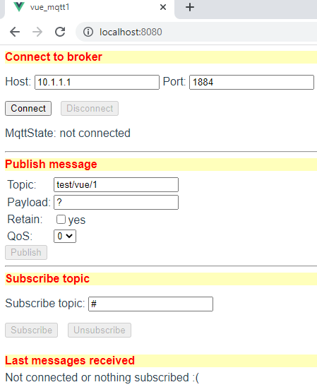

Last modified: 2021-10-03   
<table><tr><td></td><td>&nbsp;</td><td>
<h1>Vue: Sending and receiving MQTT messages</h1>
<a href="../readme.md">==> Home page</a> &nbsp; &nbsp; &nbsp; 
<a href="m4h23_Vue_Mqtt1.md">==> German version</a> &nbsp; &nbsp; &nbsp; 
</td></tr></table><hr>

## Target
* Create a Vue application that can be used to send and subscribe/view MQTT messages:   
   
_Figure 1: Start page of the MQTT transmit/receive program_.   

__The program shall consist of five parts:__.   
1. an MQTT client, which provides the MQTT functions.   
2. a GUI component that can be used to connect to a broker.   
   The host on which the broker is running (e.g. IP 10.1.1.1) and the port for the WebSocket connection (e.g. 1884) can be entered in input fields.   
3. a GUI component that can be used to send a message.   
   It is possible to enter the topic, payload, whether the message should be saved ("retain") and the QoS level (Quality of Service).   
4. a GUI component, with which one can subscribe to a topic.   
5. a GUI component that shows the last 5 messages for the subscribed topic.   

_For the impatient_: [link to finished program](https://github.com/khartinger/mqtt4home/tree/main/source_Vue/vue_mqtt1)

## Requirements
* Some knowledge about HTML, CSS and JavaScript/Typescript :)   
* Visual Studio code that is already prepared for Vue applications.   
   (I.e. (at least) one Vue application has already been created in Visual Code).   

## Required tools
* Hardware: PC or laptop with internet access, browser.
* Software: Visual Studio Code, node.js, npm

## Preparation of the Vue project in VSC (short version).   
1. start Visual Studio Code (VSC).   
2. VSC: Open terminal window: 'Men&uuml;Terminal - New Terminal'.   
3. VSC terminal: Change to the folder where the Vue project should be created: `cd /g/github/mqtt4home/source_Vue`.   
4. VSC-Terminal: Create Vue.js application: `vue create mqtt1`.  
   Use cursor keys, space bar and &lt;Enter&gt; to select the following:   
   `> Select features manually`   
   `(*) Select Vue version`   
   `(*) Babel`   
   `(*) TypeScript`   
   `(*) Router`   
   `(*) Linter / Formatter`   
   `> 3.x`   
   `? Use component syntax in class style? No`   
   `? Use Babel alongside TypeScript (required for modern mode, autodetected polyfills, transpiling of JSX)? No`   
   `? Use history mode for router? (Requires proper server setup for index fallback in production) No` `?   
   `? Choose a linter/formatter configuration: ESLint + default configuration` ?   
   `? Choose additional lint functions: Lint on save`   
   `? Where do you want to store the configuration for Babel, ESLint etc.? In a separate configuration file`   
   `? Save this as a preset for future projects? (y/N) N`.   
5. change to the project folder: VSC menu File - Open Folder .
6. install MQTT library: `npm install mqtt --save`.   

## 1. creation of the MQTT client
The MQTT client consists of two files, which are located in the directory `services`.   
The file `MqttClient.ts` contains the four interfaces `Message`, `MqttState`, `MqttConnection`, `MqttSubscription` and the class `MqttClient`.   
The interfaces are used in the `MqttClient` class to store information about the connection and subscription state. Furthermore, methods are provided for the following purposes:   
   * `connectUrl ........` Assembly of the connection URL.   
   * `connect ...........` Connecting to the broker   
   * `disconnect ........` Disconnect from the broker   
   * `subscribe .........` Subscribe to a topic   
   * `unsubscribe .......` Disconnect from subscribing to a topic   
   * `publish ...........` Publish a message   
   * `sConnMqttState ....` Connection state as text ("connected" etc.)   
   * `registerController ` Register a controller so that it can get messages forwarded (and evaluate them in the `onMessage` method).   

Coding of the file [`MqttClient.ts` see `https://github.com/khartinger/mqtt4home/blob/main/source_Vue/vue_mqtt1/src/services/MqttClient.ts`](https://github.com/khartinger/mqtt4home/blob/main/source_Vue/vue_mqtt1/src/services/MqttClient.ts)


The file `MqttClientInstance.ts` exports the connection object `mqttClientInstance`.   
Furthermore, all MQTT controllers must be registered in this file:   
```   
// ______mqttClientInstance.ts__________________________________
import { MqttClient } from './MqttClient'.
import { mqttLastXController } from '.@/controller/MqttLastXController'.

export const mqttClientInstance = new MqttClient()
mqttClientInstance.registerController(mqttLastXController)
```   

## 2. connection GUI


## Customizations in `App.vue`
