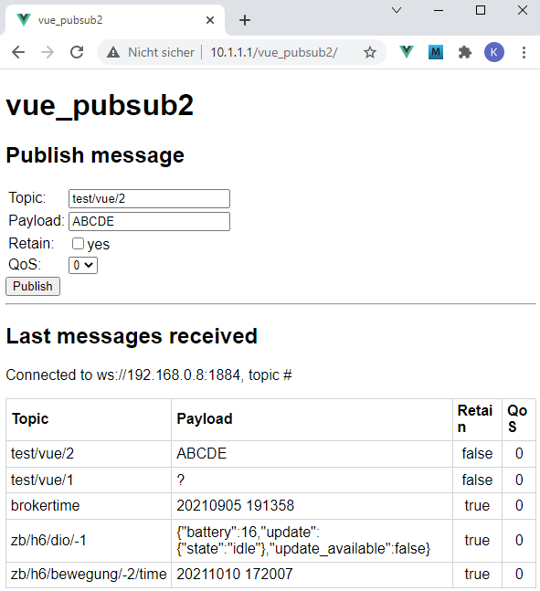

Letzte &Auml;nderung: 7.10.2021   
<table><tr><td></img></td><td>&nbsp;</td><td>
<h1>Vue + RasPi: Senden und Empfangen von MQTT-Nachrichten</h1>
<a href="../liesmich.md">==> Startseite</a> &nbsp; &nbsp; &nbsp; 
<a href="m4h24_Vue_PubSub2.md">==> English version</a> &nbsp; &nbsp; &nbsp; 
</td></tr></table><hr>
  
## Ziel
* Erstellen einer Vue-Anwendung, die auf dem Raspberry Pi läuft und mit der MQTT-Nachrichten gesendet und automatisch abonniert bzw. angezeigt werden k&ouml;nnen:   
   
_Bild 1: MQTT-Sende- und Empfangsprogramm_   
Der Aufruf der Anwendung soll durch Eingabe der URL `10.1.1.1/vue_pubsub2` erfolgen.   

__Das Programm soll aus drei Teilen bestehen:__   
1. Ein MQTT Client, der die MQTT Funktionen zur Verf&uuml;gung stellt.   
2. Eine GUI-Komponente, mit deren Hilfe man eine Nachricht versenden kann.   
   Es ist die Eingabe von Topic, Payload, ob die Nachricht gespeichert werden soll ("retain") und vom QoS-Level (Quality of Service) m&ouml;glich.   
3. Eine GUI-Komponente, die f&uuml;r das vorgegebene Topic die letzten 5 Nachrichten anzeigt.   

Um das Vue-Projekt übersichtlich (und leicht erweiterbar) zu gestalten, werden die Dateien auf verschiedene Unterverzeichnisse verteilt.

_F&uuml;r Ungeduldige_: [Link zum fertigen Programm](https://github.com/khartinger/mqtt4home/tree/main/source_Vue/vue_pubsub2)

## Voraussetzungen
* Etwas Wissen &uuml;ber HTML, CSS und JavaScript/Typescript :)   
* Visual Studio Code ("VSC"), das f&uuml;r Vue-Anwendungen bereits vorbereitet ist.   
   (Dh. es wurde bereits (mindestens) eine Vue-Anwendung in Visual Code erstellt.)   

## Erforderliche Hilfsmittel
* Hardware: RasPi
* Hardware: PC oder Laptop mit Internetzugang, Browser
* Software: Internetzugang
* Software: Visual Studio Code, node.js, npm
* Software: Terminal-Programm [putty](https://www.chiark.greenend.org.uk/~sgtatham/putty/latest.html) auf dem PC/Laptop
* Software: [WinSCP](https://winscp.net/eng/docs/lang:de) zur Daten&uuml;bertragung vom PC/Laptop zum RasPi   

## Vorbereitung des Vue-Projektes in VSC (Kurzfassung)   
1. Visual Studio Code (VSC) starten.   
2. VSC: Terminal-Fenster &ouml;ffnen: Men&uuml; Terminal - New Terminal.   
3. VSC-Terminal: In den Ordner wechseln, unter dem das Vue-Projekt erzeugt werden soll:   
   `cd /g/github/mqtt4home/source_Vue`   
4. VSC-Terminal: Vue.js Applikation erzeugen: `vue create vue_pubsub2`  
   Mit Cursortasten, Leertaste und &lt;Enter&gt; Folgendes ausw&auml;hlen:   
   `> Manually select features`   
   `(*) Choose Vue version`   
   `(*) Babel`   
   `(*) TypeScript`   
   `( ) Router`   
   `(*) Linter / Formatter`   
   `> 3.x`   
   `? Use class-style component syntax? No`   
   `? Use Babel alongside TypeScript (required for modern mode, auto-detected polyfills, transpiling JSX)? No`   
   `? Use history mode for router? (Requires proper server setup for index fallback in production) No`   
   `? Pick a linter / formatter config: ESLint + Standard config`   
   `? Pick additional lint features: Lint on save`   
   `? Where do you prefer placing config for Babel, ESLint, etc.? In dedicated config file`   
   `? Save this as a preset for future projects? (y/N) N`   
5. In den Projektordner wechseln: VSC Men&uuml; Datei - Ordner &ouml;ffnen..
6. MQTT Bibliothek installieren: Men&uuml; Terminal - New Terminal: `npm install mqtt --save`   

## Teil 1: Erstellung des MQTT Clients
Der MQTT Client besteht aus drei Dateien, die sich auf die (neu zu erstellenden) Verzeichnisse `services` und `controller ` verteilen:   
1. `./src/services/MqttClient.ts`   
2. `./src/services/MqttClientInstance.ts`   
3. `./src/controller/DeviceController.ts`   

### 1. Erstellung der MqttClient-Klasse
* Anlegen des Verzeichnisses `services`:   
   Men&uuml; Anzeigen - Explorer. Mit der rechten Maustaste auf `src` klicken - "Neuer Ordner" wählen und `services` eingeben.   
* Die Datei `MqttClient.ts` anlegen:   
   Men&uuml; Anzeigen - Explorer. Mit der rechten Maustaste auf `services` klicken - "Neue Datei" wählen und `MqttClient.ts` eingeben.   
   Der Inhalt für diese Datei findet sich auf auf [`https://github.com/khartinger/mqtt4home/blob/main/source_Vue/vue_pubsub2/src/services/MqttClient.ts`](https://github.com/khartinger/mqtt4home/blob/main/source_Vue/vue_pubsub2/src/services/MqttClient.ts)   

#### Kurze Erklärung
   Die Datei enth&auml;lt die vier Interfaces `Message`, `MqttState`, `MqttConnection`, `MqttSubscription` sowie die Klasse `MqttClient`.   
   Die Interfaces werden in der Klasse `MqttClient` dazu verwendet, Informationen zum Verbindungs- und Abonnierungszustand zu speichern. Weiters werden Methoden f&uuml;r folgende Zwecke zur Verf&uuml;gung gestellt:   
   * `connectUrl ...........` Zusammenbau der Verbindungs-URL aus Host, Port und MQTT-Endpunkt   
   * `connect ..............` Aufbau der Verbindung zum Broker   
   * `disconnect ...........` L&ouml;sen der Verbindung zum Broker   
   * `subscribe ............` Abonnieren eines Topics   
   * `unsubscribe ..........` L&ouml;sen des Abonnieren eines Topics   
   * `publish ..............` Ver&ouml;ffentlichen einer Nachricht   
   * `sConnMqttState .......` Verbindungszustand als Text ("connected" etc.)   
   * `hostSubscribe ........` Verbinden mit dem angegebenen Broker und abonnieren des angegebenen Topics   
   * `registerController ...` Möglichkeit zur Anmeldung eines Controllers, damit er Nachrichten weitergeleitet bekommt (und in der Methode `onMessage` auswerten kann).   

#### Spezielle Einstellungen
Über die Eigenschaft `connectOnStart` des MQTT-Status `mqttState` kann eingestellt werden, ob sich die Anwendung beim Start mit dem vorgegebenen Broker verbinden und das Topic abonnieren soll. Dabei werden folgende Vorgabewerte verwendet:   
* `mqttConnection.host .....` Vorgabe für den Host, auf dem der Broker läuft (10.1.1.1).   
* `mqttConnection.port .....` Vorgabe für den Port der WebSocket-Verbindung (1884).   
* `mqttSubscription.topic ..` Vorgabe für das Topic, das abonniert werden soll (`'#'` = alle Topics).   

### 2. Erstellung des Verbindungsobjekts MqttClientInstance
* Die Datei `MqttClientInstance.ts` anlegen:   
   Men&uuml; Anzeigen - Explorer. Mit der rechten Maustaste auf `services` klicken - "Neue Datei" wählen und `MqttClientInstance.ts` eingeben.   
   Folgendes eingeben:   
```   
// ______mqttClientInstance.ts__________________________________
import { MqttClient } from './MqttClient'
import { mqttLastXController } from '@/controller/MqttLastXController'

export const mqttClientInstance = new MqttClient()
mqttClientInstance.registerController(mqttLastXController)
```   
Die Datei erzeugt und exportiert das Verbindungsobjekt `mqttClientInstance`.   
In dieser Datei k&ouml;nnen alle MQTT-Controller registriert werden, die MQTT-Nachrichten weitergeleitet haben wollen. Im obigen Beispiel wird nur der Controller `mqttLastXController` registriert.   

### 3. Erstellen der Controller-Vorlage
* Anlegen des Verzeichnisses `controller`:   
   Men&uuml; Anzeigen - Explorer. Mit der rechten Maustaste auf `src` klicken - "Neuer Ordner" wählen und `controller` eingeben.   
* Die Datei `DeviceController.ts` anlegen:   
   Men&uuml; Anzeigen - Explorer. Mit der rechten Maustaste auf `services` klicken - "Neue Datei" wählen und `DeviceController.ts` eingeben.   
   Inhalt der Datei:
```   
// _____DeviceController.ts______________________________________
import { Message, MqttClient } from '@/services/MqttClient'
import type { QoS } from 'mqtt'
export abstract class DeviceController {
  protected client: MqttClient | null = null;

  public registerClient (mqttClient: MqttClient): void {
    this.client = mqttClient
  }

  protected async publish (topic: string, payload: string, retain: boolean, qos: QoS): Promise<void> {
    return this.client?.publish(topic, payload, retain, qos)
  }

  public abstract onMessage(message: Message): void;
}
```  
Die Basisklasse `DeviceController` sorgt dafür, dass jeder Controller, der sich beim Verbindungsobjekt `mqttClientInstance` registriert, das Client-Objekt erhält und die (abstrakte) Methode `onMessage()` konkretisieren muss.   

## Teil 2: GUI zum Senden einer Nachricht
* Die Datei `MqttPublish.vue` anlegen:   
   Men&uuml; Anzeigen - Explorer. Mit der rechten Maustaste auf `components` klicken - "Neue Datei" wählen und `MqttPublish.vue` eingeben.   
Der Inhalt für diese Datei befindet sich auf [`https://github.com/khartinger/mqtt4home/blob/main/source_Vue/vue_pubsub2/src/components/MqttPublish.vue`](https://github.com/khartinger/mqtt4home/blob/main/source_Vue/vue_pubsub2/src/components/MqttPublish.vue)


## Teil 3: GUI zum Empfangen einer Nachricht
Der Empfang einer Nachricht wird auf drei Dateien aufgeteilt, die sich in den Verzeichnissen `components`, `controller`  und `store` befinden:   
1. `./src/components/MqttLastX.vue`   
2. `./src/controller/MqttLastXController.ts`   
3. `./src/store/MessageStore.ts`   

### 1. Erstellung der Message-Anzeige (MqttLastX.vue)
In der Datei `MqttLastX.vue` werden alle Nachrichten des Arrays `messages` in einer Tabelle angezeigt, sofern eine Nachricht durch den Controller `mqttLastXController` abonniert wurde. 
* Die Datei `MqttLastX.vue` anlegen:   
   Men&uuml; Anzeigen - Explorer. Mit der rechten Maustaste auf `components` klicken - "Neue Datei" wählen und `MqttLastX.vue` eingeben.   
   Inhalt der Datei:
```   
<!-- MqttLastX.vue -->
<template>
  <div><h2>Last messages received</h2></div>
  <div v-if="isSubscribed">
    <p>
      Connected to {{ urlSubscribed }}, topic {{ subTopic }}
    </p>
    <table>
      <tr><th>Topic</th><th>Payload</th><th>Retain</th><th>QoS</th></tr>
      <tr v-for="(message, key) in messages" :key="key">
        <td class="nobr">{{ message.topic }}</td>
        <td>{{ message.payload }}</td>
        <td class="w10">{{ message.retain }}</td>
        <td class="w10">{{ message.qos }}</td>
      </tr>
    </table>
  </div>
  <div v-else>
    Not connected or nothing subscribed :(
  </div>
</template>

<script setup lang="ts">
import { messages } from '@/store/MessageStore'
import { mqttLastXController } from '@/controller/MqttLastXController'
const isSubscribed = mqttLastXController.isSubscribe()
const urlSubscribed = mqttLastXController.urlSubscribe()
const subTopic = mqttLastXController.subTopic()
</script>

<style scoped>
  table {
    table-layout: fixed;
    border: 1px solid lightgrey;
    border-collapse: collapse;
  }
  th, td {
    border: 1px solid lightgrey;
    overflow-wrap: anywhere;
    padding: .3em .3em;
  }
  td.nobr {
    white-space: nowrap;
  }
.w10 {
    text-align: center;
    white-space: nowrap;
  }
</style>
```   
Das Aussehen der Anzeige ist abhängig von den Werten, die von der Klasse `mqttLastXController` zur Verfügung gestellt werden (`isSubscribed`, `urlSubscribed`, `subTopic`, `messages`).

### 2. Erstellung des Message-Controllers (MqttLastXController.ts)
Die Datei `MqttLastXController.ts` enthält die Klasse `MqttLastXController`, die die Basisklasse `DeviceController` erweitert sowie ein Objekt `mqttLastXController`, um die Klasse zu nutzen.   

* Die Datei `MqttLastXController.ts` anlegen:   
   Men&uuml; Anzeigen - Explorer. Mit der rechten Maustaste auf `controller` klicken - "Neue Datei" wählen und `MqttLastXController.ts` eingeben.   
   Inhalt der Datei:
```   
// ______MqttLastXController.ts_________________________________
import { Message } from '@/services/MqttClient'
import { messages, addMessage } from '@/store/MessageStore'
import { DeviceController } from './DeviceController'
import { mqttClientInstance } from '@/services/MqttClientInstance'
import { computed, ComputedRef } from 'vue'

export class MqttLastXController extends DeviceController {
  private messages;
  private addMessage;

  constructor () {
    super()
    this.messages = messages
    this.addMessage = addMessage
  }

  public onMessage (message: Message): void {
    this.addMessage(message)
    console.log('MqttLastXController.ts', 'Received ' + message.topic)
  }

  public isSubscribe (): ComputedRef<boolean> {
    return computed(() => mqttClientInstance.mqttState.connected && mqttClientInstance.mqttSubscription.subscribed)
  }

  public urlSubscribe (): ComputedRef<string> {
    return computed(() => mqttClientInstance.connectUrl())
  }

  public subTopic (): ComputedRef<string> {
    return computed(() => mqttClientInstance.mqttSubscription.topic)
  }
}

export const mqttLastXController = new MqttLastXController()
```   
Mit Hilfe der import-Anweisungen werden die benötigten Objekte und Methoden aus den jeweiligen Dateien gekennzeichnet. Diese müssen dort mit "`export`" gekennzeichnet sein.   
* Im Konstruktor werden der Konstruktor der Basisklasse aufgerufen und der Nachrichtenspeicher (`messages`) sowie die Methode `addMessage` privaten Eigenschaften zugewiesen.   
* Die Methode `onMessage` fügt die empfangene Nachricht (`message`) dem Speicher-Array hinzu.   
* Die Methode `isSubscribe` stellt einen boolean-Wert zur Verfügung, der angibt, ob die Verbindung zum Broker besteht und ein Topic abonniert wurde.   
* Die Methode `urlSubscribe` liefert die URL des Brokers.   
* Die Methode `subTopic` liefert das Topic, das abonniert wurde.   
Die letzten drei Methoden werden für die Anzeige in der Datei `MqttLastX.vue` benötigt.

### 3. Speicher für die MQTT-Nachrichten
Die Datei `store/MessageStore.ts` enth&auml;lt die maximale Anzahl von Eintr&auml;gen im Speicher (`maxSize`), den Speicher f&uuml;r die Nachrichten (`messageStore`), eine Methode zum Exportieren der Nachrichten (`messages`), eine Methode zum Hinzuf&uuml;gen einer Nachricht (`addMessage`) sowie eine Methode zum L&ouml;schen des Speichers (`clearMessage`)
* Die Datei `MqttLastX.vue` anlegen:   
   * Men&uuml; Anzeigen - Explorer. Mit der rechten Maustaste auf `src` klicken - "Neuer Ordner" wählen und `store` eingeben.   
   * Mit der rechten Maustaste auf `store` klicken - "Neue Datei" wählen und `MessageStore.ts` eingeben.   
   Inhalt der Datei:
```   
// ______MessageStore.ts________________________________________
import { Message } from '@/services/MqttClient'
import { computed, reactive } from '@vue/runtime-core'

const maxSize = 5
const messageStore = reactive<Array<Message>>([])

export const messages = computed(() => {
  return messageStore.slice().reverse()
})

export const addMessage = (message: Message) => {
  messageStore.push(message)
  if (messageStore.length > maxSize) {
    messageStore.shift()
  }
}

export const clearMessage = () => {
  messageStore.splice(0, messageStore.length)
}
```   
Die empfangenen Nachrichten werden in einem Feld `messageStore` gespeichert. Damit im Laufe der Zeit das Feld nicht "unendlich groß" wird, wird die Anzahl der Elemente auf zB 5 ("`maxSize`") begrenzt.   
* Das Objekt `messages` liefert die Elemente des Feldes in umgekehrter Reihenfolge (neuestes zuerst).   
* Die Methode `addMessage` speichert die Nachricht im Feld und entfernt danach das erste (= älteste) Element.   
* Die Methode `clearMessage` entfernt alle Elemente aus dem Feld.   

## Anpassungen in `main.ts` und `App.vue`
Die Datei `main.ts` erzeugt die Anwendung (`createApp`) und startet sie (`mount`). Der Standard-Inhalt der Datei sollte durch folgende Zeilen ersetzt werden:   
```   
// ______main.ts________________________________________________
import { createApp, h } from 'vue'
import App from './App.vue'

const app = createApp({
  render: () => h(App)
})

app.mount('#app')
```   

In der Datei `App.vue` werden die einzelnen Komponenten importiert und angezeigt.   
```   
<!-- App.vue -->
<template>
<h1>vue_pubsub2</h1>
<MqttPublish></MqttPublish>
<hr>
<MqttLastX></MqttLastX>
</template>

<script lang="ts">
import { defineComponent } from 'vue'
import MqttPublish from './components/MqttPublish.vue'
import MqttLastX from './components/MqttLastX.vue'

export default defineComponent({
  name: 'App',
  components: {
    MqttPublish,
    MqttLastX
  }
})
</script>

<style>
#app {
  font-family: Avenir, Helvetica, Arial, sans-serif;
  -webkit-font-smoothing: antialiased;
  -moz-osx-font-smoothing: grayscale;
  text-align: left;
  color: black;
  margin-top: 0px;
}
</style>
```   
Anmerkung: Die #app-Style-Eigenschaften `text-align`, `color` und `margin-top` wurden geändert.
Die automatisch erstellten Dateien `components/HelloWord.vue` und `assets/logo.png` können aus dem VSC-Projekt gelöscht werden.

## Test des Projektes
### 1. Test am PC/Laptop
* Im Terminal folgendes eingeben:   
   `npm run serve`   
* Im Browser als URL fogendes eingeben:   
   `localhost:8080`   

### 2. Installation auf dem RasPi
* Um am Server zB das Verzeichnis `./vue_pubsub2` zu nutzen, muss in VSC eine Datei `vue.config.js` im Rootverzeichnis erstellt werden:   
   Men&uuml; Anzeigen - Explorer. Mit der rechten Maustaste auf das Symbol "Neue Datei" in der Zeile `VUE_PUBSUB2` klicken und `vue.config.js` eingeben.   
   Inhalt der Datei:   
```   
// ______vue.config.js__________________________________________
module.exports = {
  lintOnSave: false,
  publicPath: './',
  // publicPath: process.env.NODE_ENV === 'production' ? './vue_pubsub2/' : './',
  configureWebpack: {
    devtool: 'source-map'
  },
  chainWebpack: config => {
    config.performance
      .maxEntrypointSize(400000)
      .maxAssetSize(400000)
  }
}
```   
Mit `publicPath: './',` wird die relative Pfadangabe eingestellt und durch den `chainWebpack`-Eintrag werden Warnhinweise bezüglich der Dateigröße vermieden (indem man die maximale Dateigrößen höher setzt ;) )

* Danach muss in VSC eine "production"-Version erstellt werden.  
   Eingabe im Terminal:   
   `npm run build`   
   Die kompilierten Dateien befinden sich im Verzeichnis `dist`   
* Auf dem RaspPi muss das Verzeichnis `/var/www/html/vue_pubsub2` angelegt werden, zB mit `putty` (Befehl `mkdir /var/www/html/vue_pubsub2`) oder in `WinSCP`   
* Übertragen der Dateien mit `WinSCP`   
  Vom PC-Verzeichnis `github/mqtt4home/source_Vue/vue_pubsub2/dist`   
  ins RasPi-Verzeichnis `/var/www/html/vue_pubsub2`   
* Starten der Anwendung im Brower durch Eingabe der URL, zB   
   `http://10.1.1.1/vue_pubsub2/`   
