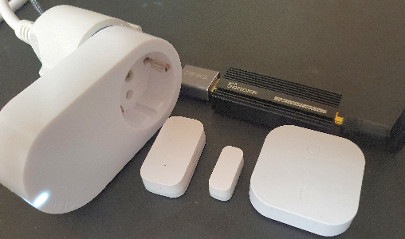

Letzte &Auml;nderung: 15.1.2022 - 18.7.2025<a name="up"></a>   
<table><tr><td></img></td><td>
<h1>Wie verbindet man Zigbee-Ger&auml;te mit MQTT?</h1>
<a href="../LIESMICH.md">==> Startseite</a> &nbsp; &nbsp; &nbsp; 
<a href="./m4h301_zbInstall_e.md">==> English version</a> &nbsp; &nbsp; &nbsp; 
</td></tr></table>


# Worum geht's?
Es gibt sehr viele Zigbee-Ger&auml;te, die sich gegen&uuml;ber WLAN-Ger&auml;ten vor allem durch den geringeren Energiebedarf auszeichnen. Will man Zigbee-Ger&auml;te &uuml;ber MQTT steuern, ben&ouml;tigt man auf der Hardware-Seite einen Zigbee-Adapter und software-seitig eine Zigbee zu MQTT Br&uuml;cke.   
In dieser Anleitung wird als Br&uuml;cke ["Zigbee2MQTT"](https://www.zigbee2mqtt.io/) verwendet. Die sehr gute (englische) Beschreibung findet man unter [https://www.zigbee2mqtt.io/](https://www.zigbee2mqtt.io/).   
Informationen &uuml;ber Zigbee selbst gibt es auf Wikipedia unter [https://de.wikipedia.org/wiki/ZigBee](https://de.wikipedia.org/wiki/ZigBee).   

### Inhalt
* [1. Was wird ben&ouml;tigt?](#x10)   
* [2. Zigbee2MQTT auf dem RasPi installieren](#x20)   
* [3. Zigbee-Komponenten ins Netzwerk einbinden](#x30)   
* [4. Nicht unterst&uuml;tzte Zigbee-Ger&auml;te](#x40)   

<a name="x10"></a>   

# 1. Was wird ben&ouml;tigt?
Siehe auch [https://www.zigbee2mqtt.io/guide/getting-started/#prerequisites](https://www.zigbee2mqtt.io/guide/getting-started/#prerequisites).   

1. Zigbee Adapter   
  * Ein auf der [Zigbee2MQTT-Seite empfohlener Adapter](https://www.zigbee2mqtt.io/guide/adapters/), zB der [CC2652P von AliExpress](https://de.aliexpress.com/item/1005002823262979.html?spm=a2g0o.9042311.0.0.75ef4c4dimTCqb) oder [SONOFF Zigbee 3.0 USB Dongle Plus von Amazon](https://www.amazon.de/gp/product/B09KXTCMSC/ref=ppx_yo_dt_b_asin_image_o00_s00?ie=UTF8&psc=1) ...   
  * ... oder der [CC Debugger Texas Instruments + Adapterkabel + CC2531 ZigBee USB-Sick von Amazon](https://www.amazon.de/gp/product/B07VH5Q54R/ref=ppx_yo_dt_b_asin_title_o00_s01?ie=UTF8&psc=1)   
  * ... oder nur den [ZigBee-USB-Stick ARCELI CC2531](https://www.amazon.de/gp/product/B07MBZMJB4/ref=ppx_yo_dt_b_asin_title_o00_s00?ie=UTF8&psc=1)   
  _Anmerkung_: Die CC2531 Adapter sind zwar preiswert, aber veraltet.     

2. Ein Raspberry Pi (RasPi), auf dem ein MQTT-Broker l&auml;uft (zB [Mosquitto](https://www.mosquitto.org/download/))   

3. Zigbee-Komponenten, zB   
  * ein T&uuml;rkontakt [Aqara MCCGQ11LM](https://www.amazon.de/Aqara-MCCGQ11LM-Window-Sensor-Fensterssensor/dp/B07D37VDM3/ref=sr_1_1?adgrpid=73755725671&gclid=Cj0KCQiAuP-OBhDqARIsAD4XHpfP6_VI6M-YTaZpFdzaoTjBVHyZQz43r4ASPPnJ6iepbU7DA2m7Ll0aAuyOEALw_wcB&hvadid=352649961577&hvdev=c&hvlocphy=1000900&hvnetw=g&hvqmt=e&hvrand=13607845984483905319&hvtargid=kwd-811095543014&hydadcr=24904_1731873&keywords=aqara+mccgq11lm&qid=1642082731&sr=8-1)   
  * eine Funksteckdose E1603 von IKEA ([903.561.66](https://www.ikea.com/at/de/p/tradfri-kabelloser-dimmer-weiss-70408595/))   
  * ein 2fach-Taster ("Kabelloser Dimmer") von IKEA ([704.085.95](https://www.ikea.com/at/de/p/tradfri-kabelloser-dimmer-weiss-70408595/))   

4. Software: Terminal-Programm [`putty`](https://www.chiark.greenend.org.uk/~sgtatham/putty/latest.html) auf dem PC/Laptop   

   
_Bild 1: Zigbee-Ger&auml;te: Funksteckdose E1603, T&uuml;rkontakt Aqara MCCGQ11LM, 2fach-Taster und im Hintergrund der Adapter SONOFF Zigbee 3.0 USB Dongle Plus mit TI CC2652P + CP2102N_   

[Zum Seitenanfang](#up)   
<a name="x20"></a>   

# 2. Zigbee2MQTT auf dem RasPi installieren
## Zigbee2MQTT herunterladen
Es gibt mehrere M&ouml;glichkeiten, Zigbee2MQTT auf dem Raspberry Pi zu installieren. Hier wird eine Version ohne Docker verwendet, die unter   
[https://www.zigbee2mqtt.io/guide/installation/01_linux.html#linux](https://www.zigbee2mqtt.io/guide/installation/01_linux.html#linux)   
zu finden ist.   
Die folgenden Befehle k&ouml;nnen entweder im Terminal-Fenster des RasPi eingegeben werden oder &uuml;ber Putty.   

1. RasPi starten, Putty auf dem PC starten.   

2. Zigbee Adapter am RasPi anstecken und pr&uuml;fen, ob er verf&uuml;gbar ist:   
  `ls -l /dev/ttyACM0`   
  `crw-rw---- 1 root dialout 166, 0 J&auml;n  9 19:30 /dev/ttyACM0`   
  Ist der Zugriff auf `ttyACM0` nicht m&ouml;glich, k&ouml;nnte die Schnittstelle zB auch `ttyUSB0` oder `ttyUSB1` sein.   

3. RasPi Package-Liste updaten und neueste Pakete installieren:   
  `sudo apt update`   
  `sudo apt full-upgrade`   

4. Node.js und weitere, ben&ouml;tigte Software installieren:   
  `sudo apt-get install -y nodejs npm git make g++ gcc`   

5. Kontrolle, welche Versionen von `node` und `npm` (node packet manager) installiert sind:   
  `node --version`   
   Sollte Version v10.X oder h&ouml;her sein (zB v16.13.1 mit 2022-01-10).   
  `npm --version`   
  Sollte Version 6.X oder h&ouml;her sein (zB 8.1.2 mit 2022-01-10).   
  Ist dies nicht der Fall, muss vor einem Update die alte Version deinstalliert werden:   
  `sudo apt remove node`   
  `sudo apt remove nodejs`   
  Danach sollten von der offiziellen Node.js-Seite [https://github.com/nodesource/distributions/blob/master/README.md](https://github.com/nodesource/distributions/blob/master/README.md) die Pakete geholt und installiert werden, zB f&uuml;r Node.js v16.x:   
  `curl -fsSL https://deb.nodesource.com/setup_16.x | sudo -E bash -`   
  `sudo apt-get install -y nodejs`   

6. Klonen des Zigbee2MQTT repository und Verschieben nach /opt/zigbee2mqtt   
  `git clone https://github.com/Koenkk/zigbee2mqtt.git`   
  `sudo mv zigbee2mqtt /opt/zigbee2mqtt`   

7. Abh&auml;ngigkeiten installieren (als Benutzer "pi" bzw. "pi_")   
  `cd /opt/zigbee2mqtt`   
  `npm ci`   

## Zigbee2MQTT konfigurieren
1. Konfigurationsdatei sichern (kopieren)   
  `cp /opt/zigbee2mqtt/data/configuration.yaml /opt/zigbee2mqtt/data/configuration_old.yaml`   

2. Konfigurationsdatei bearbeiten   
  Bei ersten Start von `zigbee2mqtt` sollte eine Pan-ID und ein Netzwerk-Schl&uuml;ssel generiert werden. Dazu &ouml;ffnet man die Konfigurationsdatei im Terminal-Fenster oder in Putty durch Eingabe von   
  `nano /opt/zigbee2mqtt/data/configuration.yaml`   
  und erg&auml;nzt im Abschnitt `advanced:` die Zeilen:   
  `pan_id: GENERATE`   
  `network_key: GENERATE`   

  Weitere &Auml;nderungen in der Konfigurationsdatei:   

  * &Auml;ndern des Basis-Topics ZB von `zigbee2mqtt` auf `z2m`   
  * Port, an dem der Adapter h&auml;ngt (kann zB `/dev/ttyACM0` oder `/dev/ttyUSB0` oder `/dev/ttyUSB1` sein)   

_Beispiel f&uuml;r die Konfigurationsdatei_:   
```   
# Home Assistant integration (MQTT discovery)
homeassistant: false

# allow new devices to join
permit_join: true

# MQTT settings
mqtt:
  # MQTT base topic for zigbee2mqtt MQTT messages
  base_topic: z2m
  # MQTT server URL
  server: 'mqtt://localhost'
  # MQTT server authentication, uncomment if required:
  # user: my_user
  # password: my_password

# Serial settings
serial:
  # Location of CC2531 USB sniffer
  port: /dev/ttyACM0
advanced:
  pan_id: GENERATE
  network_key: GENERATE
```   

  Speichern und beenden durch &lt;Strg&gt;o &lt;Enter&gt; &lt;Strg&gt; x   

## Zigbee2MQTT testen
1. Zigbee2MQTT erstmalig starten   
  `cd /opt/zigbee2mqtt`   
  `sudo npm start`   
  Ergebnis:   
  `...`   
  `Zigbee2MQTT:info  2022-01-10 15:19:58: Zigbee: allowing new devices to join.`   
  `Zigbee2MQTT:info  2022-01-10 15:19:59: Connecting to MQTT server at mqtt://localhost`   
  `Zigbee2MQTT:info  2022-01-10 15:19:59: Connected to MQTT server`   
  `Zigbee2MQTT:info  2022-01-10 15:19:59: MQTT publish: topic 'z2m/bridge/state', payload 'online'`   
  Beenden mit &lt;Strg&gt; c   

2. Kontrolle der Konfigurationsdatei   
In der Konfigurationsdatei sollten jetzt bei `pan_id` und `network_key` entsprechende Zahlen   stehen. Kontolle durch   
`cat /opt/zigbee2mqtt/data/configuration.yaml`   
  (oder statt `cat` `nano` nehmen)

## Wenn es nicht so l&auml;uft wie erwartet...
* Viele Tipps zur Fehlerbehebung findet man direkt auf der Zigbee2MQTT-Seite unter [https://www.zigbee2mqtt.io/guide/faq/](https://www.zigbee2mqtt.io/guide/faq/)   

* Nicht vergessen: Arbeitet man &uuml;ber putty und WLAN mit dem RasPi, muss man sich nach einem Neustart des RasPi wieder neu mit dem WLAN `Raspi11` verbinden!   

* Stoppen des Services, falls zigbee2mqtt als Service l&auml;uft:   
  `sudo systemctl stop zigbee2mqtt`   
  Wenn in einem Kommando-Fenster gerade der Mosquitto-Subscribe-Client l&auml;uft (gestartet mit `mosquitto_sub -h 10.1.1.1 -t "#" -v`), sieht man folgende MQTT-Nachrichten:   
  `z2m/bridge/state offline`   
  `z2m/bridge/logging {"level":"info","message":"Disconnecting from MQTT server"}`   

* Wurde zigbee2mqtt beim Booten direkt von der Kommandozeile aus gestartet, muss man das automatische Starten verhindern und danach das RasPi neu starten.   
  Ob der Prozess noch l&auml;uft, kann man kontrollieren durch Eingabe von   
    `ps -ef | grep npm`   
    _`root       558     1  0 12:35 ?        00:00:00 sudo npm run start`_   
  Man k&ouml;nnte den Prozess zwar abbrechen (zB durch `sudo kill 558`), allerdings wird dadurch der Adapter nicht freigegeben.   

* Wiederholt man die Installation (zB weil ein Fehler aufgetreten ist) oder tauscht man den Zigbee-Adapter, so kann es auch helfen, folgende Dateien zu l&ouml;schen:   
  `rm /opt/zigbee2mqtt/data/state.json`   
  `rm /opt/zigbee2mqtt/data/coordinator_backup.json`   
  Achtung: L&ouml;scht man auch die Datenbank, m&uuml;ssen alle Ger&auml;te __neu gepaart__ werden:   
  `rm /opt/zigbee2mqtt/data/database.db`   
  `rm /opt/zigbee2mqtt/data/database.db.backup`   

* M&ouml;chte man sehen, welche Daten vom Zigbee-Adater empfangen werden, kann man zigbee2mqtt im DEBUG-Modus starten:   
  `cd /opt/zigbee2mqtt`   
  `DEBUG=zigbee-herdsman* npm start`   
  Beenden mit &lt;Strg&gt; c   
  Anmerkung: Normaler Start mit    
  `npm run start`   

* L&auml;sst sich ein mit Zigbee2MQTT kompatibles Ger&auml;t nicht paaren, so kann es auch daran liegen, dass die Umgebung zu viel Strahlung enth&auml;lt. In diesem Fall das Paaren an einem anderen Ort durchf&uuml;hren oder Adapter + zu paarendes Ger&auml;t abschirmen.   

## Zigbee2MQTT beim Systemstart automatisch starten
1. Sind alle Tests erfolgreich beendet, kann Zigbee2MQTT auch automatisch beim Booten zB als Service gestartet werden. Dazu muss man eine Konfigurationsdatei f&uuml;r die Systemsteuerung erzeugen:   
  `sudo nano /etc/systemd/system/zigbee2mqtt.service`   

    _Inhalt der Datei (User &auml;ndern!)_:   

```   
# -----sudo nano /etc/systemd/system/zigbee2mqtt.service-----
[Unit]
Description=zigbee2mqtt
After=network.target

[Service]
ExecStart=/usr/bin/npm start
WorkingDirectory=/opt/zigbee2mqtt
# StandardOutput=inherit
# Or use StandardOutput=null if you don't want Zigbee2MQTT messages filling syslog, for more options see systemd.exec(5)
StandardOutput=null
StandardError=inherit
Restart=always
User=pi_

[Install]
WantedBy=multi-user.target
```   

  Speichern und beenden durch &lt;Strg&gt;o &lt;Enter&gt; &lt;Strg&gt; x   

2. Testen der Konfiguration von systemctl   
  `sudo systemctl start zigbee2mqtt`   
  `systemctl status zigbee2mqtt`   
  Das Service sollte aktiv sein, erkennbar  zB an der Zeile   
  `Active: active (running) since Mon 2022-01-10 15:31:28 CET; 20s ago`   
  Ist dies nicht der Fall, kann auch ein Neustart des RasPi helfen ;)   

3. Automatisches Starten des Services beim Booten   
  `sudo systemctl enable zigbee2mqtt.service`   

4. Testen, ob zigbee2mqtt richtig gestartet wird
* RasPi neu starten   
  `sudo reboot`   
* PC wieder mit dem RasPi verbinden, falls man &uuml;ber WLAN verbunden war.
* In einem Terminalfenster des PC einen Mosquitto-Client starten, der alle Topics empf&auml;ngt:   
  `mosquitto_sub -h 10.1.1.1 -t "#" -v`   
  Es m&uuml;sste die Nachricht `z2m/bridge/state online` und weitere Nachrichten angezeigt werden.   

[Zum Seitenanfang](#up)   
<a name="x30"></a>   

# 3. Zigbee-Komponenten ins Netzwerk einbinden
## 3.1 Vorbereitung
Um den Verbindungsvorgang beobachten zu k&ouml;nnen, sollte in einem Terminalfenster des PC ein Mosquitto-Client laufen, der alle Topics empf&auml;ngt:   
  `mosquitto_sub -h 10.1.1.1 -t "#" -v`   

## 3.2 T&uuml;rkontakt Aqara MCCGQ11LM
### Paaren
#### Pairing vorbereiten
Standardm&auml;&szlig;ig ist `Pairing` bei zigbee2mqtt ausgeschaltet. Um es Einzuschalten, gibt es zwei Wege:   
1. Einschalten des Pairing &uuml;ber die Webseite:   
   `http://10.1.1.1:8088`   
   [Anlernen aktivieren]   
   Danach hat man etwas &uuml;ber 4 Minuten Zeit, das Ger&auml;t zu paaren.   
2. &Uuml;ber eine MQTT-Nachricht:   
   `mosquitto_pub -h 10.1.1.1 -t zb/bridge/request/permit_join -m "{\"value\": true, \"time\": 254}"`

#### Weitere Vorgangsweise
Kontakt ganz in die N&auml;he der Antenne des Zigbee-Adapters bringen und den Knopf an der Schmalseite so lange dr&uuml;cken, bis die LED blau blinkt. Im Terminalfenster sollten entsprechende Nachrichten erscheinen wie zB   
`z2m/bridge/event {"data":{"friendly_name":"0x00158d00045c0000","ieee_address":"0x00158d00045c0000","status":"started"},"type":"device_interview"}`   
und   
`z2m/bridge/event {"data":{"friendly_name":"0x00158d00045c0000","ieee_address":"0x00158d00045c0000"},"type":"device_announce"}`   
`z2m/bridge/logging {"level":"info","message":"Successfully interviewed '0x00158d00045c0000', device has successfully been paired"}`   
War der Paarungsprozess erfolgreich, erh&auml;lt man beim Ann&auml;hern des Magneten an den T&uuml;rkontakt eine Meldung wie diese:   
`z2m/0x00158d00045c0000 {"battery":100,"contact":true,"linkquality":195,"temperature":26,"voltage":3015}`   

### &Auml;ndern des Ger&auml;tenamens
Zum &Auml;ndern des Ger&auml;tenamens sollte man das Zigbee2MQTT-Service stoppen   
`sudo systemctl stop zigbee2mqtt`   
und die Konfigurationsdatei anpassen:   
`nano /opt/zigbee2mqtt/data/configuration.yaml`   
Namen &auml;ndern:   
```   
  '0x00158d00045c0000':
    friendly_name: 'kontakt_2'
    retain: true
```   
Mit `retain: true` erreicht man, dass sich der Broker die letzte Nachricht merkt (falls man das will).   
Speichern und beenden durch &lt;Strg&gt;o &lt;Enter&gt; &lt;Strg&gt; x   

Startet man jetzt wieder das Service durch   
`sudo systemctl start zigbee2mqtt`   
so bewirkt das Ann&auml;hern des Magneten an den T&uuml;rkontakt ein Nachricht wie diese:   
`z2m/kontakt_2 {"battery":100,"contact":true,"linkquality":192,"temperature":26,"voltage":3015}`   


## 3.3 IKEA-Funksteckdose E1603
Siehe [https://www.zigbee2mqtt.io/devices/E1603_E1702_E1708.html#ikea-e1603-e1702-e1708](https://www.zigbee2mqtt.io/devices/E1603_E1702_E1708.html#ikea-e1603-e1702-e1708)   

## 3.4 2fach-Taster ("Kabelloser Dimmer") von IKEA
Siehe [https://www.zigbee2mqtt.io/devices/E1743.html#ikea-e1743](https://www.zigbee2mqtt.io/devices/E1743.html#ikea-e1743)


[Zum Seitenanfang](#up)   
<a name="x40"></a>   

# 4. Nicht unterst&uuml;tzte Zigbee-Ger&auml;te   
Liefert ein Ger&auml;t statt der Messerte zB nur die Meldung "availability online", so kann es sein, dass das Ger&auml;t von zigbee2mqtt (noch) nicht unterst&uuml;tzt wird. Siehe dazu die Kompatibilit&auml;tsliste unter   
[https://www.zigbee2mqtt.io/supported-devices](https://www.zigbee2mqtt.io/supported-devices)
Hilft ein erneutes Pairing nicht, so muss man einen "External Converter" erstellen.   

Im folgenden Beispiel wird f&uuml;r einen Temperatur- und Feuchtigkeitssensor ZY-HS03 ein "External Converter" erstellt.   

## Neuen "external converter" erstellen
1. Neuen Ordner im Zigbee2MQTT-Ordner erstellen:   
   `mkdir /opt/zigbee2mqtt/data/external-converters/`
2. In diesem Ordner eine Datei, z.B. `zy-hs03.js`, mit folgendem Inhalt anlegen:   
  `nano /opt/zigbee2mqtt/data/external-converters/zy-hs03.js`   
Inhalt:   
```
const fz = require('zigbee-herdsman-converters/converters/fromZigbee');
const tz = require('zigbee-herdsman-converters/converters/toZigbee');
const exposes = require('zigbee-herdsman-converters/lib/exposes');
const e = exposes.presets;
const ea = exposes.access;

module.exports = [
    {
        fingerprint: [
            { modelID: 'TY0201', manufacturerName: '_TZ3000_bjawzodf' },
        ],
        model: 'ZY-HS03',
        vendor: 'Tuya',
        description: 'Temperature and humidity sensor',
        fromZigbee: [fz.temperature, fz.humidity, fz.battery],
        toZigbee: [],
        exposes: [e.temperature(), e.humidity(), e.battery()],
    },
];
```
    Speichern und beenden durch &lt;Strg&gt;o &lt;Enter&gt; &lt;Strg&gt; x   

3. `configuration.yaml` anpassen   
Wenn man mehrere Konfigurationsdateien im Einsatz hat, zB `config0.yaml`, `config1.yaml`, `configz.yaml`und `configuration.yaml`, dann in allen Dateien einf&uuml;gen:   
`nano /opt/zigbee2mqtt/data/config0.yaml`   
Inhalt:   
```   
external_converters:
  - data/external-converters/zy-hs03.js
```   

4. Zigbee2MQTT bzw. das RasPi neu starten   
`sudo reboot`   


---   

[Zum Seitenanfang](#up)