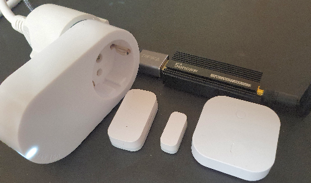

Last modified: 2022-01-15   
<table><tr><td></td><td>
<h1>How to connect Zigbee devices with MQTT?</h1>
<a href="../README.md">==> Home page</a> &nbsp; &nbsp; &nbsp; 
<a href="./m4h301_zbInstall.md">==> German version</a> &nbsp; &nbsp; &nbsp; 
</td></tr></table>


# What is it about?
There are many Zigbee devices, which are distinguished from WLAN devices mainly by their lower energy consumption. If you want to control Zigbee devices via MQTT, you need a Zigbee adapter on the hardware side and a Zigbee to MQTT bridge on the software side.   
In this manual the bridge ["Zigbee2MQTT"](https://www.zigbee2mqtt.io/) is used. The very good (English) description can be found at [https://www.zigbee2mqtt.io/](https://www.zigbee2mqtt.io/).   
Information about Zigbee itself can be found on Wikipedia at [https://de.wikipedia.org/wiki/ZigBee](https://de.wikipedia.org/wiki/ZigBee).   

# What is needed?
See also [https://www.zigbee2mqtt.io/guide/getting-started/#prerequisites](https://www.zigbee2mqtt.io/guide/getting-started/#prerequisites).   

1. Zigbee adapter   
  * An adapter recommended on the [Zigbee2MQTT page](https://www.zigbee2mqtt.io/guide/adapters/), e.g. the [CC2652P from AliExpress](https://de.aliexpress.com/item/1005002823262979.html?spm=a2g0o.9042311.0.0.75ef4c4dimTCqb) or [SONOFF Zigbee 3.0 USB Dongle Plus from Amazon](https://www.amazon.de/gp/product/B09KXTCMSC/ref=ppx_yo_dt_b_asin_image_o00_s00?ie=UTF8&psc=1) ...   
  * ... or the [CC Debugger Texas Instruments + Adapter Cable + CC2531 ZigBee USB Sick from Amazon](https://www.amazon.de/gp/product/B07VH5Q54R/ref=ppx_yo_dt_b_asin_title_o00_s01?ie=UTF8&psc=1)   
  * ... or just the [ARCELI CC2531 ZigBee USB stick](https://www.amazon.de/gp/product/B07MBZMJB4/ref=ppx_yo_dt_b_asin_title_o00_s00?ie=UTF8&psc=1)   
  _Note_: The CC2531 adapters are inexpensive, but obsolete.     

2. A Raspberry Pi (RasPi) running an MQTT broker (e.g. [Mosquitto](https://www.mosquitto.org/download/))   

3. Zigbee components, e.g.   
  * a door contact [Aqara MCCGQ11LM](https://www.amazon.de/Aqara-MCCGQ11LM-Window-Sensor-Fensterssensor/dp/B07D37VDM3/ref=sr_1_1?adgrpid=73755725671&gclid=Cj0KCQiAuP-OBhDqARIsAD4XHpfP6_VI6M-YTaZpFdzaoTjBVHyZQz43r4ASPPnJ6iepbU7DA2m7Ll0aAuyOEALw_wcB&hvadid=352649961577&hvdev=c&hvlocphy=1000900&hvnetw=g&hvqmt=e&hvrand=13607845984483905319&hvtargid=kwd-811095543014&hydadcr=24904_1731873&keywords=aqara+mccgq11lm&qid=1642082731&sr=8-1)   
  * an E1603 radio-controlled socket from IKEA ([903.561.66](https://www.ikea.com/at/de/p/tradfri-kabelloser-dimmer-weiss-70408595/))   
  * a 2-gang push button ("wireless dimmer") from IKEA ([704.085.95](https://www.ikea.com/at/de/p/tradfri-kabelloser-dimmer-weiss-70408595/))   

4. Software: terminal program [`putty`](https://www.chiark.greenend.org.uk/~sgtatham/putty/latest.html) on the PC/laptop   

   
_Fig. 1: Zigbee devices: wireless socket E1603, door contact Aqara MCCGQ11LM, 2-gang push button and in the background the adapter SONOFF Zigbee 3.0 USB Dongle Plus with TI CC2652P + CP2102N_   

# Install Zigbee2MQTT on RasPi
## Download Zigbee2MQTT
There are several ways to install Zigbee2MQTT on the Raspberry Pi. Here we use a version without Docker, which can be found at   
[https://www.zigbee2mqtt.io/guide/installation/01_linux.html#linux](https://www.zigbee2mqtt.io/guide/installation/01_linux.html#linux)   

The following commands can be entered either in the terminal window of the RasPi or via Putty.   

1. Start RasPi, start Putty on the PC.   

2. Plug Zigbee adapter to RasPi and check if it is available:   
  `ls -l /dev/ttyACM0`   
  `crw-rw---- 1 root dialout 166, 0 Jan 9 19:30 /dev/ttyACM0`   
  If access to `ttyACM0` is not possible, the interface could be e.g. `ttyUSB0` or `ttyUSB1`.   

3. Update the RasPi package list and install the latest packages:   
  `sudo apt update`   
  `sudo apt full-upgrade`.   

4. Install Node.js and other needed software:   
  `sudo apt-get install -y nodejs npm git make g++ gcc`.   

5. Check which versions of `node` and `npm` (node packet manager) are installed:   
  `node --version`   
   Should be version v10.X or higher (e.g. v16.13.1 with 2022-01-10).   
  `npm --version`   
  Should be version 6.X or higher (e.g. 8.1.2 with 2022-01-10).   
  If this is not the case, the old version must be uninstalled before updating:   
  `sudo apt remove node`   
  `sudo apt remove nodejs`   
  Afterwards you should get the packages from the official Node.js site [https://github.com/nodesource/distributions/blob/master/README.md](https://github.com/nodesource/distributions/blob/master/README.md) and install them, e.g. for Node.js v16.x:   
  `curl -fsSL https://deb.nodesource.com/setup_16.x | sudo -E bash -`   
  `sudo apt-get install -y nodejs`   

6. Clone the Zigbee2MQTT repository and move it to /opt/zigbee2mqtt   
  `git clone https://github.com/Koenkk/zigbee2mqtt.git`   
  `sudo mv zigbee2mqtt /opt/zigbee2mqtt`   

7. Install dependencies (as user "pi" or "pi_")   
  `cd /opt/zigbee2mqtt`   
  `npm ci`   

## Configure Zigbee2MQTT
1. Save (copy) configuration file   
  `cp /opt/zigbee2mqtt/data/configuration.yaml /opt/zigbee2mqtt/data/configuration_old.yaml`   

2. Edit configuration file   
  At first start of `zigbee2mqtt` a Pan-ID and a network key should be generated. To do this open the configuration file in the terminal window or in Putty by entering   
  `nano /opt/zigbee2mqtt/data/configuration.yaml`   
  and add in the section `advanced:` the lines:   
  `pan_id: GENERATE`   
  `network_key: GENERATE`   

  Other changes in the configuration file:   

  * Change the base topic e.g. from `zigbee2mqtt` to `z2m`.   
  * Port on which the adapter is connected (can be `/dev/ttyACM0` or `/dev/ttyUSB0` or `/dev/ttyUSB1` for example)   

_Example configuration file_:   
```   
# Home Assistant integration (MQTT discovery)
homeassistant: false

# allow new devices to join
permit_join: true

# MQTT settings
mqtt:
  # MQTT base topic for zigbee2mqtt MQTT messages
  base_topic: z2m
  # MQTT server URL
  server: 'mqtt://localhost' # MQTT server authentication
  # MQTT server authentication, uncomment if required:
  # user: my_user
  # password: my_password

# serial settings
serial:
  # location of CC2531 USB sniffer
  port: /dev/ttyACM0
advanced:
  pan_id: GENERATE
  network_key: GENERATE
```   

  Save and exit by &lt;Ctrl&gt;o &lt;Enter&gt; &lt;Ctrl&gt; x   

## Test Zigbee2MQTT
1. Start Zigbee2MQTT for the first time   
  `cd /opt/zigbee2mqtt`   
  `sudo npm start`   
  Result:   
  `...`   
  `Zigbee2MQTT:info  2022-01-10 15:19:58: Zigbee: allowing new devices to join.`   
  `Zigbee2MQTT:info  2022-01-10 15:19:59: Connecting to MQTT server at mqtt://localhost`   
  `Zigbee2MQTT:info  2022-01-10 15:19:59: Connected to MQTT server`   
  `Zigbee2MQTT:info  2022-01-10 15:19:59: MQTT publish: topic 'z2m/bridge/state', payload 'online'`   
  Exit with &lt;Ctrl&gt; c   

2. Check the configuration file   
The configuration file should now contain corresponding numbers for `pan_id` and `network_key`. Check it by   
`cat /opt/zigbee2mqtt/data/configuration.yaml`   
  (or take `nano` instead of `cat`)

## If it doesn`t work as expected...
* Many troubleshooting tips can be found directly on the Zigbee2MQTT page at [https://www.zigbee2mqtt.io/guide/faq/](https://www.zigbee2mqtt.io/guide/faq/)   

* Don't forget: If you work with the RasPi via putty and WLAN, you have to reconnect to WLAN `Raspi11` after rebooting the RasPi!   

* Stop the service, if zigbee2mqtt is running as service:   
  `sudo systemctl stop zigbee2mqtt`   
  If in a command window the Mosquitto-Subscribe-Client is currently running (started with `mosquitto_sub -h 10.1.1.1 -t "#" -v`), you will see the following MQTT messages:   
  `z2m/bridge/state offline`   
  `z2m/bridge/logging {"level": "info", "message": "Disconnecting from MQTT server"}`   

* If zigbee2mqtt was started directly from the command line during boot, you have to prevent the automatic start and restart the RasPi afterwards.   
  You can check if the process is still running by entering   
    `ps -ef | grep npm`   
    _`root 558 1 0 12:35 ? 00:00:00 sudo npm run start`_   
  You could abort the process (e.g. by `sudo kill 558`), but this will not release the adapter.   

* If you repeat the installation (e.g. because an error occurred) or change the zigbee adapter, it can also help to delete the following files:   
  `rm /opt/zigbee2mqtt/data/state.json`   
  `rm /opt/zigbee2mqtt/data/coordinator_backup.json`   
  Attention: If you also delete the database, all devices must be __repaired__:   
  `rm /opt/zigbee2mqtt/data/database.db`   
  `rm /opt/zigbee2mqtt/data/database.db.backup`   

* If you want to see what data is received from the zigbee adater, you can start zigbee2mqtt in DEBUG mode:   
  `cd /opt/zigbee2mqtt`   
  `DEBUG=zigbee-herdsman* npm start`   
  Exit with &lt;Ctrl&gt; c   
  Note: Normal start with    
  `npm run start`   

* If a Zigbee2MQTT compatible device does not pair, it may be because the environment contains too much radiation. In this case, perform pairing at another location or shield adapter + device to be paired.   

## Start Zigbee2MQTT automatically at system startup
1. If all tests are finished successfully, Zigbee2MQTT can be started automatically at boot time e.g. as a service. For this you have to create a configuration file for the control panel:   
  `sudo nano /etc/system/system/zigbee2mqtt.service`   

    _Content of the file (change user!)_:   

```   
# -----sudo nano /etc/systemd/system/zigbee2mqtt.service-----
[Unit]
Description=zigbee2mqtt
After=network.target

[Service]
ExecStart=/usr/bin/npm start
WorkingDirectory=/opt/zigbee2mqtt
# StandardOutput=inherit
# Or use StandardOutput=null if you don't want Zigbee2MQTT messages filling syslog, for more options see systemd.exec(5)
StandardOutput=null
StandardError=inherit
Restart=always
User=pi_

[Install]
WantedBy=multi-user.target
```   

  Save and exit by &lt;Ctrl&gt;o &lt;Enter&gt; &lt;Ctrl&gt; x   

2. Testing the configuration of systemctl   
  `sudo systemctl start zigbee2mqtt`   
  `systemctl status zigbee2mqtt`   
  The service should be active, recognizable e.g. by the line   
  `Active: active (running) since Mon 2022-01-10 15:31:28 CET; 20s ago`   
  If this is not the case, a restart of the RasPi may help ;)   

3. Start the service automatically at boot time   
  `sudo systemctl enable zigbee2mqtt.service`   

4. Test if zigbee2mqtt is started correctly
    * Restart RasPi   
    `sudo reboot`   
    * Reconnect the PC with the RasPi, if you were connected via WLAN.
    * Start a Mosquitto client in a terminal window of the PC, which receives all topics:   
    `mosquitto_sub -h 10.1.1.1 -t "#" -v`   
      It should display the message `z2m/bridge/state online` and other messages.   

# Add Zigbee components to the network
## Preparation
To be able to observe the connection process, a Mosquitto client should run in a terminal window of the PC, which receives all topics:   
  `mosquitto_sub -h 10.1.1.1 -t "#" -v`   

## Door contact Aqara MCCGQ11LM
### Pair
Bring contact very close to the antenna of the Zigbee adapter and press the button on the narrow side until the LED flashes blue. In the terminal window you should see appropriate messages such as   
`z2m/bridge/event {"data":{"friendly_name":"0x00158d00045c0000","ieee_address":"0x00158d00045c0000","status":"started"},"type":"device_interview"}`   
and   
`z2m/bridge/event {"data":{"friendly_name":"0x00158d00045c0000","ieee_address":"0x00158d00045c0000"},"type":"device_announce"}`   
`z2m/bridge/logging {"level": "info", "message": "Successfully interviewed '0x00158d00045c0000', device has successfully been paired"}`   
If the pairing process was successful, when the magnet approaches the door contact, you will get a message like this:   
`z2m/0x00158d00045c0000 {"battery":100,"contact":true,"linkquality":195,"temperature":26,"voltage":3015}`   

### Changing the device name
To change the device name you should stop the Zigbee2MQTT service   
`sudo systemctl stop zigbee2mqtt`   
and modify the configuration file   
`nano /opt/zigbee2mqtt/data/configuration.yaml`.   
Change the name:   
```   
  '0x00158d00045c0000':
    friendly_name: 'contact_2'
    retain: true
```   
With `retain: true` you make the broker remember the last message (if you want it to).   
Save and quit by &lt;Ctrl&gt;o &lt;Enter&gt; &lt;Ctrl&gt; x   

If you now start the service again with   
`sudo systemctl start zigbee2mqtt`   
then moving the magnet closer to the door contact causes a message like this:   
`z2m/kontakt_2 {"battery":100, "contact":true, "linkquality":192, "temperature":26, "voltage":3015}`   


## IKEA wireless socket E1603
Siehe [https://www.zigbee2mqtt.io/devices/E1603_E1702_E1708.html#ikea-e1603-e1702-e1708](https://www.zigbee2mqtt.io/devices/E1603_E1702_E1708.html#ikea-e1603-e1702-e1708)   

## 2-gang push-button ("wireless dimmer") by IKEA
See [https://www.zigbee2mqtt.io/devices/E1743.html#ikea-e1743](https://www.zigbee2mqtt.io/devices/E1743.html#ikea-e1743)

---   

[Top of page](#up)