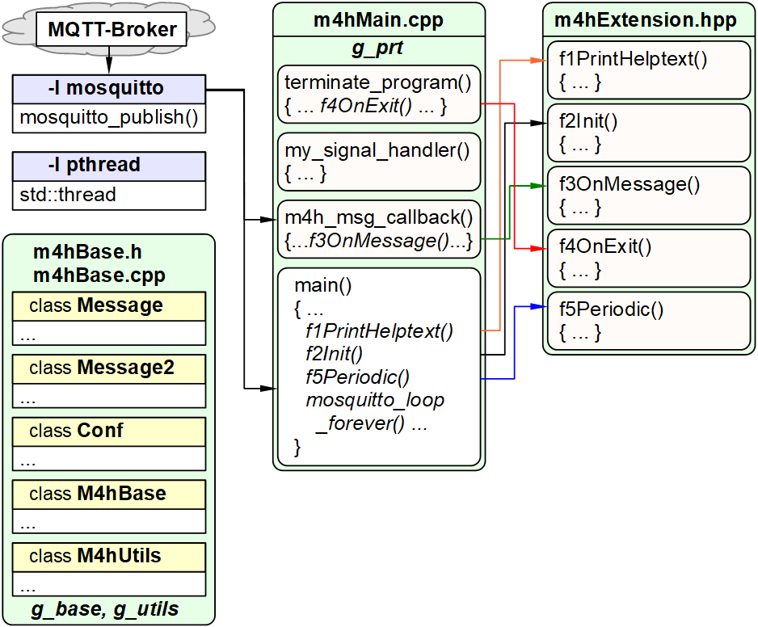

Letzte &Auml;nderung: 12.2.2022 <a name="up"></a>   
<table><tr><td></img></td><td>
<h1>RasPi: Welche C++ Hilfsprogramme gibt es und wie bekomme ich sie zum Laufen?</h1>
<a href="../LIESMICH.md">==> Startseite</a> &nbsp; &nbsp; &nbsp; 
<a href="m4h310_RasPiCppDemos_e.md">==> English version</a> &nbsp; &nbsp; &nbsp; 
</td></tr></table>
<hr>

# Worum geht es?
In der Heimautomation gibt es verschiedene Möglichkeiten, Abläufe zu steuern. 
Oft verwendet man dabei vorgefertigte Systeme, die nur mehr parametrisiert werden müssen. Der Nachteil dabei ist, dass nur die Dinge möglich sind, die vom System vorgesehen sind.   

Die hier vorgestellten Hilfsprogramme (bzw. auch selbst erstellten Module) gehen einen anderen Weg:   
* Alle Hilfsprogramme bestehen aus dem gleichen Basisprogramm und einem Funktionsmodul.   
* Jedes Hilfsprogramm (bzw. der Funktionsmodul) löst (genau) eine Aufgabe.   
* Die Ein- und Ausgabe jedes Programms erfolgt über MQTT Nachrichten.   
* Die Eigenschaften eines Hilfsprogramms werden über eine Konfigurationsdatei festgelegt.   

Da jedes Hilfsprogramm eine ausführbare Datei ist und über MQTT-Nachrichten gesteuert wird, kann es auch gemeinsam mit vorgefertigten Systemen verwendet werden.   
Weiteres ist es möglich, verschiedene Module zu einem Gesamtprogramm zusammenzufassen und so seine eigene Haussteuerung zu realisieren.   

## Diese Anleitung beantwortet folgende Fragen:   
1. [Welche Dinge benötige ich für das Erstellen eines ausführbaren Hilfsprogramms?](#a10)   
2. [Welche vorgefertigte Hilfsprogramme gibt es auf GitHub?](#a20)   
3. [Wie erstelle ich ein ausführbares Hilfsprogramm?](#a30)   
4. [Wie teste ich ein ausführbares Hilfsprogramm?](#a40)   
5. [ Was kann die Vorlage `m4hBase` leisten?](#a50)   
6. [Aus welchen Dateien besteht das Basissystem?](#a90)   


<a name="a10"></a>[_Zum Seitenanfang_](#up)   
# Welche Dinge benötige ich für das Erstellen eines ausführbaren Hilfsprogramms?
* Hardware: PC oder Laptop mit Internetzugang, Browser   
* Hardware: Raspberry Pi als Access Point (WLAN Raspi11, PW 12345678) mit der IP 10.1.1.1, auf dem ein MQTT-Broker läuft (zB Mosquitto)   
* Software: Visual Studio Code ("VSC"), das für C++-Anwendungen vorbereitet ist.   
* Software: Terminal-Programm [__*putty*__](https://www.chiark.greenend.org.uk/~sgtatham/putty/latest.html) auf dem PC/Laptop   
* Software: [__*WinSCP*__](https://winscp.net/eng/docs/lang:de) zur Datenübertragung vom PC/Laptop zum RasPi   
* Software: Die MQTT-Klient-Programme `mosquitto_sub` und ` mosquitto_pub` (auf dem PC oder RasPi installiert)   

<a name="a20"></a>[_Zum Seitenanfang_](#up)   
# Welche vorgefertigte Hilfsprogramme gibt es auf GitHub?   
* Die Hilfsprogramme findet man auf GitHub im Verzeichnis [mqtt4home/source_RasPi](https://github.com/khartinger/mqtt4home/tree/main/source_RasPi).   
* Genauere Informationen zu den Programmen gibt es in den jeweiligen Projekt-Verzeichnissen.   
* Zur einfachen Darstellung von Nachrichten wird die Syntax des Brokers "Mosquitto" verwendet:   
   `-t topic -m payload`   
* Viele Topics und Payloads können in der Konfigurationsdatei (zB `m4h.conf`) an eigene Bedürfnisse angepasst werden.   

Die folgende Aufzählung ist alphabetisch geordnet (und daher nicht nach Wichtigkeit).   

## Abfrage des Zustands (der "Gesundheit") des zigbee2mqtt-Programms
Name: [`m4hAdZigbee2mqtt`](https://github.com/khartinger/mqtt4home/tree/main/source_RasPi/m4hAdZigbee2mqtt)   
Das Programm sendet eine "Gesundheits"-Anfrage an das Programm `zigbee2mqtt` und wandelt die Antwort in eine leichter verarbeitbare Antwort um.   
OUT zigbee2mqtt: `-t zb/bridge/request/health_check -m ""`   
IN  zigbee2mqtt: `zb/bridge/response/health_check {"data":{"healthy":true},"status":"ok"}`   
Abfrage IN: `-t z2m/get -m health`   
OUT: `-t z2m/ret/health -m Zigbee2mqtt-health is perfect.`   

## C++ Basisprogramm
Name: [`m4hBase`](https://github.com/khartinger/mqtt4home/tree/main/source_RasPi/m4hBase)   
Das C++ Basisprogramm stellt die Verbindung zum MQTT Broker und zu verschiedenen Funktionsmodulen zur Verfügung.   
Es ermöglicht das Neuladen der Konfigurationsdatei und bietet verschiedene Möglichkeiten zum Beenden des Programmes an (Tastenkombination &lt;strg&gt;c, MQTT-Nachricht, Ende nach periodischer Ausführung eines Vorgangs).   
Details stehen auch [am Ende dieser Anleitung](#a50).   

## Abfrage der Brokerzeit   
Name: [`m4hBrokertime`](https://github.com/khartinger/mqtt4home/tree/main/source_RasPi/m4hBrokertime)   
Auf Anfrage sendet das Programm die aktuelle Brokerzeit zurück.   
Anwendung zB bei D1mini-Systemen, die keine Echtzeituhr (RTC) haben und trotzdem das aktuelle Datum bzw. die Uhrzeit anzeigen wollen.   
IN : `-t getTime -m ?`   
OUT: `-t brokertime -m yyyymmdd HHMMSS`   
Das Zeitformat `yyyymmdd HHMMSS` bedeutet yyyy=Jahr, mm=Monat, dd=Tag, HH=Stunde, MM=Minute, SS=Sekunde.   
Alterative: Das Programm `InDelayOut`.   

## Demoprogramm   
Name: [`m4hDemo1`](https://github.com/khartinger/mqtt4home/tree/main/source_RasPi/m4hDemo1)   
Das fertige Demo-Programm, dessen Erstellung in [`RasPi: Create your own programs in C++`](https://github.com/khartinger/mqtt4home/blob/main/md/m4h09_RasPiCppCreatingYourOwnProgs_e.md) beschrieben wird.   

## Finden der Schnittstelle eines SIM-Moduls
Name: [`m4hFindSimModule`](https://github.com/khartinger/mqtt4home/tree/main/source_RasPi/m4hFindSimModule)   
Dieses Konsolenprogramm prüft vorgegebene RasPi-Schnittstellen, ob an ihnen ein SIM-Modul hängt.   
Das Programm hat keine MQTT-Anbindung.   

## Empfangen und Senden von Nachrichten
Name: [`m4hInDelayOut`](https://github.com/khartinger/mqtt4home/tree/main/source_RasPi/m4hInDelayOut)   
Nach dem Empfang einer Nachricht wartet das Programm eine (in der Konfigurationsdatei) angegebene Zeit und sendet danach eine Antwort-Nachricht. Gibt man keine Wartezeit an, wird sofort die neue Nachricht gesendet.   
Das Programm ist sehr flexibel und kann zB dazu verwendet werden, fix vorgegebene Nachrichten (zB von gekauften Sensoren) in selbst definierte Nachrichten "umzuwandeln".   
Auch die Abfrage der Brokerzeit (wie beim Programm `m4hBrokertime`) ist möglich. Dafür lautet der Eintrag in der Konfigurationsdatei zB.   
```   
[indelayout]
in:     getTime ?
out:    brokertime <brokertime>
```   

## Schreiben von MQTT-Nachrichten in Dateien (Log-Files)
Name: [`m4hLogM`](https://github.com/khartinger/mqtt4home/tree/main/source_RasPi/m4hLogM)   
bzw.: [`m4hLog2`](https://github.com/khartinger/mqtt4home/tree/main/source_RasPi/m4hLog2)   
Das Programm `m4hLogM` schreibt alle MQTT-Nachrichten in Dateien. Für jede Nachricht wird jedes Monat eine neue Datei angelegt. Der Dateiname besteht aus dem Topic + Punkt + Jahr + Monat + ".log", wobei Leerzeichen in Topics durch Unterstriche und Schrägstriche durch das At-Zeichen ersetzt werden.   
_Beispiel_:   
Die Nachricht `-t z2m/ret/health -m Zigbee2mqtt-health is perfect.` wird im Februar 2022 folgendermaßen abgespeichert:   
Dateiname:   `z2m@ret@health.2202.log`   
Dateiinhalt: `11.02.22 09:16:16 | z2m@ret@health |  Zigbee2mqtt-health is perfect.`   
Standardverzeichnis: `./log/`   

Verwendet man das Programm `m4hLog2`, wird zusätzlich die (jeweils letzte) Payload in einer eigenen Datei gespeichert (zB. für eine schnellere Weiterverarbeitung durch andere Programme).   
Dateiname:   `z2m@ret@health`   
Dateiinhalt: ` Zigbee2mqtt-health is perfect. `   
Standardverzeichnis: `./data/`   

## Überwachung von Payload-Schlüssel
Name: [`m4hPayload`](https://github.com/khartinger/mqtt4home/tree/main/source_RasPi/m4hPayload)   
Das Programm `m4hPayload` sendet beim Finden eines bestimmten Schlüssels in der Payload einer Nachricht eine MQTT-Antwort-Nachricht.   
_Beispiel_: Unterschreitet der Wert des Schlüssels "`battery`" __eines beliebigen Topics__ (!) einen bestimmten Wert, so wird eine Warnungs-Nachricht geschickt.   

## Senden und Empfangen von SMS
Name: [`m4hSms`](https://github.com/khartinger/mqtt4home/tree/main/source_RasPi/m4hSms)   
Mit Hilfe eines SIM-Moduls können SMS gesendet und empfangen und in MQTT-Nachrichten umbewandelt werden.   
Aus Sicherheitsgründen müssen in der Konfigurationsdatei alle Telefonnummern vermerkt sein, die die Berechtigung zum Senden und Empfangen von SMS haben.   
Anwendung: Versenden von MQTT-Befehlen durch SMS. SMS-Info, wenn das Programm gestartet oder beendet wurde, ...   

## Überwachung regelmäßiger MQTT-Nachrichten (Watchdog)  
Name: [`m4hWdog`](https://github.com/khartinger/mqtt4home/tree/main/source_RasPi/m4hWdog)   
Das Programm `m4hWdog` ("Watchdog") kontrolliert, ob regelmäßig zu erscheinende Nachrichten innerhalb einer vorgegebenen Zeit auch tatsächlich gesendet wurden. Es schickt eine MQTT-Nachricht, wenn ein Sensor innerhalb einer vorgegebenen Zeit keine Nachricht mehr gesendet hat.   
In der Konfigurationsdatei wird festgelegt, innerhalb welcher Zeitspanne eine Nachricht von einem bestimmten Topic eintreffen muss.   
Das Modul ist sehr gut dafür geeignet zu prüfen, ob (batteriebetriebene) Sensoren ausgefallen sind.   

## Vorlage zur Erstellung eigener Module in C++  .
Name: [`m4hXxx`](https://github.com/khartinger/mqtt4home/tree/main/source_RasPi/m4hXxx)   
Ersetzt man in dieser (Visual-Studio-Code-)Vorlage den Dateinamen `m4hXxx.hpp` durch den neuen Namen (zB `m4hDemo.hpp`) und die Platzhalter `Xxx`, `XXX` und `xxx` durch die entsprechenden neuen Modulnamen (zB `Demo`, `DEMO` und `demo`), so ist das Programmgerüst für ein eigenes Programm bereits fertig. Es muss jetzt "nur mehr" die Funktionalität (in der Datei `m4hDemo` und ev. in `m4hExtension.hpp`) programmiert werden.    

<a name="a30"></a>[_Zum Seitenanfang_](#up)   
# Wie erstelle ich ein ausführbares Hilfsprogramm?   
Die Vorgangsweise zum Erstellen eines Programmes soll am Beispiel `m4hBrokertime` gezeigt werden. Die Arbeiten können direkt auf dem RasPi oder über `putty` durchgeführt werden.   

1. Erstellen eines Verzeichnisses f&uuml;r den Programmcode auf dem RasPi:   
```mkdir ~/m4hBrokertime```   

2. Wechseln in dieses Verzeichnis:   
```cd ~/m4hBrokertime```

3. Herunterladen des Quellcodes bzw. der Projektdateien von GitHub   
Den Quellcode der Dateien findet man unter [https://github.com/khartinger/mqtt4home/tree/main/source_RasPi/m4hBrokertime](https://github.com/khartinger/mqtt4home/tree/main/source_RasPi/m4hBrokertime)   
(Dateien: `C_Brokertime.hpp`, `m4h.conf`, `mh4Base.cpp`, `m4hBase.h`, `m4hExtension.hpp`, `m4hMain.cpp`)   
  Zum Herunterladen der Dateien gibt es zwei Möglichkeiten.   

    __Variante 1__: Dateien einzeln erzeugen:   
    1. Putty starten und mit dem RasPi verbinden   
    2. Ins Projektverzeichnis wechseln   
       `cd ~/m4hBrokertime`   
    3. Eine Quellcode-Datei, zB `C_Brokertime.hpp`, auf GitHub anklicken, [Raw] dr&uuml;cken, Quellcode kopieren (zB &lt;strg&gt;a &lt;strg&gt;c)   
    4. Auf dem RasPi eine leere Datei für den Quellcode erzeugen:   
    `nano ./C_Brokertime.hpp`   
    5. Den Quellcode mit der rechten Taste in `nano` einf&uuml;gen
    6. Speichern und beenden durch &lt;Strg&gt;o &lt;Enter&gt; &lt;Strg&gt; x   
    Die Vorgangsweise ab dem 3. Punkt f&uuml;r die Dateien `m4h.conf`, `m4hBase.cpp`, `m4hBase.h`, `m4hExtension.hpp` und `m4hMain.cpp` wiederholen.   

    __Variante 2__: Herunterladen des gesamten Repository von GitHub.   

4. Erstellen der ausführbaren Datei   
```g++ m4hMain.cpp m4hBase.cpp -o m4hBrokertime -lmosquitto -lpthread```   

    _Anmerkung 1_: Damit das Kompilieren erfolgreich ist, muss die Mosquitto-Bibliothek installiert sein:   
    ```sudo apt-get install libmosquitto-dev```   
     (siehe auch [https://github.com/khartinger/mqtt4home/blob/main/m4h03_RasPiMQTTBroker.md](https://github.com/khartinger/mqtt4home/blob/main/m4h03_RasPiMQTTBroker.md) )   

    _Anmerkung 2_: Im Verzeichnis `~/m4hBrokertime` wurde die Datei `m4hBrokertime` erzeugt.   

    _Anmerkung 3_: Die Befehlszeile, mit der die ausführbare Datei erzeugt wird, steht immer in der Datei `m4hExtension.hpp` und `C_Xxx.hpp`   

---   

5. Bereitstellung der Datei für alle User   
Wurde die Datei fehlerfrei übersetzt und getestet und soll sie von jedem User und aus jedem Verzeichnis heraus verwendet werden können, sind folgende Schritte erforderlich:   
```sudo cp ~/m4hBrokertime/m4hBrokertime /usr/local/bin```   
```sudo chown root /usr/local/bin/m4hBrokertime```   
```sudo chmod 777 /usr/local/bin/m4hBrokertime```   

6. Automatisches Starten der Datei beim RasPi-Start   
* Datei /usr/local/bin/autostart.sh öffnen:   
`sudo nano /usr/local/bin/autostart.sh`   
* Zwischen den printf-Anweisungen einfügen:   
`/usr/local/bin/m4hBrokertime &`   
Speichern und beenden durch &lt;Strg&gt;o &lt;Enter&gt; &lt;Strg&gt; x   
(siehe auch Abschnitt "Eigene Autostart-Datei `autostart.sh`" in [m4h01_RasPiInstall.md](https://github.com/khartinger/mqtt4home/blob/main/m4h01_RasPiInstall.md) )

<a name="a40"></a>[_Zum Seitenanfang_](#up)   
# Wie teste ich ein ausführbares Hilfsprogramm?   
Das gerade erstellte Programm `m4hBrokertime` soll getestet werden.   
Zum Testen des Programms benötigt man ein Putty-Fenster und ein PC-Eingabeaufforderungs-Fenster:
1. Das neu erstellte Programm in der Konsole oder einem putty-Fenster starten:   
`cd ~/m4hBrokertime`   
`./m4hBrokertime`   
Ergebnis:   
```   
Read config file ./m4h.conf: OK
=====[base]===========================
config file         | ./m4h.conf
all keys            | versionin|versionout|mqttstart|mqttend|progend|readconfin|readconfout|addtime
version (in)        | -t m4hBrokertime/get -m version
version (out)       | -t m4hBrokertime/ret/version -m 2021-08-15
mqtt @ start (out,*)| -t info/start -m m4hBrokertime
mqtt @ end (out,*)  | -t info/end__ -m m4hBrokertime
progend by mqtt (in)| -t m4hBrokertime/set -m ...end...
reload conf-file(in)| -t m4hbase/set/conf -m ./m4h.conf
reload conf-fil(out)| -t m4hbase/ret/conf -m Read config:
         * add time | true
-----requests for brokertime:-----
getTime| ==> brokertime|%Y%m%d %H%M%S|1
test/1/get|time ==> test/1/ret/time|%d.%m.%Y %H:%M:%S|1
-----[brokertime]------------------------------
config file         | ./m4h.conf
all keys            | in|out|retain
.....Answer messages...........................
IN: -t getTime -m  ==> OUT: -t brokertime -m %Y%m%d %H%M%S -r
IN: -t test/1/get -m time ==> OUT: -t test/1/ret/time -m %d.%m.%Y %H:%M:%S -r
Try to connect to mosquitto...
Connected: Waiting for topics...
```   

2. Am PC ein Kommando-Fenster ("Eingabeaufforderung") &ouml;ffnen:   
```cmd.exe```
im Startmen&uuml; eingeben.   
Ins richtige Laufwerk und Mosquitto-Verzeichnis wechseln:   
```c:```   
```cd /programme/mosquitto```

3. Nachricht vom PC-Eingabeaufforderungs-Fenster senden   
`mosquitto_pub -h 10.1.1.1 -t getTime -m ?`   
Mit dem Schalter `-h` wird die IP-Adresse des Raspi angegeben.   

4. In der Konsole oder dem putty-Fenster erscheinen die entsprechenden Nachrichten:   
`getTime ?`   
`brokertime 20220211 195554`   

Beendet man das Programm mit &lt;ctrl&gt;c, so erh&auml;lt man folgende Meldungen:   
```
^C
Exit program... MQTT end message sent.

Program terminated by <ctrl>c (11.02.2022 19:52:23)
Beendet
```

<a name="a50"></a>[_Zum Seitenanfang_](#up)   
# Was kann die Vorlage `m4hBase` leisten?
1. Lesen von Einstellungen aus der Konfigurationsdatei m4h.conf.   
2. M&ouml;glichkeit, eine andere Konfigurationsdatei anzugeben   
   (beim Starten des Programms auf der Kommandozeile).   
3. Beantwortung einer Anfrage nach der Programmversion.   
   Vorgabe f&uuml;r die Anfrage: Topic "m4hBase/get", Payload "version"   
   Vorgabe f&uuml;r die Antwort: Topic "m4hBase/ret/version", Payload "2021-08-15"   
4. Senden (oder Nicht-Senden) einer MQTT-Nachricht beim Programmstart und/oder dem Programmende.   
5. Bereitstellung der globalen Objekte `g_base`, `g_prt`, `g_mosq`   
6. M&ouml;glichkeit, das Programm durch eine MQTT-Nachricht zu beenden, die in der Konfigurationsdatei definiert ist (Schl&uuml;ssel "progend" in der Konfigurationsdatei).   
7. Beenden des Programms mit &lt;strg&gt;c.   

<a name="a90"></a>[_Zum Seitenanfang_](#up)   
# Aus welchen Dateien besteht das Basissystem?   
Das folgende Bild zeigt eine Übersicht über die Dateien des C++ Basissystems zur Erstellung von Hilfsprogrammen (bzw. Modulen).

   
_Bild 1: Dateien für C++ Hilfsprogramme_   

Im Normalfall muss lediglich die Datei `m4hExtension.hpp` angepasst werden.   
Die beiden Bibliotheken müssen beim Erstellen der ausführbaren Datei eingebunden werden.   

## Bibliothek mosquitto   
Sie stellt Funktionen zur Brokeranbindung und für MQTT-Nachrichten zur Verfügung.   
## Bibliothek pthread   
Sie dient zur Erzeugung von Threads, damit Arbeiten parallel durchgeführt werden können. Beispiele: Die periodische Bearbeitung von Befehlen unabhängig vom Senden und Empfangen von MQTT-Nachrichten oder das Senden von SMS usw.   

## Dateien m4hBase (.h und .cpp)
Diese Dateien stellen Basisfunktionen zur Verfügung, die innerhalb des gesamten Projektes genutzt werden können:   
* Klasse `Message`: Klasse zur Aufnahme einer MQTT-Nachricht (Topic, Payload, Retain-Flag)   
* Klasse `Message2`: Klasse zur Aufnahme zweier MQTT-Nachrichten zB für die Empfangs- und Sende-Nachricht.   
* Klasse `Config`: Sammlung von nützlichen Funktionen für das Einlesen der Konfigurationsdatei wie zB. das Einlesen einer bestimmten Sektion oder das Entfernen von führenden und nachfolgende Leerzeichen in einem String etc.   
* Klasse `M4hBase`: Bearbeitung der Basisfunktionalitäten des Projektes wie der Beantwortung 

## Hauptprogramm m4hMain.cpp
Diese Datei stellt die globale Variable `g_prt` (print) zur Verfügung, die angibt, ob Informationen auf den Bildschirm ausgegeben werden sollen.   
Weiters enthält sie Methoden zur Bearbeitung von MQTT-Belangen (Verbindung zum Broker, zyklische Abfrage von MQTT-Nachrichten etc.) und zum Beenden des Programms.   

## m4hExtension.hpp
Diese Datei stellt mit ihren fünf Funktionen die Verbindung zu den Funktionsmodulen dar:   
* Die Funktion `void f1PrintHelptext() { }` enthält die Programmbeschreibung, die man erhält, wenn man das Programm von der Kommandozeile aus mit dem Schalter `-h` startet.   
* Die Funktion `bool f2Init(std::string pfConf) { }` ermöglicht das Initialisieren der einzelnen Module.   
* Die Funktion `void f3OnMessage(struct mosquitto *mosq, std::string topic, std::string payload) { }` enthält die Nachrichten-Empfangsmethoden aller Module (meist `onMessage()`).   
* Die Funktion `void f4OnExit(struct mosquitto *mosq, int reason) { }` enthält abschließende Tätigkeiten aller Module.   
* Die Funktion `void f5Periodic(struct mosquitto *mosq) { }` enthält Funktionen, die periodisch ausgeführt werden sollen.   
Für das Beispiel `m4hBrokertime` sieht die Datei `m4hExtension.hpp` zB folgendermaßen aus:   
```   
//_____m4hExtension.hpp__________________________khartinger_____
// g++ m4hMain.cpp m4hBase.cpp -o m4hBrokertime -lmosquitto -lpthread
// *  This program uses m4hBase to do the following:
//    1. If certain messages are received, a message with the 
//       current date and time will be sent.
//    2. all data of the messages must be defined in the 
//       configuration file (default m4h.conf) in sections 
//       with the following structure:
//       [brokertime]
//       in: topicIn payloadIn
//       out: topicOut payloadOut
//       retain: true
//    3. The date/time format can be specified in the config file
//       at payloadOut. Examples are
//       %Y%m%d %H%M%S or %d.%m.%Y %H:%M:%S
// *  All functions of m4hBase are also available.
//    (For more information see file m4hMain.cpp.)
// *  m4hMain.cpp must have a line "#include "m4hExtension.hpp"
// *  m4hExtension.hpp must have a line "#include "C_Brokertime.hpp"
// Hardware: (1) Raspberry Pi
// Updates:
// 2021-08-19 First release
// Released into the public domain.

#include "mosquitto.h"                 // mosquitto_* functions
#include "m4hBase.h"                   // m4h basic functions
#include "C_Brokertime.hpp"                   // additional code

//-------global values------------------------------------------
extern bool g_prt;                     //true=printf,false=quiet
void terminate_program(int reason);

//_______main: print this help text_____________________________
void f1PrintHelptext()
{
 fprintf(stdout, "\nUsage  : m4hBrokertime [-h | -q | pf.conf]\n");
 fprintf(stdout, "         -h ........ print this help text\n");
 fprintf(stdout, "         -q ........ no output to stdout, stderr\n");
 fprintf(stdout, "         pf.conf ... path+filename of config.file (default m4h.conf)\n");
 fprintf(stdout, "Purpose: Send MQTT answer on specific incomming messages.\n");
 fprintf(stdout, "Author : Karl Hartinger\n");
 fprintf(stdout, "Version: 2021-08-19");
 fprintf(stdout, "Needs  : sudo apt-get install libmosquitto-dev\n\n");
 fprintf(stdout, "Exit program by pressing <ctrl>c\n");
}

//_______init extension_________________________________________
// pfConf...path and filename of config file
bool f2Init(std::string pfConf)
{
 bool bRet;
 bRet=g_brokertime.readConfig(pfConf);       // read conf data
 if(g_prt) g_brokertime.show();              // show config values Brokertime
 return bRet;
}

//_______react to further mqtt messages_________________________
void f3OnMessage(struct mosquitto *mosq, 
 std::string topic, std::string payload)
{
 //======Brokertime: respond to messages===============================
 g_brokertime.onMessage(mosq, topic, payload);

}

//_______Possibility for cleanup before end of program__________
void f4OnExit(struct mosquitto *mosq, int reason)
{
 //======Brokertime: cleanup before end of program=====================
 g_brokertime.onExit(mosq, reason);
}


//_______for periodic actions (a parallel thread)_______________
void f5Periodic(struct mosquitto *mosq)
{
 bool bDoPeriodic=true;                // do "endles"
 int  iEnd=4;                          // reason for end
 while(bDoPeriodic) //-----"endless"----------------------------
 { //...Do something...
  std::this_thread::sleep_for(std::chrono::milliseconds(1000));
 };
 terminate_program(iEnd);
}
```   

[Zum Seitenanfang](#up)