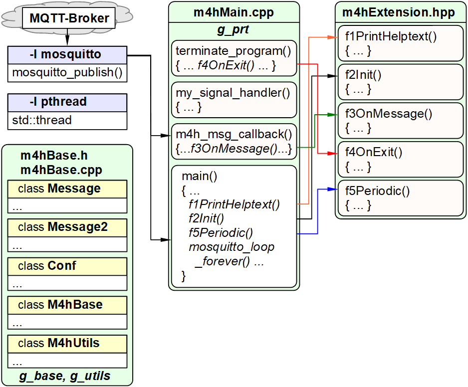

Last modified: 2022-02-12 <a name="up"></a>   
<table><tr><td></td><td>&nbsp;</td><td>
<h1>RasPi: What C++ utilities are there and how do I get them to work?</h1>
<a href="../README.md">==> Home page</a> &nbsp; &nbsp; &nbsp; 
<a href="m4h310_RasPiCppDemos.md">==> German version</a> &nbsp; &nbsp; &nbsp; 
</td></tr></table>
<hr>

# What is it about?
In home automation, there are various ways to control processes. 
Often prefabricated systems are used, which only need to be parameterized. The disadvantage of this is that only those things are possible that are provided by the system.   

The auxiliary programs presented here (or also self-made modules) go another way:   
* All auxiliary programs consist of the same basic program and a function module.   
* Each auxiliary program (or the function module) solves (exactly) one task.   
* The input and output of each program is done via MQTT messages.   
* The properties of a utility program are specified via a configuration file.   

Since each utility is an executable file and is controlled via MQTT messages, it can also be used together with prefabricated systems.   
Furthermore, it is possible to combine different modules to an overall program and thus realize its own home control.   

## This guide answers the following questions:   
1.[What things do I need to build an executable utility](#a10).   
2. [What pre-built utilities are available on GitHub?](#a20)   
3. how do i create an executable utility](#a30)   
4. [How do I test an executable utility?](#a40)   
5. [ What can the template `m4hBase` do?](#a50)   
6. [What files does the base system consist of?](#a90)   

<a name="a10"></a>[_top of page_](#up)   

# What things do I need to create an executable utility?
* Hardware: PC or laptop with internet access, browser.   
* Hardware: Raspberry Pi as access point (WLAN Raspi11, PW 12345678) with IP 10.1.1.1, running an MQTT broker (e.g. Mosquitto).   
* Software: Visual Studio Code ("VSC") prepared for C++ applications.   
* Software: Terminal program [__*putty*__](https://www.chiark.greenend.org.uk/~sgtatham/putty/latest.html) on the PC/laptop.   
* Software: [__*WinSCP*__](https://winscp.net/eng/docs/lang:de) to transfer data from the PC/laptop to the RasPi.   
* Software: The MQTT client programs `mosquitto_sub` and `mosquitto_pub` (installed on PC or RasPi)   

<a name="a20"></a>[_top of page_](#up)   

# What pre-built utilities are available on GitHub?   
* The utilities can be found on GitHub in the [mqtt4home/source_RasPi](https://github.com/khartinger/mqtt4home/tree/main/source_RasPi) directory.   
* More detailed information about the programs can be found in the respective project directories.   
* For simple message representation, the syntax of the "Mosquitto" broker is used:   
   `-t topic -m payload`   
* Many topics and payloads can be customized in the configuration file (e.g. `m4h.conf`).   

The following list is in alphabetical order (and therefore not in order of importance).   

## Query the state (the "health") of the zigbee2mqtt program.
Name: [`m4hAdZigbee2mqtt`](https://github.com/khartinger/mqtt4home/tree/main/source_RasPi/m4hAdZigbee2mqtt)   
The program sends a "health" request to the `zigbee2mqtt` program and converts the response to a more easily processed response.   
OUT zigbee2mqtt: `-t zb/bridge/request/health_check -m ""`   
IN zigbee2mqtt: `zb/bridge/response/health_check {"data":{"healthy":true}, "status": "ok"}`   
query IN: `-t z2m/get -m health`   
OUT: `-t z2m/ret/health -m Zigbee2mqtt-health is perfect.`   

## C++ basic program
Name: [`m4hBase`](https://github.com/khartinger/mqtt4home/tree/main/source_RasPi/m4hBase)   
The C++ base program provides the connection to the MQTT broker and to various functional modules.   
It allows to reload the configuration file and provides different ways to exit the program (key combination &lt;ctrl&gt;c, MQTT message, exit after periodic execution of an operation).   
Details are also [at the end of this manual](#a50).   

## Query broker time   
Name: [`m4hBrokertime`](https://github.com/khartinger/mqtt4home/tree/main/source_RasPi/m4hBrokertime)   
On request the program sends back the current broker time.   
Use e.g. with D1mini systems, which do not have a real time clock (RTC) and still want to display the current date or time.   
IN : `-t getTime -m ?`   
OUT : `-t brokertime -m yyyymmdd HHMMSS`   
The time format `yyymmdd HHMMSS` means yyyy=year, mm=month, dd=day, HH=hour, MM=minute, SS=second.   
Alterative: The program `InDelayOut`.   

## Demo program   
Name: [`m4hDemo1`](https://github.com/khartinger/mqtt4home/tree/main/source_RasPi/m4hDemo1)   
The ready demo program whose creation is described in [`RasPi: Create your own programs in C++`](https://github.com/khartinger/mqtt4home/blob/main/md/m4h09_RasPiCppCreatingYourOwnProgs_e.md).   

## Finding the interface of a SIM module
Name: [`m4hFindSimModule`](https://github.com/khartinger/mqtt4home/tree/main/source_RasPi/m4hFindSimModule)   
This console program checks given RasPi interfaces if there is a SIM module attached to them.   
The program has no MQTT connection.   

## Receive and send messages
Name: [`m4hInDelayOut`](https://github.com/khartinger/mqtt4home/tree/main/source_RasPi/m4hInDelayOut)   
After receiving a message, the program waits for a time specified (in the configuration file) and then sends a response message. If you do not specify a waiting time, the new message is sent immediately.   
The program is very flexible and can be used e.g. to "convert" fixed messages (e.g. from purchased sensors) into self defined messages.   
It is also possible to query the broker time (as in the program `m4hBrokertime`). For this the entry in the configuration file is e.g..   
```   
[indelayout]
in: getTime ?
out: brokertime <brokertime>
```   

## Writing MQTT messages to files (log files)
Name: [`m4hLogM`](https://github.com/khartinger/mqtt4home/tree/main/source_RasPi/m4hLogM)   
or: [`m4hLog2`](https://github.com/khartinger/mqtt4home/tree/main/source_RasPi/m4hLog2)   
The program `m4hLogM` writes all MQTT messages into files. For each message a new file is created every month. The filename consists of the topic + period + year + month + ".log", where spaces in topics are replaced by underscores and slashes are replaced by the at-sign.   
_Example_:   
The message `-t z2m/ret/health -m Zigbee2mqtt-health is perfect.` is saved in February 2022 as follows:   
File name: `z2m@ret@health.2202.log`   
File content: `11.02.22 09:16:16 | z2m@ret@health | Zigbee2mqtt-health is perfect.`   
Default directory: `./log/`   

If you use the program `m4hLog2`, the (last) payload is additionally stored in a separate file (e.g. for faster processing by other programs).   
File name: `z2m@ret@health`   
File content: ` Zigbee2mqtt-health is perfect. `   
Default directory: `./data/`   

## Payload key monitoring
Name: [`m4hPayload`](https://github.com/khartinger/mqtt4home/tree/main/source_RasPi/m4hPayload)   
The `m4hPayload` program sends an MQTT message when a certain key is found in the payload of a message.   
_Example_: If the value of the key "`battery`" falls below __of any topic__ (!) falls below a certain value, a warning message is sent.   

## Send and receive SMS
Name: [`m4hSms`](https://github.com/khartinger/mqtt4home/tree/main/source_RasPi/m4hSms)   
With the help of a SIM module SMS are sent and received and converted into MQTT messages.   
For security reasons, all phone numbers that have permission to send and receive SMS must be noted in the configuration file.   
Application: Sending MQTT commands by SMS. SMS info when the program was started or stopped, ...   

## Monitoring of regularly recurring MQTT messages (Watchdog)  
Name: [`m4hWdog`](https://github.com/khartinger/mqtt4home/tree/main/source_RasPi/m4hWdog)   
The program `m4hWdog` ("Watchdog") checks if messages which should be sent regularly (e.g. from temperature sensors) are actually sent. If a sensor has not sent a message within a given time, `m4hWdog` will send a warning message.   
In the configuration file it is defined within which time span a message from a certain topic must arrive.   
The module is very well suited to detect the failure of (e.g. battery powered) sensors.   

## Template for creating your own modules in C++ .
Name: [`m4hXxx`](https://github.com/khartinger/mqtt4home/tree/main/source_RasPi/m4hXxx)   
If you replace the file name `m4hXxx.hpp` in this (Visual Studio code) template by the new name (e.g. `m4hDemo.hpp`) and the placeholders `Xxx`, `XXX` and `xxx` by the corresponding new module names (e.g. `Demo`, `DEMO` and `demo`), the program framework for your own program is already ready. Now "only" the functionality (in the file `m4hDemo` and possibly in `m4hExtension.hpp`) must be programmed.    

<a name="a30"></a>[_top of page_](#up)   

# How do I create an executable utility program?   
The procedure to create a program will be shown with the example `m4hBrokertime`. The work can be done directly on the RasPi or via `putty`.   

1. create a directory for the program code on the RasPi:   
``mkdir ~/m4hBrokertime``.   

2. change to this directory:   
```cd ~/m4hBrokertime``

3. download the source code or the project files from GitHub   
The source code of the files can be found at [https://github.com/khartinger/mqtt4home/tree/main/source_RasPi/m4hBrokertime](https://github.com/khartinger/mqtt4home/tree/main/source_RasPi/m4hBrokertime)   
(Files: `C_Brokertime.hpp`, `m4h.conf`, `mh4Base.cpp`, `m4hBase.h`, `m4hExtension.hpp`, `m4hMain.cpp`)   
  There are two ways to download the files.   

    __Variant 1__: Create files one by one:   
    1. start Putty and connect to the RasPi   
    2. change to the project directory   
       `cd ~/m4hBrokertime`   
    3. click a source file, e.g. `C_Brokertime.hpp`, on GitHub, press [Raw], copy source (e.g. &lt;ctrl&gt;a &lt;ctrl&gt;c)   
    4. create an empty file on the RasPi for the source code:   
    `nano ./C_Brokertime.hpp`.   
    5. paste the source code with the right key into `nano
    6. save and exit by &lt;Ctrl&gt;o &lt;Enter&gt; &lt;Ctrl&gt; x   
    Repeat the procedure from the 3rd point for the files `m4h.conf`, `m4hBase.cpp`, `m4hBase.h`, `m4hExtension.hpp` and `m4hMain.cpp`.   

    __Variant 2__: Download the entire repository from GitHub.   

4. create the executable file   
```g++ m4hMain.cpp m4hBase.cpp -o m4hBrokertime -lmosquitto -lpthread``   

    _Note 1_: For the compilation to succeed, the Mosquitto library must be installed:   
    ```sudo apt-get install libmosquitto-dev``   
     (see also [https://github.com/khartinger/mqtt4home/blob/main/m4h03_RasPiMQTTBroker.md](https://github.com/khartinger/mqtt4home/blob/main/m4h03_RasPiMQTTBroker.md) )   

    _Note 2_: In the directory `~/m4hBrokertime` the file `m4hBrokertime` was created.   

    _Note 3_: The command line used to create the executable is always in the file `m4hExtension.hpp` and `C_Xxx.hpp`.   

---   

5. making the file available to all users   
If the file has been compiled and tested without errors and should be usable by any user and from any directory, the following steps are required:   
`sudo cp ~/m4hBrokertime/m4hBrokertime /usr/local/bin`   
`sudo chown root /usr/local/bin/m4hBrokertime`   
`sudo chmod 777 /usr/local/bin/m4hBrokertime`   
`sudo chmod u+s /usr/local/bin/m4hBrokertime`   

6. automatically start the file on RasPi startup   
* Open file /usr/local/bin/autostart.sh:   
`sudo nano /usr/local/bin/autostart.sh`   
* Insert between the printf statements:   
`/usr/local/bin/m4hBrokertime &`   
Save and exit by &lt;Ctrl&gt;o &lt;Enter&gt; &lt;Ctrl&gt; x   
(see also section "Custom autostart file `autostart.sh`" in [m4h01_RasPiInstall.md](https://github.com/khartinger/mqtt4home/blob/main/m4h01_RasPiInstall.md) )   

<a name="a40"></a>[_top of page_](#up)   

# How do I test an executable utility program?   
The program `m4hBrokertime` just created is to be tested.   
To test the program you need a putty window and a PC prompt window:
1. start the newly created program in the console or a putty window:   
`cd ~/m4hBrokertime`   
`./m4hBrokertime`   
Result:   

```   
Read config file ./m4h.conf: OK
=====[base]===========================
config file         | ./m4h.conf
all keys            | versionin|versionout|mqttstart|mqttend|progend|readconfin|readconfout|addtime
version (in)        | -t m4hBrokertime/get -m version
version (out)       | -t m4hBrokertime/ret/version -m 2021-08-15
mqtt @ start (out,*)| -t info/start -m m4hBrokertime
mqtt @ end (out,*)  | -t info/end__ -m m4hBrokertime
progend by mqtt (in)| -t m4hBrokertime/set -m ...end...
reload conf-file(in)| -t m4hbase/set/conf -m ./m4h.conf
reload conf-fil(out)| -t m4hbase/ret/conf -m Read config:
         * add time | true
-----requests for brokertime:-----
getTime| ==> brokertime|%Y%m%d %H%M%S|1
test/1/get|time ==> test/1/ret/time|%d.%m.%Y %H:%M:%S|1
-----[brokertime]------------------------------
config file         | ./m4h.conf
all keys            | in|out|retain
.....Answer messages...........................
IN: -t getTime -m  ==> OUT: -t brokertime -m %Y%m%d %H%M%S -r
IN: -t test/1/get -m time ==> OUT: -t test/1/ret/time -m %d.%m.%Y %H:%M:%S -r
Try to connect to mosquitto...
Connected: Waiting for topics...
```   

2. open a command window ("command prompt") on the PC:   
``cmd.exe``
in the start menu.   
Change to the correct drive and Mosquitto directory:   
```c:```   
```cd /programs/mosquitto``

3. send message from PC prompt window   
`mosquitto_pub -h 10.1.1.1 -t getTime -m ?`   
Use the `-h` switch to specify the IP address of the Raspi.   

4. in the console or the putty window the corresponding messages appear:   
`getTime ?`   
`brokertime 20220211 195554`   

If you exit the program with &lt;ctrl&gt;c, you get the following messages:   
```
^C
Exit program... MQTT end message sent.

Program terminated by <ctrl>c (11.02.2022 19:52:23)
Terminated
```

<a name="a50"></a>[_top of page_](#up)   

# What can the `m4hBase` template do?
1. read settings from the configuration file m4h.conf.   
2. possibility to specify another configuration file   
   (when starting the program on the command line).   
3. reloading a configuration file by MQTT message.   
4. answering a request for the program version.   
   Default for the request: Topic "m4hBase/get", Payload "version".   
   Default for the response: Topic "m4hBase/ret/version", Payload "2021-08-15".   
5. sending (or not sending) a MQTT message at the program start and/or the program end.   
6. providing the global objects `g_base`, `g_prt`, `g_mosq`.   
7. possibility to terminate the program by MQTT message defined in the configuration file (key "progend" in the configuration file).   
8. exit the program with &lt;ctrl&gt;c.   

<a name="a60"></a>[_top of page_](#up)   

# What files does the base system consist of?   
The following image shows an overview of the files of the C++ base system for creating utilities (or modules).

   
_Fig. 1: Files for C++ utilities_   

Normally only the file `m4hExtension.hpp` has to be adapted.   
The two libraries `mosquitto` and `pthread` must be included when creating the executable (with `-l`), e.g.   
`g++ m4hMain.cpp m4hBase.cpp -o m4hBrokertime -lmosquitto -lpthread`   

## Library mosquitto   
It provides functions for broker connection and MQTT messages.   
## Library pthread   
It is used to create threads so that work can be done in parallel.   
_Examples_: periodic processing of commands independent of sending and receiving MQTT messages or sending SMS, etc.   

## Files m4hBase (.h and .cpp)
These files provide basic functions that can be used throughout the project:   
* Class `Message`: class to hold a MQTT message (topic, payload, retain flag).   
* Class `Message2`: Class for recording two MQTT messages, e.g. for the receive and send message.   
* Class `Config`: Collection of useful functions for reading the configuration file like reading a specific section or removing leading and trailing blanks in a string etc.   
* Class `M4hBase`: Class for reading and remembering the base data (version, start/stop/end messages etc.).   

## Main program m4hMain.cpp
This file contains the actual C++ console program.   
It checks if parameters have been passed (`-h` to display help, `-q` to avoid screen output or the name of a configuration file), starts MQTT communication, provides a function in its own thread to perform work cyclically (`f5Periodic`) and waits for MQTT messages. It checks incoming MQTT messages for validity, processes certain messages itself (requesting the program version, reloading the configuration file, program end) and passes all other messages to the function `f3OnMessage`.   
For other parts of the program it provides the global variable `g_prt` (print), which specifies whether information should be printed to the screen.   

## m4hExtension.hpp
This file represents the connection to the function modules with its five functions:   
* The function `void f1PrintHelptext() { }` contains the program description that is obtained when the program is started from the command line with the `-h` switch.   
* The function `bool f2Init(std::string pfConf) { }` enables the initialization of the individual modules.   
* The function `void f3OnMessage(struct mosquitto *mosq, std::string topic, std::string payload) { }` contains the message receiving methods of all modules (mostly `onMessage()`).   
* The function `void f4OnExit(struct mosquitto *mosq, int reason) { }` contains final activities of all modules.   
* The function `void f5Periodic(struct mosquitto *mosq) { }` contains functions that should be executed periodically.   
For the example `m4hBrokertime` the file `m4hExtension.hpp` looks like this:   

```   
//_____m4hExtension.hpp__________________________khartinger_____
// g++ m4hMain.cpp m4hBase.cpp -o m4hBrokertime -lmosquitto -lpthread
// *  This program uses m4hBase to do the following:
//    1. If certain messages are received, a message with the 
//       current date and time will be sent.
//    2. all data of the messages must be defined in the 
//       configuration file (default m4h.conf) in sections 
//       with the following structure:
//       [brokertime]
//       in: topicIn payloadIn
//       out: topicOut payloadOut
//       retain: true
//    3. The date/time format can be specified in the config file
//       at payloadOut. Examples are
//       %Y%m%d %H%M%S or %d.%m.%Y %H:%M:%S
// *  All functions of m4hBase are also available.
//    (For more information see file m4hMain.cpp.)
// *  m4hMain.cpp must have a line "#include "m4hExtension.hpp"
// *  m4hExtension.hpp must have a line "#include "C_Brokertime.hpp"
// Hardware: (1) Raspberry Pi
// Updates:
// 2021-08-19 First release
// Released into the public domain.

#include "mosquitto.h"                 // mosquitto_* functions
#include "m4hBase.h"                   // m4h basic functions
#include "C_Brokertime.hpp"                   // additional code

//-------global values------------------------------------------
extern bool g_prt;                     //true=printf,false=quiet
void terminate_program(int reason);

//_______main: print this help text_____________________________
void f1PrintHelptext()
{
 fprintf(stdout, "\nUsage  : m4hBrokertime [-h | -q | pf.conf]\n");
 fprintf(stdout, "         -h ........ print this help text\n");
 fprintf(stdout, "         -q ........ no output to stdout, stderr\n");
 fprintf(stdout, "         pf.conf ... path+filename of config.file (default m4h.conf)\n");
 fprintf(stdout, "Purpose: Send MQTT answer on specific incomming messages.\n");
 fprintf(stdout, "Author : Karl Hartinger\n");
 fprintf(stdout, "Version: 2021-08-19");
 fprintf(stdout, "Needs  : sudo apt-get install libmosquitto-dev\n\n");
 fprintf(stdout, "Exit program by pressing <ctrl>c\n");
}

//_______init extension_________________________________________
// pfConf...path and filename of config file
bool f2Init(std::string pfConf)
{
 bool bRet;
 bRet=g_brokertime.readConfig(pfConf);       // read conf data
 if(g_prt) g_brokertime.show();              // show config values Brokertime
 return bRet;
}

//_______react to further mqtt messages_________________________
void f3OnMessage(struct mosquitto *mosq, 
 std::string topic, std::string payload)
{
 //======Brokertime: respond to messages===============================
 g_brokertime.onMessage(mosq, topic, payload);

}

//_______Possibility for cleanup before end of program__________
void f4OnExit(struct mosquitto *mosq, int reason)
{
 //======Brokertime: cleanup before end of program=====================
 g_brokertime.onExit(mosq, reason);
}


//_______for periodic actions (a parallel thread)_______________
void f5Periodic(struct mosquitto *mosq)
{
 bool bDoPeriodic=true;                // do "endles"
 int  iEnd=4;                          // reason for end
 while(bDoPeriodic) //-----"endless"----------------------------
 { //...Do something...
  std::this_thread::sleep_for(std::chrono::milliseconds(1000));
 };
 terminate_program(iEnd);
}
```   

[_top of page_](#up)   
