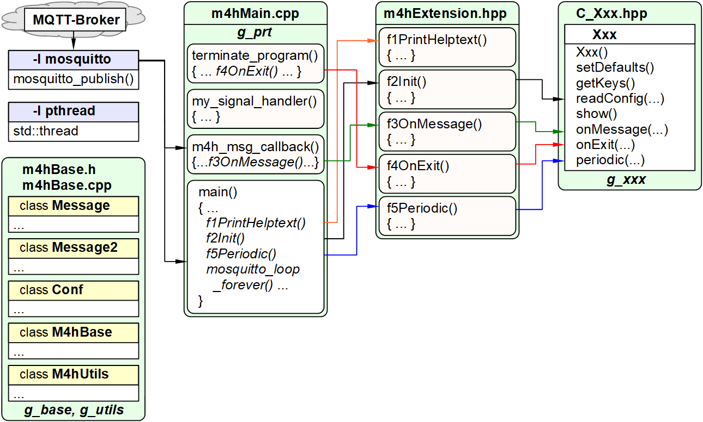

Letzte &Auml;nderung: 12.2.2022 <a name="up"></a>   
<table><tr><td></img></td><td>
<h1>RasPi: Wie erstelle ich ein eigenes C++ Hilfsprogramm?</h1>
<a href="../LIESMICH.md">==> Startseite</a> &nbsp; &nbsp; &nbsp; 
<a href="m4h320_RasPiCppCreatingYourOwnProgs_e.md">==> English version</a> &nbsp; &nbsp; &nbsp; 
</td></tr></table>
<a href="https://github.com/khartinger/mqtt4home/tree/main/source_RasPi/m4hDemo1">==> Code @ GitHub</a><hr>

# Worum geht es?
Diese Anleitung zeigt, wie man mit Hilfe der Vorlage `m4hXxx` eigene Module bzw. Hilfsprogramme erstellt.   
Es wird ein Modul `C_Demo1.hpp` erstellt, das im Projekt `m4hDemo1` verwendet wird und zeigt, wie man Nachrichten empf&auml;ngt und sendet und parallel dazu periodische Aufgaben erledigt. Die [detaillierte Aufgabenstellung](#a20) steht weiter unten.   

_Vorgangsweise_:   
Das Programm wird am PC in Visual Studio Code erstellt, danach auf das RasPi &uuml;bertragen und dort kompiliert.   
(Es w&auml;re auch m&ouml;glich, mit Visual Studio Code direkt am RasPi zu arbeiten.)   

## Diese Anleitung beantwortet folgende Fragen:   
1. [Welche Dinge ben&ouml;tige ich f&uuml;r das Erstellen eines ausf&uuml;hrbaren Hilfsprogramms?](#a10)   
2. [Was soll das Demoprogramm k&ouml;nnen?](#a20)   
3. [Wie bereite ich die L&ouml;sung vor?](#a30)
4. [Wie werden die Forderungen an das Demoprogramm erf&uuml;llt?](#a40)
5. [Wie erstelle und teste ich das m4hDemo1-Programm?](#a50)
6. [Wie stelle ich das Programm allen Usern zur Verf&uuml;gung?](#a60)

<a name="a10"></a>[_Zum Seitenanfang_](#up)   

# Welche Dinge ben&ouml;tige ich f&uuml;r das Erstellen eines ausf&uuml;hrbaren Hilfsprogramms?
* Hardware: PC oder Laptop mit Internetzugang, Browser   
* Hardware: Raspberry Pi als Access Point (WLAN Raspi11, PW 12345678) mit der IP 10.1.1.1, auf dem ein MQTT-Broker l&auml;uft (zB Mosquitto)   
* Software: [Visual Studio Code ("VSC")](https://code.visualstudio.com/), das f&uuml;r C++-Anwendungen vorbereitet ist.   
* Software: Terminal-Programm [__*putty*__](https://www.chiark.greenend.org.uk/~sgtatham/putty/latest.html) auf dem PC/Laptop   
* Software: [__*WinSCP*__](https://winscp.net/eng/docs/lang:de) zur Daten&uuml;bertragung vom PC/Laptop zum RasPi   
* Software: Die MQTT-Klient-Programme `mosquitto_sub` und ` mosquitto_pub` (auf dem PC oder RasPi installiert)   

<a name="a20"></a>[_Zum Seitenanfang_](#up)   

# Was soll das Demoprogramm k&ouml;nnen?
* {a} In der Konfigurationsdatei soll eine Sektion `[demo1]` definiert und ein "Startwert" (Schl&uuml;ssel `startvalue`) von `20` vorgegeben werden.   

* {b} Das Programm soll beim Start die Konfigurationsdaten einlesen   
(Datei `m4h.conf`, Sektion `[demo1]`, Schl&uuml;ssel `startvalue`).   

* {c} Das Programm soll alle ankommenden Nachrichten anzeigen.   

* {d} Das Programm soll auf die Nachricht `-t m4hDemo1/get -m keys` mit der Nachricht `-t m4hDemo1/ret/keys -m [keys]` antworten.   
   `[keys]` sollen alle Keys sein.   

* {e} Das Programm soll ausgehend von einem Startwert (default 30) im Sekundentakt bis 0 herunterz&auml;hlen und dann das Programm beenden.   

* {f} Bei Ende des Programms soll die Meldung `Thank you for using m4hDemo1!` ausgegeben werden.   

<a name="a30"></a>[_Zum Seitenanfang_](#up)   

# Wie bereite ich die L&ouml;sung vor?
Die ersten Schritte auf dem RasPi k&ouml;nnen sowohl direkt - in einem Konsolenfenster - oder &uuml;ber `putty` durchgef&uuml;hrt werden. Es wird angenommen, dass die Vorlage `m4hXxx` auf dem RasPi vorhanden ist. Ist dies nicht der Fall, muss die Vorlage zuerst auf dem RasPi erstellt oder hinaufkopiert werden.   

## Falls die Vorlage m4hXxx NICHT auf dem RasPi vorhanden ist
1. Mit dem Browser das Verzeichnis `m4hXxx` auf GitHub &ouml;ffnen:   
Link: [https://github.com/khartinger/mqtt4home/tree/main/source_RasPi/m4hXxx](https://github.com/khartinger/mqtt4home/tree/main/source_RasPi/m4hXxx)   

2. Auf dem RasPi ein Konsolenfenster &ouml;ffnen (oder am PC mit `putty` eine Verbindung zum RasPi herstellen).   

3. Das Verzeichnis `m4hXxx` erstellen:   
  `mkdir ~/m4hXxx`   

4. In das Verzeichnis `m4hXxx` wechseln:   
  `cd ~/m4hXxx`   

5. Alle Quellcodes kopieren:   
    1. Eine Quellcode-Datei, zB `C_Xxx.hpp`, auf GitHub anklicken, [Raw] dr&uuml;cken, Quellcode kopieren (zB &lt;strg&gt;a &lt;strg&gt;c)   
    2. Auf dem RasPi eine leere Datei f&uuml;r den Quellcode erzeugen:   
    `nano ./C_Xxx.hpp`   
    3. Den Quellcode mit der rechten Taste in `nano` einf&uuml;gen   
    4. Speichern und beenden durch &lt;Strg&gt;o &lt;Enter&gt; &lt;Strg&gt; x   
  Diese Schritte f&uuml;r die Dateien `m4h.conf`, `m4hBase.cpp`, `m4hBase.h`, `m4hExtension.hpp` und `m4hMain.cpp` wiederholen.   

Eine andere M&ouml;glichkeit besteht darin, das gesamte Repository von GitHub herunterzuladen und die Dateien auf das RasPi &uuml;bertragen.   

## Projekt m4hDemo1 erstellen
Das folgende Bild zeigt die Ausgangssituation vor dem Erstellen des m4hDemo1-Programms:

   
_Bild 1: Dateien zur Erstellung eines C++ Hilfsprogramme_   

1. RasPi: Erstellen eines Projektverzeichnisses `m4hDemo1`:   
`mkdir ~/m4hDemo1`   

2. RasPi: Wechseln in dieses Verzeichnis:   
`cd ~/m4hDemo1`   

3. RasPi: Hineinkopieren der Vorlagedateien `m4hXxx` in dieses Verzeichnis:   
`cp ~/m4hXxx/*.* ~/m4hDemo1`   

4. RasPi: Umbenennen der Datei C_Xxx.hpp in Demo1.hpp   
`mv C_Xxx.hpp C_Demo1.hpp`   

5. PC: Herunterladen des Verzeichnisses `~/m4hDemo1` vom RasPi auf den PC mit Hilfe von WinSCP.   

6. PC: Visual Studio Code starten und den Projektordner `m4hDemo1` __auf dem PC__ &ouml;ffnen:   
  Men&uuml; Datei - Ordner &ouml;ffnen...   

7. Umbenennen der Dummy-Bezeichnung Xxx   
Beim Umbenennen der Dummy-Bezeichnung `Xxx` in `Demo1` MUSS in den Dateien `C_Cxx.hpp`, `m4hExtension.hpp` und `m4h.conf` die Gro&szlig;-/Kleinschreibung beachtet werden, dh.   
das Umbenennen muss in drei Schritten erfolgen:   
  Men&uuml; Bearbeiten - In Dateien ersetzen...   
  __Wichtig__: Im Suchfeld __`Aa`__ aktivieren!   
    1. Xxx durch Demo1 ersetzen (Klassenbezeichnung, ca. 33 Ersetzungen in 3 Dateien)   
    2. xxx durch demo1 ersetzen (globale Variable, ca. 10 Ersetzungen in 3 Dateien)   
    3. XXX durch DEMO1 ersetzen (Definitionen, ca. 8 Ersetzungen in 1 Datei)   

8. Zeilen mit `DEMO1_DEMO`, `DEMO1_DEMO_KEY` und `_demo_` auskommentieren (oder l&ouml;schen).   
    * Men&uuml; Bearbeiten - In Dateien suchen... `DEMO1_DEMO_KEY`   
      4 Vorkommen auskommentieren, wobei in der Methode `Demo1::readConfig` der ganze if-Block auszukommentieren (oder l&ouml;schen) ist:   
      ```  
        //-----search key---------------------------------------------
        //if(sKey==DEMO1_DEMO_KEY) {
        // _demo_=sVal;
        //}
      ```   
    * Men&uuml; Bearbeiten - In Dateien suchen... `_demo_`   
      2 Vorkommen auskommentieren.   

9. Testen der &Auml;nderungen   
    * Kopieren der Dateien des Verzeichnisses `m4hDemo1` vom PC zum RasPi (mit WinSCP).   
    * Kompilieren der Datei durch Eingabe (in putty oder in der Konsole) von   
      `g++ m4hMain.cpp m4hBase.cpp -o m4hDemo1 -lmosquitto -lpthread`   
    Es sollten keine Fehler angezeigt werden und es sollte die Datei `m4hDemo` erstellt worden sein. (Kontrolle durch Eingabe von `ls -lh`)   
    * L&auml;uft der Server bzw. Broker, kann das Programm auch gestartet werden:  
      `./m4hDemo1`   
      Beenden des Programms mit &lt;strg&gt;c.   

---   

<a name="a40"></a>[_Zum Seitenanfang_](#up)   

# Wie werden die Forderungen an das Demoprogramm erf&uuml;llt?
## 1. Forderung {a}: Konfigurationsdatei erg&auml;nzen   
In VSC die Datei `m4h.conf` anklicken und folgendes eintragen:   
   ```   
   [demo1]
   startvalue: 20
   ```   

## 2. Forderung {b}: Konfigurationsdaten einlesen   
Das Einlesen der Konfigurationsdaten erfordert in VSC mehrere Arbeitsschritte:   

* C_Demo1.hpp: Anlegen von Konstanten f&uuml;r den Startwert:   
   ```   
   #define DEMO1_STARTVALUE_KEY "startvalue"   
   #define DEMO1_STARTVALUE     30
   ```   

* C_Demo1.hpp: Eigenschaft f&uuml;r den Startwert deklarieren.   
  In der Klasse Demo1 unter "application specific properties" eintragen:   
  `int startvalue;`   
  und in der Methode `setDefaults()` initialisieren:   
   `startvalue=DEMO1_STARTVALUE;`   
   `keys=std::string(DEMO1_STARTVALUE_KEY);`   

* C_Demo1.hpp: Methode zur R&uuml;ckgabe des Startwertes definieren.   
  In der Klasse `Demo1` unter "setter and getter methods" eintragen:   
  `int getStartvalue() { return startvalue; }`   

* C_Demo1.hpp: Startwert aus der Konfigurationdatei einlesen (falls definiert).   
  In der Methode `readConfig(std::string pfConf)` nach der Zeile   
`//-----search key---------------------------------------------`   
bei `  // ..ToDo..` folgendes einf&uuml;gen:   
```   
  //-----search key---------------------------------------------
  if(sKey==DEMO1_STARTVALUE_KEY) {
   try{ // string to int
    int temp=std::stoi(sVal);
    startvalue=temp;
   } catch(std::invalid_argument) {};
  }
 } // end for every line in section
 return true;
}
```   

* C_Demo1.hpp: Startwert anzeigen.   
In der Methode `show()` erg&auml;nzen:   
    ```   
    std::cout<<DEMO1_STARTVALUE_KEY<<"          | "<<startvalue<<std::endl;
    ```   

* m4hExtension.hpp: Einlesen der Konfigurationsdatei   
In der Datei `m4hExtension.hpp` in der Funktion `f2Init()` sollten folgende Zeilen stehen (oder sonst erg&auml;nzen):   
    ```
     bRet&g_demo1.readConfig(pfConf);       // {a} read config data
     if(g_prt) g_demo1.show();              // show config values Demo1
    ```   
   
## 3. Forderung {c}: "Anzeige aller Nachrichten"   
* C_Demo1.hpp: In der Methode `onMessage()` erg&auml;nzen:   
   `std::cout<<" | -t "<<topic<<" -m "<<payload<<" | "<<std::endl;`   
* m4hExtension.hpp - Kontrolle: In der Funktion `f3OnMessage()` muss folgende Zeile stehen:   
  `g_demo1.onMessage(mosq, topic, payload);`   
   
## 4. Forderung {d}: "Reagieren auf eine Nachricht"   
C_Demo1.hpp: In der Methode `onMessage()` erg&auml;nzen:   
```   
 bool bRet=true;
 if(topic=="m4hDemo1/get" && payload=="keys") {
  std::string sTopic="m4hDemo1/ret/keys";
  std::string sPayload=getKeys();
  int iRet=mosquitto_publish(mosq, NULL,sTopic.c_str(),
   sPayload.length(), sPayload.c_str(), 0, false);
  if(iRet!=0) {
   if(g_prt) fprintf(stderr, "Could not send MQTT message %s. Error=%i\n",sTopic.c_str(),iRet);
   bRet=false;
 }
 return bRet;
}
```   

## 5. Forderung {e}: Herunterz&auml;hlen vom Startwert   
In der Datei `C_Demo1.hpp` in der Funktion `periodic` erg&auml;nzen:   
```   
 char cSec[16];
 static int iSec=g_demo1.getStartvalue();
 sprintf(cSec," %d ",iSec);
 fputs(cSec, stdout); fflush(stdout);
 iSec--; if(iSec<0) return false;
 return true;
```   

In der Datei `m4hExtension.hpp` in der Funktion `f5Periodic` in der while-Schleife erg&auml;nzen:   

```   
  if(zsec%10==0) bDoPeriodic=g_demo1.periodic(mosq);
```   

## 6. Forderung {f}: Ende-Meldung ausgeben   
C_Demo1.hpp: In der Methode `onExit()` erg&auml;nzen:   
`std::cout<<"Thank you for using m4hDemo1!"<<std::endl;`   
   
<a name="a50"></a>[_Zum Seitenanfang_](#up)   

# Wie erstelle und teste ich das m4hDemo1-Programm?
1. PC: Hinaufkopieren der Projekt-Dateien vom PC auf das RasPi mit WinSCP.   

2. Erstellen der ausf&uuml;hrbaren Datei   
`g++ m4hMain.cpp m4hBase.cpp -o m4hDemo1 -lmosquitto -lpthread`   
_Anmerkung 1_: Im Verzeichnis `~/m4hDemo1` wurde die Datei `m4hDemo1` erzeugt.   
_Anmerkung 2_: Die Befehlszeile, mit der die ausf&uuml;hrbare Datei erzeugt wird, steht immer in der Datei `m4hExtension.hpp` und `C_Xxx.hpp`   
   

3. Ausf&uuml;hren der Datei:   
Eingabe von   
`./m4hDemo1`   
Der Z&auml;hler z&auml;hlt von 20 herunter bis 0 und das Programm wird beendet:   

    ```   
     20  
     ...
     19  18  17  16  15  14  13  12  11  10  9  8  7  6  5  4  3  2  1  0
    Exit program... Thank you for using m4hDemo1!
    MQTT end message sent.

    Program terminated by application (12.02.2022 20:45:46)
    Beendet
    ```   

4. Am PC ein Kommando-Fenster ("Eingabeaufforderung") &ouml;ffnen:   
`cmd.exe`   
im Startmen&uuml; eingeben.   
Ins richtige Laufwerk und Mosquitto-Verzeichnis wechseln:   
`c:`   
`cd /programme/mosquitto`   

5. Programm nochmals starten   
  `./m4hDemo1`   
  und w&auml;hrend des Z&auml;hlvorgangs im Kommando-Fenster folgendes eingeben:   
  `mosquitto_pub -h 10.1.1.1 -t m4hDemo1/get -m keys`   
  Im putty-Fenster erscheint folgende Meldung:   

    ```   
    19  18  17  16  15  | -t m4hDemo1/get -m keys |   
    | -t m4hDemo1/ret/keys -m startvalue |`
    14  13  12  11  10  9  8  7  6  5  4  3  2  1  0
    ```   

---   

# Wie stelle ich das Programm allen Usern zur Verf&uuml;gung?

Soll die Datei von jedem User und aus jedem Verzeichnis heraus verwendet werden k&ouml;nnen, sind folgende Schritte erforderlich:   
1. Kopieren der Datei in ein allgemein zug&auml;ngliches Verzeichnis:   
`sudo cp ~/m4hDemo1/m4hDemo1 /usr/local/bin`   

2. Freigabe der Datei f&uuml;r alle User:   
`sudo chown root /usr/local/bin/m4hDemo1`   
`sudo chmod 777 /usr/local/bin/m4hDemo1`   
`sudo chmod u+s /usr/local/bin/m4hDemo1`   

3. Automatisches Starten der Datei beim RasPi-Start   
* Datei `/usr/local/bin/autostart.sh` &ouml;ffnen:   
`sudo nano /usr/local/bin/autostart.sh`   
* Zwischen den printf-Anweisungen einf&uuml;gen:   
`/usr/local/bin/m4hDemo1 &`   
Speichern und beenden durch &lt;Strg&gt;o &lt;Enter&gt; &lt;Strg&gt; x   

_Anmerkung_: Das "kaufm&auml;nnisches-und"-Zeichen (Ampersand) & am Ende der Zeile ist Absicht und bewirkt, dass die Startdatei nicht auf das Beenden des Programms warten muss.   
(siehe auch Abschnitt "Eigene Autostart-Datei `autostart.sh`" in [m4h01_RasPiInstall.md](https://github.com/khartinger/mqtt4home/blob/main/m4h01_RasPiInstall.md) )   

[Zum Seitenanfang](#up)
