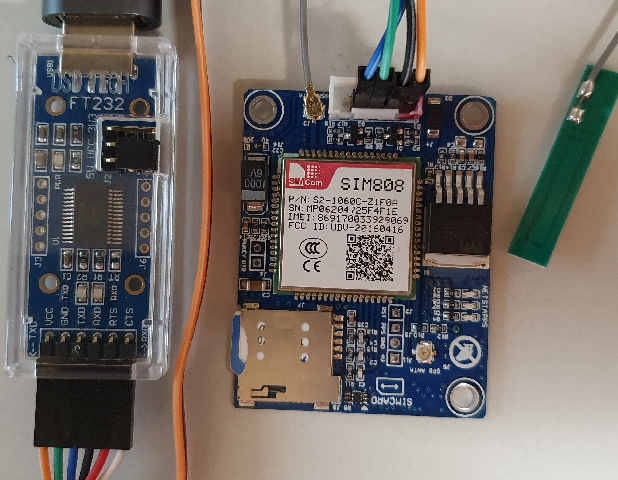
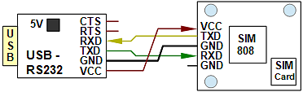

Last modified: 2022-01-24 <a name="up"></a>   
<table><tr><td></td><td>&nbsp;</td><td>
<h1>Raspberry Pi: Sending and receiving SMS via MQTT in C++</h1>
<a href="../README.md">==> Home page</a> &nbsp; &nbsp; &nbsp; 
<a href="m4h340_RasPiCppSms.md">==> German version</a> &nbsp; &nbsp; &nbsp; 
</td></tr></table>
<a href="https://github.com/khartinger/mqtt4home/tree/main/source_RasPi/m4hSms">==> Code @ GitHub</a><hr>

# What is it about?
If you want to receive an SMS in certain situations in home automation or control things via SMS, the program `m4hSms` presented here is very helpful for this:   
* The program `m4hSms` converts SMS to MQTT messages and vice versa.   
* Many properties of the program can be set in the configuration file (`m4h.conf`).   
* With a little knowledge of C++ the program can be easily adapted to your own needs.   

## This manual answers the following questions:   
1. [How are SMS and MQTT messages converted into each other?](#a10)   
2. [What tools are needed (as of August 2021)](#a20)   
3. [How to connect the SIM module to the RasPi?](#a30)   
4. [How to determine which port the SIM module is connected to](#a40)   
5. [How to create the program m4hSms?](#a50)   
6. [How to configure the program](#a60)   
7. [How to test the program m4hSms?](#a70)   

<a name="a10"></a>[Top of page](#up)   

# How are SMS and MQTT messages converted into each other?
The following scheme outlines the conversion from MQTT to SMS and vice versa. The MQTT topics for sending (at `sub:`), for replying (`subret:`) and for receiving SMS (at `pub:`) can be freely chosen and are in the configuration file `m4h.conf`.   

   
_Fig. 1: Function diagram of `m4hSms`_   

## Sending an MQTT message as SMS
* The __topic__ to send an SMS is defined in the configuration file `m4h.conf`, section `[sms]`, key `sub:` (e.g. `sub: sms/send`).   
* The __payload__ to send an SMS must consist of the phone number (without spaces!), a following space (as separator) and the SMS text.   

_Example: Send message as SMS_   
* `mosquitto_pub -h 10.1.1.1 -t sms/send -m "+43680XXXXX This SMS was sent via m4hSMS :-)"`   
  _Note 1_: The phone number (`+43680XXXXX`) must be replaced by a number enabled in `m4h.conf` (under `to:`).   
  _Note 2_: The program `m4hSms` must run on the RasPi ;)   

Under the topic `subret:` comes a reply message if the sending was successful (payload starts with `SMS sent ...` or `SMS NOT sent ...`).   

## Convert an SMS into an MQTT message
* A __plain SMS text__ is sent as a message under the topic specified in the configuration file `m4h.conf`, section `[sms]`, key `pub:` (e.g. `pub: sms/received`).   
The `pubNum: true` entry is used to specify that the phone number and date+time of the SMS are also sent in the payload.   

* __MQTT formatted SMS text__ contains the abbreviations `-t` (for Topic), `-m` (for message) and optionally `-r` (for retain) and is published as a corresponding message.   
_Example_:   
`-t info/test -m SMS test message`   
results in a message with the topic `info/test` and the payload `SMS test message`.   
Note: The SMS must come from a number enabled in `m4h.conf` (under `from:`).

* Possible __commands__ must be listed in the `m4h.conf` configuration file in the `[sms]` section. They consist of the key (e.g. `cmdversion:`) and the SMS text for the command (e.g. `-version-`). That means: If you send an SMS with the text `-version-` to the program `m4hSms`, you will get a reply SMS with the version number.   

<a name="a20"></a>[Top of page](#up)   

# What tools are needed? (as of August 2021)
* _Hardware_: RasPi with running broker (e.g. mosquitto).   
* _Hardware_: a SIM808 module   
  e.g. SIM808 module GSM with GPS antenna for 3G 4G SIM card e.g. from [AliExpress](https://de.aliexpress.com/item/1005002384541464.html?spm=a2g0s.9042311.0.0.5c824c4dqUu43E) or [Amazon](https://www.amazon.de/dp/B09CM8TSX9/ref=sspa_dk_detail_0?psc=1&pd_rd_i=B09CM8TSX9&pd_rd_w=yNPjf&pf_rd_p=4f2ceb27-95e9-46ab-8808-db390b56ec01&pd_rd_wg=Muvvr&pf_rd_r=3NTH9ZQRZNE3VBZKD1YV&pd_rd_r=58ca39f9-b9f0-40b5-9b14-7f5d8a37ce1d&spLa=ZW5jcnlwdGVkUXVhbGlmaWVyPUEzN1A5OTA0NUNBTTA2JmVuY3J5cHRlZElkPUEwMzcxNzc3MlkxMFpaUTBTRjhYMSZlbmNyeXB0ZWRBZElkPUEwNzU2MTYzMjRJSlNTREJMTjVHSiZ3aWRnZXROYW1lPXNwX2RldGFpbCZhY3Rpb249Y2xpY2tSZWRpcmVjdCZkb05vdExvZ0NsaWNrPXRydWU=)   
* _Hardware_: 4 wires   
  e.g. breadboard jumper wires female to female 4pin e.g. from [Amazon](https://www.amazon.de/Female-Female-Male-Female-Male-Male-Steckbr%C3%BCcken-Drahtbr%C3%BCcken-bunt/dp/B01EV70C78/ref=sr_1_1_sspa?__mk_de_DE=%C3%85M%C3%85%C5%BD%C3%95%C3%91&dchild=1&keywords=Breadboard+Jumper+Dr%C3%A4hte&qid=1629911840&sr=8-1-spons&psc=1&spLa=ZW5jcnlwdGVkUXVhbGlmaWVyPUEzRVMzTE5FRDJTWjJSJmVuY3J5cHRlZElkPUEwODQwNzA5MUZGVVRTNVE1WDBBTiZlbmNyeXB0ZWRBZElkPUExMDAwNjg1MUFSNzFTUlhGM0hSOSZ3aWRnZXROYW1lPXNwX2F0ZiZhY3Rpb249Y2xpY2tSZWRpcmVjdCZkb05vdExvZ0NsaWNrPXRydWU=)   
* _Hardware_: a USB to TTL Serial Adapter   
  DSD TECH USB to TTL Serial Adapter Converter SH-U09C with FTDI FT232RL e.g. from [Amazon](https://www.amazon.de/gp/product/B07BBPX8B8/ref=ppx_yo_dt_b_asin_title_o09_s00?ie=UTF8&psc=1) or DSD TECH USB to TTL Serial Adapter Converter SH-U09C5 e.g. from [Amazon](https://www.amazon.de/DSD-TECH-SH-U09C5-Konverterkabel-Unterst%C3%BCtzung/dp/B07WX2DSVB/ref=sr_1_10?__mk_de_DE=%C3%85M%C3%85%C5%BD%C3%95%C3%91&dchild=1&keywords=DSD+TECH+USB+to+TTL+Serial+Adapter+Converter&qid=1629910857&s=computers&sr=1-10)   
* _Hardware_: USB extension cable USB A male to A female   
  zB [PIPIKA USB 3.0 Verlängerung von Amazon](https://www.amazon.de/Verl%C3%A4ngerung-Verl%C3%A4ngerungskabel-Superschnelle-Vergoldeten-Kartenleseger%C3%A4t/dp/B08BHWJLLS/ref=sr_1_4?__mk_de_DE=%C3%85M%C3%85%C5%BD%C3%95%C3%91&dchild=1&keywords=USB+verl%C3%A4ngerungskabel+A-Buchse+1m&qid=1629911382&smid=A3PTYKYXFT73EG&sr=8-4)   
* _Hardware_: SIM card   
e.g. [in Austria HOT from Hofer/Aldi](https://www.hot.at/tarife.html?gclid=CjwKCAjw1JeJBhB9EiwAV612y80Gd6MxAkyvJRJ2BAeTtinSp9OnIBslTwBgd_B-iJANhbW7v5TQSBoCckgQAvD_BwE) with tariff "HoT flex-our basic tariff without fixed costs".   
---   
* _Software_: Internet access to GitHub   
* _Software_: Terminal program [putty](https://www.chiark.greenend.org.uk/~sgtatham/putty/latest.html) on the PC/laptop.   
* _Software_: MQTT-Clientprogramme `mosquitto_sub` and `mosquitto_pub`   
  (are installed with the Mosquitto broker installation).   
* _Software_: Eventual   
   [Visual Studio Code](https://code.visualstudio.com/) and   
   [WinSCP](https://winscp.net/eng/docs/lang:de) for data transfer from PC/laptop to RasPi   

<a name="a30"></a>[Top of page](#up)   

# How to connect the SIM module to the RasPi?
To send and receive SMS, at least one SIM module and one SIM card is required. The SIM module can be either
* be connected to the pins of the serial interface of the RasPi (Pin 2-5V, Pin 6-GND, Pin 8-TxD0 and Pin 10-RxD0), where a level adjustment 5V/3V3 is required, or   
* be connected to the RasPi via a USB-Serial-Adapter.   

The connection via a USB-Serial-Adapter is more expensive (because of the costs for the adapter), but easier.   

   
_Fig. 2: USB-Serial-Adapter SH-U09C, module SIM808 and GSM antenna (from left to right)_   
   
The jumper on the USB-Serial-Adapter must be set to 5V, because the supply voltage of the SIM module must be between 5 and 18V. (3.3V is too low).  

When connecting the SIM module to the USB-Serial-Adapter or RasPi, make sure that the pins TxD are connected to RxD and RxD to TxD ("cross out" the data lines).   

   
_Fig. 3: Connection between USB-Serial-Adapter and SIM-Module_   

__Do not forget__: A SIM card is required to send and receive SMS, although a prepaid card is sufficient for many applications, where no fixed costs are incurred. The SIM card is inserted into the SIM module (see Fig. 1, bottom left of the module).   

<a name="a40"></a>[Top of page](#up)   

# How to determine on which port the SIM module is connected?   
If several USB devices are connected to the RasPi, it is not always clear to which logical port (`/dev/ttyS0`, `/dev/ttyACM0`, `/dev/ttyUSB0`, `/dev/ttyUSB1` etc.) the SIM module is connected. This can be done with the help of the program [`
m4hFindSimModule`](https://github.com/khartinger/mqtt4home/tree/main/source_RasPi/m4hFindSimModule) to determine this:   

1. connect to the RasPi with Putty.   
2. create a directory for the program on the RasPi and change into it:   
  `mkdir ~/m4hFindSimModule`   
  `cd ~/m4hFindSimModule`   
3. create an empty file:   
  `nano m4hFindSimModule.cpp`.   
4. mark the [source code for `m4hFindSimModule`](https://github.com/khartinger/mqtt4home/blob/main/source_RasPi/m4hFindSimModule/m4hFindSimModule.cpp) on Github with [Raw] &lt;strg&gt; a, copy it with &lt;strg&gt; c and paste it into the empty file (right mouse button).   
5. save the file and exit by &lt;Ctrl&gt;o &lt;Enter&gt; &lt;Ctrl&gt; x
6. create the executable file   
   `g++ m4hFindSimModule.cpp -o m4hFindSimModule`   
7. start the program:   
  `~/m4hFindSimModule/m4hFindSimModule`   

Result (for example):   
```   
pi_@raspi:~/m4hFindSimModule $ ./m4hFindSimModule
Searching for modem...
/dev/ttyS0: NO modem found (error on reading OK)
/dev/ttyACM0: NO modem found (error on reading OK)
/dev/ttyUSB0: GSM modem found!
/dev/ttyUSB1: Could not open device (Error 2: No such file or directory)
```   
In this example the device name is `/dev/ttyUSB0`.   

&nbsp;   
<a name="a50"></a>[Top of page](#up)   

# How to create the program m4hSms?
The creation of the executable file is the same as described in the chapter [Raspberry Pi: Helpful single programs in C++](m4h08_RasPiCppDemos.md) as an example:   
1. create a project directory `mkdir ~/m4hSms`.   
2. change to the project directory `cd ~/m4hSms`   
3. copy the project files from GitHub to the project directory   
4. create the executable file `m4hSms`  
  `g++ m4hMain.cpp m4hBase.cpp ./modem/C_X232.cpp ./modem/C_Gsm.cpp -o m4hSms -lmosquitto -lpthread`   
5. start program   
  `~/m4hSms/m4hSms`   

Exit the program e.g. with the key combination &lt;Ctrl&gt;c   

<a name="a60"></a>[Top of page](#up)   

# How to configure the program?

The configuration of the program m4hSms is done with the help of the configuration file `m4h.conf`. This file can be edited with the text editor Nano, e.g.   
`nano ~/m4hSms/m4h.conf`   

In the section `[sms]` the following entries are required:   

* `device:` Interface to which the SIM module is connected.   
  Possible values are `ttyS0` for the serial interface or `ttyACM0`, `ttyUSB0`, `ttyUSB1` etc. for the USB interface.   

* `from: ` List of phone numbers from which SMS may be received.   
   (phone numbers separated by commas, numbers start with +...).

* `to: ` List of phone numbers to which SMS may be sent.   
   (phone numbers separated by commas, numbers start with +...).

* `sub: ` Topic for sending an SMS. The payload must contain the phone number, a space and then the desired SMS text.   

* `subret: ` Topic for a reply message after sending an SMS.   

* `pub: ` Topic under which incoming SMS will be sent if no topic was specified in the SMS.   
   Structure of an SMS with given topic: `-t topic -m payload`.   
   `-t ` stands for topic, `-m ` stands for payload. If another `-r` follows, the retain flag is set.   
---   
The following entries are optional:   

* `pubNum: ` Specifies whether the phone number and date+time should be specified in the payload for a received SMS in addition to the SMS text.   
  Default: `false` (i.e. use only SMS text as payload).

* `smsStart: ` Send an SMS to the specified phone number when the program `m4hSms` has been started, e.g.   
  `smsStart: +43..... program m4hSms started!`   
  For each phone number a separate line must be used.   
  Default: no start SMS   

* `smsEnd: ` Send an SMS to the specified phone number when the program `m4hSms` is finished, e.g.   
  `smsEnd: +43..... program m4hSms finished!`   
  For each phone number a separate line must be used.   
  Default: no end SMS   

* `cmdversion:` defines a SMS text which causes a reply SMS with the version number of the program `m4hSms`.   

* `cmdend:` defines an SMS text that causes the termination of the program `m4hSms`.   

* `cmdreload:` defines an SMS text that causes the reloading of the configuration file `m4h.conf`.   

* `cmdcredit:` defines an SMS text that causes the credit to be queried from the provider and the amount (in Euro) to be sent back as a reply SMS.   
   
_Note_: All keys like `device`, `from`, `to` etc. are defined in the source code of the file `C_Sms.hpp` with   
`#define SMS_..._KEY ...`   
and can easily be adapted to your own needs.   

### Example of a configuration file:   

```   
________m4h.conf________________________________khartinger_____
# Configuration file for mqtt4home
# 2021-08-27

[base]
versionIn:  m4hSms/get version
versionOut: m4hSms/ret/version 2021-08-27
mqttStart:  info/start m4hSms
mqttEnd:    info/end__ m4hSms
ProgEnd:    m4hSms/set -end-
addTime:    true

[sms]
# (serial) interface for sim module (ttyS0, ttyUSB0, ttyUSB1)
#device: /dev/ttyS0
device: /dev/ttyUSB0
# authorisized phone numbers
from: 6700,+43.....
to: 6700,+43.....
# mqtt base topics for sending and receiving
# sub-topic with payload num txt --> sms
# --> sms send result published under "subret:"
# sms (cmd, plain)          --> publish with topic pub
# sms (-t topic -m payload) --> publish topic payload
sub: sms/send
subret: sms/send/ret
pub: sms/received
# payload for received sms with phonenumber date+time sms-text
pubNum: true

smsStart: +43..... program m4hSms started!
smsEnd:   +43..... program m4hSms finished!
# sms or mqtt commands to which the program responds
cmdversion: -version-
cmdend:     -end-
cmdreload:  -reload-
cmdcredit:  -credit-
#netid:      T-Mobile A
#netphone:   6700
#nettext:    GUTHABEN
```   

_Note_: Lines starting with # are comment lines and will be ignored.   

<a name="a70"></a>[Top of page](#up)   

## How to test the m4hSms program?
## Preparation
### Hardware
* Connect SIM module with valid SIM card to RasPi ([see above](#30)).   
* Broker running on the Raspi with IP '10.1.1.1'.   
### Software
* Before starting the program, at least the interface (`device:`) and the phone numbers authorized to send (`to:`) and receive (`from:`) SMS must be entered in the `m4h.conf` configuration file in the `[sms]` section (see also the [configuration notes](#a60) above).   
* Start program:   
  `~/m4hSms/m4hSms`   
* Start `mosquitto_sub` in a first terminal window to follow all messages:   
  `mosquitto_sub -h 10.1.1.1 -t "#" -v`   

### Send SMS
In a (second) terminal window (on the PC or RasPi) type the following:   
`mosquitto_pub -h 10.1.1.1 -t sms/send -m "+43... My first SMS-test"`   
_Important_: Replace the number `+43...` with an authorized phone number!   

In the first terminal window you will see the following messages   
`sms/send +43XXXXXXXXX My first SMS-test`   
`sms/send/ret SMS sent (+43XXXXXXXXX: My first SMS-test)`   
and you will receive the corresponding SMS.   

If you forget to change the phone number, you will see the following messages in the first terminal window:   
`sms/send +43... My first SMS-test`   
`sms/send/ret SMS NOT sent #6 not allowed (+43...: My first SMS-test)`   

### Receive SMS
Write the following SMS on a smartphone (with authorized phone number!) and send it to the SIM module:   
`This is a test SMS from my smartphone`.   

After a short time you will read the following MQTT message in the first appointment window:   
`sms/received +43XXXXXXXXX\n24.01.2022 11:30:29\nThis is a test SMS from my smartphone`   
_Note_: In the configuration file there is the line `pubNum: true`, therefore the phone number (here describe with XXX) and date+time will be displayed.   

If the Vue component `CiSmsIn` is running in a browser, you can read the SMS here too.   

## Query credit
Via the smartphone you can also check the credit of the SIM card in the SIM module. To do this, send an SMS to the SIM module with the following content:   
`-credit-`   
After a short time you will receive an SMS with the corresponding amount in euros.   

The following messages are displayed in the terminal window:   
`sms/send/ret SMS sent (6700: GUTHABEN)`   
`sms/send/ret SMS sent (+43XXXXXXXXX: 15,08 Euro)`   

[Top of page](#up)   
