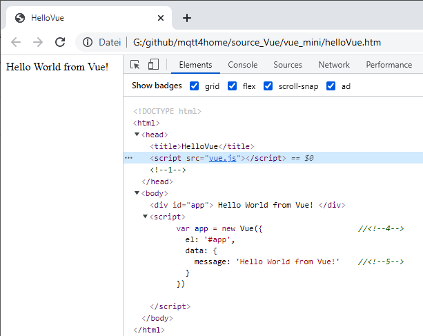

Last modified: 2021-09-15   
<table><tr><td></td><td>
<h1>Vue: First application (without Visual Studio Code)</h1>
<a href="../README.md">==> Home page</a> &nbsp; &nbsp; &nbsp; 
<a href="m4h501_Vue_Hello.md">==> German version</a> &nbsp; &nbsp; &nbsp; 
</td></tr></table>
<a href="https://github.com/khartinger/mqtt4home/tree/main/source_Vue/vue01_mini">==> Code @ GitHub</a><hr>

## Targets
* Know what Vue is.   
* Display in the browser a "Hello World from Vue!" created with Vue.   
   

## Prerequisites
* Some knowledge about HTML, CSS and JavaScript :)

## Required tools
* Hardware: PC or laptop with Internet access
* Software: Text editor, browser

## What is Vue?
Vue.js is a popular Java Script framework for building web applications. It helps to display data and can be extended by numerous plugins (e.g. for HTTP handling).   
Information is available e.g. on the following pages:   
* [https://en.wikipedia.org/wiki/Vue.js](https://en.wikipedia.org/wiki/Vue.js)   
* [https://t3n.de/news/vuejs-1097879/](https://t3n.de/news/vuejs-1097879/)   

## Create a web page with Vue
1. create an application directory (e.g. with the explorer):   
   `/source_Vue/vue_mini`   

2. download the Vue framework e.g. from [`https://vuejs.org/v2/guide/installation.html`](https://vuejs.org/v2/guide/installation.html)   
"Development Version" (file `vue.js`)   

3. copy the framework or the file `vue.js` into the working directory (e.g. `/source_Vue/vue_mini`).   

4. create the HTML page in the text editor:   
   ```   
   <!DOCTYPE html>
   <html>
   <head>
     <title>HelloVue</title>
     <script src="vue.js"></script>            <!--1-->
   </head>
   <body>
     <div id="app">                            <!--2-->
       {{ message }}                           <!--3-->
     </div>

     <script>
       var app = new Vue({                     //<!--4-->
         el: '#app',
         data: {
           message: 'Hello World from Vue!'    //<!--5-->
         }
       })
     </script>
   </body>
   </html>
   ```   
   Save e.g. under the name `halloVue.htm`.   
   The most important lines are:   
   * `<!--1-->` Include the Vue functions (Vue framework)   
   * `<!--2-->` With the help of this &lt;div&gt;-tag and the id "app" the "text" generated by the Vue script is inserted here.   
   * `<!--3-->` Output of the value of the variable `message`.   
   * `<!--4-->` Create the Vue instance, where `el:` is the Id.   
   * `<!--5-->` Create the variable `message` and assign the text.   

5. open the file `halloVue.htm` in the browser (e.g. Chrome).   
   With the key &lt; F12&gt; the debug mode can be displayed.   
      
   _Fig. 1: First Vue programm_   
   In figure 1 you can see the output of the HTML page on the left and on the right you can see in the HTML code that the content of the `<div>` tag has been replaced by the value of the `message` variable.   
