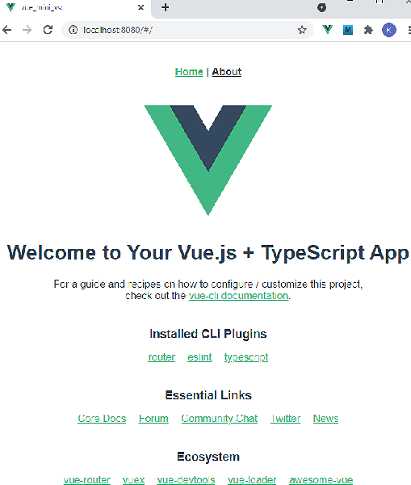

Letzte &Auml;nderung: 12.10.2021   
<table><tr><td></img></td><td>&nbsp;</td><td>
<h1>Vue: Erste Anwendung mit Visual Studio Code</h1>
<a href="../LIESMICH.md">==> Startseite</a> &nbsp; &nbsp; &nbsp; 
<a href="m4h502_Vue_Hello_VSC_e.md">==> English version</a> &nbsp; &nbsp; &nbsp; 
</td></tr></table><hr>
  
## Ziele
* Visual Studio Code (kurz "VSC") f&uuml;r Vue vorbereiten.   
* Im Browser die von Visual Studio Code automatisch erzeugte Startseite ("Welcome to Your Vue.js + TypeScript App") anzeigen.   
* Die Standard-App so &auml;ndern, dass eine eigene Komponente "Hello.vue" den Text "Hello World from Vue!" als &Uuml;berschrift anzeigt.   

## Voraussetzungen
* Etwas Wissen &uuml;ber HTML, CSS und JavaScript :)

## Erforderliche Hilfsmittel
* Hardware: PC oder Laptop mit Internetzugang
* Software: Visual Studio Code, node.js, npm

## Vorbereitung
1. Visual Studio Code installieren.   
   Anleitung zB [https://code.visualstudio.com/docs/setup/setup-overview](https://code.visualstudio.com/docs/setup/setup-overview)   
2. Node.js installieren.   
   Anleitung zB [https://nodejs.org/de/download/](https://nodejs.org/de/download/) oder   
   [https://docs.npmjs.com/downloading-and-installing-node-js-and-npm](https://docs.npmjs.com/downloading-and-installing-node-js-and-npm)   
3. npm (Node.js package manager) installieren.   
---   
4. Visual Studio Code (VSC) starten   
5. Testen, ob node und npm richtig installiert wurden:   
   `VSC: Men&uuml; Terminal – New Terminal... (oder <Strg>+<Shift>+&ouml;)`   
   __`node –-version`__   
   `v14.15.4`   
   __`npm –-version`__   
   `6.14.10`   
6. VSC: Vue Command Line Interface (CLI) installieren (falls noch nicht erfolgt)
   __`npm install -g @vue/cli`__   
   `+ @vue/cli@4.5.11`   
   `updated 3 packages in 31.526s`   
7. VSC: Ventur Erweiterung f&uuml;r Syntax Highlighting installieren (falls noch nicht erfolgt)   
   Extensions-Auswahl &ouml;ffnen (&lt;Strg&gt;+&lt;Shift&gt;+X)   
   ```   
   <Strg> + <Shift> + X
   Ventur suchen [Install]
   ```   
## Erste Anwendung erstellen
1. Visual Studio Code (VSC) starten (falls noch nicht erfolgt).
2. VSC: Ein Terminal-Fenster &ouml;ffnen (`Men&uuml; Terminal - New Terminal`).
3. VSC-Terminal: In den Ordner wechseln, unter dem das Vue-Projekt erzeugt werden soll:   
   `cd /g/github/mqtt4home/source_Vue`   
4. VSC-Terminal: Eine Vue.js Applikation erzeugen (mit der Cursor-Down-Taste "Manually select features" ausw&auml;hlen und &lt;enter&gt; dr&uuml;cken):   
   __`vue create vue_mini_vsc`__   
   ```   
   Vue CLI v4.5.11
   ? Please pick a preset:
     Default ([Vue 2] babel, eslint)
     vue3-typescript ([Vue 3] babel, typescript, router, eslint) 
     Default (Vue 3 Preview) ([Vue 3] babel, eslint)
   > Manually select features
   <Enter>
   ```   
   Im n&auml;chsten Schritt mit den Cursortasten und der Leertaste folgende Punkte ausw&auml;hlen:   
   ```   
   ? Check the features needed for your project: (mit Cursor- und Leertaste ausw&auml;hlen)
    (*) Choose Vue version
    (*) Babel
    (*) TypeScript
    ( ) Progressive Web App (PWA) Support        
    ( ) Router
    ( ) Vuex
    ( ) CSS Pre-processors
   >(*) Linter / Formatter
    ( ) Unit Testing
    ( ) E2E Testing
   <Enter>
   ```   
   Vue-Version 3.x ausw&auml;hlen:   
   ```   
   Check the features needed for your project: Choose Vue version, TS, Router, Linter 
   ? Choose a version of Vue.js that you want to start the project with 
     2.x
   > 3.x
   <Enter>
   ```   

   Die weiteren Fragen zB folgenderma&szlig;en beantworten (dazwischen immer mit &lt;Enter&gt; best&auml;tigen):   
   ```   
   Vue CLI v4.5.13
   ? Please pick a preset: Manually select features
   ? Check the features needed for your project: Choose Vue version, TS, Router, Linter 
   ? Choose a version of Vue.js that you want to start the project with 3.x 
   ? Use class-style component syntax? No
   ? Use Babel alongside TypeScript (required for modern mode, auto-detected polyfills, transpiling JSX)? No
   ? Pick a linter / formatter config: ESLint + Standard config
   ? Pick additional lint features: Lint on save
   ? Where do you prefer placing config for Babel, ESLint, etc.? In dedicated config files
   ? Save this as a preset for future projects? (y/N) N
   <Enter>
   ```   
   (babel: transpile JavaScript to HTML, eslint: hilft beim Finden von Code-Fehlern).   
   Das Erstellen der Applikation kann schon ein Weilchen dauern, immerhin werden ca. 200 MB Festplattenspeicher beschrieben ;)   
   ```   
   ...
   Successfully created project vue_mini_vsc.
   Get started with the following commands:
    $ cd vue_mini_vsc
    $ npm run serve
   ```   

5. VSC: Projektordner &ouml;ffnen   
   `Men&uuml;: File – Open Folder... und Verzeichnis vue_mini_vsc w&auml;hlen`   

6. VSC: Wechsel ins Projektverzeichnis und Starten des internen Test-Servers:   
   Eingabe im Terminal-Fenster (Men&uuml;: Terminal - New Terminal)   
   ```   
   cd vue_mini_vsc
   npm run serve
   ```   

7. Applikation anschauen: Browser starten und folgendes eingeben:   
   `localhost:8080`   
   Es erscheint folgende Info-Seite:   
      
   _Bild 1: Vue Startseite_

## Eigene Komponente erstellen
* Die Datei `Hello.vue` anlegen:   
   Men&uuml; Anzeigen - Explorer. Mit der rechten Maustaste auf `components` klicken - "Neue Datei" w&auml;hlen und `Hello.vue` eingeben.   
   Inhalt der Datei `Hello.vue`:   

```   
<!--Hello.vue-->
<template>
<h1>Hello World from Vue!</h1>
</template>
<script lang="ts">
import { defineComponent } from 'vue'

export default defineComponent({
  name: 'HelloWorld',
  props: {
    msg: String
  }
})
</script>

<!-- Add "scoped" attribute to limit CSS to this component only -->
<style scoped>
</style>

```   
   (Wichtig ist auch die Leerzeile nach &lt;/style&gt; ;) )   

* Aufruf der Komponente in App.vue   
Men&uuml; Anzeigen - Explorer. Mit der linken Maustaste Doppelklick auf `App.vue`   
Den Inhalt der Datei folgenderma&szlig;en &auml;ndern:   
```   
<template>
  <Hello></Hello>
</template>

<script lang="ts">
import { defineComponent } from 'vue'
import Hello from './components/Hello.vue'

export default defineComponent({
  name: 'App',
  components: {
    Hello
  }
})
</script>

<style>
#app {
  font-family: Avenir, Helvetica, Arial, sans-serif;
  -webkit-font-smoothing: antialiased;
  -moz-osx-font-smoothing: grayscale;
  text-align: center;
  color: #2c3e50;
  margin-top: 60px;
}
</style>

```   

* Neustart des Servers
   Eingabe im Terminal-Fenster (Men&uuml;: Terminal - New Terminal)   
   `npm run serve`   
   Im Brower-Fenster erscheint mittenzentriert der Text "Hello World from Vue!"   

Soll die Anzeige linksb&uuml;ndig erfolgen, muss in `App.vue` der style entsprechend ge&auml;ndert werden:   
`  text-align: left; /* center; */`   

* Entfernen nicht mehr ben&ouml;tigter Komponenten   
  Folgende Dinge k&ouml;nnen aus dem Projekt gel&ouml;scht werden, da sie nicht mehr ben&ouml;tigt werden:   
  * Datei `HelloWorld.vue`   
  * Verzeichnis `assets` (mit dem Logo-Bild)   
