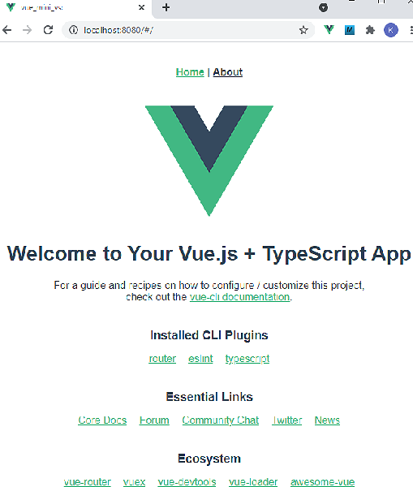

Last modified: 2021-10-12   
<table><tr><td></td><td>&nbsp;</td><td>
<h1>Vue: First application with Visual Studio Code</h1>
<a href="../readme.md">==> Home page</a> &nbsp; &nbsp; &nbsp; 
<a href="m4h502_Vue_Hello_VSC.md">==> German version</a> &nbsp; &nbsp; &nbsp; 
</td></tr></table><hr>

## Targets
* Prepare Visual Studio Code (VSC for short) for Vue.   
* In the browser, display the home page automatically generated by Visual Studio Code ("Welcome to Your Vue.js + TypeScript App").   
* Change the default app so that a custom component "Hello.vue" displays the text "Hello World from Vue!" as headline.    

## Prerequisites
* Some knowledge about HTML, CSS and JavaScript :)

## Required tools
* Hardware: PC or laptop with Internet access
* Software: Visual Studio Code, node.js, npm

## Preparation
1. install Visual Studio Code.   
   Instructions e.g. [https://code.visualstudio.com/docs/setup/setup-overview](https://code.visualstudio.com/docs/setup/setup-overview).   
2. install Node.js.   
   Instructions e.g. [https://nodejs.org/de/download/](https://nodejs.org/de/download/) or   
   [https://docs.npmjs.com/downloading-and-installing-node-js-and-npm](https://docs.npmjs.com/downloading-and-installing-node-js-and-npm)   
3. Install npm (Node.js package manager).   
---   
4. start Visual Studio Code (VSC)   
5. test if node and npm are installed correctly:   
   `VSC: Terminal menu - New Terminal... (or <Ctrl>+<Shift>+ö)`   
   __`node --version`__   
   `v14.15.4`   
   __`npm --version`__   
   `6.14.10`   
6. install VSC: Vue Command Line Interface (CLI) (if not already done)
   __`npm install -g @vue/cli`__   
   `+ @vue/cli@4.5.11`   
   `updated 3 packages in 31.526s`   
7. install VSC: Ventur extension for syntax highlighting (if not already done)   
   open extension selection (&lt;Ctrl&gt;+&lt;Shift&gt;+X)   
   ```   
   <Ctrl> + <Shift> + X
   Search Ventur [Install]
   ```   
## Create first application
1. start Visual Studio Code (VSC) (if not already done).
2. VSC: Open a terminal window (`Menu Terminal - New Terminal`).
3. VSC terminal: Change to the folder under which the Vue project should be created:   
   `cd /g/github/mqtt4home/source_Vue`.   
4. VSC terminal: Create a Vue.js application (select "Manually select features" with the cursor down button and press &lt;enter&gt;):   
   __`vue create vue_mini_vsc`__   
   ```   
   Vue CLI v4.5.11
   ? Please pick a preset:
     Default ([Vue 2] babel, eslint)
     vue3-typescript ([Vue 3] babel, typescript, router, eslint) 
     Default (Vue 3 Preview) ([Vue 3] babel, eslint)
   > Manually select features
   <Enter>
   ```   
   In the next step, use the cursor keys and the space bar to select the following items:   
      ```   
   ? Check the features needed for your project: (mit Cursor- und Leertaste auswählen)
    (*) Choose Vue version
    (*) Babel
    (*) TypeScript
    ( ) Progressive Web App (PWA) Support        
    ( ) Router
    ( ) Vuex
    ( ) CSS Pre-processors
   >(*) Linter / Formatter
    ( ) Unit Testing
    ( ) E2E Testing
   <Enter>
   ```   
   Select Vue version 3.x:   
   ```   
   Check the features needed for your project: Choose Vue version, TS, Router, Linter 
   ? Choose a version of Vue.js that you want to start the project with 
     2.x
   > 3.x
   <Enter>
   ```   

   Answer the other questions e.g. as follows (in between always confirm with &lt;Enter&gt;):   
   ```   
   Vue CLI v4.5.13
   ? Please pick a preset: Manually select features
   ? Check the features needed for your project: Choose Vue version, TS, Router, Linter 
   ? Choose a version of Vue.js that you want to start the project with 3.x 
   ? Use class-style component syntax? No
   ? Use Babel alongside TypeScript (required for modern mode, auto-detected polyfills, transpiling JSX)? No
    ? Pick a linter / formatter config: ESLint + Standard config
   ? Pick additional lint features: Lint on save
   ? Where do you prefer placing config for Babel, ESLint, etc.? In dedicated config files
   ? Save this as a preset for future projects? (y/N) N
   <Enter>
   ```   
   (babel: transpile JavaScript to HTML, eslint: helps to find code errors).   
   Building the application can take a while, after all about 200 MB of disk space are written ;)   
   ```   
   ...
   Successfully created project vue_mini_vsc.
   Get started with the following commands:
    $ cd vue_mini_vsc
    $ npm run serve
   ```   

5. VSC: Open project folder   
   `Menu: File - Open Folder... and select directory vue_mini_vsc`   

6. VSC: Change to the project directory and start the internal test server:   
   Input in the terminal window (Men&uuml;: Terminal - New Terminal)   
   ```   
   cd vue_mini_vsc
   npm run serve
   ```   

7. view application: Start browser and enter the following:   
   `localhost:8080`   
   The following info page appears:   
      
   _Fig. 1: Vue start page_

## Create your own component
* Create the file 'Hello.vue':   
   Men&uuml; Display - Explorer. Right click on `components` - select "New file" and enter `Hello.vue`.   
   Content of the file `Hello.vue`:   

```   
<!--Hello.vue-->
<template>
<h1>Hello World from Vue!</h1>
</template>
<script lang="ts">
import { defineComponent } from 'vue'

export default defineComponent({
  name: 'HelloWorld',
  props: {
    msg: String
  }
})
</script>

<!-- Add "scoped" attribute to limit CSS to this component only -->
<style scoped>
</style>

```   
   (Also important is the blank line after &lt;/style&gt; ;) )   

* Calling the component in App.vue   
Men&uuml; Display - Explorer. With the left mouse button double click on 'App.vue'   
Change the content of the file as follows:   
```   
<template>
  <Hello></Hello>
</template>

<script lang="ts">
import { defineComponent } from 'vue'
import Hello from './components/Hello.vue'

export default defineComponent({
  name: 'App',
  components: {
    Hello
  }
})
</script>

<style>
#app {
  font-family: Avenir, Helvetica, Arial, sans-serif;
  -webkit-font-smoothing: antialiased;
  -moz-osx-font-smoothing: grayscale;
  text-align: center;
  color: #2c3e50;
  margin-top: 60px;
}
</style>

```   

* Restart of the server
   Input in the terminal window (Men&uuml;: Terminal - New Terminal)   
   `npm run serve`   
   The text "Hello World from Vue!" appears centered in the brower window.   

If you want the text to be displayed left-centered, you have to change the style in `App.vue` accordingly:   
` text-align: left; /* center; */`   

* Removing components that are no longer needed   
  The following items can be deleted from the project as they are no longer needed:   
  * file `HelloWorld.vue`   
  * directory `assets` (containing the logo image)   
