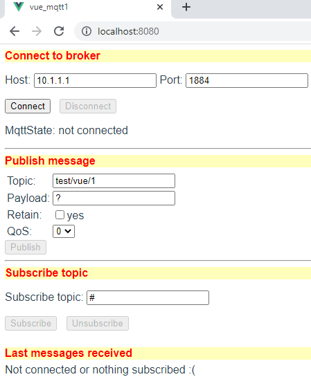

Last modified: 2021-10-06   
<table><tr><td></td><td>&nbsp;</td><td>
<h1>Vue: Sending and receiving MQTT messages</h1>
<a href="../readme.md">==> Home page</a> &nbsp; &nbsp; &nbsp; 
<a href="m4h504_Vue_Mqtt1.md">==> German version</a> &nbsp; &nbsp; &nbsp; 
</td></tr></table><hr>

## Target
* Create a Vue application that can be used to send and subscribe/view MQTT messages:   
   
_Figure 1: Start page of the MQTT transmit/receive program_.   

__The program shall consist of five parts:__.   
1. an MQTT client, which provides the MQTT functions.   
2. a GUI component that can be used to connect to a broker.   
   The host on which the broker is running (e.g. IP 10.1.1.1) and the port for the WebSocket connection (e.g. 1884) can be entered in input fields.   
3. a GUI component that can be used to send a message.   
   It is possible to enter the topic, payload, whether the message should be saved ("retain") and the QoS level (Quality of Service).   
4. a GUI component, with which one can subscribe to a topic.   
5. a GUI component that shows the last 5 messages for the subscribed topic.   

_For the impatient_: [link to finished program](https://github.com/khartinger/mqtt4home/tree/main/source_Vue/vue_mqtt1)

## Requirements
* Some knowledge about HTML, CSS and JavaScript/Typescript :)   
* Visual Studio code ("VSC") that is already prepared for Vue applications.   
   (I.e. (at least) one Vue application has already been created in Visual Code).   

## Required tools
* Hardware: PC or laptop with internet access, browser.
* Software: Visual Studio Code, node.js, npm

## Preparation of the Vue project in VSC (short version).   
1. start Visual Studio Code (VSC).   
2. VSC: Open terminal window: Menu Terminal - New Terminal.   
3. VSC terminal: Change to the folder where the Vue project should be created:   
   `cd /g/github/mqtt4home/source_Vue`.   
4. VSC-Terminal: Create Vue.js application: `vue create vue_mqtt1`.  
   Use cursor keys, space bar and &lt;Enter&gt; to select the following:   
   `> Select features manually`   
   `(*) Select Vue version`   
   `(*) Babel`   
   `(*) TypeScript`   
   `( ) Router`   
   `(*) Linter / Formatter`   
   `> 3.x`   
   `? Use component syntax in class style? No`   
   `? Use Babel alongside TypeScript (required for modern mode, autodetected polyfills, transpiling of JSX)? No`   
   `? Use history mode for router? (Requires proper server setup for index fallback in production) No` `?   
   `? Choose a linter/formatter configuration: ESLint + default configuration` ?   
   `? Choose additional lint functions: Lint on save`   
   `? Where do you want to store the configuration for Babel, ESLint etc.? In a separate configuration file`   
   `? Save this as a preset for future projects? (y/N) N`.   
5. change to the project folder: VSC Menu File - Open Folder .
6. install MQTT library: `npm install mqtt --save`.   

## 1. creation of the MQTT client
The MQTT client consists of two files, which are located in the directory `services`.   
1. The file `MqttClient.ts` contains the four interfaces `Message`, `MqttState`, `MqttConnection`, `MqttSubscription` and the class `MqttClient`.   
The interfaces are used in the `MqttClient` class to store information about the connection and subscription state. Furthermore, methods are provided for the following purposes:   
   * `connectUrl ........` Assembling the connection URL from host, port and MQTT endpoint.   
   * `connect ...........` Connecting to the broker   
   * `disconnect ........` Disconnect from the broker   
   * `subscribe .........` Subscribe to a topic   
   * `unsubscribe .......` Disconnect from subscribing to a topic   
   * `publish ...........` Publish a message   
   * `sConnMqttState ....` Connection state as text ("connected" etc.)   
   * `hostSubscribe .....` Connect to the specified broker and subscribe to the specified topic   
   * `registerController ` Register a controller so that it can get messages forwarded (and evaluate them in the `onMessage` method).   

Coding of the file [`MqttClient.ts` see `https://github.com/khartinger/mqtt4home/blob/main/source_Vue/vue_mqtt1/src/services/MqttClient.ts`](https://github.com/khartinger/mqtt4home/blob/main/source_Vue/vue_mqtt1/src/services/MqttClient.ts)


2. The file `MqttClientInstance.ts` exports the connection object `mqttClientInstance`.   
In this file all MQTT controllers can be registered that want to have MQTT messages forwarded:   
```   
// ______mqttClientInstance.ts__________________________________
import { MqttClient } from './MqttClient'.
import { mqttLastXController } from '.@/controller/MqttLastXController'.

export const mqttClientInstance = new MqttClient()
mqttClientInstance.registerController(mqttLastXController)
```   
In the above example only the controller `mqttLastXController` is registered.   

## 2. connection GUI `MqttConnect.vue`
The `MqttConnect.vue` file contains a graphical user interface for entering the connection data for host and port and the [Connect] and [Disconnect] buttons for connecting and disconnecting to the host. Using the `connected` property and the status of the connection, the buttons are shown or hidden and the connection status is displayed.   
```   
<!-- MqttConnect.vue -->
<template>
  <div class="mqtt_title">Connect to broker</div>
  <p>                                            <!--1-->
    Host: <input v-model="hostip">
    Port: <input type="number" v-model.number="hostport">
  </p>
                                                 <!--2-->
  <button @click="connect()" :disabled="isConnected || isConnecting">Connect</button> &nbsp;
  <button @click="end()"     :disabled="!isConnected">Disconnect</button> &nbsp;
  <p>
    MqttState: {{ getMqttState }}                <!--3-->
    <span v-if=isConnected>
       &nbsp; (Broker at {{ getConnectUrl }})    <!--4-->
    </span>
    <span v-if=isConnecting>
      &nbsp;
      <button @click="cancel()">Cancel</button>  <!--5-->
    </span>
  </p>
</template>

<script lang="ts">
import { defineComponent } from 'vue'
import { mqttClientInstance } from '@/services/MqttClientInstance'

export default defineComponent({
  data () {
    return {
      hostip: mqttClientInstance.mqttConnection.host,
      hostport: mqttClientInstance.mqttConnection.port
    }
  },
  computed: {
    isConnected: function (): boolean {
      return mqttClientInstance.mqttState.connected
    },
    isConnecting: function (): boolean {
      if (mqttClientInstance.mqttState.iConnMqttState === 2) return true
      return false
    },
    getMqttState: function (): string {
      return mqttClientInstance.sConnMqttState()
    },
    getConnectUrl: function (): string {
      return mqttClientInstance.connectUrl()
    }
  },
  mounted: async function (): Promise<void> {
    // this.connect()
  },
  methods: {
    connect: async function (): Promise<void> {
      if (!this.isConnected) {
        console.log('MqttConnect.vue: Connecting to ' + this.hostip + ':' + this.hostport + '...')
        await mqttClientInstance.connect(this.hostip, this.hostport, '')
        console.log('MqttConnect.vue: Connected to ' + this.getConnectUrl)
      }
    },
    end: async function (): Promise<void> {
      mqttClientInstance.disconnect()
    },
    cancel: async function (): Promise<void> {
      mqttClientInstance.disconnect()
    }
  }
})
</script>

<style>
</style>
```   
You can see the division of the code into the graphics part `<template>` and the program part `<script>`.   
__Graphics part:__   
* `<--1-->` input fields for host and port.   
   With `v-model` the content of the text fields is linked to the variables `hostip` and `hostport` respectively. The default values are taken from `mqttClientInstance.mqttConnection`.   
* `<--2-->` Input buttons [Connect] and [Disconnect], which are disabled depending on the program state.   
* `<--3-->` Display of the connection state (as text).   
* `<--4-->` If there is a connection with the broker, the URL is displayed additionally.   
* `<--5-->` During the connection state a button [Cancel] is displayed, with which the connection establishment can be canceled (e.g. in case of a wrong IP address).   

The style for the headline (`class="mqtt_title"` with red font on yellow background) is defined in the file `App.vue`, so that it is available for all Vue components.   

__Script part:__   
In the script part the data of the connection state (from `mqttClientInstance`) for the graphics part as well as the functions `connect()`, `end()` and `cancel()` are provided.

## 3. GUI for sending a message (`MqttPublish.vue`)
In the __graphics-part__ (`<template>`) there are   
* two input fields (for topic and payload),   
* a check box (for retain yes/no), and   
* a selection list (for QoS) and   
* the button to submit the publish function.   

The linking of the input fields with the variables in the script part is again done with `v-model`, the definition of the style for the headline (`class="mqtt_title"`) is again in the file `App.vue`.   

In the __script-part__ 
* in the data block the variable msg is defined, whose components are used for data exchange with the GUI elements.   
* The function `isConnected` checks if there is a connection to the broker. 
Accordingly, the [Publish] button is disabled or not.   
* The `publish` method calls the MQTT client method of the same name to publish a message.   

## 4. GUI to subscribe to messages (`MqttSubscribe`)
The GUI for subscribing to messages contains an input field for the topic to be subscribed to. The [Subscribe] and [Unsubscribe] buttons are activated depending on whether there is a connection to the broker and whether a topic is currently being listened to.   
A special feature is the variable `subscribedTopic`: Together with the variable `topicsub` it is used to keep the content of the text field in sync with the value in the MQTT client:   
* When the application starts, the default value is fetched from the MQTT client (`computed: { subscribedTopic: ...}`).   
* If the value changes, the text field is also updated (`watch: { subscribedTopic: ...`).   
* Updating the value in the MQTT client is done automatically when executing the `await mqttClientInstance.subscribe(this.topicsub, 0)` function.   

When unsubscribing, the message store is also cleared (call `clearMessage()`).   

## 5. display of messages
The display of the last X messages is divided into three files:   
* `components/MqttLastX.vue: ` Display of messages (Topic, Payload, Retain, QoS) in form of a table. If there are no messages to display, only the heading of the table is output. If no topic is subscribed, the text "`Not connected or nothing subscribed :(`" is displayed.   
   Furthermore the file contains some styles for displaying the table.   
* `controller/MqttLastXController.ts: ` The file contains the class `MqttLastXController` derived from `DeviceController`, which contains the method `onMessage`. In this method the incoming message is added to the message store (`this.addMessage(message)`).   
* `store/MessageStrore.ts: ` This file contains the maximum number of entries into the store (`maxSize`), the store for the messages (`messageStore`), a method to export the messages (`messages`), a method to add a message (`addMessage`) and a method to clear the store (`clearMessage`)


## Adjustments in `main.ts` and `App.vue`
The `main.ts` file creates the application (`createApp`) and starts it (`mount`). The default contents of the file should be replaced by the following lines:   
```   
// ______main.ts________________________________________________
import { createApp, h } from 'vue'.
import App from './App.vue'

const app = createApp({
  render: () => h(App)
})

app.mount('#app')
```   

In the file `App.vue` the individual components are imported and displayed. A dash (tag `<hr>`) is inserted between the display of the components.   
Also the styles `#app` and `.mqtt_title` are defined.   
```   
<!-- App.vue -->
<template>
<MqttConnect></MqttConnect>
<hr>
<MqttPublish></MqttPublish>
<hr>
<MqttSubscribe></MqttSubscribe>
<br><br>
<MqttLastX></MqttLastX>
</template>

<script lang="ts">
import { defineComponent } from 'vue'
import MqttConnect from './components/MqttConnect.vue'
import MqttPublish from './components/MqttPublish.vue'
import MqttSubscribe from './components/MqttSubscribe.vue'
import MqttLastX from './components/MqttLastX.vue'

export default defineComponent({
  name: 'App',
  components: {
    MqttConnect,
    MqttPublish,
    MqttSubscribe,
    MqttLastX
  }
})
</script>

<style>
#app {
  font-family: Avenir, Helvetica, Arial, sans-serif;
  -webkit-font-smoothing: antialiased;
  -moz-osx-font-smoothing: grayscale;
  text-align: left;
  color: #2c3e50;
  margin-top: 0px;
}
.mqtt_title {
  font-family: Avenir, Helvetica, Arial, sans-serif;
  font-weight: bold;
  text-align: left;
  color: #FF0000;
  background-color: #FFFFBB;
  margin-top: 6px;
  margin-bottom: 6px;
}
</style>
```   
