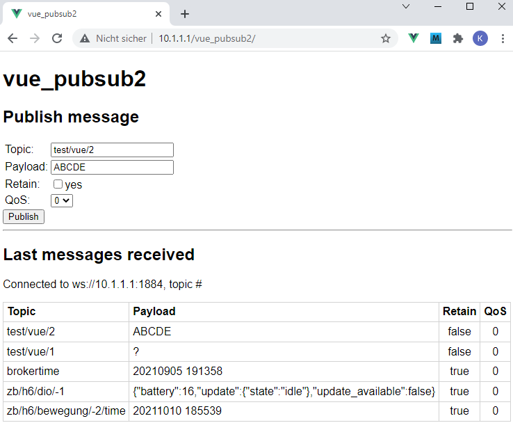

Last modified: 2021-10-15   
<table><tr><td></td><td>&nbsp;</td><td>
<h1>Vue + RasPi: Sending and automatically receiving MQTT messages</h1>
<a href="../readme.md">==> Home page</a> &nbsp; &nbsp; &nbsp; 
<a href="m4h504_Vue_PubSub2.md">==> German version</a> &nbsp; &nbsp; &nbsp; 
</td></tr></table><hr>

## Target
* Create a Vue application that runs on the Raspberry Pi and can be used to send and automatically subscribe or display MQTT messages:   
   
_Figure 1: MQTT send/receive program_.   
The application shall be invoked by entering the URL `10.1.1/vue_pubsub2`   

__The program shall consist of three parts:__   
1. an MQTT client, which provides the MQTT functions.   
2. a GUI component, with the help of which one can send a message.   
   It is possible to enter the topic, payload, whether the message should be stored ("retain") and the QoS level (Quality of Service).   
3. a GUI component that displays the last 5 messages for the given topic.   

To make the Vue project manageable (and easily extensible), the files are distributed to different subdirectories.

_For the impatient_: [Link to the finished program](https://github.com/khartinger/mqtt4home/tree/main/source_Vue/vue_pubsub2)

## Requirements
* Some knowledge &uuml;ber HTML, CSS and JavaScript/Typescript :)   
* Visual Studio Code ("VSC") already prepared for Vue applications.   
   (I.e. (at least) one Vue application has already been created in Visual Code).   

## Required tools
* Hardware: RasPi
* Hardware: PC or laptop with internet access, browser
* Software: Internet access
* Software: Visual Studio Code, node.js, npm
* Software: terminal program [putty](https://www.chiark.greenend.org.uk/~sgtatham/putty/latest.html) on PC/laptop
* Software: [WinSCP](https://winscp.net/eng/docs/lang:de) for data transfer from PC/laptop to RasPi   

## Preparation of the Vue project in VSC (short version).   
1. start Visual Studio Code (VSC).   
2. VSC: Open Terminal window: Men&uuml; Terminal - New Terminal.   
3. VSC terminal: Change to the folder under which the Vue project is to be created:   
   `cd /g/github/mqtt4home/source_Vue`   
4. VSC-Terminal: Create Vue.js application: `vue create vue_pubsub2`  
   Use cursor keys, space bar and &lt;Enter&gt; to select the following:   
   `> Manually select features`   
   `(*) Choose Vue version`   
   `(*) Babel`   
   `(*) TypeScript`   
   `( ) Router`   
   `(*) Linter / Formatter`   
   `> 3.x`   
   `? Use class-style component syntax? No`   
   `? Use Babel alongside TypeScript (required for modern mode, auto-detected polyfills, transpiling JSX)? No`   
   `? Pick a linter / formatter config: ESLint + Standard config`   
   `? Pick additional lint features: Lint on save`   
   `? Where do you prefer placing config for Babel, ESLint, etc.? In dedicated config file`   
   `? Save this as a preset for future projects? (y/N) N`   
5. change to the project folder: VSC Men&uuml; File - Open folder....
6. install MQTT library: Men&uuml; Terminal - New Terminal: `npm install mqtt --save`   

## Part 1: Creating the MQTT Client
MQTT access for various applications is organized as follows:    
1. all things needed for a connection to the broker are combined in a class `MqttClient`.   
2. for a unified MQTT access an abstract base class `DeviceController` is defined, which specifies three methods:   
    * `public registerClient(mqttClient: MqttClient)` ... Method to register a controller with the MqttClientInstance object.   
    * `protected async publish(topic: string, payload: string)` ... Method to send a message.   
    * `public abstract onMessage(message: Message)` ... Method to process incoming messages.   

3. the connection between the `MqttClient` class and the app or the various controllers is the `MqttClientInstance.ts` file:   
Here the mqttClient object is created and here all controllers have to register.

Thus the MQTT client consists of three files, which are distributed over the (newly created) directories `services` and `controller`:   
1. `./src/services/MqttClient.ts`   
2. `./src/services/MqttClientInstance.ts`   
3. `./src/controller/DeviceController.ts`   

### 1. creation of the MqttClient class
* Creation of the `services` directory:   
   View menu - Explorer. Right click on `src` - select "New folder" and type `services`   
* Create the `MqttClient.ts` file:   
   Men&uuml; Display - Explorer. Right click on `services` - select "New file" and enter `MqttClient.ts`   
   The content for this file can be found on [`https://github.com/khartinger/mqtt4home/blob/main/source_Vue/vue_pubsub2/src/services/MqttClient.ts`](https://github.com/khartinger/mqtt4home/blob/main/source_Vue/vue_pubsub2/src/services/MqttClient.ts).   

#### Short explanation
   The file contains the four interfaces `Message`, `MqttState`, `MqttConnection`, `MqttSubscription` and the class `MqttClient`.   
   The interfaces are used in the `MqttClient` class to store information about the connection and subscription state. Furthermore, methods are provided for the following purposes:   
   * `connectUrl ...........` Assembly of the connection URL from host, port and MQTT endpoint.   
   * `connect ..............` Establishing the connection to the broker   
   * `disconnect ...........` Disconnect the connection to the broker   
   * `subscribe ............` Subscribe to a topic   
   * `unsubscribe ..........` cancel the subscription of a topic   
   * `publish ..............` Publishing a message   
   * `sConnMqttState .......` connection state as text ("connected" etc.)   
   * `hostSubscribe ........` Connect to the specified broker and subscribe to the specified topic   
   * `registerController ...` Possibility to register a controller so that it gets messages forwarded (and can evaluate them in the `onMessage` method).   

#### Special settings
The `connectOnStart` property of the MQTT state `mqttState` can be used to set whether the application should connect to the given broker at startup and subscribe to the topic. The following default values are used:   
* `mqttConnection.host .....` Default for the host on which the broker is running (10.1.1.1).   
* `mqttConnection.port .....` Default for the port of the WebSocket connection (1884).   
* `mqttSubscription.topic ..` Default for the topic to subscribe to (`'#'` = all topics).   

### 2. creation of the connection object MqttClientInstance
* Create the 'MqttClientInstance.ts' file:   
   Men&uuml; View - Explorer. Right click on `services` - select "New file" and enter `MqttClientInstance.ts`   
   Enter the following:   
```   
// ______mqttClientInstance.ts__________________________________
import { MqttClient } from './MqttClient'
import { mqttLastXController } from '.@/controller/MqttLastXController'

export const mqttClientInstance = new MqttClient()
mqttClientInstance.registerController(mqttLastXController)
```   
The file creates and exports the connection object `mqttClientInstance`.   
In this file all MQTT controllers can be registered that want to have MQTT messages forwarded. In the example above, only the controller `mqttLastXController` is registered.   

### 3. creating the controller template
* Create the `controller` directory:   
   Men&uuml; View - Explorer. Right click on `src` - select "New folder" and type `controller`   
* Create the file `DeviceController.ts`:   
   Men&uuml; Display - Explorer. Right click on `services` - select "New file" and enter `DeviceController.ts`   
   Content of the file:
```   
// _____DeviceController.ts______________________________________
import { Message, MqttClient } from '@/services/MqttClient'
import type { QoS } from 'mqtt'
export abstract class DeviceController {
  protected client: MqttClient | null = null;

  public registerClient (mqttClient: MqttClient): void {
    this.client = mqttClient
  }

  protected async publish (topic: string, payload: string, retain: boolean, qos: QoS): Promise<void> {
    return this.client?.publish(topic, payload, retain, qos)
  }

  public abstract onMessage(message: Message): void;
}
```  
The base class `DeviceController` ensures that each controller that registers with the connection object `mqttClientInstance` receives the client object and must concretize the (abstract) method `onMessage()`.   

## Part 2: GUI for sending a message
* Create the file `MqttPublish.vue`:   
   Men&uuml; View - Explorer. Right click on `components` - select "New file" and type `MqttPublish.vue`   
The content for this file is located at [`https://github.com/khartinger/mqtt4home/blob/main/source_Vue/vue_pubsub2/src/components/MqttPublish.vue`](https://github.com/khartinger/mqtt4home/blob/main/source_Vue/vue_pubsub2/src/components/MqttPublish.vue)


## Part 3: GUI for receiving a message
Receiving a message is split between three files located in the `components`, `controller` and `store` directories:   
1. `./src/components/MqttLastX.vue`   
2. `./src/controller/MqttLastXController.ts`   
3. `./src/store/MessageStore.ts`   

### 1. creation of the message store (MqttLastX.vue)
In the file `MqttLastX.vue` all messages of the array `messages` are displayed in a table, if a message has been subscribed by the controller `mqttLastXController`. 
* Create the file `MqttLastX.vue`:   
   Men&uuml; Display - Explorer. Right click on `components` - select "New file" and enter `MqttLastX.vue`   
   Content of the file:
```   
<!-- MqttLastX.vue -->
<template>
  <div><h2>Last messages received</h2></div>
  <div v-if="isSubscribed">
    <p>
      Connected to {{ urlSubscribed }}, topic {{ subTopic }}
    </p>
    <table>
      <tr><th>Topic</th><th>Payload</th><th>Retain</th><th>QoS</th></tr>
      <tr v-for="(message, key) in messages" :key="key">
        <td class="nobr">{{ message.topic }}</td>
        <td>{{ message.payload }}</td>
        <td class="w10">{{ message.retain }}</td>
        <td class="w10">{{ message.qos }}</td>
      </tr>
    </table>
  </div>
  <div v-else>
    Not connected or nothing subscribed :(
  </div>
</template>

<script setup lang="ts">
import { messages } from '@/store/MessageStore'
import { mqttLastXController } from '@/controller/MqttLastXController'
const isSubscribed = mqttLastXController.isSubscribe()
const urlSubscribed = mqttLastXController.urlSubscribe()
const subTopic = mqttLastXController.subTopic()
</script>

<style scoped>
  table {
    table-layout: fixed;
    border: 1px solid lightgrey;
    border-collapse: collapse;
  }
  th, td {
    border: 1px solid lightgrey;
    overflow-wrap: anywhere;
    padding: .3em .3em;
  }
  td.nobr {
    white-space: nowrap;
  }
.w10 {
    text-align: center;
    white-space: nowrap;
  }
</style>
```   
The appearance of the display depends on the values provided by the `mqttLastXController` class (`isSubscribed`, `urlSubscribed`, `subTopic`, `messages`).

### 2. creation of the message controller (MqttLastXController.ts)
The `MqttLastXController.ts` file contains the `MqttLastXController` class that extends the base `DeviceController` class and an `mqttLastXController` object to use the class.   

* Create the file `MqttLastXController.ts`:   
   Men&uuml; Display - Explorer. Right click on `controller` - select "New file" and enter `MqttLastXController.ts`   
   Content of the file:
```   
// ______MqttLastXController.ts_________________________________
import { Message } from '@/services/MqttClient'
import { messages, addMessage } from '@/store/MessageStore'
import { DeviceController } from './DeviceController'
import { mqttClientInstance } from '@/services/MqttClientInstance'
import { computed, ComputedRef } from 'vue'

export class MqttLastXController extends DeviceController {
  private messages;
  private addMessage;

  constructor () {
    super()
    this.messages = messages
    this.addMessage = addMessage
  }

  public onMessage (message: Message): void {
    this.addMessage(message)
    console.log('MqttLastXController.ts', 'Received ' + message.topic)
  }

  public isSubscribe (): ComputedRef<boolean> {
    return computed(() => mqttClientInstance.mqttState.connected && mqttClientInstance.mqttSubscription.subscribed)
  }

  public urlSubscribe (): ComputedRef<string> {
    return computed(() => mqttClientInstance.connectUrl())
  }

  public subTopic (): ComputedRef<string> {
    return computed(() => mqttClientInstance.mqttSubscription.topic)
  }
}

export const mqttLastXController = new MqttLastXController()
```   
The import statements are used to mark the required objects and methods from the respective files. These must be marked there with "`export`".   
* In the constructor the constructor of the base class is called and the message store (`messages`) and the method `addMessage` are assigned private properties.   
* The `onMessage` method adds the received message (`message`) to the memory array.   
* The `isSubscribe` method provides a boolean value indicating whether the connection to the broker is established and a topic has been subscribed.   
* The `urlSubscribe` method provides the URL of the broker.   
* The `subTopic` method returns the topic that has been subscribed to.   
The last three methods are needed for the display in the `MqttLastX.vue` file.

### 3. store for the MQTT messages
The file `store/MessageStore.ts` contains the maximum number of entries in the store (`maxSize`), the store for the messages (`messageStore`), a method to export the messages (`messages`), a method to add a message (`addMessage`) and a method to clear the store (`clearMessage`).
* Create the file `MqttLastX.vue`:   
   * Men&uuml; Display - Explorer. Right click on `src` - select "New folder" and enter `store`   
   * Right click on `store` - select "New file" and enter `MessageStore.ts`   
   Contents of the file:
```   
// ______MessageStore.ts________________________________________
import { Message } from '@/services/MqttClient'
import { computed, reactive } from '@vue/runtime-core'

const maxSize = 5
const messageStore = reactive<Array<Message>>([])

export const messages = computed(() => {
  return messageStore.slice().reverse()
})

export const addMessage = (message: Message) => {
  messageStore.push(message)
  if (messageStore.length > maxSize) {
    messageStore.shift()
  }
}

export const clearMessage = () => {
  messageStore.splice(0, messageStore.length)
}
```   
The received messages are stored in a field `messageStore`. So that in the course of time the field does not become "infinitely large", the number of elements is limited to e.g. 5 ( `maxSize`).   
* The object `messages` returns the elements of the field in reverse order (newest first).   
* The method `addMessage` stores the message in the field and then removes the first (= oldest) element.   
* The `clearMessage` method removes all elements from the field.   

## Adjustments in `main.ts` and `App.vue`
The `main.ts` file creates the application (`createApp`) and starts it (`mount`). The default contents of the file should be replaced by the following lines:   
```   
// ______main.ts________________________________________________
import { createApp, h } from 'vue'
import App from './App.vue'

const app = createApp({
  render: () => h(App)
})

app.mount('#app')
```   

In the file `App.vue` the individual components are imported and displayed.   
```   
<!-- App.vue -->
<template>
<h1>vue_pubsub2</h1>
<MqttPublish></MqttPublish>
<hr>
<MqttLastX></MqttLastX>
</template>

<script lang="ts">
import { defineComponent } from 'vue'
import MqttPublish from './components/MqttPublish.vue'
import MqttLastX from './components/MqttLastX.vue'

export default defineComponent({
  name: 'App',
  components: {
    MqttPublish,
    MqttLastX
  }
})
</script>

<style>
#app {
  font-family: Avenir, Helvetica, Arial, sans-serif;
  -webkit-font-smoothing: antialiased;
  -moz-osx-font-smoothing: grayscale;
  text-align: left;
  color: black;
  margin-top: 0px;
}
</style>
```   
Note: The #app style properties `text-align`, `color` and `margin-top` have been changed.
The automatically created files `components/HelloWord.vue` and `assets/logo.png` can be deleted from the VSC project.

## Test of the project
### 1. test on PC/laptop
* Enter the following in the terminal:   
   `npm run serve`   
* In the browser, enter the following as URL:   
   `localhost:8080`   

### 2. installation on the RasPi
* To use the directory `./vue_pubsub2` on the server, a file `vue.config.js` must be created in the root directory in VSC:   
   Men&uuml; Display - Explorer. Right click on the "New File" icon in the `VUE_PUBSUB2` line and enter `vue.config.js`   
   Content of the file:   
```   
// ______vue.config.js__________________________________________
module.exports = {
  lintOnSave: false,
  publicPath: './',
  // publicPath: process.env.NODE_ENV === 'production' ? './vue_pubsub2/' : './',
  configureWebpack: {
    devtool: 'source-map'
  },
  chainWebpack: config => {
    config.performance
      .maxEntrypointSize(400000)
      .maxAssetSize(400000)
  }
}
```   
With `publicPath: './',` the relative path specification is set and by the `chainWebpack` entry warnings concerning the file size are avoided (by setting the maximum file size higher ;) ).

* After that, a `production` version must be created in VSC.  
   Input in the terminal:   
   `npm run build`   
   The compiled files are located in the directory `dist`.   
* On the RaspPi the directory `/var/www/html/vue_pubsub2` must be created, e.g. with `putty` (command `mkdir /var/www/html/vue_pubsub2`) or in `WinSCP`.   
* Transfer the files with `WinSCP`.   
  From the PC directory `github/mqtt4home/source_Vue/vue_pubsub2/dist`   
  to RasPi directory `/var/www/html/vue_pubsub2`   
* Start the application in the brower by entering the URL, e.g.   
   `http://10.1.1.1/vue_pubsub2/`   