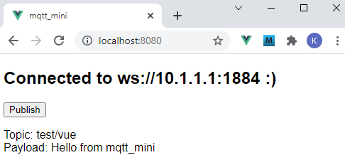

Letzte &Auml;nderung: 15.10.2021   
<table><tr><td></img></td><td>
<h1>Vue: Erste MQTT Anwendung (All-in-one)</h1>
<a href="../LIESMICH.md">==> Startseite</a> &nbsp; &nbsp; &nbsp; 
<a href="m4h505_Vue_Mqtt_mini_e.md">==> English version</a> &nbsp; &nbsp; &nbsp; 
</td></tr></table>
<a href="https://github.com/khartinger/mqtt4home/tree/main/source_Vue/vue05_ci_mqtt_mini">==> Code @ GitHub</a><hr>
  
## Ziel
* Erstellen einer einfachen MQTT-Anwendung, die auf Knopfdruck eine MQTT-Nachricht sendet und empfangene MQTT-Nachrichten anzeigt.   
* Die Anwendung soll sich beim Start automatisch mit einem Broker verbinden.   
   
_Bild 1: GUI der Anwendung "mqttMini.vue"_   
   
## Voraussetzungen
* Etwas Wissen &uuml;ber HTML, CSS und JavaScript bzw. TypeScript :)   
* Visual Studio Code ist f&uuml;r Vue-Anwendungen bereits vorbereitet, dh. es wurde bereits (mindestens) eine Vue-Anwendung in Visual Code erstellt.   
* Ein laufender Broker auf einem Server mit der IP 10.1.1.1   
## Erforderliche Hilfsmittel
* Hardware: PC oder Laptop mit Internetzugang, Browser
* Software: Visual Studio Code, node.js, npm

## Aufgabenstellung im Detail
Die MQTT-Anwendung `mqtt_mini` ...   
1. wird mit Visual Studio Code erstellt,   
2. hat alle GUI- und Steuerfunktionen in nur einer Datei mit dem Namen   
`/src/components/mqttMini.vue`   
3. verbindet sich beim App-Start &uuml;ber WebSocket mit dem MQTT-Broker 10.1.1.1 (1883 und 1884),   
4. abonniert beim App-Start alle Topics,   
5. zeigt eine empfangene Nachricht an (Topic und Payload) und    
6. sendet auf Knopfdruck die Nachricht `-t test/vue -m "Hello from mqtt_mini"`   

## Vorbereitung des Vue-Projektes in VSC   
1. Visual Studio Code (VSC) starten.   

2. VSC: Terminal-Fenster &ouml;ffnen: `Men&uuml; Terminal - New Terminal`   

3. VSC-Terminal: In den Ordner wechseln, unter dem das Vue-Projekt erzeugt werden soll: `cd /g/github/mqtt4home/source_Vue`   

4. VSC-Terminal: Vue.js Applikation erzeugen: `vue create mqtt_mini`  
   Mit Cursortasten, Leertaste und &lt;Enter&gt; Folgendes ausw&auml;hlen:   
   `> Manually select features`   
   &lt;enter&gt;   
   `(*) Choose Vue version`   
   `(*) Babel`   
   `(*) TypeScript`   
   `( ) Router`   
   `(*) Linter / Formatter`   
   &lt;enter&gt;   
   `> 3.x`   
   &lt;enter&gt;   
   _`? Use class-style component syntax?`_ &nbsp; __`No`__   
   &lt;enter&gt;   
   _`? Use Babel alongside TypeScript (required for modern mode, auto-detected polyfills, transpiling JSX)?`_ &nbsp; __`No`__   
   &lt;enter&gt;   
   _`? Pick a linter / formatter config: `_ &nbsp; __`ESLint + Standard config`__   
   &lt;enter&gt;   
   _`? Pick additional lint features: `_ &nbsp; __`Lint on save`__   
   &lt;enter&gt;   
   _`? Where do you prefer placing config for Babel, ESLint, etc.?`_ &nbsp; __`In dedicated config file`__   
   &lt;enter&gt;   
   _`? Save this as a preset for future projects? (y/N) `_ &nbsp; __`No`__   
   &lt;enter&gt;   

5. In den Projektordner wechseln: `VSC Men&uuml; Datei - Ordner &ouml;ffnen`
   `G:\github\mqtt4home\source_Vue\vue_mini` [Ordner ausw&auml;hlen]   

6. MQTT Bibliothek installieren:   
   Men&uuml; Terminal - New Terminal   
   `npm install mqtt --save`   

## Erstellen der Anwendung
* Die Datei `mqttMini.vue` anlegen:   
   Men&uuml; Anzeigen - Explorer. Mit der linken Maustaste auf `src` und danach mit der rechten Maustaste auf `components` klicken - "Neue Datei" w&auml;hlen und `mqttMini.vue` eingeben.   
* Quelltext eingeben:
```   
<!--mqttMini-->
<!-- ----[1] GUI of mqttMini ------------------------------- -->
<template>
<span v-if="!isConnected">
    <h2>NOT connected to {{ getWsbroker }}</h2>
  </span>
  <span v-else>
    <h2>Connected to {{ getWsbroker }} :)</h2>
    <button @click="publish()">Publish</button>
    <p>
      Topic: {{ getTopic }}<br>
      Payload: {{ getPayload }}
    </p>
</span>
</template>

<script lang="ts">
// ======[2] import some utilities==============================
import { defineComponent, reactive } from 'vue'
import mqtt from 'mqtt'

// ======[3] script part of component mqttMini==================
export default defineComponent({
  // ____[4] computed functions (values from mqttClientInstance)
  computed: {
    isConnected: function (): boolean {
      return mqttClientInstance.state.connected
    },
    getWsbroker: function (): string {
      return mqttClientInstance.state.wsbroker
    },
    getTopic: function (): string {
      return mqttClientInstance.state.topic
    },
    getPayload: function (): string {
      return mqttClientInstance.state.payload
    }
  },
  // ____[5] what should be done during the mounting..._________
  mounted: async function (): Promise<void> {
    this.connect()
  },
  // ____[6] functions of mqttMini______________________________
  methods: {
    connect: async function (): Promise<void> {
      if (!this.isConnected) {
        await mqttClientInstance.connect()
      }
    },
    publish: async function (): Promise<void> {
      try {
        await mqttClientInstance.publish('test/vue', 'Hello from mqtt_mini')
      } catch (e) {
        console.error('NO CONNECTION')
      }
    }
  }
})

// ======[7] Class MqttClient===================================
export class MqttClient {
  // ____[8] properties_________________________________________
  public client: mqtt.Client | null = null;
  public state = reactive({
    wsbroker: 'ws://10.1.1.1:1884',
    connected: false,
    topic: '-',
    payload: '-'
  });

  // ____[9] connect method_____________________________________
  public connect (): Promise<void> {
    return new Promise((resolve, reject) => {
      const client = mqtt.connect(this.state.wsbroker)
      this.client = client
      client.on('connect', () => {
        client.on('error', (err) => {
          console.error('MQTT Error', err)
        })
        client.on('connecting', () => {
          console.log('MQTT Connecting')
        })
        client.on('offline', (value: any) => {
          console.error('MQTT Offline', value)
        })
        client.on('disconnect', (value: any) => {
          this.state.connected = false
          console.log('MQTT Disconnect', value)
        })
        client.on('message', (topic: string, message: any) => {
          this.state.topic = topic
          this.state.payload = message.toString()
        })
        client.subscribe('#')
        this.state.connected = true
        resolve()
      })
      client.on('error', () => {
        reject(new Error('Error!'))
      })
    })
  }

  // ____[10] publish method____________________________________
  public publish (topic: string, message: string): Promise<void> {
    return new Promise((resolve, reject) => {
      if (!this.client) return reject(new Error('Not Connected'))
      this.client.publish(topic, message, (err) => {
        if (err) return reject(new Error('Could not publish topic'))
        resolve()
      })
    })
  }
}

// ======[11] Instance to work with the class MqttClient========
export const mqttClientInstance = new MqttClient()
</script>

<style>
</style>

```   
## Erkl&auml;rungen zum Quelltext `mqttMini.vue`
### [1] GUI von mqttMini
Die GUI besteht aus zwei Webseiten, je nachdem, ob eine Verbindung zum Broker (IP 10.1.1.1) hergestellt werden kann oder nicht.   
* Ohne Verbindung zum Broker wird lediglich der Text "NOT Connected to ws://10.1.1.1:1884" ausgegeben.   
* Mit Verbindung zum Broker wird der Text "Connected to ws://10.1.1.1:1884 :)", der Button [Publish] sowie Topic und Payload der letzten Nachricht ausgegeben (siehe Bild 1).   
Die Funktion `isConnected` gibt an, ob eine Verbindung besteht.   


### [2] Import
Hier werden vordefinierte vue-Funktionalit&auml;ten (defineComponent, reactive) oder andere Komponenten (mqtt) zum eigenen Projekt hinzugef&uuml;gt.   

### [3] Skript-Teil der Komponente mqttMini
Im Skript-Teil von `mqttMini` erfolgt die Verkn&uuml;pfung von MQTT-Funktionalit&auml;t und der GUI der App.   
### [4] computed
Die vier "computed"-Funktionen holen Werte aus dem MqttClient-Objekt und stellen sie der GUI zur Verf&uuml;gung:
* `isConnected: ` true = es besteht eine Verbindung zum Broker.   
* `getWsbroker: ` WebSocket-Adresse des Hosts, auf dem der Broker l&auml;uft (`ws://10.1.1.1:1884`).   
* `getTopic:    ` Topic der letzten empfangenen Nachricht.   
* `getPayload:  ` Payload der letzten empfangenen Nachricht.   

### [5] mouted
Beim Mounten (Starten) der App soll eine Verbindung zum Broker hergestellt werden.   

### [6] methods
* Die Methode `connect` ruft die connect-Methode des MqttClient-Objekts und wird beim Mounten aufgerufen.   
* Die Methode `publish` ver&ouml;ffentlicht die fix vorgegebene Nachricht, wenn in der GUI der Button [Publish] gedr&uuml;ckt wird.   

### [7] Die Klasse MqttClient
Die Klasse `MqttClient` fasst alle Dinge zusammen, die f&uuml;r die Verwendung von MQTT ben&ouml;tigt werden.   

### [8] Eigenschaften
`client` stellt das MQTT-Verbindungsobjekt dar und wird beim Verbinden mit dem Broker erzeugt.
Die weiteren Eigenschaften werden in eine "Gesamteigenschaft" `state` hineingepackt, die als "`reactive`" definiert wird. Dies ist sehr wichtig, da bei &Auml;nderung einer Variablen eines elementaren Typs die &Auml;nderung __*NICHT*__ an computed-Funktionen weitergegeben wird.   

### [9] connect
Die connect-Methode erzeugt durch das Verbinden mit dem Broker das `client`-Objekt, abonniert alle Nachrichten (`client.subscribe('#')`) und setzt bei Erfolg die Eigenschaft `this.state.connected` auf true.   

### [10] publish
Die publish-Methode pr&uuml;ft, ob eine Verbindung zum Broker besteht und ver&ouml;ffentlicht - bei Erfolg - die vorgegebene Nachricht.   

### [11] Erzeugen einer Instanz
Die Instanz `mqttClientInstance` dient zum Zugriff auf das Objekt der Klasse `MqttClient`, das mit `new` erzeugt wurde.   

## &Auml;nderungen an den von VSC erstellten Dateien
* Linter-Warnung "Unexpected any" bei "(value: any)" abstellen    
  In der Datei `.eslintrc.js` unter "`rules: {`" erg&auml;nzen:   
  ```   
  '@typescript-eslint/no-explicit-any': 'off',
  '@typescript-eslint/explicit-module-boundary-types': 'off'
  ```   

* Anzeige der GUI `mqttMini` erm&ouml;glichen:   
  In der Datei `App.vue` den Template-Abschnitt &auml;ndern auf   

  ```   
  <template>
    <mqttMini></mqttMini>
  </template>
  ```   

   bzw. den Script-Abschnitt &auml;ndern auf   

  ```   
  <script lang="ts">
  import { defineComponent } from 'vue'
  import mqttMini from './components/mqttMini.vue'

  export default defineComponent({
    name: 'App',
    components: {
      mqttMini
    }
  })
  </script>
  ```   

* Ausgabe linksb&uuml;ndig, mit schwarzer Schrift und ohne oberen Rand    
  In der Datei `App.vue` im Abschnitt "`#app {`" folgende Zeilen &auml;ndern:   
   ```   
  text-align: left;     /* center    */
  color: black;         /* #2c3e50;  */
  margin-top: 0px;      /* 60px;     */
   ```   

## Test der App
* Start des Servers   
   Eingabe im Terminal-Fenster (Men&uuml;: Terminal - New Terminal)   
   `npm run serve`   

* Anzeige der Anwendung im Brower durch Eingabe von   
   `http://localhost:8080`   

* Entfernen nicht mehr ben&ouml;tigter Komponenten   
  Folgende Dinge k&ouml;nnen aus dem Projekt gel&ouml;scht werden, da sie nicht mehr ben&ouml;tigt werden:   
  * Datei `HelloWorld.vue`   
  * Verzeichnis `assets` (mit dem Logo-Bild)   
