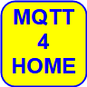

Last modified: 2021-10-15   
<table><tr><td></td><td>
<h1>Vue: First MQTT application (All-in-one)</h1>
<a href="../README.md">==> Home page</a> &nbsp; &nbsp; &nbsp; 
<a href="m4h505_Mqtt_mini.md">==> German version</a> &nbsp; &nbsp; &nbsp; 
</td></tr></table>
<a href="https://github.com/khartinger/mqtt4home/tree/main/source_Vue/vue05_mqtt_mini">==> Code @ GitHub</a><hr>

## Target
* Create a simple MQTT application that sends an MQTT message and displays received MQTT messages at the push of a button.   
* The application should automatically connect to a broker on startup.   
   
_Fig. 1: GUI of the application "mqttMini.vue"_   
   
## Requirements
* Some knowledge &uuml;ber HTML, CSS and JavaScript or TypeScript :)   
* Visual Studio Code is already prepared for Vue applications, i.e. (at least) one Vue application has already been created in Visual Code.   
* A running broker on a server with IP 10.1.1.1   
## Required tools
* Hardware: PC or laptop with internet access, browser.
* Software: Visual Studio Code, node.js, npm.

## Task in detail
The MQTT application 'mqtt_mini' ...   
1. is created with Visual Studio Code   
2. has all GUI and control functions in only one file named   
`/src/components/mqttMini.vue`   
3. connects to the MQTT broker 10.1.1.1 (1883 and 1884) via WebSocket at app startup,   
4. subscribes to all topics at app startup,   
5. displays a received message (topic and payload) and   
6. sends the message `-t test/vue -m "Hello from mqtt_mini"` at the push of a button.   

## Preparation of the Vue project in VSC   
1. start Visual Studio Code (VSC).   

2. VSC: Open terminal window: `Men&uuml; Terminal - New Terminal`   

3. VSC terminal: Change to the folder where the Vue project should be created: `cd /g/github/mqtt4home/source_Vue`   

4. VSC-Terminal: Create Vue.js application: `vue create mqtt_mini`  
   Use cursor keys, space bar and &lt;Enter&gt; to select the following:   
   `> Manually select features`   
   &lt;enter&gt;   
   `(*) Choose Vue version`   
   `(*) Babel`   
   `(*) TypeScript`   
   `( ) Router`   
   `(*) Linter / Formatter`   
   &lt;enter&gt;   
   `> 3.x`   
   &lt;enter&gt;   
   _`? Use class-style component syntax?`_ &nbsp; __`No`__   
   &lt;enter&gt;   
   _`? Use Babel alongside TypeScript (required for modern mode, auto-detected polyfills, transpiling JSX)?`_ &nbsp; __`No`__   
   &lt;enter&gt;   
   _`? Pick a linter / formatter config: `_ &nbsp; __`ESLint + Standard config`__   
   &lt;enter&gt;   
   _`? Pick additional lint features: `_ &nbsp; __`Lint on save`__   
   &lt;enter&gt;   
   _`? Where do you prefer placing config for Babel, ESLint, etc.?`_ &nbsp; __`In dedicated config file`__   
   &lt;enter&gt;   
   _`? Save this as a preset for future projects? (y/N) `_ &nbsp; __`No`__   
   &lt;enter&gt;   

5. change to the project folder: `VSC menu File - Open folder`
   `G:\github\mqtt4home\source_Vue\vue_mini` [select folder].   

6. install the MQTT library:   
   Men&uuml; Terminal - New Terminal   
   `npm install mqtt --save`   

## Create the application
* The following diagram gives an overview of the files involved:   
     
  _Fig. 2: &Overview of the involved files_   

  With the help of the diagram you can see some important connections:   
  * The user calls with the brower the file `index.html`, which displays the application   
  (via `App.vue` - `main.ts` - `index.html`).   
  * The `mqttMini.vue` element connects to the MQTT broker and also creates the browser display.   

* Create the file `mqttMini.vue`:   
   Men&uuml; Display - Explorer. Left click on `src` and then right click on `components` - select "New file" and enter `mqttMini.vue`   
* Enter source code:
```   
<!--mqttMini-->
<!-- ----[1] GUI of mqttMini ------------------------------- -->
<template>
<span v-if="!isConnected">
    <h2>NOT connected to {{ getWsbroker }}</h2>
  </span>
  <span v-else>
    <h2>Connected to {{ getWsbroker }} :)</h2>
    <button @click="publish()">Publish</button>
    <p>
      Topic: {{ getTopic }}<br>
      Payload: {{ getPayload }}
    </p>
</span>
</template>

<script lang="ts">
// ======[2] import some utilities==============================
import { defineComponent, reactive } from 'vue'
import mqtt from 'mqtt'

// ======[3] script part of component mqttMini==================
export default defineComponent({
  // ____[4] computed functions (values from mqttClientInstance)
  computed: {
    isConnected: function (): boolean {
      return mqttClientInstance.state.connected
    },
    getWsbroker: function (): string {
      return mqttClientInstance.state.wsbroker
    },
    getTopic: function (): string {
      return mqttClientInstance.state.topic
    },
    getPayload: function (): string {
      return mqttClientInstance.state.payload
    }
  },
  // ____[5] what should be done during the mounting..._________
  mounted: async function (): Promise<void> {
    this.connect()
  },
  // ____[6] functions of mqttMini______________________________
  methods: {
    connect: async function (): Promise<void> {
      if (!this.isConnected) {
        await mqttClientInstance.connect()
      }
    },
    publish: async function (): Promise<void> {
      try {
        await mqttClientInstance.publish('test/vue', 'Hello from mqtt_mini')
      } catch (e) {
        console.error('NO CONNECTION')
      }
    }
  }
})

// ======[7] Class MqttClient===================================
export class MqttClient {
  // ____[8] properties_________________________________________
  public client: mqtt.Client | null = null;
  public state = reactive({
    wsbroker: 'ws://10.1.1.1:1884',
    connected: false,
    topic: '-',
    payload: '-'
  });

  // ____[9] connect method_____________________________________
  public connect (): Promise<void> {
    return new Promise((resolve, reject) => {
      const client = mqtt.connect(this.state.wsbroker)
      this.client = client
      client.on('connect', () => {
        client.on('error', (err) => {
          console.error('MQTT Error', err)
        })
        client.on('connecting', () => {
          console.log('MQTT Connecting')
        })
        client.on('offline', (value: any) => {
          console.error('MQTT Offline', value)
        })
        client.on('disconnect', (value: any) => {
          this.state.connected = false
          console.log('MQTT Disconnect', value)
        })
        client.on('message', (topic: string, message: any) => {
          this.state.topic = topic
          this.state.payload = message.toString()
        })
        client.subscribe('#')
        this.state.connected = true
        resolve()
      })
      client.on('error', () => {
        reject(new Error('Error!'))
      })
    })
  }

  // ____[10] publish method____________________________________
  public publish (topic: string, message: string): Promise<void> {
    return new Promise((resolve, reject) => {
      if (!this.client) return reject(new Error('Not Connected'))
      this.client.publish(topic, message, (err) => {
        if (err) return reject(new Error('Could not publish topic'))
        resolve()
      })
    })
  }
}

// ======[11] Instance to work with the class MqttClient========
export const mqttClientInstance = new MqttClient()
</script>

<style>
</style>
```   

## Explanations to the source code `mqttMini.vue`
### [1] GUI of mqttMini
The GUI consists of two web pages, depending on whether a connection to the broker (IP 10.1.1.1) can be established or not.   
* Without connection to the broker only the text "NOT Connected to ws://10.1.1.1:1884" is displayed.   
* With connection to the broker the text "Connected to ws://10.1.1:1884 :)", the button [Publish] as well as topic and payload of the last message are output (see Figure 1).   
The function 'isConnected' indicates whether a connection exists.   


### [2] Import
Here predefined vue functionalities (defineComponent, reactive) or other components (mqtt) are added to the own project.   

### [3] Script part of the component mqttMini
In the script part of `mqttMini` the linking of MQTT functionality and the GUI of the app is done.   
### [4] computed
The four `computed` functions get values from the MqttClient object and make them available to the GUI:
* `isConnected: ` true = there is a connection to the broker.   
* `getWsbroker: ` WebSocket address of the host where the broker is running (`ws://10.1.1:1884`).   
* `getTopic: ` Topic of the last received message.   
* `getPayload:  ` Payload of the last received message.   

### [5] mouted
When mounting (starting) the app, a connection to the broker should be established.   

### [6] methods
* The `connect` method calls the connect method of the MqttClient object and is called when mounting.   
* The `publish` method publishes the fixed specified message when the [Publish] button is pressed in the GUI.   

### [7] The MqttClient class
The `MqttClient` class gathers all the things that are needed to use MQTT.   

### [8] Properties
`client` represents the MQTT connection object and is created when connecting to the broker.
The other properties are packed into an `overall` `state` property, which is defined as `reactive`. This is very important because when a variable of an elementary type is changed, the change is __*NOT*__ passed to computed functions.   

### [9] connect
The connect method creates the `client` object by connecting to the broker, subscribes to all messages (`client.subscribe('#')`) and sets the `this.state.connected` property to true on success.   

### [10] publish
The publish method checks if there is a connection to the broker and - if successful - publishes the given message.   

### [11] Create an instance
The `mqttClientInstance` instance is used to access the object of the `MqttClient` class created with `new`.   

## Changes to the files created by VSC
* Disable linter warning "Unexpected any" at "(value: any)".    
  In the file `.eslintrc.js` under "`rules: {`" add:   
  ```   
  '@typescript-eslint/no-explicit-any': 'off',
  '@typescript-eslint/explicit-module-boundary-types': 'off'
  ```   

* Enable display of the GUI `mqttMini`:   
  In the `App.vue` file, change the template section to   

  ```   
  <template>
    <mqttMini></mqttMini>
  </template>
  ```   

   and change the script section to   

  ```   
  <script lang="ts">
  import { defineComponent } from 'vue'
  import mqttMini from './components/mqttMini.vue'

  export default defineComponent({
    name: 'App',
    components: {
      mqttMini
    }
  })
  </script>
  ```   

* Output left-aligned, with black font and no top margin.    
  In the `App.vue` file, in the `#app {` section, change the following lines:   
   ```   
  text-align: left; /* center */
  color: black; /* #2c3e50; */
  margin-top: 0px; /* 60px; */
   ```   

## Test the app
* Start the server   
   Input in the terminal window (Men&uuml;: Terminal - New Terminal)   
   `npm run serve`   

* Display the application in the brower by entering   
   `http://localhost:8080`   

* Remove components that are no longer needed   
  The following items can be deleted from the project because they are no longer needed:   
  * File `HelloWorld.vue`   
  * directory `assets` (with the logo image)   
