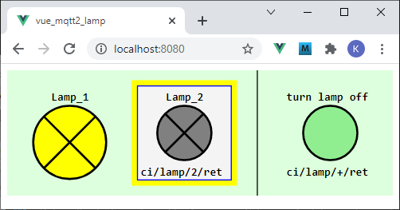
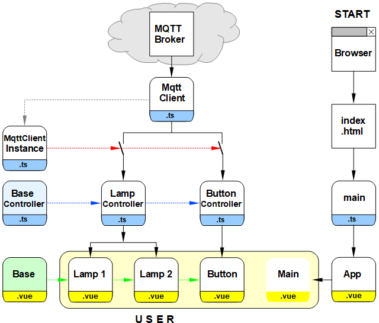

Last modified: 2021-11-05   
<table><tr><td></td><td>&nbsp;</td><td>
<h1>Vue: Switching lamps with MQTT</h1>
<a href="../readme.md">==> Home page</a> &nbsp; &nbsp; &nbsp; 
<a href="m4h506_Vue_Mqtt2_Lamp.md">==> German version</a> &nbsp; &nbsp; &nbsp; 
</td></tr></table><hr>

## Target
Create a Vue application that displays the state of two lamps and can be turned off using a button icon:   
   
_Fig. 1: Browser representation of the two lamps and the button_.   

The _Fig. 1_ shows some possibilities of the program:   
* The entire GUI is an svg graphic.
* Control or display symbols are square and of the same size.
* Symbols can be displayed with or without borders.
* Symbols can be displayed with or without text.
* A yellow light means the light is on, gray means off, and blue means the state is not known.
* By pressing the button on the right, both lamps are switched off.

## Components of the program
To make the program clear and easy to expand, it is composed of numerous individual parts.   
The following picture gives an overview of the involved files:
   
_Fig. 2: Files of the project MQTT lamps_   

### Meaning of the individual files   
The right branch with (browser -->) `index.html` --> `main.ts` --> `App.vue` is created automatically and has to be adjusted a bit.   
   * The file `main.ts` creates the app element which is displayed in `index.html`.   
   * `App.vue` represents `<CiMain>` and contains css elements that can be used throughout the project.   
---   
The left part of Fig. 2 represents the actual program:   
* The `MqttClient.ts` file contains the `MqttClient` class, which contains all the methods for communicating with the MQTT broker.   
* The file `MqttClientInstance.ts` creates the object `mqttClientInstance`, where every controller that wants to receive MQTT messages has to register.   
Symbolically, this is represented by the switches in _Fig. 2_: No registration means no sending of MQTT messages.   
* For each symbol type (here Lamp and Button) there is a separate controller derived from "`BaseController.ts`".   
* Each controller contains a list (more precisely "`Array`") of its symbols as well as the methods for receiving and sending MQTT messages (`onMessage` and `publishCi`).
* The graphical design of each symbol is done in a vue file that embeds the base vue `Base.vue` (`CiLamp.vue` and `CiButton.vue`).   
* All displayed symbol vues are positioned in `CiMain.vue`.   
* In `CiMain.vue` the connection to the broker is established with the help of the object `mqttClientInstance` (e.g. host 10.1.1.1, port 1884, subscribe-topics -t "#" (=all)).

[Link to project](https://github.com/khartinger/mqtt4home/tree/main/source_Vue/vue_mqtt2_lamp)   

## Required tools
* Hardware: PC or laptop with internet access, browser.
* Hardware: Raspberry Pi (or PC) running an MQTT broker (e.g. Mosquitto)
* Software: Visual Studio Code ("VSC"), which is already prepared for Vue applications.   
   (I.e. (at least) one Vue application has already been created in Visual Code).   
   incl. node.js, npm

## Preparation of the Vue project in VSC (short version)   
1. start Visual Studio Code (VSC).   
2. VSC: Open Terminal window: Menu Terminal - New Terminal.   
3. VSC terminal: Change to the folder under which the Vue project is to be created:   
   `cd /g/github/mqtt4home/source_Vue`   
4. VSC-Terminal: Create Vue.js application: `vue create vue_mqtt2_lamp`  
   Use cursor keys, space bar and &lt;Enter&gt; to select the following:   
   `> Manually select features` &nbsp; &lt;Enter&gt;   
   `(*) Choose Vue version`   
   `(*) Babel`   
   `(*) TypeScript`   
   `( ) Router`   
   `(*) Linter / Formatter`   
   &lt;Enter&gt;   
   _`> 3.x`_ &nbsp; &lt;Enter&gt;      
   _`? Use class-style component syntax?`_ &nbsp; __`N`__ &lt;Enter&gt;   
   _`? Use Babel alongside TypeScript (required for modern mode, auto-detected polyfills, transpiling JSX)?`_ &nbsp; __`N`__ &lt;Enter&gt;   
   _`? Use history mode for router? (Requires proper server setup for index fallback in production)`_ &nbsp; __`N`__ &lt;Enter&gt;   
   _`? Pick a linter / formatter config:`_ &nbsp; __`ESLint + Standard config`__ &lt;Enter&gt;   
   _`? Pick additional lint features: `_ &nbsp; __`Lint on save`__ &lt;Enter&gt;   
   _`? Where do you prefer placing config for Babel, ESLint, etc.?`_ &nbsp; __`In dedicated config file`__ &lt;Enter&gt;   
   _`? Save this as a preset for future projects? (y/N)`_ &nbsp; __`N`__ &lt;Enter&gt;   
5. switch to the project folder: _VSC Menu File - Open Folder_..
6. install MQTT library:   
   VSC: Open Terminal window: Menu Terminal - New Terminal.   
   `npm install mqtt --save`   

## 1. general adjustments in the project
1. the content of the automatically created file `main.ts` should be replaced by the following lines:   
```   
// ______main.ts________________________________________________
import { createApp, h } from 'vue'.
import App from './App.vue'

const app = createApp({
  render: () => h(App)
})

app.mount('#app')

```   

2. in the file `App.vue` the component `ciMain` is called and different styles are defined.   
The content for this file can be found at [https://github.com/khartinger/mqtt4home/blob/main/source_Vue/vue_mqtt2_lamp/src/App.vue](https://github.com/khartinger/mqtt4home/blob/main/source_Vue/vue_mqtt2_lamp/src/App.vue)   

3. creating the Vue config file   
   Menu 'Display - Explorer'. Move the mouse to the line `VUE_MQTT2_LAMP`, click the icon "+ New file" and enter `vue.config.js`   
   Contents of the file:   
   ```   
   module.exports = {
     lintOnSave: false,
     publicPath: './',
     configureWebpack: {
       devtool: 'source-map'
     }
   }

   ```   
4. addition in the file `.eslintrc.js`   
In the section `rules: {` insert:
```   
    '@typescript-eslint/no-explicit-any': 'off',
    '@typescript-eslint/explicit-module-boundary-types': 'off',
    '@typescript-eslint/no-multi-spaces': 'off',
```   

5. furthermore the automatically created files `components/HelloWord.vue` and `assets/logo.png` can be deleted.
## 2. add MQTT Client
The MQTT client is the same as in the example
"[Vue: sending and receiving MQTT messages](m4h505_Vue_Mqtt1.md)":   
1. create the directory `src/services`:   
   Menu Display - Explorer. Right click on `src` - select "New folder" and type `services`   
Create the `MqttClient.ts` file:   
   Menu Display - Explorer. Right click on `services` - select "New file" and enter `MqttClient.ts`   
   The content for this file can be found on [`https://github.com/khartinger/mqtt4home/blob/main/source_Vue/vue_pubsub2/src/services/MqttClient.ts`](https://github.com/khartinger/mqtt4home/blob/main/source_Vue/vue_pubsub2/src/services/MqttClient.ts).   
3. create the file `MqttClientInstance.ts`:   
   Menu View - Explorer. Right click on `services` - select "New file" and enter `MqttClientInstance.ts`   
   The content for this file can be found on [`https://github.com/khartinger/mqtt4home/blob/main/source_Vue/vue_pubsub2/src/services/MqttClientInstance.ts`](https://github.com/khartinger/mqtt4home/blob/main/source_Vue/vue_pubsub2/src/services/MqttClientInstance.ts).   

## 3. creating the base controller
* Create the directory `controller`:   
   Menu Display - Explorer. Right click on `src` - select "New folder" and type `controller`   
* Create the file `BaseController.ts`:   
   Menu `Display` - `Explorer`. Right click on `controller` - select "New file" and enter `BaseController.ts`   
   Contents of the file: see [https://github.com/khartinger/mqtt4home/blob/main/source_Vue/vue_mqtt2_lamp/src/controller/CiBaseController.ts](https://github.com/khartinger/mqtt4home/blob/main/source_Vue/vue_mqtt2_lamp/src/controller/CiBaseController.ts)

..ToDo..
