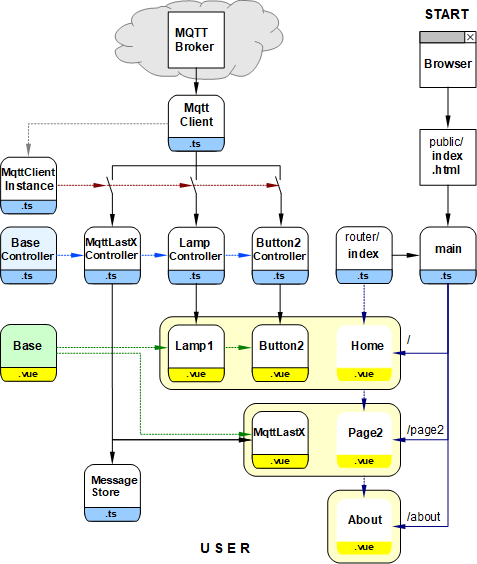

Letzte &Auml;nderung: 5.12.2021   
<table><tr><td></img></td><td>&nbsp;</td><td>
<h1>Erstellen eines Vue Projekts mit mehreren Web-Seiten</h1>
<a href="../liesmich.md">==> Startseite</a> &nbsp; &nbsp; &nbsp; 
<a href="m4h507_Vue_2webpages_e.md">==> English version</a> &nbsp; &nbsp; &nbsp; 
</td></tr></table><hr>
  
## Ziel
Dieses Vue-Projekt zeigt das Erstellen eines Web-Anwendung mit drei Seiten:   
1. Hauptseite ("Home")   
  Darstellung einer Lampe und eines Tasters, mit der die Lampe geschaltet werden kann.   
2. "History-Seite" ("Page2")   
  Darstellung der letzten fünf empfangenen MQTT-Befehle.   
3. About-Seite (About")   
  Info über die Applikation.   

   
_Bild 1: Hauptseite des Mehr-Webseiten-Projektes (Home)_   

   
_Bild 2: History-Seite (Page2)_   

   
_Bild 3: About-Seite (About)_   

## Erforderliche Hilfsmittel
* Hardware: PC oder Laptop mit Internetzugang, Browser
* Hardware: Raspberry Pi (oder PC), auf dem ein MQTT-Broker l&auml;uft (zB Mosquitto)
* Software: Visual Studio Code ("VSC"), das f&uuml;r Vue-Anwendungen bereits vorbereitet ist.   
   (Dh. es wurde bereits (mindestens) eine Vue-Anwendung in Visual Code erstellt.)   

Fertiges Projekt: [https://github.com/khartinger/mqtt4home/tree/main/source_Vue/vue_mqtt3_3webpages](https://github.com/khartinger/mqtt4home/tree/main/source_Vue/vue_mqtt3_3webpages)

# Erstellen des Projektes
## 1. Übersicht über die beteiligten Dateien
   
_Bild 4: Übersicht über die beteiligten Dateien_   

## 2. Vorbereitung des Vue-Projektes in VSC (Kurzfassung)   
1. Visual Studio Code (VSC) starten.   
2. VSC: Terminal-Fenster &ouml;ffnen: Men&uuml; Terminal - New Terminal.   
3. VSC-Terminal: In den Ordner wechseln, unter dem das Vue-Projekt erzeugt werden soll:   
   `cd /g/github/mqtt4home/source_Vue`   
4. VSC-Terminal: Vue.js Applikation erzeugen: `vue create vue_mqtt3_2webpages`  
   Mit Cursortasten, Leertaste und &lt;Enter&gt; Folgendes ausw&auml;hlen:   
   `> Manually select features` &nbsp; &lt;Enter&gt;   
   `(*) Choose Vue version`   
   `(*) Babel`   
   `(*) TypeScript`   
   `(*) Router`   
   `(*) Linter / Formatter`   
   &lt;Enter&gt;   
   _`> 3.x`_ &nbsp; &lt;Enter&gt;      
   _`? Use class-style component syntax?`_ &nbsp; __`N`__ &lt;Enter&gt;   
   _`? Use Babel alongside TypeScript (required for modern mode, auto-detected polyfills, transpiling JSX)?`_ &nbsp; __`N`__ &lt;Enter&gt;   
   _`? Use history mode for router? (Requires proper server setup for index fallback in production)`_ &nbsp; __`N`__ &lt;Enter&gt;   
   _`? Pick a linter / formatter config:`_ &nbsp; __`ESLint + Standard config`__ &lt;Enter&gt;   
   _`? Pick additional lint features: `_ &nbsp; __`Lint on save`__ &lt;Enter&gt;   
   _`? Where do you prefer placing config for Babel, ESLint, etc.?`_  &nbsp; __`In dedicated config file`__ &lt;Enter&gt;   
   _`? Save this as a preset for future projects? (y/N)`_ &nbsp; __`N`__ &lt;Enter&gt;   
5. In den Projektordner wechseln: _VSC Men&uuml; Datei - Ordner &ouml;ffnen_..
   `/github/mqtt4home/source_Vue/vue_mqtt3_2webpages` [Ordner auswählen]   
6. MQTT Bibliothek installieren:   
   VSC: Terminal-Fenster &ouml;ffnen: Men&uuml; Terminal - New Terminal.   
   `npm install mqtt --save`   
&nbsp;   
## 3. Anpassen der automatisch erstellten Dateien
1. Ergänzen der Vue-Konfiguration   
Erstellen der Datei `vue.config.js`: auf das Plus neben `VUE_MQTT3_2WEBPAGES` klicken, Namen eingeben.   
_Inhalt der Datei_:   
```   
module.exports = {
  lintOnSave: false,
  publicPath: './',
  configureWebpack: {
    devtool: 'source-map'
  }
}
```   

2. Linter-Warnung "Unexpected any" bei "(value: any)" abstellen    
  In der Datei `.eslintrc.js` unter "`rules: {`" erg&auml;nzen:   
  ```   
  '@typescript-eslint/no-explicit-any': 'off',
  '@typescript-eslint/explicit-module-boundary-types': 'off'
  ```   

3. Datei für die Seite `Page2` erstellen   
Mit der linken Maustaste auf `views/About.vou`klicken, Datei mit &lt;strg&gt; c und &lt;strg&gt; v kopieren und die Kopie auf `Page2.vue` umbenennen (zB mit dem Hilfsmenü mit der rechten Maustaste).   
In der Datei `Page2.vue` die Zeile `<h1>This is Page2</h1>` anpassen.   

4. Anpassen der "Routen" in der automatisch erstellten Datei `router/index.ts`:   
```   
// ___________router/index.ts___________________________________
import { createRouter, createWebHashHistory, RouteRecordRaw } from 'vue-router'
import Home from '../views/Home.vue'
import Page2 from '../views/Page2.vue'

const routes: Array<RouteRecordRaw> = [
  {
    path: '/',
    name: 'Home',
    component: Home,
    meta: {
      title: 'vue_mqtt3_2webpages-Home'
    }
  },
  {
    path: '/page2',
    name: 'Page2',
    component: Page2,
    meta: {
      title: 'vue_mqtt3_2webpages-Home'
    }
  },
  {
    path: '/about',
    name: 'About',
    // route level code-splitting
    // this generates a separate chunk (about.[hash].js) for this route
    // which is lazy-loaded when the route is visited.
    component: () => import(/* webpackChunkName: "about" */ '../views/About.vue'),
    meta: {
      title: 'vue_mqtt3_2webpages-About'
    }
  }
]

const router = createRouter({
  history: createWebHashHistory(),
  routes
})

router.beforeEach((to, from, next) => {
  document.title = <string> to.meta.title
  next()
})

export default router

```   

5. Datei `App.vue` anpassen   
   1. Die Zeile `<router-link to="/page2">Page2</router-link> |` ergänzen.   
   2. Die Styles mit Punkt ergänzen.   
_Inhalt der Datei_:   
```   
<!--App.vue-->
<template>
  <div id="nav">
    <router-link to="/">Home</router-link> |
    <router-link to="/page2">Page2</router-link> |
    <router-link to="/about">About</router-link>
  </div>
  <router-view/>
</template>

<style>
#app {
  font-family: Avenir, Helvetica, Arial, sans-serif;
  -webkit-font-smoothing: antialiased;
  -moz-osx-font-smoothing: grayscale;
  text-align: center;
  color: #2c3e50;
}

#nav {
  padding: 30px;
}

#nav a {
  font-weight: bold;
  color: #2c3e50;
}

#nav a.router-link-exact-active {
  color: #42b983;
}

  .ciFont1   { font: bold 11px monospace; fill: black; white-space: pre; }
  .cursor    { cursor: pointer; }
  .ciBackground {fill: #ddFFdd; }
  .ciOut     { fill: yellow; stroke: yellow; stroke-width: 1; }
  .ciInColor { fill: #F4F4F4; }
  .ciIn      { fill: #F4F4F4; stroke:blue; stroke-width: 1; }
  .ciLine    { stroke: blue; stroke-width: 1; }
  .ciRect    { fill: none; stroke: blue; stroke-width: 1; }
  .ciFillIt  { stroke: blue; stroke-width: 1; }
  .ciClick   { fill-opacity: 0.0; stroke-width: 1; }
  .ciBorder  { fill-opacity: 0.0; stroke: blue; stroke-width: 1; }
</style>
```   

6. Testen dieses Zwischenstandes   
Starten des Servers durch folgende Eingabe im Terminal:   
`npm run serve`   
Eingabe im Browser:   
`localhost:8080`   

7. Nicht benötigte Dateien und Verzeichnisse löschen   
  * Datei `components/HelloWorld.vue` löschen   
  * Verzeichnis `assets` löschen   

## 4. MQTT Client ergänzen
Verzeichnis src/services erstellen, Dateien MqttClient.ts und MqttClientInstance.ts ergänzen.   
Erklärungen siehe "Teil 1: Erstellung des MQTT Clients" in [m4h504_Vue_PubSub2.md](m4h504_Vue_PubSub2.md)

## 5. Home-Seite erstellen
Datei `views/Home.vue` anpassen:   


Controller, Comonents erstellen/kopieren

