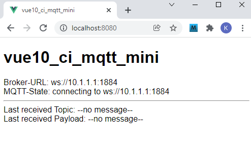
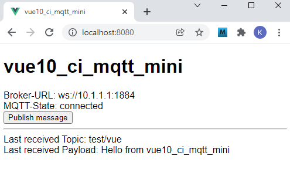
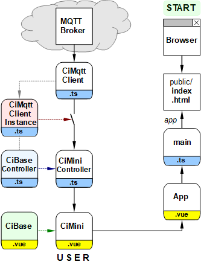

Letzte &Auml;nderung: 13.12.2021 <a name="up"></a>   
<table><tr><td></img></td><td>
<h1>Wie erstellt man einfach eine Vue-MQTT-App?</h1>
<a href="../LIESMICH.md">==> Startseite</a> &nbsp; &nbsp; &nbsp; 
<a href="m4h510_Vue_ci_mqtt_mini_e.md">==> English version</a> &nbsp; &nbsp; &nbsp; 
</td></tr></table>
<a href="https://github.com/khartinger/mqtt4home/tree/main/source_Vue/vue10_ci_mqtt_mini">==> Code @ GitHub</a><hr>

# Worum geht's?
Diese Vue-Anwendung "vue10_ci_mqtt_mini" beschreibt, wie man mit `CiMqttClient` eine einfache MQTT-Anwendung erstellt.   
Es werden zuerst die [erforderlichen Hilfsmittel](#erforderliche-hilfsmittel) und das [Auspobieren/Testen der App](#ausprobieren-der-app) beschreiben. Danach werden die Fragen [was CiMqttClient kann](#was-kann-cimqttclient), [wie man CiMqttClient verwendet](#wie-verwendet-man-cimqttclient), und [wie man dieses Projekt erstellt](#wie-erstellt-man-dieses-projekt), beantwortet. Den Abschluss bilden [Details zur Codierung von CiMqttClient](#details-zur-codierung-von-cimqttclient).

Die Anwendung verbindet sich nach dem Start automatisch mit einem Broker und zeigt empfangene MQTT-Nachrichten an. Dr&uuml;ckt man auf den Button "Publish message", wird eine MQTT-Nachricht gesendet.   

   
_Bild 1: Startansicht der Anwendung "vue10_ci_mqtt_mini"_   

   
_Bild 2: Ansicht nach dem Verbinden mit dem Broker und Dr&uuml;cken der Taste "Publish message"_   

# Erforderliche Hilfsmittel
* Hardware: PC oder Laptop mit Internetzugang, Browser
* Hardware: Raspberry Pi (oder PC), auf dem ein MQTT-Broker l&auml;uft (zB Mosquitto)
* Software: Visual Studio Code ("VSC"), das f&uuml;r Vue-Anwendungen bereits vorbereitet ist (Node.js, npm installiert).   

# Ausprobieren der App   
## Voraussetzungen   
1. Das Raspberry Pi (RasPi) wurde entsprechend der [Anleitung (Bereich "Zentrale")](../../LIESMICH.md) installiert, d.h. auf dem RasPi mit der IP `10.1.1.1` l&auml;uft das Broker-Programm (Mosquitto)   
2. Die Vue-Anwendung ist in Visual Studio Code (VSC) geladen und der interne Server l&auml;uft (Eingabe im Terminal: `npm run serve`).   
3. Es besteht eine Netzwerk-/WLAN-Verbindung zwischen dem Rechner, auf dem VSC l&auml;uft, und dem RasPi.   
4. Auf dem PC oder Raspberry Pi ist ein Command-/Terminal-Fenster ge&ouml;ffnet, das empfangene MQTT-Nachrichten anzeigt (Eingabe `mosquitto_sub -h 10.1.1.1 -t "#" -v`)   

## Test   
* Gibt man im Browser die Adresse `localhost:8080` ein, so erscheint (kurz) _Bild 1_ im Brower.   
* Besteht eine Verbindung zum Broker, erscheint nach kurzer Zeit die Anzeige "MQTT-State: connected".   
* Dr&uuml;ckt man den [Publish message]-Button, wird die Meldung im Browser und im Command-/Terminal-Fenster angezeigt.   

# Was kann CiMqttClient?
Der MQTT-Client `CiMqttClient` stellt die Verbindung zum MQTT-Broker dar. Er enth&auml;lt sowohl Werte als auch Methoden f&uuml;r die MQTT-Kommunikation.   

## Einige Vorgabewerte   
Diese Werte werden beim automatischen Verbinden verwendet.   

| Eigenschaft        | Wert                 | Interface.Eigenschaft  |   
| ------------------ | -------------------- | ---------------------- |   
| Host-IP            | 10.1.1.1             | MqttConnection.host    |   
| WebSocket Port     | 1884                 | MqttConnection.port    |   
| Subscribe-Topic    | # (alles)            | MqttSubscription.topic |   
| Quality of Service | 0 (h&ouml;chstens einmal) | MqttSubscription.qos   |   

F&uuml;r die Interfaces (`mqttState`, `mqttConnection`, `mqttSubscription`) und ihre Eigenschaften siehe [Codierung der Datei `CiMqttClient.ts`](./src/services/CiMqttClient.ts)   

## Methoden   
Der MQTT-Client `CiMqttClient` kann folgendes:   
* __Automatisches Verbinden mit dem Broker beim App-Start.__   
  Dazu ist in der Datei `ciMqttClientInstance` folgendes einzutragen:   
  `export const ciMqttClientInstance = new CiMqttClient(true)`   
  F&uuml;r die Verbindung incl. Abonnieren des Subscribe-Topics werden die oben stehenden Vorgabewerte verwendet.   
  Soll kein automatisches Verbinden erfolgen, muss `true` durch `false` ersetzt werden.   

* __Manuelles Verbinden mit dem Broker.__   
    1. In der Datei `ciMqttClientInstance` muss folgende Zeile stehen:   
    `export const ciMqttClientInstance = new CiMqttClient(false)`   
    2. Das Verbinden erfolgt mit der Methode `hostSubscribe(host, topicSubscribe)`, wobei die Host-IP und das zu abonnierende Topic angegeben werden.   

* __Automatisches Wiederverbinden,__   
  falls die Verbindung zum Broker verloren gegangen ist.   

* __Registrieren von CiXxxControllern.__   
  Alle Controller `CiXxxController` m&uuml;ssen vom Basiscontroller `CiBaseController.ts` abgeleitet und in der Datei `src/services/CiMqttClientInstance.ts` registriert werden:   
  `registerController (controller: CiBaseController)`   
  Vergisst man auf das Registrieren eines Controllers, so erh&auml;lt man keine Nachrichten ;)   

* __Abonnieren von Nachrichten.__   
  Das Abonnieren erfolgt automatisch beim Verbinden mit dem Broker. Eine &auml;nderung des Subscribe-Topics kann durch die Methode   
  `subscribe (topic, qos)`   
  erfolgen.   
  Werte f&uuml;r `qos`: Nachricht h&ouml;chstens einmal (0), mindestens einmal (1) oder genau einmal (2) senden.   
  Zum Bearbeiten der Nachricht muss im Controller eine Methode   
  `public onMessage (message: Message): void { ... }`   
  definiert werden (Empfangenes Topic = `message.topic`, empfangene Payload = `message.payload`)   

* __Senden von Nachrichten.__   
  Das Senden von Nachrichten kann durch die Methode   
  `publish (topic, payload, retain, qos)`   
  erfolgen oder durch eigene Methoden, die zB im CiXxxController definiert werden. (Beispiel siehe [CiMini.vue](./src/controller/CiMiniController.ts))   

* __Bereitstellen des Verbindungszustandes als Text.__   
  Diesen Text erh&auml;lt man durch Aufruf der Methode `sConnMqttState()`.   

* __Bereitstellen der Verbindungs-URL.__   
  Diese erh&auml;lt man durch Aufruf der Methode `connectUrl()`.   

* __Bereitstellen weiterer Methoden.__   
  Diese sind unter anderem `connect(host, port, endpoint)`, `disconnect()` und `unsubscribe ()`.

## Besonderheiten
* Standardm&auml;&szlig;ig werden alle Topics abonniert und jede Ci-Komponente pr&uuml;ft selbst, ob die empfangene Nachricht an sie gerichtet ist.   
* Soll nur eine Gruppe von Nachrichten abonniert werden (zB alle, die mit `ci/` beginnen), sollte dies gleich in der Datei `CiMqttClient.ts` als Vorgabe eingetragen werden, zB `subTopic = 'ci/#';`   
* Es sollte immer nur ein Topic abonniert werden, da `unsubscribe ()` lediglich das zuletzt abonnierte Topic l&ouml;scht.   

# Wie verwendet man CiMqttClient?

## 1. Einbinden der erforderlichen Dateien
* Erstellen des Verzeichnisses "controller"   
  Mit der rechten Maustaste auf das Verzeichnis `src` klicken, "Neuer Ordner" w&auml;hlen und den Namen `controller` eingeben.   

* Erstellen des Verzeichnisses "services"   
  Mit der rechten Maustaste auf das Verzeichnis `src` klicken, "Neuer Ordner" w&auml;hlen und den Namen `services` eingeben.   

* Kopieren der Dateien `CiMqttClient.ts` und `CiMqttClientInstance.ts` in das Verzeichnis `src/services`.   

* Kopieren der Datei `CiBaseController.ts` in das Verzeichnis `src/controller`.   

* Kopieren der Datei `CiBase.vue` in das Verzeichnis `src/components`.   

## 2. Anpassen der Datei CiMqttClientInstance
* Festlegen, ob beim Start der App mit den Vorgabewerten die Verbindung zum Broker hergestellt und das Topic abonniert werden soll (Konstruktor-Wert `true`).   

* Eintragen aller Controller, die Mqtt-Nachrichten senden oder empfangen sollen.   
  Folgende zwei Zeilen werden jeweils ben&ouml;tigt (Beispiel: "ciMiniController"):   
  `import { ciMiniController } from '@/controller/CiMiniController'`   
  `ciMqttClientInstance.registerController(ciMiniController)`   

## 3. Einbinden des CiMqttClients in einen CiXxxController
* Importieren der Komponenten in den Controller.   
  Eingabe in der Datei `CiXxxController.ts`:   
  `import { reactive } from 'vue'`   
  `import { Message } from '@/services/CiMqttClient'`   
  `import { CiBaseController, IBase } from './CiBaseController'`   

* Ableiten des CiXxxControllers von `CiBaseController`:   
  `export class CiXxxController extends CiBaseController {`   

* Implementierung der abstrakten Methode onMessage:   
  `public onMessage (message: Message): void {`   
  `  // ..ToDo..`   
  `}`   

## 4. Einbinden des CiMqttClients in eine CiXxx-Komponente
* Importieren des ciMqttClientInstance-Objekts:   
  `import { ciMqttClientInstance } from '@/services/CiMqttClientInstance'`   

* Im `computed`-Bereich der CiXxx-Komponente kann &uuml;ber das `ciMqttClientInstance`-Objekt auf die Methoden von `CiMqttClient` zugegriffen werden.   
  Beispiele:   
  * Abfrage der Broker-IP und des Ports:   
    `brokerurl: function (): string { return ciMqttClientInstance.connectUrl() },`   
  * Abfrage nur der Broker-IP:   
    `brokerip: function (): string { return ciMqttClientInstance.mqttConnection.host },`   
  * Abfrage, ob die Verbindung zum Broker besteht   
    `isConnected: function (): boolean { return ciMqttClientInstance.mqttState.connected },`   

&nbsp;   

---   
# Wie erstellt man dieses Projekt?
## 1. Allgemeines
Das folgende Diagramm gibt einen &Uuml;berblick &uuml;ber die beteiligten Dateien:   

   
_Bild 3: &Uuml;bersicht &uuml;ber die beteiligten Dateien_   

Mit Hilfe des Diagrammes erkennt man einige wichtige Zusammenh&auml;nge:   
* Der User ruft mit dem Brower die Datei `index.html` auf, die die Applikation anzeigt   
  (&uuml;ber `App.vue` - `main.ts` - `index.html`).   
* Das Grafik-Element `CiMini` besteht aus einem "Controller"- und "Grafik"-Teil (Erweiterung `.ts` bzw. `.vue`). Diese sind von Basis-Komponenten abgeleitet.   
* Die Verbindung zum MQTT-Broker wird &uuml;ber die Dateien `MqttClient.ts` und `MqttClientInstance.ts` hergestellt, wobei alle Controller in der Datei `MqttClientInstance.ts` registriert werden m&uuml;ssen. Vergisst man dies, erh&auml;lt der Controller keine MQTT-Nachrichten ("Schalter offen").   


## 2. Anlegen des Vue-Projektes in VSC
1. Visual Studio Code (VSC) starten.   
2. VSC: Terminal-Fenster &ouml;ffnen: Men&uuml; Terminal - New Terminal.   
3. VSC-Terminal: In den Ordner wechseln, unter dem das Vue-Projekt erzeugt werden soll:   
   `cd /g/github/mqtt4home/source_Vue`   
4. VSC-Terminal: Vue.js Applikation erzeugen:   
  `vue create vue10_ci_mqtt_mini`  
  Mit Cursortasten, Leertaste und &lt;Enter&gt; Folgendes ausw&auml;hlen:   
   `> Manually select features` &nbsp; &lt;Enter&gt;   
   `(*) Choose Vue version`   
   `(*) Babel`   
   `(*) TypeScript`   
   `( ) Router`   
   `(*) Linter / Formatter`   
   &lt;Enter&gt;   
   _`> 3.x`_ &nbsp; &lt;Enter&gt;      
   _`? Use class-style component syntax?`_ &nbsp; __`N`__ &lt;Enter&gt;   
   _`? Use Babel alongside TypeScript (required for modern mode, auto-detected polyfills, transpiling JSX)?`_ &nbsp; __`N`__ &lt;Enter&gt;   
   _`? Use history mode for router? (Requires proper server setup for index fallback in production)`_ &nbsp; __`N`__ &lt;Enter&gt;   
   _`? Pick a linter / formatter config:`_ &nbsp; __`ESLint + Standard config`__ &lt;Enter&gt;   
   _`? Pick additional lint features: `_ &nbsp; __`Lint on save`__ &lt;Enter&gt;   
   _`? Where do you prefer placing config for Babel, ESLint, etc.?`_  &nbsp; __`In dedicated config file`__ &lt;Enter&gt;   
   _`? Save this as a preset for future projects? (y/N)`_ &nbsp; __`N`__ &lt;Enter&gt;   
5. In den Projektordner wechseln: _VSC Men&uuml; Datei - Ordner &ouml;ffnen_..
   `/github/mqtt4home/source_Vue/vue10_ci_mqtt_mini` [Ordner ausw&auml;hlen]   
6. MQTT Bibliothek installieren:   
   VSC: Terminal-Fenster &ouml;ffnen: Men&uuml; Terminal - New Terminal.   
   `npm install mqtt --save`   
&nbsp;   

## 3. Erg&auml;nzen der Vue-Konfiguration   
Erstellen der Datei `vue.config.js`: auf das Plus rechts neben `VUE10_CI_MQTT_MINI` klicken (Neue Datei), Namen eingeben.   
_Inhalt der Datei_:   
```   
// ______vue.config.js__________________________________________
module.exports = {
  lintOnSave: false,
  publicPath: './',
  // publicPath: process.env.NODE_ENV === 'production' ? './vue_pubsub2/' : './',
  configureWebpack: {
    devtool: 'source-map'
  },
  chainWebpack: config => {
    config.performance
      .maxEntrypointSize(400000)
      .maxAssetSize(400000)
  }
}

```   
Mit `publicPath: './',` wird die relative Pfadangabe eingestellt und durch den `chainWebpack`-Eintrag werden Warnhinweise bez&uuml;glich der Dateigr&ouml;&szlig;e vermieden (indem man die maximale Dateigr&ouml;&szlig;en h&ouml;her setzt ;) )

## 4. Linter-Warnung "Unexpected any" bei "(value: any)" abstellen    
  In der Datei `.eslintrc.js` unter "`rules: {`" erg&auml;nzen:   
  ```   
  '@typescript-eslint/no-explicit-any': 'off',
  '@typescript-eslint/explicit-module-boundary-types': 'off',
  ```   

## 5. Datei "App.vue" anpassen   
Die Datei `App.vue` ist f&uuml;r folgende Punkte zust&auml;ndig:   
  * Anzeige der Komponente `CiMini`.
  * Definition von einheitlichen Styles f&uuml;r alle Seiten.   
    Daher: Alle Styles erg&auml;nzen, die mit einem Punkt beginnen.   

_&auml;ndern des Inhalts der Datei auf_:   
```   
<!-- App.vue -->
<template>
  <CiMini></CiMini>
</template>

<script lang="ts">
import { defineComponent } from 'vue'
import CiMini from '@/components/CiMini.vue'

export default defineComponent({
  name: 'App',
  components: {
    CiMini
  }
})
</script>

<style>
#app {
  font-family: Avenir, Helvetica, Arial, sans-serif;
  text-align: left;
  color: black;
  margin-top: 0px;
}

  .ciFont1  { font: bold 11px monospace; fill: black; white-space: pre; }
  .cursor    { cursor: pointer; }
  .ciBackground {fill: #ddFFdd; }
  .ciOut     { fill: yellow; stroke: yellow; stroke-width: 1; }
  .ciInColor { fill: #F4F4F4; }
  .ciIn      { fill: #F4F4F4; stroke:blue; stroke-width: 1; }
  .ciLine    { stroke: blue; stroke-width: 1; }
  .ciRect    { fill: none; stroke: blue; stroke-width: 1; }
  .ciFillIt  { stroke: blue; stroke-width: 1; }
  .ciClick   { fill-opacity: 0.0; stroke-width: 1; }
  .ciBorder  { fill-opacity: 0.0; stroke: blue; stroke-width: 1; }
</style>

```   

## 6. Nicht ben&ouml;tigte Dateien und Verzeichnisse l&ouml;schen   
  * Datei `components/HelloWorld.vue` l&ouml;schen   
  * Verzeichnis `assets` l&ouml;schen   


## 7. MQTT-Funktionalit&auml;t einbauen
Dies wird bereits weiter oben im Kapitel "[Wie verwendet man ciMqttClient?]((#wie-verwendet-man-cimqttclient)" beschrieben.   

## 8. Controller "CiMiniController.ts" erstellen

_Codierung_:   
```   
// ______CiMiniController.ts____________________________________
// ===========[1] import required components====================
import { reactive } from 'vue'
import { Message } from '@/services/CiMqttClient'
import { CiBaseController, IBase } from './CiBaseController'

// ===========[2] interface for properties of the Controller====
export interface Mini extends IBase {
  topicIn: string;
  payloadIn: string;
}

// ===========[3] define the controller class===================
export class CiMiniController extends CiBaseController {
  // ---------[4] public properties of CiMiniController---------
  public mini: Mini = reactive(
    {
      id: 'mini1',
      topicIn: '--no message--',
      payloadIn: '--no message--'
    }
  )

  // ---------[5] public methods of CiMiniController------------
  // _________[6] receive a message_____________________________
  public onMessage (message: Message): void {
    this.mini.topicIn = message.topic
    this.mini.payloadIn = message.payload
  }

  // _________[7] publish a message_____________________________
  public publishCi (topic: string, payload: string): void {
    // console.log('CiMiniController:publishCi:', '-t ' + topic + ' -m ' + payload)
    this.publish(topic, payload, false, 0)
  }
}

// ===========[8] Provide an object of the controller class=====
export const ciMiniController = new CiMiniController()

```   

## 9. Webpage "CiMini.vue" erstellen
Die Webpage `CiMini.vue` besteht wie alle Komponenten aus den drei Teilen &lt;template&gt;, &lt;script lang="ts"&gt; und &lt;style scoped&gt;.   

_Codierung_:   
```   
<!--CiMini.vue-->
<!-- =========[1] GUI of vue10_ci_mqtt_mini=================== -->
<template>
  <h1>vue10_ci_mqtt_mini</h1>
  <!-- -------[2] show connection info---------------------- -->
  Broker-URL: {{ brokerurl }} <br>
  MQTT-State: {{ mqttstate }} <br>
  <!-- -------[3] show button only if connected to broker--- -->
  <button v-if="mqttstate==='connected'" @click="clkPublish()">Publish message</button>
  <hr>
  <!-- -------[4] show last received message---------------- -->
  Last received Topic: {{ mini.topicIn }} <br>
  Last received Payload: {{ mini.payloadIn }}
</template>

<!-- =========[5] script part of vue10_ci_mqtt_mini=========== -->
<script lang="ts">
// -----------[6] import required components--------------------
import { defineComponent } from '@vue/runtime-core'
import { ciMqttClientInstance } from '@/services/CiMqttClientInstance'
import { Mini, ciMiniController } from '@/controller/CiMiniController'

// -----------[7] define a new (typescript) file component------
export default defineComponent({
  name: 'CiMini',
  computed: {
    // _______[8] get public properties of CiMiniController_____
    mini: function (): Mini { return ciMiniController.mini },
    // -------[9] get mqtt connection infos---------------------
    // _______[10] ip and port of broker________________________
    brokerurl: function (): string { return ciMqttClientInstance.connectUrl() },
    // _______[11] connection state as string___________________
    mqttstate: function (): string { return ciMqttClientInstance.sConnMqttState() }
  },
  methods: {
    // -------[12] functions of CiMini--------------------------
    // _______[13] Publish the default message__________________
    clkPublish: async function (): Promise<void> {
      try {
        // await ciMqttClientInstance.publish('test/vue', 'Hello from vue10_ci_mqtt_mini', false, 0)
        ciMiniController.publishCi('test/vue', 'Hello from vue10_ci_mqtt_mini')
      } catch (e) { console.error('NOT PUBLISHED: ', e) }
    }
  }
})
</script>

<!-- =========[14] styles of vue10_ci_mqtt_mini=============== -->
<style scoped>
</style>

```   

&nbsp;
---   

# Details zur Codierung von CiMqttClient   

## CiBaseController.ts
Die Datei `CiBaseController.ts` muss im Normalfall nicht ver&auml;ndert werden. Sie definiert im Interface `IBase` einige Eigenschaften, die alle (abgeleiteten) `CiXxxController` haben sollten. Die wichtigste Eigenschaft ist dabei die `id`, die die Verbindung zwischen einer Darstellung und den Daten im Controller darstellt.   

In der (abstrakten) Klasse `CiBaseController` werden dann die Methoden `registerClient`, `publish` und `onMessage(message: Message)` definiert.   

_Codierung_:   
```   
// ______CiBaseController.ts____________________________________
import { Message, CiMqttClient } from '@/services/CiMqttClient'
import type { QoS } from 'mqtt'

export interface IBase {
  id: string;
  name?: string;
  border?: number
  subTopic?: string;
  pubTopic?: string;
  pubPayload?: string;
}

export abstract class CiBaseController {
  protected client: CiMqttClient | null = null;

  public registerClient (mqttClient: CiMqttClient): void {
    this.client = mqttClient
  }

  protected async publish (topic: string, payload: string, retain: boolean, qos: QoS): Promise<void> {
    return this.client?.publish(topic, payload, retain, qos)
  }

  public abstract onMessage(message: Message): void;
}

```   

## CiMqttClient.ts
Die Datei `CiMqttClient.ts` muss im Normalfall nicht ver&auml;ndert werden, au&szlig;er man m&ouml;chte zB die Vorgabe-Host-IP &auml;ndern (zB auf 192.168.0.123).   

Damit Eigenschaften nicht unabsichtlich ver&auml;ndert werden, gibt es jeweils eine private und eine schreibgesch&uuml;tzte &ouml;ffentliche Variante.   

_Codierung_:   
```   
// ______CiMqttClient.ts________________________________________
import { CiBaseController } from '@/controller/CiBaseController'
import mqtt, { QoS } from 'mqtt'
import { reactive, readonly } from 'vue'

// *************************************************************
// interfaces
// *************************************************************

// -----------message properties--------------------------------
export interface Message {
  topic: string,
  payload: string,
  retain: boolean,
  qos: QoS
}

// -----------state of the MQTT connection----------------------
export interface MqttState {
  connectOnStart: boolean;
  connected: boolean;
  iConnMqttState: number;
  message: Message;
}

// -----------properties for the MQTT connection----------------
export interface MqttConnection {
  host: string;
  port: number;
  endpoint: string;
  clean: boolean;
  connectTimeout: number;
  reconnectPeriod: number;
  clientId: string;
  username: string;
  password: string;
}

// -----------info about the subscribed messages----------------
export interface MqttSubscription {
  topic: string;
  qos: QoS;
  subscribed: boolean;
}

// *************************************************************
// class CiMqttClient
// *************************************************************

export class CiMqttClient {
  // ---------basic properties----------------------------------
  public client: mqtt.Client | null = null;
  public controller: Array<CiBaseController> = [];

  private subTopic = '#';
  private subQos: QoS = 0;

  // ---------some more properties (interfaces)-----------------
  // To prevent values from being changed by mistake,
  // there is always a private and a public variant.
  private privateMqttState: MqttState = reactive<MqttState>({
    connectOnStart: false,
    connected: false,
    iConnMqttState: -1,
    message: { topic: '', payload: '', retain: false, qos: 0 }
  })

  public mqttState = readonly(this.privateMqttState)

  private privateMqttConnection: MqttConnection = reactive<MqttConnection>({
    host: '10.1.1.1',
    port: 1884,
    endpoint: '',
    clean: true,
    connectTimeout: 4000,
    reconnectPeriod: 4000,
    clientId: '',
    username: '',
    password: ''
  })

  public mqttConnection = readonly(this.privateMqttConnection)

  private privateMqttSubscription: MqttSubscription = reactive<MqttSubscription>({
    topic: '#',
    qos: 0,
    subscribed: false
  })

  public mqttSubscription = readonly(this.privateMqttSubscription)

  // =========methods===========================================
  // _________constructor_______________________________________
  constructor (connectOnStart: boolean) {
    this.privateMqttState.connectOnStart = connectOnStart
    if (this.privateMqttState.connectOnStart) {
      console.log('MqttClient-Constructor: connecting to ' + this.connectUrl())
      this.connect_()
      this.subTopic = this.privateMqttSubscription.topic
      this.subQos = this.privateMqttSubscription.qos
      console.log('MqttClient-Constructor: subscribe ' + this.privateMqttSubscription.topic)
      this.subscribe_()
      console.log('MqttClient-Constructor: finished')
    }
  }

  // _________connect url like 10.1.1.1:1884____________________
  public connectUrl (): string {
    return `ws://${this.mqttConnection.host}:${this.mqttConnection.port}${this.mqttConnection.endpoint}`
  }

  // _________public variant: connect to server (broker)________
  public connect (host: string, port: number, endpoint: string): Promise<void> {
    this.privateMqttConnection.host = host
    this.privateMqttConnection.port = port
    this.privateMqttConnection.endpoint = endpoint
    return this.connect_()
  }

  // _________private variant: connect to server (broker)_______
  private connect_ (): Promise<void> {
    return new Promise((resolve, reject) => {
      if (this.client) this.disconnect()
      this.privateMqttState.iConnMqttState = 2
      const options_ = {
        clean: this.mqttConnection.clean,
        connectTimeout: this.mqttConnection.connectTimeout,
        reconnectPeriod: this.mqttConnection.reconnectPeriod,
        clientId: this.mqttConnection.clientId,
        username: this.mqttConnection.username,
        password: this.mqttConnection.password
      }
      console.log('MqttCient.ts-connect: url=' + this.connectUrl())
      const client = mqtt.connect(this.connectUrl(), options_)
      this.client = client
      this.client.on('connect', () => {
        this.privateMqttState.connected = true
        this.privateMqttState.iConnMqttState = 1
        client.on('error', (err) => {
          console.error('MQTT Error', err)
          this.privateMqttState.iConnMqttState = 7
        })
        client.on('connecting', () => {
          console.error('MQTT Connecting')
          this.privateMqttState.iConnMqttState = 2
        })
        client.on('offline', (value: any) => {
          this.privateMqttState.connected = false
          this.privateMqttSubscription.subscribed = false
          console.error('MQTT Offline', value)
          this.privateMqttState.iConnMqttState = 3
        })
        client.on('disconnect', (value: any) => {
          console.error('MQTT Disconnect', value)
          this.privateMqttState.iConnMqttState = 0
        })
        client.on('end', (value: any) => {
          this.privateMqttState.connected = false
          this.privateMqttSubscription.subscribed = false
          console.error('MqttClient.ts-end: value=', value)
          this.privateMqttState.iConnMqttState = 9
        })
        client.on('message', (topic: string, payload: any, props1: any) => {
          let retain1 = false
          try {
            retain1 = props1.retain
          } catch (error) { console.error(error) }
          let qos1 = 0 as QoS
          try {
            qos1 = props1.qos
          } catch (error) { console.error(error) }
          this.controller.forEach(controller => controller.onMessage({
            topic: topic,
            payload: payload.toString(),
            retain: retain1,
            qos: qos1
          }))
        })
        resolve()
      })
      client.on('error', () => {
        console.error('Error on connecting...')
        this.privateMqttState.iConnMqttState = 8
        reject(Error('Error'))
      })
    })
  }

  // _________disconnect from broker____________________________
  public disconnect (): Promise<void> {
    return new Promise((resolve, reject) => {
      if (!this.client) return reject(new Error('Not Connected'))
      this.privateMqttState.iConnMqttState = 9
      this.client.end(true, {}, (err) => {
        if (err) {
          // console.log('CiMqttClient:disconnect: ', 'failed!')
          return reject(new Error('Could not disconnect'))
        }
        // console.log('CiMqttClient:disconnect: ', 'success!')
        resolve()
      })
    })
  }

  // _________public variant: subscribe topic___________________
  public subscribe (topic: string, qos: QoS): Promise<void> {
    this.subTopic = topic
    this.subQos = qos
    return this.subscribe_()
  }

  // _________private variant: subscribe topic__________________
  private subscribe_ (): Promise<void> {
    return new Promise((resolve, reject) => {
      if (!this.client) {
        // console.log('CiMqttClient:subscribe: failed - not connected! ' + this.privateMqttSubscription.topic)
        return reject(new Error('subscribe: Not Connected'))
      }
      this.unsubscribe()
      this.client.subscribe(this.subTopic, { qos: this.subQos }, (err) => {
        if (err) {
          // console.log('CiMqttClient:subscribe: failed! ' + this.subTopic)
          return reject(new Error('Could not subscribe topic ' + this.subTopic))
        }
        this.privateMqttSubscription.subscribed = true
        this.privateMqttSubscription.topic = this.subTopic
        this.privateMqttSubscription.qos = this.subQos
        // console.log('CiMqttClient:subscribe: success! ' + this.privateMqttSubscription.topic)
        resolve()
      })
    })
  }

  // _________unsubscribe topic_________________________________
  public unsubscribe (): Promise<void> {
    return new Promise((resolve, reject) => {
      const subscribedOld = this.privateMqttSubscription.subscribed
      this.privateMqttSubscription.subscribed = false
      if (!this.client) {
        // console.log('CiMqttClient:unsubscribe: failed - not connected! ', this.privateMqttSubscription.topic)
        return reject(new Error('Not Connected'))
      }
      if (subscribedOld) {
        this.client.unsubscribe(this.privateMqttSubscription.topic, {}, (err) => {
          if (err) {
            // console.log('CiMqttClient:unsubscribe: failed! ', this.privateMqttSubscription.topic)
            return reject(new Error('Could not unsubscribe topic ' + this.privateMqttSubscription.topic))
          }
          // console.log('CiMqttClient:unsubscribe: success! ', this.privateMqttSubscription.topic)
          resolve()
        })
      }
    })
  }

  // _________publish a message_________________________________
  public publish (topic: string, payload: string, retain: boolean, qos: QoS): Promise<void> {
    return new Promise((resolve, reject) => {
      if (!this.client) return reject(new Error('Not Connected'))
      this.client.publish(topic, payload, { qos: qos, retain: retain }, (err) => {
        if (err) return reject(new Error('Could not publish topic ' + topic))
        resolve()
      })
    })
  }

  // _________return mqtt connection state as string____________
  public sConnMqttState (): string {
    switch (this.mqttState.iConnMqttState) {
      case -1: return 'not connected'
      case 0: return 'disconnected'
      case 1: return 'connected'
      case 2: return 'connecting to ' + this.connectUrl()
      case 3: return 'offline'
      case 7: return 'mqtt error'
      case 8: return 'timeout'
      case 9: return 'end connected'
      default: break
    }
    return 'undefined'
  }

  // _________connect to a broker and subscribe a topic_________
  public hostSubscribe (host: string, topicSubscribe: string): boolean {
    this.privateMqttConnection.host = host
    this.privateMqttSubscription.topic = topicSubscribe
    try {
      this.connect_()
      this.subscribe_()
    } catch (err) {
      console.error('hostSubscribe: Error ' + err)
      return false
    }
    return true
  }

  // _________method to register controller_____________________
  public registerController (controller: CiBaseController): void {
    this.controller.push(controller)
    controller.registerClient(this)
  }
}

```   

## CiMqttClientInstance.ts
Die Datei `CiMqttClientInstance.ts` muss an das Projekt angepasst werden, damit die Controller die Nachrichen senden und empfangen k&ouml;nnen.   

_Beispiel-Codierung_:   
```   
// ______CiMqttClientInstance.ts________________________________
import { CiMqttClient } from './CiMqttClient'
import { ciMiniController } from '@/controller/CiMiniController'

// -----------mqtt client: true=connect and subscribe at start--
export const ciMqttClientInstance = new CiMqttClient(true)

// -----------register all controllers to send/receive messages-
ciMqttClientInstance.registerController(ciMiniController)

```   

[Zum Seitenanfang](#up)
