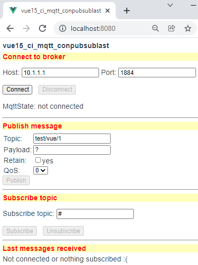
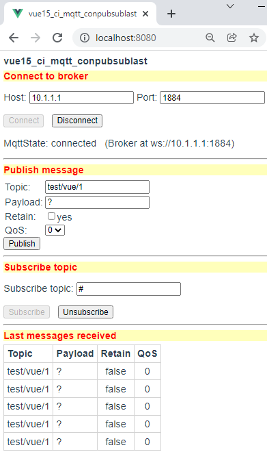
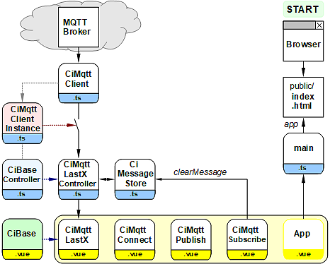

Letzte &Auml;nderung: 19.12.2021 <a name="up"></a>   
<table><tr><td></img></td><td>
<h1>MQTT-Vue-Komponenten zum Verbinden, Veröffentlichen, Abonnieren und Anzeigen</h1>
<a href="../LIESMICH.md">==> Startseite</a> &nbsp; &nbsp; &nbsp; 
<a href="m4h515_Vue_ci_mqtt_conpubsublast_e.md">==> English version</a> &nbsp; &nbsp; &nbsp; 
</td></tr></table>
<a href="https://github.com/khartinger/mqtt4home/tree/main/source_Vue/vue15_ci_mqtt_conpubsublast">==> Code @ GitHub</a><hr>

# Worum geht's?
Die Vue-Anwendung "vue15_ci_mqtt_conpubsublast" beschreibt eine MQTT-App, bei der die Schritte Verbinden, Veröffentlichen, Abonnieren und Anzeigen durch einzelne einzelne Komponenten realisiert sind. Jede Komponente kann in eigenen Programmen (direkt oder geändert) wiederverwendet werden.   
Als Basis für die MQTT-Kommunikation dient die Komponente `CiMqttClient`.   
Es werden zuerst die [erforderlichen Hilfsmittel](#erforderliche-hilfsmittel) und das [Auspobieren/Testen der App](#ausprobieren-der-app) beschrieben. Danach wird die Frage, [wie man dieses Projekt erstellt](#wie-erstellt-man-dieses-projekt), beantwortet und gezeigt, [wie man die MQTT-Funktionalität in die App einbaut](#mqtt-funktionalit&auml;t-einbauen) sowie wie die einzelnen Komponenten erzeugt werden bzw. funktionieren.   

Die Anwendung ist nach dem Start noch nicht mit einem Broker verbunden.   

   
_Bild 1: Startansicht der Anwendung "vue15_ci_mqtt_conpubsublast"_   

# Erforderliche Hilfsmittel
* Hardware: PC oder Laptop mit Internetzugang, Browser
* Hardware: Raspberry Pi (oder PC), auf dem ein MQTT-Broker l&auml;uft (zB Mosquitto)
* Software: Visual Studio Code ("VSC"), das f&uuml;r Vue-Anwendungen bereits vorbereitet ist (Node.js, npm installiert).   

# Ausprobieren der App   
## Voraussetzungen   
1. Das Raspberry Pi (RasPi) wurde entsprechend der [Anleitung (Bereich "Zentrale")](https://github.com/khartinger/mqtt4home/blob/main/LIESMICH.md) installiert, d.h. auf dem RasPi mit der IP `10.1.1.1` l&auml;uft das Broker-Programm (Mosquitto)   
2. Die Vue-Anwendung ist in Visual Studio Code (VSC) geladen und der interne Server l&auml;uft (Eingabe im Terminal: `npm run serve`).   
3. Es besteht eine Netzwerk-/WLAN-Verbindung zwischen dem Rechner, auf dem VSC l&auml;uft, und dem RasPi.   
4. Auf dem PC oder Raspberry Pi ist ein Command-/Terminal-Fenster ge&ouml;ffnet, das empfangene MQTT-Nachrichten anzeigt (Eingabe `mosquitto_sub -h 10.1.1.1 -t "#" -v`)   

## Test   
* Gibt man im Browser die Adresse `localhost:8080` ein, so erscheint _Bild 1_ im Brower.   


   
_Bild 2: Ansicht nach dem Drücken von [Connect], [Subscribe] und fünfmaligem Drücken von [Publish]_   

&nbsp;   

---   
# Wie erstellt man dieses Projekt?
## 1. Allgemeines
Das folgende Diagramm gibt einen &Uuml;berblick &uuml;ber die beteiligten Dateien:   

   
_Bild 3: &Uuml;bersicht &uuml;ber die beteiligten Dateien_   

Mit Hilfe des Diagrammes erkennt man einige wichtige Zusammenh&auml;nge:   
* START: Der User ruft mit dem Brower die Datei `index.html` auf, die die Applikation anzeigt   
  (&uuml;ber `App.vue` - `main.ts` - `index.html`).   
* In `App.vue` werden alle Komponenten aufgerufen.   
* Die Elemente `CiMqttConnect.vue`, `CiMqttPublish.vue` und `CiMqttSubscribe.vue` sind nur Komponenten (Anzeigen) ohne eigenen Controller.   
* Das Element `CiMqttLastX` besteht aus einem Controller, einer Anzeige sowie einem Nachrichtenspeicher. Controller (`*.ts`) und Anzeige (`*.vue`) sind von Basis-Komponenten abgeleitet.   
* Die Verbindung zum MQTT-Broker wird &uuml;ber die Dateien `MqttClient.ts` und `MqttClientInstance.ts` hergestellt. Alle Controller, die MQTT-Nachrichten empfangen wollen, müssen in der Datei `MqttClientInstance.ts` registriert werden. Das ist in diesem Beispiel nur für den Controller `CiMqttLastXController` erforderlich. Vergisst man das Registrieren, erh&auml;lt der Controller keine MQTT-Nachrichten ("Schalter offen").   


## 2. Anlegen des Vue-Projektes in VSC
1. Visual Studio Code (VSC) starten.   
2. VSC: Terminal-Fenster &ouml;ffnen: Men&uuml; Terminal - New Terminal.   
3. VSC-Terminal: In den Ordner wechseln, unter dem das Vue-Projekt erzeugt werden soll:   
   `cd /g/github/mqtt4home/source_Vue`   
4. VSC-Terminal: Vue.js Applikation erzeugen:   
  `vue create vue15_ci_mqtt_conpubsublast`  
  Mit Cursortasten, Leertaste und &lt;Enter&gt; Folgendes ausw&auml;hlen:   
   `> Manually select features` &nbsp; &lt;Enter&gt;   
   `(*) Choose Vue version`   
   `(*) Babel`   
   `(*) TypeScript`   
   `( ) Router`   
   `(*) Linter / Formatter`   
   &lt;Enter&gt;   
   _`> 3.x`_ &nbsp; &lt;Enter&gt;      
   _`? Use class-style component syntax?`_ &nbsp; __`N`__ &lt;Enter&gt;   
   _`? Use Babel alongside TypeScript (required for modern mode, auto-detected polyfills, transpiling JSX)?`_ &nbsp; __`N`__ &lt;Enter&gt;   
   _`? Use history mode for router? (Requires proper server setup for index fallback in production)`_ &nbsp; __`N`__ &lt;Enter&gt;   
   _`? Pick a linter / formatter config:`_ &nbsp; __`ESLint + Standard config`__ &lt;Enter&gt;   
   _`? Pick additional lint features: `_ &nbsp; __`Lint on save`__ &lt;Enter&gt;   
   _`? Where do you prefer placing config for Babel, ESLint, etc.?`_  &nbsp; __`In dedicated config file`__ &lt;Enter&gt;   
   _`? Save this as a preset for future projects? (y/N)`_ &nbsp; __`N`__ &lt;Enter&gt;   
5. In den Projektordner wechseln: _VSC Men&uuml; Datei - Ordner &ouml;ffnen_..
   `/github/mqtt4home/source_Vue/vue15_ci_mqtt_conpubsublast` [Ordner ausw&auml;hlen]   
6. MQTT Bibliothek installieren:   
   VSC: Terminal-Fenster &ouml;ffnen: Men&uuml; Terminal - New Terminal.   
   `npm install mqtt --save`   
&nbsp;   

## 3. Erg&auml;nzen der Vue-Konfiguration   
Erstellen der Datei `vue.config.js`: auf das Plus rechts neben `VUE15_CI_MQTT_CONPUBSUBLAST` klicken (Neue Datei), Namen eingeben.   
_Inhalt der Datei_:   
```   
// ______vue.config.js__________________________________________
module.exports = {
  lintOnSave: false,
  publicPath: './',
  // publicPath: process.env.NODE_ENV === 'production' ? './vue_pubsub2/' : './',
  configureWebpack: {
    devtool: 'source-map'
  },
  chainWebpack: config => {
    config.performance
      .maxEntrypointSize(400000)
      .maxAssetSize(400000)
  }
}

```   
Mit `publicPath: './',` wird die relative Pfadangabe eingestellt und durch den `chainWebpack`-Eintrag werden Warnhinweise bez&uuml;glich der Dateigr&ouml;&szlig;e vermieden (indem man die maximale Dateigr&ouml;&szlig;en h&ouml;her setzt ;) )

## 4. Linter-Warnung "Unexpected any" bei "(value: any)" abstellen    
  In der Datei `.eslintrc.js` unter "`rules: {`" erg&auml;nzen:   
  ```   
  '@typescript-eslint/no-explicit-any': 'off',
  '@typescript-eslint/explicit-module-boundary-types': 'off',
  ```   

## 5. Datei "App.vue" anpassen   
Die Datei `src/App.vue` ist f&uuml;r folgende Punkte zust&auml;ndig:   
  * Anzeige der Komponenten `CiMqttConnect`, `CiMqttPublish`, `CiMqttSubscribe` und `CiMqttLastX`.
  * Definition von einheitlichen Styles f&uuml;r alle Seiten.   
    Daher: Alle Styles erg&auml;nzen, die mit einem Punkt beginnen.   

_&Auml;ndern des Inhalts der Datei auf_:   
```   
<!-- App.vue -->
<template>
<CiMqttConnect></CiMqttConnect>
<hr>
<CiMqttPublish></CiMqttPublish>
<hr>
<CiMqttSubscribe></CiMqttSubscribe>
<br><br>
<CiMqttLastX></CiMqttLastX>
</template>

<script lang="ts">
import { defineComponent } from 'vue'
import CiMqttConnect from './components/CiMqttConnect.vue'
import CiMqttPublish from './components/CiMqttPublish.vue'
import CiMqttSubscribe from './components/CiMqttSubscribe.vue'
import CiMqttLastX from './components/CiMqttLastX.vue'

export default defineComponent({
  name: 'App',
  components: {
    CiMqttConnect,
    CiMqttPublish,
    CiMqttSubscribe,
    CiMqttLastX
  }
})
</script>

<style>
#app {
  font-family: Avenir, Helvetica, Arial, sans-serif;
  -webkit-font-smoothing: antialiased;
  -moz-osx-font-smoothing: grayscale;
  text-align: left;
  color: #2c3e50;
  margin-top: 0px;
}
.mqtt_title {
  font-family: Avenir, Helvetica, Arial, sans-serif;
  font-weight: bold;
  text-align: left;
  color: #FF0000;
  background-color: #FFFFBB;
  margin-top: 6px;
  margin-bottom: 6px;
}
</style>

```   

## 6. Nicht ben&ouml;tigte Dateien und Verzeichnisse l&ouml;schen   
  * Datei `components/HelloWorld.vue` l&ouml;schen   
  * Verzeichnis `assets` l&ouml;schen   

&nbsp;

<a name="mqtt-funktionalit&auml;t-einbauen"></a>
# MQTT-Funktionalit&auml;t einbauen
## Einbinden der erforderlichen Dateien
* Erstellen des Verzeichnisses "controller"   
  Mit der rechten Maustaste auf das Verzeichnis `src` klicken, "Neuer Ordner" w&auml;hlen und den Namen `controller` eingeben.   
* Erstellen des Verzeichnisses "services"   
  Mit der rechten Maustaste auf das Verzeichnis `src` klicken, "Neuer Ordner" w&auml;hlen und den Namen `services` eingeben.   
* Erstellen der Datei `CiMqttClient.ts`   
  * Mit der rechten Maustaste auf das Verzeichnis `services` klicken, "Neue Datei" w&auml;hlen und den Namen `CiMqttClient.ts` eingeben.   
  * Inhalt der Datei von [GitHub holen](https://github.com/khartinger/mqtt4home/blob/main/source_Vue/vue10_ci_mqtt_mini/src/services/CiMqttClient.ts), hineinkopieren und Datei speichern.   
* Erstellen der Datei `CiBaseController.ts`   
  * Mit der rechten Maustaste auf das Verzeichnis `controller` klicken, "Neue Datei" w&auml;hlen und den Namen `CiBaseController.ts` eingeben.   
  * Inhalt der Datei von [GitHub holen](https://github.com/khartinger/mqtt4home/blob/main/source_Vue/vue10_ci_mqtt_mini/src/controller/CiBaseController.ts), hineinkopieren und Datei speichern.   
* Erstellen der Datei `CiBase.vue`   
  * Mit der rechten Maustaste auf das Verzeichnis `components` klicken, "Neue Datei" w&auml;hlen und den Namen `CiBase.vue` eingeben.   
  * Inhalt der Datei von [GitHub holen](https://github.com/khartinger/mqtt4home/blob/main/source_Vue/vue10_ci_mqtt_mini/src/components/CiBase.vue), hineinkopieren und Datei speichern.   

## Erstellen der Datei "services/CiMqttClientInstance"
* Mit der rechten Maustaste auf das Verzeichnis `services` klicken, "Neue Datei" w&auml;hlen und den Namen `CiMqttClientInstance.ts` eingeben.   
* Festlegen, dass beim Start der App keine Verbindung zum Broker hergestellt werden soll (Konstruktor-Wert `false`).   
* Da lediglich die Komponente zum Empfangen (und Speichern) Zugriff auf die MQTT-Nachrichten ben&ouml;tigt, braucht auch nur diese Komponente registriert werden.   

_Ergebnis:_   
```   
// ______mqttClientInstance.ts__________________________________
import { CiMqttClient } from './CiMqttClient'
import { CiMqttLastXController } from '@/controller/CiMqttLastXController'

export const ciMqttClientInstance = new CiMqttClient()
ciMqttClientInstance.registerController(ciMqttLastXController)

```   

# Verbindungs-GUI "CiMqttConnect.vue"
Die Datei `MqttConnect.vue` enth&auml;lt eine grafische Oberfl&auml;che zur Eingabe der Verbindungsdaten f&uuml;r Host und Port sowie die Tasten [Connect] und [Disconnect] zum Verbinden und Trennen der Verbindung zum Host. Mit Hilfe der Eigenschaft `connected` und dem Status der Verbindung werden die Tasten ein- bzw. ausgeblendet und der Verbindungsstatus angezeigt.    
_Anlegen der Datei:_   
* Mit der rechten Maustaste auf das Verzeichnis `components` klicken, "Neue Datei" w&auml;hlen und den Namen `CiMqttConnect.vue` eingeben.   

_Codierung:_   
```   

```   
Man erkennt die Aufteilung des Codes in den Grafik-Teil `<template>` und den Programm-Teil `<script>`.   
__Grafik-Teil:__   
* `<--1-->` Eingabefelder f&uuml;r Host und Port.   
   Mit `v-model` wird der Inhalt der Textfelder mit den Variablen `hostip` bzw. `hostport` verkn&uuml;pft. Die Vorgabewerte stammen aus `mqttClientInstance.mqttConnection`   
* `<--2-->` Eingabetaster [Connect] und [Disconnect], die je nach Programmzustand deaktiviert werden.   
* `<--3-->` Anzeige des Verbindungszustandes (als Text).   
* `<--4-->` Besteht eine Verbindung mit dem Broker, so wird zus&auml;tzlich die URL angezeigt.   
* `<--5-->` W&auml;hrend des Verbindungszustandes wird ein Taster [Cancel] angezeigt, mit dem der Verbindungsaufbau abgebrochen werden kann (zB bei einer falschen IP-Adresse).   

Der Stil f&uuml;r die &Uuml;berschrift (`class="mqtt_title"` mit roter Schrift auf gelbem Grund) ist in der Datei `App.vue` definiert, damit er f&uuml;r alle Vue-Komponenten zur Verf&uuml;gung steht.   

__Skript-Teil:__   
Im Skript-Teil werden die Daten des Verbindungszustandes (aus `mqttClientInstance`) f&uuml;r den Grafik-Teil sowie die Funktionen `connect()`, `end()` und `cancel()` zur Verf&uuml;gung gestellt.   

# GUI zum Senden einer Nachricht (`CiMqttPublish.vue`)
_Anlegen der Datei:_   
* Mit der rechten Maustaste auf das Verzeichnis `components` klicken, "Neue Datei" w&auml;hlen und den Namen `CiMqttPublish.vue` eingeben.   
_Codierung:_   
```   

```   
Im __Grafik-Teil__ (`<template>`) befinden sich   
* zwei Eingabefelder (f&uuml;r Topic und Payload),   
* eine Check-Box (f&uuml;r retain ja/nein), sowie   
* eine Auswahlliste (f&uuml;r QoS) und   
* der Button zum Ausf&uuml;hren der Publish-Funktion.   

Die Verkn&uuml;pfung der Eingabefelder mit den Variablen im Skript-Teil erfolgt wieder mit `v-model`, die Definition des Stils f&uuml;r die &Uuml;berschrift (`class="mqtt_title"`) steht wieder in der Datei `App.vue`.   

Im __Skript-Teil__ wird 
* im data-Block die Variable msg definiert, deren Komponenten zum Datenaustausch mit den GUI-Elementen dienen.   
* Die Funktion `isConnected` prüft, ob eine Verbindung zum Broker besteht. Entsprechend wird der Button [Publish] deaktiviert oder nicht.   
* Die Methode `publish` ruft die gleichnamige Methode des MQTT-Clients auf um die Nachricht zu senden.   

# GUI zum Abonnieren von Nachrichten (`CiMqttSubscribe`)
_Anlegen der Datei:_   
* Mit der rechten Maustaste auf das Verzeichnis `components` klicken, "Neue Datei" w&auml;hlen und den Namen `CiMqttSubscribe.vue` eingeben.   

Die GUI zum Abonnieren von Nachrichten enth&auml;lt ein Eingabefeld f&uuml;r das Topic, das abonniert werden soll. Die Tasten [Subscribe] und [Unsubscribe] werden abh&auml;ngig davon aktiviert, ob eine Verbindung zum Broker besteht und ob gerade auf ein Topic geh&ouml;rt wird.   
Eine Besonderheit stellt die Variable `subscribedTopic` dar: Sie dient gemeinsam mit der Variablen `topicsub` dazu, den Inhalt des Textfeldes mit dem Wert im MQTT-Client synchron zu halten:   
* Beim Start der Anwendung wird der Vorgabewert aus dem MQTT-Client geholt (`computed: { subscribedTopic: ...}`).   
* &Auml;ndert sich der Wert, wird auch das Textfeld aktualisiert (`watch: { subscribedTopic: ...`).   
* Das Updaten des Wertes im MQTT-Client erfolgt automatisch beim Ausf&uuml;hren der Funktion `await mqttClientInstance.subscribe(this.topicsub, 0)`.   

Beim Beenden des Abos (`unsubscribe`) wird auch der Nachrichten-Speicher gel&ouml;scht (Aufruf von `clearMessage()`).   

# Anzeige von Nachrichten
Die Anzeige der letzten X Nachrichten wird auf drei Dateien aufgeteilt:   
* `components/CiMqttLastX.vue: ` Anzeige der Nachrichten (Topic, Payload, Retain, QoS) in Form einer Tabelle. Gibt es keine Nachrichten anzuzeigen, wird nur die &Uuml;berschrift der Tabelle ausgegeben. Ist kein Topic abonniert, wird der Text "`Not connected or nothing subscribed :(`" angezeigt.   
   Weiters enth&auml;lt die Datei einige Stile f&uuml;r die Anzeige der Tabelle.   
* `controller/CiMqttLastXController.ts: ` Die Datei enth&auml;lt die von `DeviceController` abgeleitete Klasse `MqttLastXController`, die die Methode `onMessage` enth&auml;lt. In dieser Methode wird die eintreffende Nachricht in den Nachrichtenspeicher eingef&uuml;gt (`this.addMessage(message)`).   
* `store/CiMessageStrore.ts: ` Diese Datei enth&auml;lt die Anzahl der maximalen Eintr&auml;ge in den Speicher (`maxSize`), den Speicher f&uuml;r die Nachrichten (`messageStore`), eine Methode zum Exportieren der Nachrichten (`messages`), eine Methode zum Hinzuf&uuml;gen einer Nachricht (`addMessage`) sowie eine Methode zum L&ouml;schen des Speichers (`clearMessage`)   

_Anlegen der Dateien:_   
* Mit der rechten Maustaste auf das Verzeichnis `components` klicken, "Neue Datei" w&auml;hlen und den Namen `CiMqttLastX.vue` eingeben.   
Inhalt der Datei: ..ToDo..   
* Mit der rechten Maustaste auf das Verzeichnis `controller` klicken, "Neue Datei" w&auml;hlen und den Namen `CiMqttLastXController.ts` eingeben.   
Inhalt der Datei: ..ToDo..   
* Mit der rechten Maustaste auf das Verzeichnis `src` klicken, "Neuer Ordner" w&auml;hlen und den Namen `store` eingeben.   
* Mit der rechten Maustaste auf das Verzeichnis `store` klicken, "Neue Datei" w&auml;hlen und den Namen `CiMessageStore.ts` eingeben.   
Inhalt der Datei: ..ToDo..   

[Zum Seitenanfang](#up)
