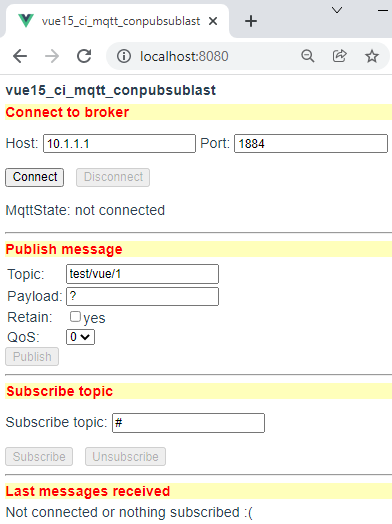
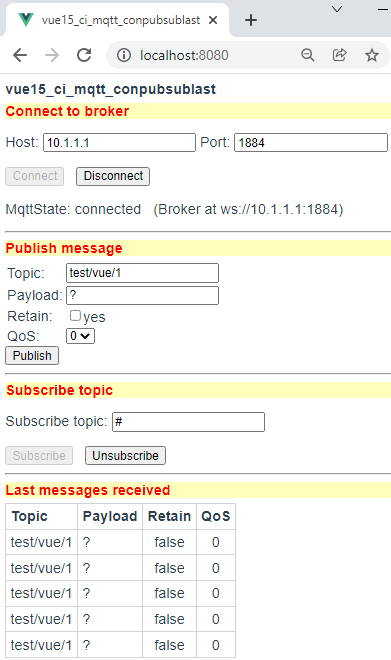
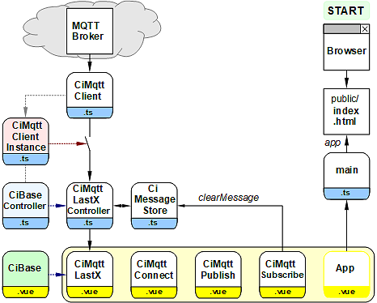

Last modified: 2021-12-19 <a name="up"></a>   
<table><tr><td></td><td>
<h1>MQTT Vue components for connecting, publishing, subscribing, and viewing</h1>
<a href="../README.md">==> Home page</a> &nbsp; &nbsp; &nbsp; 
<a href="m4h515_Vue_ci_mqtt_conpubsublast.md">==> German version</a> &nbsp; &nbsp; &nbsp; 
</td></tr></table>
<a href="https://github.com/khartinger/mqtt4home/tree/main/source_Vue/vue15_ci_mqtt_conpubsublast">==> Code @ GitHub</a><hr>

# What is it about?
The Vue application "vue15_ci_mqtt_conpubsublast" describes an MQTT app, where the steps connect, publish, subscribe and view are realized by single individual components. Each component can be reused in its own programs (directly or modified).   
The component 'CiMqttClient' serves as the basis for MQTT communication.   
First the [required tools](#required-tools) and the [trying-out/testing-the-app](#trying-out-the-app) are described. After that, the question [how-to-create-this-project](#how-to-create-this-project) is answered and it is shown [how to build the MQTT functionality into the app](#incorporating-mqtt-functionality) as well as how the individual components are created or work.   

The app is not yet connected to a broker after launch.   

   
_Figure 1: Startup view of the "vue15_ci_mqtt_conpubsublast" application._   

# Required tools
* Hardware: PC or laptop with internet access, browser
* Hardware: Raspberry Pi (or PC) running an MQTT broker (e.g. Mosquitto)
* Software: Visual Studio Code ("VSC"), which is already prepared for Vue applications (Node.js, npm installed).   

# Trying out the app   
## Prerequisites   
1. The Raspberry Pi (RasPi) has been installed according to the [instructions (section "Central")](https://github.com/khartinger/mqtt4home/blob/main/LIESMICH.md), i.e. on the RasPi with IP `10.1.1.1` the broker program (Mosquitto) is running.   
2. The Vue application is loaded in Visual Studio Code (VSC) and the internal server is running (input in terminal: `npm run serve`).   
3. There is a network/WLAN connection between the computer running VSC and the RasPi.   
4. A command/terminal window is opened on the PC or Raspberry Pi, which shows received MQTT messages (input `mosquitto_sub -h 10.1.1.1 -t "#" -v`)   

## Test   
* If you enter the address `localhost:8080` in the browser, _image 1_ appears in the brower (see above).   

* If you press the button [Connect], the app tries to connect to the broker (MqttState: connecting to ws://10.1.1.1:1884).   
  * If this succeeds, the MqttState "connected" is displayed.   
  * If this does not succeed, e.g. because the WLAN connection is missing, the process can be aborted by pressing [Cancel].   

* Pressing [Publish] sends the message in the input fields.   
This can be seen in the command/terminal window.   

* If one presses the [Subscribe] key with the default topic "#", all newly received messages are displayed.   
That means: If you press [Publish] now, the message is also in the area "Last messages received".   

   
_Figure 2: View after pressing [Connect], [Subscribe], and pressing [Publish]_ five times.   

* Pressing [Disconnect] terminates the connection to the broker and clears the message store.   

&nbsp;   

---   
# How to create this project?
## 1. General
The following diagram gives an overview of the files involved:   

   
_Figure 3: Overview of the files involved_   

With the help of the diagram one recognizes some important connections:   
* START: The user calls with the brower the file `index.html`, which shows the application   
  (via `App.vue` - `main.ts` - `index.html`).   
* In `App.vue` all components are called.   
* The elements `CiMqttConnect.vue`, `CiMqttPublish.vue` and `CiMqttSubscribe.vue` are only components (displays) without their own controller.   
* The `CiMqttLastX` element consists of a controller, a display and a message store. Controller (`*.ts`) and display (`*.vue`) are derived from base components.   
* The connection to the MQTT broker is established via the files `MqttClient.ts` and `MqttClientInstance.ts`. All controllers that want to receive MQTT messages must be registered in the `MqttClientInstance.ts` file. In this example, this is only required for the controller `CiMqttLastXController`. If you forget to register, the controller will not receive any MQTT messages ("switch open").   


## 2. Creation of the Vue project in VSC
1. Start Visual Studio Code (VSC).   
2. VSC: Open terminal window: Menu Terminal - New Terminal.   
3. VSC Terminal: Change to the folder under which the Vue project is to be created:   
   `cd /g/github/mqtt4home/source_Vue`.   
4. VSC terminal: create Vue.js application:   
  `vue create vue15_ci_mqtt_conpubsublast`.  
  Use cursor keys, space bar and &lt;Enter&gt; to select the following:   
   `> Manually select features` &nbsp; &lt;Enter&gt;   
   `(*) Choose Vue version`   
   `(*) Babel`   
   `(*) TypeScript`   
   `( ) Router`   
   `(*) Linter / Formatter`   
   &lt;Enter&gt;   
   _`> 3.x`_ &nbsp; &lt;Enter&gt;      
   _`? Use class-style component syntax?`_ &nbsp; __`N`__ &lt;Enter&gt;   
   _`? Use Babel alongside TypeScript (required for modern mode, auto-detected polyfills, transpiling JSX)?`_ &nbsp; __`N`__ &lt;Enter&gt;   
   _`? Use history mode for router? (Requires proper server setup for index fallback in production)`_ &nbsp; __`N`__ &lt;Enter&gt;   
   _`? Pick a linter / formatter config:`_ &nbsp; __`ESLint + Standard config`__ &lt;Enter&gt;   
   _`? Pick additional lint features: `_ &nbsp; __`Lint on save`__ &lt;Enter&gt;   
   _`? Where do you prefer placing config for Babel, ESLint, etc.?`_ &nbsp; __`In dedicated config file`__ &lt;Enter&gt;   
   _`? Save this as a preset for future projects? (y/N)`_ &nbsp; __`N`__ &lt;Enter&gt;   
5. Switch to the project folder: _VSC Men&uuml; File - Open Folder_..
   `/github/mqtt4home/source_Vue/vue15_ci_mqtt_conpubsublast` [select folder].   
6. Install MQTT library:   
   VSC: Open terminal window: Menu Terminal - New Terminal.   
   `npm install mqtt --save`   
&nbsp;   

## 3. Adding to the Vue configuration   
Create the file `vue.config.js`: click on the plus to the right of `VUE15_CI_MQTT_CONPUBSUBLAST` (New file), enter name.   
_Content of file_:   
```   
// ______vue.config.js__________________________________________
module.exports = {
  lintOnSave: false,
  publicPath: './',
  // publicPath: process.env.NODE_ENV === 'production' ? './vue_pubsub2/' : './',
  configureWebpack: {
    devtool: 'source-map'
  },
  chainWebpack: config => {
    config.performance
      .maxEntrypointSize(400000)
      .maxAssetSize(400000)
  }
}

```   
With `publicPath: './',` the relative path is set and the `chainWebpack` entry avoids warnings about the file size (by setting the maximum file size higher ;) )

## 4. Disable linter warning "Unexpected any" at "(value: any)".    
  In the file `.eslintrc.js` under "`rules: {`" add:   
  ```   
  '@typescript-eslint/no-explicit-any': 'off',
  '@typescript-eslint/explicit-module-boundary-types': 'off',
  ```   

## 5. Customize file "App.vue   
The `src/App.vue` file is responsible for the following:   
  * Displaying the `CiMqttConnect`, `CiMqttPublish`, `CiMqttSubscribe` and `CiMqttLastX` components.
  * Definition of uniform styles for all pages.   
    Therefore: add all styles starting with a dot.   

_Change the contents of the file to_:   
```   
<!-- App.vue -->
<template>
<CiMqttConnect></CiMqttConnect>
<hr>
<CiMqttPublish></CiMqttPublish>
<hr>
<CiMqttSubscribe></CiMqttSubscribe>
<br><br>
<CiMqttLastX></CiMqttLastX>
</template>

<script lang="ts">
import { defineComponent } from 'vue'
import CiMqttConnect from './components/CiMqttConnect.vue'
import CiMqttPublish from './components/CiMqttPublish.vue'
import CiMqttSubscribe from './components/CiMqttSubscribe.vue'
import CiMqttLastX from './components/CiMqttLastX.vue'

export default defineComponent({
  name: 'App',
  components: {
    CiMqttConnect,
    CiMqttPublish,
    CiMqttSubscribe,
    CiMqttLastX
  }
})
</script>

<style>
#app {
  font-family: Avenir, Helvetica, Arial, sans-serif;
  -webkit-font-smoothing: antialiased;
  -moz-osx-font-smoothing: grayscale;
  text-align: left;
  color: #2c3e50;
  margin-top: 0px;
}
.mqtt_title {
  font-family: Avenir, Helvetica, Arial, sans-serif;
  font-weight: bold;
  text-align: left;
  color: #FF0000;
  background-color: #FFFFBB;
  margin-top: 6px;
  margin-bottom: 6px;
}
</style>

```   

## 6. Delete files and directories that are not needed   
  * Delete file `components/HelloWorld.vue`   
  * delete `assets` directory   

&nbsp;

<a name="incorporating-mqtt-functionality"></a>
## Incorporating MQTT functionality
## Include the required files.
* Create the directory "controller"   
  Right click on the `src` directory, select "New folder" and enter the name `controller`.   
* Creating the "services" directory   
  Right click on the `src` directory, select "New folder" and enter the name `services`.   
* Create the `CiMqttClient.ts` file   
  * Right click on the `services` directory, select "New file" and enter the name `CiMqttClient.ts`.   
  * Get contents of file from [GitHub](https://github.com/khartinger/mqtt4home/blob/main/source_Vue/vue10_ci_mqtt_mini/src/services/CiMqttClient.ts), copy in and save file.   
* Create the file `CiBaseController.ts`.   
  * Right click on the `controller` directory, select "New File" and enter the name `CiBaseController.ts`.   
  * Get contents of file from [GitHub](https://github.com/khartinger/mqtt4home/blob/main/source_Vue/vue10_ci_mqtt_mini/src/controller/CiBaseController.ts), copy in and save file.   
* Create the file `CiBase.vue`.   
  * Right click on the `components` directory, select "New file" and enter the name `CiBase.vue`.   
  * Get contents of file from [GitHub](https://github.com/khartinger/mqtt4home/blob/main/source_Vue/vue10_ci_mqtt_mini/src/components/CiBase.vue), copy in and save file.   

## Create the file "services/CiMqttClientInstance".
* Right click on the `services` directory, select "New File" and enter the name `CiMqttClientInstance.ts`.   
* Specify that no connection should be made to the broker when the app is started (constructor value `false`).   
* Since only the receiving (and storing) component needs access to the MQTT messages, only this component needs to be registered.   

_Result:_   
```   
// ______mqttClientInstance.ts__________________________________
import { CiMqttClient } from './CiMqttClient'
import { ciMqttLastXController } from '@/controller/CiMqttLastXController'

export const ciMqttClientInstance = new CiMqttClient(false)
ciMqttClientInstance.registerController(ciMqttLastXController)

```   

# Connection GUI "CiMqttConnect.vue"
The file `MqttConnect.vue` contains a graphical interface for entering the connection data for host and port and the buttons [Connect] and [Disconnect] for connecting and disconnecting to the host. The `connected` property and the connection status are used to show or hide the buttons and display the connection status.   
_Creating the file:_   
* Right-click on the `components` directory, select "New file" and enter the name `CiMqttConnect.vue`.   

_Coding:_   
```   
<!-- CiMqttConnect.vue -->
<template>
  <div class="mqtt_title">Connect to broker</div>
  <p>                                            <!--1-->
    Host: <input v-model="hostip">
    Port: <input type="number" v-model.number="hostport">
  </p>
                                                 <!--2-->
  <button @click="connect()" :disabled="isConnected || isConnecting">Connect</button> &nbsp;
  <button @click="end()"     :disabled="!isConnected">Disconnect</button> &nbsp;
  <p>
    MqttState: {{ getMqttState }}                <!--3-->
    <span v-if=isConnected>
       &nbsp; (Broker at {{ getConnectUrl }})    <!--4-->
    </span>
    <span v-if=isConnecting>
      &nbsp;
      <button @click="cancel()">Cancel</button>  <!--5-->
    </span>
  </p>
</template>

<script lang="ts">
import { defineComponent } from 'vue'
import { ciMqttClientInstance } from '@/services/CiMqttClientInstance'

export default defineComponent({
  data () {
    return {
      hostip: ciMqttClientInstance.mqttConnection.host,
      hostport: ciMqttClientInstance.mqttConnection.port
    }
  },
  computed: {
    isConnected: function (): boolean {
      return ciMqttClientInstance.mqttState.connected
    },
    isConnecting: function (): boolean {
      if (ciMqttClientInstance.mqttState.iConnMqttState === 2) return true
      return false
    },
    getMqttState: function (): string {
      return ciMqttClientInstance.sConnMqttState()
    },
    getConnectUrl: function (): string {
      return ciMqttClientInstance.connectUrl()
    }
  },
  mounted: async function (): Promise<void> {
    // this.connect()
  },
  methods: {
    connect: async function (): Promise<void> {
      if (!this.isConnected) {
        console.log('CiMqttConnect.vue: Connecting to ' + this.hostip + ':' + this.hostport + '...')
        await ciMqttClientInstance.connect(this.hostip, this.hostport, '')
        console.log('CiMqttConnect.vue: Connected to ' + this.getConnectUrl)
      }
    },
    end: async function (): Promise<void> {
      ciMqttClientInstance.disconnect()
    },
    cancel: async function (): Promise<void> {
      ciMqttClientInstance.disconnect()
    }
  }
})
</script>

<style>
</style>

```   

You can see the division of the code into the graphics part `<template>` and the program part `<script>`.   
__Graphics part:__   
* `<--1-->` input fields for host and port.   
   With `v-model` the content of the text fields is linked with the variables `hostip` and `hostport` respectively. The default values are taken from `ciMqttClientInstance.mqttConnection`.   
* `<--2-->` Input buttons [Connect] and [Disconnect], which are disabled depending on the program state.   
* `<--3-->` Display of the connection state (as text).   
* `<--4-->` If there is a connection with the broker, the URL is displayed additionally.   
* `<--5-->` During the connection state a button [Cancel] is displayed, which can be used to cancel the connection (e.g. in case of a wrong IP address).   

The style for the caption (`class="mqtt_title"` with red font on yellow background) is defined in the file `App.vue`, so that it is available for all Vue components.   

__Script part:__   
In the script part the data of the connection state (from `mqttClientInstance`) for the graphic part as well as the functions `connect()`, `end()` and `cancel()` are provided.   

# GUI for sending a message (CiMqttPublish.vue)
_Create the file:_   
* Right click on the `components` directory, select "New file" and enter the name `CiMqttPublish.vue`.   

_Coding:_   
```   
<!-- CiMqttPublish.vue -->
<template>
  <div class="mqtt_title">Publish message</div>
  <table>
   <tr><td>Topic: </td><td><input v-model="msg.intopic"></td></tr>
   <tr><td>Payload: </td><td><input v-model="msg.inpayload"></td></tr>
   <tr><td>Retain: </td><td><input type="checkbox" v-model="msg.inretain">yes</td></tr>
   <tr><td>QoS: </td><td>
     <select v-model="msg.inqos">
       <option>0</option>
       <option>1</option>
       <option>2</option>
     </select>
    </td></tr>
</table>
  <button @click="publish()" :disabled="!isConnected">Publish</button> &nbsp;
</template>

<script lang="ts">
import { defineComponent } from 'vue'
import { ciMqttClientInstance } from '@/services/CiMqttClientInstance'
import { QoS } from 'Mqtt'

export default defineComponent({
  data () {
    return {
      msg: {
        intopic: 'test/vue/1',
        inpayload: '?',
        inretain: false,
        inqos: 0 as QoS
      }
    }
  },
  computed: {
    isConnected: function (): boolean {
      return ciMqttClientInstance.mqttState.connected
    }
  },
  methods: {
    publish: async function (): Promise<void> {
      try {
        await ciMqttClientInstance.publish(
          this.msg.intopic, this.msg.inpayload, this.msg.inretain, this.msg.inqos)
      } catch (e) {
        console.error('NO CONNECTION')
      }
    }
  }
})
</script>

<style>
</style>

```   
In the __graphics-part__ (`<template>`) there are   
* two input fields (for topic and payload),   
* a check box (for retain yes/no), and   
* a selection list (for QoS) and   
* the button to execute the publish function.   

The linking of the input fields with the variables in the script part is again done with `v-model`, the definition of the style for the caption (`class="mqtt_title"`) is again in the file `App.vue`.   

In the __script part__. 
* in the data block the variable msg is defined, whose components are used for data exchange with the GUI elements.   
* The function `isConnected` checks if a connection to the broker exists. Accordingly, the [Publish] button is disabled or not.   
* The `publish` method calls the MQTT client method of the same name to send the message.   

# GUI for subscribing to messages (CiMqttSubscribe)
_Create the file:_   
* Right click on the `components` directory, select "New file" and enter the name `CiMqttSubscribe.vue`.   

_Coding:_   
```   
<!-- CiMqttSubscribe.vue -->
<template>
  <div class="mqtt_title">Subscribe topic</div>
  <p>Subscribe topic: <input v-model="topicsub"></p>
  <button @click="subscribe()"   :disabled="(!isConnected) || (isSubscribed)">Subscribe</button> &nbsp;
  <button @click="unsubscribe()" :disabled="(!isConnected) || (!isSubscribed)">Unsubscribe</button> &nbsp;
</template>

<script lang="ts">
import { defineComponent } from 'vue'
import { ciMqttClientInstance } from '@/services/CiMqttClientInstance'
import { clearMessage } from '@/store/CiMessageStore'

export default defineComponent({
  data () {
    return {
      topicsub: ciMqttClientInstance.mqttSubscription.topic
    }
  },
  computed: {
    subscribedTopic: function (): string {
      return ciMqttClientInstance.mqttSubscription.topic
    },
    isConnected: function (): boolean {
      return ciMqttClientInstance.mqttState.connected
    },
    isSubscribed: function (): boolean {
      return ciMqttClientInstance.mqttSubscription.subscribed
    }
  },
  watch: {
    subscribedTopic: function (newValue: string): void {
      this.topicsub = newValue
    }
  },
  methods: {
    subscribe: async function (): Promise<void> {
      console.log('MqttSubscribe.vue-subscribe: topic=' + this.topicsub)
      await ciMqttClientInstance.subscribe(this.topicsub, 0)
    },
    unsubscribe: async function (): Promise<void> {
      ciMqttClientInstance.unsubscribe()
      clearMessage()
    }
  }
})
</script>

<style>
</style>

```   

The GUI for subscribing to messages contains an input field for the topic to be subscribed to. The [Subscribe] and [Unsubscribe] buttons are activated depending on whether there is a connection to the broker and whether a topic is currently being listened to.   
A special feature is the variable `subscribedTopic`: Together with the variable `topicsub` it is used to keep the content of the text field in sync with the value in the MQTT client:   
* When the application is started, the default value is fetched from the MQTT client (`computed: { subscribedTopic: ...}`).   
* If the value changes, the text field is also updated (`watch: { subscribedTopic: ...`).   
* Updating the value in the MQTT client is done automatically when executing the `await mqttClientInstance.subscribe(this.topicsub, 0)` function.   

When unsubscribing, the message store is also cleared (call `clearMessage()`).   

# Display of messages
The display of the last X messages is split into three files:   
* `components/CiMqttLastX.vue: ` Display of messages (topic, payload, retain, QoS) in the form of a table. If there are no messages to display, only the &Uuml;berschrift of the table is output. If no topic is subscribed, the text "`Not connected or nothing subscribed :(`" is displayed.   
   Furthermore the file contains some styles for displaying the table.   
* `controller/CiMqttLastXController.ts: ` The file contains the `MqttLastXController` class derived from `DeviceController`, which contains the `onMessage` method. In this method the incoming message is added to the message store (`this.addMessage(message)`).   
* `store/CiMessageStrore.ts: ` This file contains the maximum number of entries into the store (`maxSize`), the store for the messages (`messageStore`), a method to export the messages (`messages`), a method to add a message (`addMessage`) and a method to clear the store (`clearMessage`).   

_Creating the files:_   
* Right-click on the `components` directory, select "New file" and enter the name `CiMqttLastX.vue`.   

_Contents of the file:_   
```   
<!-- CiMqttLastX.vue -->
<template>
  <div class="mqtt_title">Last messages received</div>
  <div v-if="isSubscribed">
    <table>
      <tr><th>Topic</th><th>Payload</th><th>Retain</th><th>QoS</th></tr>
      <tr v-for="(message, key) in messages" :key="key">
        <td class="nobr">{{ message.topic }}</td>
        <td>{{ message.payload }}</td>
        <td class="w10">{{ message.retain }}</td>
        <td class="w10">{{ message.qos }}</td>
      </tr>
    </table>
  </div>
  <div v-else>
    Not connected or nothing subscribed :(
  </div>
</template>

<script setup lang="ts">
import { messages } from '@/store/CiMessageStore'
import { ciMqttLastXController } from '@/controller/CiMqttLastXController'
const isSubscribed = ciMqttLastXController.isSubscribe()
</script>

<style scoped>
  table {
    table-layout: fixed;
    border: 1px solid lightgrey;
    border-collapse: collapse;
  }
  th, td {
    border: 1px solid lightgrey;
    overflow-wrap: anywhere;
    padding: .3em .3em;
  }
  td.nobr {
    white-space: nowrap;
  }
.w10 {
    text-align: center;
    white-space: nowrap;
  }
</style>

```   

* Right-click on the `controller` directory, select "New file" and enter the name `CiMqttLastXController.ts`.   

_Content of the file:_   
```   
// ______CiMqttLastXController.ts_______________________________
import { Message } from '@/services/CiMqttClient'
import { ciMqttClientInstance } from '@/services/CiMqttClientInstance'
import { messages, addMessage } from '@/store/CiMessageStore'
import { computed, ComputedRef } from 'vue'
import { CiBaseController } from './CiBaseController'

export class CiMqttLastXController extends CiBaseController {
  private messages;
  private addMessage;

  constructor () {
    super()
    this.messages = messages
    this.addMessage = addMessage
  }

  public onMessage (message: Message): void {
    this.addMessage(message)
    console.log('MqttLastXController.ts', 'Received ' + message.topic)
  }

  public isSubscribe (): ComputedRef<boolean> {
    return computed(() => ciMqttClientInstance.mqttState.connected && ciMqttClientInstance.mqttSubscription.subscribed)
  }
}

export const ciMqttLastXController = new CiMqttLastXController()

```   

* Right-click on the `src` directory, select "New folder" and enter the name `store`.   
* Right-click on the `store` directory, select "New file" and enter the name `CiMessageStore.ts`.   

_Contents of the file:_   
```   
// ______CiessageStore.ts______________________________________
import { Message } from '@/services/CiMqttClient'
import { computed, reactive } from '@vue/runtime-core'

const maxSize = 5
const messageStore = reactive<Array<Message>>([])

export const messages = computed(() => {
  return messageStore.slice().reverse()
})

export const addMessage = (message: Message) => {
  messageStore.push(message)
  if (messageStore.length > maxSize) {
    messageStore.shift()
  }
}

export const clearMessage = () => {
  messageStore.splice(0, messageStore.length)
}

```   

[Top of page](#up)
