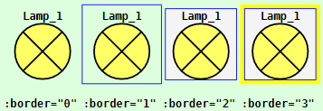
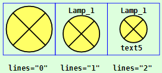
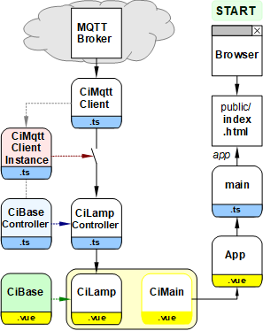
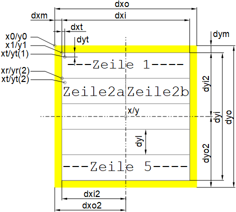

Letzte &Auml;nderung: 23.12.2021 <a name="up"></a>   
<table><tr><td></img></td><td>
<h1>Vue-MQTT: Wie erstellt man ein CI-Symbol? (Beispiel: Lampe)</h1>
<a href="../LIESMICH.md">==> Startseite</a> &nbsp; &nbsp; &nbsp; 
<a href="m4h520_Vue_ci_mqtt_lamp1_e.md">==> English version</a> &nbsp; &nbsp; &nbsp; 
</td></tr></table>
<a href="https://github.com/khartinger/mqtt4home/tree/main/source_Vue/vue20_ci_mqtt_lamp1">==> Code @ GitHub</a><hr>

Dieses Projekt "Vue: MQTT Lamp1" beschreibt, wie man ein Vue Lampen-Symbol erstellt, das MQTT-Nachrichten senden und empfangen kann und das einfach in eigene Web-Seiten eingebunden werden kann.   

Es werden   
* die [erforderlichen Hilfsmittel](#erforderliche-hilfsmittel) und danach   
* der [Funktionstest](#funktionstest),   
* die [Verwendung eines CI-Symbols (CI: controller/indicator)](#verwendung-eines-ci-symbols),   
* das [Erstellen des Projektes](#wie-erstellt-man-dieses-projekt),   
* der [Einbau der MQTT-Funktionalit&auml;t](#mqtt-function),   
* die [Funktion des Ci_Basis-Elementes](#das-cibase-element) und 
* das [Erstellen des Lampensymbols](#erstellen-des-lampensymbols)

beschrieben.   

Das folgende Bild zeigt verschiedene Darstellungen des Lampensymbols (Name und Rahmen, Name + Text5 + einfacher Rahmen, Symbol ohne Texte und Rahmen):   
       
_Bild 1: Verschiedene Varianten des Lampensymbols_   

Man erkennt:   
* Das gesamte GUI ist eine svg-Grafik.   
* Steuer- oder Anzeigesymbole sind quadratisch und gleich gro&szlig;.   
* Symbole k&ouml;nnen mit oder ohne Rand dargestellt werden.   
* Symbole k&ouml;nnen mit oder ohne Text dargestellt werden.   

# Erforderliche Hilfsmittel
* Hardware: PC oder Laptop mit Internetzugang, Browser
* Hardware: Raspberry Pi (oder PC), auf dem ein MQTT-Broker l&auml;uft (zB Mosquitto)
* Software: Visual Studio Code ("VSC"), das f&uuml;r Vue-Anwendungen bereits vorbereitet ist.   
   (Dh. es wurde bereits mindestens eine Vue-Anwendung in Visual Code erstellt.)   

# Funktionstest
## Voraussetzungen f&uuml;r den Test   
1. Das Raspberry Pi (RasPi) wurde entsprechend der [Anleitung (Bereich "Zentrale")](../../LIESMICH.md) installiert, d.h. auf dem RasPi mit der IP `10.1.1.1` l&auml;uft das Broker-Programm (Mosquitto)   
2. Die Vue-Anwendung ist in Visual Studio Code (VSC) geladen und der interne Server l&auml;uft (Eingabe im Terminal: `npm run serve`).   
3. Es besteht eine Netzwerk-/WLAN-Verbindung zwischen dem Rechner, auf dem VSC l&auml;uft, und dem RasPi.   
4. Auf dem PC oder Raspberry Pi ist ein Command-/Terminal-Fenster offen, das empfangene MQTT-Nachrichten anzeigt (Eingabe `mosquitto_sub -h 10.1.1.1 -t "#" -v`)   

Anmerkung: Hat das RasPi eine andere IP als 10.1.1.1, so muss die IP in der Datei `App.vue` angepasst werden (`const hostip = '...'`).   
## Test   
* Gibt man im Browser die Adresse `localhost:8080` ein, so erscheint _Bild 1_ im Brower.   
  Da der Lampenstatus unbekannt ist, sind die Lampensymbole blau gef&auml;rbt.   
* Klickt man auf das linke Lampensymbol, wird eine MQTT-Nachricht `ci/lamp/1/set/lamp` mit der Payload `1` gesendet.   
Die Nachricht wird im Command-/Terminal-Fenster angezeigt.   
* Da alle drei Lampen in diesem Beispiel dieses Topic bei `subTopic:` angegeben haben, empfangen auch alle drei Lampen diese Nachricht, setzen den Status auf 1 und f&auml;rben sich entsprechend gelb ein.   
* Klickt man auf das mittlere oder rechte Lampensymbol, wird eine MQTT-Nachricht `ci/lamp/1/set/lamp` mit der Payload `0` gesendet.   
Die Nachricht wird im Command-/Terminal-Fenster angezeigt.   
* Alle drei Lampen empfangen diese Nachricht, setzen den Status auf 0 und f&auml;rben sich entsprechend grau ein.   

&nbsp;

# Verwendung eines CI-Symbols
Die Verwendung eines CI-Symbols wird am Beispiel des Lampensymbols gezeigt, wobei drei Schritte erforderlich sind:   

<a name="define-properties"></a>   

## Schritt 1: Definition der Eigenschaften des Lampensymbols
Jede Lampe muss im Lampencontroller (Datei `controller/CiLampController`) im Array `lamps` eingetragen werden, wobei folgende Eigenschaften f&uuml;r eine Lampe m&ouml;glich sind:   

* __id__: ID der Lampe. Diese muss eindeutig sein.
* name?: (Zus&auml;tzlicher) Name der Lampe.
* __subTopic__: Topic, auf das die Lampe reagiert (subscribe).
* __pubTopic__: Topic der Nachricht, die bei einem Klick versendet wird.
* pubPayload?: Payload der Nachricht, die bei einem Klick versendet wird.
* __iLampState__: Lampenstatus (0=off, 1=on, -1=unknown) 
* text5?: Text f&uuml;r die Zeile 5 (falls gew&uuml;nscht).

Ein Fragezeichen nach dem Namen zeigt an, dass dieser Wert nicht angegeben werden muss.   

_Beispiel_:   
```   
  public lamps: Array<Lamp> = reactive(
    [
      {
        id: 'lamp1',
        name: 'Lamp_1',
        iLampState: -1,
        text5: 'Text_5',
        subTopic: 'ci/lamp/1/ret/lamp',
        pubTopic: 'ci/lamp/1/set/lamp',
        pubPayload: '-1'
      }
    ]
  );
```   
Mindestens angegeben werden m&uuml;ssen die Eigenschaften `id`, `iLampState`, `subTopic` und `pubTopic`.   

## Schritt 2: Darstellung des Lampensymbols in einer .vue-Datei
Der Einbau eines Lampensymbols erfolgt im `<template>`-Bereich einer Vue-Datei, zB durch folgende Anweisung:

`<CiLamp :x="160" :y="50" sid="lamp1" lines="2" border="0"></CiLamp>`   

Der Mittelpunkt des Symbols (`x`, `y`) sowie die ID der Lampe (`sid=`) m&uuml;ssen angegeben werden, wobei die ID mit der id im Lampencontroller &uuml;bereinstimmen muss.   
Die Angabe von `lines` und `border` ist optional. Entf&auml;llt diese Angabe, wird ein Symbol mit Kopfzeile (= `name`) und gelbem Rand gezeichnet.   

## Schritt 3: Einbinden des Lampensymbols in einer .vue-Datei
Um das Lampensymbol im `<template>`-Bereich verwenden zu k&ouml;nnen, sind zwei Befehle im `<script>`-Bereich erforderlich:   
*  Importieren der Lampenkodierung:   
  `import CiLamp from './CiLamp.vue'`   
* Aufz&auml;hlen bei den verwendeten Komponenten:   
  `components: {`   
  `  CiLamp`   
  `},`   

&nbsp;   

---   
# Wie erstellt man dieses Projekt?
## 1. Allgemeines
Das folgende Diagramm gibt einen &Uuml;berblick &uuml;ber die beteiligten Dateien:   

   
_Bild 2: &Uuml;bersicht &uuml;ber die beteiligten Dateien_   

Mit Hilfe des Diagrammes erkennt man einige wichtige Zusammenh&auml;nge:   

* Der rechte Zweig mit (Browser -->) index.html --> main.ts --> App.vue wird automatisch erstellt und muss etwas angepasst werden.   
* Die Datei `main.ts` erzeugt das App-Element, das in `index.html` angezeigt wird.   
* `App.vue` stellt `<CiMain>` dar und enth&auml;lt css-Elemente, die im gesamten Projekt verwendet werden k&ouml;nnen.   
* Das Grafik-Element `CiLamp` besteht aus einem "Controller"- und "Grafik"-Teil (Erweiterung `.ts` bzw. `.vue`), welche von Basis-Komponenten abgeleitet werden.   
* Die Verbindung zum MQTT-Broker wird &uuml;ber die Dateien `CiMqttClient.ts` und `CiMqttClientInstance.ts` hergestellt, wobei alle Controller in der Datei `CiMqttClientInstance.ts` registriert werden m&uuml;ssen. Vergisst man dies, erh&auml;lt der Controller keine MQTT-Nachrichten ("Schalter offen").   

## 2. Anlegen des Vue-Projektes in VSC   
1. Visual Studio Code (VSC) starten.   
2. VSC: Terminal-Fenster &ouml;ffnen: Men&uuml; Terminal - New Terminal.   
3. VSC-Terminal: In den Ordner wechseln, unter dem das Vue-Projekt erzeugt werden soll:   
   `cd /g/github/mqtt4home/source_Vue`   
4. VSC-Terminal: Vue.js Applikation erzeugen:   
  `vue create vue20_ci_mqtt_lamp1`  
  Mit Cursortasten, Leertaste und &lt;Enter&gt; Folgendes ausw&auml;hlen:   
   `> Manually select features` &nbsp; &lt;Enter&gt;   
   `(*) Choose Vue version`   
   `(*) Babel`   
   `(*) TypeScript`   
   `( ) Router`   
   `(*) Linter / Formatter`   
   &lt;Enter&gt;   
   _`> 3.x`_ &nbsp; &lt;Enter&gt;      
   _`? Use class-style component syntax?`_ &nbsp; __`N`__ &lt;Enter&gt;   
   _`? Use Babel alongside TypeScript (required for modern mode, auto-detected polyfills, transpiling JSX)?`_ &nbsp; __`N`__ &lt;Enter&gt;   
   _`? Use history mode for router? (Requires proper server setup for index fallback in production)`_ &nbsp; __`N`__ &lt;Enter&gt;   
   _`? Pick a linter / formatter config:`_ &nbsp; __`ESLint + Standard config`__ &lt;Enter&gt;   
   _`? Pick additional lint features: `_ &nbsp; __`Lint on save`__ &lt;Enter&gt;   
   _`? Where do you prefer placing config for Babel, ESLint, etc.?`_  &nbsp; __`In dedicated config file`__ &lt;Enter&gt;   
   _`? Save this as a preset for future projects? (y/N)`_ &nbsp; __`N`__ &lt;Enter&gt;   
5. In den Projektordner wechseln: _VSC Men&uuml; Datei - Ordner &ouml;ffnen_..
   `/github/mqtt4home/source_Vue/vue20_ci_mqtt_lamp1` [Ordner ausw&auml;hlen]   
6. MQTT Bibliothek installieren:   
   VSC: Terminal-Fenster &ouml;ffnen: Men&uuml; Terminal - New Terminal.   
   `npm install mqtt --save`   
&nbsp;   

## 3. Erg&auml;nzen der Vue-Konfiguration   
Erstellen der Datei `vue.config.js`: auf das Plus neben `VUE20_CI_MQTT_LAMP1` klicken, Namen eingeben.   
_Inhalt der Datei_:   
```   
// ______vue.config.js__________________________________________
module.exports = {
  lintOnSave: false,
  publicPath: './',
  // publicPath: process.env.NODE_ENV === 'production' ? './vue_pubsub2/' : './',
  configureWebpack: {
    devtool: 'source-map'
  },
  chainWebpack: config => {
    config.performance
      .maxEntrypointSize(400000)
      .maxAssetSize(400000)
  }
}
```   
Mit `publicPath: './',` wird die relative Pfadangabe eingestellt und durch den `chainWebpack`-Eintrag werden Warnhinweise bez&uuml;glich der Dateigr&ouml;&szlig;e vermieden (indem man die maximale Dateigr&ouml;&szlig;en h&ouml;her setzt ;) )

## 4. Linter-Warnung "Unexpected any" bei "(value: any)" abstellen    
  In der Datei `.eslintrc.js` unter "`rules: {`" erg&auml;nzen:   
  ```   
  '@typescript-eslint/no-explicit-any': 'off',
  '@typescript-eslint/explicit-module-boundary-types': 'off',
  ```   

## 5. Datei `App.vue` anpassen   
Die Datei `src/App.vue` ist f&uuml;r folgende Punkte zust&auml;ndig:   
  * Anzeige der Komponente `CiMain`.
  * Definition von einheitlichen Styles f&uuml;r alle Seiten.   
    Daher: Alle Styles erg&auml;nzen, die mit einem Punkt beginnen.   

_Inhalt der Datei_:   
```   
<!-- App.vue -->
<template>
  <CiMain></CiMain>
</template>

<script lang="ts">
import { defineComponent } from 'vue'
import CiMain from '@/components/CiMain.vue'

export default defineComponent({
  name: 'App',
  components: {
    CiMain
  }
})
</script>

<style>
#app {
  font-family: Avenir, Helvetica, Arial, sans-serif;
  text-align: left;
  color: black;
  margin-top: 0px;
}

  .ciFont1  { font: bold 11px monospace; fill: black; white-space: pre; }
  .cursor    { cursor: pointer; }
  .ciBackground {fill: #ddFFdd; }
  .ciOut     { fill: yellow; stroke: yellow; stroke-width: 1; }
  .ciInColor { fill: #F4F4F4; }
  .ciIn      { fill: #F4F4F4; stroke:blue; stroke-width: 1; }
  .ciLine    { stroke: blue; stroke-width: 1; }
  .ciRect    { fill: none; stroke: blue; stroke-width: 1; }
  .ciFillIt  { stroke: blue; stroke-width: 1; }
  .ciClick   { fill-opacity: 0.0; stroke-width: 1; }
  .ciBorder  { fill-opacity: 0.0; stroke: blue; stroke-width: 1; }
</style>
```   

## 6. Nicht ben&ouml;tigte Dateien und Verzeichnisse l&ouml;schen   
  * Datei `components/HelloWorld.vue` l&ouml;schen   
  * Verzeichnis `assets` l&ouml;schen   

&nbsp;

<a name="mqtt-function"></a>
# MQTT-Funktionalit&auml;t einbauen
## Einbinden der erforderlichen Dateien
* Erstellen des Verzeichnisses "controller"   
  Mit der rechten Maustaste auf das Verzeichnis `src` klicken, "Neuer Ordner" w&auml;hlen und den Namen `controller` eingeben.   
* Erstellen des Verzeichnisses "services"   
  Mit der rechten Maustaste auf das Verzeichnis `src` klicken, "Neuer Ordner" w&auml;hlen und den Namen `services` eingeben.   
* Erstellen der Datei `CiMqttClient.ts`   
  * Mit der rechten Maustaste auf das Verzeichnis `services` klicken, "Neue Datei" w&auml;hlen und den Namen `CiMqttClient.ts` eingeben.   
  * Inhalt der Datei zB von [GitHub holen](https://github.com/khartinger/mqtt4home/blob/main/source_Vue/vue10_ci_mqtt_mini/src/services/CiMqttClient.ts), hineinkopieren und Datei speichern.   
* Erstellen der Datei `CiBaseController.ts`   
  * Mit der rechten Maustaste auf das Verzeichnis `controller` klicken, "Neue Datei" w&auml;hlen und den Namen `CiBaseController.ts` eingeben.   
  * Inhalt der Datei zB von [GitHub holen](https://github.com/khartinger/mqtt4home/blob/main/source_Vue/vue10_ci_mqtt_mini/src/controller/CiBaseController.ts), hineinkopieren und Datei speichern.   
* Erstellen der Datei `CiBase.vue`   
  * Mit der rechten Maustaste auf das Verzeichnis `components` klicken, "Neue Datei" w&auml;hlen und den Namen `CiBase.vue` eingeben.   
  * Inhalt der Datei zB von [GitHub holen](https://github.com/khartinger/mqtt4home/blob/main/source_Vue/vue10_ci_mqtt_mini/src/components/CiBase.vue), hineinkopieren und Datei speichern.   

## Erstellen der Datei "services/CiMqttClientInstance"
* Mit der rechten Maustaste auf das Verzeichnis `services` klicken, "Neue Datei" w&auml;hlen und den Namen `CiMqttClientInstance.ts` eingeben.   
* Festlegen, dass beim Start der App eine Verbindung zum Broker hergestellt werden soll (Konstruktor-Wert `true`).   
* Da lediglich die Komponente zum Empfangen (und Speichern) Zugriff auf die MQTT-Nachrichten ben&ouml;tigt, braucht auch nur diese Komponente registriert werden.   

_Ergebnis:_   
```   
// ______mqttClientInstance.ts__________________________________
import { CiMqttClient } from './CiMqttClient'
import { ciLampController } from '@/controller/CiLampController'

export const ciMqttClientInstance = new CiMqttClient(true)
ciMqttClientInstance.registerController(ciLampController)

```   

# Das CiBase-Element
Das CiBase-Element ist das Basiselement f&uuml;r alle Steuer-/Anzeige-Symbole (kurz "CI-Symbole") und besteht aus einem Anzeigeteil `CiBase.vue` und einem Steuerteil `CiBaseController.ts`.

## components/CiBase.vue
Die Basis-Ansicht `CiBase.vue` ist f&uuml;r die Darstellung von Symbolen zust&auml;ndig:   
1. Zeichnen eines Rahmens um das Symbol oder nicht (`border = 2 | 1 | 0`)   
2. Bereitstellung von Geometriedaten zum Zeichnen eines Symbols. Diese werden von der Klasse `Geo` zur Verf&uuml;gung gestellt.    

   
_Bild 3: Geometriedaten eines CI-Symbols_   

### Anmerkungen zur Geometrie der Symbole
* Symbole sind im Normalfall quadratisch.   
* Der Positionierpunkt jedes Symbols ist das Zentrum (x/y).   
* Die Gr&ouml;&szlig;e eines Symbols ist abh&auml;ngig von der Gr&ouml;&szlig;e der Schrift (zB font height `fh_ = 11`). Daraus ergibt sich auch die Anzahl der Zeichen pro Zeile (zB `tmax_ = 14`).   
* Jedes Symbol kann bis zu f&uuml;nf Text-Zeilen enthalten (Zeilenh&ouml;he `dyl`).   
* Die Zeile 2 kann auch in zwei Teile zerlegt werden.   
* Jedes Symbol hat ein Au&szlig;enma&szlig; (`dxo`, `dyo`) und ein Innenma&szlig; (`dxi`, `dyi`). Daraus ergibt sich ein (gelber) Rand, der auch nicht sichtbar dargestellt werden kann.   
* Die linke obere Au&szlig;en-Ecke hat die Koordinaten (x0/y0).   
* Die linke obere Innen-Ecke hat die Koordinaten (x1/y1).   
* Die f&uuml;nf Rechtecke haben den Startpunkt (xr/yr(i))   
mit i als Nummer des Rechtecks von 1 bis 5.   
* Die f&uuml;nf Texte haben den Startpunkt (xt/yt(i))   
mit i als Nummer des Textes von 1 bis 5.   

_Codierung_:   
```   
<!--CiBase.vue-->
<template>
  <!--border: outer and inner rectangle--------------------- -->
  <rect v-if="border0" class="ciOut" :x="geo.x0()" :y="geo.y0()" :width="geo.dxo" :height="geo.dyo" />
  <rect v-if="border1" class="ciIn"  :x="geo.x1()" :y="geo.y1()" :width="geo.dxi" :height="geo.dyi" />
</template>

<script lang="ts">
import { defineComponent } from 'vue'
import { ciMqttClientInstance } from '@/services/CiMqttClientInstance'

export default defineComponent({
  name: 'CiBase',
  props: {
    x: {
      type: Number,
      required: true
    },
    y: {
      type: Number,
      required: true
    },
    border: {
      type: Number,
      required: false,
      default: 2
    }
  },
  emits: ['onClk'],
  computed: {
    geo: function (): Geo {
      const geo1 = new Geo(this.x, this.y)
      return geo1
    },
    border0: function (): boolean {
      if (this.border) {
        if (this.border > 1) return true
      }
      return false
    },
    border1: function (): boolean {
      if (this.border) {
        if (this.border > 0) return true
      }
      return false
    }
  },
  mounted: function (): void {
    ciMqttClientInstance.init()
  },
  methods: {
  }
})

// -----------font data-----------------------------------------
// examples: fh_=11, tmax_=14 or 16/13, ...
const fh_ = 11 //            font height [pixel]
const tmax_ = 14 //          max number character per line
// -----------y direction---------------------------------------
const dyl_ = Math.round(0.5 + 22 * fh_ / 14) //  line hight
const dyi_ = 5 * dyl_ //                         inner hight
const dyi2_ = Math.round(dyi_ / 2) //            half dyi_
const dyo_ = 10 * Math.round(0.5 + dyi_ / 10) // outer hight
const dyo2_ = Math.round(dyo_ / 2) //            center dy
const dym_ = Math.round((dyo_ - dyi_) / 2) //    top margin
const dyt_ = Math.round(0.5 + 17 / 14 * fh_) //  text start y
// -----------x direction---------------------------------------
const dxo_ = dyo_ //                             outer width
const dxo2_ = Math.round(dyo_ / 2) //            half outer width
const dxm_ = dym_ //                             left margin
const dxi_ = dxo_ - 2 * dxm_ //                  inner width
const dxi2_ = dxo2_ - dxm_ //                    half dxi_
const dxt_ = Math.round(0.5 + fh_ / 14 + 18 / 14) // text-border

export class Geo {
  // =========special values====================================
  public colorOk = '#CCFFCC' //         light green
  public colorNotOk = '#FFCCCC' //      light red
  public colorError = '#FF0000' //      red
  public colorOn = '#FFFF66' //         yellow
  public colorOff = '#AAAAAA' //        light grey
  public colorUnknown = '#9999FF' //    light blue
  public colorBackground = '#DDFFDD' // light green
  public noDate = '--.--.----'
  public noTime = '--:--:--'
  public batteryMin = 15

  // =========relative geometric values=========================
  // ---------font data-----------------------------------------
  public fh = fh_ //              font height [pixel]
  public tmax = tmax_ //          max number character per line
  // ---------y direction---------------------------------------
  public dyl = dyl_ //            line hight
  public dyi = dyi_ //            inner hight (= 5x line hight)
  public dyi2 = dyi2_ //          half inner hight
  public dyo = dyo_ //            outer hight
  public dyo2 = dyo2_ //          half outer hight
  public dym = dym_ //            top margin
  public dyt = dyt_ //            text start in y direction
  // ---------x direction---------------------------------------
  public dxo = dxo_ //            outer width
  public dxo2 = dxo2_ //          half outer width
  public dxm = dxm_ //            left margin
  public dxi = dxi_ //            inner width
  public dxi2 = dxi2_ //          half inner width
  public dxt = dxt_ //            text start in x direction

  // =========absolute geometric values=========================
  // ---------center of symbol----------------------------------
  public x = 0 //                 x value of center
  public y = 0 //                 y value of center

  // =========methods===========================================
  // _________constructor_______________________________________
  constructor (xC: number, yC: number) {
    this.x = xC
    this.y = yC
  }

  // ---------coordinates of upper left corners-----------------
  public x0 (): number { return (this.x - this.dxo2) }
  public y0 (): number { return (this.y - this.dyo2) }
  public x1 (): number { return (this.x - this.dxi2) }
  public y1 (): number { return (this.y - this.dyi2) }

  // ---------y value for rectangle 1...5-----------------------
  public xr (): number { return this.x1() }
  public xr2 (): number { return this.x }

  // ---------calculate y start value of rectangle 1...5--------
  public yr (linenum: number): number {
    if (linenum < 1 || linenum > 5) linenum = 1
    return (this.y - this.dyi2 + (linenum - 1) * this.dyl)
  }

  // ---------x start value for text line 1...5-----------------
  public xt (): number { return (this.x + -dxi2_ + dxt_) }
  public xt2 (): number { return (this.xt() + this.dxi2) }

  // ---------calculate y start value of text 1...5-------------
  public yt (linenum: number): number {
    if (linenum < 1 || linenum > 5) linenum = 1
    return (this.y + -dyi2_ + dyt_ + (linenum - 1) * this.dyl)
  }

  // =========text methods======================================
  // ---------trim text to line length--------------------------
  public checkLen (text: string): string {
    if (text) {
      if (text.length > this.tmax) return text.substr(0, this.tmax)
      return text
    }
    return ''
  }

  // ---------center text (or trim text to line length)---------
  public center (text: string): string {
    const len = text.length
    if (len >= this.tmax) return text.substr(0, this.tmax)
    const numBlank = Math.round((this.tmax - len) / 2)
    // const numBlank = Math.round((this.tmax - len) / 2 - 1)
    const s1 = text.padStart(numBlank + len, ' ')
    return s1
  }
}
</script>

<style>
</style>

```   

## controller/CiBaseController.ts
Die Datei `CiBaseController.ts` muss im Normalfall nicht ver&auml;ndert werden. Sie definiert im Interface `IBase` einige Eigenschaften, die alle (abgeleiteten) `CiXxxController` haben sollten. Die wichtigste Eigenschaft ist dabei die `id`, die die Verbindung zwischen einer Darstellung und den Daten im Controller darstellt.   

In der (abstrakten) Klasse `CiBaseController` werden dann die Methoden `registerClient`, `publish` und `onMessage(message: Message)` definiert.   

_Codierung_:   
```   
// ______CiBaseController.ts____________________________________
import { Message, CiMqttClient } from '@/services/CiMqttClient'
import type { QoS } from 'mqtt'

export interface IBase {
  id: string;
  name?: string;
  subTopic: string;
  pubTopic: string;
  pubPayload?: string;
}

export abstract class CiBaseController {
  protected client: CiMqttClient | null = null;

  public registerClient (mqttClient: CiMqttClient): void {
    this.client = mqttClient
  }

  protected async publish (topic: string, payload: string, retain: boolean, qos: QoS): Promise<void> {
    return this.client?.publish(topic, payload, retain, qos)
  }

  public abstract onMessage(message: Message): void;
}

```   

# Erstellen des Lampensymbols
## Eigenschaften
* Die Darstellung eines Lampensymbols in einer Anwendung soll durch folgenden Beispiel-Code erfolgen:   
`<CiLamp :x="160" :y="60" sid="lamp2" :border="1" lines="2"></CiLamp>`   
wobei die Parameter `border` und `lines` auch weggelassen werden k&ouml;nnen. (Vorgabe: `border="2"` und `lines="1"`)   
`:x` und `:y` sind die Koordinaten des Zentrums des Symbols.   
`sid` ist die ID des Symbols (= der Name des Lampensymbols).   

* Das _Bild 1_ oben zeigt links das Lampensymbol mit den Vorgabewerten, in der Mitte mit einfachem Rand (`:border="1"`) und zwei Textzeilen (`lines="2"`) und rechts ohne Rand und ohne Text (`:border="0" lines="0"`)

## Erstellen der Ansicht der Lampensymbols
* Das Lampensymbol besteht aus einem Kreis und dem Kreuz in der Mitte. Sowohl die Koordinaten des Kreismittelpunktes als auch der Radius sind abh&auml;ngig von der Anzahl der Zeilen, die dargestellt werden sollen, daher werden diese Werte extra berechnet. (Siehe Codierung `cx`, `cy`, `cr`)
* Die beiden Linien des Lampenkreuzes werden mit Hilfe der Kreisparameter berechnet. (Siehe Codierung `lampCross`)
* Der Lampenstatus `iLampState` kann `-1` (unbekannt), `0` (off) oder `1` (on) sein.   
* Die Lampenfarbe `colorLamp` ist abh&auml;ngig vom Lampenstatus und kann grau (0), gelb (1) oder blau (-1) sein.   
* Wenn erlaubt: In der Zeile 1 wird der Name der Lampe angezeigt.   
* Wenn erlaubt: In der Zeile 5 wird ein `text5` angezeigt.   
* Beim Klicken auf das Lampensymbol werden Nachrichten mit den in `pubPayload` aufgez&auml;hlten Topics versendet, als Payload dient der bei `pubPayload` angegebene Wert.   

_Anlegen der Datei:_   
* Mit der rechten Maustaste auf das Verzeichnis `components` klicken, "Neue Datei" w&auml;hlen und den Namen `CiLamp.vue` eingeben.   

_Codierung:_
```  
<!--CiLamp.vue-->
<template>
  <!--draw border------------------------------------------- -->
  <CiBase :x="x" :y="y" :border="border"></CiBase>
  <!--draw symbol------------------------------------------- -->
  <circle :cx="cx" :cy="cy" :r="cr" :fill="colorLamp" />
  <path   :d="lampCross" fill="none" stroke="black" stroke-width="2" class="cursor" />
  <circle :cx="cx" :cy="cy" :r="cr" fill="none" stroke="black" stroke-width="2" class="cursor" />
  <!--write text-------------------------------------------- -->
  <text v-if="iLines>0" :x="geo.xt()" :y="geo.yt(1)" class="ciFont1">{{title}}</text>
  <text v-if="iLines>1" :x="geo.xt()" :y="geo.yt(5)" class="ciFont1">{{line5}}</text>
  <!--define click area------------------------------------- -->
  <rect @click="onClk()" class="ciClick" :x="geo.x0()" :y="geo.y0()" :width="geo.dxo" :height="geo.dyo" />
</template>

<script lang="ts">
import { defineComponent } from '@vue/runtime-core'
import { Lamp, ciLampController } from '@/controller/CiLampController'
import CiBase, { Geo } from './CiBase.vue'

export default defineComponent({
  name: 'CiLamp',
  components: {
    CiBase
  },
  props: {
    x: {
      type: Number,
      required: true
    },
    y: {
      type: Number,
      required: true
    },
    border: {
      type: Number,
      required: false,
      default: 2
    },
    sid: {
      type: String,
      required: true
    },
    lines: {
      type: String,
      required: false,
      default: '1'
    }
  },
  computed: {
    lamp: function (): Lamp | undefined {
      return ciLampController.lamps.find(lamp => lamp.id === this.sid)
    },
    iLampState: function (): number {
      return this.lamp?.iLampState ?? -1
    },
    geo: function (): Geo {
      const geo1 = new Geo(this.x, this.y)
      return geo1
    },
    iLines: function (): number {
      return parseInt(this.lines)
    },

    // -------circle parameters: center, radius-----------------
    cx: function (): number { return (this.x) },
    cy: function (): number {
      if (this.iLines === 0) return (this.y)
      if (this.iLines === 2) return (this.y)
      return (this.y + this.geo.dyl / 2)
    },
    cr: function (): number {
      if (this.iLines === 0) return (this.geo.dyi / 2 - 1)
      if (this.iLines === 2) return (this.geo.dyi * 3 / 10 - 1)
      return (2 * this.geo.dyl - 1)
    },
    // -------lamp representation-------------------------------
    colorLamp: function (): string {
      if (this.iLampState === 0) return this.geo.colorOff //   off
      if (this.iLampState === 1) return this.geo.colorOn //    on
      if (this.iLampState === 2) return this.geo.colorError // ?
      return this.geo.colorUnknown //                          unknown state
    },
    lampCross: function ():string {
      const dxd2 = Math.round(this.cr / Math.sqrt(2))
      const dxd = 2 * dxd2
      let s1 = 'M' + this.cx + ',' + this.cy + ' '
      s1 = s1 + 'm-' + dxd2 + ',-' + dxd2 + ' l' + dxd + ',' + dxd + ' '
      s1 = s1 + 'm-' + dxd + ',0 l' + dxd + ',-' + dxd
      return s1
    },
    // -------text in line 1 and 5------------------------------
    title: function (): string {
      if (this.lamp?.name) return this.geo.center(this.lamp.name)
      return this.geo.center(this.sid)
    },
    line5: function (): string {
      if (this.lamp?.text5) return this.geo.center(this.lamp.text5)
      return this.geo.center(this.sid)
    }
  },
  methods: {
    onClk: function (): void {
      console.log(this.sid, 'Lamp-Click')
      const topic = 'error/lamp'
      let payload = '-1'
      if (!this.lamp) ciLampController.publishCi(topic, payload)
      if (this.lamp?.pubTopic) {
        const aPubTopic = this.lamp.pubTopic.split(' ')
        aPubTopic.forEach(topic => {
          if (this.lamp?.pubPayload) payload = this.lamp.pubPayload
          ciLampController.publishCi(topic, payload)
        })
      }
    }
  }
})
</script>

<style scoped>
</style>

```  

## Steuerung des Lampensymbols
Die Steuerung des Lampensymbols enth&auml;lt 
* ein Feld mit den Daten aller darzustellenden Lampen,   
  siehe oben ["Schritt 1: Definition der Eigenschaften  des Lampensymbols"](#define-properties) oder die folgende Codierung,
* eine Methode zur Bearbeitung der eintreffenden Nachrichten (`onMessage`),   
  (wenn die Nachricht zur Lampe passt, wird die Payload ausgewertet)
* eine Methode zum Senden einer Nachricht (`publishCi`) und
* ein Objekt "LampenController".

_Anlegen der Datei:_   
* Mit der rechten Maustaste auf das Verzeichnis `controller` klicken, "Neue Datei" w&auml;hlen und den Namen `CiLampController.ts` eingeben.   

_Inhalt der Datei:_   
```   
// ______CiLampController.ts____________________________________
import { reactive } from 'vue'
import { Message } from '@/services/CiMqttClient'
import { CiBaseController, IBase } from './CiBaseController'

export interface Lamp extends IBase {
  iLampState: number;
  text5?: string;
}

export class CiLampController extends CiBaseController {
  public lamps: Array<Lamp> = reactive(
    [
      {
        id: 'lamp1',
        name: 'Lamp_1',
        iLampState: -1,
        text5: 'Text_5',
        // subTopic: 'ci/lamp/1/ret/lamp',
        subTopic: 'ci/lamp/1/set/lamp',
        pubTopic: 'ci/lamp/1/set/lamp',
        pubPayload: '1'
      },
      {
        id: 'lamp2',
        name: 'Lamp_2',
        iLampState: -1,
        text5: 'Text_5',
        // subTopic: 'ci/lamp/1/ret/lamp',
        subTopic: 'ci/lamp/1/set/lamp ci/lamp/2/set/lamp',
        pubTopic: 'ci/lamp/1/set/lamp ci/lamp/1/set/lamp',
        pubPayload: '0'
      }
    ]
  );

  public onMessage (message: Message): void {
    // console.log('CiLampController:onMessage: called!')
    this.lamps.forEach(lamp => {
      if (lamp.subTopic) {
        const aSubTopic = lamp.subTopic.split(' ')
        if (aSubTopic.includes(message.topic)) {
          // ---lamp found ---------------------------------
          if ((message.payload === '1') || (message.payload === 'on')) lamp.iLampState = 1
          else {
            if ((message.payload === '0') || (message.payload === 'off')) lamp.iLampState = 0
            else { lamp.iLampState = -1 }
          }
          console.log('CiLampController:onMessage: message.payload=', message.payload)
        }
      }
    })
  }

  public publishCi (topic: string, payload: string): void {
    // console.log('CiLampController:publishCi:', '-t ' + topic + ' -m ' + payload)
    this.publish(topic, payload, false, 0)
  }
}

export const ciLampController = new CiLampController()

```  

[Zum Seitenanfang](#up)
