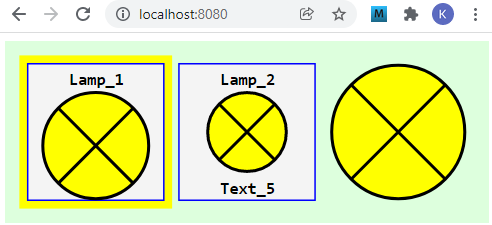
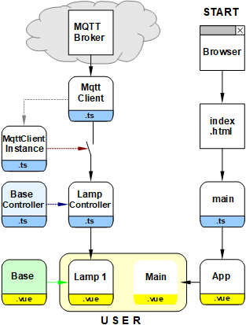

Letzte &Auml;nderung: 20.12.2021 <a name="up"></a>   
<table><tr><td></img></td><td>
<h1>Wie erstellt man ein Vue-MQTT-Lampensymbol?</h1>
<a href="../LIESMICH.md">==> Startseite</a> &nbsp; &nbsp; &nbsp; 
<a href="m4h520_Vue_ci_mqtt_lamp1_e.md">==> English version</a> &nbsp; &nbsp; &nbsp; 
</td></tr></table>
<a href="https://github.com/khartinger/mqtt4home/tree/main/source_Vue/vue20_ci_mqtt_lamp1">==> Code @ GitHub</a><hr>

Dieses Projekt "Vue: MQTT Lamp1" beschreibt, wie man ein Vue Lampen-Symbol erstellt, das MQTT-Nachrichten senden und empfangen kann und das einfach in eigene Web-Seiten eingebunden werden kann.   
Es werden zuerst die [erforderlichen Hilfsmittel](#erforderliche-hilfsmittel) und danach der [Funktionstest](#funktionstest), die [Verwendung des Lampensymbols](#verwendung-des-lampensymbols) und das [Erstellen des Projektes](#wie-erstellt-man-dieses-projekt) beschrieben.   
Das folgende Bild zeigt verschiedene Darstellungen des Lampensymbols (Name + Rahmen, Name + Text5 + einfacher Rahmen, Symbol ohne Texte und Rahmen):   
   
_Bild 1: Verschiedene Varianten des Lampensymbols_   

# Erforderliche Hilfsmittel
* Hardware: PC oder Laptop mit Internetzugang, Browser
* Hardware: Raspberry Pi (oder PC), auf dem ein MQTT-Broker l&auml;uft (zB Mosquitto)
* Software: Visual Studio Code ("VSC"), das f&uuml;r Vue-Anwendungen bereits vorbereitet ist.   
   (Dh. es wurde bereits mindestens eine Vue-Anwendung in Visual Code erstellt.)   

# Funktionstest
## Voraussetzungen f&uuml;r den Test   
1. Das Raspberry Pi (RasPi) wurde entsprechend der [Anleitung (Bereich "Zentrale")](../../LIESMICH.md) installiert, d.h. auf dem RasPi mit der IP `10.1.1.1` l&auml;uft das Broker-Programm (Mosquitto)   
2. Die Vue-Anwendung ist in Visual Studio Code (VSC) geladen und der interne Server l&auml;uft (Eingabe im Terminal: `npm run serve`).   
3. Es besteht eine Netzwerk-/WLAN-Verbindung zwischen dem Rechner, auf dem VSC l&auml;uft, und dem RasPi.   
4. Auf dem PC oder Raspberry Pi ist ein Command-/Terminal-Fenster offen, das empfangene MQTT-Nachrichten anzeigt (Eingabe `mosquitto_sub -h 10.1.1.1 -t "#" -v`)   

Anmerkung: Hat das RasPi eine andere IP als 10.1.1.1, so muss die IP in der Datei `App.vue` angepasst werden (`const hostip = '...'`).   
## Test   
* Gibt man im Browser die Adresse `localhost:8080` ein, so erscheint _Bild 1_ im Brower.   
* Klickt man auf das Lampensymbol, wird eine MQTT-Nachricht `ci/lamp/1/set/lamp` mit der Payload `1` gesendet. Diese wird im Command-/Terminal-Fenster angezeigt.   
* ..ToDo..

# Verwendung des Lampensymbols
Die Parametrierung eines Lampensymbols erfolgt in drei Schritten:   
## Schritt 1: Definition des Lampensymbols
Jede Lampe muss im Lampencontroller (Datei `controller/CiLampController`) im Array `lamps` eingetragen werden:   
```   
  public lamps: Array<Lamp> = reactive(
    [
      {
        id: 'lamp1',
        name: 'Lamp_1',
        iLampState: -1,
        battery: '-',
        text5: 'Text_5',
        subTopic: 'ci/lamp/1/ret/lamp',
        pubTopic: 'ci/lamp/1/set/lamp',
        pubPayload: '-1'
      }
    ]
  );
```   
Mindestens angegeben werden m&uuml;ssen die Eigenschaften `id`, `subtopic`, `iLampState` und `battery`.   
Die Angabe von `name`,  `text5`, `pubTopic` und `pubPayload` ist optional.   
..ToDo: Erkl&auml;rungen..

## Schritt 2: Darstellung des Lampensymbols in einer .vue-Datei
Die Darstellung eines Lampensymbols erfolgt im `<template>`-Bereich einer Vue-Datei, zB   
`<CiLamp :x="160" :y="50" sid="lamp1" lines="2" border="0"></CiLamp>`   
Der Mittelpunkt des Symbols (`x`, `y`) sowie die ID der Lampe (`sid=`) m&uuml;ssen angegeben werden, wobei die ID mit der id im Lampencontroller &uuml;bereinstimmen muss.   
Die Angabe von `lines` und `border` ist optional. Entf&auml;llt diese Angabe, wird ein Symbol mit Kopfzeile (= `name`) und gelbem Rand gezeichnet.   

## Schritt 3: Einbinden des Lampensymbols in einer .vue-Datei
Um das Lampensymbol im `<template>`-Bereich verwenden zu k&ouml;nnen, sind zwei Befehle im `<script>`-Bereich erforderlich:   
*  Importieren der Lampenkodierung:   
  `import CiLamp from './CiLamp.vue'`   
* Aufz&auml;hlen bei den verwendeten Komponenten:   
  `components: {`   
  `  CiLamp`   
  `},`   

&nbsp;   

---   
# Wie erstellt man dieses Projekt?
## 1. Allgemeines
Das folgende Diagramm gibt einen &Uuml;berblick &uuml;ber die beteiligten Dateien:   

   
_Bild 2: &Uuml;bersicht &uuml;ber die beteiligten Dateien_   

Mit Hilfe des Diagrammes erkennt man einige wichtige Zusammenh&auml;nge:   
* Das Grafik-Element `CiLamp` besteht aus einem "Controller"- und "Grafik"-Teil (Erweiterung `.ts` bzw. `.vue`), welche von Basis-Komponenten abgeleitet werden.   
* Die Verbindung zum MQTT-Broker wird &uuml;ber die Dateien `MqttClient.ts` und `MqttClientInstance.ts` hergestellt, wobei alle Controller in der Datei `MqttClientInstance.ts` registriert werden m&uuml;ssen. Vergisst man dies, erh&auml;lt der Controller keine MQTT-Nachrichten ("Schalter offen").   

## 2. Anlegen des Vue-Projektes in VSC   
1. Visual Studio Code (VSC) starten.   
2. VSC: Terminal-Fenster &ouml;ffnen: Men&uuml; Terminal - New Terminal.   
3. VSC-Terminal: In den Ordner wechseln, unter dem das Vue-Projekt erzeugt werden soll:   
   `cd /g/github/mqtt4home/source_Vue`   
4. VSC-Terminal: Vue.js Applikation erzeugen:   
  `vue create vue20_ci_mqtt_lamp1`  
  Mit Cursortasten, Leertaste und &lt;Enter&gt; Folgendes ausw&auml;hlen:   
   `> Manually select features` &nbsp; &lt;Enter&gt;   
   `(*) Choose Vue version`   
   `(*) Babel`   
   `(*) TypeScript`   
   `( ) Router`   
   `(*) Linter / Formatter`   
   &lt;Enter&gt;   
   _`> 3.x`_ &nbsp; &lt;Enter&gt;      
   _`? Use class-style component syntax?`_ &nbsp; __`N`__ &lt;Enter&gt;   
   _`? Use Babel alongside TypeScript (required for modern mode, auto-detected polyfills, transpiling JSX)?`_ &nbsp; __`N`__ &lt;Enter&gt;   
   _`? Use history mode for router? (Requires proper server setup for index fallback in production)`_ &nbsp; __`N`__ &lt;Enter&gt;   
   _`? Pick a linter / formatter config:`_ &nbsp; __`ESLint + Standard config`__ &lt;Enter&gt;   
   _`? Pick additional lint features: `_ &nbsp; __`Lint on save`__ &lt;Enter&gt;   
   _`? Where do you prefer placing config for Babel, ESLint, etc.?`_  &nbsp; __`In dedicated config file`__ &lt;Enter&gt;   
   _`? Save this as a preset for future projects? (y/N)`_ &nbsp; __`N`__ &lt;Enter&gt;   
5. In den Projektordner wechseln: _VSC Men&uuml; Datei - Ordner &ouml;ffnen_..
   `/github/mqtt4home/source_Vue/vue20_ci_mqtt_lamp1` [Ordner ausw&auml;hlen]   
6. MQTT Bibliothek installieren:   
   VSC: Terminal-Fenster &ouml;ffnen: Men&uuml; Terminal - New Terminal.   
   `npm install mqtt --save`   
&nbsp;   

## 3. Erg&auml;nzen der Vue-Konfiguration   
Erstellen der Datei `vue.config.js`: auf das Plus neben `VUE20_CI_MQTT_LAMP1` klicken, Namen eingeben.   
_Inhalt der Datei_:   
```   
// ______vue.config.js__________________________________________
module.exports = {
  lintOnSave: false,
  publicPath: './',
  // publicPath: process.env.NODE_ENV === 'production' ? './vue_pubsub2/' : './',
  configureWebpack: {
    devtool: 'source-map'
  },
  chainWebpack: config => {
    config.performance
      .maxEntrypointSize(400000)
      .maxAssetSize(400000)
  }
}
```   
Mit `publicPath: './',` wird die relative Pfadangabe eingestellt und durch den `chainWebpack`-Eintrag werden Warnhinweise bez&uuml;glich der Dateigr&ouml;&szlig;e vermieden (indem man die maximale Dateigr&ouml;&szlig;en h&ouml;her setzt ;) )

## 4. Linter-Warnung "Unexpected any" bei "(value: any)" abstellen    
  In der Datei `.eslintrc.js` unter "`rules: {`" erg&auml;nzen:   
  ```   
  '@typescript-eslint/no-explicit-any': 'off',
  '@typescript-eslint/explicit-module-boundary-types': 'off',
  ```   

## 5. Datei `App.vue` anpassen   
Die Datei `src/App.vue` ist f&uuml;r folgende Punkte zust&auml;ndig:   
  * Anzeige der Komponente `CiMain`.
  * Definition von einheitlichen Styles f&uuml;r alle Seiten.   
    Daher: Alle Styles erg&auml;nzen, die mit einem Punkt beginnen.   

_Inhalt der Datei_:   
```   
<!-- App.vue -->
<template>
  <CiMain></CiMain>
</template>

<script lang="ts">
import { defineComponent } from 'vue'
import CiMain from '@/components/CiMain.vue'

export default defineComponent({
  name: 'App',
  components: {
    CiMain
  }
})
</script>

<style>
#app {
  font-family: Avenir, Helvetica, Arial, sans-serif;
  text-align: left;
  color: black;
  margin-top: 0px;
}

  .styleM11  { font: bold 11px monospace; fill: black; white-space: pre; }
  .cursor    { cursor: pointer; }
  .ciBackground {fill: #ddFFdd; }
  .ciOut     { fill: yellow; stroke: yellow; stroke-width: 1; }
  .ciInColor { fill: #F4F4F4; }
  .ciIn      { fill: #F4F4F4; stroke:blue; stroke-width: 1; }
  .ciLine    { stroke: blue; stroke-width: 1; }
  .ciRect    { fill: none; stroke: blue; stroke-width: 1; }
  .ciFillIt  { stroke: blue; stroke-width: 1; }
  .ciClick   { fill-opacity: 0.0; stroke-width: 1; }
  .ciBorder  { fill-opacity: 0.0; stroke: blue; stroke-width: 1; }
</style>
```   

## 6. Nicht ben&ouml;tigte Dateien und Verzeichnisse l&ouml;schen   
  * Datei `components/HelloWorld.vue` l&ouml;schen   
  * Verzeichnis `assets` l&ouml;schen   

&nbsp;

<a name="mqtt-funktionalit&auml;t-einbauen"></a>
# MQTT-Funktionalit&auml;t einbauen
## Einbinden der erforderlichen Dateien
* Erstellen des Verzeichnisses "controller"   
  Mit der rechten Maustaste auf das Verzeichnis `src` klicken, "Neuer Ordner" w&auml;hlen und den Namen `controller` eingeben.   
* Erstellen des Verzeichnisses "services"   
  Mit der rechten Maustaste auf das Verzeichnis `src` klicken, "Neuer Ordner" w&auml;hlen und den Namen `services` eingeben.   
* Erstellen der Datei `CiMqttClient.ts`   
  * Mit der rechten Maustaste auf das Verzeichnis `services` klicken, "Neue Datei" w&auml;hlen und den Namen `CiMqttClient.ts` eingeben.   
  * Inhalt der Datei zB von [GitHub holen](https://github.com/khartinger/mqtt4home/blob/main/source_Vue/vue10_ci_mqtt_mini/src/services/CiMqttClient.ts), hineinkopieren und Datei speichern.   
* Erstellen der Datei `CiBaseController.ts`   
  * Mit der rechten Maustaste auf das Verzeichnis `controller` klicken, "Neue Datei" w&auml;hlen und den Namen `CiBaseController.ts` eingeben.   
  * Inhalt der Datei zB von [GitHub holen](https://github.com/khartinger/mqtt4home/blob/main/source_Vue/vue10_ci_mqtt_mini/src/controller/CiBaseController.ts), hineinkopieren und Datei speichern.   
* Erstellen der Datei `CiBase.vue`   
  * Mit der rechten Maustaste auf das Verzeichnis `components` klicken, "Neue Datei" w&auml;hlen und den Namen `CiBase.vue` eingeben.   
  * Inhalt der Datei zB von [GitHub holen](https://github.com/khartinger/mqtt4home/blob/main/source_Vue/vue10_ci_mqtt_mini/src/components/CiBase.vue), hineinkopieren und Datei speichern.   

## Erstellen der Datei "services/CiMqttClientInstance"
* Mit der rechten Maustaste auf das Verzeichnis `services` klicken, "Neue Datei" w&auml;hlen und den Namen `CiMqttClientInstance.ts` eingeben.   
* Festlegen, dass beim Start der App eine Verbindung zum Broker hergestellt werden soll (Konstruktor-Wert `true`).   
* Da lediglich die Komponente zum Empfangen (und Speichern) Zugriff auf die MQTT-Nachrichten ben&ouml;tigt, braucht auch nur diese Komponente registriert werden.   

_Ergebnis:_   
```   
// ______mqttClientInstance.ts__________________________________
import { CiMqttClient } from './CiMqttClient'
import { ciLampController } from '@/controller/CiLampController'

export const ciMqttClientInstance = new CiMqttClient(true)
ciMqttClientInstance.registerController(ciLampController)

```   

# CiBase-Element
Das CiBase-Element ist das Basiselement für alle Steuer-/Anzeige-Symbole (kurz "CI-Symbole") und besteht aus einem Anzeigeteil `CiBase.vue` und einem Steuerteil `CiBaseController.ts`.

## components/CiBase.vue
Die Basis-Ansicht `CiBase.vue` ist für folgende Aufgabe zuständig:   
1. Zeichnen eines Rahmens um das Symbol oder nicht (`border=0`)   
2. Bereitstellung von Geometriedaten zum Zeichnen von Symbolen. Diese werden mit Hilfe der Klasse `Geo` zur Verfügung gestellt.    


..ToDo..


## controller/CiBaseController.ts
Die Datei `CiBaseController.ts` muss im Normalfall nicht ver&auml;ndert werden. Sie definiert im Interface `IBase` einige Eigenschaften, die alle (abgeleiteten) `CiXxxController` haben sollten. Die wichtigste Eigenschaft ist dabei die `id`, die die Verbindung zwischen einer Darstellung und den Daten im Controller darstellt.   

In der (abstrakten) Klasse `CiBaseController` werden dann die Methoden `registerClient`, `publish` und `onMessage(message: Message)` definiert.   

_Codierung_:   
```   
// ______CiBaseController.ts____________________________________
import { Message, CiMqttClient } from '@/services/CiMqttClient'
import type { QoS } from 'mqtt'

export interface IBase {
  id: string;
  name?: string;
  border?: number
  subTopic?: string;
  pubTopic?: string;
  pubPayload?: string;
}

export abstract class CiBaseController {
  protected client: CiMqttClient | null = null;

  public registerClient (mqttClient: CiMqttClient): void {
    this.client = mqttClient
  }

  protected async publish (topic: string, payload: string, retain: boolean, qos: QoS): Promise<void> {
    return this.client?.publish(topic, payload, retain, qos)
  }

  public abstract onMessage(message: Message): void;
}

```   


# Lampensymbol

# Darstellung des Lampensymols in Main.vue


[Zum Seitenanfang](#up)
