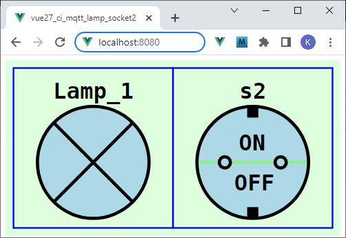
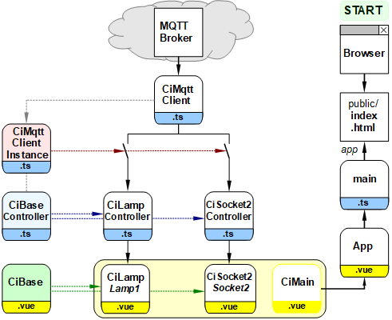

Last modified: 2022-09-25 <a name="up"></a>   
<table><tr><td></td><td>
<h1>Vue: Switching a lamp with socket2 via MQTT</h1>
<a href="../README.md">==> Home page</a> &nbsp; &nbsp; &nbsp; 
<a href="./m4h527_Vue_ci_mqtt_lamp_socket2.md">==> German version</a> &nbsp; &nbsp; &nbsp; 
</td></tr></table>
<a href="https://github.com/khartinger/mqtt4home/tree/main/source_Vue/vue27_ci_mqtt_lamp_socket2">==> Code @ GitHub</a><hr>

# Target
Create a Vue application that displays the state of a lamp and can be turned on and off via a socket icon:   

   
_Fig. 1: Browser representation of the lamp and the socket_.   

The _Fig. 1_ shows some possibilities of the program:   
* The entire GUI is an svg graphic.
* Control or display symbols are square and of the same size.
* Symbols can be displayed with or without borders.
* Symbols can be displayed with or without text.
* If you press the lamp, its state is toggled and the following MQTT messages are sent out:   
   `ci/lamp/1/ret/lamp -1`   
   `return_lamp_state... -1`   
   Here the payload -1 means the state "unknown", 0 "off" and 1 "on".   
* A yellow light means the light is on, gray means off, and blue means the state is not known.
* By pressing the socket symbol (right), the lamp can be switched on or off. The following message is sent for this purpose:   
   `ci/lamp/1/set/lamp 1`.   
   The lamp then answers with   
   `ci/lamp/1/ret/lamp 1`   
   `return_lamp_state... 1`   

# Components of the program
To make the program clear and easy to expand, it is composed of numerous individual parts.   
The following picture gives an overview of the involved files:   
   
_Fig. 2: Files of the project MQTT lamps_   

## Meaning of the individual files   
The right branch with (browser -->) `index.html` --> `main.ts` --> `App.vue` is created automatically and has to be adjusted a bit.   
   * The file `main.ts` creates the app element which is displayed in `index.html`.   
   * `App.vue` represents `<CiMain>` and contains css elements that can be used throughout the project.   
---   
The left part of Fig. 2 represents the actual program:   
* The `CiMqttClient.ts` file contains the `CiMqttClient` class, which contains all the methods for communicating with the MQTT broker.   
* The file `CiMqttClientInstance.ts` creates the object `ciMqttClientInstance`, where every controller that wants to receive MQTT messages has to register.   
Symbolically, this is represented by the switches in _Fig. 2_: No registration means no sending of MQTT messages.   
* For each symbol type (here CiLamp and CiSocket2) there is a separate controller derived from "`CiBaseController.ts`".   
* Each controller contains a list (more precisely "`Array`") of its symbols as well as the methods for receiving and sending MQTT messages (`onMessage` and `publishCi`).
* The graphical design of each symbol is done in a vue file that embeds the base vue `CiBase.vue` (`CiLamp.vue` and `CiSocket2.vue`).   
* All displayed symbol vues are positioned in `CiMain.vue`.   

# Required tools
* Hardware: PC or laptop with internet access, browser.
* Hardware: Raspberry Pi (or PC) running an MQTT broker (e.g. Mosquitto)
* Software: Visual Studio Code ("VSC"), which is already prepared for Vue applications.   
   (I.e. (at least) one Vue application has already been created in Visual Code).   
   incl. node.js, npm

# Preparation of the Vue project in VSC (short version)   
1. start Visual Studio Code (VSC).   
2. VSC: Open Terminal window: Menu Terminal - New Terminal.   
3. VSC terminal: Change to the folder under which the Vue project is to be created:   
   `cd /github/mqtt4home/source_Vue`   
4. VSC-Terminal: Create Vue.js application: `vue create vue27_ci_mqtt_lamp_socket2`  
   Use cursor keys, space bar and &lt;Enter&gt; to select the following:   
   `> Manually select features` &nbsp; &lt;Enter&gt;   
   `(*) Choose Vue version`   
   `(*) Babel`   
   `(*) TypeScript`   
   `( ) Router`   
   `(*) Linter / Formatter`   
   &lt;Enter&gt;   
   _`> 3.x`_ &nbsp; &lt;Enter&gt;      
   _`? Use class-style component syntax?`_ &nbsp; __`N`__ &lt;Enter&gt;   
   _`? Use Babel alongside TypeScript (required for modern mode, auto-detected polyfills, transpiling JSX)?`_ &nbsp; __`N`__ &lt;Enter&gt;   
   _`? Use history mode for router? (Requires proper server setup for index fallback in production)`_ &nbsp; __`N`__ &lt;Enter&gt;   
   _`? Pick a linter / formatter config:`_ &nbsp; __`ESLint + Standard config`__ &lt;Enter&gt;   
   _`? Pick additional lint features: `_ &nbsp; __`Lint on save`__ &lt;Enter&gt;   
   _`? Where do you prefer placing config for Babel, ESLint, etc.?`_ &nbsp; __`In dedicated config file`__ &lt;Enter&gt;   
   _`? Save this as a preset for future projects? (y/N)`_ &nbsp; __`N`__ &lt;Enter&gt;   
5. switch to the project folder: _VSC Menu File - Open Folder_..
6. install MQTT library:   
   VSC: Open Terminal window: Menu Terminal - New Terminal.   
   `npm install mqtt --save`   

## 1. General adjustments in the project
1. The content of the automatically created file `main.ts` should be replaced by the following lines:   
```   
// ______main.ts________________________________________________
import { createApp, h } from 'vue'.
import App from './App.vue'

const app = createApp({
  render: () => h(App)
})

app.mount('#app')

```   

2. In the file `App.vue` the component `ciMain` is called and different styles are defined.   
The content for this file can be found at [https://github.com/khartinger/mqtt4home/blob/main/source_Vue/vue27_ci_mqtt_lamp_socket2/src/App.vue](https://github.com/khartinger/mqtt4home/blob/main/source_Vue/vue27_ci_mqtt_lamp_socket2/src/App.vue)   

3. Creating the Vue config file   
   Menu 'Display - Explorer'. Move the mouse to the line `vue27_ci_mqtt_lamp_socket2`, click the icon "+ New file" and enter `vue.config.js`   
   Contents of the file:   
   ```   
   module.exports = {
     lintOnSave: false,
     publicPath: './',
     configureWebpack: {
       devtool: 'source-map'
     }
   }

   ```   
4. Addition in the file `.eslintrc.js`   
In the section `rules: {` insert:
```   
    '@typescript-eslint/no-explicit-any': 'off',
    '@typescript-eslint/explicit-module-boundary-types': 'off',
    '@typescript-eslint/no-multi-spaces': 'off',
```   

5. Furthermore the automatically created files `components/HelloWord.vue` and `assets/logo.png` can be deleted.

<a name="mqtt-function"></a>

## Include MQTT functionality
## Include the required files
* Create the directory "controller"   
  Right click on the `src` directory, select "New folder" and enter the name `controller`   
* Creating the "services" directory   
  Right click on the `src` directory, select "New folder" and enter the name `services`   
* Create the `CiMqttClient.ts` file   
  * Right click on the `services` directory, select "New file" and enter the name `CiMqttClient.ts`   
  * Get the content of the file e.g. from [GitHub](https://github.com/khartinger/mqtt4home/blob/main/source_Vue/vue10_ci_mqtt_mini/src/services/CiMqttClient.ts), copy it and save the file.   
* Create the file `CiBaseController.ts`.   
  * Right click on the directory `controller`, select "New file" and enter the name `CiBaseController.ts`   
  * Get content of file e.g. from [GitHub](https://github.com/khartinger/mqtt4home/blob/main/source_Vue/vue10_ci_mqtt_mini/src/controller/CiBaseController.ts), copy into it and save file.   
* Create the file `CiBase.vue`.   
  * Right click on the directory `components`, select "New file" and enter the name `CiBase.vue`   
  * Get content of file e.g. from [GitHub](https://github.com/khartinger/mqtt4home/blob/main/source_Vue/vue10_ci_mqtt_mini/src/components/CiBase.vue), copy into it and save file.   

## Create the file "services/CiMqttClientInstance".
* Right click on the `services` directory, select "New File" and enter the name `CiMqttClientInstance.ts`   
* Specify that a connection to the broker should be established when the app is started (constructor value `true`).   
* Since only the component for receiving (and storing) needs access to the MQTT messages, only this component needs to be registered.   

_Result:_   
```   
// ______mqttClientInstance.ts__________________________________
import { CiMqttClient } from './CiMqttClient'.
import { ciLampController } from '.@/controller/CiLampController'.
import { ciSocket2Controller } from '@/controller/CiSocket2Controller'

export const ciMqttClientInstance = new CiMqttClient(true)
ciMqttClientInstance.registerController(ciLampController)
ciMqttClientInstance.registerController(ciSocket2Controller)
```   

# The CiBase element
The CiBase element is the base element for all control/indicate symbols (in short "CI symbols") and consists of a display part `CiBase.vue` and a control part `CiBaseController.ts`.

## components/CiBase.vue
The base view `CiBase.vue` is responsible for displaying symbols:   
1. drawing a border around the symbol or not (`border = 0 | 1 | 2 | 3`)   
   0 ... No border   
   1 ... outer blue frame   
   2 ... inner blue frame   
   3 ... inner blue frame with yellow outer border   
2. providing geometry data for drawing a symbol. These are provided by the class `Geo`.    

   
_Fig. 3: Geometry data of a CI symbol_   

_Coding_: [https://github.com/khartinger/mqtt4home/blob/main/source_Vue/vue27_ci_mqtt_lamp_socket2/src/components/CiBase.vue](https://github.com/khartinger/mqtt4home/blob/main/source_Vue/vue27_ci_mqtt_lamp_socket2/src/components/CiBase.vue)   

## controller/CiBaseController.ts
The file `CiBaseController.ts` normally does not need to be modified. It defines some properties in the `IBase` interface that all (derived) `CiXxxControllers` should have. The most important property is the `id`, which represents the connection between a representation and the data in the controller.   

In the (abstract) class `CiBaseController` the methods `registerClient`, `publish` and `onMessage(message: Message)` are then defined.   

_Coding_: [https://github.com/khartinger/mqtt4home/blob/main/source_Vue/vue27_ci_mqtt_lamp_socket2/src/controller/CiBaseController.ts](https://github.com/khartinger/mqtt4home/blob/main/source_Vue/vue27_ci_mqtt_lamp_socket2/src/controller/CiBaseController.ts)   

# Lamps

## Step 1: Definition of the lamp symbol properties
Each lamp must be entered in the lamp controller (file `controller/CiLampController`) in the array `lamps`:   

```   
public lamps: Array<Lamp> = reactive(
    [
      {
        id: 'lamp1',
        name: 'Lamp_1',
        iLampState: -1,
        text5: 'Text_5',
        // subTopic: 'ci/lamp/1/ret/lamp',
        subTopic: 'ci/lamp/1/set/lamp',
        pubTopic: 'ci/lamp/1/ret/lamp return_lamp_state...',
        pubPayload: '1'
      }
    ]
  );
```   

## Step 2: Representation of the lamp symbol by the Vue file `components/CiMain.vue`
The lamp symbol is rendered in the `<template>` section of the Vue file:   
`<CiLamp :x="50" :y="50" sid="lamp1" :border="0"></CiLamp>`   

Furthermore, the following two lines are required in the `<script>` section:   
`import CiLamp from './CiLamp.vue'`   
Im Bereich "defineComponent -  components: {":   
`    CiLamp,`   

## Step 3: Registering the lamp controller to receive MQTT messages
In the file `services/CiMqttClientInstance.ts` add the following two lines:   
`import { ciLampController } from '@/controller/CiLampController'`   
`ciMqttClientInstance.registerController(ciLampController)`   

# Socket symbol (Socket2)
## Step 1: Definition of socket symbol properties
Each socket symbol must be defined in the socket controller (file `controller/CiSocket2Controller.ts`):   

```   
  public sockets: Array<Socket> = reactive(
    [
      {
        type: 'test', // delock11826, e1603=IKEA
        id: 'socket2',
        name: 's2',
        iSocketState: -9, // 0x9999FF,
        battery: '-',
        text5: 'text5',
        subTopic: 'ci/lamp/1/ret/lamp',
        pubTopic: 'ci/lamp/1/set/lamp',
        pubPayload: '0',
        pubPayloadOn: '1'
      }
    ]
  );

```   

## Step 2: Representation of the socket symbol by the Vue file `components/CiMain.vue`.
The representation of the socket symbol is done in the `<template>` section of the Vue file:   
`<CiSocket2 :x="150" :y="50" sid="socket2" :border="0"></CiSocket2>`   

Furthermore, the following two lines are required in the `<script>` section:   
`import CiButton from './CiSocket2.vue'`   
In the `defineComponent - components: {` section:   
` CiSocket2`   

## Step 3: Registering the controller to receive MQTT messages.
In the file `services/CiMqttClientInstance.ts` add the following two lines:   
`import { ciSocket2Controller } from '@/controller/CiSocket2Controller'`   
`ciMqttClientInstance.registerController(ciSocket2Controller)`   

[Top of page](#up)
