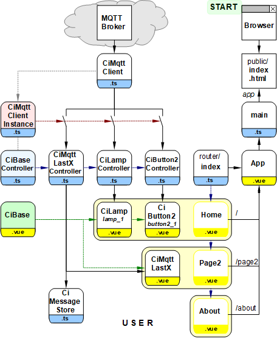

Letzte &Auml;nderung: 26.12.2021 <a name="up"></a>   
<table><tr><td></img></td><td>
<h1>&Uuml;bersicht &uuml;ber alle Ci-Symbole</h1>
<a href="../LIESMICH.md">==> Startseite</a> &nbsp; &nbsp; &nbsp; 
<a href="./m4h550_Vue_ci_mqtt_all_e.md">==> English version</a> &nbsp; &nbsp; &nbsp; 
</td></tr></table>
<a href="https://github.com/khartinger/mqtt4home/tree/main/source_Vue/vue50_ci_mqtt_all">==> Code @ GitHub</a><hr>

## Ziel
Dieses Vue-Projekt zeigt alle verfügbaren Ci-Symbole:   

   
_Bild 1: CI-Symbole_   


---   
---   

## Erforderliche Hilfsmittel
* Hardware: PC oder Laptop mit Internetzugang, Browser
* Hardware: Raspberry Pi (oder PC), auf dem ein MQTT-Broker l&auml;uft (zB Mosquitto)
* Software: Visual Studio Code ("VSC"), das f&uuml;r Vue-Anwendungen bereits vorbereitet ist.   
   (Dh. es wurde bereits (mindestens) eine Vue-Anwendung in Visual Code erstellt.)   

# Erstellen des Projektes
## 1. &Uuml;bersicht &uuml;ber die beteiligten Dateien
   
_Bild 4: &Uuml;bersicht &uuml;ber die beteiligten Dateien_   

## 2. Vorbereitung des Vue-Projektes in VSC (Kurzfassung)   
1. Visual Studio Code (VSC) starten.   
2. VSC: Terminal-Fenster &ouml;ffnen: Men&uuml; Terminal - New Terminal.   
3. VSC-Terminal: In den Ordner wechseln, unter dem das Vue-Projekt erzeugt werden soll:   
   `cd /g/github/mqtt4home/source_Vue`   
4. VSC-Terminal: Vue.js Applikation erzeugen: `vue create vue35_ci_mqtt_multipage1`  
   Mit Cursortasten, Leertaste und &lt;Enter&gt; Folgendes ausw&auml;hlen:   
   `> Manually select features` &nbsp; &lt;Enter&gt;   
   `(*) Choose Vue version`   
   `(*) Babel`   
   `(*) TypeScript`   
   `(*) Router`   
   `(*) Linter / Formatter`   
   &lt;Enter&gt;   
   _`> 3.x`_ &nbsp; &lt;Enter&gt;      
   _`? Use class-style component syntax?`_ &nbsp; __`N`__ &lt;Enter&gt;   
   _`? Use Babel alongside TypeScript (required for modern mode, auto-detected polyfills, transpiling JSX)?`_ &nbsp; __`N`__ &lt;Enter&gt;   
   _`? Use history mode for router? (Requires proper server setup for index fallback in production)`_ &nbsp; __`N`__ &lt;Enter&gt;   
   _`? Pick a linter / formatter config:`_ &nbsp; __`ESLint + Standard config`__ &lt;Enter&gt;   
   _`? Pick additional lint features: `_ &nbsp; __`Lint on save`__ &lt;Enter&gt;   
   _`? Where do you prefer placing config for Babel, ESLint, etc.?`_  &nbsp; __`In dedicated config file`__ &lt;Enter&gt;   
   _`? Save this as a preset for future projects? (y/N)`_ &nbsp; __`N`__ &lt;Enter&gt;   
5. In den Projektordner wechseln: _VSC Men&uuml; Datei - Ordner &ouml;ffnen_..
   `/github/mqtt4home/source_Vue/vue35_ci_mqtt_multipage1` [Ordner ausw&auml;hlen]   
6. MQTT Bibliothek installieren:   
   VSC: Terminal-Fenster &ouml;ffnen: Men&uuml; Terminal - New Terminal.   
   `npm install mqtt --save`   
&nbsp;   

## 3. Anpassen der automatisch erstellten Dateien
### 3.1 Erg&auml;nzen der Vue-Konfiguration   
Erstellen der Datei `vue.config.js`: auf das Plus neben `VUE35_CI_MQTT_MULTIPAGE1` klicken, Namen eingeben.   

_Inhalt der Datei_:   

```   
// ______vue.config.js__________________________________________
module.exports = {
  lintOnSave: false,
  publicPath: './',
  // publicPath: process.env.NODE_ENV === 'production' ? './vue_pubsub2/' : './',
  configureWebpack: {
    devtool: 'source-map'
  },
  chainWebpack: config => {
    config.performance
      .maxEntrypointSize(400000)
      .maxAssetSize(400000)
  }
}

```   

Mit `publicPath: './',` wird die relative Pfadangabe eingestellt und durch den `chainWebpack`-Eintrag werden Warnhinweise bez&uuml;glich der Dateigr&ouml;&szlig;e vermieden (indem man die maximale Dateigr&ouml;&szlig;en h&ouml;her setzt ;) )

### 3.2 Linter-Warnung "Unexpected any" bei "(value: any)" abstellen    
  In der Datei `.eslintrc.js` unter "`rules: {`" erg&auml;nzen:   
  ```   
  '@typescript-eslint/no-explicit-any': 'off',
  '@typescript-eslint/explicit-module-boundary-types': 'off',
  ```   

### 3.3 Datei f&uuml;r die Seite "Page2" erstellen   
Mit der linken Maustaste auf `src/views/About.vue` klicken, Datei mit &lt;strg&gt; c und &lt;strg&gt; v kopieren und die Kopie auf `Page2.vue` umbenennen (zB mit dem Hilfsmen&uuml; mit der rechten Maustaste).   

### 3.4 Anpassen der "Routen" in der automatisch erstellten Datei `router/index.ts`:   

_&Auml;ndern des Inhalts auf:_

```   
// ___________router/index.ts___________________________________
import { createRouter, createWebHashHistory, RouteRecordRaw } from 'vue-router'
import Home from '../views/Home.vue'
import Page2 from '../views/Page2.vue'

const routes: Array<RouteRecordRaw> = [
  {
    path: '/',
    name: 'Home',
    component: Home,
    meta: {
      title: 'vue35_ci_mqtt_multipage1-Home'
    }
  },
  {
    path: '/page2',
    name: 'Page2',
    component: Page2,
    meta: {
      title: 'vue35_ci_mqtt_multipage1-Page2'
    }
  },
  {
    path: '/about',
    name: 'About',
    // route level code-splitting
    // this generates a separate chunk (about.[hash].js) for this route
    // which is lazy-loaded when the route is visited.
    component: () => import(/* webpackChunkName: "about" */ '../views/About.vue'),
    meta: {
      title: 'vue35_ci_mqtt_multipage1-About'
    }
  }
]

const router = createRouter({
  history: createWebHashHistory(),
  routes
})

router.beforeEach((to, from, next) => {
  document.title = <string> to.meta.title
  next()
})

export default router

```   

### 3.5 Datei "App.vue" anpassen   
Die Datei `src/App.vue` ist f&uuml;r folgende Punkte zust&auml;ndig:   
  * Darstellung einer Linkzeile mit Links auf die einzelnen Seiten.   
    Daher: Die Zeile `<router-link to="/page2">Page2</router-link> |` erg&auml;nzen.   
  * Herstellung der Verbindung zum Broker.   
    Dies sollte nicht in der Seite "Home" erfolgen, da sonst bei jedem Laden der Seite die Verbindung neu hergestellt wird.   
  * Der Zustand der Verbindung wird in der Linkzeile angezeigt.   
  * Definition von einheitlichen Styles f&uuml;r alle Seiten.   
    Daher: Die Styles erg&auml;nzen, die mit einem Punkt beginnen.   

_Inhalt der Datei_:   

```   
<!--App.vue-->
<template>
  <div id="nav">
    <router-link to="/">Home</router-link> |
    <router-link to="/page2">Page2</router-link> |
    <router-link to="/about">About</router-link>
    &nbsp; &nbsp; &nbsp;
    <span v-if="isConnected">
      <b><font color="lightgreen">Connected to {{ getConnectUrl }}</font></b>
    </span>
    <span v-if="!isConnected && !isConnecting">
      <b><font color="red"> Not connected! &nbsp; </font></b>
      <button @click="reconnect()">Reconnect</button>
    </span>
    <span v-if=isConnecting>
      <b><font color="red"> Is connecting... &nbsp; </font></b>
      &nbsp; <button @click="cancel()">Cancel</button>
    </span>
  <router-view/>
</div>
</template>

<script lang="ts">
import { defineComponent } from 'vue'
import { ciMqttClientInstance } from '@/services/CiMqttClientInstance'

export default defineComponent({
  name: 'Home',
  components: {
  },
  computed: {
    isConnected: function (): boolean {
      return ciMqttClientInstance.mqttState.connected
    },
    isConnecting: function (): boolean {
      if (ciMqttClientInstance.mqttState.iConnMqttState === 2) return true
      return false
    },
    isSubscribed: function (): boolean {
      return ciMqttClientInstance.mqttSubscription.subscribed
    },
    getMqttState: function (): string {
      return ciMqttClientInstance.sConnMqttState()
    },
    getConnectUrl: function (): string {
      return ciMqttClientInstance.connectUrl()
    }
  },
  methods: {
    reconnect: async function (): Promise<void> {
      ciMqttClientInstance.reconnectBroker()
    },
    end: async function (): Promise<void> {
      ciMqttClientInstance.disconnect()
    },
    cancel: async function (): Promise<void> {
      ciMqttClientInstance.disconnect()
    }
  }
})

</script>

<style>
#app {
  font-family: Avenir, Helvetica, Arial, sans-serif;
  -webkit-font-smoothing: antialiased;
  -moz-osx-font-smoothing: grayscale;
  text-align: center;
  color: #2c3e50;
}

#nav {
  padding: 3px;
}

#nav a {
  font-weight: bold;
  color: #2c3e50;
}

#nav a.router-link-exact-active {
  color: #42b983;
}

  .ciFont1   { font-size: 11px; font-weight: bold; font-family: monospace; fill: black; white-space: pre; }
  .fontOK    { font-weight: bold; fill: lightgreen; }
  .fontNOK   { font-weight: bold; fill: red; }
  .cursor    { cursor: pointer; }
  .ciBackground {fill: #ddFFdd; }
  .ciOut     { fill: yellow; stroke: yellow; stroke-width: 1; }
  .ciInColor { fill: #F4F4F4; }
  .ciIn      { fill: #F4F4F4; stroke:blue; stroke-width: 1; }
  .ciLine    { stroke: blue; stroke-width: 1; }
  .ciRect    { fill: none; stroke: blue; stroke-width: 1; }
  .ciFillIt  { stroke: blue; stroke-width: 1; }
  .ciClick   { fill-opacity: 0.0; stroke-width: 1; }
  .ciBorder  { fill-opacity: 0.0; stroke: blue; stroke-width: 1; }
</style>
```   

### 3.6 Nicht ben&ouml;tigte Dateien und Verzeichnisse l&ouml;schen   
  * Datei `components/HelloWorld.vue` l&ouml;schen   
  * Verzeichnis `assets` l&ouml;schen   

## 4. MQTT Client erg&auml;nzen
## 4.1 Einbinden der erforderlichen Dateien
* Erstellen des Verzeichnisses "controller"   
  Mit der rechten Maustaste auf das Verzeichnis `src` klicken, "Neuer Ordner" w&auml;hlen und den Namen `controller` eingeben.   

* Erstellen des Verzeichnisses "services"   
  Mit der rechten Maustaste auf das Verzeichnis `src` klicken, "Neuer Ordner" w&auml;hlen und den Namen `services` eingeben.   

* Kopieren der Dateien [`CiMqttClient.ts`](https://github.com/khartinger/mqtt4home/blob/main/source_Vue/vue35_ci_mqtt_multipage1/src/services/CiMqttClient.ts) und [`CiMqttClientInstance.ts`](https://github.com/khartinger/mqtt4home/blob/main/source_Vue/vue35_ci_mqtt_multipage1/src/services/CiMqttClientInstance.ts) in das Verzeichnis `src/services`.   

* Kopieren der Datei [`CiBaseController.ts`](https://github.com/khartinger/mqtt4home/blob/main/source_Vue/vue35_ci_mqtt_multipage1/src/controller/CiBaseController.ts) in das Verzeichnis `src/controller`.   

* Kopieren der Datei [`CiBase.vue`](https://github.com/khartinger/mqtt4home/blob/main/source_Vue/vue35_ci_mqtt_multipage1/src/components/CiBase.vue) in das Verzeichnis `src/components`.   

## 4.2 Anpassen der Datei CiMqttClientInstance
* Festlegen, dass beim Start der App mit den Vorgabewerten die Verbindung zum Broker hergestellt und das Topic abonniert werden soll (Konstruktor-Wert `true`).   

* Eintragen aller Controller, die Mqtt-Nachrichten senden oder empfangen sollen.   

_Ergebnis:_   

```  
// ______mqttClientInstance.ts__________________________________
import { CiMqttClient } from './CiMqttClient'
import { ciLampController } from '@/controller/CiLampController'
import { ciButton2Controller } from '@/controller/CiButton2Controller'
import { ciMqttLastXController } from '@/controller/CiMqttLastXController'

export const ciMqttClientInstance = new CiMqttClient(true)
ciMqttClientInstance.registerController(ciLampController)
ciMqttClientInstance.registerController(ciButton2Controller)
ciMqttClientInstance.registerController(ciMqttLastXController)

```   

# 5. Home-Seite erstellen
## Vorbereitung
Die Startseite ("Home") enth&auml;lt die beiden Steuerungs-/Anzeige-Elemente (CI-Elemente) "CiLamp" und "CiButton2", die jeweils aus einem Controller (`.ts`) und der Anzeige (`.vue`) bestehen.   

Die Controller m&uuml;ssen ins Verzeichnis `/src/controller` kopiert werden:   
* [`controller/CiLampController.ts`](https://github.com/khartinger/mqtt4home/blob/main/source_Vue/vue35_ci_mqtt_multipage1/src/controller/CiLampController.ts): Definition der Lampen-Eigenschaften, Realisierung der Methoden `onMessage` und `publish` (`publishCi`) sowie Erstellen eines Objekts `ciLampController`.   
* [`controller/CiButton2Controller.ts`](https://github.com/khartinger/mqtt4home/blob/main/source_Vue/vue35_ci_mqtt_multipage1/src/controller/CiButton2Controller.ts): Definition der Schalter-Eigenschaften, Realisierung der Methoden `onMessage` und `publish` (`publishCi`) sowie Erstellen eines Objekts `ciButton2Controller`.   

Die Anzeige-Dateien m&uuml;ssen ins Verzeichnis `/src/components` kopiert werden:   
* [`components/CiLamp.vue`](https://github.com/khartinger/mqtt4home/blob/main/source_Vue/vue35_ci_mqtt_multipage1/src/components/CiLamp.vue): Darstellung des Lampensymbols und Realisierung der Funktion `onClk`, die beim Klicken auf das Symbol ausgef&uuml;hrt wird.   
* [`components/CiButton2.vue`](https://github.com/khartinger/mqtt4home/blob/main/source_Vue/vue35_ci_mqtt_multipage1/src/components/CiButton2.vue): Darstellung des Schaltersymbols und Realisierung der Funktionen `onClkON` und `onClkOff`, die beim Klicken auf die Bereiche "ON" und "OFF" des Symbols ausgef&uuml;hrt werden.   

## Home-Seite codieren
Die Elemente "CiLamp" und "CiButton2" werden auf folgende Weise in die Seite `src/views/Home.vue` eingebaut:   

```   
<!--src/views/Home.vue-->
<template>
    <svg viewBox="0 0 230 120" width="100%">
    <rect class="ciBackground" x="0" y="0" width="230" height="120" />
    <CiLamp    :x="60" :y="60" sid="lamp_1" :border="0"></CiLamp>
    <CiButton2 :x="170" :y="60" sid="button2_1" lines="0" :border="0"></CiButton2>
    </svg>
</template>

<script lang="ts">
// @ is an alias to /src
import { defineComponent } from 'vue'
import CiLamp from '@/components/CiLamp.vue'
import CiButton2 from '@/components/CiButton2.vue'

export default defineComponent({
  name: 'Home',
  components: {
    CiLamp,
    CiButton2
  }
})
</script>
```   

* Zuerst wird eine svg-viewbox erzeugt, die den Hintergrund der Seite darstellt. Die Gr&ouml;&szlig;e ("0 0 230 120") ist dabei so gew&auml;hlt, dass die beiden Elemente genau Platz haben.   
* Die Lampe ben&ouml;tigt als Parameter den Mittelpunkt x und y und die ID. Mit `:border="0"` wird das Zeichnen eines Randes verhindert. Da die Anzahl der Zeilen (`lines=`) nicht angegeben ist, wird die Vorgabe `lines="1"` verwendet und der Name der Lampe angezeigt.   
* Der Schalter ben&ouml;tigt als Parameter den Mittelpunkt x und y und die ID. Mit `:border="0"` wird das Zeichnen eines Randes und mit `lines="0"` wird die Anzeige weiterer Informationen verhindert.   

# 6. Seite "Page2" erstellen
## Vorbereitung
Die Seite "Page2" nutzt die Komponente `CiMqttLastX` zum Anzeigen der letzten f&uuml;nf empfangenen MQTT-Nachrichten und besteht aus folgenden drei Teilen:   
* [`components/CiMqttLastX.vue`](https://github.com/khartinger/mqtt4home/blob/main/source_Vue/vue35_ci_mqtt_multipage1/src/components/CiMqttLastX.vue): Darstellung der letzten (f&uuml;nf) Nachrichten in Form einer Tabelle.   
* [`controller/CiMqttLastXController.ts`](https://github.com/khartinger/mqtt4home/blob/main/source_Vue/vue35_ci_mqtt_multipage1/src/controller/CiMqttLastXController.ts): Definition der Klasse `CiMqttLastXController`, die mit Hilfe der Methode `onMessage` die empfangene Nachricht in den Speicher MessageStore schreibt.   
* [`store/CiMessageStore.ts`](https://github.com/khartinger/mqtt4home/blob/main/source_Vue/vue35_ci_mqtt_multipage1/src/store/CiMessageStore.ts): Kodierung und Export des Speichers `messages` sowie der Methoden `addMessage` und `clearMessage`.   

## Page2 codieren
Diese Elemente werden auf folgende Weise in die Seite `src/views/Page2.vue` eingebaut:   

```   
<!--views/Page2.vue-->
<template>
  <div class="about">
    <h2>Page2: Last messages received</h2>
    <CiMqttLastX></CiMqttLastX>
    <hr>
  </div>
</template>

<script lang="ts">
// @ is an alias to /src
import { defineComponent } from 'vue'
import CiMqttLastX from '@/components/CiMqttLastX.vue'
export default defineComponent({
  name: 'Home',
  components: {
    CiMqttLastX
  }
})
</script>
```   

# 7. Seite "About" erstellen
Die "About"-Seite gibt Text aus und zeigt, wie man innerhalb einer SVG-Grafik einen Link auf eine andere Seite erzeugt.   

```   
<!-- src/views/About.vue -->
<template>
  <div class="about">
    <h2>About: vue_mqtt3_3webpages</h2>
    Purpose: This MQTT sample project shows how a Vue app with multiple
    pages is built.<br>
    Version: 2021-12-26<br><br>
  </div>
  <svg viewBox="0 0 230 36" width="100%">
  <rect class="ciBackground" x="0" y="0" width="230" height="36" />
  <rect @click="onClk()" x="65" y="3" rx=6 ry=6 width="100" height="30" fill="#FFF831" stroke="gold" stroke-width="4"/>
  <text @click="onClk()" x="100" y="27" textLength="30" lengthAdjust="spacingAndGlyphs" class="fontAbout">OK</text>
</svg>
</template>

<script lang="ts">
import { defineComponent } from 'vue'
export default defineComponent({
  components: {
  },
  methods: {
    onClk: function () {
      console.log('CLICK - About: onClk!', '')
      this.$router.push({name: 'Home'})
    }
  }
})
</script>

<style scoped>
 .fontAbout { font: bold 24px sans-serif; fill: red; cursor: pointer; }
</style>
```   

# 8. Testen der Applikation
## Voraussetzungen f&uuml;r den Test   
1. Das Raspberry Pi (RasPi) wurde entsprechend der [Anleitung (Bereich "Zentrale")](../../LIESMICH.md) installiert, d.h. auf dem RasPi mit der IP `10.1.1.1` l&auml;uft das Broker-Programm (Mosquitto)   
2. Die Vue-Anwendung ist in Visual Studio Code (VSC) geladen und der interne Server l&auml;uft (Eingabe im Terminal: `npm run serve`).   
3. Es besteht eine Netzwerk-/WLAN-Verbindung zwischen dem Rechner, auf dem VSC l&auml;uft, und dem RasPi.   
4. Auf dem PC oder Raspberry Pi ist ein Command-/Terminal-Fenster offen, das empfangene MQTT-Nachrichten anzeigt (Eingabe `mosquitto_sub -h 10.1.1.1 -t "#" -v`)   

Anmerkung: Hat das RasPi eine andere IP als 10.1.1.1, so muss die IP in der Datei `App.vue` angepasst werden (`const hostip = '...'`).   
## Test   
* Gibt man im Browser die Adresse `localhost:8080` ein, so erscheint _Bild 1_ im Brower.   

  * Das Lampensymbol ist blau gef&auml;rbt, da der Lampenstatus unbekannt ist.   

  * In der 1. Zeile sollte "Connected to ws://10.1.1.1:1884" stehen.   
    Steht dort "Not connected!" konnte sich die App nicht mit dem Broker verbinden. Es k&ouml;nnte zB ewin WLAN-Fehler vorliegen oder die Broker-IP 10.1.1.1 stimmt nicht (in `src/services/CiMqttClient.ts` &auml;ndern).

* Klickt man auf "ON", wird eine MQTT-Nachricht `ci/lamp/1/set/lamp` mit der Payload `1` gesendet.   
Die Nachricht wird im Command-/Terminal-Fenster angezeigt und das Lampensymbol f&auml;rbt sich gelb.   

* Klickt man auf "OFF", wird eine MQTT-Nachricht `ci/lamp/1/set/lamp` mit der Payload `0` gesendet.   
Die Nachricht wird im Command-/Terminal-Fenster angezeigt und das Lampensymbol f&auml;rbt sich grau.   

* Klickt man auf das Lampensymbol, wird eine MQTT-Nachricht `ci/lamp/1/set/lamp` mit der Payload `-1` gesendet.   
Die Nachricht wird im Command-/Terminal-Fenster angezeigt und das Lampensymbol f&auml;rbt sich blau.   

---   
 * Klickt man in der ersten Zeile auf "Page2", werden die bisher empfangenen Nachrichten angezeigt. Sollen mehr als 5 Nachrichten angezeigt werden, kann dies in `src/store/CiessageStore.ts` (Zeile `const maxSize = 5`) ge&auml;ndert werden.   

* Klickt man in der ersten Zeile auf "About", werden einige Infos und ein gro&szlig;er Button "OK" angezeigt. Klickt man diesen an, kommt man zur&uuml;ck zur Startseite.   

[Zum Seitenanfang](#up)
