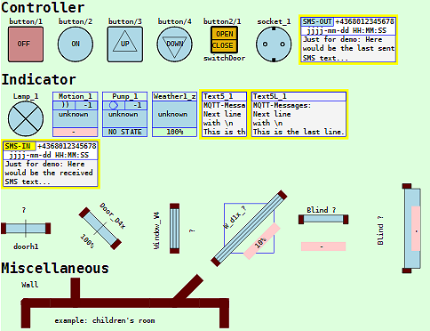
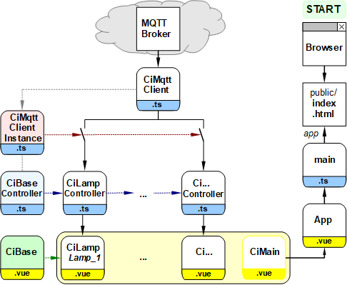
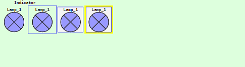

Letzte &Auml;nderung: 1.1.2022 <a name="up"></a>   
<table><tr><td></img></td><td>
<h1>&Uuml;bersicht &uuml;ber Ci-Symbole</h1>
<a href="../LIESMICH.md">==> Startseite</a> &nbsp; &nbsp; &nbsp; 
<a href="./m4h550_Vue_ci_mqtt_all_e.md">==> English version</a> &nbsp; &nbsp; &nbsp; 
</td></tr></table>
<a href="https://github.com/khartinger/mqtt4home/tree/main/source_Vue/vue50_ci_mqtt_symbols">==> Code @ GitHub</a><hr>

# Ziel
Dieses Vue-Projekt zeigt viele Steuer- und Anzeigeelemente zur Verwendung in Haussteuerungen ("Control and Indicator elements", CI-Elemente). Von den meisten Elementen (Symbolen) gibt es mehrere Darstellungsvarianten, die in weiteren Projekten genauer erläutert werden.   
Beispiele für ergänzende Projekte sind:   
* Wandelemente CiWall [(vue60_ci_mqtt_wall1)](vue60_ci_mqtt_wall1)   
* Fenster, Türen und Rollos [(vue65_ci_mqtt_door_etc)](vue65_ci_mqtt_door_window)   

   
_Bild 1: CI-Symbole_   

## Erforderliche Hilfsmittel
* Hardware: PC oder Laptop mit Internetzugang, Browser
* Hardware: Raspberry Pi (oder PC), auf dem ein MQTT-Broker l&auml;uft (zB Mosquitto)
* Software: Visual Studio Code ("VSC"), das f&uuml;r Vue-Anwendungen bereits vorbereitet ist.   
   (Dh. es wurde bereits (mindestens) eine Vue-Anwendung in Visual Code erstellt.)   

# Eigenschaften der Symbole
Die meisten CI-Elemente bestehen aus einem Controller (`.ts`) und einer Anzeige (`.vue`), wobei die Dateien in den Projektordnern `src/controller` und `src/components` abgelegt werden.   

Der __Controller__ hat im Wesentlichen folgende Aufgaben:   
* Ergänzung weiterer Eigenschaften zu den Basiseigenschaften (`id`, `name?`, `subTopic`, `pubTopic` und `pubPayload?` aus `CiBase`)   
* Verwaltung aller Symbole in einem Feld.   
* Realisierung der Methoden `onMessage` und `publishCi` für die MQTT-Kommunikation der Symbole.   
* Erstellen und exportieren einer Instanz des Controllers.   

Die __Anzeige__ hat zumindest folgende Aufgaben:   
* Zeichnen des Elementes im `<template>` Bereichs.   
* Importieren der Symbol-Eigenschaften und der Controllerinstanz aus der Controller-Datei.   
* Importieren der Basisdaten eines Basiselements.   
* Erzeugen einer Symbol-Komponente, die die Parameter eines Symbols übernehmen und auswerten kann, zB   
  Übernahme von `x`- und `y`-Wert des Zentrums des Symbols, Vorschrift für die Darstellung des Symbolrandes (`border` 0...3), ID des Symbols (`sid`) und Anzahl der darzustellenden Textzeilen (`lines` 0...2).   
* Eventuell Angabe einer Methode, die beim Klicken auf das Symbols ausgeführt wird (zB `onClk`)   

Folgende Eigenschaften sind allen Symbolen gemeinsam, da sie in `CiBase` definiert sind:   
* Symbole sind svg-Zeichnungen.   
* Symbole sind in der Regel quadratisch.   
* Jedes Symbol hat einer Rand, der 10% der Breite beträgt.   
* Jedes Symbol kann mit und ohne Rand (`border="0"`) gezeichnet werden.   
  Als Rand sind eine äußere blaue Linie (`border="1"`), eine innere Linie (`border="2"`) oder ein farbiger Rand (`border="3"`) möglich. Vorgabe ist das Zeichnen des inneren Randes.   
* Jedes Symbol kann auf die selben geometrischen Variablen und Konstanten (Klasse `Geo`) sowie Styles zugreifen.   

__Weiters gilt__:   
* Jedes Symbol muss im entsprechenden Controller registriert werden (d.h. ein Eintrag im Feld der Symbole).   
* Die Eigenschaften eines Symoles werden beim Eintrag in das Feld festgelegt.   


# Testen der Symbole
...ToDo...


# Verwendung der Symbole
...ToDo...

# Erstellen des Projektes
## 1. &Uuml;bersicht &uuml;ber die beteiligten Dateien

   
_Bild 2: &Uuml;bersicht &uuml;ber die beteiligten Dateien_   

## 2. Vorbereitung des Vue-Projektes in VSC (Kurzfassung)   
1. Visual Studio Code (VSC) starten.   
2. VSC: Terminal-Fenster &ouml;ffnen: Men&uuml; Terminal - New Terminal.   
3. VSC-Terminal: In den Ordner wechseln, unter dem das Vue-Projekt erzeugt werden soll:   
   `cd /g/github/mqtt4home/source_Vue`   
4. VSC-Terminal: Vue.js Applikation erzeugen: `vue create vue50_ci_mqtt_symbols`  
   Mit Cursortasten, Leertaste und &lt;Enter&gt; Folgendes ausw&auml;hlen:   
   `> Manually select features` &nbsp; &lt;Enter&gt;   
   `(*) Choose Vue version`   
   `(*) Babel`   
   `(*) TypeScript`   
   `(*) Router`   
   `(*) Linter / Formatter`   
   &lt;Enter&gt;   
   _`> 3.x`_ &nbsp; &lt;Enter&gt;      
   _`? Use class-style component syntax?`_ &nbsp; __`N`__ &lt;Enter&gt;   
   _`? Use Babel alongside TypeScript (required for modern mode, auto-detected polyfills, transpiling JSX)?`_ &nbsp; __`N`__ &lt;Enter&gt;   
   _`? Use history mode for router? (Requires proper server setup for index fallback in production)`_ &nbsp; __`N`__ &lt;Enter&gt;   
   _`? Pick a linter / formatter config:`_ &nbsp; __`ESLint + Standard config`__ &lt;Enter&gt;   
   _`? Pick additional lint features: `_ &nbsp; __`Lint on save`__ &lt;Enter&gt;   
   _`? Where do you prefer placing config for Babel, ESLint, etc.?`_  &nbsp; __`In dedicated config file`__ &lt;Enter&gt;   
   _`? Save this as a preset for future projects? (y/N)`_ &nbsp; __`N`__ &lt;Enter&gt;   
5. In den Projektordner wechseln: _VSC Men&uuml; Datei - Ordner &ouml;ffnen_..
   `/github/mqtt4home/source_Vue/vue50_ci_mqtt_symbols` [Ordner ausw&auml;hlen]   
6. MQTT Bibliothek installieren:   
   VSC: Terminal-Fenster &ouml;ffnen: Men&uuml; Terminal - New Terminal.   
   `npm install mqtt --save`   
&nbsp;   

## 3. Anpassen der automatisch erstellten Dateien
### 3.1 Erg&auml;nzen der Vue-Konfiguration   
Erstellen der Datei `vue.config.js`: auf das Plus neben `VUE50_CI_MQTT_SYMBOLS` klicken, Namen eingeben.   

_Inhalt der Datei_:   

```   
// ______vue.config.js__________________________________________
module.exports = {
  lintOnSave: false,
  publicPath: './',
  // publicPath: process.env.NODE_ENV === 'production' ? './vue_pubsub2/' : './',
  configureWebpack: {
    devtool: 'source-map'
  },
  chainWebpack: config => {
    config.performance
      .maxEntrypointSize(400000)
      .maxAssetSize(400000)
  }
}

```   

Mit `publicPath: './',` wird die relative Pfadangabe eingestellt und durch den `chainWebpack`-Eintrag werden Warnhinweise bez&uuml;glich der Dateigr&ouml;&szlig;e vermieden (indem man die maximale Dateigr&ouml;&szlig;en h&ouml;her setzt ;) )

### 3.2 Linter-Warnung "Unexpected any" bei "(value: any)" abstellen    
  In der Datei `.eslintrc.js` unter "`rules: {`" erg&auml;nzen:   
  ```   
  '@typescript-eslint/no-explicit-any': 'off',
  '@typescript-eslint/explicit-module-boundary-types': 'off',
  ```   

### 3.3 Datei "App.vue" anpassen   
In der Datei `src/App.vue` wird die Komponente `ciMain` (statt `HelloWorld`) aufgerufen.   

_Inhalt der Datei_:   

```   
<!-- App.vue -->
<template>
  <CiMain></CiMain>
</template>

<script lang="ts">
import { defineComponent } from 'vue'
import CiMain from '@/components/CiMain.vue'

export default defineComponent({
  name: 'App',
  components: {
    CiMain
  }
})
</script>

<style>
#app {
  font-family: Avenir, Helvetica, Arial, sans-serif;
  text-align: left;
  color: black;
  margin-top: 0px;
}
</style>
```   

### 3.4 Nicht ben&ouml;tigte Dateien und Verzeichnisse l&ouml;schen   
  * Datei `components/HelloWorld.vue` l&ouml;schen   
  * Verzeichnis `assets` l&ouml;schen   

## 4. MQTT Client erg&auml;nzen
## 4.1 Einbinden der erforderlichen Dateien
* Erstellen des Verzeichnisses "controller"   
  Mit der rechten Maustaste auf das Verzeichnis `src` klicken, "Neuer Ordner" w&auml;hlen und den Namen `controller` eingeben.   

* Erstellen des Verzeichnisses "services"   
  Mit der rechten Maustaste auf das Verzeichnis `src` klicken, "Neuer Ordner" w&auml;hlen und den Namen `services` eingeben.   

* Kopieren der Dateien [`CiMqttClient.ts`](https://github.com/khartinger/mqtt4home/blob/main/source_Vue/vue50_ci_mqtt_symbols/src/services/CiMqttClient.ts) und [`CiMqttClientInstance.ts`](https://github.com/khartinger/mqtt4home/blob/main/source_Vue/vue50_ci_mqtt_symbols/src/services/CiMqttClientInstance.ts) in das Verzeichnis `src/services`.   

* Kopieren der Datei [`CiBaseController.ts`](https://github.com/khartinger/mqtt4home/blob/main/source_Vue/vue50_ci_mqtt_symbols/src/controller/CiBaseController.ts) in das Verzeichnis `src/controller`.   

* Kopieren der Datei [`CiBase.vue`](https://github.com/khartinger/mqtt4home/blob/main/source_Vue/vue50_ci_mqtt_symbols/src/components/CiBase.vue) in das Verzeichnis `src/components`.   

## 4.2 Anpassen der Datei CiMqttClientInstance
* Festlegen, dass beim Start der App mit den Vorgabewerten die Verbindung zum Broker hergestellt und das Topic abonniert werden soll (Konstruktor-Wert `true`).   

* Eintragen aller Controller, die Mqtt-Nachrichten senden oder empfangen sollen. Als erstes Beispiel soll lediglich ein Lampensymbol dienen:    

_Beispiel:_   

```  
// ______mqttClientInstance.ts__________________________________
import { CiMqttClient } from './CiMqttClient'
import { ciLampController } from '@/controller/CiLampController'

export const ciMqttClientInstance = new CiMqttClient(true)
ciMqttClientInstance.registerController(ciLampController)

```   

# 5. Main-Seite erstellen   
## 5.1 Codierung der Main-Seite
Die `CiMain`-Komponente dient zur Darstellung aller Symbole. Auch hier wird zuerst wieder nur mit dem Lampensymbol begonnen.   

_Inhalt der Datei:_   
```   
<!--CiMain.vue-->
<template>
  <svg width="100%" viewBox="-50 -70 870 240">
  <rect class="ciBackground" x="-50" y="-70" width="920" height="310" />
  <text :x="0*dx" :y="-0.55*dy" class="ciFont1">Indicator</text>
  <CiLamp :x="0*dx" :y="0*dy" sid="lamp1" :border="0"></CiLamp>
  <CiLamp :x="1*dx" :y="0*dy" sid="lamp1" :border="1"></CiLamp>
  <CiLamp :x="2*dx" :y="0*dy" sid="lamp1" :border="2"></CiLamp>
  <CiLamp :x="3*dx" :y="0*dy" sid="lamp1" :border="3"></CiLamp>
</svg>
</template>

<script lang="ts">
import { defineComponent } from 'vue'
import { Geo } from './CiBase.vue'
import CiLamp from './CiLamp.vue'

export default defineComponent({
  name: 'CiMain',
  components: {
    CiLamp
  },
  computed: {
    geo: function (): Geo {
      const geo1 = new Geo(0, 0)
      return geo1
    },
    dx: function (): number { return (this.geo.dxo) },
    dy: function (): number { return (this.geo.dyo) }
  }
})
</script>

<style>
</style>

```   
## 5.2 Ersten Test vorbereiten
Zum Testen der `CiMain`-Seite müssen noch die Lampen-Dateien ergänzt werden:   
* Kopieren der Datei [`CiLamp.vue`](https://github.com/khartinger/mqtt4home/blob/main/source_Vue/vue50_ci_mqtt_symbols/src/components/CiLamp.vue) in das Verzeichnis `src/components`.   
* Kopieren der Datei [`CiLampController.ts`](https://github.com/khartinger/mqtt4home/blob/main/source_Vue/vue50_ci_mqtt_symbols/src/controller/CiLampController.ts) in das Verzeichnis `src/controller`.   

## 5.3 Ersten Test durchführen
* Starten des VSC-internen Servers   
  Dazu muss man im Terminalfenster (Menü Terminal - Neues Terminal) folgendes eingeben:   
`npm run serve`   
* Gibt man im Browser die Adresse `localhost:8080` ein, erhält man folgendes Bild:   
   
_Bild 3: Lampensymbol ohne und mit Rand ("border"-Wert von 0 bis 3)_   

[Zum Seitenanfang](#up)