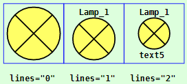
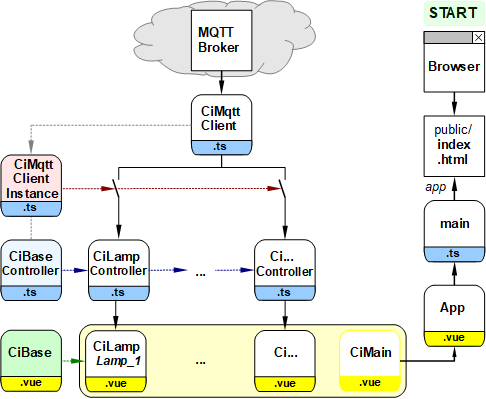

Last modified: 2022-01-20 <a name="up"></a>   
<table><tr><td></td><td>
<h1>Examples of Ci symbols</h1>
<a href="../README.md">==> Home page</a> &nbsp; &nbsp; &nbsp; 
<a href="./m4h550_Vue_ci_mqtt_all.md">==> German version</a> &nbsp; &nbsp; &nbsp; 
</td></tr></table>
<a href="https://github.com/khartinger/mqtt4home/tree/main/source_Vue/vue50_ci_mqtt_symbols">==> Code @ GitHub</a><hr>

# What is it about?
This Vue project shows many control and indicator elements ("CI elements") that you can use when visualizing your own home control with Vue. All elements shown here can be accessed via MQTT (as long as a broker is running on host 10.1.1.1...).   

   
_Fig. 1: CI symbols_   

Each symbol can be drawn without or with a frame:    
   
_Fig. 2: Lamp symbol with different borders (default: `:border="2"`)_   

Also the number of information lines can be chosen (symbol with `:border="1"`):   
      
_Fig. 3: Lamp symbol with different number of text lines (default: `lines="1"`)_   

## This Vue example answers the following questions:   
1. [How do I get this example to work on my computer?](#a10)
2. [How do I test the elements in this example?](#a20)   
3. [Some theory: What are the tasks of the components of a CI element?](#a30)   
4. [How do I incorporate one of these CI elements into my Vue application?](#a40)   

How to create and use your own elements is explained e.g. in the project ["Vue-MQTT: How to create a CI symbol" (vue20_ci_mqtt_lamp1)](vue20_ci_mqtt_lamp1).   
Of many elements there are several display variants (different sizes etc.). If the variants are particularly diverse, they will be explained in more detail in further projects, for example:   

* Wall elements (CiWall): [vue60_ci_mqtt_wall1](vue60_ci_mqtt_wall1)   
* Fenster, T&uuml;ren und Rollos (CiWindow, CiDoor, CiBlind): [vue65_ci_mqtt_door_etc](vue65_ci_mqtt_door_window)   

<a name="a10"></a>

# 1. How do I get the project running on my computer?   

One way is to create an empty VSC project, download the files from github and copy them into the VSC project.   

## What things do I need?
* Hardware: PC or laptop with internet access, browser.   
* Hardware: Raspberry Pi (or PC) running an MQTT broker (e.g. Mosquitto)   
* Software: Visual Studio Code ("VSC"), which is already prepared for Vue applications.   
* Software: The MQTT client programs `mosquitto_sub` and `mosquitto_pub` (installed on the PC or RasPi).   

## How do I create an empty VSC project?
1. Start Visual Studio Code (VSC).   
2. Open VSC: Terminal window: Menu Terminal - New Terminal.   
3. VSC Terminal: Change to the folder under which the Vue project is to be created, for example:   
   `cd /c/work/test_vue`.   
4. VSC-Terminal: Create Vue.js application: `vue create vue50_ci_mqtt_symbols`  
   Select the following with cursor keys, space bar and &lt;Enter&gt;:   
   `> Manually select features` &nbsp; &lt;Enter&gt;   
   `(*) Choose Vue version`   
   `(*) Babel`   
   `(*) TypeScript`   
   `( ) Router`   
   `(*) Linter / Formatter`   
   &lt;Enter&gt;   
   _`> 3.x`_ &nbsp; &lt;Enter&gt;      
   _`? Use class-style component syntax?`_ &nbsp; __`N`__ &lt;Enter&gt;   
   _`? Use Babel alongside TypeScript (required for modern mode, auto-detected polyfills, transpiling JSX)?`_ &nbsp; __`N`__ &lt;Enter&gt;   
   _`? Use history mode for router? (Requires proper server setup for index fallback in production)`_ &nbsp; __`N`__ &lt;Enter&gt;   
   _`? Pick a linter / formatter config:`_ &nbsp; __`ESLint + Standard config`__ &lt;Enter&gt;   
   _`? Pick additional lint features: `_ &nbsp; __`Lint on save`__ &lt;Enter&gt;   
   _`? Where do you prefer placing config for Babel, ESLint, etc.?`_ &nbsp; __`In dedicated config file`__ &lt;Enter&gt;   
   _`? Save this as a preset for future projects? (y/N)`_ &nbsp; __`N`__ &lt;Enter&gt;   
5. Switch to the project folder: _VSC Menu File - Open folder_..   
   `c:/work/test_vue/vue50_ci_mqtt_symbols` [select folder].   
6. Install MQTT library:   
   VSC: Open terminal window: Menu Terminal - New Terminal.   
   `npm install mqtt --save`   

## How can I download the project files?
To save downloading the files one by one, the easiest way is to download the whole project `mqtt4home` as a zip file:   

1. In the browser enter the address (URL) [`https://github.com/khartinger/mqtt4home`](https://github.com/khartinger/mqtt4home).   
2. Click the button [Code], choose "Download ZIP" and in the selection window [*] save file [OK].   

## How can I copy the downloaded files into the VSC project?
1. In the browser at download for the file __mqtt4home-main.zip__ click "open file" (or change to the download directory and open the zip file there).   
2. Right-click the directory `mqtt4home-main/source_Vue/vue50_ci_mqtt_symbols/src` in the explorer and select "Copy".   
3. Change to the project directory `c:/work/test_vue/vue50_ci_mqtt_symbols` and paste the files there (overwriting three files). When inserting, the directory will be unpacked automatically.   

## How can I start the project?
1. Open the terminal window in VSC via the menu item Terminal - New Terminal (if it is not already open) and start the built-in server with   
`npm run serve`   
2. Enter the following address (URL) in the browser:   
`localhost:8080`   
  In the browser _figure 1_ should be displayed.   

<a name="a20"></a>

# 2. How do I test the elements in this example?   
## Preparation
To test the elements, the project must be started - as described above. 
Google Chrome is particularly suitable as a browser, since you can open the developer tools by pressing [F12].   
After starting the server or refreshing the page, the developer console of Chrome should display a text like   
`MqttClient-Constructor: subscribe #`   
`MqttClient-Constructor: finished`   
should be displayed.   
If, on the other hand, it says "WebSocket connection to 'ws://10.1.1:1884/' failed:", then the connection to the broker is missing. (E.g. missing WLAN connection)   

## Test without observing the MQTT messages
Some of the icons are connected via MQTT messages, so you can change their appearance:    

* When starting the website or after a refresh, the lamp "Lamp_1" appears light blue ("state unknown").   
* If you press the button "button/1", the lamp "Lamp_1" will be colored gray ("Lamp off").   
* If you press the button "button/2", the lamp "Lamp_1" will be colored yellow ("Lamp on").   
* If you press "OPEN" at the button "button2/1", all the door, window and blind symbols will be displayed in the open state.   
* If you press "CLOSE" on the "button2/1" button, all the door, window and roller blind symbols are displayed in the closed state.   

## Test with observation of the MQTT messages
To observe the MQTT message exchange the program `mosquitto_sub` must be started. This can be done either via the command prompt (cmd.exe) on the PC or a console on the RasPi:   
`mosquitto_sub -h 10.1.1.1 -t "#" -v`   

In addition to the action you can now watch the sent messages:   

* If one presses the lamp symbol "Lamp_1", the message appears   
  `ci/lamp/1/set/lamp -1` in the console.   
* If you press the button "button/2", the messages   
  `ci/button/2 1`   
  `ci/lamp/1/set/lamp 1`   
   are sent and the lamp "Lamp_1" is colored yellow ("lamp on") because it "listens" to the topic `ci/lamp/1/set/lamp`.   
* If you press the button "button/1", the messages   
  `ci/button/2 0`   
  `ci/lamp/1/set/lamp 0`   
   are sent and the lamp "Lamp_1" is colored gray ("lamp off").
* If you press "OPEN" at the button "button2/1", the message   
  `ci/button2/1/status 1`   
   is sent. The door, window and shutter icons are set to respond to this message with the "Open" status.   
* If you press "CLOSE" on the button "button2/1", the message   
  `ci/button2/1/status 0`   
   is sent. The door, window and shutter icons are set to respond to this message with the "Closed" state.   

The naming of the messages can be changed as desired.   

## Sending own MQTT messages
With the help of the program `mosquitto_pub` you can also send your own messages to the symbols.   

* Switching on the lamp symbol:   
  `mosquitto_pub -h 10.1.1.1 -t ci/lamp/1/set/lamp -m 1`   
* Output of a text in the display `<CiTest5L>`:   
`mosquitto_pub -h 10.1.1.1 -t ci/text5L/set -m "Title\nOne very very long line and a last line..."`.   
* Switch on the wireless socket and display it with the element `<ciSocket>`.   
`mosquitto_pub -h 10.1.1.1 -t ci/socket/1 -m "{\"state\": \"ON\"}"`   
* Switch off the wireless socket and display it with the element `<ciSocket>`.   
`mosquitto_pub -h 10.1.1.1 -t ci/socket/1 -m "{\"state\": \"OFF\"}"`   

&nbsp;

<a name="a30"></a>
# 3. some theory: what are the tasks of the components of a CI element?
Most CI elements consist of two files, a controller (`.ts`) and a display (`.vue`).   
These files are stored separately in the project folders `src/controller` and `src/components`.   

The __controller__ has the following main tasks:   
* Set additional properties for the element.   
  The basic properties `id`, `name?`, `subTopic`, `pubTopic` and `pubPayload?` are already defined for each element in the `CiBase` class. The question mark after the name means that the definition of the property can also be omitted.   
* Definition of all symbols of this type in one field.   
* Realization of the methods `onMessage` and `publishCi` for the MQTT communication of the element (respectively for all symbols of the same type).   
* Creating and exporting an instance of the controller.   

The __display__ has the following tasks:   
* Drawing a symbol in the `<template>` area.   
* Importing the element properties and the controller instance from the controller file.   
* Importing the base element (with the base data of all symbols).   
* Creating a component that can take over and evaluate the parameters for a given symbol, e.g.   
  * Taking over `x` and `y` value of the center of the symbol,   
  * ID of the symbol (`sid`),   
  * Information about the display of the symbol border (`border` 0...3),
  * Number of text lines to be displayed (`lines` 0...2).   
* Possibly: coding of a method which is executed when clicking on the symbol (e.g. `onClk`).   

The following properties are common to all symbols, since they are defined in `CiBase`:   
* Symbols are svg drawings.   
* Symbols are usually square.   
* Each symbol has a border that is 10% of the width.   
* Each symbol can be drawn with or without a border (`border="0"`).   
  The border can be an outer blue line (`border="1"`), an inner line (`border="2"`) or a colored border (`border="3"`). The default is to draw the inner border.   
* Each symbol accesses the same geometric variables and constants (class `Geo`) as well as styles.   

__Further applies__:   
* Each symbol must be registered in the corresponding controller (i.e. an entry in the field of symbols).   
* The properties of a symbol are set when it is entered in the field.   

&nbsp;

<a name="a40"></a>

# 4. How do I incorporate one of these CI elements into my Vue application?   
The following instructions assume that your own project is set up similarly to this project:   
* Separate directories for `components` and `controller`.   
* CI controllers are derived from `CiBaseController`.   
* CI elements are derived from `CiBase`.   
* All display symbols are displayed by `CiMain.vue`.   
* MQTT connection is done by `services/CiMqttClient.ts` and `services/CiMqttClientInstance.ts` files.   

An overview of the files involved is provided by the following image, where `Ci...` stands for the different elements:   

   
_Fig. 4: Overview of the files involved_.   

If your own project is structured as described above, then six steps are required to include an element:   
1. Copy the display file ("*.vue") into the directory `src/components`   
2. Copy the controller file ("*.ts") into the `src/controller` directory   
3. Register the controller in `services/CiMqttClientInstance.ts`.   
4. Register the symbol properties in the controller.   
5. Including the element in the main file.   
6. Displaying the symbol.   

The individual steps are described in more detail in the following example.   

## Example   
Two symbols with the following properties are to be drawn from the element `CiXxx` in the file `CiMain.vue`:   

| Property | Symbol 1 | Symbol 2 |   
|------------------------------------------|:--------------:|:--------------:|   
| Center of the symbol (x/y) | 100/200 | 200/300 |   
| ID of the symbol | xxx1 | xxx2 |   
| Draw the symbol with border | nein | ja, Au&szlig;enrand |   
| Number of info lines | 1 | 2 |   
| Topic for sending MQTT messages | ci/xxx/1/pub | ci/xxx/2/pub |   
| Topic for receiving MQTT messages | ci/xxx/1/sub<br>ci/xxx/x/sub | ci/xxx/2/sub<br>ci/xxx/x/sub |   
| Payload when sending MQTT messages | -1 | -1 |   

_assumption_: The files `CiXxx.vue` and `CiXxxController.ts` already exist.

### Step 1 + 2: Copying the CiXxx files
* Copy the display file `CiXxx.vue` to the directory `src/components`.   
* Copy the controller file `CiXxxController.ts` to the directory `src/controller`.   

### Step 3: Register the CiXxx controller file in CiMqttClientInstance.ts
Open file `src/services/CiMqttClientInstance.ts` and add the following two lines:   
```   
// ______mqttClientInstance.ts__________________________________
import { CiMqttClient } from './CiMqttClient'.
import { ciXxxController } from '.@/controller/CiXxxController'.

export const ciMqttClientInstance = new CiMqttClient(true)
ciMqttClientInstance.registerController(ciXxxController)

```   

### Step 4: Registering the symbol properties in the CiXxx controller
Open file `src/controller/CiXxxController.ts` and enter the following:   
```   
  public xxxs: Array<Xxx> = reactive(
    [
      {
        id: 'xxx1',
        subTopic: 'ci/xxx/1/sub ci/xxx/x/sub',
        pubTopic: 'ci/xxx/1/pub',
        pubPayload: '-1'
      },
      {
        id: 'xxx2',
        subTopic: 'ci/xxx/2/sub ci/xxx/x/sub',
        pubTopic: 'ci/xxx/2/pub',
        pubPayload: '-1'
      }
    ]
  );
```   

### Step 5: Including the CiXxx element in the main file
 Open file `src/components/CiMain.vue` and make the following two entries in the `<script>` section:    
* import the encoding of the Xxx representation:   
  `import CiXxx from './CiXxx.vue'`   
* Add to the components used:   
  `components: {`   
  ` CiXxx`   
  `},`   

### Step 6: Displaying the CiXxx symbols
The installation of the Xxx symbols in the `<template>` area of the `CiMain.vue` file is done by the following statements:
```   
<CiXxx :x="100" :y="200" sid="xxx1" lines="1" :border="0"></CiXxx>`   
<CiXxx :x="100" :y="300" sid="xxx2" lines="2" :border="1"></CiXxx>``   
```   

[To the top of the page](#up)   
