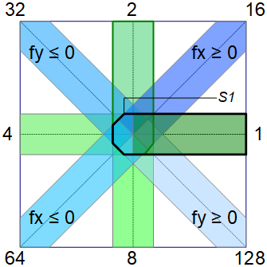

Letzte &Auml;nderung: 27.12.2021    
<table><tr><td></img></td><td>
<h1>Wie erstellt man Wand-Elemente</h1>
<a href="../LIESMICH.md">==> Startseite</a> &nbsp; &nbsp; &nbsp; 
<a href="./m4h560_Vue_ci_mqtt_wall1.md">==> English version</a> &nbsp; &nbsp; &nbsp; 
</td></tr></table>
<a href="https://github.com/khartinger/mqtt4home/tree/main/source_Vue/vue60_ci_mqtt_wall1">==> Code @ GitHub</a>

## Ziel
Dieses Vue-Projekt zeigt das Erstellen von Wand-Elementen, die dem CI-Raster entsprechen.   
Das folgende Bild zeigt Beispiele für diese Wand-Elemente:   

   
_Bild 1: Wand-Elemente_   

Der Typ der Grafik wird als Nummer angegeben, die als Summe folgender Werte zusammengesetzt wird:   

   
_Bild 2: Berechnung des Wand-Typs_   

_Beispiele:_   
` 1 +  2 =  3` : Wand wie ein L   
` 1 +  5 =  5` : Waagrechte Linie --   
` 2 +  8 = 10` : Senkrechte Linie |   
`32 + 16 = 48` : Wand wie ein V   
`1 + 2 + 8 = 11` : senkrechte Wand mit waagrechten Ansatz rechts |-   
`4 + 2 + 8 = 14` : senkrechte Wand mit waagrechten Ansatz links  -|   
usw.   
