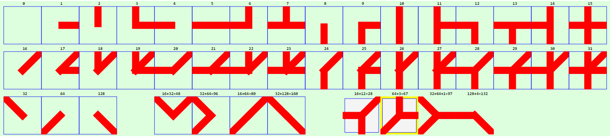
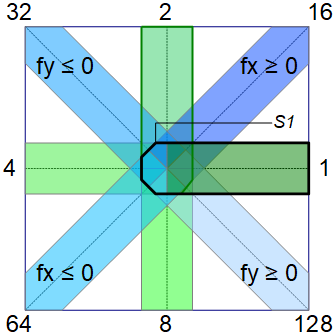

Last modified: 2021-12-27    
<table><tr><td></td><td>
<h1>How to create wall elements</h1>
<a href="../README.md">==> Home page</a> &nbsp; &nbsp; &nbsp; 
<a href="./m4h560_Vue_ci_mqtt_wall1.md">==> German version</a> &nbsp; &nbsp; &nbsp; 
</td></tr></table>
<a href="https://github.com/khartinger/mqtt4home/tree/main/source_Vue/vue60_ci_mqtt_wall1">==> Code @ GitHub</a>

## Target
This Vue project shows how to create wall elements that match the CI grid.   
The following image shows examples of these wall elements:   

   
_Fig. 1: wall elements_   

The type of the graphic is specified as a number, which is composed as the sum of the following values:   

   
_Fig. 2: Calculation of the wall type_   

In addition, there are the values 256 = square and 512 = slanted square. These elements are used to make the beveled corners of vertically stacked elements pointed.    

The "type" value can be specified both as a decimal number and as a hexadecimal number (e.g. 10 = 0x0A).   

_Examples:_   
` 1 + 2 = 3` : wall like an L   
` 1 + 4 = 5` : Horizontal line --   
` 2 + 8 = 10` : Vertical line |   
`16 + 32 = 48` : Wall like a V   
`1 + 2 + 8 = 11` : Vertical wall with a horizontal extension on the right |-   
`2 + 4 + 8 = 14` : Vertical wall with a horizontal extension on the left -|   
` 1 + 2 +256 = 259 = 0x103` : Wall like an L with pointed corner   
etc.   
