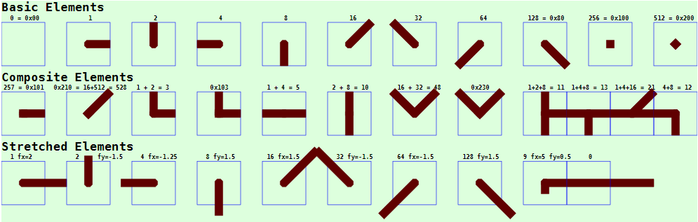
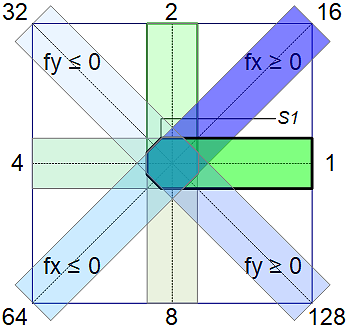
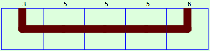
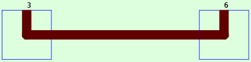
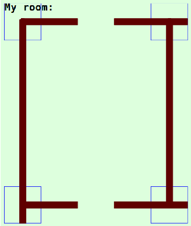

Last modified: 2022-01-04 <a name="up"></a>   
<table><tr><td></td><td>
<h1>How to draw a house plan? (CiWall elements)</h1>
<a href="../README.md">==> Home page</a> &nbsp; &nbsp; &nbsp; 
<a href="./m4h560_Vue_ci_mqtt_wall1.md">==> German version</a> &nbsp; &nbsp; &nbsp; 
</td></tr></table>
<a href="https://github.com/khartinger/mqtt4home/tree/main/source_Vue/vue60_ci_mqtt_wall1">==> Code @ GitHub</a><hr>

## Target
This Vue project shows how to easily draw house plans or apartment floor plans with the help of the CiWall component. The CI symbols of the home automation can then be inserted into these plans.   

_Fig. 1_ shows examples for wall elements:   

   
_Fig. 1: wall elements_   

# Use of wall elements
## Basics
Wall elements, like all CI symbols, have a square shape and are inserted inside the `<svg>` area (the `<template>` area) of a CI Vue component by, for example, the following line:   
`<CiWall :x="200" :y="100" sid="w" type="9" :fx="5" :fy="0.5"></CiWall>`   
Where   
* `x` and `y` are the coordinates of the center point.   
* `sid` is the ID of the symbol. This must be specified, but is not used further and can also be the same for all symbols.   
* `type` is the type (number) of the wall element and is described in more detail below.   
* `fx` and `fy` are stretching factors in x- and y-direction.   

The `type` value can be specified as a decimal number as well as a hexadecimal number (e.g. 10 = 0x0A).   

The coding of the wall elements is located in the component `CiWall.vue`. There is no associated controller, since the elements are only used for drawing and do not require an MQTT connection.   

## Basic wall elements
There are 11 basic wall elements in total, where the elements with the numbers 0, 256 and 512 represent special wall elements (see also _Fig. 1_):   
* 0: empty wall element   
* 256: square with the wall thickness as side length    
* 512: like number 256, but rotated by 45°.   

The elements 256 and 512 can be used to make the corners of vertically stacked elements pointed.    

Base elements start in the center of the symbol and point in the axis directions or diagonals:   
* 1: x+ direction   
* 2: y- direction (y minus!)   
* 4: x- direction   
* 8: y+ direction (y plus!)   
* 16: diagonal 1st quadrant (stretch factor fx > 0)   
* 32: diagonal 2nd quadrant (stretch factor fy < 0)   
* 64: Diagonal 3rd quadrant (stretch factor fx < 0)   
* 128: Diagonal 4th quadrant (stretch factor fy > 0)   

_Fig. 2_ shows the basic elements:   

   
_Fig. 2: Basic wall elements_   

The base elements have rounded corners in the center so that no small corners "stick out" at connections under 45°.    
S1 is starting point for creating the svg-path string.   

## Composite wall elements
Additional wall elements can be composed from the base elements by adding the individual values.   

_Examples:_   
` 1 + 2 = 3` : Wall like an L   
` 1 + 4 = 5` : Horizontal line --   
` 2 + 8 = 10` : Vertical line |   
`16 + 32 = 48` : Wall like a V   
`1 + 2 + 8 = 11` : Vertical wall with a horizontal extension on the right |-   
`2 + 4 + 8 = 14` : vertical wall with horizontal extension left -|   
` 1 + 2 +256 = 259 = 0x103` : wall like an L with pointed corner   
etc.   

## Stretching the wall elements
To draw a longer wall e.g. in x+ direction, you can line up several `type="5"`-elements e.g. results for   
   
_Fig. 3: Wall in x+ direction consisting of single elements_   
the coding   
```   
  <CiWall :x="100" :y="100" sid="w" type="3" :border="1"></CiWall>
  <CiWall :x="200" :y="100" sid="w" type="5" :border="1"></CiWall>
  <CiWall :x="300" :y="100" sid="w" type="5" :border="1"></CiWall>
  <CiWall :x="400" :y="100" sid="w" type="5" :border="1"></CiWall>
  <CiWall :x="500" :y="100" sid="w" type="6" :border="1"></CiWall>
```   
Note: To make it easier to see the individual elements, `:border="1"` was used to draw the border around each element.   

Therefore, to save writing the horizontal wall elements, the x+ leg of the 1st element can be extended. To do this, specify in the parameter `:fx` by how many times this base element should be stretched, e.g. `:fx="7"`.   
Note: the width of one element consists of __two__ base elements!   

Thus for the same wall representation   
   
_Fig. 4: wall in x+ direction with stretched element_   
 the coding   
```   
  <CiWall :x="100" :y="100" sid="w" type="3" :fx="7" :border="1"></CiWall>
  <CiWall :x="500" :y="100" sid="w" type="6" :border="1"></CiWall>
```   


__Summarizing the stretch factors__:   
* fx > 0 stretches element 1 (x+ direction)   
* fx < 0 stretches the element 4 (x- direction)   
* fy > 0 stretches element 8 (y+ direction, to the BOTTOM!)   
* fy < 0 stretches the element 2 (y- direction, to UP!)   

For diagonal elements, the factors fx and fy are also used, with the following:   
* fx > 0 stretches element 16 (diagonal in the 1st quadrant)   
* fx < 0 stretches the element 64 (diagonal in the 3rd quadrant)   
* fy > 0 stretches the element 128 (diagonal in the 4th quadrant)   
* fy < 0 stretches the element 32 (diagonal in the 2nd quadrant)   

&nbsp;
# Example: Drawing the walls of a room
For the following room a component "WallRoom1.vue" should be created:   
   
_Fig. 5: Component WallRoom1.vue_   

To set the symbols, a grid should be used that corresponds to the width ("dx") and height ("dy") of the CI elements. The size of the room should be 5 x 6 boxes.   
In _Fig. 5_ `:border="1"` is set for the CiWall elements for a better overview. In the final version this attribute should be removed or set to 0.   
## 1. Creation of the file WallRoom1.vue
Click with the left mouse button first on `src` then on `components`, click with the right button on "New file" and enter the name `WallRoom1.vue`.   

## 2. Coding of the file WallRoom1.vue
In the `<template>` area first the `<sgv>` drawing area is defined and filled with the background color. After that, the house plan is drawn.   

* In the `<script lang="ts">` area first 
  * the components `defineComponent`, `Geo` and `CiWall` are included and   
  * the new component `WallRoom1` is defined.   
* The component `WallRoom1` then contains under `computed: {` the methods   
  * `geo` (contains geometry data like the size of the CI elements)   
  * `dx` (width of the CI elements = x-grid width) and   
  * `dy` (height of the CI elements = y-grid height).   

_result_:   
```   
<!--CiMain.vue-->
<template>
<svg width="100%" viewBox="40 40 560 660">
  <rect class="ciBackground" x="40" y="40" width="520" height="620" />
  <text :x="0.5*dx" :y="0.7*dy" class="ciFont2">My room:</text>
  <CiWall :x="1*dx" :y="1*dy"  sid="w01" type="9" :fx="3" :fy="9" :border="1"></CiWall>
  <CiWall :x="5*dx" :y="1*dy"  sid="w01" type="13" :fx="-3" :fy="9" :border="1"></CiWall>
  <CiWall :x="1*dx" :y="6*dy"  sid="w01" type="11" :fx="3" :border="1"></CiWall>
  <CiWall :x="5*dx" :y="6*dy"  sid="w01" type="7" :fx="-3" :border="1"></CiWall>
</svg>
</template>

<script lang="ts">
import { defineComponent } from 'vue'
import { Geo } from './CiBase.vue'
import CiWall from './CiWall.vue'

export default defineComponent({
  name: 'WallRoom1',
  components: {
    CiWall
  },
  computed: {
    geo: function (): Geo {
      const geo1 = new Geo(0, 0)
      return geo1
    },
    dx: function (): number { return (this.geo.dxo) },
    dy: function (): number { return (this.geo.dyo) }
  }
})
</script>

<style>
</style>
```   

## 3. Testing the WallRoom1.vue component
The component `WallRoom1.vue` can be included into any Vue component by   
* adding the line   
  `<WallRoom1></WallRoom1>`   
  in the `<template>` area and   
* adding the import of the component in the `<script lang="ts">` area by   
  `import WallRoom1 from './WallRoom1.vue'`   
  and inserting under `components: {` the line    
  ` WallRoom1,`  


After saving the file (e.g. `CiMain.vue`), starting the built-in server in the terminal with   
`npm run serve`   
and calling the page in the browser by entering the address (URL)   
`localhost:8080`   
the component will be displayed in the browser.   
