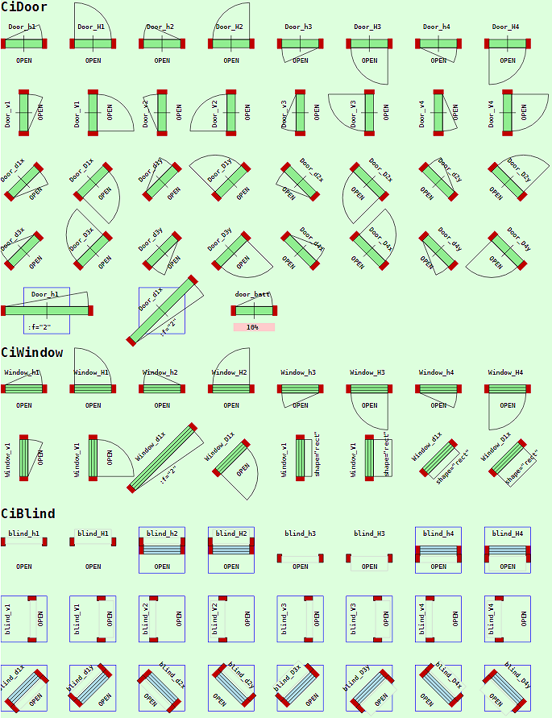
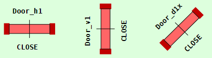
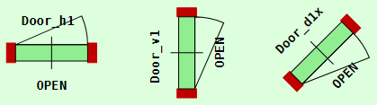
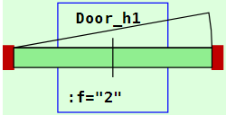
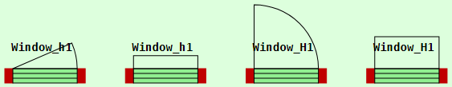

Letzte &Auml;nderung: 8.1.2022 <a name="up"></a>   
<table><tr><td></img></td><td>
<h1>Wie zeichnet man Türen und Fenster in einem Hausplan? (CiDoor, CiWindow, CiBlind)</h1>
<a href="../LIESMICH.md">==> Startseite</a> &nbsp; &nbsp; &nbsp; 
<a href="./m4h565_Vue_ci_mqtt_door_etc_e.md">==> English version</a> &nbsp; &nbsp; &nbsp; 
</td></tr></table>
<a href="https://github.com/khartinger/mqtt4home/tree/main/source_Vue/vue65_ci_mqtt_door_etc">==> Code @ GitHub</a><hr>

## Ziel
Dieses Vue-Projekt zeigt, wie man Türen, Fenster und Rollos in Hauspl&auml;ne bzw. Wohnungsgrundrisse einzeichnet. Werden die Elemente durch MQTT-Schalter etc. überwacht, wird ihr Zustand im Plan entsprechend eingezeichnet (offen oder geschlossen).

Das folgende Bild zeigt Beispiele f&uuml;r Tür-, Fenster- und Rollo-Elemente:   

   
_Bild 1: Tür-, Fenster- und Rollo-Elemente im offenen Zustand_   

# Verwendung der Elemente
Alle Elemente haben eine quadratische Form und werden innerhalb des `<svg>`-Bereichs (des `<template>`-Bereichs) einer CI-Vue-Komponente zB durch folgende Zeilen eingef&uuml;gt:   
```   
  <CiDoor   :x="0.5*dx" :y="1.0*dy" sid="door_h1" dir="h1" :border="0"></CiDoor>
  <CiWindow :x="0.5*dx" :y="8.5*dy" sid="window_h1" dir="h1" :border="0"></CiWindow>
  <CiBlind  :x="0.5*dx" :y="13.5*dy" sid="blind_v1" dir="v1" :border="1"></CiBlind>
```   

Dabei bedeutet   
* `x` und `y` sind die Koordinaten des Mittelpunktes.   
* `sid` ist die ID des Symbols. Sie stellt die Verbindung zum Element im Controller dar.   
* `dir` gibt die Richtung des Elementes an und wird weiter unten genauer beschrieben.   
* `border` gibt an, ob das Element ohne oder mit Rand dargestellt werden soll.   

Die Codierung der Darstellung der Elemente befindet sich in den Komponenten `CiDoor.vue`, `CiWindow.vue` und `CiBlind.vue`. Für jede Komponente gibt es auch den dazugeh&ouml;rigen Controller, in dem die einzelnen Elemente aufgezählt werden müssen.   

_Beispiel für eine Türe (aus `CiDoorController.ts`):_   
```   
  public doors: Array<Door> = reactive(
    [
      {
        id: 'door_h1',
        name: 'Door_h1',
        iDoorState: 1,
        type: 'D1',
        text5: '?',
        subTopic: 'ci/door/11/ret/status ci/door/11/ret/voltage ci/door/x/ret/status',
        pubTopic: ''
      },
```   

_Beispiel für ein Fenster (aus `CiWindowController.ts`):_   
```   
  public windows: Array<Window> = reactive(
    [
      {
        id: 'window_h1',
        name: 'Window_h1',
        iWindowState: 1,
        type: 'D1',
        text5: '?',
        subTopic: 'ci/window/11/ret/status ci/window/x/ret/status',
        pubTopic: ''
      },
```   

_Beispiel für eine Rollo (aus `CiBlindController.ts`):_   
```   
  public blinds: Array<Blind> = reactive(
    [
      {
        id: 'blind_h1',
        name: 'blind_h1',
        iBlindState: 1,
        type: 'D1',
        // iMotorState: -9,
        text5: '?',
        subTopic: 'ci/blind/11/ret ci/blind/11/ret/motor ci/blind/x/ret/status',
        pubTopic: ''
      },
```   

&nbsp;

# Gemeinsame Eigenschaften der Tür, Fenster- und Rollo-Elemente
## Ausrichtung eines Symoles
Die Richtung eins Symboles wird mit der Eigenschaft `dir` ("Direction") festgelegt.   

Der __erste Buchstabe__ gibt die Basis-Richtung an:   
* `h` oder `H`: Horizontal (waagrecht, x-Richtung)   
* `v` oder `V`: Vertikal   (senkrecht, y-Richtung)   
* `d` oder `D`: Diagonal (unter +/- 45° geneigt)   

Bei Verwendung eines Kleinbuchstabens wird die Türöffnung/Fensteröffnung/Rollo klein gezeichnet, bei einem Großbuchstaben groß (siehe _Bild 1_)   

Der __zweite Buchstabe__ gibt die "Ausbreitungs"-Richtung an, bzw. den Quadranten, in den sich die Türe bzw. das Fenster öffnet oder sich die Rollo befindet. Entsprechend den 4 Quadranten sind die Ziffern 1 bis 4 möglich.   

Bei diagonalen Elementen ist ein __dritter Buchstabe__ erforderlich, um die "Ausbreitungs"-Richtung genauer anzugeben. Dies erfolgt durch Angabe der Achse, zu der sich ein Element bei Betätigung "bewegt" und kann entsprechend `x` oder `y` sein.   

_Beispiele:_   
   
_Bild 2: Richtung von Symbolen (geschlossen, iDoorState = 0)_   
   
_Bild 3: Richtung von Symbolen (offen, iDoorState = 1)_   

`dir="h1" ....` Waagrechtes Symbol, dessen Ausbreitung (Tür-, Fensteröffnung) in den ersten Quadranten erfolgt (nach "oben").   
`dir="v1" ....` Senkrechtes Symbol, dessen Ausbreitung (Tür-, Fensteröffnung) in den ersten Quadranten erfolgt (nach "rechts").   
`dir="d1x" ...` Diagonales Symbol nach rechts-oben, dessen Ausbreitung (Tür-, Fensteröffnung) in Richtung der x-Richtung erfolgt (nach "unten").   

## Streckfaktor f
Alle Symbole können (symmetrisch) gestreckt werden, wobei das Zentrum des Symbols erhalten bleibt. Die Angabe der Streckung erfolgt durch den Parameter `f`.   
Im folgenden Beispiel wird das Türsymbol um den Faktor 2 gestreckt. Damit man dies besser erkennt, wurde der Standard-Rahmen eingezeichnet (mit `:border="1"`)   

   
`<CiDoor   :x="1.0*dx" :y="6.8*dy" sid="door_h1" dir="h1" :f="2" text5=":f=&quot;2&quot;" :border="1"></CiDoor>`   
_Bild 4: Gestrecktes Türsymbol_   

## Text in Zeile 5
In der Zeile 5 (`line5`) des Symbols können verschiedene Texte ausgegeben werden:   
1. Text, der beim Verwenden des Symbols mit dem Parameter `text5` festgelegt wird, zB   
  `<CiDoor :x="100" :y="100" sid="d1" dir="h1" text5="ABC">`).   
2. Text, der im Controller unter der Eigenschaft `text5` eingetragen ist. Enthält diser Text ein Fragezeichen, so wird diese durch die Texte `OPEN`, `CLOSE` oder `LOCK` ersetzt (Konstante `textOpen`, `textClose` und `textLock` in `CiBase.vue`).   
  Der Text wird zentriert und in der Länge begrenzt (`tmax_` in `CiBase.vue`).   
3. Enthält das Element eine "battery"-Eigenschaft, wird dieser Wert zentriert angezeigt.   
4. Ansonsten wird kein Text ausgegeben.   

# Spezielle Eigenschaften
## Fensterform (shape)
Standardmäßig werden offene Fenster mit einem Bogen gezeichnet. Durch Angabe von `shape="rect"` wird ein Rechteck statt des Bogens gezeichnet:   
   
_Bild 5: Formen von Fenstersymbolen_   

## Rollo mit Motor
Die beiden Rechtecke können den Zustand eines eventuell vorhandenen Antriebsmotors darstellen. Die Steuerung der Anzeige erfolgt durch die Variable `iMotorState`, die in `onMessage` über MQTT-Nachrichten beeinflusst wird.   
* Befindet sich der Motor im "aufwärts"-Modus (motor=1), werden die Rechtecke gelb dargestellt.   
* Befindet sich der Motor im "abwärts"-Modus (motor=-1), werden die Rechtecke gold dargestellt.   
* Befindet sich der Motor im Stillstand (motor=0), werden die Rechtecke grau dargestellt.   
* Gibt es keine Motor-Information, zB weil es bei der Rollo keinen Motorantrieb gibt, werden die Rechtecke in der Wandfarbe dargestellt.   

## Richtung bei Rollos
In der derzeitigen Version sind die Symbole gleich für   
h1 = h2, h3 = h4, v1 = v3, v2 = v4, d1x = d3y, d1y = d3x, d2x = d4y, d2y = d4x

# Testen der Symbole
Die Symbole in diesem Projekt sind so angelegt, dass sie über MQTT-Befehle gesteuert werden können. Dazu muss ein MQTT-Broker auf einem Server mit der Adresse 10.1.1.1 laufen.   
_Beispiele_:
* Das Ausschalten aller Fenster-Symbole erfolgt durch folgenden Befehl:   
  `mosquitto_pub -h 10.1.1.1 -t ci/door/x/ret/status -m 0`   
* Das Einschalten aller Fenster-Symbole erfolgt mit   
  `mosquitto_pub -h 10.1.1.1 -t ci/door/x/ret/status -m 1`   
* Das Ausschalten aller Fenster- bzw. Rollo-Symbole erfolgt ähnlich wie oben durch   
  `mosquitto_pub -h 10.1.1.1 -t ci/window/x/ret/status -m 0`   
  bzw.   
  `mosquitto_pub -h 10.1.1.1 -t ci/blind/x/ret/status -m 0`   
* Das Einschalten (Rücksetzen) aller Symbole kann durch neuerlichen Aufruf der Seite erfolgen, da der Vorgabewert für alle Symbole in diesem Beispiel 1 = "ein" ist.   

* Bei der Rollo `blind_h1` ist auch die Simulation der Anzeige des Motorlaufs möglich.   
  * Das "Hochfahren" der Rollo wird simuliert durch   
  `mosquitto_pub -h 10.1.1.1 -t ci/blind/11/ret/motor -m 1`   
  * Das "Hinunterfahren" der Rollo wird simuliert durch   
  `mosquitto_pub -h 10.1.1.1 -t ci/blind/11/ret/motor -m -1`   
  * Das "Stoppen" des Rollo-Motors wird simuliert durch   
  `mosquitto_pub -h 10.1.1.1 -t ci/blind/11/ret/motor -m 0`   

[Zum Seitenanfang](#up)