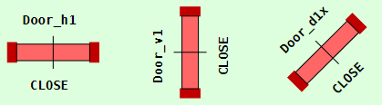
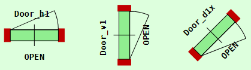

Last modified: 2022-01-08 <a name="up"></a>   
<table><tr><td></td><td>
<h1>How to draw doors and windows in a house plan? (CiDoor, CiWindow, CiBlind)</h1>
<a href="../README.md">==> Home page</a> &nbsp; &nbsp; &nbsp; 
<a href="./m4h565_Vue_ci_mqtt_door_etc.md">==> German version</a> &nbsp; &nbsp; &nbsp; 
</td></tr></table>
<a href="https://github.com/khartinger/mqtt4home/tree/main/source_Vue/vue65_ci_mqtt_door_etc">==> Code @ GitHub</a><hr>

## Target
This Vue project shows how to draw doors, windows and blinds in house plans or apartment floor plans. If the elements are monitored by MQTT switches etc., their state is drawn in the plan accordingly (open or closed).

The following picture shows examples of door, window and roller blind elements:   

   
_Fig. 1: Door, window and roller blind elements in open state_   

# Use of the elements
All elements have a square shape and are inserted inside the `<svg>` area (the `<template>` area) of a CI-Vue component by, for example, the following lines:   
```   
  <CiDoor :x="0.5*dx" :y="1.0*dy" sid="door_h1" dir="h1" :border="0"></CiDoor>
  <CiWindow :x="0.5*dx" :y="8.5*dy" sid="window_h1" dir="h1" :border="0"></CiWindow>
  <CiBlind :x="0.5*dx" :y="13.5*dy" sid="blind_v1" dir="v1" :border="1"></CiBlind>
```   

Where means   
* `x` and `y` are the coordinates of the center point.   
* `sid` is the ID of the symbol. It represents the connection to the element in the controller.   
* `dir` indicates the direction of the element and is described in more detail below.   
* `border` specifies whether the element is to be displayed without or with a border.   

The coding of the display of the elements is in the components `CiDoor.vue`, `CiWindow.vue` and `CiBlind.vue`. For each component there is also the corresponding controller, in which the individual elements must be enumerated.   

_Example for a door (from `CiDoorController.ts`):_   
```   
  public doors: Array<Door> = reactive(
    [
      {
        id: 'door_h1',
        name: 'Door_h1',
        iDoorState: 1,
        type: 'D1',
        text5: '?',
        subTopic: 'ci/door/11/ret/status ci/door/11/ret/voltage ci/door/x/ret/status',
        pubTopic: ''
      },
```   

_Example of a window (from `CiWindowController.ts`):_   
```   
  public windows: Array<Window> = reactive(
    [
      {
        id: 'window_h1',
        name: 'Window_h1',
        iWindowState: 1,
        type: 'D1',
        text5: '?',
        subTopic: 'ci/window/11/ret/status ci/window/x/ret/status',
        pubTopic: ''
      },
```   

_Example of a blind (from `CiBlindController.ts`):_   
```   
  public blinds: Array<Blind> = reactive(
    [
      {
        id: 'blind_h1',
        name: 'blind_h1',
        iBlindState: 1,
        type: 'D1',
        // iMotorState: -9,
        text5: '?',
        subTopic: 'ci/blind/11/ret ci/blind/11/ret/motor ci/blind/x/ret/status',
        pubTopic: ''
      },
```   

&nbsp;
## Common properties of the door, window and roller blind elements
## Direction of a symbol
The direction of a symbol is specified with the `dir` ("Direction") property.   

The __first letter__ specifies the base direction:   
* `h` or `H`: Horizontal (x-direction).   
* `v` or `V`: Vertical (y-direction)   
* `d` or `D`: Diagonal (inclined at +/- 45°)   

If a lowercase letter is used, the door opening/window opening/blind is drawn small, if an uppercase letter is used, it is drawn large (see _Fig. 1_).   

The __second letter__ indicates the "propagation" direction, or the quadrant in which the door/window opens or the blind is located. According to the 4 quadrants, the numbers 1 to 4 are possible.   

In the case of diagonal elements, a __third letter__ is required to indicate the "propagation" direction more precisely. This is done by specifying the axis to which an element "moves" when actuated and can be `x` or `y` accordingly.   

_Examples:_   
   
_Figure 2: Direction of symbols (closed, iDoorState = 0)_   
   
_Fig. 3: Direction of symbols (open, iDoorState = 1)_   

`dir="h1" ....` Horizontal symbol whose propagation (door, window opening) is in the first quadrant (towards "up").   
`dir="v1" ....` Vertical symbol, whose propagation (door, window opening) is in the first quadrant (to "right").   
`dir="d1x" ...` Diagonal symbol to the right-up, whose propagation (door, window opening) is in the direction of the x-direction (to "down").   

## Stretch factor f
All symbols can be stretched (symmetrically) while keeping the center of the symbol. The stretching is specified by the parameter 'f'.   
In the following example, the door symbol is stretched by a factor of 2. To make this easier to see, the default border has been drawn in (with `:border="1"`)   

   
`<CiDoor :x="1.0*dx" :y="6.8*dy" sid="door_h1" dir="h1" :f="2" text5=":f=&quot;2&quot;" :border="1"></CiDoor>`   
_Figure 4: Stretched door symbol_.   

## Text in line 5
In line 5 (`line5`) of the symbol different texts can be output:   
1. text specified when using the symbol with the `text5` parameter, e.g.   
  `<CiDoor :x="100" :y="100" sid="d1" dir="h1" text5="ABC">`.   
2. text entered in the controller under the `text5` property. If this text contains a question mark, it will be replaced by `OPEN`, `CLOSE` or `LOCK` (constant `textOpen`, `textClose` and `textLock` in `CiBase.vue`).   
  The text is centered and limited in length (`tmax_` in `CiBase.vue`).   
3. if the element contains a `battery` property, this value is displayed centered.   
Otherwise, no text is output.   
  

# Special properties
## Window shape (shape)
By default, open windows are drawn with an arc. By specifying `shape="rect"` a rectangle is drawn instead of the arc:   
   
_Fig. 5: Window shapes_   

## Roller blind with motor
The two rectangles can represent the state of any drive motor that may be present. The display is controlled by the variable `iMotorState`, which is influenced by MQTT messages in `onMessage`.   
* If the motor is in "up" mode (motor=1), the rectangles are displayed in yellow.   
* If the motor is in "down" mode (motor=-1), the rectangles are displayed in gold.   
* If the motor is at standstill (motor=0), the rectangles are displayed in gray.   
* If there is no motor information, e.g. because there is no motor drive in the roller blind, the rectangles are displayed in the wall color.   

## Direction for roller blinds
In the current version the symbols are the same for   
h1 = h2, h3 = h4, v1 = v3, v2 = v4, d1x = d3y, d1y = d3x, d2x = d4y, d2y = d4x

# Testing the symbols
The symbols in this project are designed to be controlled via MQTT commands. This requires an MQTT broker running on a server with address 10.1.1.1.   
_Examples_:
* Turning off all window icons is done by the following command:   
  `mosquitto_pub -h 10.1.1.1 -t ci/door/x/ret/status -m 0`   
* Switching on all window symbols is done with   
  `mosquitto_pub -h 10.1.1.1 -t ci/door/x/ret/status -m 1`   
* Switching off all window or shutter symbols is done similarly as above with   
  `mosquitto_pub -h 10.1.1.1 -t ci/window/x/ret/status -m 0`   
  or   
  `mosquitto_pub -h 10.1.1.1 -t ci/blind/x/ret/status -m 0`   
* Switching on (resetting) all symbols can be done by calling the page again, because the default value for all symbols in this example is 1 = "on".   

* For the roller blind 'blind_h1' it is also possible to simulate the display of the motor run.   
  * The "start up" of the roller blind is simulated by   
  `mosquitto_pub -h 10.1.1.1 -t ci/blind/11/ret/motor -m 1`   
  * The "down" of the shutter is simulated by   
  `mosquitto_pub -h 10.1.1.1 -t ci/blind/11/ret/motor -m -1`   
  * The "stopping" of the roller blind motor is simulated by   
  `mosquitto_pub -h 10.1.1.1 -t ci/blind/11/ret/motor -m 0`   

[To the top of the page](#up)   