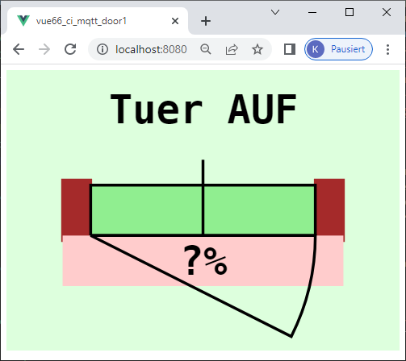
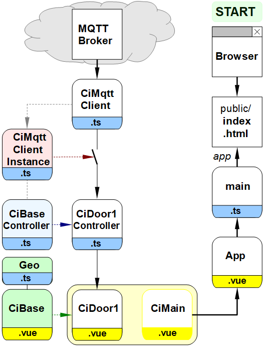
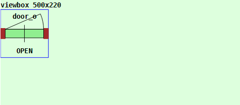
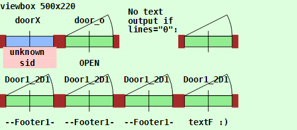

Letzte &Auml;nderung: 4.6.2023 <a name="up"></a>   
<table><tr><td></img></td><td>
<h1>Vue-MQTT: Webseite mit T&uuml;r-Symbol</h1>
<a href="../LIESMICH.md">==> Startseite</a> &nbsp; &nbsp; &nbsp; 
<a href="./m4h566_Vue_ci_mqtt_door1_e.md">==> English version</a> &nbsp; &nbsp; &nbsp; 
</td></tr></table>
<a href="https://github.com/khartinger/mqtt4home/tree/main/source_Vue/vue66_ci_mqtt_door1">==> Code @ GitHub</a><hr>

# Worum geht es?   
Dieses Projekt "Vue: MQTT Door1" beschreibt das Erstellen einer Webseite mit einem T&uuml;r-Symbol, das MQTT-Nachrichten empfangen kann und entsprechend die Darstellung &auml;ndert.   
Die Information &uuml;ber den T&uuml;rzustand (offen oder zu) kommt zB von einem  magnetische Zigbee-T&uuml;rkontakt MCCGQ11LM von Aqara, der &uuml;ber einen Zigbee-Dongle und zigbee2mqtt folgende MQTT-Nachricht schickt:   
```   
-t zb6/h6/T1 -m {"battery":100,"contact":false,"device_temperature":26,"linkquality":153,"power_outage_count":6889,"voltage":3035}
```   
Bei geschlossener T&uuml;re ist `"contact":true`   

   
_Bild 1: Webseite mit T&uuml;r-Symbol_   

## Diese Anleitung beantwortet folgende Fragen:   
1. [Welche Dinge ben&ouml;tige ich f&uuml;r dieses Projekt?](#a10)   
2. [Wie bringe ich dieses Beispiel auf meinem Rechner zum Laufen?](#a20)
3. [Wie kann ich das Projekt selbst erstellen?](#a30)   
4. [Wie wird das T&uuml;r-Symbol erstellt?](#a40)   

<a name="a10"></a>[_Zum Seitenanfang_](#up)   

# Welche Dinge ben&ouml;tige ich f&uuml;r dieses Projekt?

* Hardware: PC oder Laptop mit Internetzugang, Browser   
* Hardware: Raspberry Pi als Access Point (WLAN Raspi11, PW 12345678) mit der IP 10.1.1.1, auf dem ein MQTT-Broker l&auml;uft (zB Mosquitto).   
* Hardware: Zigbee-USB-Adapter, zB Sonoff Zigbee 3.0 USB Dongle Plus, der an einen USB-Port des Raspberry Pi angeschlossen ist.   
* Software: zigbee2mqtt, das auf dem Raspberry Pi l&auml;uft.   
* Software: Visual Studio Code ("VSC"), das f&uuml;r Vue-Anwendungen bereits vorbereitet ist.   
   (Dh. es wurde bereits mindestens eine Vue-Anwendung in Visual Code erstellt.)   
* Software: Die MQTT-Klient-Programme `mosquitto_sub` und `mosquitto_pub` (auf dem PC oder RasPi installiert).   

Sollte kein Zigbee-USB-Adapter vorhanden sein, so kann die MQTT-Nachricht auch mit Hilfe von `mosquitto_pub` folgenderma&szlig;en simuliert werden:   
```   
mosquitto_sub -h 10.1.1.1 -t zb6/h6/T1 -m "{\"battery\":100,\"contact\":false,\"device_temperature\":26,\"linkquality\":153,\"power_outage_count\":6889,\"voltage\":3035}""
```   

---   
<a name="a20"></a>[_Zum Seitenanfang_](#up)   

# Wie bringe ich das Projekt auf meinem Rechner zum Laufen?   

Eine M&ouml;glichkeit besteht darin, ein leeres VSC Projekt anzulegen, die Dateien von github herunterzuladen und in das VSC Projekt zu kopieren.   

<a name="a25"></a>   
## Wie lege ich ein leeres VSC Projekt an?
1. Visual Studio Code (VSC) starten.   
2. VSC: Terminal-Fenster &ouml;ffnen: Men&uuml; Terminal - New Terminal.   
3. VSC-Terminal: In den Ordner wechseln, unter dem das Vue-Projekt erzeugt werden soll, zum Beispiel:   
   `cd /c/work/test_vue`   
4. VSC-Terminal: Vue.js Applikation erzeugen: `vue create vue66_ci_mqtt_door1`  
   Mit Cursortasten, Leertaste und &lt;Enter&gt; Folgendes ausw&auml;hlen:   
   `> Manually select features` &nbsp; &lt;Enter&gt;   
   `(*) Choose Vue version`   
   `(*) Babel`   
   `(*) TypeScript`   
   `( ) Router`   
   `(*) Linter / Formatter`   
   &lt;Enter&gt;   
   _`> 3.x`_ &nbsp; &lt;Enter&gt;      
   _`? Use class-style component syntax?`_ &nbsp; __`N`__ &lt;Enter&gt;   
   _`? Use Babel alongside TypeScript (required for modern mode, auto-detected polyfills, transpiling JSX)?`_ &nbsp; __`N`__ &lt;Enter&gt;   
   _`? Use history mode for router? (Requires proper server setup for index fallback in production)`_ &nbsp; __`N`__ &lt;Enter&gt;   
   _`? Pick a linter / formatter config:`_ &nbsp; __`ESLint + Standard config`__ &lt;Enter&gt;   
   _`? Pick additional lint features: `_ &nbsp; __`Lint on save`__ &lt;Enter&gt;   
   _`? Where do you prefer placing config for Babel, ESLint, etc.?`_  &nbsp; __`In dedicated config file`__ &lt;Enter&gt;   
   _`? Save this as a preset for future projects? (y/N)`_ &nbsp; __`N`__ &lt;Enter&gt;   
5. In den Projektordner wechseln: _VSC Men&uuml; Datei - Ordner &ouml;ffnen_..   
   `c:/work/test_vue/vue66_ci_mqtt_door1` [Ordner ausw&auml;hlen]   
6. MQTT Bibliothek installieren:   
   VSC: Terminal-Fenster &ouml;ffnen: Men&uuml; Terminal - New Terminal.   
   `npm install mqtt --save`   

## Wie kann ich die Projekt-Dateien herunterladen?
Um sich das einzelne Herunterladen der Dateien zu ersparen, ist es am einfachsten, das ganze Projekt `mqtt4home` als zip-Datei herunterzuladen:   

1. Im Browser die Adresse (URL) [`https://github.com/khartinger/mqtt4home`](https://github.com/khartinger/mqtt4home) eingeben.   
2. Den Button [Code] anklicken, "Download ZIP" w&auml;hlen und im Auswahl-Fenster [*] Datei speichern [OK] ausf&uuml;hren.   

## Wie kann ich die heruntergeladenen Dateien ins VSC-Projekt kopieren?
1. Im Browser bei Download f&uuml;r die Datei __mqtt4home-main.zip__ "Datei &ouml;ffnen" anklicken (oder ins Download-Verzeichnis wechseln und dort die zip-Datei &ouml;ffnen).   
2. Im Explorer das Verzeichnis `mqtt4home-main/source_Vue/vue66_ci_mqtt_door1/src/` mit der rechten Maustaste anklicken und "Kopieren" w&auml;hlen.   
3. Ins Projektverzeichnis `c:/work/test_vue/vue66_ci_mqtt_door1` wechseln und dort die Dateien einf&uuml;gen (und dabei drei Dateien &uuml;berschreiben). Beim Einf&uuml;gen wird das Verzeichnis automatisch entpackt.   

## Wie kann ich das Projekt starten?
1. In VSC &uuml;ber den Men&uuml;punkt Terminal - New Terminal das Terminalfenster &ouml;ffnen (falls es nicht schon offen ist) und den eingebauten Server starten mit   
`npm run serve`   
2. Im Browser folgende Adresse (URL) eingeben:   
`localhost:8080`   
  Im Browser sollte _Bild 1_ (oben) angezeigt werden.   

Bet&auml;tigt man den T&uuml;rkontakt, so sollte sich das Symbol entsprechend &auml;ndern.   
(Oder die oben beschriebene MQTT-Nachricht selbst abschicken.)   

<a name="a30"></a>[_Zum Seitenanfang_](#up)   

# Wie kann ich das Projekt selbst erstellen?

## 1. Allgemeines
Das folgende Diagramm gibt einen &Uuml;berblick &uuml;ber die beteiligten Dateien:   

   
_Bild 2: &Uuml;bersicht &uuml;ber die beteiligten Dateien_   

Mit Hilfe des Diagrammes erkennt man einige wichtige Zusammenh&auml;nge:   

* Der rechte Zweig mit (Browser -->) index.html --> main.ts --> App.vue wird automatisch erstellt und muss etwas angepasst werden.   
* Die Datei `main.ts` erzeugt das App-Element, das in `index.html` angezeigt wird.   
* `App.vue` stellt `<CiMain>` dar und enth&auml;lt css-Elemente, die im gesamten Projekt verwendet werden k&ouml;nnen.   
* Das Grafik-Element `CiDoor1` besteht aus einem "Controller"- und "Grafik"-Teil (Erweiterung `.ts` bzw. `.vue`), welche von Basis-Komponenten abgeleitet werden.   
* Die Verbindung zum MQTT-Broker wird &uuml;ber die Dateien `CiMqttClient.ts` und `CiMqttClientInstance.ts` hergestellt, wobei alle Controller in der Datei `CiMqttClientInstance.ts` registriert werden m&uuml;ssen. Vergisst man dies, erh&auml;lt der Controller keine MQTT-Nachrichten ("Schalter offen").   

## 2. Anlegen des Vue-Projektes in VSC   
Siehe ["Wie lege ich ein leeres VSC Projekt an?"](#a25)   

## 3. Erg&auml;nzen der Vue-Konfiguration   
Erstellen der Datei `vue.config.js`: auf das Plus neben `VUE66_CI_MQTT_DOOR1` klicken, Namen eingeben.   
_Inhalt der Datei_:   
```   
// ______vue.config.js__________________________________________
module.exports = {
  lintOnSave: false,
  publicPath: './',
  // publicPath: process.env.NODE_ENV === 'production' ? './vue_pubsub2/' : './',
  configureWebpack: {
    devtool: 'source-map'
  },
  chainWebpack: config => {
    config.performance
      .maxEntrypointSize(400000)
      .maxAssetSize(400000)
  }
}
```   
Mit `publicPath: './',` wird die relative Pfadangabe eingestellt und durch den `chainWebpack`-Eintrag werden Warnhinweise bez&uuml;glich der Dateigr&ouml;&szlig;e vermieden (indem man die maximale Dateigr&ouml;&szlig;en h&ouml;her setzt ;) )

## 4. Linter-Warnung "Unexpected any" bei "(value: any)" abstellen    
  In der Datei `.eslintrc.js` unter "`rules: {`" erg&auml;nzen:   
```   
  '@typescript-eslint/no-explicit-any': 'off',
  '@typescript-eslint/explicit-module-boundary-types': 'off',
```   

## 5. Datei `App.vue` anpassen   
Die Datei `src/App.vue` ist f&uuml;r folgende Punkte zust&auml;ndig:   
  * Anzeige der Komponente `CiMain`.
  * Definition von einheitlichen Styles f&uuml;r alle Seiten.   

_Inhalt der Datei_:   
```   
<!-- App.vue -->
<template>
  <CiMain></CiMain>
</template>

<script lang="ts">
import { defineComponent } from 'vue'
import CiMain from '@/components/CiMain.vue'

export default defineComponent({
  name: 'App',
  components: {
    CiMain
  }
})
</script>

<style>
#app {
  font-family: Avenir, Helvetica, Arial, sans-serif;
  text-align: left;
  color: black;
  margin-top: 0px;
}
</style>
```   

## 6. Klasse mit Geometrie-Daten erzeugen
* Erstellen des Verzeichnisses "classes"   
  Mit der rechten Maustaste auf das Verzeichnis `src` klicken, "Neuer Ordner" w&auml;hlen und den Namen `classes` eingeben.   
* Erstellen der Datei `CiMqttClient.ts`   
  * Mit der rechten Maustaste auf das Verzeichnis `classes` klicken, "Neue Datei" w&auml;hlen und den Namen `Geo.ts` eingeben.   
  * Inhalt der Datei:   
```   
// ______Geo.ts__________________________________khartinger_____
// 2023-01-02: new
// 2023-01-25: add class Geof (factor to resize), colorUnknown
// 2023-01-31: update y2()
// 2023-02-02: update calcLinemax()

// -----------font data-----------------------------------------
// examples: fh_=11, tmax_=10 or 16/13, ...
const fh_ = 11 //            font height [pixel]
const tmax_ = 10 //        max number character per line
// -----------y direction---------------------------------------
const dyl_ = Math.round(0.5 + 22 * fh_ / 14) //  line hight
const dyi_ = 5 * dyl_ //                         inner hight
const dyi2_ = Math.round(dyi_ / 2) //            half dyi_
const dyo_ = 10 * Math.round(0.5 + dyi_ / 10) // outer hight
const dyo2_ = Math.round(dyo_ / 2) //            center dy
const dym_ = Math.round((dyo_ - dyi_) / 2) //    top margin
const dyt_ = Math.round(0.5 + 17 / 14 * fh_) //  text start y
// -----------x direction---------------------------------------
const dxo_ = dyo_ //                             outer width
const dxo2_ = Math.round(dyo_ / 2) //            half outer width
const dxm_ = dym_ //                             left margin
const dxi_ = dxo_ - 2 * dxm_ //                  inner width
const dxi2_ = dxo2_ - dxm_ //                    half dxi_
const dxt_ = Math.round(0.5 + fh_ / 14 + 18 / 14) // text-border
const dw2_ = Math.round(dyl_ / 2) //             half wall thickness

// *************************************************************
// Geometric data for drawing a CI symbol (without stretching)
// *************************************************************

export class Geo {
  // =========special values====================================
  public colorOk = '#CCFFCC' //        light green 2
  public colorNotOk = '#FFCCCC' //     light red
  public colorError = '#FF3333' //     red
  public colorAlarm = '#FF3333' //     red
  public colorOn = '#FFFF66' //        yellow
  public colorOn2 = '#FFD700' //       gold
  public colorOff = '#D0D0D0' //       light grey
  public colorOff2 = '#505050' //      dark grey
  // public colorUnknown = '#add8e6' //   light blue
  public colorUnknown = '#90bbff' //   middle blue
  public colorBackground = '#DDFFDD' // very light green
  public colorOpen = '#90ee90' //      light green
  public colorClose = '#FF6666' //     light red
  public colorLock = '#C00000' //      red
  public colorWall = '#600000' //      dark red 6
  public noDate = '--.--.----'
  public noTime = '--:--:--'
  public batteryMin = 15
  // ---------texts in different languages----------------------
  public textOpen = 'AUF' // 'AUF' //    OPEN
  public textClose = 'ZU' // 'ZU' //    CLOSE
  public textLock = 'SPERRE' // 'SPERRE' // LOCK

  // =========relative geometric values=========================
  // ---------font data-----------------------------------------
  public fh = fh_ //              font height [pixel]
  public tmax = tmax_ //          max number character per line
  // ---------y direction---------------------------------------
  public dyl = dyl_ //            line hight
  public dym = dym_ //            top margin
  public dyt = dyt_ //            text start in y direction
  // ---------x direction---------------------------------------
  public dxm = dxm_ //            left margin
  public dxt = dxt_ //            text start in x direction
  // ---------other dimensions----------------------------------
  public dw2 = dw2_ //            half wall thickness

  // =========absolute geometric values=========================
  // ---------center of symbol----------------------------------
  public x = 0 //                 x value of center
  public y = 0 //                 y value of center

  // =========methods===========================================
  // _________constructor: (x/y) is center of square____________
  constructor (x_: number, y_: number) {
    this.x = x_
    this.y = y_
  }

  // ---------drawing center of symbol--------------------------
  public xc (): number { return this.x }
  public yc (lines_ = 0): number {
    if (lines_ === 1) return this.y + this.dyl / 2
    return this.y
  }

  // ---------width and height of outer rectangle---------------
  public dxo (): number { return dxo_ }
  public dyo (): number { return dyo_ }

  // ---------half width and height of outer rectangle----------
  public dxo2 (): number { return dxo2_ }
  public dyo2 (): number { return dyo2_ }

  // ---------width and height of inner rectangle---------------
  public dxi (): number { return dxi_ }
  public dyi (): number { return dyi_ }

  // ---------half width of inner rectangle---------------------
  public dxi2 (): number { return dxi2_ }
  public dyi2 (): number { return dyi2_ }

  // ---------coordinates of upper left corners-----------------
  public x0 (): number { return (this.x - this.dxo2()) }
  public y0 (): number { return (this.y - this.dyo2()) }
  public x1 (): number { return (this.x - this.dxi2()) }
  public y1 (): number { return (this.y - this.dyi2()) }

  // ---------x value for rectangle 1...(5)---------------------
  public xr (): number { return this.x1() }
  public xr2 (fx_ = 1): number { return this.x1() + fx_ * this.dxo() / 2 - this.dxm }

  // ---------calculate y start value of rectangle 1...(5)------
  public yr (linenum: number): number {
    // if (linenum < 1 || linenum > 5) linenum = 1
    if (linenum < 1) linenum = 1
    // ??return ((this.y - this.dyi2()) + (linenum - 1) * this.dyl)
    return (this.y1() + (linenum - 1) * this.dyl)
  }

  // ---------x start value for text line 1...(5)---------------
  public xt (): number { return (this.x + -dxi2_ + dxt_) }
  public xt2 (fx_ = 1): number { return (this.xt() + fx_ * this.dxi2()) }

  // ---------calculate y start value of text 1...(5)-----------
  public yt (linenum: number): number {
    // if (linenum < 1 || linenum > 5) linenum = 1
    if (linenum < 1) linenum = 1
    return (this.y - dyi2_ + dyt_ + (linenum - 1) * this.dyl)
  }

  // ---------calculate y start value of top line---------------
  // same as yt(1)
  public ytHeader (): number {
    return (this.y - dyi2_ + dyt_)
  }

  // ---------calculate y start value of center line------------
  public ytCenter (lines_ = 0): number {
    return this.yc(lines_) - this.dyl / 2 + this.dyt
  }

  // ---------calculate y start value of last (bottom) line-----
  public ytFooter (): number {
    return this.y1() + this.dyi() - this.dyl + this.dyt
  }

  // =========text methods======================================
  // ---------trim text to line length--------------------------
  public checkLen (text: string, fx_ = 1): string {
    const len = text.length
    if (len < 1) return ''
    const tmax_ = this.calctmax(fx_)
    if (len >= tmax_) return text.substring(0, tmax_)
    return text
  }

  // ---------center text (or trim text to line length)---------
  public center (text: string, fx_ = 1): string {
    const len = text.length
    if (len < 1) return ''
    const tmax_ = this.calctmax(fx_)
    if (len >= tmax_) return text.substring(0, tmax_)
    const numBlank = Math.round((tmax_ - len - 1) / 2)
    // console.log('center: text=', '|' + text + '| numBlank=' + numBlank)
    const s1 = text.padStart(numBlank + len, ' ')
    return s1
  }

  // ---------calculate chars per line depending on fx----------
  public calctmax (fx_: number): number {
    return Math.trunc(11.9 * fx_ - 1.7)
  }

  // ---------calculate number of lines depending on fy---------
  public calcLinemax (fy_ = 1): number {
    return Math.trunc((fy_ * dyo_ - 2 * this.dym) / this.dyl)
  }
}

// *************************************************************
// Geometric data for stretching a CI symbol
// *************************************************************

export class Geof extends Geo {
  // =========stretch factors===================================
  public fx = 1 //                     stretching factor x
  public fy = 1 //                     stretching factor y

  // =========methods===========================================
  // _________constructor: (x/y) is center of square____________
  constructor (x_ = 0, y_ = 0, fx_ = 1, fy_ = 1) {
    super(x_, y_)
    this.fx = fx_
    this.fy = fy_
  }

  // ---------x coordinate of new drawing center----------------
  public xc (): number {
    return (this.x - super.dxo2() + this.dxo2())
  }

  // ---------y coordinate of new drawing center----------------
  public yc (lines_ = 0): number {
    if (lines_ === 1) return this.y - super.dyo2() + this.dyo2() + this.dyl / 2
    return this.y - super.dyo2() + this.dyo2()
  }

  // ---------width and height of outer rectangle---------------
  public dxo (): number { return (this.fx * super.dxo()) }
  public dyo (): number { return (this.fy * super.dyo()) }

  // ---------half width and height of outer rectangle----------
  public dxo2 (): number { return (this.fx * super.dxo() / 2) }
  public dyo2 (): number { return (this.fy * super.dyo() / 2) }

  // ---------width and height of inner rectangle---------------
  public dxi (): number { return (this.fx * super.dxo() - 2 * this.dxm) }
  public dyi (): number { return (this.fy * super.dyo() - 2 * this.dym) }

  // ---------half width of inner rectangle---------------------
  public dxi2 (): number { return (this.fx * super.dxo() / 2 - this.dxm) }
  public dyi2 (): number { return (this.fy * super.dyo() / 2 - this.dym) }

  // ---------coordinates of upper left corners-----------------
  public x0 (): number { return (this.x - super.dxo2()) }
  public y0 (): number { return (this.y - super.dyo2()) }
  public x1 (): number { return (this.x - super.dxi2()) }
  public y1 (): number { return (this.y - super.dyi2()) }

  // ---------coordinates of lower right corners----------------
  public x2 (): number { return (this.x - super.dxo2() + this.dxo() - this.dxm) }
  public y2 (): number { return (this.y - super.dyo2() + this.dyo() - this.dym) }
  public x3 (): number { return (this.x - super.dxo2() + this.dxo()) }
  public y3 (): number { return (this.y - super.dyo2() + this.dyo()) }

  // ---------x value for rectangle 1...(5)---------------------
  public xr (): number { return this.x1() }
  public xr2 (): number { return this.x1() + this.dxi2() }

  // ---------calculate y start value of rectangle 1...(5)------
  public yr (linenum: number): number { return super.yr(linenum) }

  // ---------x start value for text line 1...(5)---------------
  public xt (): number { return super.xt() }
  public xt2 (): number { return (super.xt() + this.dxi2()) }

  // ---------calculate y start value of text 1...(5)-----------
  public yt (linenum: number): number { return super.yt(linenum) }

  // ---------calculate y start value of top line---------------
  public ytHeader (): number { return super.ytHeader() }

  // ---------calculate y start value of center line------------
  public ytCenter (lines_ = 0): number {
    return this.yc(lines_) - this.dyl / 2 + this.dyt
  }

  // ---------calculate y start value of last (bottom) line-----
  public ytFooter (): number {
    return this.y1() + this.dyi() - this.dyl + this.dyt
  }

  // =========text methods======================================
  // ---------trim text to line length--------------------------
  public checkLen (text: string): string { return super.checkLen(text, this.fx) }

  // ---------center text (or trim text to line length)---------
  public center (text: string): string { return super.center(text, this.fx) }

  // ---------calculate chars per line depending on fx----------
  public calctmax (): number { return super.calctmax(this.fx) }

  // ---------calculate number of lines depending on fy---------
  public calcLinemax (): number { return super.calcLinemax(this.fy) }
}

export const geo0 = new Geo(0, 0)
export const geo0f = new Geof(0, 0, 1, 1)
```   

## 7. Nicht ben&ouml;tigte Dateien und Verzeichnisse l&ouml;schen   
  * Datei `components/HelloWorld.vue` l&ouml;schen   
  * Verzeichnis `assets` l&ouml;schen   

## 8. MQTT-Funktionalit&auml;t einbauen
* Erstellen des Verzeichnisses "services"   
  Mit der rechten Maustaste auf das Verzeichnis `src` klicken, "Neuer Ordner" w&auml;hlen und den Namen `services` eingeben.   
* Erstellen der Datei `CiMqttClient.ts`   
  * Mit der rechten Maustaste auf das Verzeichnis `services` klicken, "Neue Datei" w&auml;hlen und den Namen `CiMqttClient.ts` eingeben.   
  * Inhalt der Datei zB von [GitHub holen](https://github.com/khartinger/mqtt4home/blob/main/source_Vue/vue10_ci_mqtt_mini/src/services/CiMqttClient.ts), hineinkopieren und Datei speichern.   
  Die Datei enth&auml;lt alle Programmteile f&uuml;r die MQTT-Funktionalit&auml;t.   
* Erstellen der Datei `CiMqttClientInstance.ts`
* Mit der rechten Maustaste auf das Verzeichnis `services` klicken, "Neue Datei" w&auml;hlen und den Namen `CiMqttClientInstance.ts` eingeben.   
  Inhalt der Datei:   
```   
// ______CiMqttClientInstance.ts_________________khartinger_____
// 2023-06-04 New
import { CiMqttClient } from './CiMqttClient'
import { ciDoor1Controller } from '@/controller/CiDoor1Controller'

export const ciMqttClientInstance = new CiMqttClient(true)
ciMqttClientInstance.registerController(ciDoor1Controller)
```   

  * Festlegen, dass beim Start der App eine Verbindung zum Broker hergestellt werden soll (Konstruktor-Wert `true`).   
  * Registrierung des `ciDoor1Controller`, damit dieser Zugriff auf die MQTT-Nachrichten hat.   

## 9. Startbildschirm CiMain.vue erstellen
* Erstellen der Datei `CiMain.vue`   
  * Mit der rechten Maustaste auf das Verzeichnis `components` klicken, "Neue Datei" w&auml;hlen und den Namen `CiMain.vue` eingeben.   
  Inhalt der Datei:   
```   
<!-- CiMain.vue (vue66_ci_mqtt_door1)-------------khartinger -->
<!-- 2023-06-04 new                                          -->
<template>
  <svg width="100%" viewBox="0 0 100 100">
  <rect class="ciBackground" x="0" y="0" width="100" height="100" />
  <CiDoor1 :x="0" :y="0" sid="h6T1" dir="h1" :border="0"></CiDoor1>
</svg>
</template>

<script lang="ts">
import { defineComponent } from 'vue'
import CiDoor1 from './CiDoor1.vue'

export default defineComponent({
  name: 'CiMain',
  components: {
    CiDoor1
  }
})
</script>

<style>
</style>
```   

## 10. Basis-Anzeigeelement (`CiBase.vue`) erzeugen

Die Basis-Ansicht `CiBase.vue` ist f&uuml;r die Darstellung gemeinsamer Eigenschaften aller Symbole zust&auml;ndig:   
1. Zeichnen eines Rahmens um das Symbol oder nicht (`border = 2 | 1 | 0`)   
2. Bereitstellung von Geometriedaten zum Zeichnen eines Symbols. Diese werden in der Klasse `Geo` festgelegt.    

   
_Bild 3: Geometriedaten eines CI-Symbols_   

### Anmerkungen zur Geometrie der Symbole
* Symbole sind im Normalfall quadratisch (Standard-Symbol).   
* Der Positionierpunkt jedes Symbols ist das Zentrum (x/y).   
* Die Gr&ouml;&szlig;e eines Symbols ist abh&auml;ngig von der Gr&ouml;&szlig;e der Schrift (zB font height `fh_ = 11`). Daraus ergibt sich auch die Anzahl der Zeichen pro Zeile (zB `tmax_ = 14`).   
* Symbole k&ouml;nnen sowohl in x- als auch y-Richtung gestreckt werden.   
* Jedes Symbol hat ein Au&szlig;enma&szlig; (`dxo`, `dyo`) und ein Innenma&szlig; (`dxi`, `dyi`). Daraus ergibt sich ein (gelber) Rand, der auch nicht sichtbar dargestellt werden kann.   
* Die linke obere Au&szlig;en-Ecke hat die Koordinaten (x0/y0).   
* Die linke obere Innen-Ecke hat die Koordinaten (x1/y1).   
* Die f&uuml;nf Rechtecke haben den Startpunkt (xr/yr(i))   
mit i als Nummer des Rechtecks von 1 bis 5.   
* Die f&uuml;nf Texte haben den Startpunkt (xt/yt(i))   
mit i als Nummer des Textes von 1 bis 5.   
* Standard-Symbole enthalten normalerweise f&uuml;nf Text-Zeilen (Zeilenh&ouml;he `dyl`).   
* Die Zeile 2 kann auch in zwei Teile zerlegt werden.   

* Erstellen der Datei `CiBase.vue`   
  * Mit der rechten Maustaste auf das Verzeichnis `components` klicken, "Neue Datei" w&auml;hlen und den Namen `CiBase.vue` eingeben.   
_Codierung_:   
```   
<!-- CiBase.vue -----------------------------khartinger----- -->
<!-- 2022-01-08 New                                          -->
<!-- 2022-08-14 Add fx, fy, calctmax                         -->
<!-- 2023-01-02 Class Geo moved to a separate file Geo.ts    -->
<!-- 2023-01-25 new rectangle drawing (area no filled)       -->
<!-- 2023-01-31 update drawBorderFill                        -->
<!-- 2023-02-25 add .ciFont1_5, .ciFont3, .ciFont4, .ciFont5 -->
<template>
  <!-- filled border between out and in line---------------- -->
  <path v-if="borderFill" :d="drawBorderFill" class="ciOut"/>
  <!--border: outer and inner rectangle--------------------- -->
  <rect v-if="borderIn" class="ciIn0"  :x="geo.x1()" :y="geo.y1()" :width="fx*geo.dxo()-2*geo.dxm" :height="fy*geo.dyo()-2*geo.dym" />
  <rect v-if="borderOut" class="ciOut0" :x="geo.x0()" :y="geo.y0()" :width="fx*geo.dxo()" :height="fy*geo.dyo()" />
</template>

<script lang="ts">
import { defineComponent } from 'vue'
import { Geo } from '../classes/Geo'
import '@/services/CiMqttClientInstance'

export default defineComponent({
  name: 'CiBase',
  props: {
    x: {
      type: Number,
      required: true
    },
    y: {
      type: Number,
      required: true
    },
    border: {
      type: Number,
      required: false,
      default: 1
    },
    fx: {
      type: Number,
      required: false,
      default: 1
    },
    fy: {
      type: Number,
      required: false,
      default: 1
    }
  },
  emits: ['onClk'],
  computed: {
    geo: function (): Geo {
      const geo1 = new Geo(this.x, this.y)
      return geo1
    },
    borderFill: function (): boolean {
      if (this.border) {
        if (this.border === 3) return true
      }
      return false
    },
    borderOut: function (): boolean {
      if (this.border) {
        if (this.border === 1) return true
      }
      return false
    },
    borderIn: function (): boolean {
      if (this.border) {
        if (this.border === 2) return true
        if (this.border === 3) return true
      }
      return false
    },
    // -------draw yellow border--------------------------------
    drawBorderFill: function (): string {
      // let s1 = 'M' + this.x + ',' + this.y
      const dxof_ = this.geo.dxo() * this.fx
      const dyof_ = this.geo.dyo() * this.fy
      const dxif_ = dxof_ - 2 * this.geo.dxm
      const dyif_ = dyof_ - 2 * this.geo.dym
      let s1 = 'M' + this.geo.x + ',' + this.geo.y
      s1 += ' m-' + this.geo.dxo2() + ',-' + this.geo.dyo2()
      s1 += ' v' + dyof_ + ' h' + dxof_
      s1 += ' v-' + dyof_ + ' h-' + (dxof_ - this.geo.dxm - 1)
      s1 += ' v' + this.geo.dym + ' h' + (dxif_ - 1)
      s1 += ' v' + dyif_ + ' h-' + (dxif_ - 1)
      s1 += ' v-' + (dyif_ + this.geo.dym) + ' z'
      return s1
    }
  },
  mounted: function (): void {
    // ciMqttClientInstance.init()
  },
  methods: {
  }
})
</script>

<style>
  .ciFont1   { font-size: 14px; fill: black; font-weight: bold; font-family: "DejaVu Sans Mono","monospace"; white-space: pre; }
  .ciFont1_5 { font-size: 21px; fill: black; font-weight: bold; font-family: "DejaVu Sans Mono","monospace"; white-space: pre; }
  .ciFont2   { font-size: 28px; fill: black; font-weight: bold; font-family: "DejaVu Sans Mono","monospace"; white-space: pre; }
  .ciFont2_5 { font-size: 35px; fill: black; font-weight: bold; font-family: "DejaVu Sans Mono","monospace"; white-space: pre; }
  .ciFont3   { font-size: 42px; fill: black; font-weight: bold; font-family: "DejaVu Sans Mono","monospace"; white-space: pre; }
  .ciFont4   { font-size: 56px; fill: black; font-weight: bold; font-family: "DejaVu Sans Mono","monospace"; white-space: pre; }
  .ciFont5   { font-size: 70px; fill: black; font-weight: bold; font-family: "DejaVu Sans Mono","monospace"; white-space: pre; }
  .ciFont1k  { font-size: 16px; fill: red; font-weight: bold; font-style: italic; font-family: "DejaVu Sans Mono","monospace"; white-space: pre; }
  .ciFontRoom { font-size: 28px; fill: green; font-weight: bold; font-family: "DejaVu Sans Mono","monospace"; white-space: pre; }
  .fontOK    { font-weight: bold; color: lightgreen; }
  .fontNOK   { font-weight: bold; color: red; }
  .cursor    { cursor: pointer; }
  .ciBackground {fill: #ddFFdd; }
  .ciOut     { fill: yellow; stroke: yellow; stroke-width: 1; }
  .ciOut0    { fill: none; stroke: blue; stroke-width: 1; }
  .ciIn0      { fill: none; stroke:blue; stroke-width: 1; }
  .ciLine    { stroke: blue; stroke-width: 1; }
  .ciRect    { fill: none; stroke: blue; stroke-width: 1; }
  .ciFillIt  { stroke: blue; stroke-width: 1; }
  .ciClick   { fill-opacity: 0.0; stroke-width: 1; }
  .ciBorder  { fill-opacity: 0.0; stroke: blue; stroke-width: 1; }
</style>
```   

## 11. Basis-Steuerelement (`CiBaseController.ts`) erzeugen
Die Datei `CiBaseController.ts` muss im Normalfall nicht ver&auml;ndert werden. Sie definiert im Interface `IBase` einige Eigenschaften, die alle (abgeleiteten) `CiXxxController` haben sollten. Die wichtigste Eigenschaft ist dabei die Symbol-ID `sid`, die die Verbindung zwischen einer Darstellung und den Daten im Controller darstellt.   

In der (abstrakten) Klasse `CiBaseController` werden dann die Methoden `registerClient`, `publish` und `onMessage(message: Message)` definiert.   

* Erstellen der Datei `CiBaseController.ts`   
  * Mit der rechten Maustaste auf das Verzeichnis `controller` klicken, "Neue Datei" w&auml;hlen und den Namen `CiBaseController.ts` eingeben.   
_Codierung_:   
```   
// ______CiBaseController.ts_____________________khartinger_____
// 2022-01-01: new
import { Message, CiMqttClient } from '@/services/CiMqttClient'
import type { QoS } from 'mqtt'

export interface IBase {
  id: string;
  name?: string;
  subTopic: string;
  pubTopic: string;
  pubPayload?: string;
}

export abstract class CiBaseController {
  protected client: CiMqttClient | null = null;

  public registerClient (mqttClient: CiMqttClient): void {
    this.client = mqttClient
  }

  protected async publish (topic: string, payload: string, retain: boolean, qos: QoS): Promise<void> {
    return this.client?.publish(topic, payload, retain, qos)
  }

  public abstract onMessage(message: Message): void;
}
```   

<a name="a40"></a>[_Zum Seitenanfang_](#up)   

# Wie wird das T&uuml;r-Symbol erstellt?   

## Eigenschaften des T&uuml;r-Symbols
### CiDoor1-Aufruf
Das Zeichnen eines CiDoor1-Symbols erfolgt im `<template>`-Bereich der Darstellungsdatei (zB in `CiMain.vue`) durch das Tag `<CiDoor1>` und die Angabe weiterer Attribute.   
_Beispiel_:   
```   
<CiDoor1 :x="50" :y="70" sid="door_o" dir="h1"></CiDoor1>
```   

### Positionierung eines Symbols (:x, :y)
Im Normalfall sind CI-Symbole 100x100 Einheiten gro&szlig; und der Mittelpunkt (50/50) dient zur Positionsangabe (Platzierungspunkt). Ist der Zeichenbereich zB durch   
`<svg width="100%" viewBox="0 0 500 220">`   
definiert, so bewirkt die Ortsangabe `:x="50" :y="70"`, dass das CiDoor1-Symbol an den linken Rand grenzt und 20 Einheiten vom oberen Rand entfernt ist:   
   
_Bild 4: Ort eines CiDoor1-Symbols_   

_Anmerkung_:   
Restlicher Platz unten: 220 - 20 - 100 = 100 Einheiten   
Restlicher Platz rechts: 500 - 100 = 400 Einheiten   

### ID eines Symbols (sid)
Die Symbol-ID (sid) stellt die Verbindung zwischen der grafischen Darstellung und dem Controller dar (siehe Eigenschaft [id](#id) im Kapitel "[Im Basis-Controller definierte Attribute](#id)")   
Wird `sid=""` gesetzt, werden keine Texte und Hintergr&uuml;nde angezeigt.   

### Rand eines Symbols (:border)
Normalerweise sind CI-Symbole au&szlig;en 100x100 Einheiten gro&szlig; und haben nach innen einen fixen Rand von 5 Einheiten. Beim CiWall1-Symbol ist dies anders:   
Damit nebeneinander liegende Symbole in einem 100er Raster eine kontinuerliche Darstellung bewirken, gehen die `CiDoor1`-Symbole bis an die Symbolgrenze, sind also ausnahmsweise 100x100 Einheiten gro&szlig;.   
Im Normalfall wird der Rand der `CiDoor1`-Symbole nicht dargestellt. Will man den Rand ausnahmsweise darstellen, so gibt es dazu vier M&ouml;glichkeiten, die &uuml;ber das Attribut `:border=` eingestellt werden:   

| Parameter     | Bedeutung                      |   
| ------------- | ------------------------------ |   
| `:border="0"` | Es wird kein Rand dargestellt. |   
| `:border="1"` | Es wird nur der &auml;u&szlig;ere Rand des Symbols dargestellt (= gesamter Platzbedarf des Symbols). |   
| `:border="2"` | Es wird nur der innere Rand des Symbols dargestellt (= der Zeichenbereich f&uuml;r das Symbol). |   
| `:border="3"` | Es wird der Rand des Symbols gelb angezeigt. |   

Vorgabe ist `:border="0"`   

### Richtung des CiDoor1-Symbols (dir)
Die Richtung eines Symboles wird mit der Eigenschaft `dir` ("Direction") festgelegt.   

Der __erste Buchstabe__ gibt die Basis-Richtung an:   
* `h` oder `H`: Horizontal (waagrecht, x-Richtung)   
* `v` oder `V`: Vertikal   (senkrecht, y-Richtung)   
* `d` oder `D`: Diagonal (unter +/- 45° geneigt)   

Bei Verwendung eines Kleinbuchstabens wird die T&uuml;r&ouml;ffnungsrichtung klein gezeichnet, bei einem Gro&szlig;buchstaben gro&szlig; (siehe _Bild 1_)   

Der __zweite Buchstabe__ gibt die &Ouml;ffnungsrichtung an, das ist der Quadrant, in den sich die T&uuml;re hinein &ouml;ffnet. Entsprechend den 4 Quadranten sind die Ziffern 1 bis 4 m&ouml;glich.   

   
_Bild 5: Richtungsbezeichnungen bei Symbolen in Achsenrichtung_   

Bei diagonalen Elementen ist ein __dritter Buchstabe__ erforderlich, um die "Ausbreitungs"-Richtung genauer anzugeben. Der erste Buchstabe ist ein `d` (f&uuml;r Diagonale), der zweite Buchstabe gibt die Diagonalenrichtung f&uuml;r das Symbol an (`1` bis `4`) und der dritte Buchstabe bezeichnet die Achse, zu der sich ein Element hin &ouml;ffnet (`x` oder `y`).   

   
_Bild 6: Richtungsbezeichnungen bei Symbolen in Diagonalrichtung_   

__Beispiele f&uuml;r Bezeichnungen:__   
`dir="h1" ....` Waagrechtes Symbol, dessen Ausbreitung (T&uuml;r&ouml;ffnung) in den ersten Quadranten erfolgt (nach "oben").   
`dir="v1" ....` Senkrechtes Symbol, dessen Ausbreitung (T&uuml;r&ouml;ffnung) in den ersten Quadranten erfolgt (nach "rechts").   
`dir="d1x" ...` Diagonales Symbol nach rechts-oben, dessen Ausbreitung (T&uuml;r&ouml;ffnung) in Richtung der x-Richtung erfolgt (nach "unten").   

### Textangaben im CiDoor1-Symbol (lines)
Jedes `CiDoor1`-Symbol kennt drei m&ouml;gliche Zeilen zur Textausgabe:   
* Kopfzeile   
* Zeile 4   
* Fu&szlig;zeile   

Welche Texte im Symbol wirklich angezeigt werden, h&auml;ngt vom Wert des Attributs `lines=` ab:    
| Parameter     | Bedeutung                      |   
| ------------- | ------------------------------ |   
| `lines="0"`   | Weder Kopfzeile noch Fu&szlig;zeile werden angezeigt. |   
| `lines="1"`   | Die Kopfzeile wird angezeigt. Ist im Controller der Parameter `name` definiert, so wird dieser Text angezeigt, ansonsten die `id`. |   
| `lines="2"`   | Kopf- und Fu&szlig;zeile werden angezeigt.   |   

Vorgabe ist `lines="2"`   

#### Kopfzeile
1. Wird im Symbol das Attribut `lines="0"` gesetzt, wird die Kopfzeile nicht angezeigt.   
2. Ist im Controller der Parameter `name` definiert, so wird dieser Text angezeigt.   
3. Enth&auml;lt der Parameter `name` ein Fragezeichen, so wird dieses je nach T&uuml;rstatus durch den Text `OPEN`, `CLOSE`  oder `LOCK` ersetzt.   
4. Ansonsten wird die `id` angezeigt.   

#### Zeile 4
1. Wird im Symbol das Attribut `lines="0"` gesetzt, wird die Zeile 4 nicht angezeigt.   
2. Passt die Id des Symbols (`sid`) zu keinem Eintrag in der Liste `public door1s: Array<Door1>` (Datei `CiDoor1Controller.ts`), so wird "`unknown`" angezeigt.   
3. Gibt es einen Wert f&uuml;r den MQTT-Key `battery`, so wird dieser Wert angezeigt.   
4. Ansonsten wird eine leere Zeile ausgegeben.   

#### Fu&szlig;zeile
1. Wird im Symbol das Attribut `lines="0"` oder `lines="1"` gesetzt, wird die Fu&szlig;zeile nicht angezeigt.   
2. Passt die Id des Symbols (`sid`) zu keinem Eintrag in der Liste `public door1s: Array<Door1>` (Datei `CiDoor1Controller.ts`), so wird "`sid`" angezeigt.   
3. Wird im Symbol das Attribut `textF=` verwendet, so wird dieser Text angezeigt.   
4. Ist im Controller der Parameter `textFooter` definiert, so wird dieser Text angezeigt.   
5. Enth&auml;lt der Parameter `textFooter` ein Fragezeichen, so wird dieses je nach T&uuml;rstatus durch den Text `OPEN`, `CLOSE`  oder `LOCK` ersetzt.   
6. Ansonsten wird eine leere Zeile ausgegeben.   

   
_Bild 7: Verschiedene Fu&szlig;zeilen_   

__Codierungsbeispiel__:   
```   
    <CiDoor1 :x="50"  :y="70" sid="doorX" dir="h1"></CiDoor1>
    <CiDoor1 :x="150" :y="70" sid="door_o" dir="h1"></CiDoor1>
    <CiDoor1 :x="350" :y="70" sid="door_o" dir="h1" lines="0"></CiDoor1>
    <CiDoor1 :x="50"  :y="170" sid="doorF" dir="h1"></CiDoor1>
    <CiDoor1 :x="150" :y="170" sid="doorF" dir="h1"></CiDoor1>
    <CiDoor1 :x="250" :y="170" sid="doorF" dir="h1"></CiDoor1>
    <CiDoor1 :x="350" :y="170" sid="doorF" dir="h1" textF="textF :)"></CiDoor1>
```   

### Strecken eines Symbols (:f)
Standardm&auml;&szlig;ig sind alle Symbole 100x100 Einheiten gro&szlig;. Es ist jedoch m&ouml;glich, das Symbol (beidseitig) zu strecken, sodass der Platzierungspunkt gleich bleibt.   
Das Strecken erfolgt durch Angabe des Parameters `f`, wie das folgende Beispiel zeigt:   
   
_Bild 8: Gestrecktes CiDoor1-Symbol_   

Das Symbol links unten und ganz rechts ist jeweils um den Faktor 2 gestreckt.   

__Codierungsbeispiel__:   
```   
<template>
  <svg width="100%" viewBox="0 0 500 220">
  <rect class="ciBackground" x="0" y="0" width="500" height="220" />
  <text x="0" y="15" class="ciFont1">viewbox 500x220</text>
  <CiDoor1 :x="100" :y="70"  sid="door_o" dir="h1"></CiDoor1>
  <CiDoor1 :x="100" :y="170" sid="door_o" dir="h1" :f="2"></CiDoor1>
  <CiDoor1 :x="300" :y="110" sid="door_o" dir="v2"></CiDoor1>
  <CiDoor1 :x="400" :y="110" sid="door_o" dir="v2" :f="2"></CiDoor1>
  </svg>
</template>
```   

### Verschiedene CiDoor1-Formen (shape)
CiDoor1-Symbole gibt es in vier Formen, die durch die Attribute `dir=` und `shape=` ausgew&auml;hlt werden:   
#### `dir`
* ein Kleinbuchstabe ergibt einen kleinen Bogen oder ein kleines Dreieck, das an der Grenze der Zeichenfl&auml;che endet.   
* ein Gro&szlig;buchstabe ergibt einen Bogen oder ein Dreieck, das einem Viertelkreis entspricht.   
#### `shape`
* Setzt man `shape= "tri"`, so wird statt des Bogens ein Dreieck gezeichnet.   
Vorgabe ist `shape="arc"`.   

### Farben im CiDoor1-Symbol (colorH, colorF, colorWall)
Die Farben im CiDoor1-Symbol k&ouml;nnen teilweise gew&auml;hlt werden oder werden automatisch vergeben.   

#### Automatisch gesetzte Farben
* Fehlerhafte "`sid`", d.h. ein Objekt mit dieser "`sid`" existiert nicht im Controller:   
Der T&uuml;rbereich wird hellblau (Farbe "`colorUnknown`" aus der Datei `Geo.ts`) und die Zeilen 4 und 5 werden hellrot eingef&auml;rbt (Farbe "`colorNotOK`" aus der Datei `Geo.ts`).   
* Der T&uuml;rbereich wird je nach T&uuml;r-Status eingef&auml;rbt (Variable `iDoor1State`):   
  * T&uuml;re offen: hellgr&uuml;n (`colorOpen`)   
  * T&uuml;re geschlossen: hellrot (`colorClose`)   
  * T&uuml;re versperrt: rot (`colorLock`)   
* Ist ein Batterie-Wert kleiner als `batteryMin`, so wird die Zeile 4 hellrot eingef&auml;rbt (Farbe "`colorNotOK`" aus der Datei `Geo.ts`).   

#### W&auml;hlbare Farben
* Mit dem Attribut `colorH=` kann die Hintergrundfarbe der Kopfzeile gesetzt werden. Der Wert kann entweder ein RGB-Wert (rot-gr&uuml;n-blau-Wert), wie zB `#ffee00` oder eine Textangabe wie `red`, `green` etc. sein.   
* Mit dem Attribut `colorF=` kann die Hintergrundfarbe der Fu&szlig;zeile gesetzt werden (Farbwert siehe oben).   
* Mit dem Attribut `colorWall=` kann die Farbe der Wandelemente (Rechtecke links und rechts vom T&uuml;rbereich) gesetzt werden  (Farbwert siehe oben).   

## Codierung der grafischen Darstellung `CiDoor1.vue`
* Erstellen der Datei `CiDoor1.vue`   
  * Mit der rechten Maustaste auf das Verzeichnis `components` klicken, "Neue Datei" w&auml;hlen und den Namen `CiDoor1.vue` eingeben.   
  Inhalt der Datei:   
```   
<!-- CiDoor1.vue ----------------------------khartinger----- -->
<!-- 2022-01-08: new                                         -->
<!-- 2023-02-18: change at CiBase (add Geo.ts)               -->
<!-- 2023-02-22: add <template v-if..                        -->
<template>
  <!--draw border------------------------------------------- -->
  <!--
  <CiBase :x="x" :y="y" :border="border" :fx="fx" :fy="fy"></CiBase>
  -->
  <CiBase :x="x" :y="y" :border="border" :fx="1" :fy="1"></CiBase>
  <g id="doorgroup" :transform="rotateGroup">
    <!--draw symbol and color rectangles-------------------- -->
    <path :d="drawWall" :fill="colorWall_" :stroke="colorWall" stroke-width="1"/>
    <path :d="drawRect" :fill="colorDoor_" stroke="black" stroke-width="1"/>
    <template v-if="sid.length > 0">
      <rect v-if="iLines>0" :fill="colorH_" :x="rx_" :y="geo.y1()" :width="rw_" :height="geo.dyl" stroke="colorH_"/>
      <rect v-if="iLines>0" :fill="color4_" :x="rx_" :y="geo.yr(4)" :width="rw_" :height="geo.dyl" stroke="color4_"/>
      <rect v-if="iLines>1" :x="rx_"  :y="geo.yr(5)" :width="rw_" :height="geo.dyl" :fill="colorF_"/>
      <!--write text------------------------------------------ -->
      <text v-if="iLines>0" :x="xt_" :y="geo.ytHeader()" class="ciFont1">{{lineHeader}}</text>
      <text v-if="iLines>0" :x="xt_" :y="geo.yt(4)" class="ciFont1">{{line4}}</text>
      <text v-if="iLines>1" :x="xt_" :y="geo.ytFooter()" class="ciFont1">{{lineFooter}}</text>
      <!--draw open door-------------------------------------- -->
      <path v-if="isDrawArc" :d="drawArc" fill="none" stroke="black" stroke-width="1"/>
    </template>
  </g>
  <!--define click area------------------------------------- -->
  <rect @click="onClk()" class="ciClick" :x="geo.x0()" :y="geo.y0()" :width="geo.dxo()" :height="geo.dyo()" />
</template>

<script lang="ts">
import { defineComponent } from '@vue/runtime-core'
import { Door1, ciDoor1Controller } from '../controller/CiDoor1Controller'
import CiBase from './CiBase.vue'
import { Geo } from '../classes/Geo'

export default defineComponent({
  name: 'CiDoor1',
  components: {
    CiBase
  },
  props: {
    x: {
      type: Number,
      required: true
    },
    y: {
      type: Number,
      required: true
    },
    sid: {
      type: String,
      required: true
    },
    border: {
      type: Number,
      required: false,
      default: 0
    },
    dir: {
      type: String,
      required: true
    },
    lines: {
      type: String,
      required: false,
      default: '2'
    },
    f: {
      type: Number,
      required: false,
      default: 1
    },
    shape: {
      type: String,
      required: false,
      default: 'arc'
    },
    textF: {
      type: String,
      required: false,
      default: ''
    },
    colorH: {
      type: String,
      required: false,
      default: 'none'
    },
    colorF: {
      type: String,
      required: false,
      default: 'none'
    },
    colorWall: {
      type: String,
      required: false,
      default: 'brown'
    }
  },
  computed: {
    // =======standard methods==================================
    // _______find door1 object to given sid____________________
    door1: function (): Door1 | undefined {
      return ciDoor1Controller.door1s.find(door1 => door1.id === this.sid)
    },
    // _______get iDoor1State___________________________________
    iDoor1State: function (): number {
      // console.log('iDoor1State=', this.door1?.iDoor1State)
      if (this.door1?.iDoor1State) {
        return this.door1?.iDoor1State
      }
      return ciDoor1Controller.stateNoState
    },
    // _______provide geometric data____________________________
    geo: function (): Geo {
      // const geo1f = new Geof(this.x, this.y, this.fx, this.fy)
      const geo1 = new Geo(this.x, this.y)
      return geo1
    },
    // _______number of displayed lines_________________________
    iLines: function (): number {
      return parseInt(this.lines)
    },
    // =======text methods======================================
    // _______s start point text________________________________
    xt_: function (): number {
      if (this.f > 1) {
        return this.geo.xt() - (this.f - 1) * this.geo.dxo2()
      } return this.geo.xt()
    },
    // _______text in line 1____________________________________
    lineHeader: function (): string {
      if (this.door1?.name) {
        if (this.door1.name.includes('?')) {
          const i2 = this.door1.name.indexOf('?')
          const s1 = this.door1.name.substring(0, i2)
          let s2 = '?'
          if (this.iDoor1State === ciDoor1Controller.stateClose) s2 = this.geo.textClose // CLOSED
          if (this.iDoor1State === ciDoor1Controller.stateOpen) s2 = this.geo.textOpen // OPEN
          if (this.iDoor1State === ciDoor1Controller.stateLock) s2 = this.geo.textLock // LOCKED
          return this.geo.center(s1 + s2, this.f)
        }
        return this.geo.center(this.door1.name, this.f)
      }
      return this.geo.center(this.sid, this.f)
    },
    // ______text in line 4_____________________________________
    line4: function (): string {
      if (!this.door1) return this.geo.center('unknown', this.f)
      if (this.door1?.battery) return this.geo.center(`${this.door1.battery}` + '%', this.f)
      return ''
    },
    // _______text in line 5____________________________________
    lineFooter: function (): string {
      if (!this.door1) return this.geo.center('sid', this.f)
      if (this.textF) return this.geo.center(this.textF, this.f)
      if (this.door1?.textFooter) {
        if (this.door1.textFooter.includes('?')) {
          const i2 = this.door1.textFooter.indexOf('?')
          const s1 = this.door1.textFooter.substring(0, i2)
          let s2 = '?'
          if (this.iDoor1State === ciDoor1Controller.stateClose) s2 = this.geo.textClose // CLOSED
          if (this.iDoor1State === ciDoor1Controller.stateOpen) s2 = this.geo.textOpen // OPEN
          if (this.iDoor1State === ciDoor1Controller.stateLock) s2 = this.geo.textLock // LOCKED
          return this.geo.center(s1 + s2, this.f)
        }
        return this.geo.center(this.door1.textFooter, this.f)
      }
      return ''
    },
    // ======color methods======================================
    // _______color rectangle start value x_____________________
    rx_: function (): number {
      return this.x - this.f * this.geo.dxo() / 2 // this.geo.x1()
    },
    // _______color rectangle width value x_____________________
    rw_: function (): number {
      return this.f * this.geo.dxo() // this.geo.dxi()
    },

    // _______background color of header________________________
    colorH_: function (): string {
      if (this.colorH !== 'none') return this.colorH
      return 'none'
    },
    // _______background color of line 4________________________
    // also depending on battery value
    color4_: function (): string {
      if (!this.door1) return this.geo.colorNotOk
      if (this.door1?.battery) {
        try {
          const batt = parseInt(this.door1.battery.valueOf())
          // if (batt > this.geo.batteryMin) return this.geo.colorBackground
          if (batt > this.geo.batteryMin) return 'none'
          return this.geo.colorNotOk
        } catch (error) { return 'none' }
      }
      return 'none'
    },
    // _______background color of footer________________________
    colorF_: function (): string {
      if (!this.door1) return this.geo.colorNotOk
      if (this.colorF !== 'none') return this.colorF
      return 'none'
    },
    // _______wall color________________________________________
    colorWall_: function (): string {
      if (this.colorWall !== '-') return this.colorWall
      return this.geo.colorWall
    },
    // _______door color________________________________________
    colorDoor_: function (): string {
      // console.log('this.iDoor1State', this.iDoor1State)
      if (this.iDoor1State === ciDoor1Controller.stateClose) return this.geo.colorClose // closed (light red)
      if (this.iDoor1State === ciDoor1Controller.stateOpen) return this.geo.colorOpen // open (light green)
      if (this.iDoor1State === ciDoor1Controller.stateLock) return this.geo.colorLock // locked (red)
      return this.geo.colorUnknown
    },
    // =======deciding whether to draw something================
    // _______draw a open door arc?_____________________________
    isDrawArc: function (): boolean {
      if (this.iDoor1State === ciDoor1Controller.stateOpen &&
        (this.shape === 'arc' || this.shape === 'tri')) return true
      return false
    },
    // =======drawing methods===================================
    // _______two rectangles next to door rectangle ("wall")____
    drawWall: function (): string {
      const dxof = this.geo.dxo() * this.f
      const dwx = 2 * this.geo.dxm
      const dwy2 = 1.2 * this.geo.dw2
      let s1 = 'M' + this.x.toString(10) + ',' + this.y.toString(10)
      s1 += 'm-' + dxof / 2 + ',-' + dwy2 + ' h' + dwx + ' v' + (2 * dwy2) + ' h-' + dwx + ' z'
      s1 += 'm' + dxof + ',0' + ' h-' + dwx + ' v' + (2 * dwy2) + ' h' + dwx + ' z'
      return s1
    },
    // _______door rectangle and middle line____________________
    drawRect: function (): string {
      const dxof = this.geo.dxo() * this.f
      const dwx = 2 * this.geo.dxm
      const dyd = this.geo.dyl
      const dxd = dxof - 2 * dwx
      let s1 = 'M' + this.x.toString(10) + ',' + this.y.toString(10)
      s1 = s1 + ' m' + (-dxof / 2 + dwx) + ',-' + dyd / 2
      s1 = s1 + ' v' + dyd + ' h' + dxd + ' v-' + dyd + ' z'
      s1 = s1 + 'M' + this.x.toString(10) + ',' + this.y.toString(10) + ' m0,-' + dyd + ' v' + 2 * dyd
      return s1
    },
    // _______door arch (door area) small or 90 degree__________
    drawArc: function (): string {
      if (this.dir.length < 2) return ''
      const dxof = this.geo.dxo() * this.f
      const dwx = 2 * this.geo.dxm
      const r = dxof - 2 * dwx
      const r2 = Math.round(r / 2)
      const dr = this.geo.dyl / 2 // this.geo.dyl // 15
      let a1 = r
      let a2 = r
      const sDir = this.dir.toLowerCase()
      if (this.dir.charAt(0) === 'h' || this.dir.charAt(0) === 'v' || this.dir.charAt(0) === 'd') {
        a1 = this.geo.dyi2() - dr // 36
        a2 = r - Math.sqrt(r * r - a1 * a1) // 48
      }
      let s1 = 'M' + this.x.toString(10) + ',' + this.y.toString(10)
      if (this.shape === 'tri') {
        if (sDir === 'h1' || sDir === 'v2' || sDir === 'd1y' || sDir === 'd4x') s1 += ' m-' + r2 + ',-' + dr + ' h' + r + ' v-' + a1 + ' z'
        if (sDir === 'h2' || sDir === 'v3' || sDir === 'd3x' || sDir === 'd2y') s1 += ' m' + r2 + ',-' + dr + ' h-' + r + ' v-' + a1 + ' z'
        if (sDir === 'h3' || sDir === 'v4' || sDir === 'd3y' || sDir === 'd2x') s1 += ' m' + r2 + ',' + dr + ' h-' + r + ' v' + a1 + ' z'
        if (sDir === 'h4' || sDir === 'v1' || sDir === 'd1x' || sDir === 'd4y') s1 += ' m-' + r2 + ',' + dr + ' h' + r + ' v' + a1 + ' z'
      } else {
        if (sDir === 'h1' || sDir === 'v2' || sDir === 'd1y' || sDir === 'd4x') s1 += ' m-' + r2 + ',-' + dr + ' h' + r + ' a' + r + ',' + r + ' 0 0 0 -' + a2 + ',-' + a1 + ' z'
        if (sDir === 'h2' || sDir === 'v3' || sDir === 'd3x' || sDir === 'd2y') s1 += ' m' + r2 + ',-' + dr + ' h-' + r + ' a' + r + ',' + r + ' 0 0 1 ' + a2 + ',-' + a1 + ' z'
        if (sDir === 'h3' || sDir === 'v4' || sDir === 'd3y' || sDir === 'd2x') s1 += ' m' + r2 + ',' + dr + ' h-' + r + ' a' + r + ',' + r + ' 0 0 0 ' + a2 + ',' + a1 + ' z'
        if (sDir === 'h4' || sDir === 'v1' || sDir === 'd1x' || sDir === 'd4y') s1 += ' m-' + r2 + ',' + dr + ' h' + r + ' a' + r + ',' + r + ' 0 0 1 -' + a2 + ',' + a1 + ' z'
      }
      return s1
    },
    // _______rotate x-Door_____________________________________
    rotateGroup: function (): string {
      let grad = 0
      // if (this.door) {
      const sDir = this.dir.toLowerCase()
      if (this.dir.length > 1) {
        if (sDir.charAt(0) === 'v') grad = -90
        if (sDir === 'd1x' || sDir === 'd1y' || sDir === 'd3x' || sDir === 'd3y') grad = -45
        if (sDir === 'd2x' || sDir === 'd2y' || sDir === 'd4x' || sDir === 'd4y') grad = 45
      }
      return 'rotate(' + grad + ',' + this.x + ',' + this.y + ')'
    }
  },
  // =========act on a click====================================
  methods: {
    onClk: function (): void {
      // console.log(this.sid, 'Button-Click')
      const topic = 'ci/error/button'
      let payload = '-1'
      if (!this.door1) ciDoor1Controller.publishCi(topic, payload)
      if (this.door1?.pubTopic) {
        const aPubTopic = this.door1.pubTopic.split(' ')
        aPubTopic.forEach(topic => {
          if (this.door1?.pubPayload) payload = this.door1.pubPayload
          ciDoor1Controller.publishCi(topic, payload)
        })
      }
    }
  }
})
</script>

<style scoped>
</style>
```   

## Nicht-grafische Eigenschaften
### Im Basis-Controller definierte Attribute
Eigenschaften von CI-Symbolen, die nichts mit der grafischen Darstellung des Symbols zu tun haben, werden in "`xxxController.ts`"-Dateien definiert.   
Folgende Attribute sind im Basis-Controller (Datei `CiBaseController.ts`) definiert und m&uuml;ssen in allen abgeleiteten Controllern zwingend angegeben werden:   
| Eigenschaft  | Bedeutung                                |   
| ------------ | ---------------------------------------- |   
| `id`         | Sollte im Normalfall eine eindeutige Bezeichnung eines CiDoor1-Symbols sein.    |   
| `subTopic`   | Nachrichten bzw. MQTT-Topics, auf die das CiDoor1-Symbol "h&ouml;rt" (kann auch leer '' sein). |   
| `pubTopic`   | MQTT-Topics, die das CiDoor1-Symbol beim Klicken sendet. |   

Folgende Attribute sind optional:   
| Eigenschaft  | Bedeutung                            |   
| ------------ | ------------------------------------ |   
| `name`       | Name eines CiDoor1-Symbols. Kann in der Kopfzeile des Symbols angezeigt werden. |   
| `pubPayload` | Payload, die beim Senden einer Nachricht verwendet werden soll. |   


### In `CiDoor1Controller.ts` definierte Eigenschaften
Folgende Attribute sind zwingend anzugeben:   
| Eigenschaft    | Bedeutung                            |   
| -------------- | ------------------------------------ |   
| `iDoor1State`  | Status des CiDoor1-Symbols. Als Vorgabe f&uuml;r den Start zB -99 verwenden. |   
| `type`         | Sensortyp, der den T&uuml;rstatus feststellt und eine entsprechende MQTT-Nachricht sendet. |   

Folgende Attribute sind optional und k&ouml;nnen verwendet werden:   
| Eigenschaft    | Bedeutung                            |   
| -------------- | ------------------------------------ |   
| `battery`      | Empfang des Ladezustands, falls ein CiDoor1-Sensor mit Batterie betrieben wird. Kann in der Fu&szlig;zeile angezeigt werden. |   
| `textHeader`   | Text f&uuml;r die Kopfzeile.     |   
| `textFooter`   | Angabe eines fixen Textes in der Fu&szlig;zeile. |   

## Codierung der Steuerung `CiDoor1Controller.vue`
* Erstellen der Datei `CiDoor1Controller.vue`   
  * Mit der rechten Maustaste auf das Verzeichnis `controller` klicken, "Neue Datei" w&auml;hlen und den Namen `CiDoor1Controller.vue` eingeben.   
  Inhalt der Datei:   
```   
// ______CiDoor1Controller.ts____________________khartinger_____
// 2023-06-04: new
import { reactive } from 'vue'
import { Message } from '@/services/CiMqttClient'
import { CiBaseController, IBase } from './CiBaseController'

export interface Door1 extends IBase {
  // ---------mandatory-----------------------------------------
  iDoor1State: number;
  type: string;
  // ---------optional------------------------------------------
  battery?: string;
  textHeader?: string;
  textFooter?: string;
}

export class CiDoor1Controller extends CiBaseController {
  public door1s: Array<Door1> = reactive(
    [
      { // ---vr1: Vorraum Eingangstuere vorne------------------
        id: 'h6T1',
        name: 'Tuer ?',
        iDoor1State: -1, // -1=open, -2=close, -3=lock
        type: 'zb',
        battery: '?',
        subTopic: 'zb6/h6/T1',
        pubTopic: ''
      }
    ]
  );

  // --------------state constants------------------------------
  public stateOpen = -1;
  public stateClose = -2;
  public stateLock = -3;
  public stateNotOk = -998;
  public stateNoState = -999;

  public onMessage (message: Message): void {
    this.door1s.forEach(door1 => {
      const aSubTopic = door1.subTopic.split(' ')
      if (aSubTopic.includes(message.topic)) {
        // ---door1 topic found --------------------------------
        if (door1.type === 'zb') {
        // ---door type 1---------------------------------------
          try {
            const aPayload = JSON.parse(message.payload)
            door1.battery = `${aPayload.battery}`
            const doorstate_ = String(aPayload.contact)
            if (doorstate_ === 'true') door1.iDoor1State = this.stateClose
            else {
              if (doorstate_ === 'false') door1.iDoor1State = this.stateOpen
              else door1.iDoor1State = this.stateNotOk
            }
          } catch (error) { }
        } // ------END work on different door1 types------------
        // ---END door1 topic found ----------------------------
      }
    })
  }

  public publishCi (topic: string, payload: string): void {
    // console.log('CiDoor1Controller:publishCi:', '-t ' + topic + ' -m ' + payload)
    this.publish(topic, payload, false, 0).catch((e) => { console.error('CiDoor1Controller: ERROR:', e) })
  }
}

export const ciDoor1Controller = new CiDoor1Controller()
```   

&nbsp;   
[Zum Seitenanfang](#up)
