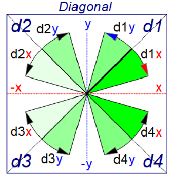

Last modified: 2023-06-04 <a name="up"></a>   
<table><tr><td></td><td>
<h1>Vue-MQTT: Web page with door symbol</h1>
<a href="../README.md">==> Home page</a> &nbsp; &nbsp; &nbsp; 
<a href="./m4h566_Vue_ci_mqtt_door1.md">==> German version</a> &nbsp; &nbsp; &nbsp; 
</td></tr></table>
<a href="https://github.com/khartinger/mqtt4home/tree/main/source_Vue/vue66_ci_mqtt_door1">==> Code @ GitHub</a><hr>

# What is it about?   
This project "Vue: MQTT Door1" describes how to create a web page with a door icon that can receive MQTT messages and change the display accordingly.   
The information about the door state (open or closed) comes e.g. from a magnetic zigbee door contact MCCGQ11LM from Aqara, which sends the following MQTT message via a zigbee dongle and zigbee2mqtt:   
```   
-t zb6/h6/T1 -m {"battery":100,"contact":false,"device_temperature":26,"linkquality":153,"power_outage_count":6889,"voltage":3035}
```   
When the door is closed, `"contact":true`   

   
_Fig. 1: Web page with door icon_   

## This guide answers the following questions:   
1. [What things do I need for this project?](#a10)   
2. [How do I make this example work on my computer?](#a20)
3. [How to create the project by myself?](#a30)   
4. [How to create the door symbol?](#a40)

<a name="a10"></a>[_top of the page_](#up)

# What things do I need for this project?

* Hardware: PC or laptop with Internet access, browser.   
* Hardware: Raspberry Pi as access point (WLAN Raspi11, PW 12345678) with IP 10.1.1.1, running an MQTT broker (e.g. Mosquitto).   
* Hardware: Zigbee USB adapter, e.g. Sonoff Zigbee 3.0 USB Dongle Plus, connected to a USB port of the Raspberry Pi.   
* Software: zigbee2mqtt running on the Raspberry Pi.   
* Software: Visual Studio Code ("VSC"), which is already prepared for Vue applications.   
   (Ie. at least one Vue application has already been created in Visual Code).   
* Software: The MQTT client programs `mosquitto_sub` and `mosquitto_pub` (installed on the PC or RasPi).   

If no Zigbee USB adapter is available, the MQTT message can also be simulated using `mosquitto_pub` as follows:   
```   
mosquitto_sub -h 10.1.1.1 -t zb6/h6/T1 -m "{\"battery\":100,\"contact\":false,\"device_temperature\":26,\"linkquality\":153,\"power_outage_count\":6889,\"voltage\":3035}""
```   

---   
<a name="a20"></a>[_top of the page_](#up)   

# How do I make this example work on my computer?

One way is to create an empty VSC project, download the files from github and copy them into the VSC project.   

<a name="a25"></a>   
## How do I create an empty VSC project?
1. start Visual Studio Code (VSC).   
2. open VSC: Terminal window: Men&uuml; Terminal - New Terminal.   
3. VSC Terminal: Change to the folder under which the Vue project is to be created, for example:   
   `cd /c/work/test_vue`.   
4. VSC-Terminal: Create Vue.js application: `vue create vue66_ci_mqtt_door1`.  
   Use cursor keys, space bar and &lt;Enter&gt; to select the following:   
   `> Manually select features` &nbsp; &lt;Enter&gt;   
   `(*) Choose Vue version`   
   `(*) Babel`   
   `(*) TypeScript`   
   `( ) Router`   
   `(*) Linter / Formatter`   
   &lt;Enter&gt;   
   _`> 3.x`_ &nbsp; &lt;Enter&gt;      
   _`? Use class-style component syntax?`_ &nbsp; __`N`__ &lt;Enter&gt;   
   _`? Use Babel alongside TypeScript (required for modern mode, auto-detected polyfills, transpiling JSX)?`_ &nbsp; __`N`__ &lt;Enter&gt;   
   _`? Use history mode for router? (Requires proper server setup for index fallback in production)`_ &nbsp; __`N`__ &lt;Enter&gt;   
   _`? Pick a linter / formatter config:`_ &nbsp; __`ESLint + Standard config`__ &lt;Enter&gt;   
   _`? Pick additional lint features: `_ &nbsp; __`Lint on save`__ &lt;Enter&gt;   
   _`? Where do you prefer placing config for Babel, ESLint, etc.?`_ &nbsp; __`In dedicated config file`__ &lt;Enter&gt;   
   _`? Save this as a preset for future projects? (y/N)`_ &nbsp; __`N`__ &lt;Enter&gt;   
5. switch to the project folder: _VSC Men&uuml; File - Folder &ouml;ffnen_..   
   `c:/work/test_vue/vue66_ci_mqtt_door1` [select folder].   
6. install MQTT library:   
   VSC: Open Terminal window: Menu Terminal - New Terminal.   
   `npm install mqtt --save`

## How can I download the project files?
To save downloading the files one by one, the easiest way is to download the whole project `mqtt4home` as a zip file:   

1. in the browser enter the address (URL) [`https://github.com/khartinger/mqtt4home`](https://github.com/khartinger/mqtt4home).   
Click the [Code] button, select "Download ZIP" and execute [*] Save file [OK] in the selection window.

## How can I copy the downloaded files into the VSC project?
1. in the browser at download for the file __mqtt4home-main.zip__ click "open file" (or change to the download directory and open the zip file there).   
2. right-click the directory `mqtt4home-main/source_Vue/vue66_ci_mqtt_door1/src/` in the explorer and select "Copy".   
Change to the project directory `c:/work/test_vue/vue66_ci_mqtt_door1` and insert the files there (writing three files). The directory is automatically unpacked during the insertion.   

## How can I start the project?
1. open the terminal window in VSC via the menu item Terminal - New Terminal (if it is not already open) and start the built-in server with   
`npm run serve`   
2. enter the following address (URL) in the browser:   
`localhost:8080`   
  In the browser _image 1_ (above) should be displayed.   

If you press the door contact, the icon should change accordingly.   
(Or send the MQTT message described above by yourself).   

<a name="a30"></a>[_top of the page_](#up)   

# How to create the project by myself?

## 1. General
The following diagram gives an overview of the files involved:   

   
_Fig. 2: &Overview of the involved files_   

With the help of the diagram you can see some important connections:   

* The right branch with (browser -->) index.html --> main.ts --> App.vue is created automatically and needs some customization.   
* The file `main.ts` creates the app element which is displayed in `index.html`.   
* `App.vue` represents `<CiMain>` and contains css elements that can be used throughout the project.   
* The graphics element `CiDoor1` consists of a "controller" and "graphics" part (extension `.ts` and `.vue` respectively), which are derived from base components.   
* The connection to the MQTT broker is established &uuml;via the files `CiMqttClient.ts` and `CiMqttClientInstance.ts`, where all controllers must be registered in the file `CiMqttClientInstance.ts`. If this is forgotten, the controller will not receive MQTT messages ("switch open").   

## 2. Create the Vue project in VSC.   
See ["How do I create an empty VSC project?"](#a25).   

## 3. completing the Vue configuration   
Create the file `vue.config.js`: click on the plus next to `VUE66_CI_MQTT_DOOR1`, enter name.   
_Content of the file_:   
```   
// ______vue.config.js__________________________________________
module.exports = {
  lintOnSave: false,
  publicPath: './',
  // publicPath: process.env.NODE_ENV === 'production' ? './vue_pubsub2/' : './',
  configureWebpack: {
    devtool: 'source-map'
  },
  chainWebpack: config => {
    config.performance
      .maxEntrypointSize(400000)
      .maxAssetSize(400000)
  }
}
```   
With `publicPath: './',` the relative path is set and the `chainWebpack` entry avoids warnings regarding the file size (by setting the maximum file size higher ;) )

## 4. disable linter warning "Unexpected any" at "(value: any)".    
  In the file `.eslintrc.js` under "`rules: {`" add:   
```   
  '@typescript-eslint/no-explicit-any': 'off',
  '@typescript-eslint/explicit-module-boundary-types': 'off',
```   

## 5. customize `App.vue` file   
The `src/App.vue` file is responsible for the following items:   
  * Display of the `CiMain` component.
  * Definition of uniform styles for all pages.   

_Content of the file_:   
```   
<!-- App.vue -->
<template>
  <CiMain></CiMain>
</template>

<script lang="ts">
import { defineComponent } from 'vue'
import CiMain from '@/components/CiMain.vue'

export default defineComponent({
  name: 'App',
  components: {
    CiMain
  }
})
</script>

<style>
#app {
  font-family: Avenir, Helvetica, Arial, sans-serif;
  text-align: left;
  color: black;
  margin-top: 0px;
}
</style>
```   

## 6. create class with geometry data
* Creating the `classes` directory   
  Right click on the `src` directory, select "New folder" and enter the name `classes`.   
* Create the `CiMqttClient.ts` file   
  * Right click on the `classes` directory, select "New file" and enter the name `Geo.ts`.   
  * Contents of the file:   
```   
// ______Geo.ts__________________________________khartinger_____
// 2023-01-02: new
// 2023-01-25: add class Geof (factor to resize), colorUnknown
// 2023-01-31: update y2()
// 2023-02-02: update calcLinemax()

// -----------font data-----------------------------------------
// examples: fh_=11, tmax_=10 or 16/13, ...
const fh_ = 11 //            font height [pixel]
const tmax_ = 10 //        max number character per line
// -----------y direction---------------------------------------
const dyl_ = Math.round(0.5 + 22 * fh_ / 14) //  line hight
const dyi_ = 5 * dyl_ //                         inner hight
const dyi2_ = Math.round(dyi_ / 2) //            half dyi_
const dyo_ = 10 * Math.round(0.5 + dyi_ / 10) // outer hight
const dyo2_ = Math.round(dyo_ / 2) //            center dy
const dym_ = Math.round((dyo_ - dyi_) / 2) //    top margin
const dyt_ = Math.round(0.5 + 17 / 14 * fh_) //  text start y
// -----------x direction---------------------------------------
const dxo_ = dyo_ //                             outer width
const dxo2_ = Math.round(dyo_ / 2) //            half outer width
const dxm_ = dym_ //                             left margin
const dxi_ = dxo_ - 2 * dxm_ //                  inner width
const dxi2_ = dxo2_ - dxm_ //                    half dxi_
const dxt_ = Math.round(0.5 + fh_ / 14 + 18 / 14) // text-border
const dw2_ = Math.round(dyl_ / 2) //             half wall thickness

// *************************************************************
// Geometric data for drawing a CI symbol (without stretching)
// *************************************************************

export class Geo {
  // =========special values====================================
  public colorOk = '#CCFFCC' //        light green 2
  public colorNotOk = '#FFCCCC' //     light red
  public colorError = '#FF3333' //     red
  public colorAlarm = '#FF3333' //     red
  public colorOn = '#FFFF66' //        yellow
  public colorOn2 = '#FFD700' //       gold
  public colorOff = '#D0D0D0' //       light grey
  public colorOff2 = '#505050' //      dark grey
  // public colorUnknown = '#add8e6' //   light blue
  public colorUnknown = '#90bbff' //   middle blue
  public colorBackground = '#DDFFDD' // very light green
  public colorOpen = '#90ee90' //      light green
  public colorClose = '#FF6666' //     light red
  public colorLock = '#C00000' //      red
  public colorWall = '#600000' //      dark red 6
  public noDate = '--.--.----'
  public noTime = '--:--:--'
  public batteryMin = 15
  // ---------texts in different languages----------------------
  public textOpen = 'AUF' // 'AUF' //    OPEN
  public textClose = 'ZU' // 'ZU' //    CLOSE
  public textLock = 'SPERRE' // 'SPERRE' // LOCK

  // =========relative geometric values=========================
  // ---------font data-----------------------------------------
  public fh = fh_ //              font height [pixel]
  public tmax = tmax_ //          max number character per line
  // ---------y direction---------------------------------------
  public dyl = dyl_ //            line hight
  public dym = dym_ //            top margin
  public dyt = dyt_ //            text start in y direction
  // ---------x direction---------------------------------------
  public dxm = dxm_ //            left margin
  public dxt = dxt_ //            text start in x direction
  // ---------other dimensions----------------------------------
  public dw2 = dw2_ //            half wall thickness

  // =========absolute geometric values=========================
  // ---------center of symbol----------------------------------
  public x = 0 //                 x value of center
  public y = 0 //                 y value of center

  // =========methods===========================================
  // _________constructor: (x/y) is center of square____________
  constructor (x_: number, y_: number) {
    this.x = x_
    this.y = y_
  }

  // ---------drawing center of symbol--------------------------
  public xc (): number { return this.x }
  public yc (lines_ = 0): number {
    if (lines_ === 1) return this.y + this.dyl / 2
    return this.y
  }

  // ---------width and height of outer rectangle---------------
  public dxo (): number { return dxo_ }
  public dyo (): number { return dyo_ }

  // ---------half width and height of outer rectangle----------
  public dxo2 (): number { return dxo2_ }
  public dyo2 (): number { return dyo2_ }

  // ---------width and height of inner rectangle---------------
  public dxi (): number { return dxi_ }
  public dyi (): number { return dyi_ }

  // ---------half width of inner rectangle---------------------
  public dxi2 (): number { return dxi2_ }
  public dyi2 (): number { return dyi2_ }

  // ---------coordinates of upper left corners-----------------
  public x0 (): number { return (this.x - this.dxo2()) }
  public y0 (): number { return (this.y - this.dyo2()) }
  public x1 (): number { return (this.x - this.dxi2()) }
  public y1 (): number { return (this.y - this.dyi2()) }

  // ---------x value for rectangle 1...(5)---------------------
  public xr (): number { return this.x1() }
  public xr2 (fx_ = 1): number { return this.x1() + fx_ * this.dxo() / 2 - this.dxm }

  // ---------calculate y start value of rectangle 1...(5)------
  public yr (linenum: number): number {
    // if (linenum < 1 || linenum > 5) linenum = 1
    if (linenum < 1) linenum = 1
    // ??return ((this.y - this.dyi2()) + (linenum - 1) * this.dyl)
    return (this.y1() + (linenum - 1) * this.dyl)
  }

  // ---------x start value for text line 1...(5)---------------
  public xt (): number { return (this.x + -dxi2_ + dxt_) }
  public xt2 (fx_ = 1): number { return (this.xt() + fx_ * this.dxi2()) }

  // ---------calculate y start value of text 1...(5)-----------
  public yt (linenum: number): number {
    // if (linenum < 1 || linenum > 5) linenum = 1
    if (linenum < 1) linenum = 1
    return (this.y - dyi2_ + dyt_ + (linenum - 1) * this.dyl)
  }

  // ---------calculate y start value of top line---------------
  // same as yt(1)
  public ytHeader (): number {
    return (this.y - dyi2_ + dyt_)
  }

  // ---------calculate y start value of center line------------
  public ytCenter (lines_ = 0): number {
    return this.yc(lines_) - this.dyl / 2 + this.dyt
  }

  // ---------calculate y start value of last (bottom) line-----
  public ytFooter (): number {
    return this.y1() + this.dyi() - this.dyl + this.dyt
  }

  // =========text methods======================================
  // ---------trim text to line length--------------------------
  public checkLen (text: string, fx_ = 1): string {
    const len = text.length
    if (len < 1) return ''
    const tmax_ = this.calctmax(fx_)
    if (len >= tmax_) return text.substring(0, tmax_)
    return text
  }

  // ---------center text (or trim text to line length)---------
  public center (text: string, fx_ = 1): string {
    const len = text.length
    if (len < 1) return ''
    const tmax_ = this.calctmax(fx_)
    if (len >= tmax_) return text.substring(0, tmax_)
    const numBlank = Math.round((tmax_ - len - 1) / 2)
    // console.log('center: text=', '|' + text + '| numBlank=' + numBlank)
    const s1 = text.padStart(numBlank + len, ' ')
    return s1
  }

  // ---------calculate chars per line depending on fx----------
  public calctmax (fx_: number): number {
    return Math.trunc(11.9 * fx_ - 1.7)
  }

  // ---------calculate number of lines depending on fy---------
  public calcLinemax (fy_ = 1): number {
    return Math.trunc((fy_ * dyo_ - 2 * this.dym) / this.dyl)
  }
}

// *************************************************************
// Geometric data for stretching a CI symbol
// *************************************************************

export class Geof extends Geo {
  // =========stretch factors===================================
  public fx = 1 //                     stretching factor x
  public fy = 1 //                     stretching factor y

  // =========methods===========================================
  // _________constructor: (x/y) is center of square____________
  constructor (x_ = 0, y_ = 0, fx_ = 1, fy_ = 1) {
    super(x_, y_)
    this.fx = fx_
    this.fy = fy_
  }

  // ---------x coordinate of new drawing center----------------
  public xc (): number {
    return (this.x - super.dxo2() + this.dxo2())
  }

  // ---------y coordinate of new drawing center----------------
  public yc (lines_ = 0): number {
    if (lines_ === 1) return this.y - super.dyo2() + this.dyo2() + this.dyl / 2
    return this.y - super.dyo2() + this.dyo2()
  }

  // ---------width and height of outer rectangle---------------
  public dxo (): number { return (this.fx * super.dxo()) }
  public dyo (): number { return (this.fy * super.dyo()) }

  // ---------half width and height of outer rectangle----------
  public dxo2 (): number { return (this.fx * super.dxo() / 2) }
  public dyo2 (): number { return (this.fy * super.dyo() / 2) }

  // ---------width and height of inner rectangle---------------
  public dxi (): number { return (this.fx * super.dxo() - 2 * this.dxm) }
  public dyi (): number { return (this.fy * super.dyo() - 2 * this.dym) }

  // ---------half width of inner rectangle---------------------
  public dxi2 (): number { return (this.fx * super.dxo() / 2 - this.dxm) }
  public dyi2 (): number { return (this.fy * super.dyo() / 2 - this.dym) }

  // ---------coordinates of upper left corners-----------------
  public x0 (): number { return (this.x - super.dxo2()) }
  public y0 (): number { return (this.y - super.dyo2()) }
  public x1 (): number { return (this.x - super.dxi2()) }
  public y1 (): number { return (this.y - super.dyi2()) }

  // ---------coordinates of lower right corners----------------
  public x2 (): number { return (this.x - super.dxo2() + this.dxo() - this.dxm) }
  public y2 (): number { return (this.y - super.dyo2() + this.dyo() - this.dym) }
  public x3 (): number { return (this.x - super.dxo2() + this.dxo()) }
  public y3 (): number { return (this.y - super.dyo2() + this.dyo()) }

  // ---------x value for rectangle 1...(5)---------------------
  public xr (): number { return this.x1() }
  public xr2 (): number { return this.x1() + this.dxi2() }

  // ---------calculate y start value of rectangle 1...(5)------
  public yr (linenum: number): number { return super.yr(linenum) }

  // ---------x start value for text line 1...(5)---------------
  public xt (): number { return super.xt() }
  public xt2 (): number { return (super.xt() + this.dxi2()) }

  // ---------calculate y start value of text 1...(5)-----------
  public yt (linenum: number): number { return super.yt(linenum) }

  // ---------calculate y start value of top line---------------
  public ytHeader (): number { return super.ytHeader() }

  // ---------calculate y start value of center line------------
  public ytCenter (lines_ = 0): number {
    return this.yc(lines_) - this.dyl / 2 + this.dyt
  }

  // ---------calculate y start value of last (bottom) line-----
  public ytFooter (): number {
    return this.y1() + this.dyi() - this.dyl + this.dyt
  }

  // =========text methods======================================
  // ---------trim text to line length--------------------------
  public checkLen (text: string): string { return super.checkLen(text, this.fx) }

  // ---------center text (or trim text to line length)---------
  public center (text: string): string { return super.center(text, this.fx) }

  // ---------calculate chars per line depending on fx----------
  public calctmax (): number { return super.calctmax(this.fx) }

  // ---------calculate number of lines depending on fy---------
  public calcLinemax (): number { return super.calcLinemax(this.fy) }
}

export const geo0 = new Geo(0, 0)
export const geo0f = new Geof(0, 0, 1, 1)
```   

## 7. delete files and directories that are not needed   
  * Delete file `components/HelloWorld.vue   
  * delete directory `assets   

## 8. add MQTT functionality
* Create the `services` directory   
  Right click on the `src` directory, select "New folder" and enter the name `services`.   
* Create the `CiMqttClient.ts` file   
  * Right click on the `services` directory, select "New file" and enter the name `CiMqttClient.ts`.   
  * Get the content of the file e.g. from [GitHub](https://github.com/khartinger/mqtt4home/blob/main/source_Vue/vue10_ci_mqtt_mini/src/services/CiMqttClient.ts), copy it and save the file.   
  The file contains all program parts for the MQTT functionality.   
* Create the file `CiMqttClientInstance.ts`.
* Right click on the `services` directory, select "New File" and enter the name `CiMqttClientInstance.ts`.   
  Contents of the file:   
```   
// ______CiMqttClientInstance.ts_________________khartinger_____
// 2023-06-04 New
import { CiMqttClient } from './CiMqttClient'
import { ciDoor1Controller } from '@/controller/CiDoor1Controller'

export const ciMqttClientInstance = new CiMqttClient(true)
ciMqttClientInstance.registerController(ciDoor1Controller)
```   

* Specify that a connection to the broker should be established when the app is started (constructor value `true`).   
  * Registering the `ciDoor1Controller` so that it has access to the MQTT messages.   

## 9. create the start screen CiMain.vue
* Create the file 'CiMain.vue   
  * Right click on the `components` directory, select "New file" and enter the name `CiMain.vue`.   
  Contents of the file:   
```   
<!-- CiMain.vue (vue66_ci_mqtt_door1)-------------khartinger -->
<!-- 2023-06-04 new                                          -->
<template>
  <svg width="100%" viewBox="0 0 100 100">
  <rect class="ciBackground" x="0" y="0" width="100" height="100" />
  <CiDoor1 :x="0" :y="0" sid="h6T1" dir="h1" :border="0"></CiDoor1>
</svg>
</template>

<script lang="ts">
import { defineComponent } from 'vue'
import CiDoor1 from './CiDoor1.vue'

export default defineComponent({
  name: 'CiMain',
  components: {
    CiDoor1
  }
})
</script>

<style>
</style>
```   

## 10. create base view element (`CiBase.vue`)

The base view `CiBase.vue` is responsible for displaying common properties of all symbols:   
1. drawing a border around the symbol or not (`border = 2 | 1 | 0`)   
2. providing geometry data for drawing a symbol. These are specified in the class `Geo`.    

   
_Fig. 3: Geometry data of a CI symbol_   

### Notes on the geometry of symbols
* Symbols are normally square (standard symbol).   
* The positioning point of each symbol is the center (x/y).   
* The size of a symbol depends on the size of the font (e.g. font height `fh_ = 11`). This also determines the number of characters per line (e.g. `tmax_ = 14`).   
* Symbols can be stretched both in x- and y-direction.   
* Each symbol has an outer dimension (`dxo`, `dyo`) and an inner dimension (`dxi`, `dyi`). This results in a (yellow) border, which can also be displayed invisibly.   
* The upper left outside corner has the coordinates (x0/y0).   
* The upper left inner corner has the coordinates (x1/y1).   
* The five rectangles have the starting point (xr/yr(i))   
with i as the number of the rectangle from 1 to 5.   
* The five texts have the starting point (xt/yt(i))   
with i as the number of the text from 1 to 5.   
* Standard symbols usually contain five text lines (line height 'dyl').   
* Line 2 can also be split into two parts.   

* Create the file `CiBase.vue`.   
  * Right-click on the `components` directory, select "New file" and enter the name `CiBase.vue`.   
_Coding_:   
```   
<!-- CiBase.vue -----------------------------khartinger----- -->
<!-- 2022-01-08 New                                          -->
<!-- 2022-08-14 Add fx, fy, calctmax                         -->
<!-- 2023-01-02 Class Geo moved to a separate file Geo.ts    -->
<!-- 2023-01-25 new rectangle drawing (area no filled)       -->
<!-- 2023-01-31 update drawBorderFill                        -->
<!-- 2023-02-25 add .ciFont1_5, .ciFont3, .ciFont4, .ciFont5 -->
<template>
  <!-- filled border between out and in line---------------- -->
  <path v-if="borderFill" :d="drawBorderFill" class="ciOut"/>
  <!--border: outer and inner rectangle--------------------- -->
  <rect v-if="borderIn" class="ciIn0"  :x="geo.x1()" :y="geo.y1()" :width="fx*geo.dxo()-2*geo.dxm" :height="fy*geo.dyo()-2*geo.dym" />
  <rect v-if="borderOut" class="ciOut0" :x="geo.x0()" :y="geo.y0()" :width="fx*geo.dxo()" :height="fy*geo.dyo()" />
</template>

<script lang="ts">
import { defineComponent } from 'vue'
import { Geo } from '../classes/Geo'
import '@/services/CiMqttClientInstance'

export default defineComponent({
  name: 'CiBase',
  props: {
    x: {
      type: Number,
      required: true
    },
    y: {
      type: Number,
      required: true
    },
    border: {
      type: Number,
      required: false,
      default: 1
    },
    fx: {
      type: Number,
      required: false,
      default: 1
    },
    fy: {
      type: Number,
      required: false,
      default: 1
    }
  },
  emits: ['onClk'],
  computed: {
    geo: function (): Geo {
      const geo1 = new Geo(this.x, this.y)
      return geo1
    },
    borderFill: function (): boolean {
      if (this.border) {
        if (this.border === 3) return true
      }
      return false
    },
    borderOut: function (): boolean {
      if (this.border) {
        if (this.border === 1) return true
      }
      return false
    },
    borderIn: function (): boolean {
      if (this.border) {
        if (this.border === 2) return true
        if (this.border === 3) return true
      }
      return false
    },
    // -------draw yellow border--------------------------------
    drawBorderFill: function (): string {
      // let s1 = 'M' + this.x + ',' + this.y
      const dxof_ = this.geo.dxo() * this.fx
      const dyof_ = this.geo.dyo() * this.fy
      const dxif_ = dxof_ - 2 * this.geo.dxm
      const dyif_ = dyof_ - 2 * this.geo.dym
      let s1 = 'M' + this.geo.x + ',' + this.geo.y
      s1 += ' m-' + this.geo.dxo2() + ',-' + this.geo.dyo2()
      s1 += ' v' + dyof_ + ' h' + dxof_
      s1 += ' v-' + dyof_ + ' h-' + (dxof_ - this.geo.dxm - 1)
      s1 += ' v' + this.geo.dym + ' h' + (dxif_ - 1)
      s1 += ' v' + dyif_ + ' h-' + (dxif_ - 1)
      s1 += ' v-' + (dyif_ + this.geo.dym) + ' z'
      return s1
    }
  },
  mounted: function (): void {
    // ciMqttClientInstance.init()
  },
  methods: {
  }
})
</script>

<style>
  .ciFont1   { font-size: 14px; fill: black; font-weight: bold; font-family: "DejaVu Sans Mono","monospace"; white-space: pre; }
  .ciFont1_5 { font-size: 21px; fill: black; font-weight: bold; font-family: "DejaVu Sans Mono","monospace"; white-space: pre; }
  .ciFont2   { font-size: 28px; fill: black; font-weight: bold; font-family: "DejaVu Sans Mono","monospace"; white-space: pre; }
  .ciFont2_5 { font-size: 35px; fill: black; font-weight: bold; font-family: "DejaVu Sans Mono","monospace"; white-space: pre; }
  .ciFont3   { font-size: 42px; fill: black; font-weight: bold; font-family: "DejaVu Sans Mono","monospace"; white-space: pre; }
  .ciFont4   { font-size: 56px; fill: black; font-weight: bold; font-family: "DejaVu Sans Mono","monospace"; white-space: pre; }
  .ciFont5   { font-size: 70px; fill: black; font-weight: bold; font-family: "DejaVu Sans Mono","monospace"; white-space: pre; }
  .ciFont1k  { font-size: 16px; fill: red; font-weight: bold; font-style: italic; font-family: "DejaVu Sans Mono","monospace"; white-space: pre; }
  .ciFontRoom { font-size: 28px; fill: green; font-weight: bold; font-family: "DejaVu Sans Mono","monospace"; white-space: pre; }
  .fontOK    { font-weight: bold; color: lightgreen; }
  .fontNOK   { font-weight: bold; color: red; }
  .cursor    { cursor: pointer; }
  .ciBackground {fill: #ddFFdd; }
  .ciOut     { fill: yellow; stroke: yellow; stroke-width: 1; }
  .ciOut0    { fill: none; stroke: blue; stroke-width: 1; }
  .ciIn0      { fill: none; stroke:blue; stroke-width: 1; }
  .ciLine    { stroke: blue; stroke-width: 1; }
  .ciRect    { fill: none; stroke: blue; stroke-width: 1; }
  .ciFillIt  { stroke: blue; stroke-width: 1; }
  .ciClick   { fill-opacity: 0.0; stroke-width: 1; }
  .ciBorder  { fill-opacity: 0.0; stroke: blue; stroke-width: 1; }
</style>
```   

## 11. create base controller (`CiBaseController.ts`)
The file `CiBaseController.ts` normally does not need to be modified. It defines in the interface `IBase` some properties that all (derived) `CiXxxController` should have. The most important property is the symbol ID `sid`, which represents the connection between a representation and the data in the controller.   

In the (abstract) class `CiBaseController` then the methods `registerClient`, `publish` and `onMessage(message: Message)` are defined.   

* Create the file `CiBaseController.ts`.   
  * Right-click on the `controller` directory, select "New file" and enter the name `CiBaseController.ts`.   
_Coding_:   
```   
// ______CiBaseController.ts_____________________khartinger_____
// 2022-01-01: new
import { Message, CiMqttClient } from '@/services/CiMqttClient'
import type { QoS } from 'mqtt'

export interface IBase {
  id: string;
  name?: string;
  subTopic: string;
  pubTopic: string;
  pubPayload?: string;
}

export abstract class CiBaseController {
  protected client: CiMqttClient | null = null;

  public registerClient (mqttClient: CiMqttClient): void {
    this.client = mqttClient
  }

  protected async publish (topic: string, payload: string, retain: boolean, qos: QoS): Promise<void> {
    return this.client?.publish(topic, payload, retain, qos)
  }

  public abstract onMessage(message: Message): void;
}
```   

<a name="a40"></a>[_top of the page_](#up)   

## How to create the door symbol?   

## Door symbol properties
### CiDoor1 call
The drawing of a CiDoor1 symbol is done in the `<template>` area of the presentation file (e.g. in `CiMain.vue`) by the tag `<CiDoor1>` and the specification of further attributes.   
_Example_:
```   
<CiDoor1 :x="50" :y="70" sid="door_o" dir="h1"></CiDoor1>
```   

### Positioning of a symbol (:x, :y)
Normally CI symbols are 100x100 units in size and the center point (50/50) is used to indicate the position (placement point). If the drawing area is defined e.g. by   
`<svg width="100%" viewBox="0 0 500 220">`   
then the location specification `:x="50" :y="70"` causes the CiDoor1 to border the left edge and be 20 units away from the top edge:   
   
_Fig. 2: Location of a CiDoor1 symbol_   

_Note_:   
Remaining space at the bottom: 220 - 20 - 100 = 100 units.   
Remaining space right: 500 - 100 = 400 units   

### ID of a symbol (sid)
The symbol ID (sid) represents the connection of the graphical representation to the controller (see property [id](#id) in chapter "[Attributes defined in the base controller](#id)").   
If `sid=""` is set, no texts and backgrounds will be displayed.   

### Border of a symbol (:border)
Normally CI symbols are 100x100 units in size outside and have a fixed border of 5 units inside. With the CiWall1 symbol this is different:   
In order to make adjacent symbols in a 100 unit grid look continuous, the `CiDoor1` symbols go to the symbol border, so they are exceptionally 100x100 units in size.   
Normally, the border of the `CiDoor1` symbols is not displayed. If you want to display the border exceptionally, there are four ways to do so, which are set via the `:border=` attribute:   

| Parameter | Meaning |   
| ------------- | ------------------------------ |   
| `:border="0"` | No border will be displayed. |   
| `:border="1"` | Only the outer border of the symbol is displayed (= total space required by the symbol). |   
| `:border="2"` | Only the inner border of the symbol is shown (= the drawing area for the symbol). |   
| `:border="3"` | The border of the symbol is displayed in yellow. |   

Default is `:border="0"`.   

### Direction of the CiDoor1 symbol (dir)
The direction of a symbol is specified with the `dir` ("Direction") property.   

The __first letter__ indicates the base direction:   
* `h` or `H`: Horizontal (horizontal, x-direction).   
* `v` or `V`: Vertical (vertical, y-direction)   
* `d` or `D`: Diagonal (inclined at +/- 45°)   

If a lowercase letter is used, the door opening direction is drawn small, if an uppercase letter is used, it is drawn large (see _Fig. 1_).   

The __second letter__ indicates the opening direction, which is the quadrant into which the door opens. According to the 4 quadrants, the numbers 1 to 4 are possible.   

   
_Fig. 3: Direction labels for symbols in axis direction_   

For diagonal elements, a __third letter__ is required to indicate the `propagation` direction more precisely. The first letter is a `d` (for diagonal), the second letter indicates the diagonal direction for the symbol (`1` to `4`) and the third letter indicates the axis towards which an element opens (`x` or `y`).   

   
_Fig. 4: Directional labels for symbols in diagonal direction_   

__Examples of designations:__   
`dir="h1" ....` Horizontal symbol whose propagation (door opening) is in the first quadrant (towards "up").   
`dir="v1" ....` Vertical symbol, whose propagation (door opening) is in the first quadrant (to "right").   
`dir="d1x" ...` Diagonal symbol to the right-up, whose propagation (door opening) is in the direction of the x-direction (to "down").   

### Text information in CiDoor1 symbol (lines)
Each `CiDoor1` symbol knows three lines for text output:   
* header   
* line 4   
* footer   

Which texts are actually displayed in the symbol depends on the value of the 'lines=' attribute:    
| parameter | meaning |   
| ------------- | ------------------------------ |   
| `lines="0"`   | Neither header nor footer will be displayed. |   
| `lines="1"`   | The header line is displayed. If the `name` parameter is defined in the controller, this text is displayed, otherwise the `id`. |   
| `lines="2"`   | Header and footer are displayed.   |   

Default is `lines="2"`.   

#### Header
1. If the attribute `lines="0"` is set in the symbol, the header will not be displayed.   
2. If the parameter `name` is defined in the controller, this text will be displayed.   
3. If the parameter `name` contains a question mark, it will be replaced by the text `OPEN`, `CLOSE` or `LOCK` depending on the door status.   
4. Otherwise the `id` is displayed.   

#### Line 4
1. If the attribute `lines="0"` is set in the symbol, the line 4 will not be displayed.   
2. If the id of the symbol (`sid`) does not match any entry in the list `public door1s: Array<Door1>` (file `CiDoor1Controller.ts`), "`unknown`" is displayed.   
3. If there is a value for the MQTT key `battery`, this value is displayed.   
4. Otherwise, an empty line is output.   

#### Footer
1. If the attribute `lines="0"` or `lines="1"` is set in the symbol, the footer will not be displayed.   
2. If the id of the symbol (`sid`) does not match any entry in the list `public door1s: Array<Door1>` (file `CiDoor1Controller.ts`), "`sid`" is displayed.   
3. If the `textF=` attribute is used in the symbol, this text will be displayed.   
4. If the `textFooter` parameter is defined in the controller, this text will be displayed.   
5. If the parameter `textFooter` contains a question mark, it will be replaced by the text `OPEN`, `CLOSE` or `LOCK` depending on the door status.   
6. Otherwise, an empty line is output.   

   
_Fig. 5: Miscellaneous footers_   

__Coding example__:   
```   
    <CiDoor1 :x="50"  :y="70" sid="doorX" dir="h1"></CiDoor1>
    <CiDoor1 :x="150" :y="70" sid="door_o" dir="h1"></CiDoor1>
    <CiDoor1 :x="350" :y="70" sid="door_o" dir="h1" lines="0"></CiDoor1>
    <CiDoor1 :x="50"  :y="170" sid="doorF" dir="h1"></CiDoor1>
    <CiDoor1 :x="150" :y="170" sid="doorF" dir="h1"></CiDoor1>
    <CiDoor1 :x="250" :y="170" sid="doorF" dir="h1"></CiDoor1>
    <CiDoor1 :x="350" :y="170" sid="doorF" dir="h1" textF="textF :)"></CiDoor1>
```   

### Stretching of a symbol (:f)
By default, all symbols are 100x100 units in size. However, it is possible to stretch the symbol (on both sides) so that the placement point remains the same.   
Stretching is done by specifying the `f` parameter, as the following example shows:   
   
_Fig. 6: Stretched CiDoor1 symbol_   

The symbol at the bottom left and far right are each stretched by a factor of 2.   

__Coding example__:   
```   
<template>
  <svg width="100%" viewBox="0 0 500 220">
  <rect class="ciBackground" x="0" y="0" width="500" height="220" />
  <text x="0" y="15" class="ciFont1">viewbox 500x220</text>
  <CiDoor1 :x="100" :y="70"  sid="door_o" dir="h1"></CiDoor1>
  <CiDoor1 :x="100" :y="170" sid="door_o" dir="h1" :f="2"></CiDoor1>
  <CiDoor1 :x="300" :y="110" sid="door_o" dir="v2"></CiDoor1>
  <CiDoor1 :x="400" :y="110" sid="door_o" dir="v2" :f="2"></CiDoor1>
  </svg>
</template>
```   

### Different CiDoor1 shapes (shape)
CiDoor1 symbols come in four forms, selected by the `dir=` and `shape=` attributes:   
#### `dir`
* A lowercase letter results in a small arc or triangle that ends at the boundary of the drawing area.   
* An uppercase letter results in an arc or triangle corresponding to a quarter circle.   
#### `shape`
* If you set `shape= "tri"`, a triangle will be drawn instead of an arc.   
The default is `shape="arc"`.   

### Colors in CiDoor1 symbol (colorH, colorF, colorWall)
The colors in the CiDoor1 symbol can be partially selected or are assigned automatically.   

#### Automatically set colors
* Incorrect "`sid`", i.e. an object with this "`sid`" does not exist in the controller:   
* The door area is colored light blue (color "`colorUnknown`" from the file `Geo.ts`) and lines 4 and 5 are colored light red (color "`colorNotOK`" from the file `Geo.ts`).   
* The door area is colored according to the door status (variable `iDoor1State`):   
  * door open: light green (`colorOpen`)   
  * Door closed: light red (`colorClose`)   
  * Door locked: red (`colorLock`)   
* If a battery value is smaller than `batteryMin`, line 4 is colored light red (color "`colorNotOK`" from the file `Geo.ts`).   

#### Selectable colors
* The `colorH=` attribute can be used to set the background color of the header. The value can be either an RGB value (red-green-blue value), such as `#ffee00` or a text specification such as `red`, `green` etc.   
* With the attribute `colorF=` the background color of the footer can be set (color value see above).   
* With the attribute `colorWall=` the color of the wall elements (rectangles left and right of the door area) can be set (color value see above).   

## Coding of the graphical representation `CiDoor1.vue`
* Create the file `CiDoor1.vue`   
  * Right click on the `components` directory, select "New file" and enter the name `CiDoor1.vue`.   
  Contents of the file:   
```   
<!-- CiDoor1.vue ----------------------------khartinger----- -->
<!-- 2022-01-08: new                                         -->
<!-- 2023-02-18: change at CiBase (add Geo.ts)               -->
<!-- 2023-02-22: add <template v-if..                        -->
<template>
  <!--draw border------------------------------------------- -->
  <!--
  <CiBase :x="x" :y="y" :border="border" :fx="fx" :fy="fy"></CiBase>
  -->
  <CiBase :x="x" :y="y" :border="border" :fx="1" :fy="1"></CiBase>
  <g id="doorgroup" :transform="rotateGroup">
    <!--draw symbol and color rectangles-------------------- -->
    <path :d="drawWall" :fill="colorWall_" :stroke="colorWall" stroke-width="1"/>
    <path :d="drawRect" :fill="colorDoor_" stroke="black" stroke-width="1"/>
    <template v-if="sid.length > 0">
      <rect v-if="iLines>0" :fill="colorH_" :x="rx_" :y="geo.y1()" :width="rw_" :height="geo.dyl" stroke="colorH_"/>
      <rect v-if="iLines>0" :fill="color4_" :x="rx_" :y="geo.yr(4)" :width="rw_" :height="geo.dyl" stroke="color4_"/>
      <rect v-if="iLines>1" :x="rx_"  :y="geo.yr(5)" :width="rw_" :height="geo.dyl" :fill="colorF_"/>
      <!--write text------------------------------------------ -->
      <text v-if="iLines>0" :x="xt_" :y="geo.ytHeader()" class="ciFont1">{{lineHeader}}</text>
      <text v-if="iLines>0" :x="xt_" :y="geo.yt(4)" class="ciFont1">{{line4}}</text>
      <text v-if="iLines>1" :x="xt_" :y="geo.ytFooter()" class="ciFont1">{{lineFooter}}</text>
      <!--draw open door-------------------------------------- -->
      <path v-if="isDrawArc" :d="drawArc" fill="none" stroke="black" stroke-width="1"/>
    </template>
  </g>
  <!--define click area------------------------------------- -->
  <rect @click="onClk()" class="ciClick" :x="geo.x0()" :y="geo.y0()" :width="geo.dxo()" :height="geo.dyo()" />
</template>

<script lang="ts">
import { defineComponent } from '@vue/runtime-core'
import { Door1, ciDoor1Controller } from '../controller/CiDoor1Controller'
import CiBase from './CiBase.vue'
import { Geo } from '../classes/Geo'

export default defineComponent({
  name: 'CiDoor1',
  components: {
    CiBase
  },
  props: {
    x: {
      type: Number,
      required: true
    },
    y: {
      type: Number,
      required: true
    },
    sid: {
      type: String,
      required: true
    },
    border: {
      type: Number,
      required: false,
      default: 0
    },
    dir: {
      type: String,
      required: true
    },
    lines: {
      type: String,
      required: false,
      default: '2'
    },
    f: {
      type: Number,
      required: false,
      default: 1
    },
    shape: {
      type: String,
      required: false,
      default: 'arc'
    },
    textF: {
      type: String,
      required: false,
      default: ''
    },
    colorH: {
      type: String,
      required: false,
      default: 'none'
    },
    colorF: {
      type: String,
      required: false,
      default: 'none'
    },
    colorWall: {
      type: String,
      required: false,
      default: 'brown'
    }
  },
  computed: {
    // =======standard methods==================================
    // _______find door1 object to given sid____________________
    door1: function (): Door1 | undefined {
      return ciDoor1Controller.door1s.find(door1 => door1.id === this.sid)
    },
    // _______get iDoor1State___________________________________
    iDoor1State: function (): number {
      // console.log('iDoor1State=', this.door1?.iDoor1State)
      if (this.door1?.iDoor1State) {
        return this.door1?.iDoor1State
      }
      return ciDoor1Controller.stateNoState
    },
    // _______provide geometric data____________________________
    geo: function (): Geo {
      // const geo1f = new Geof(this.x, this.y, this.fx, this.fy)
      const geo1 = new Geo(this.x, this.y)
      return geo1
    },
    // _______number of displayed lines_________________________
    iLines: function (): number {
      return parseInt(this.lines)
    },
    // =======text methods======================================
    // _______s start point text________________________________
    xt_: function (): number {
      if (this.f > 1) {
        return this.geo.xt() - (this.f - 1) * this.geo.dxo2()
      } return this.geo.xt()
    },
    // _______text in line 1____________________________________
    lineHeader: function (): string {
      if (this.door1?.name) {
        if (this.door1.name.includes('?')) {
          const i2 = this.door1.name.indexOf('?')
          const s1 = this.door1.name.substring(0, i2)
          let s2 = '?'
          if (this.iDoor1State === ciDoor1Controller.stateClose) s2 = this.geo.textClose // CLOSED
          if (this.iDoor1State === ciDoor1Controller.stateOpen) s2 = this.geo.textOpen // OPEN
          if (this.iDoor1State === ciDoor1Controller.stateLock) s2 = this.geo.textLock // LOCKED
          return this.geo.center(s1 + s2, this.f)
        }
        return this.geo.center(this.door1.name, this.f)
      }
      return this.geo.center(this.sid, this.f)
    },
    // ______text in line 4_____________________________________
    line4: function (): string {
      if (!this.door1) return this.geo.center('unknown', this.f)
      if (this.door1?.battery) return this.geo.center(`${this.door1.battery}` + '%', this.f)
      return ''
    },
    // _______text in line 5____________________________________
    lineFooter: function (): string {
      if (!this.door1) return this.geo.center('sid', this.f)
      if (this.textF) return this.geo.center(this.textF, this.f)
      if (this.door1?.textFooter) {
        if (this.door1.textFooter.includes('?')) {
          const i2 = this.door1.textFooter.indexOf('?')
          const s1 = this.door1.textFooter.substring(0, i2)
          let s2 = '?'
          if (this.iDoor1State === ciDoor1Controller.stateClose) s2 = this.geo.textClose // CLOSED
          if (this.iDoor1State === ciDoor1Controller.stateOpen) s2 = this.geo.textOpen // OPEN
          if (this.iDoor1State === ciDoor1Controller.stateLock) s2 = this.geo.textLock // LOCKED
          return this.geo.center(s1 + s2, this.f)
        }
        return this.geo.center(this.door1.textFooter, this.f)
      }
      return ''
    },
    // ======color methods======================================
    // _______color rectangle start value x_____________________
    rx_: function (): number {
      return this.x - this.f * this.geo.dxo() / 2 // this.geo.x1()
    },
    // _______color rectangle width value x_____________________
    rw_: function (): number {
      return this.f * this.geo.dxo() // this.geo.dxi()
    },

    // _______background color of header________________________
    colorH_: function (): string {
      if (this.colorH !== 'none') return this.colorH
      return 'none'
    },
    // _______background color of line 4________________________
    // also depending on battery value
    color4_: function (): string {
      if (!this.door1) return this.geo.colorNotOk
      if (this.door1?.battery) {
        try {
          const batt = parseInt(this.door1.battery.valueOf())
          // if (batt > this.geo.batteryMin) return this.geo.colorBackground
          if (batt > this.geo.batteryMin) return 'none'
          return this.geo.colorNotOk
        } catch (error) { return 'none' }
      }
      return 'none'
    },
    // _______background color of footer________________________
    colorF_: function (): string {
      if (!this.door1) return this.geo.colorNotOk
      if (this.colorF !== 'none') return this.colorF
      return 'none'
    },
    // _______wall color________________________________________
    colorWall_: function (): string {
      if (this.colorWall !== '-') return this.colorWall
      return this.geo.colorWall
    },
    // _______door color________________________________________
    colorDoor_: function (): string {
      // console.log('this.iDoor1State', this.iDoor1State)
      if (this.iDoor1State === ciDoor1Controller.stateClose) return this.geo.colorClose // closed (light red)
      if (this.iDoor1State === ciDoor1Controller.stateOpen) return this.geo.colorOpen // open (light green)
      if (this.iDoor1State === ciDoor1Controller.stateLock) return this.geo.colorLock // locked (red)
      return this.geo.colorUnknown
    },
    // =======deciding whether to draw something================
    // _______draw a open door arc?_____________________________
    isDrawArc: function (): boolean {
      if (this.iDoor1State === ciDoor1Controller.stateOpen &&
        (this.shape === 'arc' || this.shape === 'tri')) return true
      return false
    },
    // =======drawing methods===================================
    // _______two rectangles next to door rectangle ("wall")____
    drawWall: function (): string {
      const dxof = this.geo.dxo() * this.f
      const dwx = 2 * this.geo.dxm
      const dwy2 = 1.2 * this.geo.dw2
      let s1 = 'M' + this.x.toString(10) + ',' + this.y.toString(10)
      s1 += 'm-' + dxof / 2 + ',-' + dwy2 + ' h' + dwx + ' v' + (2 * dwy2) + ' h-' + dwx + ' z'
      s1 += 'm' + dxof + ',0' + ' h-' + dwx + ' v' + (2 * dwy2) + ' h' + dwx + ' z'
      return s1
    },
    // _______door rectangle and middle line____________________
    drawRect: function (): string {
      const dxof = this.geo.dxo() * this.f
      const dwx = 2 * this.geo.dxm
      const dyd = this.geo.dyl
      const dxd = dxof - 2 * dwx
      let s1 = 'M' + this.x.toString(10) + ',' + this.y.toString(10)
      s1 = s1 + ' m' + (-dxof / 2 + dwx) + ',-' + dyd / 2
      s1 = s1 + ' v' + dyd + ' h' + dxd + ' v-' + dyd + ' z'
      s1 = s1 + 'M' + this.x.toString(10) + ',' + this.y.toString(10) + ' m0,-' + dyd + ' v' + 2 * dyd
      return s1
    },
    // _______door arch (door area) small or 90 degree__________
    drawArc: function (): string {
      if (this.dir.length < 2) return ''
      const dxof = this.geo.dxo() * this.f
      const dwx = 2 * this.geo.dxm
      const r = dxof - 2 * dwx
      const r2 = Math.round(r / 2)
      const dr = this.geo.dyl / 2 // this.geo.dyl // 15
      let a1 = r
      let a2 = r
      const sDir = this.dir.toLowerCase()
      if (this.dir.charAt(0) === 'h' || this.dir.charAt(0) === 'v' || this.dir.charAt(0) === 'd') {
        a1 = this.geo.dyi2() - dr // 36
        a2 = r - Math.sqrt(r * r - a1 * a1) // 48
      }
      let s1 = 'M' + this.x.toString(10) + ',' + this.y.toString(10)
      if (this.shape === 'tri') {
        if (sDir === 'h1' || sDir === 'v2' || sDir === 'd1y' || sDir === 'd4x') s1 += ' m-' + r2 + ',-' + dr + ' h' + r + ' v-' + a1 + ' z'
        if (sDir === 'h2' || sDir === 'v3' || sDir === 'd3x' || sDir === 'd2y') s1 += ' m' + r2 + ',-' + dr + ' h-' + r + ' v-' + a1 + ' z'
        if (sDir === 'h3' || sDir === 'v4' || sDir === 'd3y' || sDir === 'd2x') s1 += ' m' + r2 + ',' + dr + ' h-' + r + ' v' + a1 + ' z'
        if (sDir === 'h4' || sDir === 'v1' || sDir === 'd1x' || sDir === 'd4y') s1 += ' m-' + r2 + ',' + dr + ' h' + r + ' v' + a1 + ' z'
      } else {
        if (sDir === 'h1' || sDir === 'v2' || sDir === 'd1y' || sDir === 'd4x') s1 += ' m-' + r2 + ',-' + dr + ' h' + r + ' a' + r + ',' + r + ' 0 0 0 -' + a2 + ',-' + a1 + ' z'
        if (sDir === 'h2' || sDir === 'v3' || sDir === 'd3x' || sDir === 'd2y') s1 += ' m' + r2 + ',-' + dr + ' h-' + r + ' a' + r + ',' + r + ' 0 0 1 ' + a2 + ',-' + a1 + ' z'
        if (sDir === 'h3' || sDir === 'v4' || sDir === 'd3y' || sDir === 'd2x') s1 += ' m' + r2 + ',' + dr + ' h-' + r + ' a' + r + ',' + r + ' 0 0 0 ' + a2 + ',' + a1 + ' z'
        if (sDir === 'h4' || sDir === 'v1' || sDir === 'd1x' || sDir === 'd4y') s1 += ' m-' + r2 + ',' + dr + ' h' + r + ' a' + r + ',' + r + ' 0 0 1 -' + a2 + ',' + a1 + ' z'
      }
      return s1
    },
    // _______rotate x-Door_____________________________________
    rotateGroup: function (): string {
      let grad = 0
      // if (this.door) {
      const sDir = this.dir.toLowerCase()
      if (this.dir.length > 1) {
        if (sDir.charAt(0) === 'v') grad = -90
        if (sDir === 'd1x' || sDir === 'd1y' || sDir === 'd3x' || sDir === 'd3y') grad = -45
        if (sDir === 'd2x' || sDir === 'd2y' || sDir === 'd4x' || sDir === 'd4y') grad = 45
      }
      return 'rotate(' + grad + ',' + this.x + ',' + this.y + ')'
    }
  },
  // =========act on a click====================================
  methods: {
    onClk: function (): void {
      // console.log(this.sid, 'Button-Click')
      const topic = 'ci/error/button'
      let payload = '-1'
      if (!this.door1) ciDoor1Controller.publishCi(topic, payload)
      if (this.door1?.pubTopic) {
        const aPubTopic = this.door1.pubTopic.split(' ')
        aPubTopic.forEach(topic => {
          if (this.door1?.pubPayload) payload = this.door1.pubPayload
          ciDoor1Controller.publishCi(topic, payload)
        })
      }
    }
  }
})
</script>

<style scoped>
</style>
```   

## Non-graphical attributes
### Attributes defined in the base controller.
Attributes of CI symbols that have nothing to do with the graphical representation of the symbol are defined in "`xxxController.ts`" files.   
The following attributes are defined in the base controller (`CiBaseController.ts` file) and must be mandatory in all derived controllers:   
| Property     | Meaning                                  |   
| ------------ | ---------------------------------------- |   
| `id`         | Should normally be a unique name of a CiDoor1 symbol.    |   
| `subTopic`   | Messages or MQTT topics the CiDoor1 symbol "listens" to (can also be empty ''). |   
| `pubTopic`   | MQTT topics that the CiDoor1 symbol sends when clicked. |   

The following attributes are optional:   
| property     | meaning                              |   
| ------------ | ------------------------------------ |   
| `name`       | Name of a CiDoor1 symbol. Can be displayed in the header of the icon. |   
| `pubPayload` | Payload to be used when sending a message. |   


### Attributes defined in `CiDoor1Controller.ts`.
The following attributes are mandatory:   
| Property       | Meaning                              |   
| -------------- | ------------------------------------ |   
| `iDoor1State`  | Status of the CiDoor1. Use e.g. -99 as default for the start. |   
| `type`         | Sensor type that detects the door status and sends a corresponding MQTT message. |   

The following attributes are optional and can be used:   
| property | meaning |   
| ------------ | ------------------------------------ |   
| `battery` | Receive the state of charge if a CiDoor1 sensor is operated with battery. Can be displayed in the footer. |   
| `textHeader` | Text in the header of the symbol.    |   
| `textFooter` | Specify a fixed text in the footer.  |   

## Coding the controller `CiDoor1Controller.vue`
* Create the file `CiDoor1Controller.vue`   
  * Right click on the `controller` directory, select "New file" and enter the name `CiDoor1Controller.vue`.   
  Contents of the file:   
```   
// ______CiDoor1Controller.ts____________________khartinger_____
// 2023-06-04: new
import { reactive } from 'vue'
import { Message } from '@/services/CiMqttClient'
import { CiBaseController, IBase } from './CiBaseController'

export interface Door1 extends IBase {
  // ---------mandatory-----------------------------------------
  iDoor1State: number;
  type: string;
  // ---------optional------------------------------------------
  battery?: string;
  textHeader?: string;
  textFooter?: string;
}

export class CiDoor1Controller extends CiBaseController {
  public door1s: Array<Door1> = reactive(
    [
      { // ---vr1: Vorraum Eingangstuere vorne------------------
        id: 'h6T1',
        name: 'Tuer ?',
        iDoor1State: -1, // -1=open, -2=close, -3=lock
        type: 'zb',
        battery: '?',
        subTopic: 'zb6/h6/T1',
        pubTopic: ''
      }
    ]
  );

  // --------------state constants------------------------------
  public stateOpen = -1;
  public stateClose = -2;
  public stateLock = -3;
  public stateNotOk = -998;
  public stateNoState = -999;

  public onMessage (message: Message): void {
    this.door1s.forEach(door1 => {
      const aSubTopic = door1.subTopic.split(' ')
      if (aSubTopic.includes(message.topic)) {
        // ---door1 topic found --------------------------------
        if (door1.type === 'zb') {
        // ---door type 1---------------------------------------
          try {
            const aPayload = JSON.parse(message.payload)
            door1.battery = `${aPayload.battery}`
            const doorstate_ = String(aPayload.contact)
            if (doorstate_ === 'true') door1.iDoor1State = this.stateClose
            else {
              if (doorstate_ === 'false') door1.iDoor1State = this.stateOpen
              else door1.iDoor1State = this.stateNotOk
            }
          } catch (error) { }
        } // ------END work on different door1 types------------
        // ---END door1 topic found ----------------------------
      }
    })
  }

  public publishCi (topic: string, payload: string): void {
    // console.log('CiDoor1Controller:publishCi:', '-t ' + topic + ' -m ' + payload)
    this.publish(topic, payload, false, 0).catch((e) => { console.error('CiDoor1Controller: ERROR:', e) })
  }
}

export const ciDoor1Controller = new CiDoor1Controller()
```   

&nbsp;   
[_top of the page_](#up)   
