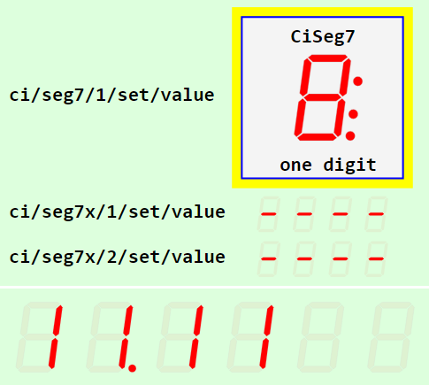
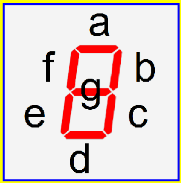
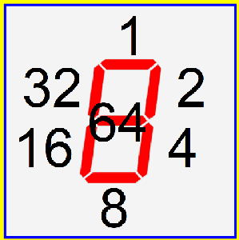

Letzte &Auml;nderung: 5.3.2022 <a name="up"></a>   
<table><tr><td></img></td><td>
<h1>Vue-MQTT: SVG Siebensegment-Anzeige mit MQTT-Ansteuerung</h1>
<a href="../LIESMICH.md">==> Startseite</a> &nbsp; &nbsp; &nbsp; 
<a href="./m4h570_Vue_ci_mqtt_seg7_e.md">==> English version</a> &nbsp; &nbsp; &nbsp; 
</td></tr></table>
<a href="https://github.com/khartinger/mqtt4home/tree/main/source_Vue/vue70_ci_mqtt_seg7">==> Code @ GitHub</a><hr>

# Worum geht es?
Dieses Projekt "Vue: MQTT Seg7" stellt eine Siebensegmentanzeige f&uuml;r SVG-Grafiken vor, die &uuml;ber MQTT angesteuert wird. Sie kann Zahlen, Hexadezimal-Zahlen, Datum und Uhrzeit anzeigen oder jede beliebige Kombination aus Segmenten darstellen.   
Es sind 1 bis 24 Stellen m&ouml;glich (erweiterbar durch &Auml;ndern des Wertes `digitMaxNumber`).   

Das folgende Bild zeigt einige Anwendungsbeispiele:   
   
_Bild 1: Anwendungsbeispiele der Siebensegment-Anzeige_   

Das oberste Bild zeigt die Anzeige einer Stelle mit dem f&uuml;r Ci-Elemente (Controller-Indicator-Elemente) typischen Rahmen, die &uuml;brigen drei Anzeigen zeigen eine verschiedene Anzahl von Stellen und Gr&ouml;&szlig;en.   
Alle Werte k&ouml;nnen durch MQTT-Nachrichten ge&auml;ndert werden.   

Klickt man auf die Siebensegmentanzeige, wird eine Nachricht mit dem gerade angezeigten Wert ausgesendet.   

## Diese Anleitung beantwortet folgende Fragen:   
1. [Welche Dinge ben&ouml;tige ich f&uuml;r dieses Projekt?](#a10)   
2. [Wie bringe ich dieses Beispiel auf meinem Rechner zum Laufen?](#a20)
3. [Wie kann ich Zeichen auf der Anzeige darstellen?](#a30)   
4. [Wie passe ich die Eigenschaften der Anzeige an meine W&uuml;nsche an?](#a40)   

<a name="a10"></a>[_Zum Seitenanfang_](#up)   

# Welche Dinge ben&ouml;tige ich f&uuml;r dieses Projekt?

* Hardware: PC oder Laptop mit Internetzugang, Browser   
* Hardware: Raspberry Pi als Access Point (WLAN Raspi11, PW 12345678) mit der IP 10.1.1.1, auf dem ein MQTT-Broker l&auml;uft (zB Mosquitto)   
* Software: Visual Studio Code ("VSC"), das f&uuml;r Vue-Anwendungen bereits vorbereitet ist.   
* Software: Die MQTT-Klient-Programme `mosquitto_sub` und ` mosquitto_pub` (auf dem PC oder RasPi installiert)   

<a name="a20"></a>[_Zum Seitenanfang_](#up)   

# Wie bringe ich das Projekt auf meinem Rechner zum Laufen?   

Eine M&ouml;glichkeit besteht darin, ein leeres VSC Projekt anzulegen, die Dateien von github herunterzuladen und in das VSC Projekt zu kopieren.   

## Wie lege ich ein leeres VSC Projekt an?
1. Visual Studio Code (VSC) starten.   
2. VSC: Terminal-Fenster &ouml;ffnen: Men&uuml; Terminal - New Terminal.   
3. VSC-Terminal: In den Ordner wechseln, unter dem das Vue-Projekt erzeugt werden soll, zum Beispiel:   
   `cd /c/work/test_vue`   
4. VSC-Terminal: Vue.js Applikation erzeugen: `vue create vue70_ci_mqtt_seg7`  
   Mit Cursortasten, Leertaste und &lt;Enter&gt; Folgendes ausw&auml;hlen:   
   `> Manually select features` &nbsp; &lt;Enter&gt;   
   `(*) Choose Vue version`   
   `(*) Babel`   
   `(*) TypeScript`   
   `( ) Router`   
   `(*) Linter / Formatter`   
   &lt;Enter&gt;   
   _`> 3.x`_ &nbsp; &lt;Enter&gt;      
   _`? Use class-style component syntax?`_ &nbsp; __`N`__ &lt;Enter&gt;   
   _`? Use Babel alongside TypeScript (required for modern mode, auto-detected polyfills, transpiling JSX)?`_ &nbsp; __`N`__ &lt;Enter&gt;   
   _`? Use history mode for router? (Requires proper server setup for index fallback in production)`_ &nbsp; __`N`__ &lt;Enter&gt;   
   _`? Pick a linter / formatter config:`_ &nbsp; __`ESLint + Standard config`__ &lt;Enter&gt;   
   _`? Pick additional lint features: `_ &nbsp; __`Lint on save`__ &lt;Enter&gt;   
   _`? Where do you prefer placing config for Babel, ESLint, etc.?`_  &nbsp; __`In dedicated config file`__ &lt;Enter&gt;   
   _`? Save this as a preset for future projects? (y/N)`_ &nbsp; __`N`__ &lt;Enter&gt;   
5. In den Projektordner wechseln: _VSC Men&uuml; Datei - Ordner &ouml;ffnen_..   
   `c:/work/test_vue/vue70_ci_mqtt_seg7` [Ordner ausw&auml;hlen]   
6. MQTT Bibliothek installieren:   
   VSC: Terminal-Fenster &ouml;ffnen: Men&uuml; Terminal - New Terminal.   
   `npm install mqtt --save`   

## Wie kann ich die Projekt-Dateien herunterladen?
Um sich das einzelne Herunterladen der Dateien zu ersparen, ist es am einfachsten, das ganze Projekt `mqtt4home` als zip-Datei herunterzuladen:   

1. Im Browser die Adresse (URL) [`https://github.com/khartinger/mqtt4home`](https://github.com/khartinger/mqtt4home) eingeben.   
2. Den Button [Code] anklicken, "Download ZIP" w&auml;hlen und im Auswahl-Fenster [*] Datei speichern [OK] ausf&uuml;hren.   

## Wie kann ich die heruntergeladenen Dateien ins VSC-Projekt kopieren?
1. Im Browser bei Download f&uuml;r die Datei __mqtt4home-main.zip__ "Datei &ouml;ffnen" anklicken (oder ins Download-Verzeichnis wechseln und dort die zip-Datei &ouml;ffnen).   
2. Im Explorer das Verzeichnis `mqtt4home-main/source_Vue/vue70_ci_mqtt_seg7/src/` mit der rechten Maustaste anklicken und "Kopieren" w&auml;hlen.   
3. Ins Projektverzeichnis `c:/work/test_vue/vue70_ci_mqtt_seg7` wechseln und dort die Dateien einf&uuml;gen (und dabei drei Dateien &uuml;berschreiben). Beim Einf&uuml;gen wird das Verzeichnis automatisch entpackt.   

## Wie kann ich das Projekt starten?
1. In VSC &uuml;ber den Men&uuml;punkt Terminal - New Terminal das Terminalfenster &ouml;ffnen (falls es nicht schon offen ist) und den eingebauten Server starten mit   
`npm run serve`   
2. Im Browser folgende Adresse (URL) eingeben:   
`localhost:8080`   
  Im Browser sollte _Bild 1_ (oben) angezeigt werden.   

<a name="a30"></a>[_Zum Seitenanfang_](#up)   

# Wie kann ich Zeichen auf der Anzeige darstellen?
## Wie sende ich Zeichen an das Display?
Zum Ausprobieren muss das Projekt - wie oben beschrieben - gestartet werden. 
Als Browser eignet sich Google Chrome besonders, da man mit der Taste [F12] die Entwickler-Tools &ouml;ffnen kann.   

Nach dem Start des Servers oder nach einem Aktualisieren der Seite sollte in der Entwickler-Konsole von Chrome ein Text wie   
`MqttClient-Constructor: subscribe #`   
`MqttClient-Constructor: finished`   
stehen.   
Steht hingegen "WebSocket connection to 'ws://10.1.1.1:1884/' failed:", dann fehlt die Verbindung zum Broker. (ZB fehlende WLAN-Verbindung)   

Mit Hilfe des Programms `mosquitto_pub` kann man Werte an die Anzeige senden:   
* `mosquitto_pub -h 10.1.1.1 -t ci/seg7/1/set/value -m A`   
  In der obersten Anzeige wird der Wert A dargestellt.   

* `mosquitto_pub -h 10.1.1.1 -t ci/seg7x/1/set/value -m 12:54`   
  In der zweiten Anzeige wird der Wert 12:54 dargestellt.   

* `mosquitto_pub -h 10.1.1.1 -t ci/seg7x/2/set/value -m 456.7`   
  In der dritten Anzeige wird der Wert 456.7 dargestellt.   

* `mosquitto_pub -h 10.1.1.1 -t ci/seg7x/3/set/value -m --12--`   
  In der untersten Anzeige wird fix der Wert --12-- dargestellt.   
  Das Weiterlaufen der ver&auml;nderlichen Anzeige erreicht man durch folgende Nachricht   
  `mosquitto_pub -h 10.1.1.1 -t ci/seg7x/3/set/value -m ""`   

### Zahlen, Zeit, Datum   
Zur Darstellung einer Zahl, Zeit oder eines Datums stehen die Ziffern 0 bis 9, das Minus-Zeichen, der Punkt und der Doppelpunkt zur Verf&uuml;gung. Beispiele:   
    * Anzeige der Zahl -5.66   
    `mosquitto_pub -h 10.1.1.1 -t ci/seg7x/1/set/value -m -5.66`   
  * Anzeige der Uhrzeit 12:22   
    `mosquitto_pub -h 10.1.1.1 -t ci/seg7x/1/set/value -m 12:22`   
  * Anzeige des Datums 14.03.   
    `mosquitto_pub -h 10.1.1.1 -t ci/seg7x/1/set/value -m 14.03.`   

### Hexadezimalzahlen
Zur Darstellung von HEX-Werten stehen zus&auml;tzlich zu den Ziffern 0 bis 9 die Zeichen A, b, c, d, E und F zur Verf&uuml;gung.   

### Sondersymbole
M&ouml;chte man eigene Symbole entwerfen, so kann jedes Segment einzeln angesprochen werden. Dazu muss ein Plus gefolgt von einem Wert gesendet werden. Der Wert berechnet sich aus der Summe der eingeschalteten Segmente auf folgende Weise:   

Segment a (waagrecht oben): Wert 1   
Segment b (senkrecht rechts oben): Wert 2   
Segment c (senkrecht rechts unten): Wert 4   
Segment d (waagrecht unten): Wert 8   
Segment e (senkrecht links unten): Wert 16   
Segment f (senkrecht links oben): Wert 32   
Segment g (waagrecht Mitte): Wert 64   
Punkt: Wert 128   
Doppelpunkt: Wert 256   

     
_Bild 2: Berechnung der Segmentwerte_   

__Beispiel__: Es sollen alle waagrechten und daneben alle senkrechten Segmente eingeschaltet werden.   
* Wert f&uuml;r alle waagrechten Symbole (Segmente a, d, g): 1 + 8 + 64 = 73   
* Wert f&uuml;r alle senkrechten Symbole (Segmente b, c, e, f): 2 + 4 + 16 + 32 = 54   

Zu sendende MQTT-Nachricht:   
`mosquitto_pub -h 10.1.1.1 -t ci/seg7x/1/set/value -m +73+54`   

Ein Mischen der Zahlenformate ist nicht m&ouml;glich (ein Digit mit plus (+), das andere Digit als Zeichen).

<a name="a40"></a>[_Zum Seitenanfang_](#up)   

# Wie passe ich die Eigenschaften der Anzeige an meine W&uuml;nsche an?
## Was tun, wenn der Broker nicht die IP-Adresse 10.1.1.1 hat?
Hat der Broker nicht die IP-Adresse 10.1.1.1, so kann die IP in der Datei `CiMqttClient.ts` als Wert   
`host: '10.1.1.1',`   
gesetzt werden.   

## Welche Aufrufparameter gibt es?
Der Aufruf einer Siebensegment-Anzeige erfolgt zB in `CiMain1.vue` durch   
  `<CiSeg7 :x="180" :y="55" value="8" :height="48" sid= "ciSeg7_1" lines="0" :border="3"></CiSeg7>`   
oder durch   
  `<CiSeg7x :x="180" :y="120" digits="4" value="----" :height="20" sid= "ciSeg7x_1"></CiSeg7x>`   

CiSeg7 ... Siebensegmentanzeige mit einer Stelle   
CiSeg7x ... mehrstellige Anzeige   

__*Als Parameter sind m&ouml;glich*__:   
* `x .......... ` x-Koordinate des Mittelpunktes der Anzeige (erforderlich)   
* `y .......... ` y-Koordinate des Mittelpunktes der Anzeige (erforderlich)   
* `value ...... ` Anzuzeigende Ziffer 0 ... F oder Wert (Vorgabe `'8:.'`)   
* `height ..... ` H&ouml;he der Anzeige (Vorgabe `26.2`)   
* `sid ........ ` ID der Anzeige (Vorgabe `''`)   
* `colorOn .... ` Farbe eines eingeschalteten Segments (Vorgabe rot dh. `'#FF0000'`)   
* `colorOff ... ` Farbe eines ausgeschalteten Segments (Vorgabe hoch transparentes Rot dh. `'rgba(255,0,0,0.05)'`)   
* `lines ...... ` Anzahl der Zeilen, die angezeigt werden sollen: 0=keine, 1=Titel, 2=Titel + Zeile 5 (Vorgabe `0`)   
* `border ..... ` Anzeige eines 100x100 Pixel gro&szlig;en Randes (wie bei Ci-Elementen) (Vorgabe ist kein Rand: `0`)   
* `digits ..... ` Anzahl der Stellen der Siebensegmentanzeige (nur bei `<CiSeg7x>`)

## Definition weiterer Eigenschaften einer Siebensegmentanzeige
Jede Siebensegmentanzeige, die MQTT verwenden will, muss im Siebensegment-Controller (Datei `controller/CiSeg7xController`) im Array `ciSeg7xs` eingetragen werden, wobei folgende Eigenschaften m&ouml;glich sind:   

* __id__: ID der Siebensegmentanzeige. Diese muss eindeutig sein.   
* name?: (Zus&auml;tzlicher) Name der Siebensegmentanzeige.   
* __subTopic__: Topic, auf das die Siebensegmentanzeige reagiert (subscribe).   
* __pubTopic__: Topic der Nachricht, die bei einem Klick versendet wird.   
* pubPayload?: Payload der Nachricht, die bei einem Klick versendet wird.   
* __iSeg7xState__: Siebensegmentanzeige-Status (0=off, 1=on, -1=unknown)    
* text5?: Text f&uuml;r die Zeile 5 (falls gew&uuml;nscht).   
* value7x?: Anzuzeigender Wert   

Ein Fragezeichen nach dem Namen zeigt an, dass dieser Wert nicht angegeben werden muss.   

_Beispiel_:   
```   
  public ciSeg7xs: Array<CiSeg7x> = reactive(
    [
      {
        id: 'ciSeg7x_1',
        name: '',
        iSeg7xState: -1,
        text5: 'line 5 text...',
        subTopic: 'ci/seg7x/1/set/value',
        pubTopic: 'ci/seg7x/1/ret/value'
        // pubPayload: '?'
      },
// ...
    ]
  );
```   
Mindestens angegeben werden m&uuml;ssen die Eigenschaften `id`, `iSeg7xState`, `subTopic` und `pubTopic`.   

[Zum Seitenanfang](#up)
