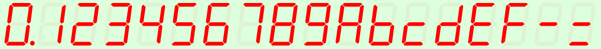
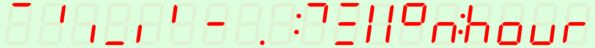
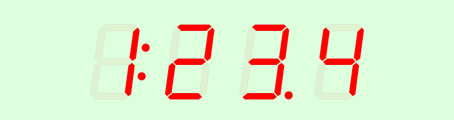

Last modified: 2022-03-04    
<table><tr><td></td><td>
<h1>Vue: Control of a SVG seven-segment display with MQTT</h1>
<a href="../README.md">==> Home page</a> &nbsp; &nbsp; &nbsp; 
<a href="./m4h572_Vue_mqtt_seg7.md">==> German version</a> &nbsp; &nbsp; &nbsp; 
</td></tr></table>
<a href="https://github.com/khartinger/mqtt4home/tree/main/source_Vue/vue72_mqtt_seg7">==> Code @ GitHub</a>

# What is it about?
This project "Vue: MQTT Seg7" introduces a seven-segment display that is easily cascadable and can be used in SVG graphics to display numbers, date and time.   
The control is done via MQTT.   

The following image shows the HEX digits of the seven-segment display:   
   
_Figure 1: Standard seven-segment digits_.   

In addition to these values, any combination of the single segments can be displayed, e.g.
   
_Image 2: More seven-segment possibilities_.   

## This guide answers the following questions:   
1.[What things do I need for this project?](#a10)   
2. [How do I get this example to work on my computer?](#a20)
3. [How can I display characters on the screen?](#a30)   

[_Top of page_](#up)

# What things do I need for this project?

* Hardware: PC or laptop with internet access, browser.   
* Hardware: Raspberry Pi as access point (WLAN Raspi11, PW 12345678) with the IP 10.1.1.1, running an MQTT broker (e.g. Mosquitto)   
* Software: Visual Studio Code ("VSC"), which is already prepared for Vue applications.   
* Software: The MQTT client programs `mosquitto_sub` and `mosquitto_pub` (installed on the PC or RasPi).   

[_Top of page_](#up)

# How do I get the project to work on my computer?   

One way is to create an empty VSC project, download the files from github and copy them into the VSC project.   

## How do I create an empty VSC project?
1. Start Visual Studio Code (VSC).   
2. Open VSC: Terminal window: Menu Terminal - New Terminal.   
3. VSC Terminal: Change to the folder under which the Vue project is to be created, for example:   
   `cd /c/work/test_vue`.   
4. VSC-Terminal: Create Vue.js application: `vue create vue72_mqtt_seg7`.  
   Use cursor keys, space bar and &lt;Enter&gt; to select the following:   
   `> Manually select features` &nbsp; &lt;Enter&gt;   
   `(*) Choose Vue version`   
   `(*) Babel`   
   `(*) TypeScript`   
   `( ) Router`   
   `(*) Linter / Formatter`   
   &lt;Enter&gt;   
   _`> 3.x`_ &nbsp; &lt;Enter&gt;      
   _`? Use class-style component syntax?`_ &nbsp; __`N`__ &lt;Enter&gt;   
   _`? Use Babel alongside TypeScript (required for modern mode, auto-detected polyfills, transpiling JSX)?`_ &nbsp; __`N`__ &lt;Enter&gt;   
   _`? Use history mode for router? (Requires proper server setup for index fallback in production)`_ &nbsp; __`N`__ &lt;Enter&gt;   
   _`? Pick a linter / formatter config:`_ &nbsp; __`ESLint + Standard config`__ &lt;Enter&gt;   
   _`? Pick additional lint features: `_ &nbsp; __`Lint on save`__ &lt;Enter&gt;   
   _`? Where do you prefer placing config for Babel, ESLint, etc.?`_ &nbsp; __`In dedicated config file`__ &lt;Enter&gt;   
   _`? Save this as a preset for future projects? (y/N)`_ &nbsp; __`N`__ &lt;Enter&gt;   
5. Switch to the project folder: _VSC Menu File - Open Folder_..   
   `c:/work/test_vue/vue72_mqtt_seg7` [select folder].   
6. Install MQTT library:   
   VSC: Open Terminal window: Menu Terminal - New Terminal.   
   `npm install mqtt --save`   

## How can I download the project files?
To save downloading the files one by one, the easiest way is to download the whole project `mqtt4home` as a zip file:   

1. In the browser enter the address (URL) [`https://github.com/khartinger/mqtt4home`](https://github.com/khartinger/mqtt4home).   
2. Click the [Code] button, select "Download ZIP" and execute [*] Save file [OK] in the selection window.   

## How can I copy the downloaded files to the VSC project?
1. Click "open file" in the browser at download for the file __mqtt4home-main.zip__ (or change to the download directory and open the zip file there).   
2. Right-click the directory `mqtt4home-main/source_Vue/vue72_mqtt_seg7/src/` in the explorer and select "Copy".   
Change to the project directory `c:/work/test_vue/vue72_mqtt_seg7` and insert the files there (writing three files). The directory will be unpacked automatically.   

## How can I start the project?
1. Open the terminal window in VSC via the menu Terminal - New Terminal (if it is not already open) and start the built-in server with   
`npm run serve`   
2. Enter the following address (URL) in the browser:   
`localhost:8080`   
  The browser should display _image 3_.   
   
_Fig. 3: Seven segment display: start value_   

[_Top of page_](#up)

# How can I show characters on the display?
## How do I send characters to the display?
To try it out, the project must be started - as described above. 
As a browser Google Chrome is especially suitable, because you can open the developer tools &ouml;ff with the key [F12].   
After starting the server or refreshing the page, the developer console of Chrome should display a text like   
`MqttClient-Constructor: subscribe #`   
`MqttClient-Constructor: finished`   

If, on the other hand, it says "WebSocket connection to 'ws://10.1.1:1884/' failed:", then the connection to the broker is missing. (E.g. missing WLAN connection)   

With the help of the program `mosquitto_pub` you can send values to the display:   
  `mosquitto_pub -h 10.1.1.1 -t seg7/1/set/value -m 9.876`   
The value 9.876 will be shown in the display.   

## Which values can be displayed?
The segment display is called in the file `Seg7MainMqtt.vue` in the `<template>` area with the line   
`<Seg7x :x="130" :y="40" :value="value7x" digits="4" :height="40" sid="sid1"> </Seg7x>`   

The parameter "`digits`" sets the number of digits (here 4, maximum 24).   

### Numbers, time, date   
To represent a number, time or date, the digits 0 to 9, the period and the colon are available.   Examples:   
  * Display of the number -5.66   
    `mosquitto_pub -h 10.1.1.1 -t seg7/1/set/value -m -5.66`   
  * Display the time 12:22   
    `mosquitto_pub -h 10.1.1.1 -t seg7/1/set/value -m 12:22`   
  * Display of the date 14.03.   
    `mosquitto_pub -h 10.1.1.1 -t seg7/1/set/value -m 14.03.`   

### Hexadecimal numbers
In addition to the digits 0 to 9, the characters A, b, c, d, E and F are available for representing HEX values.   

### Special symbols
If you want to display your own symbols, each segment can be addressed individually. To do this, a plus followed by a value must be sent. The value is calculated from the sum of the activated segments in the following way:   

Segment a (horizontal top): Value 1   
Segment b (vertical top right): Value 2   
Segment c (vertical right bottom): Value 4   
Segment d (horizontal bottom): Value 8   
Segment e (vertical bottom left): Value 16   
Segment f (vertical top left): Value 32   
Segment g (horizontal center): Value 64   
Dot: Value 128   
Colon: value 256   

__Example__: All horizontal segments and next to them all vertical segments are to be switched on.   
* Value for all horizontal symbols (segments a, d, g): 1 + 8 + 64 = 73   
* Value for all vertical symbols (segments b, c, e, f): 2 + 4 + 16 + 32 = 54   

MQTT message to be sent:   
`mosquitto_pub -h 10.1.1.1 -t seg7/1/set/value -m +73+54`   

Mixing the number formats is not possible (one digit like this the other digit different).

[_Top of page_](#up)
