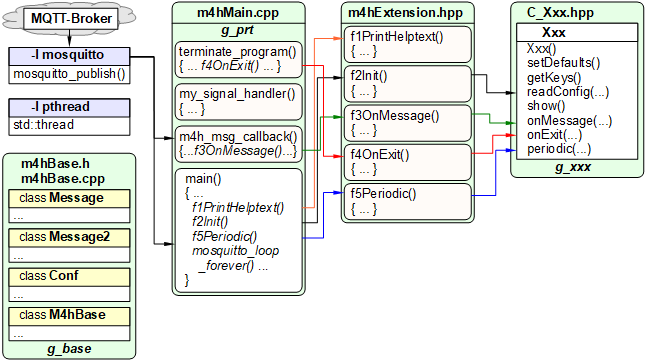

Letzte &Auml;nderung: 14.02.2022 <a name="up"></a>   
<table><tr><td></img></td><td>
<h1><i>RasPi m4hInBlockOut</i>: Filtern bzw. Blockieren von MQTT-Nachrichten</h1>
<a href="../../LIESMICH.md">==> Startseite</a> &nbsp; &nbsp; &nbsp; 
<a href="./README.md">==> English version</a> &nbsp; &nbsp; &nbsp; 
</td></tr></table>
<hr>

# Worum geht es?
Dieses Programm dazu, dass bestimmte Nachrichten nicht zu oft versendet werden. Wird eine registrierte Nachricht empfangen, wird gepr&uuml;ft, ob innerhalb der letzten Zeit diese Nachricht bereits empfangen wurde. Nur wenn dies nicht der Fall ist, wird eine vorgegebene Nachricht weitergesendet.   
Damit kann zwar nicht das Versenden der Originalnachricht verhindert werden, wohl aber das Senden der weitergeleiteten Nachricht.   

_Beispiel f&uuml;r einen Konfigurationsdatei-Eintrag:_   
Nachrichten mit dem Topic `m4hInBlockOut/test3` sollen in Nachrichten mit dem Topic `m4hInBlockOut/test3/forwarded` umgewandelt werden. Der Original-Payload soll der Zusatz `(Block: <block> sec)` angeh&auml;ngt werden, wobei `<block>` f&uuml;r die Blockierzeit steht. Diese soll eine Minute betragen.   
L&ouml;sung - Eintrag in der Konfigurationsdatei:   

```   
[inblockout]
in    : m4hInBlockOut/test3
block : 00:01:00
out   : <in>/forwarded <text> (Block: <block> sec)
retain: false
```   

_Anmerkung_: Die Platzhalter `<in>` f&uuml;r das eingehende Topic, `<text>` f&uuml;r die eingehende Payload und `<block>` f&uuml;r die Blockierzeit (in Sekunden) sind fix vom Programm vorgegeben.   

## Diese Anleitung beantwortet folgende Fragen:   
1. [Welche Hilfsmittel ben&ouml;tige ich f&uuml;r dieses Projekt?](#a10)   
2. [Wie verwende ich dieses Programm?](#a20)   
3. [Welche Konfigurationsm&ouml;glichkeiten gibt es?](#a30)   
4. [Wie &uuml;bersetze und teste ich das Programm?](#a40)   
5. [Wie ist das Programm codiert?](#a90)   

<a name="a10"></a>[_Zum Seitenanfang_](#up)   

# Welche Hilfsmittel ben&ouml;tige ich f&uuml;r dieses Projekt?
Theoretisch k&ouml;nnten alle Arbeitsschritte auf dem RasPi durchgef&uuml;hrt werden, praktisch ist das Verwenden eines PC/Laptop sinnvoll. Daher wird folgendes ben&ouml;tigt:   

* Hardware: Raspberry Pi als Access Point (WLAN Raspi11, PW 12345678) mit der IP 10.1.1.1, auf dem ein MQTT-Broker l&auml;uft (zB Mosquitto)   
---   
* Hardware: PC oder Laptop mit Internetzugang, Browser   
* Software: Terminal-Programm [__*putty*__](https://www.chiark.greenend.org.uk/~sgtatham/putty/latest.html) auf dem PC/Laptop   
---   
* Software: Visual Studio Code ("VSC"), das f&uuml;r C++-Anwendungen vorbereitet ist.   
* Software: [__*WinSCP*__](https://winscp.net/eng/docs/lang:de) zur Daten&uuml;bertragung vom PC/Laptop zum RasPi.   
* Software: Die MQTT-Klient-Programme `mosquitto_sub` und ` mosquitto_pub` (auf dem PC oder RasPi installiert) zum Testen des Programms.   

<a name="a20"></a>[_Zum Seitenanfang_](#up)   

# Wie verwende ich dieses Programm?
Liegt das Programm bereits kompiliert im Verzeichnis `~/m4hInBlockOut` vor, muss es lediglich durch folgende Eingabe in putty oder einer RasPi-Konsole gestartet werden:   
`~/m4hInBlockOut/m4hInBlockOut`   
_Anmerkung_: Zum Erzeugen der ausf&uuml;hrbaren Datei siehe Kapitel [Wie &uuml;bersetze und teste ich das Programm?](#a40).

Nach dem Einlesen der Konfigurationsdatei (Vorgabe `./m4h.conf`) wird die Verbindung zum Broker hergestellt:   

```   
Read config file ./m4h.conf: OK
=====[base]===========================
config file         | ./m4h.conf
all keys            | versionin|versionout|mqttstart|mqttend|progend|readconfin|readconfout|addtime
version (in)        | -t m4hInBlockOut/get -m version
version (out)       | -t m4hInBlockOut/ret/version -m 2022-02-14
mqtt @ start (out,*)| -t info/start -m m4hInBlockOut
mqtt @ end (out,*)  | -t info/end__ -m m4hInBlockOut
progend by mqtt (in)| -t m4hInBlockOut/set/end -m ..true..
reload conf-file(in)| -t m4hInBlockOut/set/conf -m ./m4h.conf
reload conf-fil(out)| -t m4hInBlockOut/ret/conf -m Reload Config file:
         * add time | true
=====[inblockout]==============================
config file         | ./m4h.conf
all keys            | in|block|action|out|retain
.....inblockout messages..............
3 messages:
 IN: -t m4hInBlockOut/test1 -m payload_must_fit | block 10s | OUT: -t <in>/ret -m New message to fixed payload :) | (no action)
 IN: -t m4hInBlockOut/test2 -m  | block 10s | OUT: -t <in> -m <text> (sent by inblockout!) | (no action)
 IN: -t m4hInBlockOut/test3 -m  | block 60s | OUT: -t m4hInBlockOut/ret/test3 -m <text> (Block: <block> sec) | (no action)
Try to connect to mosquitto...
Connected: Waiting for topics...
```   

Nachrichten mit dem Topic `m4hInBlockOut/test1` und der Payload `payload_must_fit` erzeugen jetzt nur mehr alle 10 Sekunden eine Nachricht mit dem Topic `m4hInBlockOut/test1/ret` und der Payload `New message to fixed payload :)`.   
Entsprechendes gilt f&uuml;r die Nachrichten `m4hInBlockOut/test2` und `m4hInBlockOut/test3`, wobei hier der Inhalt der eingehenden Payload beliebig ist.   

Programmende mit &lt;strg&gt;c   

<a name="a30"></a>[_Zum Seitenanfang_](#up)   

# Welche Konfigurationsm&ouml;glichkeiten gibt es?   
Für jede zu kontrollierende Nachricht muss in der Konfigurationsdatei (zB `m4h.conf`) eine eigene `[inblockout]`-Sektion erstellt werden.   

Folgende Schl&uuml;sselw&ouml;rter sind m&ouml;glich:   
`in|block|action|out|retain`   
F&uuml;r jeden `[inblockout]`-Eintrag m&uuml;ssen mindestens die Schl&uuml;ssel `in:` und `out:` angegeben werden!   

## in
Topic der zu &uuml;berwachenden Nachricht.   
Falls eine Payload angegeben wird, so muss auch diese &uuml;bereinstimmen.   

_Beispiel:_   
`in    : m4hInBlockOut/test1 payload_must_fit`   
oder   
`in    : m4hInBlockOut/test2`   

## block
Angabe der Blockierzeit im Format `HH:MM:SS` (mit `HH`=Stunden, `MM`=Minuten und `SS`=Sekunden).   
Folgende Grenzwerte sind im Programm vorgegeben:   
Minimale Blockierzeit: 1 Sekunde   
Maximale Blockierzeit: 30 Tage   
Blockierzeit, wenn in der Konfigurationsdatei kein Wert vorgegeben wird: 6 Stunden   

```   
#define IBO_BLOCK_SEC_DEFAULT 21600         // 21600s = 6h
#define IBO_BLOCK_SEC_MIN     1             // 1s = 1s
#define IBO_BLOCK_SEC_MAX     2592000       // 2592000 = 30d
```   

_Beispiel f&uuml;r eine Zeit von 10 Sekunden:_  
`block : 00:00:10`   

## action
Derzeit sind keine Aktionen definiert.   

## out
Topic und Payload f&uuml;r das Versenden einer Nachricht, wenn die eingehende Nachricht nicht blockiert wurde.   

Beim Zusammenstellen des Topics kann der Platzhalter `<in>` verwendet werden, der f&uuml;r das eingehende Topic steht.   

Beim Zusammenstellen der Payload k&ouml;nnen die Platzhalter `<in>`, `<text>` und `<block>` verwendet werden, wobei `<in>` f&uuml;r das eingehende Topic, `<text>` f&uuml;r die eingehende Payload und `<block>` f&uuml;r die Blockierzeit stehen.   

Topic und Payload m&uuml;ssen durch ein Leerzeichen getrennt werden.   
_Beispiel:_   
`out   : <in>/ret New_payload`   

## retain
Angabe, ob f&uuml;r die ausgehende Nachricht das Retain-Flag gesetzt werden soll. Vorgabe ist nein.   
M&ouml;gliche Werte f&uuml;r den Retainwert sind `true` und `false`.   

_Beispiel:_   
`retain: true`   

<a name="a40"></a>[_Zum Seitenanfang_](#up)   

# Wie &uuml;bersetze und teste ich das Programm?
Befinden sich bereits alle Dateien des Projekts im Verzeichnis `~/m4hInBlockOut`, muss lediglich die ausf&uuml;hrbare Datei durch folgende Eingabe in putty oder einer RasPi-Konsole erzeugt werden:   
`g++ m4hMain.cpp m4hBase.cpp -o m4hInBlockOut -lmosquitto -lpthread -std=c++17`   

Ist dies nicht der Fall, so erfolgt das &Uuml;bersetzen des C++ Hilfsprogramms wie in der Anleitung ["RasPi: Welche C++ Hilfsprogramme gibt es und wie bekomme ich sie zum Laufen?"](https://github.com/khartinger/mqtt4home/blob/main/md/m4h310_RasPiCppDemos.md/#a30) beschrieben.   
Linkadresse: [https://github.com/khartinger/mqtt4home/blob/main/md/m4h310_RasPiCppDemos.md/#a30](https://github.com/khartinger/mqtt4home/blob/main/md/m4h310_RasPiCppDemos.md/#a30)   

## Wie teste ich dieses Programm?
### Erster Test
1. Am PC ein Terminalfenster (`cmd.exe`) oder putty-Fenster oder am RasPi eine Konsole &ouml;ffnen und das Programm zum Anzeigen von MQTT-Nachrichten starten:   
  `mosquitto_sub -h 10.1.1.1 -t "#" -v`   

2. Starten des Programms zB &uuml;ber ein Putty-Fenster   
  `~/m4hInBlockOut/m4hInBlockOut`   

3. Am PC ein zweites Terminalfenster (`cmd.exe`) oder putty-Fenster oder am RasPi eine zweite Konsole &ouml;ffnen und eine MQTT-Nachricht absenden:   
  `mosquitto_pub -h 10.1.1.1 -t m4hInBlockOut/test1 -m payload_must_fit`   
  Im ersten Terminalfenster erscheinen zwei Nachrichten:   
  `m4hInBlockOut/test1 payload_must_fit`   
  `m4hInBlockOut/test1/ret New message to fixed payload :)`   
  Im Putty-Fenster steht folgende Nachricht:   
  `IN: -t m4hInBlockOut/test1 -m payload_must_fit ==> NOT blocked => OUT: -t m4hInBlockOut/test1/ret -m New message to fixed payload :)`   

4. Schickt man innerhalb von 10 Sekunden die Nachricht erneut (oder mehrmals), so   
  erscheint im ersten Terminalfenster nur die erste Nachricht:   
  `m4hInBlockOut/test1 payload_must_fit`   
  Im Putty-Fenster steht folgende Nachricht:   
  `Incoming message "m4hInBlockOut/test1" blocked!`   

### Weitere Tests
Das Senden der Nachricht   
`mosquitto_pub -h 10.1.1.1 -t m4hInBlockOut/test2 -m ***Test2***`   
erzeugt im putty-Fenster zwei Ausgaben:   
* `IN: -t m4hInBlockOut/test2 -m ***Test2*** ==> NOT blocked => OUT: -t m4hInBlockOut/test2 -m ***Test2*** (sent by inblockout!)`   
* `Incoming message "m4hInBlockOut/test2" blocked!`   

und im ersten Terminalfenster:   
`m4hInBlockOut/test2 ***Test2***`   
`m4hInBlockOut/test2 ***Test2*** (sent by inblockout!)`   
Der Grund f&uuml;r die Blockier-Meldung ist, dass das Ausgangs-Topic identisch mit dem Eingangs-Topic ist und die selbst geschickte Nachricht auch wieder empfangen wird ;)   

---   

Das dreimalige Senden der Nachricht   
`mosquitto_pub -h 10.1.1.1 -t m4hInBlockOut/test3 -m ***Test3***`   
erzeugt im putty-Fenster die Ausgabe:   
`IN: -t m4hInBlockOut/test3 -m **test3*** ==> NOT blocked => OUT: -t m4hInBlockOut/ret/test3 -m **test3*** (Block: 60 sec)`   
`Incoming message "m4hInBlockOut/test3" blocked!`   
`Incoming message "m4hInBlockOut/test3" blocked!`   

und im ersten Terminalfenster:   
`m4hInBlockOut/test3 **test3***`   
`m4hInBlockOut/ret/test3 **test3*** (Block: 60 sec)`   
`m4hInBlockOut/test3 **test3***`   
`m4hInBlockOut/test3 **test3***`   

<a name="a90"></a>[_Zum Seitenanfang_](#up)   

# Wie ist das Programm codiert?   
Eine &Uuml;bersicht &uuml;ber die Dateien bietet das folgende Bild, wobei `Xxx` durch `InBlockOut` zu ersetzen ist ;)   
   
_Bild 1: Dateien zur Erstellung eines C++ Hilfsprogramme_   

F&uuml;r die Codierung der Datei `C_InBlockOut.hpp` siehe [https://github.com/khartinger/mqtt4home/blob/main/source_RasPi/m4hInBlockOut/C_InBlockOut.hpp](https://github.com/khartinger/mqtt4home/blob/main/source_RasPi/m4hInBlockOut/C_InBlockOut.hpp)   

[_Zum Seitenanfang_](#up)   
