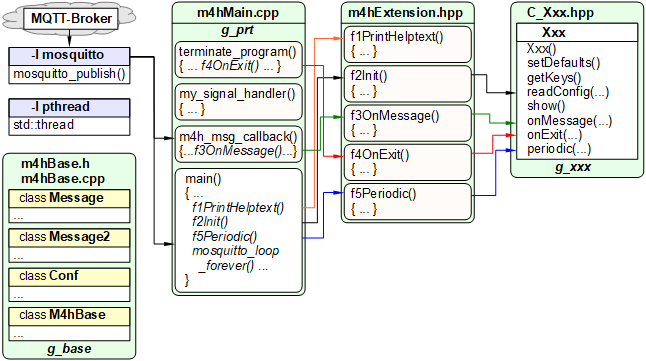

Last modified: 2022-09-20 <a name="up"></a>   
<table><tr><td></td><td>
<h1><i>RasPi m4hLcd</i>: Changing the LCD brightness through an MQTT message</h1>
<a href="../../README.md">==> Home page</a> &nbsp; &nbsp; &nbsp; 
<a href="./LIESMICH.md">==> German version</a> &nbsp; &nbsp; &nbsp; 
</td></tr></table>
<hr>

# What is it about?
With the help of the program `m4hLcd` the brightness of a Rasperry Pi LCD can be changed by a MQTT command.   

## How is the LCD brightness setting done?
To do this, a brightness value from 12 to 255 is entered into the file   
`/sys/class/backlight/rpi_backlight/brightness`   
file.   
__*Important:*__ The above file must be accessible to all users. This is done by the following Linux commands:   
`sudo chown root /sys/class/backlight/rpi_backlight/brightness`   
`sudo chmod 777 /sys/class/backlight/rpi_backlight/brightness`   
`sudo chmod u+s /sys/class/backlight/rpi_backlight/brightness`   

## MQTT commands
Setting the brightness value (e.g. to 64) is done using the following MQTT command:   
`mosquitto_pub -t lcd/set/brightness -m 64`   
As response you get either   
`lcd/ret/brightness 64`   
or, if the value (e.g. 1234) could not be set:   
`lcd/ret/brightness 1234_not_set!_(12...255)`   
   
Furthermore the current brightness value can be queried as follows:   
`mosquitto_pub -t lcd/get -m brightness`   
Result:   
`lcd/ret/brightness 64`   

__*Change the Topics*__   
All topics can be changed in the configuration file `m4h.conf`, e.g.   
```   
[lcd]
getin: info/lcd/get
getout: info/lcd/ret
setin: info/lcd/set
setout: info/lcd/ret
```   

## These instructions answer the following questions:   
1. [What tools do I need for this project?](#a10)   
2. [How do I use this program?](#a20)   
3. [What are the configuration options?](#a30)   
4. [How do I compile and test the program?](#a40)   
5. [How is the program coded?](#a90)   

<a name="a10"></a>[_top of page_](#up)   

# What tools do I need for this project?
Theoretically all steps could be done on the RasPi, practically using a PC/laptop makes sense. Therefore the following is needed:   

* Hardware: Raspberry Pi as access point (WLAN Raspi11, PW 12345678) with IP 10.1.1.1, running an MQTT broker (e.g. Mosquitto).   
---   
* Hardware: PC or laptop with internet access, browser   
* Software: Terminal program [__*putty*__](https://www.chiark.greenend.org.uk/~sgtatham/putty/latest.html) on the PC/laptop   
---   
* Software: Visual Studio Code ("VSC") prepared for C++ applications.   
* Software: [__*WinSCP*__](https://winscp.net/eng/docs/lang:de) for data&uuml;transfer from PC/laptop to RasPi.   
* Software: The MQTT client programs `mosquitto_sub` and ` mosquitto_pub` (installed on the PC or RasPi) to test the program.   

<a name="a20"></a>[_top of page_](#up)   

# How do I use this program?
If the program is already compiled in the directory `~/m4hLcd`, you have to change to this directory and start the program by typing the following in putty or a RasPi console:   
`cd ~/m4hLcd`   
`./m4hLcd`   
_Note_: For creating the executable see chapter "[How to compile and test the program](#a40)".

After reading the configuration file (default `./m4h.conf`) the connection to the broker is established:   

```   
Read config file ./m4h.conf: OK
=====[base]===========================
config file         | ./m4h.conf
all keys            | versionin|versionout|mqttstart|mqttend|progend|readconfin|readconfout|addtime
version (in)        | -t m4hLcd/get -m version
version (out)       | -t m4hLcd/ret/version -m 2022-02-10
mqtt @ start (out,*)| -t info/start -m m4hLcd
mqtt @ end (out,*)  | -t info/end__ -m m4hLcd
progend by mqtt (in)| -t m4hLcd/set/end -m ..true..
reload conf-file(in)| -t m4hLcd/set/conf -m ./m4h.conf
reload conf-fil(out)| -t m4hLcd/ret/conf -m Reload Config file:
         * add time | true
=====[lcd]==============================
config file         | ./m4h.conf
all keys            | getin|getout|setin|setout
.....lcd: get message(s)..............
get topic (in)      | info/lcd/get
get possible payload| ?|help|brightness
get return topic    | info/lcd/ret/
.....lcd: set message(s)..............
set topic base      | info/lcd/set
set possible values | brightness
set return topic    | info/lcd/ret/
Try to connect to mosquitto...
Connected: Waiting for topics...
```   

The program is now waiting for a get or set message...   
End of program with &lt;ctrl&gt;c   

<a name="a30"></a>[_top of page_](#up)   

# What are the configuration options?   

The following keywords are possible:   
`getin|getout|setin|setout`   

## getin
Specify the topic for the get command.   

_example:_   
`getin:  info/lcd/get`   

## getout
Specify the topic for the response of the get command.    

_example:_   
`getout:  info/lcd/ret`   

## setin
Specify the topic for the set command.   

_example:_   
`setin:  info/lcd/set`   

## setout
Specifies the topic for the set command response. This topic is usually the same as the one for the get response.   

_example:_   
`setout:  info/lcd/ret`   

<a name="a40"></a>[_top of page_](#up)   

# How do I compile and test the program?
If all files of the project are already in the directory `~/m4hLog2`, you only have to create the executable file by typing the following in putty or a RasPi console:   
`g++ m4hMain.cpp m4hBase.cpp -o m4hLcd -lmosquitto -lpthread`   

If this is not the case, compiling the C++ utility is done as described in the manual ["RasPi: What C++ utilities are there and how do I get them to work?"](https://github.com/khartinger/mqtt4home/blob/main/md/m4h310_RasPiCppDemos.md/#a30).   
Link address: [https://github.com/khartinger/mqtt4home/blob/main/md/m4h310_RasPiCppDemos.md/#a30](https://github.com/khartinger/mqtt4home/blob/main/md/m4h310_RasPiCppDemos.md/#a30)   

To test the program you can use point ["How do I use this program?"](#a20) of this manual.   

<a name="a90"></a>[_top of page_](#up)   

# How is the program coded?   
An overview of the files is given in the following image, where `Xxx` is to be replaced by `Lcd` ;)   
   
_Fig. 1: Files for the creation of a C++ helper_.   

For the coding of the file `C_Lcd.hpp` see [https://github.com/khartinger/mqtt4home/blob/main/source_RasPi/m4hLcd/C_Lcd.hpp](https://github.com/khartinger/mqtt4home/blob/main/source_RasPi/m4hLcd/C_Lcd.hpp)   

[_top of page_](#up)   
