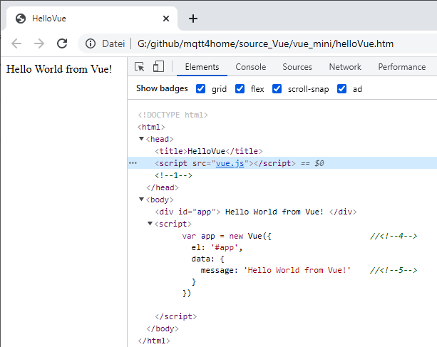

Letzte &Auml;nderung: 15.12.2021 <a name="up"></a>   
<table><tr><td></img></td><td>
<h1>Vue: Erste Anwendung (ohne Visual Studio Code)</h1>
<a href="../../LIESMICH.md">==> Startseite</a> &nbsp; &nbsp; &nbsp; 
<a href="./README.md">==> English version</a> &nbsp; &nbsp; &nbsp; 
</td></tr></table><hr>
  
## Ziele
* Wissen, was Vue ist.   
* Im Browser ein mit Vue erstelltes "Hello World from Vue!" anzeigen.   
   

## Voraussetzungen
* Etwas Wissen &uuml;ber HTML, CSS und JavaScript :)

## Erforderliche Hilfsmittel
* Hardware: PC oder Laptop mit Internetzugang
* Software: Texteditor, Browser

## Was ist Vue?
`Vue.js` ist ein beliebtes Framework f&uuml;r Java Script zum Erstellen von Web-Anwendungen. Es hilft bei der Anzeige von Daten kann durch zahlreiche Plugins (zB zur HTTP-Behandlung) erweitert werden.   
Informationen (in Deutsch) gibt es zB auf folgenden Seiten:   
* [https://de.wikipedia.org/wiki/Vue.js](https://de.wikipedia.org/wiki/Vue.js)   
* [https://t3n.de/news/vuejs-1097879/](https://t3n.de/news/vuejs-1097879/)   
   
## Webseite mit Vue erstellen
1. Ein Anwendungsverzeichnis anlegen (zB mit dem Explorer):   
   `/source_Vue/vue_mini`   

2. Das Vue-Framework downloaden zB von [`https://vuejs.org/v2/guide/installation.html`](https://vuejs.org/v2/guide/installation.html)   
"Development Version" (Datei `vue.js`)   

3.  Das Framework bzw. die Datei `vue.js` ins Arbeitsverzeichnis (zB `/source_Vue/vue_mini`) kopieren.   

4. HTML-Seite im Texteditor erstellen:   
   ```   
   <!DOCTYPE html>
   <html>
   <head>
     <title>HelloVue</title>
     <script src="vue.js"></script>            <!--1-->
   </head>
   <body>
     <div id="app">                            <!--2-->
       {{ message }}                           <!--3-->
     </div>

     <script>
       var app = new Vue({                     //<!--4-->
         el: '#app',
         data: {
           message: 'Hello World from Vue!'    //<!--5-->
         }
       })
     </script>
   </body>
   </html>
   ```   
   Speichern zB unter dem Namen `halloVue.htm`   
   Die wichtigsten Zeilen sind:   
   * `<!--1-->` Einbinden der Vue-Funktionen (Vue-Framework)   
   * `<!--2-->` Mit Hilfe dieses &lt;div&gt;-Tags und der Id "app" wird hier der vom Vue-Script erzeugte "Text" eingebaut.   
   * `<!--3-->` Ausgabe des Wertes der Variablen `message`.   
   * `<!--4-->` Erzeugen der Vue-Instanz, wobei bei `el:` die Id steht.   
   * `<!--5-->` Erzeugen der Variablen `message` und Zuweisung des Textes.   

5. Die Datei `halloVue.htm` im Browser (zB Chrome) &ouml;ffnen.   
   Mit der Taste &lt; F12&gt; kann der Debug-Mode angezeigt werden.   
      
   _Bild 1: Erstes Vue-Programm_   
   Im Bild 1 sieht man links die Ausgabe der HTML-Seite und rechts erkennt man im HTML-Code, dass der Inhalt des `<div>`-Tags durch den Wert der Variablen `message` ersetzt wurde.   
