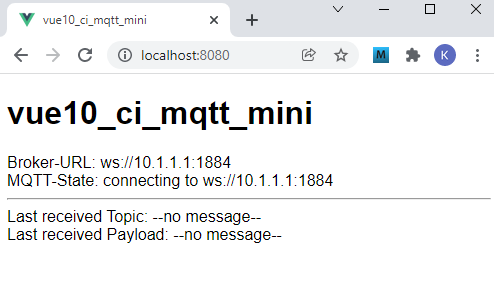
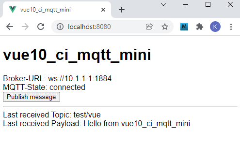

Last modified: 2021-12-13 <a name="up"></a>   
<table><tr><td></td><td>
<h1>How to create a Vue MQTT app easily?</h1>
<a href="../../README.md">==> Home page</a> &nbsp; &nbsp; &nbsp; 
<a href="./LIESMICH.md">==> German version</a> &nbsp; &nbsp; &nbsp; 
</td></tr></table><hr>

# What is it about?
This Vue application "vue10_ci_mqtt_mini" describes how to create a simple MQTT application using `CiMqttClient`.   
It first describes the [required-tools](#required-tools) and the [trying-out/testing-the-app](#trying-out-the-app). After that, the questions [what CiMqttClient can do](#what-can-cimqttclient-do), [how-to-use-CiMqttClient](#how-to-use-cimqttclient), and [how-to-create-this-project](#how-to-create-this-project), are answered. The final part is [details about the coding of ciMqttClient](#details-about-the-coding-of-cimqttclient).

The application automatically connects to a broker after startup and displays received MQTT messages. If you press the "Publish message" button, an MQTT message is sent.   

   
_Figure 1: Start view of the application "vue10_ci_mqtt_mini"_   

   
_Figure 2: View after connecting to the broker and pressing the "Publish message"_ button.   

# Required tools
* Hardware: PC or laptop with internet access, browser
* Hardware: Raspberry Pi (or PC) running an MQTT broker (e.g. Mosquitto)
* Software: Visual Studio Code ("VSC"), which is already prepared for Vue applications (Node.js, npm installed).   

# Trying out the app   
## Prerequisites   
1. The Raspberry Pi (RasPi) has been installed according to the [instructions (section "Central")](../../LIESMICH.md), i.e. on the RasPi with IP `10.1.1.1` the broker program (Mosquitto) is running   
2. The Vue application is loaded in Visual Studio Code (VSC) and the internal server is running (input in terminal: `npm run serve`).   
3. There is a network/WLAN connection between the computer running VSC and the RasPi.   
4. A command/terminal window is open on the PC or Raspberry Pi showing received MQTT messages (input `mosquitto_sub -h 10.1.1.1 -t "#" -v`)   

## Test   
* If one enters the address `localhost:8080` in the browser, _figure 1_ appears (briefly) in the brower.   
* If there is a connection to the broker, the display "MQTT-State: connected" appears after a short time.   
* If you press the [Publish message]-button, the message is displayed in the browser and in the command/terminal window.   

# What can CiMqttClient do?
The MQTT client 'CiMqttClient' represents the connection to the MQTT broker. It contains values as well as methods for MQTT communication.   

## Some default values   
These values are used when connecting automatically.   

| property           | value            | interface.property     |   
| ------------------ | ---------------- | ---------------------- |   
| Host IP            | 10.1.1           | MqttConnection.host    |   
| WebSocket Port     | 1884             | MqttConnection.port    |   
| Subscribe-Topic    | # (all)          | MqttSubscription.topic |   
| Quality of Service | 0 (at most once) | MqttSubscription.qos   |   

For the interfaces (`mqttState`, `mqttConnection`, `mqttSubscription`) and their properties see [Coding of `CiMqttClient.ts`](./src/services/CiMqttClient.ts)   

## Methods   
The MQTT client `CiMqttClient` can do the following:   
* __Automatically connect to the broker at app startup.__   
  To do this, enter the following in the `ciMqttClientInstance` file:   
  `export const ciMqttClientInstance = new CiMqttClient(true)`   
  For the connection including subscribing to the subscribe-topic the default values above are used.   
  If you don't want an automatic connection, `true` must be replaced by `false`.   

* __Manually connect to the broker.__   
    1. the file `ciMqttClientInstance` must contain the following line:   
    `export const ciMqttClientInstance = new CiMqttClient(false)`   
    2. connecting is done with the `hostSubscribe(host, topicSubscribe)` method, specifying the host IP and the topic to subscribe to.   

* __Automatic reconnect,__   
  if the connection to the broker is lost.   

* __Registering CiXxxControllers.__   
  All controllers `CiXxxController` must be derived from the base controller `CiBaseController.ts` and registered in the file `src/services/CiMqttClientInstance.ts`:   
  `registerController (controller: CiBaseController)`.   
  If you forget to register a controller, you will not receive any messages ;)   

* __Subscribing to messages.__   
  Subscribing is done automatically when connecting to the broker. A change of the subscribe topic can be done by the method   
  `subscribe (topic, qos)`   
  Values for `qos`: send message at most once (0), at least once (1) or exactly once (2).   
  
  To process the message, a method   
  `public onMessage (message: Message): void { ... }`   
  must be defined (received topic = `message.topic`, received payload = `message.payload`)   

* __Sending messages.__   
  Sending of messages can be done by the method   
  `publish (topic, payload, retain, qos)`   
  or by own methods that are defined e.g. in the CiXxxController. (Example see [CiMini.vue](./src/controller/CiMiniController.ts))   

* __Provide the connection state as text.__   
  This text is obtained by calling the method `sConnMqttState()`.   

* __Provide the connection URL.__   
  This is obtained by calling the `connectUrl()` method.   

* __Providing other methods.__   
  These include `connect(host, port, endpoint)`, `disconnect()` and `unsubscribe ()`.

## Special features
* By default, all topics are subscribed and each Ci component checks itself whether the received message is addressed to it.   
* If only one group of messages should be subscribed (e.g. all starting with `ci/`), this should be entered as default in the `CiMqttClient.ts` file, e.g. `subTopic = `ci/#`;`   
* Only one topic should be subscribed to at a time, since `unsubscribe ()` only deletes the last subscribed topic.   

# How to use CiMqttClient?

## 1. Include the necessary files
* Creating the directory "controller"   
  Right click on the directory `src`, select "New folder" and enter the name `controller`.   

* Creating the directory "services"   
  Right click on the directory `src`, select "New folder" and enter the name `services`.   

* Copy the files `CiMqttClient.ts` and `CiMqttClientInstance.ts` to the `src/services` directory.   

* Copy the `CiBaseController.ts` file to the `src/controller` directory.   

* Copy the file `CiBase.vue` to the `src/components` directory.   

## 2. Customize the file CiMqttClientInstance
* Specify whether to connect to the broker and subscribe to the topic when the app is started with the default values (constructor value `true`).   

* Enter all controllers that should send or receive MQTT messages.   
  The following two lines are needed in each case (example: "ciMiniController"):   
  `import { ciMiniController } from '@/controller/CiMiniController'`.   
  `ciMqttClientInstance.registerController(ciMiniController)`   

## 3. Integration of the CiMqttClient into a CiXxxController
* Import the components into the controller.   
  Input in the file `CiXxxController.ts`:   
  `import { reactive } from 'vue'`.   
  `import { message } from '@/services/CiMqttClient'`   
  `import { CiBaseController, IBase } from './CiBaseController'`   

* Derive the CiXxxController from `CiBaseController`:   
  `export class CiXxxController extends CiBaseController {`   

* Implementation of the abstract method onMessage:   
  `public onMessage (message: Message): void {`   
  ` // ..ToDo..`   
  `}`   

## 4. Integration of the CiMqttClient into a CiXxxComponent
* Import the ciMqttClientInstance object:   
  `import { ciMqttClientInstance } from '@/services/CiMqttClientInstance'`.   

* In the `computed` area of the CiXxxComponent, the methods of `CiMqttClient` can be accessed via the `ciMqttClientInstance` object.   
  Examples:   
  * Query the broker IP and port:   
    `brokerurl: function (): string { return ciMqttClientInstance.connectUrl() },`   
  * Query only the broker IP:   
    `brokerip: function (): string { return ciMqttClientInstance.mqttConnection.host },`.   
  * query whether the connection to the broker exists   
    `isConnected: function (): boolean { return ciMqttClientInstance.mqttState.connected },`   

&nbsp;   

---   
# How to create this project?
## 1. General
The following diagram gives an overview of the files involved:   

   
_Fig. 3: &Overview of the involved files_   

With the help of the diagram you can see some important connections:   
* The user calls with the brower the file `index.html`, which displays the application   
  (via `App.vue` - `main.ts` - `index.html`).   
* The graphics element `CiMini` consists of a "controller" and "graphics" part (extension `.ts` and `.vue` respectively). These are derived from base components.   
* The connection to the MQTT broker is established via the files `MqttClient.ts` and `MqttClientInstance.ts`, where all controllers must be registered in the file `MqttClientInstance.ts`. If this is forgotten, the controller will not receive MQTT messages ("switch open").   


## 2. Creation of the Vue project in VSC
1. Start Visual Studio Code (VSC).   
2. VSC: Open terminal window: Menu Terminal - New Terminal.   
3. VSC Terminal: Change to the folder under which the Vue project is to be created:   
   `cd /g/github/mqtt4home/source_Vue`   
4. VSC terminal: create Vue.js application:   
  `vue create vue10_ci_mqtt_mini`  
  Use cursor keys, space bar and &lt;Enter&gt; to select the following:   
   `> Manually select features` &nbsp; &lt;Enter&gt;   
   `(*) Choose Vue version`   
   `(*) Babel`   
   `(*) TypeScript`   
   `( ) Router`   
   `(*) Linter / Formatter`   
   &lt;Enter&gt;   
   _`> 3.x`_ &nbsp; &lt;Enter&gt;      
   _`? Use class-style component syntax?`_ &nbsp; __`N`__ &lt;Enter&gt;   
   _`? Use Babel alongside TypeScript (required for modern mode, auto-detected polyfills, transpiling JSX)?`_ &nbsp; __`N`__ &lt;Enter&gt;   
   _`? Use history mode for router? (Requires proper server setup for index fallback in production)`_ &nbsp; __`N`__ &lt;Enter&gt;   
   _`? Pick a linter / formatter config:`_ &nbsp; __`ESLint + Standard config`__ &lt;Enter&gt;   
   _`? Pick additional lint features: `_ &nbsp; __`Lint on save`__ &lt;Enter&gt;   
   _`? Where do you prefer placing config for Babel, ESLint, etc.?`_ &nbsp; __`In dedicated config file`__ &lt;Enter&gt;   
   _`? Save this as a preset for future projects? (y/N)`_ &nbsp; __`N`__ &lt;Enter&gt;   
5. Switch to the project folder: _VSC Menu File - Open folder_..
   `/github/mqtt4home/source_Vue/vue10_ci_mqtt_mini` [select folder].   
6. Install MQTT library:   
   VSC: Open Terminal window: Menu Terminal - New Terminal.   
   `npm install mqtt --save`   
&nbsp;   

## 3. Completing the Vue configuration   
Create the file `vue.config.js`: click on the plus to the right of `VUE10_CI_MQTT_MINI` (New file), enter name.   
_Contents of the file_:   
```   
// ______vue.config.js__________________________________________
module.exports = {
  lintOnSave: false,
  publicPath: './',
  // publicPath: process.env.NODE_ENV === 'production' ? './vue_pubsub2/' : './',
  configureWebpack: {
    devtool: 'source-map'
  },
  chainWebpack: config => {
    config.performance
      .maxEntrypointSize(400000)
      .maxAssetSize(400000)
  }
}

```   
With `publicPath: './',` the relative path is set and the `chainWebpack` entry avoids warnings about the file size (by setting the maximum file size higher ;) )

## 4. Disable linter warning "Unexpected any" at "(value: any)".    
  In the file `.eslintrc.js` under "`rules: {`" add:   
  ```   
  '@typescript-eslint/no-explicit-any': 'off',
  '@typescript-eslint/explicit-module-boundary-types': 'off',
  ```   

## 5. Customize `App.vue` file   
The `App.vue` file is responsible for the following items:   
  * Display of the component `CiMini`.
  * Definition of uniform styles for all pages.   
    Therefore: add all styles starting with a dot.   

_Change the contents of the file to_:   
```   
<!-- App.vue -->
<template>
  <CiMini></CiMini>
</template>

<script lang="ts">
import { defineComponent } from 'vue'
import CiMini from '@/components/CiMini.vue'

export default defineComponent({
  name: 'App',
  components: {
    CiMini
  }
})
</script>

<style>
#app {
  font-family: Avenir, Helvetica, Arial, sans-serif;
  text-align: left;
  color: black;
  margin-top: 0px;
}

  .ciFont1  { font: bold 11px monospace; fill: black; white-space: pre; }
  .cursor    { cursor: pointer; }
  .ciBackground {fill: #ddFFdd; }
  .ciOut     { fill: yellow; stroke: yellow; stroke-width: 1; }
  .ciInColor { fill: #F4F4F4; }
  .ciIn      { fill: #F4F4F4; stroke:blue; stroke-width: 1; }
  .ciLine    { stroke: blue; stroke-width: 1; }
  .ciRect    { fill: none; stroke: blue; stroke-width: 1; }
  .ciFillIt  { stroke: blue; stroke-width: 1; }
  .ciClick   { fill-opacity: 0.0; stroke-width: 1; }
  .ciBorder  { fill-opacity: 0.0; stroke: blue; stroke-width: 1; }
</style>

```   

## 6. Delete files and directories that are not needed   
  * Delete file `components/HelloWorld.vue`   
  * delete directory `assets`   


## 7. Add MQTT functionality
This is already described above in the chapter "[how-to-use-CiMqttClient](#how-to-use-cimqttclient)".   

## 8. Create controller "CiMiniController.ts".

_Coding_:   
```   
// ______CiMiniController.ts____________________________________
// ===========[1] import required components====================
import { reactive } from 'vue'
import { Message } from '@/services/CiMqttClient'
import { CiBaseController, IBase } from './CiBaseController'

// ===========[2] interface for properties of the Controller====
export interface Mini extends IBase {
  topicIn: string;
  payloadIn: string;
}

// ===========[3] define the controller class===================
export class CiMiniController extends CiBaseController {
  // ---------[4] public properties of CiMiniController---------
  public mini: Mini = reactive(
    {
      id: 'mini1',
      topicIn: '--no message--',
      payloadIn: '--no message--'
    }
  )

  // ---------[5] public methods of CiMiniController------------
  // _________[6] receive a message_____________________________
  public onMessage (message: Message): void {
    this.mini.topicIn = message.topic
    this.mini.payloadIn = message.payload
  }

  // _________[7] publish a message_____________________________
  public publishCi (topic: string, payload: string): void {
    // console.log('CiMiniController:publishCi:', '-t ' + topic + ' -m ' + payload)
    this.publish(topic, payload, false, 0)
  }
}

// ===========[8] Provide an object of the controller class=====
export const ciMiniController = new CiMiniController()

```   

## 9. Create webpage "CiMini.vue
The webpage `CiMini.vue` consists like all components of the three parts &lt;template&gt;, &lt;script lang="ts"&gt; and &lt;style scoped&gt;. 

_Coding_:   
```   
<!--CiMini.vue-->
<!-- =========[1] GUI of vue10_ci_mqtt_mini=================== -->
<template>
  <h1>vue10_ci_mqtt_mini</h1>
  <!-- -------[2] show connection info---------------------- -->
  Broker-URL: {{ brokerurl }} <br>
  MQTT-State: {{ mqttstate }} <br>
  <!-- -------[3] show button only if connected to broker--- -->
  <button v-if="mqttstate==='connected'" @click="clkPublish()">Publish message</button>
  <hr>
  <!-- -------[4] show last received message---------------- -->
  Last received Topic: {{ mini.topicIn }} <br>
  Last received Payload: {{ mini.payloadIn }}
</template>

<!-- =========[5] script part of vue10_ci_mqtt_mini=========== -->
<script lang="ts">
// -----------[6] import required components--------------------
import { defineComponent } from '@vue/runtime-core'
import { ciMqttClientInstance } from '@/services/CiMqttClientInstance'
import { Mini, ciMiniController } from '@/controller/CiMiniController'

// -----------[7] define a new (typescript) file component------
export default defineComponent({
  name: 'CiMini',
  computed: {
    // _______[8] get public properties of CiMiniController_____
    mini: function (): Mini { return ciMiniController.mini },
    // -------[9] get mqtt connection infos---------------------
    // _______[10] ip and port of broker________________________
    brokerurl: function (): string { return ciMqttClientInstance.connectUrl() },
    // _______[11] connection state as string___________________
    mqttstate: function (): string { return ciMqttClientInstance.sConnMqttState() }
  },
  methods: {
    // -------[12] functions of CiMini--------------------------
    // _______[13] Publish the default message__________________
    clkPublish: async function (): Promise<void> {
      try {
        // await ciMqttClientInstance.publish('test/vue', 'Hello from vue10_ci_mqtt_mini', false, 0)
        ciMiniController.publishCi('test/vue', 'Hello from vue10_ci_mqtt_mini')
      } catch (e) { console.error('NOT PUBLISHED: ', e) }
    }
  }
})
</script>

<!-- =========[14] styles of vue10_ci_mqtt_mini=============== -->
<style scoped>
</style>

```   

&nbsp;
---   

# Details about the coding of CiMqttClient   

## CiBaseController.ts
The file `CiBaseController.ts` normally does not have to be changed. It defines in the interface `IBase` some properties that all (derived) `CiXxxController` should have. The most important property is the `id`, which is the link between a representation and the data in the controller.   

In the (abstract) class `CiBaseController` the methods `registerClient`, `publish` and `onMessage(message: Message)` are then defined.   

_Coding_:   
```   
// ______CiBaseController.ts____________________________________
import { Message, CiMqttClient } from '@/services/CiMqttClient'
import type { QoS } from 'mqtt'

export interface IBase {
  id: string;
  name?: string;
  border?: number
  subTopic?: string;
  pubTopic?: string;
  pubPayload?: string;
}

export abstract class CiBaseController {
  protected client: CiMqttClient | null = null;

  public registerClient (mqttClient: CiMqttClient): void {
    this.client = mqttClient
  }

  protected async publish (topic: string, payload: string, retain: boolean, qos: QoS): Promise<void> {
    return this.client?.publish(topic, payload, retain, qos)
  }

  public abstract onMessage(message: Message): void;
}

```   

## CiMqttClient.ts
The file `CiMqttClient.ts` normally does not have to be changed, unless you want to change the default host IP (e.g. to 192.168.0.123).   

To prevent properties from being changed unintentionally, there is a private and a read-only public variant.   

_Coding_:   
```   
// ______CiMqttClient.ts________________________________________
import { CiBaseController } from '@/controller/CiBaseController'
import mqtt, { QoS } from 'mqtt'
import { reactive, readonly } from 'vue'

// *************************************************************
// interfaces
// *************************************************************

// -----------message properties--------------------------------
export interface Message {
  topic: string,
  payload: string,
  retain: boolean,
  qos: QoS
}

// -----------state of the MQTT connection----------------------
export interface MqttState {
  connectOnStart: boolean;
  connected: boolean;
  iConnMqttState: number;
  message: Message;
}

// -----------properties for the MQTT connection----------------
export interface MqttConnection {
  host: string;
  port: number;
  endpoint: string;
  clean: boolean;
  connectTimeout: number;
  reconnectPeriod: number;
  clientId: string;
  username: string;
  password: string;
}

// -----------info about the subscribed messages----------------
export interface MqttSubscription {
  topic: string;
  qos: QoS;
  subscribed: boolean;
}

// *************************************************************
// class CiMqttClient
// *************************************************************

export class CiMqttClient {
  // ---------basic properties----------------------------------
  public client: mqtt.Client | null = null;
  public controller: Array<CiBaseController> = [];

  private subTopic = '#';
  private subQos: QoS = 0;

  // ---------some more properties (interfaces)-----------------
  // To prevent values from being changed by mistake,
  // there is always a private and a public variant.
  private privateMqttState: MqttState = reactive<MqttState>({
    connectOnStart: false,
    connected: false,
    iConnMqttState: -1,
    message: { topic: '', payload: '', retain: false, qos: 0 }
  })

  public mqttState = readonly(this.privateMqttState)

  private privateMqttConnection: MqttConnection = reactive<MqttConnection>({
    host: '10.1.1.1',
    port: 1884,
    endpoint: '',
    clean: true,
    connectTimeout: 4000,
    reconnectPeriod: 4000,
    clientId: '',
    username: '',
    password: ''
  })

  public mqttConnection = readonly(this.privateMqttConnection)

  private privateMqttSubscription: MqttSubscription = reactive<MqttSubscription>({
    topic: '#',
    qos: 0,
    subscribed: false
  })

  public mqttSubscription = readonly(this.privateMqttSubscription)

  // =========methods===========================================
  // _________constructor_______________________________________
  constructor (connectOnStart: boolean) {
    this.privateMqttState.connectOnStart = connectOnStart
    if (this.privateMqttState.connectOnStart) {
      console.log('MqttClient-Constructor: connecting to ' + this.connectUrl())
      this.connect_()
      this.subTopic = this.privateMqttSubscription.topic
      this.subQos = this.privateMqttSubscription.qos
      console.log('MqttClient-Constructor: subscribe ' + this.privateMqttSubscription.topic)
      this.subscribe_()
      console.log('MqttClient-Constructor: finished')
    }
  }

  // _________connect url like 10.1.1.1:1884____________________
  public connectUrl (): string {
    return `ws://${this.mqttConnection.host}:${this.mqttConnection.port}${this.mqttConnection.endpoint}`
  }

  // _________public variant: connect to server (broker)________
  public connect (host: string, port: number, endpoint: string): Promise<void> {
    this.privateMqttConnection.host = host
    this.privateMqttConnection.port = port
    this.privateMqttConnection.endpoint = endpoint
    return this.connect_()
  }

  // _________private variant: connect to server (broker)_______
  private connect_ (): Promise<void> {
    return new Promise((resolve, reject) => {
      if (this.client) this.disconnect()
      this.privateMqttState.iConnMqttState = 2
      const options_ = {
        clean: this.mqttConnection.clean,
        connectTimeout: this.mqttConnection.connectTimeout,
        reconnectPeriod: this.mqttConnection.reconnectPeriod,
        clientId: this.mqttConnection.clientId,
        username: this.mqttConnection.username,
        password: this.mqttConnection.password
      }
      console.log('MqttCient.ts-connect: url=' + this.connectUrl())
      const client = mqtt.connect(this.connectUrl(), options_)
      this.client = client
      this.client.on('connect', () => {
        this.privateMqttState.connected = true
        this.privateMqttState.iConnMqttState = 1
        client.on('error', (err) => {
          console.error('MQTT Error', err)
          this.privateMqttState.iConnMqttState = 7
        })
        client.on('connecting', () => {
          console.error('MQTT Connecting')
          this.privateMqttState.iConnMqttState = 2
        })
        client.on('offline', (value: any) => {
          this.privateMqttState.connected = false
          this.privateMqttSubscription.subscribed = false
          console.error('MQTT Offline', value)
          this.privateMqttState.iConnMqttState = 3
        })
        client.on('disconnect', (value: any) => {
          console.error('MQTT Disconnect', value)
          this.privateMqttState.iConnMqttState = 0
        })
        client.on('end', (value: any) => {
          this.privateMqttState.connected = false
          this.privateMqttSubscription.subscribed = false
          console.error('MqttClient.ts-end: value=', value)
          this.privateMqttState.iConnMqttState = 9
        })
        client.on('message', (topic: string, payload: any, props1: any) => {
          let retain1 = false
          try {
            retain1 = props1.retain
          } catch (error) { console.error(error) }
          let qos1 = 0 as QoS
          try {
            qos1 = props1.qos
          } catch (error) { console.error(error) }
          this.controller.forEach(controller => controller.onMessage({
            topic: topic,
            payload: payload.toString(),
            retain: retain1,
            qos: qos1
          }))
        })
        resolve()
      })
      client.on('error', () => {
        console.error('Error on connecting...')
        this.privateMqttState.iConnMqttState = 8
        reject(Error('Error'))
      })
    })
  }

  // _________disconnect from broker____________________________
  public disconnect (): Promise<void> {
    return new Promise((resolve, reject) => {
      if (!this.client) return reject(new Error('Not Connected'))
      this.privateMqttState.iConnMqttState = 9
      this.client.end(true, {}, (err) => {
        if (err) {
          // console.log('CiMqttClient:disconnect: ', 'failed!')
          return reject(new Error('Could not disconnect'))
        }
        // console.log('CiMqttClient:disconnect: ', 'success!')
        resolve()
      })
    })
  }

  // _________public variant: subscribe topic___________________
  public subscribe (topic: string, qos: QoS): Promise<void> {
    this.subTopic = topic
    this.subQos = qos
    return this.subscribe_()
  }

  // _________private variant: subscribe topic__________________
  private subscribe_ (): Promise<void> {
    return new Promise((resolve, reject) => {
      if (!this.client) {
        // console.log('CiMqttClient:subscribe: failed - not connected! ' + this.privateMqttSubscription.topic)
        return reject(new Error('subscribe: Not Connected'))
      }
      this.unsubscribe()
      this.client.subscribe(this.subTopic, { qos: this.subQos }, (err) => {
        if (err) {
          // console.log('CiMqttClient:subscribe: failed! ' + this.subTopic)
          return reject(new Error('Could not subscribe topic ' + this.subTopic))
        }
        this.privateMqttSubscription.subscribed = true
        this.privateMqttSubscription.topic = this.subTopic
        this.privateMqttSubscription.qos = this.subQos
        // console.log('CiMqttClient:subscribe: success! ' + this.privateMqttSubscription.topic)
        resolve()
      })
    })
  }

  // _________unsubscribe topic_________________________________
  public unsubscribe (): Promise<void> {
    return new Promise((resolve, reject) => {
      const subscribedOld = this.privateMqttSubscription.subscribed
      this.privateMqttSubscription.subscribed = false
      if (!this.client) {
        // console.log('CiMqttClient:unsubscribe: failed - not connected! ', this.privateMqttSubscription.topic)
        return reject(new Error('Not Connected'))
      }
      if (subscribedOld) {
        this.client.unsubscribe(this.privateMqttSubscription.topic, {}, (err) => {
          if (err) {
            // console.log('CiMqttClient:unsubscribe: failed! ', this.privateMqttSubscription.topic)
            return reject(new Error('Could not unsubscribe topic ' + this.privateMqttSubscription.topic))
          }
          // console.log('CiMqttClient:unsubscribe: success! ', this.privateMqttSubscription.topic)
          resolve()
        })
      }
    })
  }

  // _________publish a message_________________________________
  public publish (topic: string, payload: string, retain: boolean, qos: QoS): Promise<void> {
    return new Promise((resolve, reject) => {
      if (!this.client) return reject(new Error('Not Connected'))
      this.client.publish(topic, payload, { qos: qos, retain: retain }, (err) => {
        if (err) return reject(new Error('Could not publish topic ' + topic))
        resolve()
      })
    })
  }

  // _________return mqtt connection state as string____________
  public sConnMqttState (): string {
    switch (this.mqttState.iConnMqttState) {
      case -1: return 'not connected'
      case 0: return 'disconnected'
      case 1: return 'connected'
      case 2: return 'connecting to ' + this.connectUrl()
      case 3: return 'offline'
      case 7: return 'mqtt error'
      case 8: return 'timeout'
      case 9: return 'end connected'
      default: break
    }
    return 'undefined'
  }

  // _________connect to a broker and subscribe a topic_________
  public hostSubscribe (host: string, topicSubscribe: string): boolean {
    this.privateMqttConnection.host = host
    this.privateMqttSubscription.topic = topicSubscribe
    try {
      this.connect_()
      this.subscribe_()
    } catch (err) {
      console.error('hostSubscribe: Error ' + err)
      return false
    }
    return true
  }

  // _________method to register controller_____________________
  public registerController (controller: CiBaseController): void {
    this.controller.push(controller)
    controller.registerClient(this)
  }
}

```   

## CiMqttClientInstance.ts
The file `CiMqttClientInstance.ts` must be adapted to the project, so that the controllers can send and receive the messages.   

_Example Coding_:   
```   
// ______CiMqttClientInstance.ts________________________________
import { CiMqttClient } from './CiMqttClient'
import { ciMiniController } from '@/controller/CiMiniController'

// -----------mqtt client: true=connect and subscribe at start--
export const ciMqttClientInstance = new CiMqttClient(true)

// -----------register all controllers to send/receive messages-
ciMqttClientInstance.registerController(ciMiniController)

```   

[Top of page](#up)
