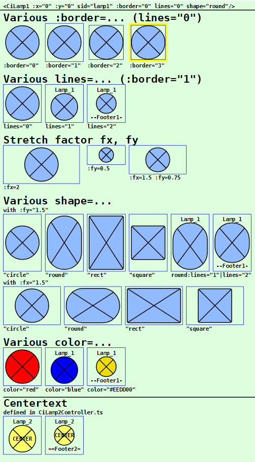
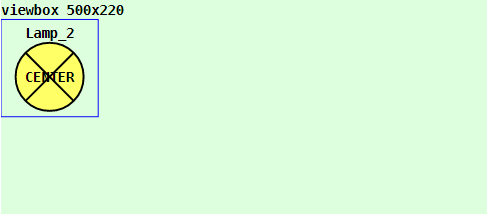
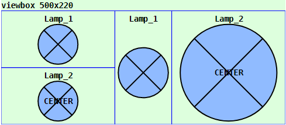

Last modified: 2023-01-30 <a name="up"></a>   
<table><tr><td></td><td>
<h1>Vue: Using the CiLamp1 symbol</h1>
<a href="../../README.md">==> Home page</a> &nbsp; &nbsp; &nbsp; 
<a href="./LIESMICH.md">==> German version</a> &nbsp; &nbsp; &nbsp; 
</td></tr></table><hr>

# Target
Getting to know all the ways to display and use a `CiLamp1` symbol.   
In general:   
* When the `CiLamp1` symbol is clicked, an MQTT message is sent out.   
* All properties concerning the graphical representation of the symbol are set in the `<template>` area of the representation file (e.g. in `CiMain.vue`).   
* All non-graphical properties, such as ID, name, labels and MQTT functionality, are defined in the `CiLamp1Controller.ts` file.   

# Quick Reference
* Download directory `vue150_ci_mqtt_CiLamp1`.   
* Start Visual Studio Code (VSC) and open the folder of this Vue application.   
* In VSC open the terminal and type the following:   
`npm run serve`   
* Start the browser (e.g. Google Chrome) and call the page `localhost:8080`.   

In the browser the symbols shown in _Fig. 1_ (see below) are displayed.   

If you want to test the MQTT functionality, you have to run an MQTT broker (e.g. Mosquitto) on a computer (or Raspberry Pi) with the IP address `10.1.1.1`.   
* Connect the development computer to the network of the broker server. (For WLAN e.g. SSID `Raspi11`, password `12345678`)   
* Start Windows console (`cmd.exe`), change to the mosquitto directory and enter the following:   
`mosquitto_sub -h 10.1.1.1 -t "#" -v`   
* If you press a CiLamp1 in the browser, one or more MQTT messages are sent, which can be seen in the console, e.g.   
`ci/lamp/1/set/lamp 0`   
`ci/lamp/2/set/lamp 0`   

Note: A detailed description of individual steps can be found in other chapters of the MQTT4HOME project.

## Graphic representation of a symbol
## General
The coding of the graphical representation of a CI symbol `CiXxx` is done in a file with a name like `CiXxx.vue`. These files are then used by the actual project file (e.g. `CiMain.vue`) to display the web page.   
The following image shows the output of this Vue application with the different `CiLamp1` representations. Which attributes cause which representation is described afterwards.     
   
_Fig. 1: Examples for different CiLamp1 representations_.   

## Lamp1 call
The drawing of a CiLamp1 symbol is done in the `<template>` area of the presentation file (e.g. in `CiMain.vue`) by the tag `<CiLamp1>` and further attributes.   
_Example_:   
```   
<CiLamp1 :x="50" :y="80" sid="lamp1" :border="3" lines="0" :fx="2" :fy="1.5" shape="round"></CiLamp1>
```   

## Positioning of a symbol
Normally CI symbols are 100x100 units in size and the center point (50/50) is used to indicate the position (placement point). If the drawing area is defined e.g. by   
`<svg width="100%" viewBox="0 0 500 220">`   
then the location specification `:x="50" :y="70"` causes the CiLamp1 to border the left edge and be 20 units away from the top edge:   
   
_Fig. 2: Location of a CiLamp1 symbol_   

_Note_:   
Remaining space at the bottom: 220 - 20 - 100 = 100 units.   
Remaining space right: 500 - 100 = 400 units   

## Border of a symbol
All CI symbols are normally 100x100 units on the outside and have a fixed margin of 5 units on the inside. So the individual "workspace" of a symbol is 90x90 units.   
The margin makes it possible to arrange symbols directly next to each other in a 100-unit grid without the symbol drawings visually touching each other.   
If you want to display the border of a CI symbol, there are four possibilities for this, which are set via the attribute `:border=`:   

| Parameter | Meaning |   
| ------------- | ------------------------------ |   
| `:border="0"` | No border will be displayed. |   
| `:border="1"` | Only the outer border of the symbol is displayed (= total space required by the symbol). |   
| `:border="2"` | Only the inner border of the symbol is shown (= the drawing area for the symbol). |   
| `:border="3"` | The border of the symbol is displayed in yellow. |   

Default is `:border="1"`.   

## Text information in CiLamp1 symbol
Each `CiLamp1` symbol knows three possible areas for text output:   
* header   
* footer   
* Middle line   

Which texts are actually displayed in the symbol depends on the value of the 'lines=' attribute:    
| parameter | meaning |   
| ------------- | ------------------------------ |   
| `lines="0"`   | Neither header nor footer will be displayed. |   
| `lines="1"`   | The header line is displayed. If the `name` parameter is defined in the controller, this text is displayed, otherwise the `id`. |   
| `lines="2"`   | Header and footer are displayed.<br>Header: If the parameter `name` is defined in the controller, this text is displayed, otherwise the `id`.<br>Footer: If the `textFooter` parameter is defined in the controller, this text is displayed, otherwise the value of `battery` or, if `battery` is not defined, the `id`. |  

Default is `lines="1"`.   

Depending on the number of displayed lines, the size of the drawing area for the CI symbol changes. For the standard symbol with the total size 100x100 applies:   
* `lines="0"`: character area 90x90 units   
* `lines="1"`: drawing area 90x72 units   
* `lines="2"`: drawing area 90x54 units   

The text in the center of the CiLamp1 symbol is a special case. The display of this text is independent of the value of the `lines` parameter. If the `textCenter` parameter is defined, this text will be displayed in the center of the symbol in any case.   

## Stretching of a symbol
By default, all symbols are 100x100 units in size. However, it is possible to stretch the symbols in x and in y direction. The placement point remains the same.   
Stretching is done by specifying the parameters `fx` and `fy`, as the following example shows:   
   
_Fig. 3: Stretched CiLamp1 symbol_   

The left two CiLamp1 symbols are stretched by the factor fx=2 (results in 2*100 = 200 units), the third symbol is stretched by the factor fy=2 and the right symbol is stretched by fx=2 and fy=2, i.e. it is twice as large as the original with a size of 200x200.   

__Coding example__:   
```   
<template>
  <svg width="100%" viewBox="0 0 500 220">
  <rect class="ciBackground" x="0" y="0" width="500" height="220" />
  <text x="0" y="15" class="ciFont1">viewbox 500x220</text>
  <CiLamp1 :x="50" :y="70" sid="lamp1" :fx="2" :fy="1"></CiLamp1>
  <CiLamp1 :x="50" :y="170" sid="lamp2" :fx="2" :fy="1"></CiLamp1>
  <CiLamp1 :x="250" :y="70" sid="lamp1" :fx="1" :fy="2"></CiLamp1>
  <CiLamp1 :x="350" :y="70" sid="lamp2" :fx="2" :fy="2"></CiLamp1>
  </svg>
</template>
```   

## Different CiLamp1 shapes
CiLamp1 symbols come in four shapes, which are selected by the `shape=` attribute:   
| value | meaning |   
| ----------- | ---------------------------------------- |   
| `"circle"` | Circular CiLamp1 symbol which will be adjusted to the smaller side length of the drawing area. |   
| `"round"` | Oval CiLamp1 symbol that stretches the circle to fill the drawing area.   |   
| `"rect"` | Rectangular CiLamp1 symbol with rounded corners (1/10 of a circle radius) |    
| `"square"` | Square CiLamp1 symbol with rounded corners, stretched to fit the smaller side length of the drawing area.    |   

Default is `shape="circle"`.   

## Color of the CiLamp1 symbol
The `color=` attribute can be used to select the color of a CiLamp1. The value can be either an RGB value (red-green-blue value), such as `#ffee00` or a text specification such as `red`, `green` etc..   
If no value is given, the color is light blue (according to the constant `colorUnknown` from the file `Geo.ts`).   
The CiLamp1 color can also be changed via received MQTT messages, 
which can be controlled by the variable `iLamp1State`. For this purpose the coding of the methods `onMessage` (in the file `CiLamp1Controller.ts`) and `colorLamp1` (in the file `CiLamp1.vue`) must be adapted.   

# Non-graphical attributes
## Attributes defined in the base controller.
Attributes of CI symbols that have nothing to do with the graphical representation of the symbol are defined in "`xxxController.ts`" files.   
The following attributes are defined in the base controller (`CiBaseController.ts` file) and must be mandatory in all derived controllers:   
| Property     | Meaning                                  |   
| ------------ | ---------------------------------------- |   
| `id`         | Should normally be a unique name of a CiLamp1 symbol.    |   
| `subTopic`   | Messages or MQTT topics the CiLamp1 symbol "listens" to (can also be empty ''). |   
| `pubTopic`   | MQTT topics that the CiLamp1 symbol sends when clicked. |   

The following attributes are optional:   
| property     | meaning                              |   
| ------------ | ------------------------------------ |   
| `name`       | Name of a CiLamp1 symbol. Can be displayed in the header of the icon. |   
| `pubPayload` | Payload to be used when sending a message. |   


## Attributes defined in `CiLamp1Controller.ts`.
The following attributes are mandatory:   
| Property | Meaning |   
| -------------- | ------------------------------------ |   
| `iLamp1State` | Status of the CiLamp1. Use e.g. -99 as default for the start. |   

The following attributes are optional and can be used:   
| property | meaning |   
| ------------ | ------------------------------------ |   
| `battery` | Receive the state of charge if a pushCiLamp1 is operated with battery. Can be displayed in the footer. |   
| `textCenter` | Text in the center of the symbol.    |   
| `textFooter` | Specify a fixed text in the footer.  |   

## Example: Coding of the `CiLamp1Controller.ts`.   
Normally, only the values within the `Array<Lamp1>` area need to be added.   
If one wants to implement additional MQTT functionality when receiving messages, the code in the `public onMessage (message: Message): void` method can be supplemented accordingly.   

As an example, the code below contains a response to the topic `ci/lamp/2/set/lamp`. If a MQTT server is running on a computer or Raspberry Pi with the IP 10.1.1.1, pressing a `lamp1` symbol causes, among other things, the sending of a message with the topic `ci/lamp/2/set/lamp` and the payload `0`. This is received by CiLamp1 symbols with the ID `lamp2` and the `lamp2` symbol is colored "gray" ("off").   
Pressing CiLamp1 symbols with ID `lamp2` send out a message with the topic `ci/lamp/2/set/lamp` and the payload `1`, which leads to coloring of the lower CiLamp1s to "yellow" ("on").   

```
// ______CiLamp1Controller.ts____________________khartinger_____
// 2021-12-28: new
// 2023-01-30: change at CiBase (add Geo.ts)
import { reactive } from 'vue'
import { Message } from '@/services/CiMqttClient'
import { CiBaseController, IBase } from './CiBaseController'

export interface Lamp1 extends IBase {
  iLamp1State: number;
  battery?: string;
  textCenter?: string;
  textFooter?: string;
}

export class CiLamp1Controller extends CiBaseController {
  public lamps1: Array<Lamp1> = reactive(
    [
      {
        id: 'lamp1',
        name: 'Lamp_1',
        iLamp1State: -99,
        textFooter: '--Footer1--',
        subTopic: 'ci/lamp/1/ret ci/lamp/2/ret',
        pubTopic: 'ci/lamp/1/set/lamp ci/lamp/2/set/lamp',
        pubPayload: '0'
      },
      {
        id: 'lamp2',
        name: 'Lamp_2',
        iLamp1State: -99,
        textCenter: 'CENTER',
        textFooter: '==Footer2==',
        subTopic: 'ci/lamp/2/set/lamp',
        pubTopic: 'ci/lamp/1/set/lamp ci/lamp/2/set/lamp',
        pubPayload: '1'
      }
    ]
  );

  public onMessage (message: Message): void {
    this.lamps1.forEach(lamp1 => {
      const aSubTopic = lamp1.subTopic.split(' ')
      if (aSubTopic.includes(message.topic)) {
        // ---lamp1 topic found --------------------------------
        // console.log('CiLamp1Controller.onMessage payload=', message.payload)
        if (message.topic.includes('ci/lamp/2/set/lamp')) {
          if (message.payload === '0') lamp1.iLamp1State = -2
          if (message.payload === '1') lamp1.iLamp1State = -1
        }
        if (message.topic.includes('voltage')) {
          lamp1.battery = `${message.payload}` + '%'
        }
        // ---end lamp1 topic found ----------------------------
      }
    })
  }

  public publishCi (topic: string, payload: string): void {
    // console.log('CiLamp1Controller:publishCi:', '-t ' + topic + ' -m ' + payload)
    this.publish(topic, payload, false, 0).catch((e) => { console.error('CiLamp1Controller: ERROR:', e) })
  }
}

export const ciLamp1Controller = new CiLamp1Controller()
```

[Top of page](#up)
