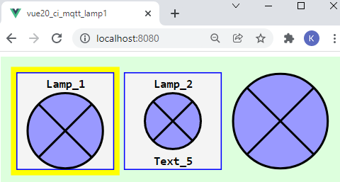
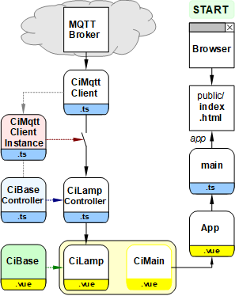
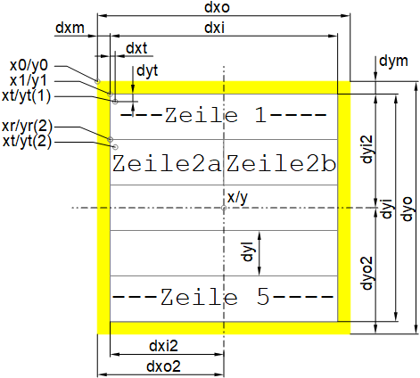

Last modified: 2021-12-23 <a name="up"></a>   
<table><tr><td></td><td>
<h1>Vue-MQTT: How to create a CI symbol? (Example: Lamp)</h1>
<a href="../../README.md">==> Home page</a> &nbsp; &nbsp; &nbsp; 
<a href="./LIESMICH.md">==> German version</a> &nbsp; &nbsp; &nbsp; 
</td></tr></table><hr>

This project "Vue: MQTT Lamp1" describes how to create a Vue lamp icon that can send and receive MQTT messages and that can be easily integrated into your own web pages.   

There will be   
* the [required tools](#required-tools) and then   
* the [functional-test](#functional-test),   
* the [use of a CI symbol (CI: controller/indicator)](#use-of-a-ci-symbol),   
* the [creation of the project](#creating-the-project),   
* the [installation of the MQTT functionality](#mqtt-function),   
* the [function of the Ci_Base-element](#the-cibase-element) and 
* the [creation of the lamp symbol](#create-the-lamp-symbol)

are described.   

The following picture shows different representations of the lamp symbol (name and frame, name + text5 + simple frame, symbol without texts and frame):   
   
_Fig. 1: Different variants of the lamp symbol_   

You can see:   
* The entire GUI is an svg graphic.   
* Control or display icons are square and the same size.   
* Symbols can be displayed with or without borders.   
* Symbols can be displayed with or without text.   

# Required tools
* Hardware: PC or laptop with internet access, browser
* Hardware: Raspberry Pi (or PC) running an MQTT broker (e.g. Mosquitto)
* Software: Visual Studio Code ("VSC"), which is already prepared for Vue applications.   
   (I.e. at least one Vue application has already been created in Visual Code).   

# Functional test
## Requirements for the test   
1. the Raspberry Pi (RasPi) has been installed according to the [manual (section "Central")](../../README.md), i.e. on the RasPi with IP '10.1.1.1' the broker program (Mosquitto) is running   
2. the Vue application is loaded in Visual Studio Code (VSC) and the internal server is running (input in terminal: `npm run serve`).   
3. there is a network/WLAN connection between the computer running VSC and the RasPi.   
4. a command/terminal window is open on the PC or Raspberry Pi showing received MQTT messages (enter `mosquitto_sub -h 10.1.1.1 -t "#" -v`).   

Note: If the RasPi has a different IP than 10.1.1.1, the IP must be adjusted in the `App.vue` file (`const hostip = '...'`).   
## Test   
* If you enter the address `localhost:8080` in the browser, _image 1_ appears in the brower.   
  Since the lamp status is unknown, the lamp symbols are colored blue.   
* If you click on the left lamp symbol, an MQTT message `ci/lamp/1/set/lamp` with the payload `1` is sent.   
The message is displayed in the command/terminal window.   
* Since all three lamps in this example have specified this topic at `subTopic:`, all three lamps also receive this message, set the status to 1 and color themselves yellow accordingly.   
* If you click on the middle or right lamp symbol, an MQTT message `ci/lamp/1/set/lamp` with the payload `0` is sent.   
The message is displayed in the command/terminal window.   
* All three lamps receive this message, set the status to 0 and turn gray accordingly.   

&nbsp;

# Use of a CI symbol
The use of a CI symbol is shown by the example of the lamp symbol, where three steps are required:   

<a name="define-properties"></a>   

## Step 1: Definition of the lamp symbol properties
Each lamp must be entered into the `lamps` array in the lamp controller (file `controller/CiLampController`). The following properties are possible for a lamp:   

* __id__: ID of the lamp. This must be unique.
* name__: (Additional) name of the lamp.
* __subTopic__: Topic to which the lamp responds (subscribe).
* __pubTopic__: Topic of the message that will be sent when clicked.
* pubPayload__: Payload of the message that will be sent on click.
* __iLampState__: Lamp state (0=off, 1=on, -1=unknown). 
* text5?: Text for line 5 (if desired).

A question mark after the name indicates that this value does not need to be specified.   

_example_:   
```   
  public lamps: Array<Lamp> = reactive(
    [
      {
        id: 'lamp1',
        name: 'Lamp_1',
        iLampState: -1,
        text5: 'Text_5',
        subTopic: 'ci/lamp/1/ret/lamp',
        pubTopic: 'ci/lamp/1/set/lamp',
        pubPayload: '-1'
      }
    ]
  );
```   
At least the properties `id`, `iLampState`, `subTopic` and `pubTopic` must be specified.   

## Step 2: Displaying the lamp symbol in a .vue file
The installation of a lamp symbol is done in the `<template>` area of a Vue file, e.g. by the following statement:

`<CiLamp :x="160" :y="50" sid="lamp1" lines="2" border="0"></CiLamp>`   

The center of the symbol (`x`, `y`) and the ID of the lamp (`sid=`) must be specified, where the ID must match the id in the lamp controller.   
The specification of `lines` and `border` is optional. If this specification is omitted, a symbol with header (= `name`) and yellow border will be drawn.   

## Step 3: Include the lamp symbol in a .vue file
To be able to use the lamp symbol in the `<template>` area, two commands are required in the `<script>` area:   
* import lamp encoding:   
  `import CiLamp from './CiLamp.vue'`   
* Enumerate in the components used:   
  `components: {`   
  ` CiLamp`   
  `},`   

&nbsp;   

---   

# Creating the project
## 1. General
The following diagram gives an overview of the files involved:   

   
_Fig. 2: Overview of the involved files_   

With the help of the diagram you can see some important relationships:   

* The right branch with (browser -->) index.html --> main.ts --> App.vue is created automatically and needs some customization.   
* The file `main.ts` creates the app element which is displayed in `index.html`.   
* `App.vue` represents `<CiMain>` and contains css elements that can be used throughout the project.   
* The graphic element `CiLamp` consists of a "controller" and "graphic" part (extension `.ts` and `.vue` respectively) and are derived from base components.   
* The connection to the MQTT broker is established via the files `CiMqttClient.ts` and `CiMqttClientInstance.ts`, where all controllers must be registered in the file `CiMqttClientInstance.ts`. If this is forgotten, the controller will not receive MQTT messages ("switch open").   

## 2. Preparation of the Vue project in VSC   
1. Start Visual Studio Code (VSC).   
2. VSC: Open Terminal window: Menu Terminal - New Terminal.   
3. VSC terminal: Change to the folder under which the Vue project is to be created:   
   `cd /g/github/mqtt4home/source_Vue`   
4. VSC terminal: create Vue.js application:   
  `vue create vue20_ci_mqtt_lamp1`  
  Use cursor keys, space bar and &lt;Enter&gt; to select the following:   
   `> Manually select features` &nbsp; &lt;Enter&gt;   
   `(*) Choose Vue version`   
   `(*) Babel`   
   `(*) TypeScript`   
   `( ) Router`   
   `(*) Linter / Formatter`   
   &lt;Enter&gt;   
   _`> 3.x`_ &nbsp; &lt;Enter&gt;      
   _`? Use class-style component syntax?`_ &nbsp; __`N`__ &lt;Enter&gt;   
   _`? Use Babel alongside TypeScript (required for modern mode, auto-detected polyfills, transpiling JSX)?`_ &nbsp; __`N`__ &lt;Enter&gt;   
   _`? Use history mode for router? (Requires proper server setup for index fallback in production)`_ &nbsp; __`N`__ &lt;Enter&gt;   
   _`? Pick a linter / formatter config:`_ &nbsp; __`ESLint + Standard config`__ &lt;Enter&gt;   
   _`? Pick additional lint features: `_ &nbsp; __`Lint on save`__ &lt;Enter&gt;   
   _`? Where do you prefer placing config for Babel, ESLint, etc.?`_ &nbsp; __`In dedicated config file`__ &lt;Enter&gt;   
   _`? Save this as a preset for future projects? (y/N)`_ &nbsp; __`N`__ &lt;Enter&gt;   
5. Switch to the project folder: _VSC Menu File - Open Folder_..
   `/github/mqtt4home/source_Vue/vue20_ci_mqtt_lamp1` [select folder].   
6. Install MQTT library:   
   VSC: Open Terminal window: Menu Terminal - New Terminal.   
   `npm install mqtt --save`   
&nbsp;   
## 3. Customize the automatically created files
Create the file `vue.config.js`: click on the plus next to `VUE20_CI_MQTT_LAMP1`, enter name.   
_Content of the file_:   
```   
// ______vue.config.js__________________________________________
module.exports = {
  lintOnSave: false,
  publicPath: './',
  // publicPath: process.env.NODE_ENV === 'production' ? './vue_pubsub2/' : './',
  configureWebpack: {
    devtool: 'source-map'
  },
  chainWebpack: config => {
    config.performance
      .maxEntrypointSize(400000)
      .maxAssetSize(400000)
  }
}
```   
With `publicPath: './',` the relative path is set and the `chainWebpack` entry avoids warnings regarding the file size (by setting the maximum file size higher ;) )

## 4 Disable linter warning "Unexpected any" at "(value: any)".    
  In the file `.eslintrc.js` under "`rules: {`" add:   
  ```   
  '@typescript-eslint/no-explicit-any': 'off',
  '@typescript-eslint/explicit-module-boundary-types': 'off',
  ```   

## 5. Customize `App.vue` file   
The `App.vue` file is responsible for the following:   
  * Display of the component `CiMain`.
  * Definition of uniform styles for all pages.   
    Therefore: Add all styles starting with a dot.   

_Content of the file_:   
```   
<!-- App.vue -->
<template>
  <CiMain></CiMain>
</template>

<script lang="ts">
import { defineComponent } from 'vue'
import CiMain from '@/components/CiMain.vue'

export default defineComponent({
  name: 'App',
  components: {
    CiMain
  }
})
</script>

<style>
#app {
  font-family: Avenir, Helvetica, Arial, sans-serif;
  text-align: left;
  color: black;
  margin-top: 0px;
}

  .ciFont1  { font: bold 11px monospace; fill: black; white-space: pre; }
  .cursor    { cursor: pointer; }
  .ciBackground {fill: #ddFFdd; }
  .ciOut     { fill: yellow; stroke: yellow; stroke-width: 1; }
  .ciInColor { fill: #F4F4F4; }
  .ciIn      { fill: #F4F4F4; stroke:blue; stroke-width: 1; }
  .ciLine    { stroke: blue; stroke-width: 1; }
  .ciRect    { fill: none; stroke: blue; stroke-width: 1; }
  .ciFillIt  { stroke: blue; stroke-width: 1; }
  .ciClick   { fill-opacity: 0.0; stroke-width: 1; }
  .ciBorder  { fill-opacity: 0.0; stroke: blue; stroke-width: 1; }
</style>
```   

## 6. Delete files and directories that are not needed   
  * delete file `components/HelloWorld.vue`   
  * delete `assets` directory   

&nbsp;

<a name="mqtt-function"></a>
## Include MQTT functionality
## Include the required files
* Create the directory "controller"   
  Right click on the `src` directory, select "New folder" and enter the name `controller`   
* Creating the "services" directory   
  Right click on the `src` directory, select "New folder" and enter the name `services`   
* Create the `CiMqttClient.ts` file   
  * Right click on the `services` directory, select "New file" and enter the name `CiMqttClient.ts`   
  * Get the content of the file e.g. from [GitHub](https://github.com/khartinger/mqtt4home/blob/main/source_Vue/vue10_ci_mqtt_mini/src/services/CiMqttClient.ts), copy it and save the file.   
* Create the file `CiBaseController.ts`.   
  * Right click on the directory `controller`, select "New file" and enter the name `CiBaseController.ts`   
  * Get content of file e.g. from [GitHub](https://github.com/khartinger/mqtt4home/blob/main/source_Vue/vue10_ci_mqtt_mini/src/controller/CiBaseController.ts), copy into it and save file.   
* Create the file `CiBase.vue`.   
  * Right click on the directory `components`, select "New file" and enter the name `CiBase.vue`   
  * Get content of file e.g. from [GitHub](https://github.com/khartinger/mqtt4home/blob/main/source_Vue/vue10_ci_mqtt_mini/src/components/CiBase.vue), copy into it and save file.   

## Create the file "services/CiMqttClientInstance".
* Right click on the `services` directory, select "New File" and enter the name `CiMqttClientInstance.ts`   
* Specify that a connection to the broker should be established when the app is started (constructor value `true`).   
* Since only the component for receiving (and storing) needs access to the MQTT messages, only this component needs to be registered.   

_Result:_   
```   
// ______mqttClientInstance.ts__________________________________
import { CiMqttClient } from './CiMqttClient'.
import { ciLampController } from '.@/controller/CiLampController'.

export const ciMqttClientInstance = new CiMqttClient(true)
ciMqttClientInstance.registerController(ciLampController)

```   

# The CiBase element
The CiBase element is the base element for all control/indicate symbols (in short "CI symbols") and consists of a display part `CiBase.vue` and a control part `CiBaseController.ts`.

## components/CiBase.vue
The base view `CiBase.vue` is responsible for displaying symbols:   
1. drawing a border around the symbol or not (`border = 2 | 1 | 0`)   
2. providing geometry data for drawing a symbol. These are provided by the class `Geo`.    

   
_Fig. 3: Geometry data of a CI symbol_   

### Notes on the geometry of symbols
* Symbols are normally square.   
* The positioning point of each symbol is the center (x/y).   
* The size of a symbol depends on the size of the font (e.g. font height `fh_ = 11`). This also determines the number of characters per line (e.g. `tmax_ = 14`).   
* Each symbol can contain up to five lines of text (line height `dyl`).   
* Line 2 can also be split into two parts.   
* Each symbol has an outer dimension (`dxo`, `dyo`) and an inner dimension (`dxi`, `dyi`). This results in a (yellow) border, which can also be displayed invisibly.   
* The upper left outer corner has the coordinates (x0/y0).   
* The upper left inner corner has the coordinates (x1/y1).   
* The five rectangles have the starting point (xr/yr(i))   
with i as the number of the rectangle from 1 to 5.   
* The five texts have the starting point (xt/yt(i))   
with i as the number of the text from 1 to 5.   

_Coding_:   
```   
<!--CiBase.vue-->
<template>
  <!--border: outer and inner rectangle--------------------- -->
  <rect v-if="border0" class="ciOut" :x="geo.x0()" :y="geo.y0()" :width="geo.dxo" :height="geo.dyo" />
  <rect v-if="border1" class="ciIn"  :x="geo.x1()" :y="geo.y1()" :width="geo.dxi" :height="geo.dyi" />
</template>

<script lang="ts">
import { defineComponent } from 'vue'
import { ciMqttClientInstance } from '@/services/CiMqttClientInstance'

export default defineComponent({
  name: 'CiBase',
  props: {
    x: {
      type: Number,
      required: true
    },
    y: {
      type: Number,
      required: true
    },
    border: {
      type: Number,
      required: false,
      default: 2
    }
  },
  emits: ['onClk'],
  computed: {
    geo: function (): Geo {
      const geo1 = new Geo(this.x, this.y)
      return geo1
    },
    border0: function (): boolean {
      if (this.border) {
        if (this.border > 1) return true
      }
      return false
    },
    border1: function (): boolean {
      if (this.border) {
        if (this.border > 0) return true
      }
      return false
    }
  },
  mounted: function (): void {
    ciMqttClientInstance.init()
  },
  methods: {
  }
})

// -----------font data-----------------------------------------
// examples: fh_=11, tmax_=14 or 16/13, ...
const fh_ = 11 //            font height [pixel]
const tmax_ = 14 //          max number character per line
// -----------y direction---------------------------------------
const dyl_ = Math.round(0.5 + 22 * fh_ / 14) //  line hight
const dyi_ = 5 * dyl_ //                         inner hight
const dyi2_ = Math.round(dyi_ / 2) //            half dyi_
const dyo_ = 10 * Math.round(0.5 + dyi_ / 10) // outer hight
const dyo2_ = Math.round(dyo_ / 2) //            center dy
const dym_ = Math.round((dyo_ - dyi_) / 2) //    top margin
const dyt_ = Math.round(0.5 + 17 / 14 * fh_) //  text start y
// -----------x direction---------------------------------------
const dxo_ = dyo_ //                             outer width
const dxo2_ = Math.round(dyo_ / 2) //            half outer width
const dxm_ = dym_ //                             left margin
const dxi_ = dxo_ - 2 * dxm_ //                  inner width
const dxi2_ = dxo2_ - dxm_ //                    half dxi_
const dxt_ = Math.round(0.5 + fh_ / 14 + 18 / 14) // text-border

export class Geo {
  // =========special values====================================
  public colorOk = '#CCFFCC' //         light green
  public colorNotOk = '#FFCCCC' //      light red
  public colorError = '#FF0000' //      red
  public colorOn = '#FFFF66' //         yellow
  public colorOff = '#AAAAAA' //        light grey
  public colorUnknown = '#9999FF' //    light blue
  public colorBackground = '#DDFFDD' // light green
  public noDate = '--.--.----'
  public noTime = '--:--:--'
  public batteryMin = 15

  // =========relative geometric values=========================
  // ---------font data-----------------------------------------
  public fh = fh_ //              font height [pixel]
  public tmax = tmax_ //          max number character per line
  // ---------y direction---------------------------------------
  public dyl = dyl_ //            line hight
  public dyi = dyi_ //            inner hight (= 5x line hight)
  public dyi2 = dyi2_ //          half inner hight
  public dyo = dyo_ //            outer hight
  public dyo2 = dyo2_ //          half outer hight
  public dym = dym_ //            top margin
  public dyt = dyt_ //            text start in y direction
  // ---------x direction---------------------------------------
  public dxo = dxo_ //            outer width
  public dxo2 = dxo2_ //          half outer width
  public dxm = dxm_ //            left margin
  public dxi = dxi_ //            inner width
  public dxi2 = dxi2_ //          half inner width
  public dxt = dxt_ //            text start in x direction

  // =========absolute geometric values=========================
  // ---------center of symbol----------------------------------
  public x = 0 //                 x value of center
  public y = 0 //                 y value of center

  // =========methods===========================================
  // _________constructor_______________________________________
  constructor (xC: number, yC: number) {
    this.x = xC
    this.y = yC
  }

  // ---------coordinates of upper left corners-----------------
  public x0 (): number { return (this.x - this.dxo2) }
  public y0 (): number { return (this.y - this.dyo2) }
  public x1 (): number { return (this.x - this.dxi2) }
  public y1 (): number { return (this.y - this.dyi2) }

  // ---------y value for rectangle 1...5-----------------------
  public xr (): number { return this.x1() }
  public xr2 (): number { return this.x }

  // ---------calculate y start value of rectangle 1...5--------
  public yr (linenum: number): number {
    if (linenum < 1 || linenum > 5) linenum = 1
    return (this.y - this.dyi2 + (linenum - 1) * this.dyl)
  }

  // ---------x start value for text line 1...5-----------------
  public xt (): number { return (this.x + -dxi2_ + dxt_) }
  public xt2 (): number { return (this.xt() + this.dxi2) }

  // ---------calculate y start value of text 1...5-------------
  public yt (linenum: number): number {
    if (linenum < 1 || linenum > 5) linenum = 1
    return (this.y + -dyi2_ + dyt_ + (linenum - 1) * this.dyl)
  }

  // =========text methods======================================
  // ---------trim text to line length--------------------------
  public checkLen (text: string): string {
    if (text) {
      if (text.length > this.tmax) return text.substr(0, this.tmax)
      return text
    }
    return ''
  }

  // ---------center text (or trim text to line length)---------
  public center (text: string): string {
    const len = text.length
    if (len >= this.tmax) return text.substr(0, this.tmax)
    const numBlank = Math.round((this.tmax - len) / 2)
    // const numBlank = Math.round((this.tmax - len) / 2 - 1)
    const s1 = text.padStart(numBlank + len, ' ')
    return s1
  }
}
</script>

<style>
</style>

```   

## controller/CiBaseController.ts
The file `CiBaseController.ts` normally does not need to be modified. It defines some properties in the `IBase` interface that all (derived) `CiXxxControllers` should have. The most important property is the `id`, which represents the connection between a representation and the data in the controller.   

In the (abstract) class `CiBaseController` the methods `registerClient`, `publish` and `onMessage(message: Message)` are then defined.   

_Coding_:   
```   
// ______CiBaseController.ts____________________________________
import { Message, CiMqttClient } from '@/services/CiMqttClient'
import type { QoS } from 'mqtt'

export interface IBase {
  id: string;
  name?: string;
  subTopic: string;
  pubTopic: string;
  pubPayload?: string;
}

export abstract class CiBaseController {
  protected client: CiMqttClient | null = null;

  public registerClient (mqttClient: CiMqttClient): void {
    this.client = mqttClient
  }

  protected async publish (topic: string, payload: string, retain: boolean, qos: QoS): Promise<void> {
    return this.client?.publish(topic, payload, retain, qos)
  }

  public abstract onMessage(message: Message): void;
}

```   

## Create the lamp symbol
## Properties
* The representation of a lamp symbol in an application should be done by the following example code:   
`<CiLamp :x="160" :y="60" sid="lamp2" :border="1" lines="2"></CiLamp>`   
where the parameters `border` and `lines` can also be omitted. (Default: `border="2"` and `lines="1"`)   
`:x` and `:y` are the coordinates of the center of the symbol.   
`sid` is the ID of the symbol (= the name of the lamp symbol).   

* The _image 1_ above shows the lamp symbol with the default values on the left, in the center with a single border (`:border="1"`) and two lines of text (`lines="2"`) and on the right with no border and no text (`:border="0" lines="0"`)

## Creating the view of the lamp symbol
* The lamp symbol consists of a circle and the cross in the center. Both the coordinates of the circle center and the radius depend on the number of lines to be displayed, so these values are calculated separately. (See coding `cx`, `cy`, `cr`)
* The two lines of the lamp cross are calculated using the circle parameters. (See coding `lampCross`)
* The lamp state `iLampState` can be `-1` (unknown), `0` (off) or `1` (on).   
* The lamp color `colorLamp` depends on the lamp state and can be gray (0), yellow (1) or blue (-1).   
* If allowed: The name of the lamp is displayed in line 1.   
* If allowed: A `text5` is displayed in line 5.   
* When clicking on the lamp symbol, messages with the topics listed in `pubPayload` are sent, the value specified in `pubPayload` serves as payload.   

_Creating the file:_   
* Right click on the directory `components`, select "New file" and enter the name `CiLamp.vue`.   

_Coding:_
```  
<!--CiLamp.vue-->
<template>
  <!--draw border------------------------------------------- -->
  <CiBase :x="x" :y="y" :border="border"></CiBase>
  <!--draw symbol------------------------------------------- -->
  <circle :cx="cx" :cy="cy" :r="cr" :fill="colorLamp" />
  <path   :d="lampCross" fill="none" stroke="black" stroke-width="2" class="cursor" />
  <circle :cx="cx" :cy="cy" :r="cr" fill="none" stroke="black" stroke-width="2" class="cursor" />
  <!--write text-------------------------------------------- -->
  <text v-if="iLines>0" :x="geo.xt()" :y="geo.yt(1)" class="ciFont1">{{title}}</text>
  <text v-if="iLines>1" :x="geo.xt()" :y="geo.yt(5)" class="ciFont1">{{line5}}</text>
  <!--define click area------------------------------------- -->
  <rect @click="onClk()" class="ciClick" :x="geo.x0()" :y="geo.y0()" :width="geo.dxo" :height="geo.dyo" />
</template>

<script lang="ts">
import { defineComponent } from '@vue/runtime-core'
import { Lamp, ciLampController } from '@/controller/CiLampController'
import CiBase, { Geo } from './CiBase.vue'

export default defineComponent({
  name: 'CiLamp',
  components: {
    CiBase
  },
  props: {
    x: {
      type: Number,
      required: true
    },
    y: {
      type: Number,
      required: true
    },
    border: {
      type: Number,
      required: false,
      default: 2
    },
    sid: {
      type: String,
      required: true
    },
    lines: {
      type: String,
      required: false,
      default: '1'
    }
  },
  computed: {
    lamp: function (): Lamp | undefined {
      return ciLampController.lamps.find(lamp => lamp.id === this.sid)
    },
    iLampState: function (): number {
      return this.lamp?.iLampState ?? -1
    },
    geo: function (): Geo {
      const geo1 = new Geo(this.x, this.y)
      return geo1
    },
    iLines: function (): number {
      return parseInt(this.lines)
    },

    // -------circle parameters: center, radius-----------------
    cx: function (): number { return (this.x) },
    cy: function (): number {
      if (this.iLines === 0) return (this.y)
      if (this.iLines === 2) return (this.y)
      return (this.y + this.geo.dyl / 2)
    },
    cr: function (): number {
      if (this.iLines === 0) return (this.geo.dyi / 2 - 1)
      if (this.iLines === 2) return (this.geo.dyi * 3 / 10 - 1)
      return (2 * this.geo.dyl - 1)
    },
    // -------lamp representation-------------------------------
    colorLamp: function (): string {
      if (this.iLampState === 0) return this.geo.colorOff //   off
      if (this.iLampState === 1) return this.geo.colorOn //    on
      if (this.iLampState === 2) return this.geo.colorError // ?
      return this.geo.colorUnknown //                          unknown state
    },
    lampCross: function ():string {
      const dxd2 = Math.round(this.cr / Math.sqrt(2))
      const dxd = 2 * dxd2
      let s1 = 'M' + this.cx + ',' + this.cy + ' '
      s1 = s1 + 'm-' + dxd2 + ',-' + dxd2 + ' l' + dxd + ',' + dxd + ' '
      s1 = s1 + 'm-' + dxd + ',0 l' + dxd + ',-' + dxd
      return s1
    },
    // -------text in line 1 and 5------------------------------
    title: function (): string {
      if (this.lamp?.name) return this.geo.center(this.lamp.name)
      return this.geo.center(this.sid)
    },
    line5: function (): string {
      if (this.lamp?.text5) return this.geo.center(this.lamp.text5)
      return this.geo.center(this.sid)
    }
  },
  methods: {
    onClk: function (): void {
      console.log(this.sid, 'Lamp-Click')
      const topic = 'error/lamp'
      let payload = '-1'
      if (!this.lamp) ciLampController.publishCi(topic, payload)
      if (this.lamp?.pubTopic) {
        const aPubTopic = this.lamp.pubTopic.split(' ')
        aPubTopic.forEach(topic => {
          if (this.lamp?.pubPayload) payload = this.lamp.pubPayload
          ciLampController.publishCi(topic, payload)
        })
      }
    }
  }
})
</script>

<style scoped>
</style>

```  

## Lamp symbol control
The lamp symbol control contains 
* a field with the data of all lamps to be displayed,   
  see above ["Step 1: Definition of lamp symbol properties"](#define-properties) or the following coding,
* a method for processing the incoming messages (`onMessage`),   
  (if the message matches the lamp, the payload is evaluated)
* a method to send a message (`publishCi`) and
* a `LampController` object.   

_Creating the file:_   
* Right click on the directory `controller`, select "New file" and enter the name `CiLampController.ts`.   

_Content of the file:_   
```   
// ______CiLampController.ts____________________________________
import { reactive } from 'vue'
import { Message } from '@/services/CiMqttClient'
import { CiBaseController, IBase } from './CiBaseController'

export interface Lamp extends IBase {
  iLampState: number;
  text5?: string;
}

export class CiLampController extends CiBaseController {
  public lamps: Array<Lamp> = reactive(
    [
      {
        id: 'lamp1',
        name: 'Lamp_1',
        iLampState: -1,
        text5: 'Text_5',
        // subTopic: 'ci/lamp/1/ret/lamp',
        subTopic: 'ci/lamp/1/set/lamp',
        pubTopic: 'ci/lamp/1/set/lamp',
        pubPayload: '1'
      },
      {
        id: 'lamp2',
        name: 'Lamp_2',
        iLampState: -1,
        text5: 'Text_5',
        // subTopic: 'ci/lamp/1/ret/lamp',
        subTopic: 'ci/lamp/1/set/lamp ci/lamp/2/set/lamp',
        pubTopic: 'ci/lamp/1/set/lamp ci/lamp/1/set/lamp',
        pubPayload: '0'
      }
    ]
  );

  public onMessage (message: Message): void {
    // console.log('CiLampController:onMessage: called!')
    this.lamps.forEach(lamp => {
      if (lamp.subTopic) {
        const aSubTopic = lamp.subTopic.split(' ')
        if (aSubTopic.includes(message.topic)) {
          // ---lamp found ---------------------------------
          if ((message.payload === '1') || (message.payload === 'on')) lamp.iLampState = 1
          else {
            if ((message.payload === '0') || (message.payload === 'off')) lamp.iLampState = 0
            else { lamp.iLampState = -1 }
          }
          console.log('CiLampController:onMessage: message.payload=', message.payload)
        }
      }
    })
  }

  public publishCi (topic: string, payload: string): void {
    // console.log('CiLampController:publishCi:', '-t ' + topic + ' -m ' + payload)
    this.publish(topic, payload, false, 0)
  }
}

export const ciLampController = new CiLampController()

```  

[Top of page](#up)
