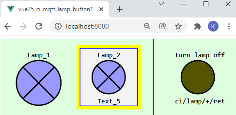
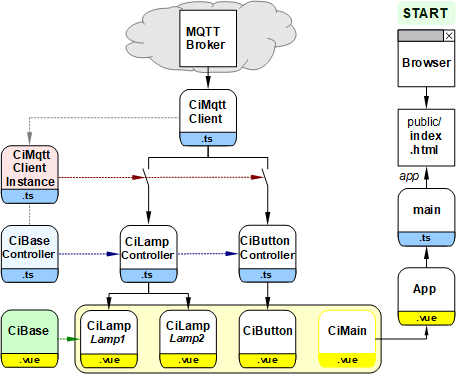

Letzte &Auml;nderung: 25.12.2021 <a name="up"></a>   
<table><tr><td></img></td><td>
<h1>Vue: Schalten von Lampen mit MQTT</h1>
<a href="../../LIESMICH.md">==> Startseite</a> &nbsp; &nbsp; &nbsp; 
<a href="./README.md">==> English version</a> &nbsp; &nbsp; &nbsp; 
</td></tr></table><hr>
  
# Ziel
Erstellen einer Vue-Anwendung, mit der der Zustand zweier Lampen angezeigt wird und die &uuml;ber ein Taster-Symbol ausgeschaltet werden k&ouml;nnen:   

   
_Bild 1: Browser-Darstellung der beiden Lampen und des Tasters_   

Das _Bild 1_ zeigt einige M&ouml;glichkeiten des Programms:   
* Das gesamte GUI ist eine svg-Grafik.
* Steuer- oder Anzeigesymbole sind quadratisch und gleich gro&szlig;.
* Symbole k&ouml;nnen mit oder ohne Rand dargestellt werden.
* Symbole k&ouml;nnen mit oder ohne Text dargestellt werden.
* Dr&uuml;ckt man auf die linke Lampe, werden beide Lampen eingeschaltet.
* Dr&uuml;ckt man auf die rechte Lampe, werden beide Lampen ausgeschaltet.
* Eine gelbe Lampe bedeutet, die Lampe ist eingeschaltet, grau bedeutet ausgeschaltet und blau bedeutet, der Zustand ist nicht bekannt.
* Durch Dr&uuml;cken des Tasters rechts werden beide Lampen ausgeschaltet.

# Bestandteile des Programms
Damit das Programm &uuml;bersichtlich und leicht erweiterbar ist, wird es aus zahlreichen Einzelteilen zusammengesetzt.   
Das folgende Bild gibt einen &Uuml;berblick &uuml;ber die beteiligten Dateien:
   
_Bild 2: Dateien des Projekts MQTT-Lampen_   

## Bedeutung der einzelnen Dateien   
Der rechte Zweig mit (Browser -->) `index.html` --> `main.ts` --> `App.vue` wird automatisch erstellt und muss etwas angepasst werden.   
   * Die Datei `main.ts` erzeugt das App-Element, das in `index.html` angezeigt wird.   
   * `App.vue` stellt `<CiMain>` dar und enth&auml;lt css-Elemente, die im gesamten Projekt verwendet werden k&ouml;nnen.   
---   
Der linke Teil der Darstellung stellt das eigentliche Programm dar:   
* Die Datei `CiMqttClient.ts` enth&auml;lt die Klasse `CiMqttClient`, die alle Methoden zur Kommunikation mit dem MQTT-Broker enth&auml;lt.   
* Die Datei `CiMqttClientInstance.ts` erzeugt das Objekt `ciMqttClientInstance`, bei dem sich jeder Controller registrieren muss, der MQTT-Nachrichten erhalten will.   
Symbolisch ist dies im _Bild 2_ durch die Schalter dargestellt: Keine Registrierung bedeutet, keine Zusendung von MQTT-Nacchrichten.   
* F&uuml;r jeden Symbol-Typ (hier CiLamp und CiButton) gibt es einen eigenen Controller, der von "`CiBaseController.ts`" abgeleitet ist.   
* Jeder Controller enth&auml;lt eine Liste (genauer "`Array`") seiner Symbole sowie die Methoden zum Empfangen und Senden von MQTT-Nachrichten (`onMessage` und `publishCi`)
* Die grafische Gestaltung jedes Symbols erfolgt in einer vue-Datei, die die Basis-Vue `CiBase.vue` einbindet (`CiLamp.vue` und `CiButton.vue`).   
* Alle angezeigten Symbol-Vues werden in `CiMain.vue` positioniert.   

# Erforderliche Hilfsmittel
* Hardware: PC oder Laptop mit Internetzugang, Browser
* Hardware: Raspberry Pi (oder PC), auf dem ein MQTT-Broker l&auml;uft (zB Mosquitto)
* Software: Visual Studio Code ("VSC"), das f&uuml;r Vue-Anwendungen bereits vorbereitet ist.   
   (Dh. es wurde bereits (mindestens) eine Vue-Anwendung in Visual Code erstellt.)   
   incl. node.js, npm

# Vorbereitung des Vue-Projektes in VSC (Kurzfassung)   
1. Visual Studio Code (VSC) starten.   
2. VSC: Terminal-Fenster &ouml;ffnen: Men&uuml; Terminal - New Terminal.   
3. VSC-Terminal: In den Ordner wechseln, unter dem das Vue-Projekt erzeugt werden soll:   
   `cd /g/github/mqtt4home/source_Vue`   
4. VSC-Terminal: Vue.js Applikation erzeugen: `vue create vue25_ci_mqtt_lamp_button1`  
   Mit Cursortasten, Leertaste und &lt;Enter&gt; Folgendes ausw&auml;hlen:   
   `> Manually select features` &nbsp; &lt;Enter&gt;   
   `(*) Choose Vue version`   
   `(*) Babel`   
   `(*) TypeScript`   
   `( ) Router`   
   `(*) Linter / Formatter`   
   &lt;Enter&gt;   
   _`> 3.x`_ &nbsp; &lt;Enter&gt;      
   _`? Use class-style component syntax?`_ &nbsp; __`N`__ &lt;Enter&gt;   
   _`? Use Babel alongside TypeScript (required for modern mode, auto-detected polyfills, transpiling JSX)?`_ &nbsp; __`N`__ &lt;Enter&gt;   
   _`? Use history mode for router? (Requires proper server setup for index fallback in production)`_ &nbsp; __`N`__ &lt;Enter&gt;   
   _`? Pick a linter / formatter config:`_ &nbsp; __`ESLint + Standard config`__ &lt;Enter&gt;   
   _`? Pick additional lint features: `_ &nbsp; __`Lint on save`__ &lt;Enter&gt;   
   _`? Where do you prefer placing config for Babel, ESLint, etc.?`_  &nbsp; __`In dedicated config file`__ &lt;Enter&gt;   
   _`? Save this as a preset for future projects? (y/N)`_ &nbsp; __`N`__ &lt;Enter&gt;   
5. In den Projektordner wechseln: _VSC Men&uuml; Datei - Ordner &ouml;ffnen_..
6. MQTT Bibliothek installieren:   
   VSC: Terminal-Fenster &ouml;ffnen: Men&uuml; Terminal - New Terminal.   
   `npm install mqtt --save`   

## 1. Allgemeine Anpassungen im Projekt
1. Der Inhalt der automatisch erstellten Datei `main.ts` sollte durch folgende Zeilen ersetzt werden:   
```   
// ______main.ts________________________________________________
import { createApp, h } from 'vue'
import App from './App.vue'

const app = createApp({
  render: () => h(App)
})

app.mount('#app')

```   

2. In der Datei `App.vue` wird die Komponente `ciMain` aufgerufen und verschiedene Stile definiert.   
Der Inhalt f&uuml;r diese Datei findet sich auf [https://github.com/khartinger/mqtt4home/blob/main/source_Vue/vue25_ci_mqtt_lamp_button1/src/App.vue](https://github.com/khartinger/mqtt4home/blob/main/source_Vue/vue25_ci_mqtt_lamp_button1/src/App.vue)   

3. Erstellen der Vue-Konfig-Datei   
   Men&uuml; Anzeigen - Explorer. Mit der Maus auf in die Zeile `VUE25_CI_MQTT_LAMP_BUTTON1` gehen, das Symbol "+ Neue Datei" anklicken und  `vue.config.js` eingeben.   
   Inhalt der Datei:   
   ```   
   module.exports = {
     lintOnSave: false,
     publicPath: './',
     configureWebpack: {
       devtool: 'source-map'
     }
   }

   ```   
4. Erg&auml;nzung in der Datei `.eslintrc.js`   
Im Abschnitt `rules: {` einf&uuml;gen:
```   
    '@typescript-eslint/no-explicit-any': 'off',
    '@typescript-eslint/explicit-module-boundary-types': 'off',
    '@typescript-eslint/no-multi-spaces': 'off',
```   

5. Weiters k&ouml;nnen  die automatisch erstellten Dateien `components/HelloWord.vue` und `assets/logo.png` gel&ouml;scht werden.

<a name="mqtt-function"></a>

# MQTT-Funktionalit&auml;t einbauen
## Einbinden der erforderlichen Dateien
* Erstellen des Verzeichnisses "controller"   
  Mit der rechten Maustaste auf das Verzeichnis `src` klicken, "Neuer Ordner" w&auml;hlen und den Namen `controller` eingeben.   
* Erstellen des Verzeichnisses "services"   
  Mit der rechten Maustaste auf das Verzeichnis `src` klicken, "Neuer Ordner" w&auml;hlen und den Namen `services` eingeben.   
* Erstellen der Datei `CiMqttClient.ts`   
  * Mit der rechten Maustaste auf das Verzeichnis `services` klicken, "Neue Datei" w&auml;hlen und den Namen `CiMqttClient.ts` eingeben.   
  * Inhalt der Datei zB von [GitHub holen](https://github.com/khartinger/mqtt4home/blob/main/source_Vue/vue10_ci_mqtt_mini/src/services/CiMqttClient.ts), hineinkopieren und Datei speichern.   
* Erstellen der Datei `CiBaseController.ts`   
  * Mit der rechten Maustaste auf das Verzeichnis `controller` klicken, "Neue Datei" w&auml;hlen und den Namen `CiBaseController.ts` eingeben.   
  * Inhalt der Datei zB von [GitHub holen](https://github.com/khartinger/mqtt4home/blob/main/source_Vue/vue10_ci_mqtt_mini/src/controller/CiBaseController.ts), hineinkopieren und Datei speichern.   
* Erstellen der Datei `CiBase.vue`   
  * Mit der rechten Maustaste auf das Verzeichnis `components` klicken, "Neue Datei" w&auml;hlen und den Namen `CiBase.vue` eingeben.   
  * Inhalt der Datei zB von [GitHub holen](https://github.com/khartinger/mqtt4home/blob/main/source_Vue/vue10_ci_mqtt_mini/src/components/CiBase.vue), hineinkopieren und Datei speichern.   

## Erstellen der Datei "services/CiMqttClientInstance"
* Mit der rechten Maustaste auf das Verzeichnis `services` klicken, "Neue Datei" w&auml;hlen und den Namen `CiMqttClientInstance.ts` eingeben.   
* Festlegen, dass beim Start der App eine Verbindung zum Broker hergestellt werden soll (Konstruktor-Wert `true`).   
* Da lediglich die Komponente zum Empfangen (und Speichern) Zugriff auf die MQTT-Nachrichten ben&ouml;tigt, braucht auch nur diese Komponente registriert werden.   

_Ergebnis:_   
```   
// ______mqttClientInstance.ts__________________________________
import { CiMqttClient } from './CiMqttClient'
import { ciLampController } from '@/controller/CiLampController'

export const ciMqttClientInstance = new CiMqttClient(true)
ciMqttClientInstance.registerController(ciLampController)

```   

# Das CiBase-Element
Das CiBase-Element ist das Basiselement f&uuml;r alle Steuer-/Anzeige-Symbole (kurz "CI-Symbole") und besteht aus einem Anzeigeteil `CiBase.vue` und einem Steuerteil `CiBaseController.ts`.

## components/CiBase.vue
Die Basis-Ansicht `CiBase.vue` ist f&uuml;r die Darstellung von Symbolen zust&auml;ndig:   
1. Zeichnen eines Rahmens um das Symbol oder nicht (`border = 2 | 1 | 0`)   
2. Bereitstellung von Geometriedaten zum Zeichnen eines Symbols. Diese werden von der Klasse `Geo` zur Verf&uuml;gung gestellt.    

   
_Bild 3: Geometriedaten eines CI-Symbols_   

_Codierung_: [https://github.com/khartinger/mqtt4home/blob/main/source_Vue/vue25_ci_mqtt_lamp_button1/src/components/CiBase.vue](https://github.com/khartinger/mqtt4home/blob/main/source_Vue/vue25_ci_mqtt_lamp_button1/src/components/CiBase.vue)   

## controller/CiBaseController.ts
Die Datei `CiBaseController.ts` muss im Normalfall nicht ver&auml;ndert werden. Sie definiert im Interface `IBase` einige Eigenschaften, die alle (abgeleiteten) `CiXxxController` haben sollten. Die wichtigste Eigenschaft ist dabei die `id`, die die Verbindung zwischen einer Darstellung und den Daten im Controller darstellt.   

In der (abstrakten) Klasse `CiBaseController` werden dann die Methoden `registerClient`, `publish` und `onMessage(message: Message)` definiert.   

_Codierung_: [https://github.com/khartinger/mqtt4home/blob/main/source_Vue/vue25_ci_mqtt_lamp_button1/src/controller/CiBaseController.ts](https://github.com/khartinger/mqtt4home/blob/main/source_Vue/vue25_ci_mqtt_lamp_button1/src/controller/CiBaseController.ts)   

# Lampen

## Schritt 1: Definition der Eigenschaften des Lampensymbols
Jede Lampe muss im Lampencontroller (Datei `controller/CiLamp`) definiert werden:   

```   
public lamps: Array<Lamp> = reactive(
    [
      {
        id: 'lamp1',
        name: 'Lamp_1',
        iLampState: -1,
        text5: 'Text_5',
        // subTopic: 'ci/lamp/1/ret/lamp',
        subTopic: 'ci/lamp/1/set/lamp',
        pubTopic: 'ci/lamp/1/set/lamp',
        pubPayload: '1'
      },
      {
        id: 'lamp2',
        name: 'Lamp_2',
        iLampState: -1,
        text5: 'Text_5',
        // subTopic: 'ci/lamp/1/ret/lamp',
        subTopic: 'ci/lamp/1/set/lamp ci/lamp/2/set/lamp',
        pubTopic: 'ci/lamp/1/set/lamp ci/lamp/1/set/lamp',
        pubPayload: '0'
      }
    ]
  );
```   

## Schritt 2: Darstellung der Lampensymbole durch die Vue-Datei `components/CiMain.vue`
Die Darstellung der Lampensymbole erfolgt im `<template>`-Bereich der Vue-Datei:   
`<CiLamp :x="50" :y="50" sid="lamp1" :border="0"></CiLamp>`   
`<CiLamp :x="160" :y="50" sid="lamp2" lines="2"></CiLamp>`   

Weiters sind im `<script>`-Bereich folgende zwei Zeilen erforderlich:   
`import CiLamp from './CiLamp.vue'`   
Im Bereich "defineComponent -  components: {":   
`    CiLamp,`   

## Schritt 3: Registierung des Controllers zum Empfang von MQTT-Nachrichten
In der Datei `services/CiMqttClientInstance.ts` folgende zwei Zeilen ergänzen:   
`import { ciLampController } from '@/controller/CiLampController'`   
`ciMqttClientInstance.registerController(ciLampController)`   

# Taster (Button)
## Schritt 1: Definition der Eigenschaften des Tastersymbols
Jeder Taster muss im Tastercontroller (Datei `controller/CiButton`) definiert werden:   

```   
  public buttons: Array<Button> = reactive(
    [
      {
        id: 'button1',
        name: 'turn lamp off',
        iButtonState: 0x555500,
        battery: '-',
        text5: 'ci/lamp/+/ret',
        subTopic: 'ci/lamp/1/ret ci/lamp/2/ret',
        // pubTopic: 'ci/lamp/1/ret ci/lamp/2/ret',
        pubTopic: 'ci/lamp/1/set/lamp ci/lamp/2/set/lamp',
        pubPayload: '0'
      }
    ]
  );

```   

## Schritt 2: Darstellung des Buttonsymbols durch die Vue-Datei `components/CiMain.vue`
Die Darstellung der Lampensymbole erfolgt im `<template>`-Bereich der Vue-Datei:   
`<CiButton :x="300" :y="50" sid="button1" lines="2" :border="0"></CiButton>`   

Weiters sind im `<script>`-Bereich folgende zwei Zeilen erforderlich:   
`import CiButton from './CiButton.vue'`   
Im Bereich "defineComponent -  components: {":   
`    CiButton`   

## Schritt 3: Registierung des Controllers zum Empfang von MQTT-Nachrichten
In der Datei `services/CiMqttClientInstance.ts` folgende zwei Zeilen ergänzen:   
`import { ciButtonController } from '@/controller/CiButtonController'`   
`ciMqttClientInstance.registerController(ciButtonController)`   

[Zum Seitenanfang](#up)
