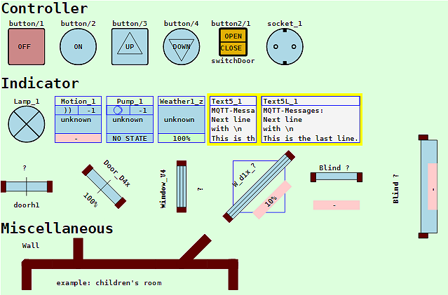
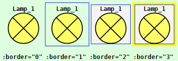
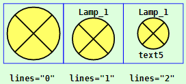
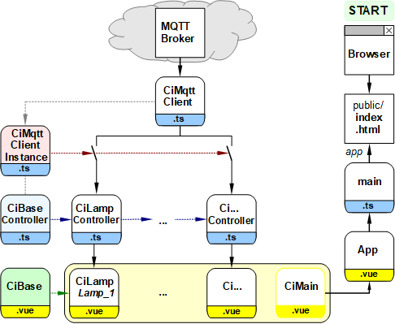

Letzte &Auml;nderung: 20.1.2022 <a name="up"></a>   
<table><tr><td></img></td><td>
<h1>Beispiele f&uuml;r Ci-Symbole</h1>
<a href="../../LIESMICH.md">==> Startseite</a> &nbsp; &nbsp; &nbsp; 
<a href="./README.md">==> English version</a> &nbsp; &nbsp; &nbsp; 
</td></tr></table>
<hr>

# Worum geht es?
Dieses Vue-Projekt zeigt viele Steuer- und Anzeigeelemente ("Control and Indicator elements", CI-Elemente), die man bei der Visualisierung der eigenen Haussteuerung mit Vue verwenden kann. Alle hier gezeigten Elemente k&ouml;nnen &uuml;ber MQTT angesprochen werden (sofern ein Broker auf dem Host 10.1.1.1 l&auml;uft...).   

   
_Bild 1: CI-Symbole_   

Jedes Symbol kann ohne oder mit einem Rahmen gezeichnet werden:    
   
_Bild 2: Lampensymbol mit verschiedenen Rahmen (Vorgabe: `:border="2"`)_   

Auch die Anzahl der Informationszeilen kann gew&auml;hlt werden (Symbol mit `:border="1"`):   
      
_Bild 3: Lampensymbol mit verschiedener Anzahl an Textzeilen (Vorgabe: `lines="1"`)_   

## Dieses Vue-Beispiel beantwortet folgende Fragen:   
1. [Wie bringe ich dieses Beispiel auf meinem Rechner zum Laufen?](#a10)
2. [Wie teste ich die Elemente in diesem Beispiel?](#a20)   
3. [Etwas Theorie: Welche Aufgaben haben die Komponenten eines CI-Elementes?](#a30)   
4. [Wie baue ich eines dieser CI-Elemente in meine Vue-Anwendung ein?](#a40)   

Wie man eigene Elemente erstellt und verwendet, wird zB im Projekt ["Vue-MQTT: Wie erstellt man ein CI-Symbol?" (vue20_ci_mqtt_lamp1)](vue20_ci_mqtt_lamp1) erkl&auml;rt.   
Von vielen Elementen gibt es mehrere Darstellungsvarianten (verschiedene Gr&ouml;&szlig;en etc.). Sind die Varianten besonders vielf&auml;ltig, werden sie in weiteren Projekten genauer erkl&auml;rt, zum Beispiel:   

* Wandelemente (CiWall): [vue60_ci_mqtt_wall1](vue60_ci_mqtt_wall1)   
* Fenster, T&uuml;ren und Rollos (CiWindow, CiDoor, CiBlind): [vue65_ci_mqtt_door_etc](vue65_ci_mqtt_door_window)   

<a name="a10"></a>

# 1. Wie bringe ich das Projekt auf meinem Rechner zum Laufen?   

Eine M&ouml;glichkeit besteht darin, ein leeres VSC Projekt anzulegen, die Dateien von github herunterzuladen und in das VSC Projekt zu kopieren.   

## Welche Dinge ben&ouml;tige ich?
* Hardware: PC oder Laptop mit Internetzugang, Browser   
* Hardware: Raspberry Pi (oder PC), auf dem ein MQTT-Broker l&auml;uft (zB Mosquitto)   
* Software: Visual Studio Code ("VSC"), das f&uuml;r Vue-Anwendungen bereits vorbereitet ist.   
* Software: Die MQTT-Klient-Programme `mosquitto_sub` und ` mosquitto_pub` (auf dem PC oder RasPi installiert)   

## Wie lege ich ein leeres VSC Projekt an?
1. Visual Studio Code (VSC) starten.   
2. VSC: Terminal-Fenster &ouml;ffnen: Men&uuml; Terminal - New Terminal.   
3. VSC-Terminal: In den Ordner wechseln, unter dem das Vue-Projekt erzeugt werden soll, zum Beispiel:   
   `cd /c/work/test_vue`   
4. VSC-Terminal: Vue.js Applikation erzeugen: `vue create vue50_ci_mqtt_symbols`  
   Mit Cursortasten, Leertaste und &lt;Enter&gt; Folgendes ausw&auml;hlen:   
   `> Manually select features` &nbsp; &lt;Enter&gt;   
   `(*) Choose Vue version`   
   `(*) Babel`   
   `(*) TypeScript`   
   `( ) Router`   
   `(*) Linter / Formatter`   
   &lt;Enter&gt;   
   _`> 3.x`_ &nbsp; &lt;Enter&gt;      
   _`? Use class-style component syntax?`_ &nbsp; __`N`__ &lt;Enter&gt;   
   _`? Use Babel alongside TypeScript (required for modern mode, auto-detected polyfills, transpiling JSX)?`_ &nbsp; __`N`__ &lt;Enter&gt;   
   _`? Use history mode for router? (Requires proper server setup for index fallback in production)`_ &nbsp; __`N`__ &lt;Enter&gt;   
   _`? Pick a linter / formatter config:`_ &nbsp; __`ESLint + Standard config`__ &lt;Enter&gt;   
   _`? Pick additional lint features: `_ &nbsp; __`Lint on save`__ &lt;Enter&gt;   
   _`? Where do you prefer placing config for Babel, ESLint, etc.?`_  &nbsp; __`In dedicated config file`__ &lt;Enter&gt;   
   _`? Save this as a preset for future projects? (y/N)`_ &nbsp; __`N`__ &lt;Enter&gt;   
5. In den Projektordner wechseln: _VSC Men&uuml; Datei - Ordner &ouml;ffnen_..   
   `c:/work/test_vue/vue50_ci_mqtt_symbols` [Ordner ausw&auml;hlen]   
6. MQTT Bibliothek installieren:   
   VSC: Terminal-Fenster &ouml;ffnen: Men&uuml; Terminal - New Terminal.   
   `npm install mqtt --save`   

## Wie kann ich die Projekt-Dateien herunterladen?
Um sich das einzelne Herunterladen der Dateien zu ersparen, ist es am einfachsten, das ganze Projekt `mqtt4home` als zip-Datei herunterzuladen:   

1. Im Browser die Adresse (URL) [`https://github.com/khartinger/mqtt4home`](https://github.com/khartinger/mqtt4home) eingeben.   
2. Den Button [Code] anklicken, "Download ZIP" w&auml;hlen und im Auswahl-Fenster [*] Datei speichern [OK] ausf&uuml;hren.   

## Wie kann ich die heruntergeladenen Dateien ins VSC-Projekt kopieren?
1. Im Browser bei Download f&uuml;r die Datei __mqtt4home-main.zip__ "Datei &ouml;ffnen" anklicken (oder ins Download-Verzeichnis wechseln und dort die zip-Datei &ouml;ffnen).   
2. Im Explorer das Verzeichnis `mqtt4home-main/source_Vue/vue50_ci_mqtt_symbols/src` mit der rechten Maustaste anklicken und "Kopieren" w&auml;hlen.   
3. Ins Projektverzeichnis `c:/work/test_vue/vue50_ci_mqtt_symbols` wechseln und dort die Dateien einf&uuml;gen (und dabei drei Dateien &uuml;berschreiben). Beim Einf&uuml;gen wird das Verzeichnis automatisch entpackt.   

## Wie kann ich das Projekt starten?
1. In VSC &uuml;ber den Men&uuml;punkt Terminal - New Terminal das Terminalfenster &ouml;ffnen (falls es nicht schon offen ist) und den eingebauten Server starten mit   
`npm run serve`   
2. Im Browser folgende Adresse (URL) eingeben:   
`localhost:8080`   
  Im Browser sollte _Bild 1_ angezeigt werden.   

<a name="a20"></a>

# 2. Wie teste ich die Elemente in diesem Beispiel?   
## Vorbereitung
Zum Ausprobieren der Elemente muss das Projekt - wie oben beschrieben - gestartet werden. 
Als Browser eignet sich Google Chrome besonders, da man mit der Taste [F12] die Entwickler-Tools &ouml;ffnen kann.   
Nach dem Start des Servers oder nach einem Aktualisieren der Seite sollte in der Entwickler-Konsole von Chrome ein Text wie   
`MqttClient-Constructor: subscribe #`   
`MqttClient-Constructor: finished`   
stehen.   
Steht hingegen "WebSocket connection to 'ws://10.1.1.1:1884/' failed:", dann fehlt die Verbindung zum Broker. (ZB fehlende WLAN-Verbindung)   

## Test ohne Beobachtung der MQTT-Nachrichten
Einige der Symbole sind &uuml;ber MQTT-Nachrichten miteinander verbunden, sodass man ihr Aussehen ver&auml;ndern kann:    

* Beim Starten der Webseite oder nach einem Aktualisieren erscheint die Lampe "Lamp_1" hellblau ("Zustand unbekannt").   
* Dr&uuml;ckt man den Button "button/1", so wird die Lampe "Lamp_1" grau eingef&auml;rbt ("Lampe aus").   
* Dr&uuml;ckt man den Button "button/2", so wird die Lampe "Lamp_1" gelb eingef&auml;rbt ("Lampe ein").   
* Dr&uuml;ckt man beim Button "button2/1" auf "OPEN", werden alle T&uuml;ren-, Fenster- und Rollo-Symbole im offenen Zustand dargestellt.   
* Dr&uuml;ckt man beim Button "button2/1" auf "CLOSE", werden alle T&uuml;ren-, Fenster- und Rollo-Symbole im geschlossenen Zustand dargestellt.   

## Test mit Beobachtung der MQTT-Nachrichten
Zum Beobachten des MQTT-Nachrichtenaustauschs muss das Programm `mosquitto_sub` gestartet werden. Das kann entweder &uuml;ber die Eingabeaufforderung (cmd.exe) am PC oder eine Konsole am RasPi gemacht werden:   
`mosquitto_sub -h 10.1.1.1 -t "#" -v`   

Zus&auml;tzlich zur Aktion kann man jetzt auch die gesendeten Nachrichten beobachten:   

* Dr&uuml;ckt man das Lampensymbol "Lamp_1", erscheint die Nachricht   
  `ci/lamp/1/set/lamp -1` in der Konsole.   
* Dr&uuml;ckt man den Button "button/2", werden die Nachrichten   
  `ci/button/2 1`   
  `ci/lamp/1/set/lamp 1`   
   gesendet und die Lampe "Lamp_1" wird gelb gef&auml;rbt ("Lampe ein"), weil sie auf das Topic `ci/lamp/1/set/lamp` "h&ouml;rt".   
* Dr&uuml;ckt man den Button "button/1", werden die Nachrichten   
  `ci/button/2 0`   
  `ci/lamp/1/set/lamp 0`   
   gesendet und die Lampe "Lamp_1" wird grau gef&auml;rbt ("Lampe aus").
* Dr&uuml;ckt man beim Button "button2/1" auf "OPEN", wird die Nachricht   
  `ci/button2/1/status 1`   
   gesendet. Die T&uuml;ren-, Fenster und Rollo-Symbole sind so eingestellt, dass sie auf diese Nachricht mit dem "Offen"-Zustand reagieren.   
* Dr&uuml;ckt man beim Button "button2/1" auf "CLOSE", wird die Nachricht   
  `ci/button2/1/status 0`   
   gesendet. Die T&uuml;ren-, Fenster und Rollo-Symbole sind so eingestellt, dass sie auf diese Nachricht mit dem "Geschlossen"-Zustand reagieren.   

Die Benennung der Nachrichten kann beliebig ge&auml;ndert werden.   

## Senden eigener MQTT-Nachrichten
Mit Hilfe des Programms `mosquitto_pub` kann man auch selbst Nachrichten an die Symbole senden.   

* Einschalten des Lampensymbols:   
  `mosquitto_pub -h 10.1.1.1 -t ci/lamp/1/set/lamp  -m 1`   
* Ausgabe eines Textes in der Anzeige `<CiTest5L>`:   
`mosquitto_pub -h 10.1.1.1 -t ci/text5L/set -m "Title\nOne very very long line and a last line..."`   
* Einschalten der Funksteckdose und Anzeige mit dem Element `<ciSocket>`   
`mosquitto_pub -h 10.1.1.1 -t ci/socket/1 -m "{\"state\": \"ON\"}"`   
* Ausschalten der Funksteckdose und Anzeige mit dem Element `<ciSocket>`   
`mosquitto_pub -h 10.1.1.1 -t ci/socket/1 -m "{\"state\": \"OFF\"}"`   

&nbsp;

<a name="a30"></a>
# 3. Etwas Theorie: Welche Aufgaben haben die Komponenten eines CI-Elementes?
Die meisten CI-Elemente bestehen aus zwei Dateien, einem Controller (`.ts`) und einer Anzeige (`.vue`).   
Diese Dateien werden getrennt in den Projektordnern `src/controller` und `src/components` abgelegt.   

Der __Controller__ hat im Wesentlichen folgende Aufgaben:   
* Festlegen zus&auml;tzlicher Eigenschaften f&uuml;r das Element.   
  Die Basiseigenschaften `id`, `name?`, `subTopic`, `pubTopic` und `pubPayload?` werden f&uuml;r jedes Element bereits in der Klasse `CiBase` definiert. Das Fragezeichen nach dem Namen bedeutet, dass die Definition der Eigenschaft auch weggelassen werden kann.   
* Definition aller Symbole dieses Typs in einem Feld.   
* Realisierung der Methoden `onMessage` und `publishCi` f&uuml;r die MQTT-Kommunikation des Elementes (bzw. f&uuml;r alle Symbole des gleichen Typs).   
* Erstellen und Exportieren einer Instanz des Controllers.   

Die __Anzeige__ hat folgende Aufgaben:   
* Zeichnen eines Symbols im `<template>` Bereich.   
* Importieren der Element-Eigenschaften und der Controller-Instanz aus der Controller-Datei.   
* Importieren des Basiselements (mit den Basisdaten aller Symbole).   
* Erzeugen einer Komponente, die die Parameter f&uuml;r ein bestimmtes Symbol &uuml;bernehmen und auswerten kann, zB   
  * &Uuml;bernahme von `x`- und `y`-Wert des Zentrums des Symbols,   
  * ID des Symbols (`sid`),   
  * Information zur Darstellung des Symbolrandes (`border` 0...3),
  * Anzahl der darzustellenden Textzeilen (`lines` 0...2).   
* Eventuell: Codierung einer Methode, die beim Klicken auf das Symbol ausgef&uuml;hrt wird (zB `onClk`).   

Folgende Eigenschaften sind allen Symbolen gemeinsam, da sie in `CiBase` definiert sind:   
* Symbole sind svg-Zeichnungen.   
* Symbole sind in der Regel quadratisch.   
* Jedes Symbol hat einer Rand, der 10% der Breite betr&auml;gt.   
* Jedes Symbol kann mit und ohne Rand (`border="0"`) gezeichnet werden.   
  Als Rand sind eine &auml;u&szlig;ere blaue Linie (`border="1"`), eine innere Linie (`border="2"`) oder ein farbiger Rand (`border="3"`) m&ouml;glich. Vorgabe ist das Zeichnen des inneren Randes.   
* Jedes Symbol greift auf die selben geometrischen Variablen und Konstanten (Klasse `Geo`) sowie Styles zu.   

__Weiters gilt__:   
* Jedes Symbol muss im entsprechenden Controller registriert werden (d.h. ein Eintrag im Feld der Symbole).   
* Die Eigenschaften eines Symboles werden beim Eintrag in das Feld festgelegt.   

&nbsp;

<a name="a40"></a>

# 4. Wie baue ich eines dieser CI-Elemente in meine Vue-Anwendung ein?   
Die folgende Anleitung geht davon aus, dass das eigene Projekt &auml;hnlich zu diesem Projekt aufgebaut ist:   
* Getrennte Verzeichnisse f&uuml;r `components` und `controller`.   
* CI-Controller sind von `CiBaseController` abgeleitet.   
* CI-Elemente sind von `CiBase` abgeleitet.   
* Alle Anzeigesymbole werden von der Datei `CiMain.vue` angezeigt.   
* Die MQTT-Anbindung erfolgt &uuml;ber die Dateien `services/CiMqttClient.ts` und `services/CiMqttClientInstance.ts`.   

Eine &Uuml;bersicht &uuml;ber die beteiligten Dateien liefert das folgende Bild, in dem `Ci...` f&uuml;r die verschiedenen Elemente steht:   

   
_Bild 4: &Uuml;bersicht &uuml;ber die beteiligten Dateien_   

Ist das eigene Projekt wie oben beschrieben aufgebaut, dann sind zum Einbinden eines Elementes sechs Schritte erforderlich:   
1. Kopieren der Anzeige-Datei ("*.vue") ins Verzeichnis `src/components`   
2. Kopieren der Controller-Datei ("*.ts") ins Verzeichnis `src/controller`   
3. Registrieren des Controllers in `services/CiMqttClientInstance.ts`   
4. Eintragen der Symbol-Eigenschaften im Controller   
5. Einbinden des Elementes in der main-Datei   
6. Darstellung des Symbols   

Die einzelnen Schritte werden im Folgenden in einem Beispiel genauer beschrieben.   

## Beispiel   
Vom Element `CiXxx` sollen in der Datei `CiMain.vue` zwei Symbole mit folgenden Eigenschaften gezeichnet werden:   

| Eigenschaft                              |    Symbol 1    |    Symbol 2    |   
|------------------------------------------|:--------------:|:--------------:|   
| Zentrum des Symbols (x/y)                |     100/200    |     200/300    |   
| ID des Symbols                           |      xxx1      |      xxx2      |   
| Zeichnen des Symbols mit Rand            |      nein      |  ja, Au&szlig;enrand |   
| Anzahl der Info-Zeilen                   |       1        |       2        |   
| Topic zum Senden von MQTT-Nachrichten    |  ci/xxx/1/pub  |  ci/xxx/2/pub  |   
| Topic zum Empfangen von MQTT-Nachrichten |  ci/xxx/1/sub<br>ci/xxx/x/sub  |  ci/xxx/2/sub<br>ci/xxx/x/sub  |   
| Payload beim Senden von MQTT-Nachrichten |      -1        |      -1        |   

_Annahme_: Die Dateien `CiXxx.vue` und `CiXxxController.ts` gibt es bereits.

### Schritt 1 + 2: Kopieren der CiXxx-Dateien
* Kopieren der Anzeige-Datei `CiXxx.vue` ins Verzeichnis `src/components`   
* Kopieren der Controller-Datei `CiXxxController.ts` ins Verzeichnis `src/controller`   

### Schritt 3: Registrieren der CiXxx-Controller-Datei in CiMqttClientInstance.ts
Datei `src/services/CiMqttClientInstance.ts` &ouml;ffnen und folgende zwei Zeilen erg&auml;nzen:   
```   
// ______mqttClientInstance.ts__________________________________
import { CiMqttClient } from './CiMqttClient'
import { ciXxxController } from '@/controller/CiXxxController'

export const ciMqttClientInstance = new CiMqttClient(true)
ciMqttClientInstance.registerController(ciXxxController)

```   

### Schritt 4: Eintragen der Symbol-Eigenschaften im CiXxx-Controller
Datei `src/controller/CiXxxController.ts` &ouml;ffnen und folgendes eintragen:   
```   
  public xxxs: Array<Xxx> = reactive(
    [
      {
        id: 'xxx1',
        subTopic: 'ci/xxx/1/sub ci/xxx/x/sub',
        pubTopic: 'ci/xxx/1/pub',
        pubPayload: '-1'
      },
      {
        id: 'xxx2',
        subTopic: 'ci/xxx/2/sub ci/xxx/x/sub',
        pubTopic: 'ci/xxx/2/pub',
        pubPayload: '-1'
      }
    ]
  );
```   

### Schritt 5: Einbinden des CiXxx-Elementes in der main-Datei
 Datei `src/components/CiMain.vue` &ouml;ffnen und im `<script>`-Bereich folgende zwei Eintragungen durchf&uuml;hren:    
*  Importieren der Kodierung der Xxx-Darstellung:   
  `import CiXxx from './CiXxx.vue'`   
* Aufz&auml;hlen bei den verwendeten Komponenten:   
  `components: {`   
  `  CiXxx`   
  `},`   

### Schritt 6: Darstellung der CiXxx-Symbole
Der Einbau der Xxx-Symbole im `<template>`-Bereich der `CiMain.vue`-Datei erfolgt durch folgende Anweisungen:
```   
<CiXxx :x="100" :y="200" sid="xxx1" lines="1" :border="0"></CiXxx>`   
<CiXxx :x="100" :y="300" sid="xxx2" lines="2" :border="1"></CiXxx>`   
```   

[Zum Seitenanfang](#up)   
