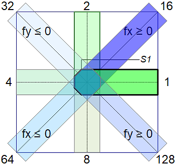
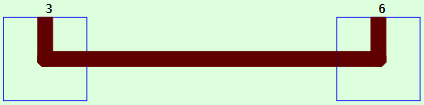
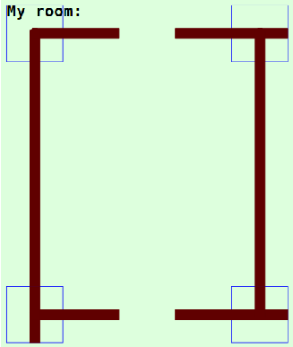

Letzte &Auml;nderung: 4.1.2022 <a name="up"></a>   
<table><tr><td></img></td><td>
<h1>Wie zeichnet man einen Hausplan? (CiWall-Elemente)</h1>
<a href="../../LIESMICH.md">==> Startseite</a> &nbsp; &nbsp; &nbsp; 
<a href="./README.md">==> English version</a> &nbsp; &nbsp; &nbsp; 
</td></tr></table>
<hr>

## Ziel
Dieses Vue-Projekt zeigt, wie man mit Hilfe der CiWall-Komponente einfach Hauspläne bzw. Wohnungsgrundrisse zeichnet. In diese Pläne können anschließend die CI-Symbole der Hausautomation eingefügt werden.   

_Bild 1_ zeigt Beispiele für Wand-Elemente:   

   
_Bild 1: Wand-Elemente_   

# Verwendung von Wandelementen
## Grundsätzliches
Wandelemente haben, so wie alle CI-Symbole, eine quadratische Form und werden innerhalb des `<svg>`-Bereichs (des `<template>`-Bereichs) einer CI-Vue-Komponente zB durch folgende Zeile eingefügt:   
`<CiWall :x="200" :y="100" sid="w" type="9" :fx="5" :fy="0.5"></CiWall>`   
Dabei bedeutet   
* `x` und `y` sind die Koordinaten des Mittelpunktes.   
* `sid` ist die ID des Symbols. Diese muss zwar angegeben werden, wird aber nicht weiter verwenet und kann auch für alle Symbole gleich sein.   
* `type` gibt die Art (Nummer) des Wandelementes an und wird weiter unten genauer beschrieben.   
* `fx` und `fy` sind Streckfaktoren in x- und y-Richtung.   

Der "type"-Wert kann sowohl als Dezimalzahl als auch als Hexadezimalzahl angegeben werden (zB 10 = 0x0A).   

Die Codierung der Wandelemente befindet sich in der Komponente `CiWall.vue`. Es gibt keinen dazugehörigen Controller, da die Elemente ja nur zum Zeichnen dienen und keine MQTT-Anbindung benötigen.   

## Basiswandelemente
Insgesamt gibt es 11 Basis-Wandelemente, wobei die Elemente mit den Nummern 0, 256 und 512 Sonder-Wandelemente darstellen (siehe auch _Bild 1_):   
* 0: leeres Wandelement   
* 256: Quadrat mit der Wandstärke als Seitenlänge    
* 512: wie Nummer 256, allerdings um 45° gedreht   

Die Elemente 256 und 512 können dazu verwendet werden, bei senkrecht aufeinander stehenden Elementen die abgeschr&auml;gten Ecken spitz zu machen.    

Basiselemente beginnen im Zentrum des Symbols und zeigen in die Achsenrichtungen oder Diagonalen:   
* 1: x+ Richtung   
* 2: y- Richtung (y minus!)   
* 4: x- Richtung   
* 8: y+ Richtung (y plus!)   
* 16: Diagonale 1. Quadrant (Streckfaktor fx > 0)   
* 32: Diagonale 2. Quadrant (Streckfaktor fy < 0)   
* 64: Diagonale 3. Quadrant (Streckfaktor fx < 0)   
* 128: Diagonale 4. Quadrant (Streckfaktor fy > 0)   

_Bild 2_ zeigt die Basiselemente:   

   
_Bild 2: Basis-Wandelemente_   

Die Basiselemente haben im Zentrum abgerundete Ecken, damit bei Verbindungen unter 45° keine kleinen Ecken "herausstehen".    
S1 ist Startpunkt für die Erstellung des svg-path-Strings.   

## Zusammengesetzte Wandelemente
Aus den Basiselementen können weitere Wandelemente zusammengesetzt werden, indem man die Einzelwerte addiert.   

_Beispiele:_   
` 1 +  2 =  3` : Wand wie ein L   
` 1 +  4 =  5` : Waagrechte Linie --   
` 2 +  8 = 10` : Senkrechte Linie |   
`16 + 32 = 48` : Wand wie ein V   
`1 + 2 + 8 = 11` : senkrechte Wand mit waagrechten Ansatz rechts |-   
`2 + 4 + 8 = 14` : senkrechte Wand mit waagrechten Ansatz links  -|   
` 1 +  2 +256 =  259 = 0x103` : Wand wie ein L mit spitzer Ecke   
usw.   

## Strecken der Wandelemente
Um eine längere Wand zB in x+ Richtung zu zeichnen, kann man man mehrere `type="5"`-Elemente aneinanderreihen zB ergibt sich für   
   
_Bild 3: Wand in x+ Richtung bestehend aus Einzelelementen_   
die Codierung   
```   
  <CiWall :x="100" :y="100" sid="w" type="3" :border="1"></CiWall>
  <CiWall :x="200" :y="100" sid="w" type="5" :border="1"></CiWall>
  <CiWall :x="300" :y="100" sid="w" type="5" :border="1"></CiWall>
  <CiWall :x="400" :y="100" sid="w" type="5" :border="1"></CiWall>
  <CiWall :x="500" :y="100" sid="w" type="6" :border="1"></CiWall>
```   
Anmerkung: Um die einzelnen Elemente besser erkennen zu können, wurde mit `:border="1"` der Rand um jedes Element eingezeichnet.   

Um sich das Schreiben der waagrechten Wandelemente zu ersparen, kann daher der x+ Schenkel des 1. Elementes verlängert werden. Dazu gibt man im Parameter `:fx` an, um das Wievielfache dieses Basiselement gestreckt werden soll, zB `:fx="7"`.   
Beachte: die Breite eines Elementes besteht aus __zwei__ Basiselementen!   

Somit ergibt für die gleiche Wanddarstellung   
   
_Bild 4: Wand in x+ Richtung mit gestrecktem Element_   
 die Codierung   
```   
  <CiWall :x="100" :y="100" sid="w" type="3" :fx="7" :border="1"></CiWall>
  <CiWall :x="500" :y="100" sid="w" type="6" :border="1"></CiWall>
```   


__Zusammenfassend gilt für die Streckfaktoren__:   
* fx > 0 streckt das Element 1 (x+ Richtung)   
* fx < 0 streckt das Element 4 (x- Richtung)   
* fy > 0 streckt das Element 8 (y+ Richtung, nach UNTEN!)   
* fy < 0 streckt das Element 2 (y- Richtung, nach OBEN!)   

Für diagonale Elemente werden ebenfalls die Faktoren fx und fy verwendet, wobei folgendes gilt:   
* fx > 0 streckt das Element 16 (Diagonale im 1. Quadranten)   
* fx < 0 streckt das Element 64 (Diagonale im 3. Quadranten)   
* fy > 0 streckt das Element 128 (Diagonale im 4. Quadranten)   
* fy < 0 streckt das Element 32 (Diagonale im 2. Quadranten)   

&nbsp;
# Beispiel: Zeichnen der Wände eines Zimmers
Für folgendes Zimmer soll eine Komponente "WallRoom1.vue" erstellt werden:   
   
_Bild 5: Komponente WallRoom1.vue_   

Zum Setzen der Symbole soll ein Raster verwendet werden, dass der Breite ("dx") und Höhe ("dy") der CI-Elemente entspricht. Die Größe des Zimmers soll 5 x 6 Kästchen betragen.   
Im _Bild 5_ ist für eine bessere Übersicht bei den CiWall-Elementen `:border="1"` gesetzt. In der endgültigen Version sollten dieses Attribut entfernt oder auf 0 gesetzt werden.   
## 1. Erstellen der Datei WallRoom1.vue
Mit der linken Maustaste zuerst auf `src` dann auf `components` klicken, mit der rechten Taste auf "Neue Datei" klicken und den Namen `WallRoom1.vue` eingeben.   

## 2. Codierung der Datei WallRoom1.vue
Im `<template>`-Bereich wird zuerst die `<sgv>`-Zeichenfläche definiert und mit der Hintergrundfarbe ausgefüllt. Danach wird der Hausplan gezeichnet.   

* Im `<script lang="ts">` Bereich werden zuerst 
  * die Komponenten `defineComponent`, `Geo` und `CiWall` eingebunden und   
  * die neue Komponente `WallRoom1` definiert.   
* Die Komponente `WallRoom1` enthält dann unter `computed: {` die Methoden   
  * `geo` (enthält Geometriedaten wie zB die Größe der CI-Elemente)   
  * `dx` (Breite der CI-Elemente = x-Rasterbreite) und   
  * `dy` (Höhe der CI-Elemente = y-Rasterhöhe)   

_Ergebnis_:   
```   
<!--CiMain.vue-->
<template>
<svg width="100%" viewBox="40 40 560 660">
  <rect class="ciBackground" x="40" y="40" width="520" height="620" />
  <text :x="0.5*dx" :y="0.7*dy" class="ciFont2">My room:</text>
  <CiWall :x="1*dx" :y="1*dy"  sid="w01" type="9" :fx="3" :fy="9" :border="1"></CiWall>
  <CiWall :x="5*dx" :y="1*dy"  sid="w01" type="13" :fx="-3" :fy="9" :border="1"></CiWall>
  <CiWall :x="1*dx" :y="6*dy"  sid="w01" type="11" :fx="3" :border="1"></CiWall>
  <CiWall :x="5*dx" :y="6*dy"  sid="w01" type="7" :fx="-3" :border="1"></CiWall>
</svg>
</template>

<script lang="ts">
import { defineComponent } from 'vue'
import { Geo } from './CiBase.vue'
import CiWall from './CiWall.vue'

export default defineComponent({
  name: 'WallRoom1',
  components: {
    CiWall
  },
  computed: {
    geo: function (): Geo {
      const geo1 = new Geo(0, 0)
      return geo1
    },
    dx: function (): number { return (this.geo.dxo) },
    dy: function (): number { return (this.geo.dyo) }
  }
})
</script>

<style>
</style>
```   

## 3. Testen der Komponente WallRoom1.vue
Die Komponente `WallRoom1.vue` kann in jede Vue-Komponente eingebunden werden, indem man
* im `<template>` Bereich die Zeile   
  `<WallRoom1></WallRoom1>`   
  eingibt,   
* im `<script lang="ts">` Bereich die Komponente importiert   
  `import WallRoom1 from './WallRoom1.vue'`   
  und unter `components: {` die Zeile    
  `    WallRoom1,`  
  einfügt.   

Nach dem Speichern der Datei (zB `CiMain.vue`), dem Starten des eingebauten Servers im Terminal mit   
`npm run serve`   
und dem Aufruf der Seite im Browser durch Eingabe der Adresse (URL)   
`localhost:8080`   
wird die Komponente im Browser angezeigt.   

[Zum Seitenanfang](#up)