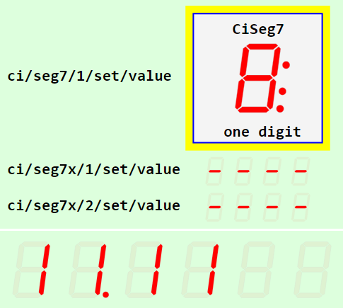
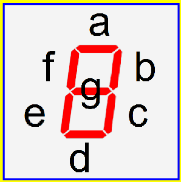
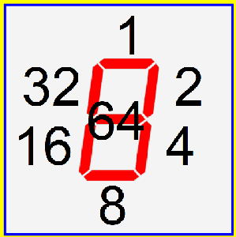

Last modified: 2022-03-05 <a name="up"></a>   
<table><tr><td></td><td>
<h1>Vue-MQTT: SVG seven-segment display with MQTT control</h1>
<a href="../../README.md">==> Home page</a> &nbsp; &nbsp; &nbsp; 
<a href="./LIESMICH.md">==> German version</a> &nbsp; &nbsp; &nbsp; 
</td></tr></table>
<hr>

# What is it about?
This project "Vue: MQTT Seg7" introduces a seven-segment display for SVG graphics that is controlled via MQTT. It can display numbers, hexadecimal numbers, date and time, or any combination of segments.   
1 to 24 digits are possible (expandable by changing the value `digitMaxNumber`).   

The following picture shows some application examples:   
   
_Fig. 1: Application examples of the seven segment display_.   

The top image shows the display of one digit with the frame typical for Ci (controller indicator) elements, the other three displays show a different number of digits and sizes.   
All values can be changed by MQTT messages.   

Clicking on the seven-segment display sends out a message with the currently displayed value.   

## This tutorial answers the following questions:   
1. [What things do I need for this project?](#a10)   
2. [How do I get this example to work on my computer?](#a20)
3. [How can I display characters on the screen?](#a30)   
4. [How do I customize the properties of the display?](#a40)   

<a name="a10"></a>[_Top of page_](#up)

# What things do I need for this project?

* Hardware: PC or laptop with internet access, browser.   
* Hardware: Raspberry Pi as access point (WLAN Raspi11, PW 12345678) with IP 10.1.1.1, running an MQTT broker (e.g. Mosquitto).   
* Software: Visual Studio Code ("VSC"), which is already prepared for Vue applications.   
* Software: The MQTT client programs `mosquitto_sub` and ` mosquitto_pub` (installed on the PC or RasPi).   

<a name="a20"></a>[_Top of page_](#up)

# How do I get the project to work on my computer?   

One way is to create an empty VSC project, download the files from github and copy them into the VSC project.   

## How do I create an empty VSC project?
1. Start Visual Studio Code (VSC).   
2. Open VSC: Terminal window: Terminal menu - New Terminal.   
3. VSC Terminal: Change to the folder under which the Vue project is to be created, for example:   
   `cd /c/work/test_vue`.   
4. VSC-Terminal: Create Vue.js application: `vue create vue70_ci_mqtt_seg7`.  
   Select the following with cursor keys, space bar and &lt;Enter&gt;:   
   `> Manually select features` &nbsp; &lt;Enter&gt;   
   `(*) Choose Vue version`   
   `(*) Babel`   
   `(*) TypeScript`   
   `( ) Router`   
   `(*) Linter / Formatter`   
   &lt;Enter&gt;   
   _`> 3.x`_ &nbsp; &lt;Enter&gt;      
   _`? Use class-style component syntax?`_ &nbsp; __`N`__ &lt;Enter&gt;   
   _`? Use Babel alongside TypeScript (required for modern mode, auto-detected polyfills, transpiling JSX)?`_ &nbsp; __`N`__ &lt;Enter&gt;   
   _`? Use history mode for router? (Requires proper server setup for index fallback in production)`_ &nbsp; __`N`__ &lt;Enter&gt;   
   _`? Pick a linter / formatter config:`_ &nbsp; __`ESLint + Standard config`__ &lt;Enter&gt;   
   _`? Pick additional lint features: `_ &nbsp; __`Lint on save`__ &lt;Enter&gt;   
   _`? Where do you prefer placing config for Babel, ESLint, etc.?`_ &nbsp; __`In dedicated config file`__ &lt;Enter&gt;   
   _`? Save this as a preset for future projects? (y/N)`_ &nbsp; __`N`__ &lt;Enter&gt;   
5. Switch to the project folder: _VSC Menu File - Open Folder_..   
   `c:/work/test_vue/vue70_ci_mqtt_seg7` [select folder].   
6. Install MQTT library:   
   VSC: Open terminal window: Terminal menu - New Terminal.   
   `npm install mqtt --save`   

## How can I download the project files?
To save downloading the files one by one, the easiest way is to download the whole project `mqtt4home` as a zip file:   

1. In the browser enter the address (URL) [`https://github.com/khartinger/mqtt4home`](https://github.com/khartinger/mqtt4home).   
2. Click the button [Code], choose "Download ZIP" and in the selection window [*] save file [OK].   

## How can I copy the downloaded files to the VSC project?
1. in the browser at download for the file __mqtt4home-main.zip__ click "open file" (or change to the download directory and open the zip file there).   
2. in the explorer right-click the directory `mqtt4home-main/source_Vue/vue70_ci_mqtt_seg7/src/` and select "Copy".   
3. change to the project directory `c:/work/test_vue/vue70_ci_mqtt_seg7` and paste the files there (overwriting three files). When inserting, the directory will be unpacked automatically.   

## How can I start the project?
1. Open the terminal window in VSC via the menu item Terminal - New Terminal (if it is not open already) and start the built-in server with   
`npm run serve`   
2. Enter the following address (URL) in the browser:   
`localhost:8080`   
  The browser should display _figure 1_ (above).   

<a name="a30"></a>[_Top of page_](#up)

# How can I show characters on the display?
## How do I send characters to the display?
To try it out, the project must be started - as described above. 
As a browser Google Chrome is particularly suitable, because you can open the developer tools with the [F12] key.   

After starting the server or refreshing the page, you should see in the developer console of Chrome a text like   
`MqttClient-Constructor: subscribe #`   
`MqttClient-Constructor: finished`   

If, on the other hand, it says "WebSocket connection to 'ws://10.1.1:1884/' failed:", then the connection to the broker is missing. (E.g. missing WLAN connection)   

With the help of the program `mosquitto_pub` you can send values to the display:   
* `mosquitto_pub -h 10.1.1.1 -t ci/seg7/1/set/value -m A`   
  In the topmost display the value A is shown.   

* `mosquitto_pub -h 10.1.1.1 -t ci/seg7x/1/set/value -m 12:54`   
  In the second display the value 12:54 is shown.   

* `mosquitto_pub -h 10.1.1.1 -t ci/seg7x/2/set/value -m 456.7`   
  In the third display the value 456.7 is shown.   

* `mosquitto_pub -h 10.1.1.1 -t ci/seg7x/3/set/value -m --12--`   
  In the lowest display the value --12-- is shown fixed.   
  The continuation of the variable display is achieved by the following message   
  `mosquitto_pub -h 10.1.1.1 -t ci/seg7x/3/set/value -m ""`   

### Numbers, time, date   
To represent a number, time or date, the digits 0 to 9, the period and the colon are available. Examples:   
    * Display of the number -5.66   
    `mosquitto_pub -h 10.1.1.1 -t ci/seg7x/1/set/value -m -5.66`   
  * Display the time 12:22   
    `mosquitto_pub -h 10.1.1.1 -t ci/seg7x/1/set/value -m 12:22`   
  * Display the date 14.03.   
    `mosquitto_pub -h 10.1.1.1 -t ci/seg7x/1/set/value -m 14.03.`   

### Hexadecimal numbers
In addition to the digits 0 to 9, the minus sign, the characters A, b, c, d, E and F are available for representing HEX values.   

### Special symbols
If you want to create your own symbols, each segment can be addressed individually. To do this, a plus followed by a value must be sent. The value is calculated from the sum of the activated segments in the following way:   

Segment a (horizontal top): value 1   
Segment b (vertical top right): value 2   
Segment c (vertical right bottom): value 4   
Segment d (horizontal bottom): value 8   
Segment e (vertical bottom left): value 16   
Segment f (vertical top left): value 32   
Segment g (horizontal center): value 64   
Dot: value 128   
Colon: value 256   

    
_Fig. 2: Calculation of the segment values_.   

__Example__: All horizontal segments and beside them all vertical segments shall be switched on.   
* Value for all horizontal symbols (segments a, d, g): 1 + 8 + 64 = 73   
* Value for all vertical symbols (segments b, c, e, f): 2 + 4 + 16 + 32 = 54   

MQTT message to be sent:   
`mosquitto_pub -h 10.1.1.1 -t ci/seg7x/1/set/value -m +73+54`   

Mixing the number formats is not possible (one digit with plus (+), the other digit as character).

<a name="a40"></a>[_Top of page_](#up)

# How do I adjust the properties of the display to my wishes?
## What to do if the broker does not have the IP address 10.1.1.1?
If the broker does not have the IP address 10.1.1.1, the IP in the file `CiMqttClient.ts` can be set as value   
`host: '10.1.1.1`,`   
 

## What are the call parameters?
The call of a seven segment display is done e.g. in `CiMain1.vue` by   
  `<CiSeg7 :x="180" :y="55" value="8" :height="48" sid= "ciSeg7_1" lines="0" :border="3"></CiSeg7>`   
or by   
  `<CiSeg7x :x="180" :y="120" digits="4" value="----" :height="20" sid="ciSeg7x_1"></CiSeg7x>`   

CiSeg7 ... seven segment display with one digit   
CiSeg7x ... multi-digit display   

__*As parameters are possible*__:   
* `x .......... ` x-coordinate of the center of the display (required)   
* `y .......... ` y-coordinate of the center of the display (required)   
* `value ...... ` digit to be displayed 0 ... F or value (default `'8:.'`)   
* `height ..... ` height of the display (default `26.2`)   
* `sid ........ ` ID of the display (default `''`)   
* `colorOn .... ` color of a switched on segment (default red i.e. `'#FF0000'`)   
* `colorOff ... ` color of a switched off segment (default high transparent red i.e. `'rgba(255,0,0,0.05)'`)   
* `lines ...... ` number of lines to display: 0=none, 1=title, 2=title + line 5 (default `0`)   
* `border ..... ` display a 100x100 pixel border (like Ci elements) (default is no border: `0`)   
* `digits ..... ` number of digits of the seven segment display (only for `<CiSeg7x>`)

## Definition of further properties of a seven-segment display
Each seven segment display that wants to use MQTT must be entered in the seven segment controller (file `controller/CiSeg7xController`) in the array `ciSeg7xs`, where the following properties are possible:   

* __id__: ID of the seven segment display. This must be unique.   
* name__: (Additional) name of the seven-segment display.   
* __subTopic__: Topic to which the seven-segment display responds (subscribe).   
* __pubTopic__: Topic of the message that will be sent when clicked.   
* pubPayload?: Payload of the message that will be sent on click.   
* __iSeg7xState__: Seven-segment display state (0=off, 1=on, -1=unknown).    
* text5?: Text for line 5 (if desired).   
* value7x?: Value to be displayed   

A question mark after the name indicates that this value does not need to be specified.   

_Example_:   
```   
  public ciSeg7xs: Array<CiSeg7x> = reactive(
    [
      {
        id: 'ciSeg7x_1',
        name: ''
        iSeg7xState: -1,
        text5: 'line 5 text...',
        subTopic: 'ci/seg7x/1/set/value',
        pubTopic: 'ci/seg7x/1/ret/value'
        // pubPayload: '?'
      },
// ...
    ]
  );
```   
At least the properties `id`, `iSeg7xState`, `subTopic` and `pubTopic` must be specified.   

[_Top of page_](#up)
