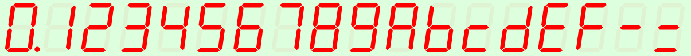
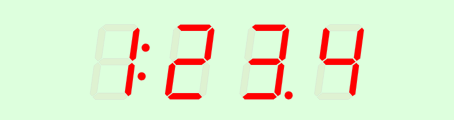

Letzte &Auml;nderung: 4.3.2022    
<table><tr><td></img></td><td>
<h1>Vue: Ansteuerung einer SVG Siebensegment-Anzeige mit MQTT</h1>
<a href="../../LIESMICH.md">==> Startseite</a> &nbsp; &nbsp; &nbsp; 
<a href="./README.md">==> English version</a> &nbsp; &nbsp; &nbsp; 
</td></tr></table>

# Worum geht es?
Dieses Projekt "Vue: MQTT Seg7" stellt eine Siebensegmentanzeige vor, die leicht kaskadierbar ist und in SVG-Grafiken zur Anzeige von Zahlen, Datum und Uhrzeit verwendet werden kann.   
Die Ansteuerung erfolgt &uuml;ber MQTT.   

Das folgende Bild zeigt die HEX-Ziffern der Siebensegmentanzeige:   
   
_Bild 1: Standard-Siebensegment-Ziffern_   

Zus&auml;tzlich zu diesen Werten kann auch jede beliebige Kombination der Einzel-Segmente dargestellt werden, zB
   
_Bild 2: Weitere Siebensegment-M&ouml;glichkeiten_   

## Diese Anleitung beantwortet folgende Fragen:   
1. [Welche Dinge ben&ouml;tige ich f&uuml;r dieses Projekt?](#a10)   
2. [Wie bringe ich dieses Beispiel auf meinem Rechner zum Laufen?](#a20)
3. [Wie kann ich Zeichen auf der Anzeige darstellen?](#a30)   

[_Zum Seitenanfang_](#up)   

# Welche Dinge ben&ouml;tige ich f&uuml;r dieses Projekt?

* Hardware: PC oder Laptop mit Internetzugang, Browser   
* Hardware: Raspberry Pi als Access Point (WLAN Raspi11, PW 12345678) mit der IP 10.1.1.1, auf dem ein MQTT-Broker l&auml;uft (zB Mosquitto)   
* Software: Visual Studio Code ("VSC"), das f&uuml;r Vue-Anwendungen bereits vorbereitet ist.   
* Software: Die MQTT-Klient-Programme `mosquitto_sub` und ` mosquitto_pub` (auf dem PC oder RasPi installiert)   

[_Zum Seitenanfang_](#up)   

# Wie bringe ich das Projekt auf meinem Rechner zum Laufen?   

Eine M&ouml;glichkeit besteht darin, ein leeres VSC Projekt anzulegen, die Dateien von github herunterzuladen und in das VSC Projekt zu kopieren.   

## Wie lege ich ein leeres VSC Projekt an?
1. Visual Studio Code (VSC) starten.   
2. VSC: Terminal-Fenster &ouml;ffnen: Men&uuml; Terminal - New Terminal.   
3. VSC-Terminal: In den Ordner wechseln, unter dem das Vue-Projekt erzeugt werden soll, zum Beispiel:   
   `cd /c/work/test_vue`   
4. VSC-Terminal: Vue.js Applikation erzeugen: `vue create vue72_mqtt_seg7`  
   Mit Cursortasten, Leertaste und &lt;Enter&gt; Folgendes ausw&auml;hlen:   
   `> Manually select features` &nbsp; &lt;Enter&gt;   
   `(*) Choose Vue version`   
   `(*) Babel`   
   `(*) TypeScript`   
   `( ) Router`   
   `(*) Linter / Formatter`   
   &lt;Enter&gt;   
   _`> 3.x`_ &nbsp; &lt;Enter&gt;      
   _`? Use class-style component syntax?`_ &nbsp; __`N`__ &lt;Enter&gt;   
   _`? Use Babel alongside TypeScript (required for modern mode, auto-detected polyfills, transpiling JSX)?`_ &nbsp; __`N`__ &lt;Enter&gt;   
   _`? Use history mode for router? (Requires proper server setup for index fallback in production)`_ &nbsp; __`N`__ &lt;Enter&gt;   
   _`? Pick a linter / formatter config:`_ &nbsp; __`ESLint + Standard config`__ &lt;Enter&gt;   
   _`? Pick additional lint features: `_ &nbsp; __`Lint on save`__ &lt;Enter&gt;   
   _`? Where do you prefer placing config for Babel, ESLint, etc.?`_  &nbsp; __`In dedicated config file`__ &lt;Enter&gt;   
   _`? Save this as a preset for future projects? (y/N)`_ &nbsp; __`N`__ &lt;Enter&gt;   
5. In den Projektordner wechseln: _VSC Men&uuml; Datei - Ordner &ouml;ffnen_..   
   `c:/work/test_vue/vue72_mqtt_seg7` [Ordner ausw&auml;hlen]   
6. MQTT Bibliothek installieren:   
   VSC: Terminal-Fenster &ouml;ffnen: Men&uuml; Terminal - New Terminal.   
   `npm install mqtt --save`   

## Wie kann ich die Projekt-Dateien herunterladen?
Um sich das einzelne Herunterladen der Dateien zu ersparen, ist es am einfachsten, das ganze Projekt `mqtt4home` als zip-Datei herunterzuladen:   

1. Im Browser die Adresse (URL) [`https://github.com/khartinger/mqtt4home`](https://github.com/khartinger/mqtt4home) eingeben.   
2. Den Button [Code] anklicken, "Download ZIP" w&auml;hlen und im Auswahl-Fenster [*] Datei speichern [OK] ausf&uuml;hren.   

## Wie kann ich die heruntergeladenen Dateien ins VSC-Projekt kopieren?
1. Im Browser bei Download f&uuml;r die Datei __mqtt4home-main.zip__ "Datei &ouml;ffnen" anklicken (oder ins Download-Verzeichnis wechseln und dort die zip-Datei &ouml;ffnen).   
2. Im Explorer das Verzeichnis `mqtt4home-main/source_Vue/vue72_mqtt_seg7/src/` mit der rechten Maustaste anklicken und "Kopieren" w&auml;hlen.   
3. Ins Projektverzeichnis `c:/work/test_vue/vue72_mqtt_seg7` wechseln und dort die Dateien einf&uuml;gen (und dabei drei Dateien &uuml;berschreiben). Beim Einf&uuml;gen wird das Verzeichnis automatisch entpackt.   

## Wie kann ich das Projekt starten?
1. In VSC &uuml;ber den Men&uuml;punkt Terminal - New Terminal das Terminalfenster &ouml;ffnen (falls es nicht schon offen ist) und den eingebauten Server starten mit   
`npm run serve`   
2. Im Browser folgende Adresse (URL) eingeben:   
`localhost:8080`   
  Im Browser sollte _Bild 3_ angezeigt werden.   
   
_Bild 3: Siebensegmentanzeige: Startwert_   

[_Zum Seitenanfang_](#up)   

# Wie kann ich Zeichen auf der Anzeige darstellen?
## Wie sende ich Zeichen an das Display?
Zum Ausprobieren muss das Projekt - wie oben beschrieben - gestartet werden. 
Als Browser eignet sich Google Chrome besonders, da man mit der Taste [F12] die Entwickler-Tools &ouml;ffnen kann.   
Nach dem Start des Servers oder nach einem Aktualisieren der Seite sollte in der Entwickler-Konsole von Chrome ein Text wie   
`MqttClient-Constructor: subscribe #`   
`MqttClient-Constructor: finished`   
stehen.   
Steht hingegen "WebSocket connection to 'ws://10.1.1.1:1884/' failed:", dann fehlt die Verbindung zum Broker. (ZB fehlende WLAN-Verbindung)   

Mit Hilfe des Programms `mosquitto_pub` kann man Werte an die Anzeige senden:   
  `mosquitto_pub -h 10.1.1.1 -t seg7/1/set/value -m 9.876`   
In der Anzeige wird der Wert 9.876 dargestellt.   

## Welche Werte k&ouml;nnen dargestellt werden?
Der Aufruf der Segmentanzeige erfolgt in der Datei `Seg7MainMqtt.vue` im `<template>`-Bereich mit der Zeile   
`<Seg7x :x="130" :y="40" :value="value7x" digits="4" :height="40" sid="sid1"> </Seg7x>`   

Mit dem Parameter "`digits`" wird die Anzahl der Ziffern eingestellt (hier 4, maximal 24).   

### Zahlen, Zeit, Datum   
Zur Darstellung einer Zahl, Zeit oder eines Datums stehen die Ziffern 0 bis 9, der Punkt und der Doppelpunkt zur Verf&uuml;gung. Beispiele:   
    * Anzeige der Zahl -5.66   
    `mosquitto_pub -h 10.1.1.1 -t seg7/1/set/value -m -5.66`   
  * Anzeige der Uhrzeit 12:22   
    `mosquitto_pub -h 10.1.1.1 -t seg7/1/set/value -m 12:22`   
  * Anzeige des Datums 14.03.   
    `mosquitto_pub -h 10.1.1.1 -t seg7/1/set/value -m 14.03.`   

### Hexadezimalzahlen
Zur Darstellung von HEX-Werten stehen zus&auml;tzlich zu den Ziffern 0 bis 9 die Zeichen A, b, c, d, E und F zur Verf&uuml;gung.   

### Sondersymbole
M&ouml;chte man eigene Symbole anzeigen, so kann jedes Segment einzeln angesprochen werden. Dazu muss ein Plus gefolgt von einem Wert gesendet werden. Der Wert berechnet sich aus der Summe der eingeschalteten Segmente auf folgende Weise:   

Segment a (waagrecht oben): Wert 1   
Segment b (senkrecht rechts oben): Wert 2   
Segment c (senkrecht rechts unten): Wert 4   
Segment d (waagrecht unten): Wert 8   
Segment e (senkrecht links unten): Wert 16   
Segment f (senkrecht links oben): Wert 32   
Segment g (waagrecht Mitte): Wert 64   
Punkt: Wert 128   
Doppelpunkt: Wert 256   

__Beispiel__: Es sollen alle waagrechten und daneben alle senkrechten Segmente eingeschaltet werden.   
* Wert f&uuml;r alle waagrechten Symbole (Segmente a, d, g): 1 + 8 + 64 = 73   
* Wert f&uuml;r alle senkrechten Symbole (Segmente b, c, e, f): 2 + 4 + 16 + 32 = 54   

Zu sendende MQTT-Nachricht:   
`mosquitto_pub -h 10.1.1.1 -t seg7/1/set/value -m +73+54`   

Ein Mischen der Zahlenformate ist nicht m&ouml;glich (ein Digit so das andere Digit anders).

[Zum Seitenanfang](#up)
