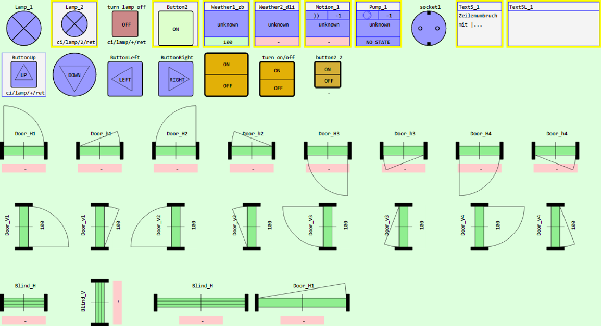

# Vue-Componenten f&uuml;r MQTT Steuer- und Anzeigeelemente
Projekt: vue_mqtt2_all, Version 30.11.2021   
[--> English Version](./README.md "English Version")  

Dieses Projekt enth&auml;lt viele Steuer- und Anzeigeelemente ("ci") zur Verwendung in Haussteuerungen. Als Basis f&uuml;r eine Steuerung kann das Beispiel [https://github.com/khartinger/mqtt4home/blob/main/md/m4h506_Vue_Mqtt2_Lamp.md](https://github.com/khartinger/mqtt4home/blob/main/md/m4h506_Vue_Mqtt2_Lamp.md) bzw. [https://github.com/khartinger/mqtt4home/tree/main/source_Vue/vue_mqtt2_lamp](https://github.com/khartinger/mqtt4home/tree/main/source_Vue/vue_mqtt2_lamp) dienen.

   
_Bild 1: MQTT Steuer- und Anzeigeelemente_   

---   

## Project setup
```
npm install
```

### Compiles and hot-reloads for development
```
npm run serve
```

### Compiles and minifies for production
```
npm run build
```

### Lints and fixes files
```
npm run lint
```

### Customize configuration
See [Configuration Reference](https://cli.vuejs.org/config/).
