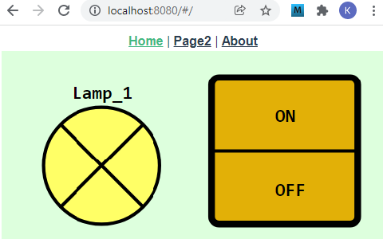
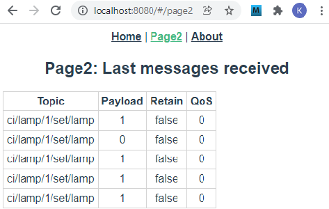
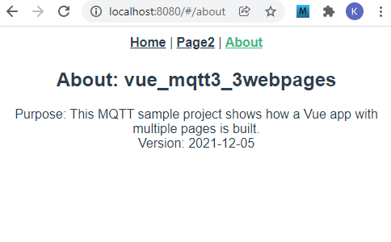
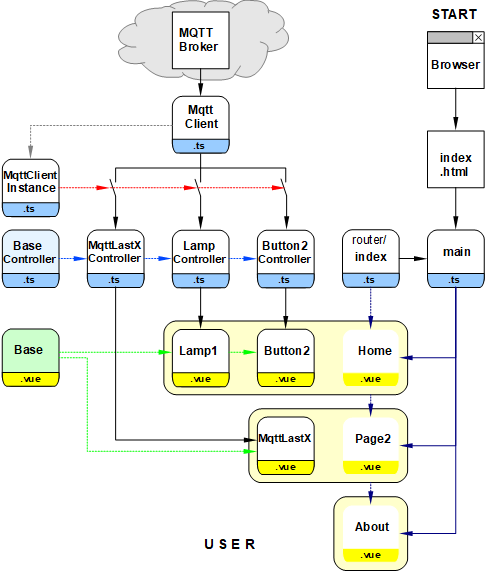

Last modified: 2021-12-07   
<table><tr><td></td><td>&nbsp;</td><td>
<h1>Creating a Vue project with multiple web pages</h1>
<a href="../../README.md">==> Home page</a> &nbsp; &nbsp; &nbsp; 
<a href="./LIESMICH.md">==> German version</a> &nbsp; &nbsp; &nbsp; 
</td></tr></table><hr>

## Target
This Vue project shows the creation of a web application with three pages:   
1. main page ("Home")   
  Representation of a lamp and a button that can be used to switch the lamp.   
2. history page ("Page2")   
  Display of the last five received MQTT commands.   
3. about page ("About")   
  Info about the application.   

   
_image 1: Main page of the multi-webpages project (Home)_   

   
_image 2: History page (Page2)_   

   
_image 3: About page (About)_   

## Required tools
* Hardware: PC or laptop with internet access, browser
* Hardware: Raspberry Pi (or PC) running an MQTT broker (e.g. Mosquitto)
* Software: Visual Studio Code ("VSC"), which is already prepared for Vue applications.   
   (I.e. (at least) one Vue application has already been created in Visual Code).   

Finished project: [https://github.com/khartinger/mqtt4home/tree/main/source_Vue/vue_mqtt3_3webpages](https://github.com/khartinger/mqtt4home/tree/main/source_Vue/vue_mqtt3_3webpages)

# Creating the project
## 1. overview of the involved files
   
_Fig. 4: Overview of the involved files_   

## 2. preparation of the Vue project in VSC (short version)   
1. start Visual Studio Code (VSC).   
2. VSC: Open terminal window: Men&uuml; Terminal - New Terminal.   
3. VSC terminal: Change to the folder under which the Vue project is to be created:   
   `cd /g/github/mqtt4home/source_Vue`.   
4. VSC-Terminal: Create Vue.js application: `vue create vue_mqtt3_2webpages`.  
   Use cursor keys, space bar and &lt;Enter&gt; to select the following:   
   `> Manually select features` &nbsp; &lt;Enter&gt;   
   `(*) Choose Vue version`   
   `(*) Babel`   
   `(*) TypeScript`   
   `(*) Router`   
   `(*) Linter / Formatter`   
   &lt;Enter&gt;   
   _`> 3.x`_ &nbsp; &lt;Enter&gt;      
   _`? Use class-style component syntax`_ &nbsp; __`N`__ &lt;Enter&gt;   
   _`? Use Babel alongside TypeScript (required for modern mode, auto-detected polyfills, transpiling JSX)?`_ &nbsp; __`N`__ &lt;Enter&gt;   
   _`? Use history mode for router? (Requires proper server setup for index fallback in production)`_ &nbsp; __`N`__ &lt;Enter&gt;   
   _`? Pick a linter / formatter config:`_ &nbsp; __`ESLint + Standard config`__ &lt;Enter&gt;   
   _`? Pick additional lint features: `_ &nbsp; __`Lint on save`__ &lt;Enter&gt;   
   _`? Where do you prefer placing config for Babel, ESLint, etc.?`_ &nbsp; __`In dedicated config file`__ &lt;Enter&gt;   
   _`? Save this as a preset for future projects? (y/N)`_ &nbsp; __`N`__ &lt;Enter&gt;   
5. switch to the project folder: _VSC Men&uuml; File - Folder &ouml;ffnen_..
   `/github/mqtt4home/source_Vue/vue_mqtt3_2webpages` [select folder].   
6. install MQTT library:   
   VSC: Open Terminal window: Men&uuml; Terminal - New Terminal.   
   `npm install mqtt --save`   
&nbsp;   
## 3 Customizing the automatically created files
### 3.1 Adding to the Vue configuration   
Create the file `vue.config.js`: click on the plus next to `VUE_MQTT3_2WEBPAGES`, enter name.   
_Content of file_:   
```   
module.exports = {
  lintOnSave: false,
  publicPath: './',
  configureWebpack: {
    devtool: 'source-map'
  }
}
```   

### 3.2 Disable linter warning "Unexpected any" for "(value: any)".    
  In the file `.eslintrc.js` under "`rules: {`" add:   
  ```   
  '@typescript-eslint/no-explicit-any': 'off',
  '@typescript-eslint/explicit-module-boundary-types': 'off'
  ```   

### 3.3 Create file for page `Page2   
Left-click on `views/About.vou`, copy the file with &lt;strg&gt; c and &lt;strg&gt; v and rename the copy to `Page2.vue` (e.g. with the help menu with the right mouse button).   
In the file `Page2.vue` adjust the line `<h1>This is Page2</h1>`.   

### 3.4 Adjust the "routes" in the automatically created `router/index.ts` file:   
```   
// ___________router/index.ts___________________________________
import { createRouter, createWebHashHistory, RouteRecordRaw } from 'vue-router'.
import Home from '../views/Home.vue
import Page2 from '../views/Page2.vue'

const routes: Array<RouteRecordRaw> = [
  {
    path: '/',
    name: 'Home',
    component: Home,
    meta: {
      title: 'vue_mqtt3_2webpages-Home'
    }
  },
  {
    path: '/page2',
    name: 'page2'
    component: page2,
    meta: {
      title: 'vue_mqtt3_2webpages-Home'
    }
  },
  {
    path: '/about',
    name: 'about' }
    // route-level code-splitting
    // this generates a separate chunk (about.[hash].js) for this route
    // which is lazy-loaded when the route is visited.
    component: () => import(/* webpackChunkName: "about" */ '../views/About.vue'),
    meta: {
      title: 'vue_mqtt3_2webpages-About'
    }
  }
]

const router = createRouter({
  history: createWebHashHistory(),
  routes
})

router.beforeEach((to, from, next) => {
  document.title = <string> to.meta.title
  next()
})

export default router

```   

### 3.5 Customize `App.vue` file   
The `App.vue` file is responsible for the following items:   
  * Displaying a link line with links to the individual pages.   
    Therefore: add the line `<router-link to="/page2">Page2</router-link> |`.   
  * Establishing the connection to the broker.   
    This should not be done in the "Home" page, otherwise the connection will be re-established every time the page is loaded.   
    The state of the connection is displayed in the link line.   
  * Definition of uniform styles for all pages.   
    Therefore: add dot to the styles.   

_Content of the file_:   
```   
<!--App.vue-->
<template>
  <div id="nav">
    <router-link to="/">Home</router-link> |
    <router-link to="/page2">Page2</router-link> |
    <router-link to="/about">About</router-link>
    &nbsp; &nbsp; &nbsp;
    <span v-if="isConnected">
      <b><font color="lightgreen">Connected to {{ getConnectUrl }}</font></b>
    </span>
    <span v-if="!isConnected && !isConnecting">
      <b><font color="red"> Not connected! &nbsp; </font></b>
      <button @click="connect()">Connect</button>
    </span>
    <span v-if=isConnecting>
      <b><font color="red"> Is connecting... &nbsp; </font></b>
      &nbsp; <button @click="cancel()">Cancel</button>
    </span>
  <router-view/>
</div>
</template>

<script lang="ts">
import { defineComponent } from 'vue'
import { mqttClientInstance } from '@/services/MqttClientInstance'

// ------MQTT broker parameter----------------------------------
const hostip = '10.1.1.1'
const hostport = 1884
const subtopic = '#'

export default defineComponent({
  name: 'Home',
  components: {
  },
  mounted: async function (): Promise<void> {
    mqttClientInstance.connect(hostip, hostport, '')
    mqttClientInstance.subscribe(subtopic, 0)
  },
  computed: {
    isConnected: function (): boolean {
      return mqttClientInstance.mqttState.connected
    },
    isConnecting: function (): boolean {
      if (mqttClientInstance.mqttState.iConnMqttState === 2) return true
      return false
    },
    isSubscribed: function (): boolean {
      return mqttClientInstance.mqttSubscription.subscribed
    },
    getMqttState: function (): string {
      return mqttClientInstance.sConnMqttState()
    },
    getConnectUrl: function (): string {
      return mqttClientInstance.connectUrl()
    }
  },
  methods: {
    connect: async function (): Promise<void> {
      if (!this.isConnected) {
        mqttClientInstance.connect(hostip, hostport, '')
        mqttClientInstance.subscribe(subtopic, 0)
      }
    },
    end: async function (): Promise<void> {
      mqttClientInstance.disconnect()
    },
    cancel: async function (): Promise<void> {
      mqttClientInstance.disconnect()
    }
  }
})

</script>

<style>
#app {
  font-family: Avenir, Helvetica, Arial, sans-serif;
  -webkit-font-smoothing: antialiased;
  -moz-osx-font-smoothing: grayscale;
  text-align: center;
  color: #2c3e50;
}

#nav {
  padding: 3px;
}

#nav a {
  font-weight: bold;
  color: #2c3e50;
}

#nav a.router-link-exact-active {
  color: #42b983;
}

  .fontOK    { font-weight: bold; fill: lightgreen; }
  .fontNOK   { font-weight: bold; fill: red; }

  .ciFont1   { font-size: 11px; font-weight: bold; font-family: monospace; fill: black; white-space: pre; }
  .cursor    { cursor: pointer; }
  .ciBackground {fill: #ddFFdd; }
  .ciOut     { fill: yellow; stroke: yellow; stroke-width: 1; }
  .ciInColor { fill: #F4F4F4; }
  .ciIn      { fill: #F4F4F4; stroke:blue; stroke-width: 1; }
  .ciLine    { stroke: blue; stroke-width: 1; }
  .ciRect    { fill: none; stroke: blue; stroke-width: 1; }
  .ciFillIt  { stroke: blue; stroke-width: 1; }
  .ciClick   { fill-opacity: 0.0; stroke-width: 1; }
  .ciBorder  { fill-opacity: 0.0; stroke: blue; stroke-width: 1; }
</style>
```   

### 3.6 Deleting unneeded files and directories   
  * Delete file `components/HelloWorld.vue   
  * Delete directory `assets   

## 4. add MQTT client
Create directory `src/services`, add files `MqttClient.ts` and `MqttClientInstance.ts`.   
For explanations see "Part 1: Creating the MQTT Client" in [m4h504_Vue_PubSub2_e.md](m4h504_Vue_PubSub2_e.md)

## 
## 6. create home page
The home page ("Home") contains the two control/display elements (CI elements) "Lamp" and "Button2", which are created using the following files:   
* [`components/CiBase.vue ... `](https://github.com/khartinger/mqtt4home/blob/main/source_Vue/vue_mqtt3_3webpages/src/components/CiBase.vue) Definition of geometry data (class Geo) as well as display of the border of the CI elements.   
* [`controller/CiBaseController.ts ... `](https://github.com/khartinger/mqtt4home/blob/main/source_Vue/vue_mqtt3_3webpages/src/controller/CiBaseController.ts) Definition of the base properties for all CI elements (interface IBase) as well as an abstract base controller (CiBaseController) with the definition of the methods `registerClient`, `publish` and `onMessage` required for all controllers.   
* [`components/CiLamp.vue ... `](https://github.com/khartinger/mqtt4home/blob/main/source_Vue/vue_mqtt3_3webpages/src/components/CiLamp.vue) Representation of the lamp symbol and realization of the function `onClk`, which is executed when the symbol is clicked.   
* [`controller/CiLampController.ts ... `](https://github.com/khartinger/mqtt4home/blob/main/source_Vue/vue_mqtt3_3webpages/src/controller/CiLampController.ts) Definition of the lamp properties, realization of the methods `onMessage` and `publish` (`publishCi`) and creation of an object `ciLampController`.   
* [`components/CiButton2.vue ... `](https://github.com/khartinger/mqtt4home/blob/main/source_Vue/vue_mqtt3_3webpages/src/components/CiButton2.vue) Representation of the switch symbol and realization of the functions `onClkON` and `onClkOff`, which are executed when clicking on the "ON" and "OFF" areas of the symbol.   
* [`controller/CiButton2Controller.ts ... `](https://github.com/khartinger/mqtt4home/blob/main/source_Vue/vue_mqtt3_3webpages/src/controller/CiButton2Controller.ts) Definition of the switch properties, realization of the `onMessage` and `publish` methods (`publishCi`) and creation of an object `ciButton2Controller`.   

These elements are built into the `views/Home.vue` page in the following way:   
```   
<!--src/views/Home.vue-->
<template>
    <svg viewBox="0 0 230 120" width="100%">
    <rect class="ciBackground" x="0" y="0" width="230" height="120" />
    <CiLamp    :x="60" :y="60" sid="lamp_1" :border="0"></CiLamp>
    <CiButton2 :x="170" :y="60" sid="button2_1" lines="0" :border="0"></CiButton2>
    </svg>
</template>

<script lang="ts">
// @ is an alias to /src
import { defineComponent } from 'vue'
import CiLamp from '@/components/CiLamp.vue'
import CiButton2 from '@/components/CiButton2.vue'

export default defineComponent({
  name: 'Home',
  components: {
    CiLamp,
    CiButton2
  }
})
</script>
```   
The lamp needs as parameters the center x and y and the ID. With `:border="0"` the drawing of a border is prevented. Since the number of lines (`lines=`) is not specified, the default `lines="1"` is used and the name of the lamp is displayed.   
The switch needs the center x and y and the ID as parameters. With `:border="0"` the drawing of a border and with `lines="0"` the display of further information is prevented.   

## 7. create page "Page2
The page "Page2" uses the component `MqttLastX` to display the last five received MQTT messages:   
* [`components/MqttLastX.vue ... `](https://github.com/khartinger/mqtt4home/blob/main/source_Vue/vue_mqtt3_3webpages/src/components/MqttLastX.vue) Displaying the table of the last messages.   
* [`controller/MqttLastXController.ts ... `](https://github.com/khartinger/mqtt4home/blob/main/source_Vue/vue_mqtt3_3webpages/src/controller/MqttLastXController.ts) Definition of the MqttLastXController class, which uses the `onMessage` method to write the received message to the MessageStore memory.   
* [`store/MessageStore.ts ... `](https://github.com/khartinger/mqtt4home/blob/main/source_Vue/vue_mqtt3_3webpages/src/store/MessageStore.ts) Encoding and exporting the `messages` store and the `addMessage` and `clearMessage` methods.   
These elements are built into the `views/Page2.vue` page in the following way:   
```   
<!--views/Page2.vue-->
<template>
  <div class="about">
    <h2>Page2: Last messages received</h2>
    <MqttLastX></MqttLastX>
    <hr>
  </div>
</template>

<script lang="ts">
// @ is an alias to /src
import { defineComponent } from 'vue'
import MqttLastX from '@/components/MqttLastX.vue'
export default defineComponent({
  name: 'Home',
  components: {
    MqttLastX
  }
})
</script>
```   

## 8. Create "About" page
The "About" page outputs text and shows how to create a link to another page within an SVG graphic.   
```   
<template>
  <div class="about">
    <h2>About: vue_mqtt3_3webpages</h2>
    Purpose: This MQTT sample project shows how a Vue app with multiple
    pages is built.<br>
    Version: 2021-12-05<br><br>
  </div>
  <svg viewBox="0 0 230 36" width="100%">
  <rect class="ciBackground" x="0" y="0" width="230" height="36" />
  <rect @click="onClk()" x="65" y="3" rx=6 ry=6 width="100" height="30" fill="#FFF831" stroke="gold" stroke-width="4"/>
  <text @click="onClk()" x="100" y="27" textLength="30" lengthAdjust="spacingAndGlyphs" class="fontAbout">OK</text>
</svg>
</template>

<script lang="ts">
import { defineComponent } from 'vue'
export default defineComponent({
  components: {
  },
  methods: {
    onClk: function () {
      console.log('CLICK - About: onClk!', '')
      this.$router.push({name: 'Home'})
    }
  }
})
</script>

<style scoped>
 .fontAbout { font: bold 24px sans-serif; fill: red; cursor: pointer; }
</style>
```   
