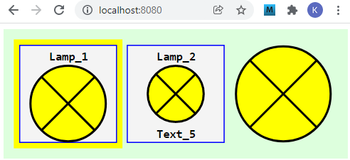
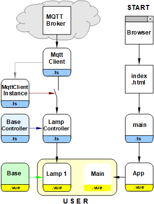

Last modified: 2021-12-09 <a name="up1"></a>   
<table><tr><td></td><td>&nbsp;</td><td>
<h1>How to create a Vue MQTT lamp symbol?</h1>
<a href="../../README.md">==> Home page</a> &nbsp; &nbsp; &nbsp; 
<a href="./LIESMICH.md">==> German version</a> &nbsp; &nbsp; &nbsp; 
</td></tr></table><hr>

This project "Vue: MQTT Lamp1" describes how to create a Vue lamp symbol that can send and receive MQTT messages and that can be easily integrated into your own web pages.   
First the [required tools](#required-tools) and then the [functional test](#functional-test), the [parameterization of the lamp symbol](#parameterization-of-the-lamp-symbol) and the [creation of the project](#creating-the-project) are described.    
   
_Fig. 1: Different variants of the lamp symbol_.   

# Required tools
* Hardware: PC or laptop with internet access, browser
* Hardware: Raspberry Pi (or PC) running an MQTT broker (e.g. Mosquitto)
* Software: Visual Studio Code ("VSC"), which is already prepared for Vue applications.   
   (I.e. at least one Vue application has already been created in Visual Code).   

# Functional test
## Requirements for the test   
1. the Raspberry Pi (RasPi) has been installed according to the [manual (section "Central")](../../LIESMICH.md), i.e. on the RasPi with IP '10.1.1.1' the broker program (Mosquitto) is running   
2. the Vue application is loaded in Visual Studio Code (VSC) and the internal server is running (input in terminal: `npm run serve`).   
3. there is a network/WLAN connection between the computer running VSC and the RasPi.   
4. a command/terminal window is open on the PC or Raspberry Pi showing received MQTT messages (enter `mosquitto_sub -h 10.1.1.1 -t "#" -v`).   

Note: If the RasPi has a different IP than 10.1.1.1, the IP must be adjusted in the `App.vue` file (`const hostip = '...'`).   
## Test   
* If you enter the address `localhost:8080` in the browser, _image 1_ appears in the brower.   
* If one clicks on the lamp symbol, a MQTT message `ci/lamp/1/set/lamp` with the payload `1` is sent. This is displayed in the command/terminal window.   
* ..ToDo..

# Parameterization of the lamp symbol
The parameterization of a lamp symbol is done in three steps:   
## Step 1: Definition of the lamp symbol
Each lamp must be entered in the lamp controller (file 'controller/CiLampController') in the array 'lamps':   
```   
  public lamps: Array<Lamp> = reactive(
    [
      {
        id: 'lamp1',
        name: 'Lamp_1',
        iLampState: -1,
        battery: '-',
        text5: 'Text_5',
        subTopic: 'ci/lamp/1/ret/lamp',
        pubTopic: 'ci/lamp/1/set/lamp',
        pubPayload: '-1'
      }
    ]
  );
```   
At least the properties `id`, `subtopic`, `iLampState` and `battery` must be specified.   
The specification of `name`, `text5`, `pubTopic` and `pubPayload` is optional.   
..ToDo: Explanations..

## Step 2: Representation of the lamp symbol in a .vue file
The representation of a lamp symbol is done in the `<template>` area of a Vue file, e.g.   
`<CiLamp :x="160" :y="50" sid="lamp1" lines="2" border="0"></CiLamp>`   
The center of the symbol (`x`, `y`) and the ID of the lamp (`sid=`) must be specified, where the ID must match the id in the lamp controller.   
The specification of `lines` and `border` is optional. If this specification is omitted, a symbol with header (= `name`) and yellow border will be drawn.   

## Step 3: Include the lamp symbol in a .vue file
To use the lamp symbol in the `<template>` area, two commands are required in the `<script>` area:   
* import lamp encoding:   
  `import CiLamp from './CiLamp.vue'`   
* Enumerate with the components used:   
  `components: {`   
  ` CiLamp`   
  `},`   

&nbsp;   

---   
# Creating the project
## 1. General
Since this project does not only include the creation of the lamp symbol but also the test of the installation of the outside of the three web pages, this project contains an MQTT connection and graphical elements, so that in total a lot of files come together.   
The following diagram gives an overview of the files involved:   

   
_Fig. 2: &Overview of the involved files_   

With the help of the diagram you can see some important relationships:   
* The names of the different web pages ("Home", "Page2" and "About") are defined in `router/index.ts` and `main.ts`.   
* The graphic elements `Lamp`, `Button2` and `MattLastX` each consist of a "controller" and "graphic" part (extension `.ts` and `.vue` respectively) and are derived from base components.   
* The connection to the MQTT broker is established &uuml;via the files `MqttClient.ts` and `MqttClientInstance.ts`, where all controllers must be registered in the file `MqttClientInstance.ts`. If this is forgotten, the controller will not receive MQTT messages ("switch open").   

## 2. Preparation of the Vue project in VSC (short version).   
1. Start Visual Studio Code (VSC).   
2. VSC: Open Terminal window: Menu Terminal - New Terminal.   
3. VSC terminal: Change to the folder under which the Vue project is to be created:   
   `cd /g/github/mqtt4home/source_Vue`   
4. VSC terminal: create Vue.js application:   
  `vue create vue_mqtt3_2webpages`  
  Use cursor keys, space bar and &lt;Enter&gt; to select the following:   
   `> Manually select features` &nbsp; &lt;Enter&gt;   
   `(*) Choose Vue version`   
   `(*) Babel`   
   `(*) TypeScript`   
   `( ) Router`   
   `(*) Linter / Formatter`   
   &lt;Enter&gt;   
   _`> 3.x`_ &nbsp; &lt;Enter&gt;      
   _`? Use class-style component syntax?`_ &nbsp; __`N`__ &lt;Enter&gt;   
   _`? Use Babel alongside TypeScript (required for modern mode, auto-detected polyfills, transpiling JSX)?`_ &nbsp; __`N`__ &lt;Enter&gt;   
   _`? Use history mode for router? (Requires proper server setup for index fallback in production)`_ &nbsp; __`N`__ &lt;Enter&gt;   
   _`? Pick a linter / formatter config:`_ &nbsp; __`ESLint + Standard config`__ &lt;Enter&gt;   
   _`? Pick additional lint features: `_ &nbsp; __`Lint on save`__ &lt;Enter&gt;   
   _`? Where do you prefer placing config for Babel, ESLint, etc.?`_ &nbsp; __`In dedicated config file`__ &lt;Enter&gt;   
   _`? Save this as a preset for future projects? (y/N)`_ &nbsp; __`N`__ &lt;Enter&gt;   
5. Switch to the project folder: _VSC Men&uuml; File - Folder &ouml;ffnen_..
   `/github/mqtt4home/source_Vue/vue_mqtt3_2webpages` [select folder].   
6. Install MQTT library:   
   VSC: Open Terminal window: Menu Terminal - New Terminal.   
   `npm install mqtt --save`   
&nbsp;   
## Customize the automatically created files
### Complementing the Vue configuration   
Create the file `vue.config.js`: click on the plus next to `VUE_MQTT_LAMP1`, enter name.   
_Contents of the file_:   
```   
// ______vue.config.js__________________________________________
module.exports = {
  lintOnSave: false,
  publicPath: './',
  // publicPath: process.env.NODE_ENV === 'production' ? './vue_pubsub2/' : './',
  configureWebpack: {
    devtool: 'source-map'
  },
  chainWebpack: config => {
    config.performance
      .maxEntrypointSize(400000)
      .maxAssetSize(400000)
  }
}
```   
With `publicPath: './',` the relative path is set and the `chainWebpack` entry avoids warnings regarding the file size (by setting the maximum file size higher ;) )

### Disable linter warning "Unexpected any" at "(value: any)".    
  In the file `.eslintrc.js` under "`rules: {`" add:   
  ```   
  '@typescript-eslint/no-explicit-any': 'off',
  '@typescript-eslint/explicit-module-boundary-types': 'off',
  ```   

### Customize `App.vue` file   
The `App.vue` file is responsible for the following:   
  * Display of the component `CiMain`.
  * Definition of uniform styles for all pages.   
    Therefore: Add all styles starting with a dot.   

_Content of the file_:   
```   
<!-- App.vue -->
<template>
  <CiMain></CiMain>
</template>

<script lang="ts">
import { defineComponent } from 'vue'
import CiMain from '@/components/CiMain.vue'

export default defineComponent({
  name: 'App',
  components: {
    CiMain
  }
})
</script>

<style>
#app {
  font-family: Avenir, Helvetica, Arial, sans-serif;
  text-align: left;
  color: black;
  margin-top: 0px;
}

  .styleM11  { font: bold 11px monospace; fill: black; white-space: pre; }
  .cursor    { cursor: pointer; }
  .ciBackground {fill: #ddFFdd; }
  .ciOut     { fill: yellow; stroke: yellow; stroke-width: 1; }
  .ciInColor { fill: #F4F4F4; }
  .ciIn      { fill: #F4F4F4; stroke:blue; stroke-width: 1; }
  .ciLine    { stroke: blue; stroke-width: 1; }
  .ciRect    { fill: none; stroke: blue; stroke-width: 1; }
  .ciFillIt  { stroke: blue; stroke-width: 1; }
  .ciClick   { fill-opacity: 0.0; stroke-width: 1; }
  .ciBorder  { fill-opacity: 0.0; stroke: blue; stroke-width: 1; }
</style>
```   

### Delete files and directories that are not needed.   
  * delete file `components/HelloWorld.vue`   
  * delete `assets` directory   

# 4. add to MQTT client
Create `src/services` directory, add `MqttClient.ts` and `MqttClientInstance.ts` files.   
For explanations see ["Part 1: Creating the MQTT Client" in m4h504_Vue_PubSub2.md](../../md/m4h504_Vue_PubSub2.md)


# Base symbol
The lamp symbol is derived from a base control/display symbol ("base CI symbol"), which also contains properties valid for other symbols. Therefore this is described first.   


# Lamp symbol

# Representation of the lamp symbol in Main.vue


[Top of page](#up)
